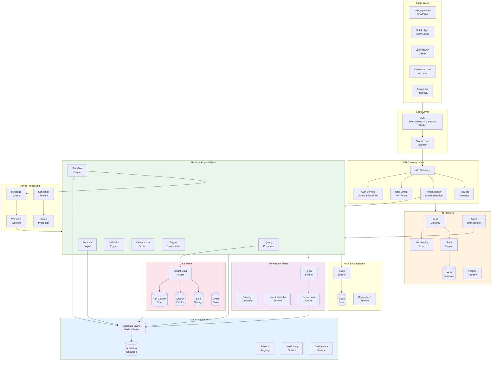
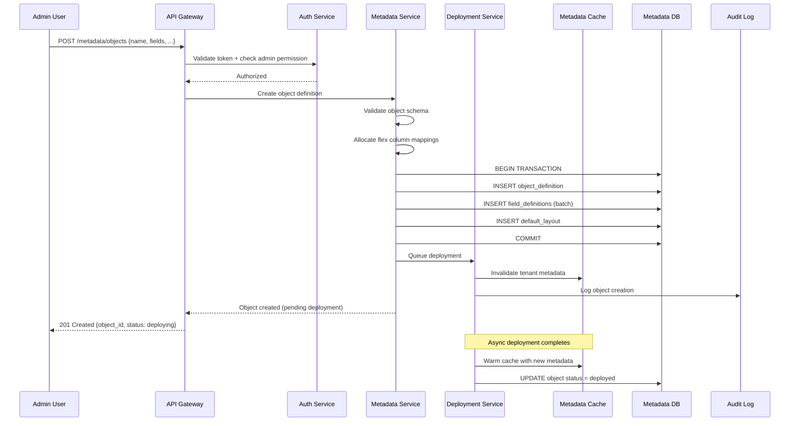
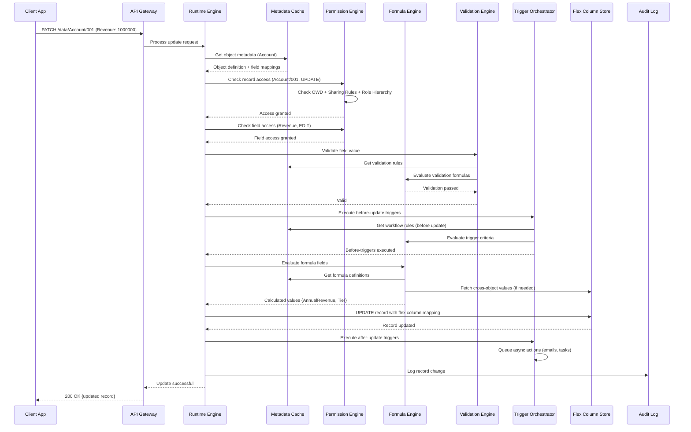
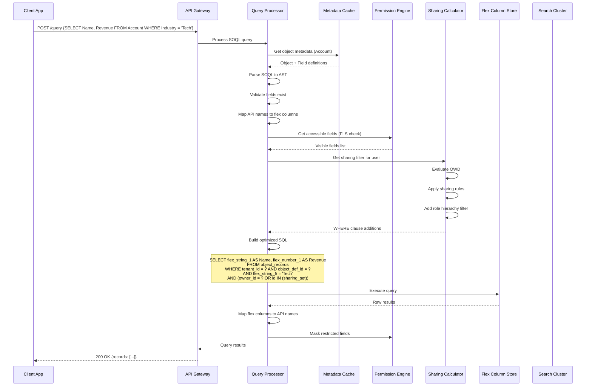
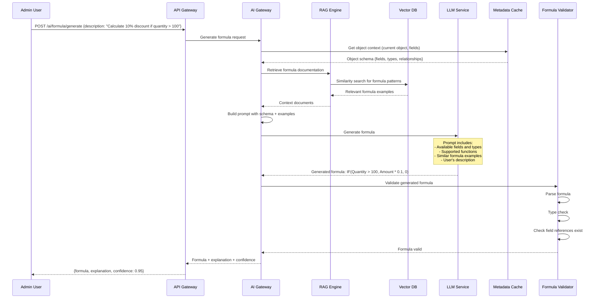
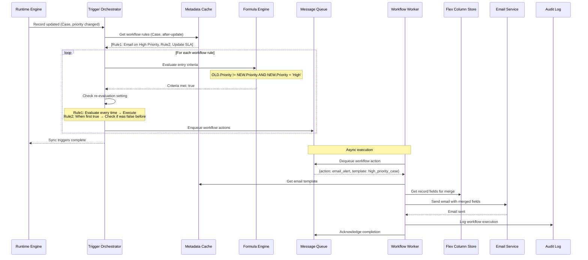
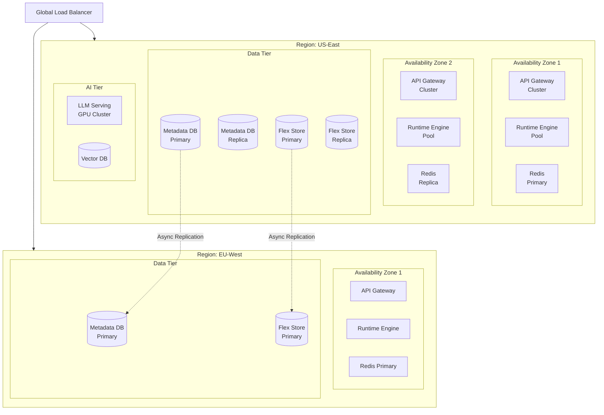

# High-Level Design

[Back to Index](./00-index.md)

---

## System Architecture



---

## Data Flow Diagrams

### 1. Custom Object Creation Flow



### 2. Record CRUD with Formula Evaluation Flow



### 3. Query Execution Flow



### 4. AI Formula Generation Flow



### 5. Workflow Trigger Execution Flow



---

## Key Architectural Decisions

### Decision 1: Flex Columns vs Schema-per-Tenant

| Option | Pros | Cons |
|--------|------|------|
| **Flex Columns (Chosen)** | No DDL, instant field creation, shared infrastructure | Query complexity, type coercion overhead |
| Schema-per-Tenant | Natural SQL, type safety | DDL latency, connection pool explosion, migration complexity |
| NoSQL Document Store | Flexible schema, easy nesting | Query limitations, transaction complexity |

**Decision:** Flex columns with metadata-driven mapping. This is the proven pattern from Salesforce's Force.com platform, enabling instant customization without database migrations.

**Implementation:**
- Pre-allocated columns: `flex_string_1..100`, `flex_number_1..50`, `flex_date_1..20`, `flex_boolean_1..20`, `flex_clob_1..10`
- Metadata tracks which flex column stores which custom field
- Runtime maps API field names to physical columns
- Indexes created on commonly filtered flex columns

---

### Decision 2: Metadata Caching Strategy

| Option | Pros | Cons |
|--------|------|------|
| **Multi-Layer Cache (Chosen)** | Low latency, cache hierarchy | Invalidation complexity |
| Single Distributed Cache | Simpler architecture | Higher latency, single point |
| No Cache (Direct DB) | Always consistent | Unacceptable latency at scale |

**Decision:** Three-layer caching (L1 in-process, L2 distributed, L3 CDN for static).

**Implementation:**
```
L1 (In-Process): 2GB per instance, 60s TTL
   - Hot object/field definitions
   - Compiled formula ASTs
   - User permission snapshots

L2 (Redis Cluster): 60GB shared, 5min TTL
   - All tenant metadata
   - Sharing calculations
   - Session data

L3 (CDN Edge): 15min TTL
   - Picklist values
   - Static layouts
   - Help text
```

**Invalidation Strategy:**
- Metadata change → Publish to invalidation topic → All instances clear L1 → Update L2
- Tenant-scoped invalidation keys: `metadata:{tenant_id}:{object_api_name}`

---

### Decision 3: Formula Engine Design

| Option | Pros | Cons |
|--------|------|------|
| **AST Interpreter (Chosen)** | Flexible, debuggable, safe | Slower than compiled |
| Compiled to Bytecode | Fast execution | Complex compilation, security risks |
| Transpile to SQL | Database-native execution | Limited function support, complex cross-object |

**Decision:** AST-based interpreter with compiled AST caching.

**Implementation:**
1. Parse formula text to tokens
2. Build Abstract Syntax Tree
3. Validate types and field references
4. Cache compiled AST
5. Evaluate AST with record context at runtime

**Optimization:**
- Short-circuit evaluation for logical operators
- Lazy loading of cross-object references
- Parallel evaluation of independent sub-expressions

---

### Decision 4: Workflow Execution Model

| Option | Pros | Cons |
|--------|------|------|
| **Hybrid Sync/Async (Chosen)** | Responsive UI, background processing | Complexity in state management |
| Fully Synchronous | Simple, predictable | Slow responses, timeout risk |
| Fully Asynchronous | Scalable | User confusion, eventual consistency |

**Decision:** Sync for validation/before-triggers, async for after-triggers/actions.

**Implementation:**
- **Before triggers:** Execute synchronously, can prevent save
- **After triggers (field updates):** Execute synchronously, included in transaction
- **After triggers (external actions):** Queue for async execution
- **Approval processes:** Fully async with status tracking

**Governor Limits:**
- Max trigger depth: 5 (prevent infinite recursion)
- Max sync execution time: 10 seconds
- Max async queue per transaction: 100 actions

---

### Decision 5: Permission Calculation Approach

| Option | Pros | Cons |
|--------|------|------|
| **On-Demand with Caching (Chosen)** | Accurate, reasonable latency | Cache invalidation complexity |
| Pre-Computed Sharing | Fast reads | Expensive writes, storage overhead |
| Pure On-Demand | Always accurate | Too slow for complex hierarchies |

**Decision:** On-demand calculation with aggressive caching and async pre-computation for common patterns.

**Implementation:**
- **Object/Field permissions:** Cached indefinitely, invalidated on permission set change
- **Record sharing:** Calculated on-demand, cached per user-record pair (5min TTL)
- **Role hierarchy:** Pre-computed tree, cached per tenant
- **Sharing rules:** Evaluated at query time, results cached

**Async Pre-Computation:**
- When sharing rule changes, queue recalculation jobs
- Large tenants: batch recalculation during low-traffic windows
- Share grants: immediately written to explicit share table

---

### Decision 6: AI Integration Architecture

| Option | Pros | Cons |
|--------|------|------|
| **Self-Hosted LLM with RAG (Chosen)** | Data privacy, customization | Infrastructure cost |
| External LLM API | Simple, no infrastructure | Data leaves platform, less control |
| Fine-Tuned Small Models | Fast, specialized | Training overhead, less flexible |

**Decision:** Self-hosted LLM cluster with RAG for context injection.

**Implementation:**
- LLM serving cluster (vLLM) for formula/workflow generation
- Vector database for documentation and example storage
- RAG pipeline injects schema context and similar examples
- Prompt registry for versioned, tested prompts
- Guardrails for output validation before applying

**AI Guardrails:**
- Formula syntax validation before suggesting
- Workflow action validation against available types
- Human approval required for production deployment
- Rate limiting per tenant

---

## Architecture Pattern Checklist

| Pattern | Decision | Justification |
|---------|----------|---------------|
| Sync vs Async | Hybrid | Responsive UI for reads, scalable for background work |
| Event-driven vs Request-response | Event-driven for workflows | Decoupled trigger execution |
| Push vs Pull | Pull for queries, Push for real-time | Standard for data platforms |
| Stateless vs Stateful | Stateless runtime engines | Horizontal scaling |
| Read-heavy vs Write-heavy | Read-heavy (80:20) | Caching optimized for reads |
| Real-time vs Batch | Real-time for UI, Batch for bulk operations | User experience vs throughput |
| Edge vs Origin | Edge for metadata cache | Global latency reduction |

---

## Component Interaction Matrix

| Component | Metadata Cache | Permission Engine | Data Store | AI Platform |
|-----------|---------------|-------------------|------------|-------------|
| **Query Processor** | Read object/field defs | Check FLS + Sharing | Execute queries | - |
| **Formula Engine** | Read formula ASTs | - | Fetch cross-object data | - |
| **Workflow Engine** | Read workflow rules | - | Update records | - |
| **UI Renderer** | Read layouts | Check FLS | - | - |
| **Validation Engine** | Read validation rules | - | - | - |
| **AI Gateway** | Read schema context | - | - | Generate formulas |

---

## Deployment Topology



---

## Technology Stack Summary

| Layer | Component | Technology | Justification |
|-------|-----------|------------|---------------|
| **Edge** | CDN | Cloudflare/Fastly | Global edge caching |
| **Gateway** | Load Balancer | Envoy | gRPC + HTTP support |
| **Gateway** | API Gateway | Kong/Custom | Rate limiting, routing |
| **Auth** | Identity | Custom + OIDC | Enterprise SSO |
| **Cache** | L1 | In-process (Caffeine) | Sub-ms reads |
| **Cache** | L2 | Redis Cluster | Distributed metadata |
| **Metadata** | Database | PostgreSQL | JSONB, partitioning |
| **Data** | Flex Store | CockroachDB/Vitess | Horizontal scaling |
| **Search** | Index | Elasticsearch | Full-text, aggregations |
| **AI** | LLM Serving | vLLM | High throughput |
| **AI** | Vector DB | Milvus | RAG retrieval |
| **Queue** | Message Broker | Kafka | Workflow events |
| **Async** | Workers | Custom | Workflow execution |
