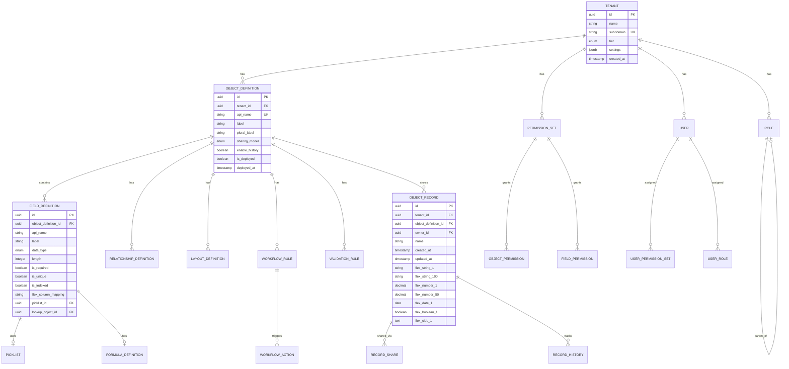

# Low-Level Design

[Back to Index](./00-index.md)

---

## Data Model

### Entity-Relationship Diagram



### Metadata Tables

```sql
-- =============================================================================
-- TENANT MANAGEMENT
-- =============================================================================

CREATE TABLE tenants (
    id UUID PRIMARY KEY DEFAULT gen_random_uuid(),
    name VARCHAR(255) NOT NULL,
    subdomain VARCHAR(100) UNIQUE NOT NULL,
    tier ENUM('starter', 'professional', 'enterprise') NOT NULL DEFAULT 'starter',
    status ENUM('active', 'suspended', 'trial', 'deleted') NOT NULL DEFAULT 'trial',
    settings JSONB NOT NULL DEFAULT '{}',
    limits JSONB NOT NULL DEFAULT '{}',  -- Custom limits override
    created_at TIMESTAMP NOT NULL DEFAULT NOW(),
    updated_at TIMESTAMP NOT NULL DEFAULT NOW(),
    deleted_at TIMESTAMP
);

CREATE INDEX idx_tenants_subdomain ON tenants(subdomain) WHERE deleted_at IS NULL;

-- =============================================================================
-- OBJECT DEFINITIONS (Custom Objects)
-- =============================================================================

CREATE TABLE object_definitions (
    id UUID PRIMARY KEY DEFAULT gen_random_uuid(),
    tenant_id UUID NOT NULL REFERENCES tenants(id),
    api_name VARCHAR(100) NOT NULL,  -- e.g., "Account", "Custom_Object__c"
    label VARCHAR(255) NOT NULL,
    plural_label VARCHAR(255) NOT NULL,
    description TEXT,

    -- Behavior Settings
    sharing_model ENUM('private', 'public_read', 'public_read_write', 'controlled_by_parent')
        NOT NULL DEFAULT 'private',
    enable_history BOOLEAN NOT NULL DEFAULT false,
    enable_activities BOOLEAN NOT NULL DEFAULT false,
    enable_search BOOLEAN NOT NULL DEFAULT true,
    enable_reports BOOLEAN NOT NULL DEFAULT true,
    enable_bulk_api BOOLEAN NOT NULL DEFAULT true,

    -- System Fields
    is_custom BOOLEAN NOT NULL DEFAULT true,
    is_deployed BOOLEAN NOT NULL DEFAULT false,
    deployment_status ENUM('pending', 'deploying', 'deployed', 'failed') DEFAULT 'pending',

    -- Versioning
    version INTEGER NOT NULL DEFAULT 1,
    deployed_at TIMESTAMP,

    created_at TIMESTAMP NOT NULL DEFAULT NOW(),
    updated_at TIMESTAMP NOT NULL DEFAULT NOW(),
    created_by UUID,
    updated_by UUID,

    UNIQUE(tenant_id, api_name)
);

CREATE INDEX idx_object_defs_tenant ON object_definitions(tenant_id) WHERE is_deployed = true;

-- =============================================================================
-- FIELD DEFINITIONS
-- =============================================================================

CREATE TABLE field_definitions (
    id UUID PRIMARY KEY DEFAULT gen_random_uuid(),
    object_definition_id UUID NOT NULL REFERENCES object_definitions(id) ON DELETE CASCADE,
    api_name VARCHAR(100) NOT NULL,
    label VARCHAR(255) NOT NULL,

    -- Data Type Configuration
    data_type ENUM(
        'text', 'textarea', 'rich_text',
        'number', 'currency', 'percent',
        'date', 'datetime', 'time',
        'boolean', 'picklist', 'multi_picklist',
        'lookup', 'master_detail', 'external_lookup',
        'formula', 'rollup_summary',
        'auto_number', 'email', 'phone', 'url',
        'encrypted_text', 'geolocation'
    ) NOT NULL,

    -- Type-specific settings
    length INTEGER,  -- For text types
    precision INTEGER,  -- Total digits for numbers
    scale INTEGER,  -- Decimal places

    -- Constraints
    is_required BOOLEAN NOT NULL DEFAULT false,
    is_unique BOOLEAN NOT NULL DEFAULT false,
    is_indexed BOOLEAN NOT NULL DEFAULT false,
    is_encrypted BOOLEAN NOT NULL DEFAULT false,
    is_external_id BOOLEAN NOT NULL DEFAULT false,

    -- Default Value
    default_value TEXT,
    default_value_formula TEXT,  -- Formula for dynamic default

    -- Storage Mapping
    flex_column_mapping VARCHAR(50),  -- e.g., "flex_string_1", "flex_number_3"

    -- Picklist Reference
    picklist_id UUID REFERENCES picklists(id),

    -- Lookup/Master-Detail Configuration
    lookup_object_id UUID REFERENCES object_definitions(id),
    lookup_filter_expression TEXT,  -- Optional filter for lookup
    relationship_name VARCHAR(100),  -- e.g., "Contacts" for Account -> Contact
    cascade_delete BOOLEAN DEFAULT false,  -- For master-detail

    -- Formula Configuration (if data_type = 'formula')
    formula_expression TEXT,
    formula_return_type VARCHAR(50),
    formula_compiled_ast JSONB,
    formula_referenced_fields TEXT[],  -- For dependency tracking

    -- Rollup Summary Configuration
    rollup_type ENUM('count', 'sum', 'min', 'max'),
    rollup_child_object_id UUID,
    rollup_field_id UUID,
    rollup_filter_expression TEXT,

    -- Display Settings
    help_text TEXT,
    description TEXT,
    inline_help_text VARCHAR(500),

    -- Deployment
    is_deployed BOOLEAN NOT NULL DEFAULT false,
    version INTEGER NOT NULL DEFAULT 1,

    created_at TIMESTAMP NOT NULL DEFAULT NOW(),
    updated_at TIMESTAMP NOT NULL DEFAULT NOW(),

    UNIQUE(object_definition_id, api_name)
);

CREATE INDEX idx_field_defs_object ON field_definitions(object_definition_id);
CREATE INDEX idx_field_defs_lookup ON field_definitions(lookup_object_id) WHERE lookup_object_id IS NOT NULL;

-- =============================================================================
-- RELATIONSHIP DEFINITIONS
-- =============================================================================

CREATE TABLE relationship_definitions (
    id UUID PRIMARY KEY DEFAULT gen_random_uuid(),
    tenant_id UUID NOT NULL REFERENCES tenants(id),

    -- Parent (referenced) side
    parent_object_id UUID NOT NULL REFERENCES object_definitions(id),
    parent_field_id UUID REFERENCES field_definitions(id),  -- Usually null (uses id)

    -- Child (referencing) side
    child_object_id UUID NOT NULL REFERENCES object_definitions(id),
    child_field_id UUID NOT NULL REFERENCES field_definitions(id),

    relationship_type ENUM('lookup', 'master_detail', 'many_to_many', 'self_lookup') NOT NULL,
    relationship_name VARCHAR(100) NOT NULL,  -- e.g., "Contacts", "Opportunities"

    -- Behavior
    cascade_delete BOOLEAN NOT NULL DEFAULT false,
    reparent_allowed BOOLEAN NOT NULL DEFAULT true,

    -- For many-to-many (junction object)
    junction_object_id UUID REFERENCES object_definitions(id),

    created_at TIMESTAMP NOT NULL DEFAULT NOW(),

    UNIQUE(child_object_id, child_field_id)
);

-- =============================================================================
-- PICKLISTS (Dropdown Values)
-- =============================================================================

CREATE TABLE picklists (
    id UUID PRIMARY KEY DEFAULT gen_random_uuid(),
    tenant_id UUID NOT NULL REFERENCES tenants(id),
    api_name VARCHAR(100) NOT NULL,
    is_global BOOLEAN NOT NULL DEFAULT false,  -- Shared across objects
    is_restricted BOOLEAN NOT NULL DEFAULT false,  -- Admin-only values

    UNIQUE(tenant_id, api_name)
);

CREATE TABLE picklist_values (
    id UUID PRIMARY KEY DEFAULT gen_random_uuid(),
    picklist_id UUID NOT NULL REFERENCES picklists(id) ON DELETE CASCADE,
    value VARCHAR(255) NOT NULL,
    label VARCHAR(255) NOT NULL,
    is_default BOOLEAN NOT NULL DEFAULT false,
    is_active BOOLEAN NOT NULL DEFAULT true,
    sort_order INTEGER NOT NULL DEFAULT 0,
    color VARCHAR(7),  -- Hex color for badges
    description TEXT,

    UNIQUE(picklist_id, value)
);

CREATE INDEX idx_picklist_values ON picklist_values(picklist_id, is_active, sort_order);

-- =============================================================================
-- LAYOUT DEFINITIONS (UI Metadata)
-- =============================================================================

CREATE TABLE layout_definitions (
    id UUID PRIMARY KEY DEFAULT gen_random_uuid(),
    object_definition_id UUID NOT NULL REFERENCES object_definitions(id) ON DELETE CASCADE,
    name VARCHAR(255) NOT NULL,
    layout_type ENUM('detail', 'edit', 'list', 'compact', 'highlight') NOT NULL,
    is_default BOOLEAN NOT NULL DEFAULT false,

    -- Layout Structure (JSONB for flexibility)
    sections JSONB NOT NULL DEFAULT '[]',
    /*
    sections structure:
    [
      {
        "label": "Account Information",
        "columns": 2,
        "collapsible": true,
        "collapsed_by_default": false,
        "fields": [
          {"api_name": "Name", "required": true, "readonly": false},
          {"api_name": "Industry", "required": false, "readonly": false}
        ]
      }
    ]
    */

    related_lists JSONB DEFAULT '[]',
    /*
    related_lists structure:
    [
      {
        "relationship_name": "Contacts",
        "columns": ["Name", "Email", "Phone"],
        "sort_by": "Name",
        "sort_order": "ASC",
        "row_limit": 6
      }
    ]
    */

    quick_actions JSONB DEFAULT '[]',
    highlight_panel JSONB,

    created_at TIMESTAMP NOT NULL DEFAULT NOW(),
    updated_at TIMESTAMP NOT NULL DEFAULT NOW(),

    UNIQUE(object_definition_id, name, layout_type)
);

-- Layout assignments (which profiles see which layouts)
CREATE TABLE layout_assignments (
    id UUID PRIMARY KEY DEFAULT gen_random_uuid(),
    layout_id UUID NOT NULL REFERENCES layout_definitions(id) ON DELETE CASCADE,
    profile_id UUID NOT NULL REFERENCES profiles(id),
    record_type_id UUID,  -- Optional record type filter

    UNIQUE(layout_id, profile_id, record_type_id)
);

-- =============================================================================
-- WORKFLOW RULES
-- =============================================================================

CREATE TABLE workflow_rules (
    id UUID PRIMARY KEY DEFAULT gen_random_uuid(),
    object_definition_id UUID NOT NULL REFERENCES object_definitions(id) ON DELETE CASCADE,
    name VARCHAR(255) NOT NULL,
    description TEXT,

    -- Trigger Configuration
    trigger_type ENUM(
        'created',
        'updated',
        'created_or_updated',
        'deleted'
    ) NOT NULL,

    -- Entry Criteria (when to fire)
    filter_criteria JSONB NOT NULL,
    /*
    filter_criteria structure:
    {
      "logic": "AND",  // or "OR", or "(1 AND 2) OR 3"
      "conditions": [
        {"field": "Status", "operator": "equals", "value": "Closed"},
        {"field": "Amount", "operator": "greater_than", "value": 10000},
        {"field": "Type", "operator": "in", "value": ["New", "Upgrade"]}
      ]
    }
    */

    -- Re-evaluation behavior
    re_evaluation ENUM('every_time', 'when_criteria_first_true') NOT NULL DEFAULT 'every_time',

    -- Execution Control
    is_active BOOLEAN NOT NULL DEFAULT true,
    execution_order INTEGER NOT NULL DEFAULT 0,

    -- Time-based trigger (optional)
    time_trigger_field_id UUID REFERENCES field_definitions(id),
    time_trigger_offset_days INTEGER,
    time_trigger_offset_hours INTEGER,

    created_at TIMESTAMP NOT NULL DEFAULT NOW(),
    updated_at TIMESTAMP NOT NULL DEFAULT NOW(),

    UNIQUE(object_definition_id, name)
);

CREATE TABLE workflow_actions (
    id UUID PRIMARY KEY DEFAULT gen_random_uuid(),
    workflow_rule_id UUID NOT NULL REFERENCES workflow_rules(id) ON DELETE CASCADE,

    action_type ENUM(
        'field_update',
        'email_alert',
        'task_creation',
        'outbound_message',
        'flow_trigger',
        'custom_action'
    ) NOT NULL,

    execution_order INTEGER NOT NULL DEFAULT 0,
    is_immediate BOOLEAN NOT NULL DEFAULT true,  -- vs time-triggered

    -- Action-specific configuration
    action_config JSONB NOT NULL,
    /*
    field_update:
    {"field_api_name": "Status", "value_type": "literal", "value": "Approved"}
    {"field_api_name": "Score", "value_type": "formula", "formula": "Amount * 0.1"}

    email_alert:
    {"template_id": "uuid", "recipients": ["owner", "created_by"], "additional_emails": [...]}

    task_creation:
    {"subject": "Follow up on {!Name}", "assignee": "owner", "due_date_offset": 7}

    outbound_message:
    {"endpoint_url": "https://...", "fields": ["Id", "Name", "Amount"]}

    flow_trigger:
    {"flow_id": "uuid", "input_mappings": {...}}
    */

    created_at TIMESTAMP NOT NULL DEFAULT NOW()
);

CREATE INDEX idx_workflow_rules_object ON workflow_rules(object_definition_id, is_active);

-- =============================================================================
-- VALIDATION RULES
-- =============================================================================

CREATE TABLE validation_rules (
    id UUID PRIMARY KEY DEFAULT gen_random_uuid(),
    object_definition_id UUID NOT NULL REFERENCES object_definitions(id) ON DELETE CASCADE,
    name VARCHAR(255) NOT NULL,
    description TEXT,

    -- Validation formula (returns true if INVALID)
    formula_expression TEXT NOT NULL,
    formula_compiled_ast JSONB,

    -- Error configuration
    error_message TEXT NOT NULL,
    error_display_field VARCHAR(100),  -- Optional: show error on specific field

    is_active BOOLEAN NOT NULL DEFAULT true,

    created_at TIMESTAMP NOT NULL DEFAULT NOW(),
    updated_at TIMESTAMP NOT NULL DEFAULT NOW(),

    UNIQUE(object_definition_id, name)
);

-- =============================================================================
-- FLEX COLUMN DATA STORE (Object Records)
-- =============================================================================

CREATE TABLE object_records (
    -- Primary Key
    id UUID PRIMARY KEY DEFAULT gen_random_uuid(),

    -- Tenant & Object Identification
    tenant_id UUID NOT NULL,
    object_definition_id UUID NOT NULL,

    -- System Fields
    name VARCHAR(255),  -- Standard Name field
    owner_id UUID NOT NULL,
    created_by UUID NOT NULL,
    created_at TIMESTAMP NOT NULL DEFAULT NOW(),
    updated_by UUID NOT NULL,
    updated_at TIMESTAMP NOT NULL DEFAULT NOW(),
    is_deleted BOOLEAN NOT NULL DEFAULT false,
    deleted_at TIMESTAMP,

    -- Record Type (for objects with multiple record types)
    record_type_id UUID,

    -- Flex String Columns (VARCHAR(255))
    flex_string_1 VARCHAR(255),
    flex_string_2 VARCHAR(255),
    flex_string_3 VARCHAR(255),
    -- ... continue to flex_string_100
    flex_string_100 VARCHAR(255),

    -- Flex Number Columns (DECIMAL(18,4))
    flex_number_1 DECIMAL(18, 4),
    flex_number_2 DECIMAL(18, 4),
    flex_number_3 DECIMAL(18, 4),
    -- ... continue to flex_number_50
    flex_number_50 DECIMAL(18, 4),

    -- Flex Date Columns
    flex_date_1 DATE,
    flex_date_2 DATE,
    -- ... continue to flex_date_20
    flex_date_20 DATE,

    -- Flex Datetime Columns
    flex_datetime_1 TIMESTAMP,
    flex_datetime_2 TIMESTAMP,
    -- ... continue to flex_datetime_20
    flex_datetime_20 TIMESTAMP,

    -- Flex Boolean Columns
    flex_boolean_1 BOOLEAN,
    flex_boolean_2 BOOLEAN,
    -- ... continue to flex_boolean_20
    flex_boolean_20 BOOLEAN,

    -- Flex CLOB Columns (TEXT - for long text, rich text)
    flex_clob_1 TEXT,
    flex_clob_2 TEXT,
    -- ... continue to flex_clob_10
    flex_clob_10 TEXT,

    -- Full-text Search Vector
    searchable_text TSVECTOR,

    -- Partitioning: by tenant_id for large-scale deployments
    PRIMARY KEY (id, tenant_id)
) PARTITION BY HASH (tenant_id);

-- Create partitions (example: 64 partitions)
CREATE TABLE object_records_p0 PARTITION OF object_records FOR VALUES WITH (MODULUS 64, REMAINDER 0);
CREATE TABLE object_records_p1 PARTITION OF object_records FOR VALUES WITH (MODULUS 64, REMAINDER 1);
-- ... continue for all 64 partitions

-- Indexes
CREATE INDEX idx_records_tenant_object ON object_records(tenant_id, object_definition_id);
CREATE INDEX idx_records_owner ON object_records(tenant_id, owner_id);
CREATE INDEX idx_records_created ON object_records(tenant_id, created_at);
CREATE INDEX idx_records_updated ON object_records(tenant_id, updated_at);
CREATE INDEX idx_records_name ON object_records(tenant_id, object_definition_id, name);
CREATE INDEX idx_records_search ON object_records USING GIN(searchable_text);

-- Conditional indexes on flex columns (created dynamically based on field definitions)
-- Example: CREATE INDEX idx_records_flex_string_1 ON object_records(tenant_id, object_definition_id, flex_string_1);

-- =============================================================================
-- PERMISSION & SHARING
-- =============================================================================

CREATE TABLE profiles (
    id UUID PRIMARY KEY DEFAULT gen_random_uuid(),
    tenant_id UUID NOT NULL REFERENCES tenants(id),
    name VARCHAR(255) NOT NULL,
    description TEXT,
    is_system BOOLEAN NOT NULL DEFAULT false,  -- System profiles cannot be deleted

    -- Default permissions for new objects
    default_object_permissions JSONB NOT NULL DEFAULT '{"read": true}',

    created_at TIMESTAMP NOT NULL DEFAULT NOW(),

    UNIQUE(tenant_id, name)
);

CREATE TABLE permission_sets (
    id UUID PRIMARY KEY DEFAULT gen_random_uuid(),
    tenant_id UUID NOT NULL REFERENCES tenants(id),
    name VARCHAR(255) NOT NULL,
    label VARCHAR(255) NOT NULL,
    description TEXT,
    is_custom BOOLEAN NOT NULL DEFAULT true,

    created_at TIMESTAMP NOT NULL DEFAULT NOW(),

    UNIQUE(tenant_id, name)
);

CREATE TABLE object_permissions (
    id UUID PRIMARY KEY DEFAULT gen_random_uuid(),
    permission_set_id UUID NOT NULL REFERENCES permission_sets(id) ON DELETE CASCADE,
    object_definition_id UUID NOT NULL REFERENCES object_definitions(id) ON DELETE CASCADE,

    can_create BOOLEAN NOT NULL DEFAULT false,
    can_read BOOLEAN NOT NULL DEFAULT false,
    can_edit BOOLEAN NOT NULL DEFAULT false,
    can_delete BOOLEAN NOT NULL DEFAULT false,
    view_all_records BOOLEAN NOT NULL DEFAULT false,
    modify_all_records BOOLEAN NOT NULL DEFAULT false,

    UNIQUE(permission_set_id, object_definition_id)
);

CREATE TABLE field_permissions (
    id UUID PRIMARY KEY DEFAULT gen_random_uuid(),
    permission_set_id UUID NOT NULL REFERENCES permission_sets(id) ON DELETE CASCADE,
    field_definition_id UUID NOT NULL REFERENCES field_definitions(id) ON DELETE CASCADE,

    can_read BOOLEAN NOT NULL DEFAULT true,
    can_edit BOOLEAN NOT NULL DEFAULT false,

    UNIQUE(permission_set_id, field_definition_id)
);

CREATE TABLE roles (
    id UUID PRIMARY KEY DEFAULT gen_random_uuid(),
    tenant_id UUID NOT NULL REFERENCES tenants(id),
    name VARCHAR(255) NOT NULL,
    label VARCHAR(255) NOT NULL,
    parent_role_id UUID REFERENCES roles(id),  -- For hierarchy

    -- Materialized path for efficient hierarchy queries
    hierarchy_path TEXT NOT NULL,  -- e.g., "/ceo/vp_sales/sales_manager/"
    hierarchy_level INTEGER NOT NULL DEFAULT 0,

    created_at TIMESTAMP NOT NULL DEFAULT NOW(),

    UNIQUE(tenant_id, name)
);

CREATE INDEX idx_roles_hierarchy ON roles(tenant_id, hierarchy_path);

CREATE TABLE sharing_rules (
    id UUID PRIMARY KEY DEFAULT gen_random_uuid(),
    object_definition_id UUID NOT NULL REFERENCES object_definitions(id) ON DELETE CASCADE,
    name VARCHAR(255) NOT NULL,
    description TEXT,

    -- Rule Type
    rule_type ENUM('owner_based', 'criteria_based') NOT NULL,

    -- For owner-based: share records owned by users in this role/group
    share_from_role_id UUID REFERENCES roles(id),
    share_from_group_id UUID,

    -- For criteria-based: share records matching this criteria
    criteria JSONB,

    -- Share to role/group
    share_to_role_id UUID REFERENCES roles(id),
    share_to_group_id UUID,

    -- Access level granted
    access_level ENUM('read', 'read_write') NOT NULL,

    is_active BOOLEAN NOT NULL DEFAULT true,

    UNIQUE(object_definition_id, name)
);

-- Explicit record shares (manual sharing)
CREATE TABLE record_shares (
    id UUID PRIMARY KEY DEFAULT gen_random_uuid(),
    record_id UUID NOT NULL,
    tenant_id UUID NOT NULL,

    -- Shared with
    user_id UUID,
    role_id UUID,
    group_id UUID,

    access_level ENUM('read', 'read_write') NOT NULL,
    share_reason ENUM('owner', 'manual', 'rule', 'team', 'territory') NOT NULL,

    created_at TIMESTAMP NOT NULL DEFAULT NOW(),
    created_by UUID,

    -- One of user_id, role_id, or group_id must be set
    CHECK (
        (user_id IS NOT NULL AND role_id IS NULL AND group_id IS NULL) OR
        (user_id IS NULL AND role_id IS NOT NULL AND group_id IS NULL) OR
        (user_id IS NULL AND role_id IS NULL AND group_id IS NOT NULL)
    )
);

CREATE INDEX idx_record_shares_record ON record_shares(tenant_id, record_id);
CREATE INDEX idx_record_shares_user ON record_shares(tenant_id, user_id) WHERE user_id IS NOT NULL;

-- =============================================================================
-- HISTORY TRACKING
-- =============================================================================

CREATE TABLE record_history (
    id UUID PRIMARY KEY DEFAULT gen_random_uuid(),
    record_id UUID NOT NULL,
    tenant_id UUID NOT NULL,
    object_definition_id UUID NOT NULL,

    field_api_name VARCHAR(100) NOT NULL,
    old_value TEXT,
    new_value TEXT,

    changed_by UUID NOT NULL,
    changed_at TIMESTAMP NOT NULL DEFAULT NOW(),

    -- Partition by tenant and time
    PRIMARY KEY (id, tenant_id, changed_at)
) PARTITION BY RANGE (changed_at);

-- Monthly partitions
CREATE TABLE record_history_2026_01 PARTITION OF record_history
    FOR VALUES FROM ('2026-01-01') TO ('2026-02-01');
-- ... create monthly partitions

CREATE INDEX idx_record_history ON record_history(tenant_id, record_id, changed_at DESC);
```

---

## API Design

### Metadata API

```yaml
openapi: 3.0.0
info:
  title: Metadata API
  version: v1

paths:
  /services/metadata/v1/objects:
    get:
      summary: List all object definitions
      parameters:
        - name: include_system
          in: query
          schema:
            type: boolean
            default: false
      responses:
        200:
          content:
            application/json:
              schema:
                type: array
                items:
                  $ref: '#/components/schemas/ObjectDefinitionSummary'

    post:
      summary: Create a custom object
      requestBody:
        content:
          application/json:
            schema:
              $ref: '#/components/schemas/CreateObjectRequest'
      responses:
        201:
          content:
            application/json:
              schema:
                $ref: '#/components/schemas/ObjectDefinition'

  /services/metadata/v1/objects/{api_name}:
    get:
      summary: Get object definition with all fields
      parameters:
        - name: api_name
          in: path
          required: true
          schema:
            type: string
      responses:
        200:
          content:
            application/json:
              schema:
                $ref: '#/components/schemas/ObjectDefinitionFull'

  /services/metadata/v1/objects/{api_name}/fields:
    post:
      summary: Create a custom field
      requestBody:
        content:
          application/json:
            schema:
              $ref: '#/components/schemas/CreateFieldRequest'
      responses:
        201:
          content:
            application/json:
              schema:
                $ref: '#/components/schemas/FieldDefinition'

  /services/metadata/v1/objects/{api_name}/workflows:
    get:
      summary: List workflow rules for object
    post:
      summary: Create a workflow rule

  /services/metadata/v1/objects/{api_name}/validations:
    get:
      summary: List validation rules for object
    post:
      summary: Create a validation rule

  /services/metadata/v1/objects/{api_name}/layouts:
    get:
      summary: List layouts for object
    post:
      summary: Create a layout

components:
  schemas:
    CreateObjectRequest:
      type: object
      required:
        - api_name
        - label
      properties:
        api_name:
          type: string
          pattern: '^[A-Za-z][A-Za-z0-9_]*(__c)?$'
        label:
          type: string
        plural_label:
          type: string
        description:
          type: string
        sharing_model:
          type: string
          enum: [private, public_read, public_read_write]
          default: private
        enable_history:
          type: boolean
          default: false
        fields:
          type: array
          items:
            $ref: '#/components/schemas/CreateFieldRequest'

    CreateFieldRequest:
      type: object
      required:
        - api_name
        - label
        - data_type
      properties:
        api_name:
          type: string
        label:
          type: string
        data_type:
          type: string
          enum: [text, number, date, boolean, picklist, lookup, formula, ...]
        length:
          type: integer
        is_required:
          type: boolean
          default: false
        default_value:
          type: string
        formula_expression:
          type: string
        lookup_object:
          type: string
        picklist_values:
          type: array
          items:
            type: object
            properties:
              value:
                type: string
              label:
                type: string
              is_default:
                type: boolean
```

### Data API

```yaml
paths:
  /services/data/v1/sobjects/{object_api_name}:
    get:
      summary: Query records (simple)
      parameters:
        - name: object_api_name
          in: path
          required: true
        - name: fields
          in: query
          description: Comma-separated field names
        - name: where
          in: query
          description: Filter expression
        - name: order_by
          in: query
        - name: limit
          in: query
          schema:
            type: integer
            default: 100
            maximum: 2000
        - name: offset
          in: query
      responses:
        200:
          content:
            application/json:
              schema:
                $ref: '#/components/schemas/QueryResult'

    post:
      summary: Create a record
      requestBody:
        content:
          application/json:
            schema:
              type: object
              additionalProperties: true
      responses:
        201:
          content:
            application/json:
              schema:
                $ref: '#/components/schemas/CreateRecordResponse'

  /services/data/v1/sobjects/{object_api_name}/{record_id}:
    get:
      summary: Get a record by ID
      parameters:
        - name: fields
          in: query
          description: Comma-separated field names (default: all accessible)
      responses:
        200:
          content:
            application/json:
              schema:
                $ref: '#/components/schemas/Record'

    patch:
      summary: Update a record
      requestBody:
        content:
          application/json:
            schema:
              type: object
              additionalProperties: true
      responses:
        200:
          content:
            application/json:
              schema:
                $ref: '#/components/schemas/Record'

    delete:
      summary: Delete a record
      responses:
        204:
          description: Deleted successfully

  /services/data/v1/query:
    post:
      summary: Execute SOQL-like query
      requestBody:
        content:
          application/json:
            schema:
              type: object
              properties:
                query:
                  type: string
                  example: "SELECT Id, Name, Amount FROM Opportunity WHERE StageName = 'Closed Won'"
      responses:
        200:
          content:
            application/json:
              schema:
                $ref: '#/components/schemas/QueryResult'

  /services/data/v1/composite/sobjects:
    post:
      summary: Batch create/update records
      requestBody:
        content:
          application/json:
            schema:
              type: object
              properties:
                allOrNone:
                  type: boolean
                  default: false
                records:
                  type: array
                  items:
                    type: object
                    properties:
                      attributes:
                        type: object
                        properties:
                          type:
                            type: string
                          referenceId:
                            type: string
                      # Field values
      responses:
        200:
          content:
            application/json:
              schema:
                type: array
                items:
                  $ref: '#/components/schemas/SaveResult'

components:
  schemas:
    QueryResult:
      type: object
      properties:
        totalSize:
          type: integer
        done:
          type: boolean
        nextRecordsUrl:
          type: string
        records:
          type: array
          items:
            $ref: '#/components/schemas/Record'

    Record:
      type: object
      properties:
        attributes:
          type: object
          properties:
            type:
              type: string
            url:
              type: string
        Id:
          type: string
        # Dynamic fields based on object
      additionalProperties: true
```

### AI API

```yaml
paths:
  /services/ai/v1/formula/generate:
    post:
      summary: Generate formula from natural language
      requestBody:
        content:
          application/json:
            schema:
              type: object
              required:
                - description
                - object_api_name
              properties:
                description:
                  type: string
                  example: "Calculate 10% discount if quantity is greater than 100"
                object_api_name:
                  type: string
                return_type:
                  type: string
                  enum: [text, number, date, boolean, currency, percent]
      responses:
        200:
          content:
            application/json:
              schema:
                type: object
                properties:
                  formula:
                    type: string
                  explanation:
                    type: string
                  confidence:
                    type: number
                  warnings:
                    type: array
                    items:
                      type: string

  /services/ai/v1/workflow/generate:
    post:
      summary: Generate workflow rule from natural language
      requestBody:
        content:
          application/json:
            schema:
              type: object
              required:
                - description
                - object_api_name
              properties:
                description:
                  type: string
                  example: "Send email to owner when case priority is set to High"
                object_api_name:
                  type: string
      responses:
        200:
          content:
            application/json:
              schema:
                $ref: '#/components/schemas/WorkflowRuleDraft'

  /services/ai/v1/schema/recommend:
    post:
      summary: Recommend schema from business description
      requestBody:
        content:
          application/json:
            schema:
              type: object
              required:
                - description
              properties:
                description:
                  type: string
                  example: "I need to track customer support tickets with priority, status, and assignment"
      responses:
        200:
          content:
            application/json:
              schema:
                type: object
                properties:
                  objects:
                    type: array
                    items:
                      $ref: '#/components/schemas/ObjectRecommendation'
                  relationships:
                    type: array
                    items:
                      $ref: '#/components/schemas/RelationshipRecommendation'
                  explanation:
                    type: string

  /services/ai/v1/query/natural:
    post:
      summary: Execute natural language query
      requestBody:
        content:
          application/json:
            schema:
              type: object
              required:
                - question
              properties:
                question:
                  type: string
                  example: "Show me all opportunities closing this month with amount over 50000"
      responses:
        200:
          content:
            application/json:
              schema:
                type: object
                properties:
                  generated_query:
                    type: string
                  results:
                    $ref: '#/components/schemas/QueryResult'
                  explanation:
                    type: string
```

---

## Core Algorithms

### Algorithm 1: Formula Parser and Evaluator

```
FORMULA ENGINE ALGORITHM

=== DATA STRUCTURES ===

AST_NODE:
  type: ENUM(FIELD_REF, LITERAL, FUNCTION_CALL, BINARY_OP, UNARY_OP, CONDITIONAL)
  value: ANY
  children: LIST[AST_NODE]
  data_type: ENUM(TEXT, NUMBER, DATE, DATETIME, BOOLEAN, NULL)

EVALUATION_CONTEXT:
  record: MAP[field_name -> value]
  related_records: MAP[relationship_path -> record]
  old_record: MAP[field_name -> value]  // For PRIORVALUE
  user_context: USER_INFO

=== PARSING ALGORITHM ===

FUNCTION parse_formula(formula_text) -> AST_NODE:
    tokens = tokenize(formula_text)
    ast = parse_expression(tokens, 0)
    validate_types(ast)
    RETURN ast

FUNCTION tokenize(text) -> LIST[TOKEN]:
    tokens = []
    i = 0
    WHILE i < LENGTH(text):
        SKIP whitespace

        IF text[i] IS letter:
            // Identifier or function name
            identifier = read_identifier(text, i)
            IF next_char IS '(':
                tokens.append(TOKEN(FUNCTION, identifier))
            ELSE:
                tokens.append(TOKEN(IDENTIFIER, identifier))

        ELSE IF text[i] IS digit:
            number = read_number(text, i)
            tokens.append(TOKEN(NUMBER, number))

        ELSE IF text[i] IS '"' OR "'":
            string = read_string(text, i)
            tokens.append(TOKEN(STRING, string))

        ELSE IF text[i:i+2] IN ['==', '!=', '<=', '>=', '&&', '||']:
            tokens.append(TOKEN(OPERATOR, text[i:i+2]))
            i += 2

        ELSE IF text[i] IN ['+', '-', '*', '/', '<', '>', '(', ')', ',']:
            tokens.append(TOKEN(OPERATOR, text[i]))
            i += 1

    RETURN tokens

FUNCTION parse_expression(tokens, precedence) -> AST_NODE:
    left = parse_unary(tokens)

    WHILE current_precedence(tokens) >= precedence:
        operator = consume_operator(tokens)
        right = parse_expression(tokens, current_precedence + 1)
        left = AST_NODE(
            type=BINARY_OP,
            value=operator,
            children=[left, right]
        )

    RETURN left

=== EVALUATION ALGORITHM ===

FUNCTION evaluate(ast_node, context) -> ANY:
    SWITCH ast_node.type:

        CASE LITERAL:
            RETURN ast_node.value

        CASE FIELD_REF:
            field_path = ast_node.value  // e.g., "Account.Name" or "Amount"
            IF '.' IN field_path:
                // Cross-object reference
                parts = SPLIT(field_path, '.')
                current = context.record
                FOR part IN parts[:-1]:
                    relationship = get_relationship(part)
                    IF relationship NOT IN context.related_records:
                        // Lazy load related record
                        context.related_records[relationship] =
                            fetch_related_record(current, relationship)
                    current = context.related_records[relationship]
                RETURN current[parts[-1]]
            ELSE:
                RETURN context.record[field_path]

        CASE FUNCTION_CALL:
            function_name = ast_node.value
            args = [evaluate(child, context) FOR child IN ast_node.children]
            RETURN call_function(function_name, args, context)

        CASE BINARY_OP:
            left = evaluate(ast_node.children[0], context)

            // Short-circuit evaluation for AND/OR
            IF ast_node.value == '&&' AND left == FALSE:
                RETURN FALSE
            IF ast_node.value == '||' AND left == TRUE:
                RETURN TRUE

            right = evaluate(ast_node.children[1], context)
            RETURN apply_operator(ast_node.value, left, right)

        CASE UNARY_OP:
            operand = evaluate(ast_node.children[0], context)
            IF ast_node.value == 'NOT':
                RETURN NOT operand
            IF ast_node.value == '-':
                RETURN -operand

        CASE CONDITIONAL:  // IF(condition, true_val, false_val)
            condition = evaluate(ast_node.children[0], context)
            IF condition:
                RETURN evaluate(ast_node.children[1], context)
            ELSE:
                RETURN evaluate(ast_node.children[2], context)

FUNCTION call_function(name, args, context) -> ANY:
    SWITCH name:
        CASE "IF":
            RETURN args[1] IF args[0] ELSE args[2]
        CASE "AND":
            RETURN ALL(args)
        CASE "OR":
            RETURN ANY(args)
        CASE "NOT":
            RETURN NOT args[0]
        CASE "ISBLANK":
            RETURN args[0] IS NULL OR args[0] == ''
        CASE "TEXT":
            RETURN STRING(args[0])
        CASE "VALUE":
            RETURN PARSE_NUMBER(args[0])
        CASE "TODAY":
            RETURN CURRENT_DATE()
        CASE "NOW":
            RETURN CURRENT_DATETIME()
        CASE "PRIORVALUE":
            field_name = args[0]
            RETURN context.old_record[field_name]
        CASE "LEN":
            RETURN LENGTH(args[0])
        CASE "LEFT":
            RETURN args[0][:args[1]]
        CASE "RIGHT":
            RETURN args[0][-args[1]:]
        CASE "MID":
            RETURN args[0][args[1]:args[1]+args[2]]
        CASE "ROUND":
            RETURN ROUND(args[0], args[1] IF LENGTH(args) > 1 ELSE 0)
        CASE "ABS":
            RETURN ABS(args[0])
        CASE "MAX":
            RETURN MAX(args)
        CASE "MIN":
            RETURN MIN(args)
        // ... more functions
```

### Algorithm 2: Permission Check Algorithm

```
PERMISSION CHECK ALGORITHM

FUNCTION check_record_access(user, record, operation) -> ACCESS_RESULT:
    // Step 1: Check object-level permission
    object_perm = get_object_permission(user, record.object_type)

    IF operation == READ AND NOT object_perm.can_read:
        RETURN ACCESS_DENIED("No read permission on object")
    IF operation == EDIT AND NOT object_perm.can_edit:
        RETURN ACCESS_DENIED("No edit permission on object")
    IF operation == DELETE AND NOT object_perm.can_delete:
        RETURN ACCESS_DENIED("No delete permission on object")

    // Step 2: Check for "View All" / "Modify All" permissions
    IF object_perm.view_all_records AND operation == READ:
        RETURN ACCESS_GRANTED("View All Records permission")
    IF object_perm.modify_all_records:
        RETURN ACCESS_GRANTED("Modify All Records permission")

    // Step 3: Check if user is the owner
    IF record.owner_id == user.id:
        RETURN ACCESS_GRANTED("Record owner")

    // Step 4: Check role hierarchy (manager sees subordinate's records)
    IF check_role_hierarchy(user, record.owner_id):
        RETURN ACCESS_GRANTED("Role hierarchy access")

    // Step 5: Check sharing rules
    sharing_access = check_sharing_rules(user, record)
    IF sharing_access.granted:
        IF operation == READ:
            RETURN ACCESS_GRANTED(sharing_access.reason)
        IF operation == EDIT AND sharing_access.level == 'read_write':
            RETURN ACCESS_GRANTED(sharing_access.reason)

    // Step 6: Check manual shares
    manual_share = get_manual_share(record.id, user.id)
    IF manual_share EXISTS:
        IF operation == READ:
            RETURN ACCESS_GRANTED("Manual share")
        IF operation == EDIT AND manual_share.access_level == 'read_write':
            RETURN ACCESS_GRANTED("Manual share with edit")

    // Step 7: Check team/territory membership
    IF check_team_access(user, record):
        RETURN ACCESS_GRANTED("Team membership")

    // Step 8: Check organization-wide defaults (OWD)
    owd = get_org_wide_default(record.object_type)
    IF owd == 'public_read_write':
        RETURN ACCESS_GRANTED("Public Read/Write OWD")
    IF owd == 'public_read' AND operation == READ:
        RETURN ACCESS_GRANTED("Public Read OWD")

    // No access path found
    RETURN ACCESS_DENIED("No sharing access")

FUNCTION check_role_hierarchy(user, owner_id) -> BOOLEAN:
    // Get user's role hierarchy path
    user_role = get_role(user.role_id)
    owner_role = get_role(get_user(owner_id).role_id)

    IF owner_role IS NULL:
        RETURN FALSE

    // Check if user's role is above owner's role in hierarchy
    // Using materialized path: "/ceo/vp_sales/sales_manager/"
    RETURN owner_role.hierarchy_path STARTS WITH user_role.hierarchy_path

FUNCTION check_sharing_rules(user, record) -> SHARING_ACCESS:
    object_id = record.object_definition_id
    rules = get_active_sharing_rules(object_id)

    FOR rule IN rules:
        // Check if rule applies to this record
        IF rule.rule_type == 'owner_based':
            owner_role = get_user_role(record.owner_id)
            IF NOT role_matches(owner_role, rule.share_from_role_id):
                CONTINUE

        ELSE IF rule.rule_type == 'criteria_based':
            IF NOT evaluate_criteria(rule.criteria, record):
                CONTINUE

        // Check if user is in the "share to" group
        IF user_in_share_target(user, rule):
            RETURN SHARING_ACCESS(
                granted=TRUE,
                level=rule.access_level,
                reason="Sharing rule: " + rule.name
            )

    RETURN SHARING_ACCESS(granted=FALSE)

FUNCTION get_accessible_fields(user, object_type, operation) -> SET[FIELD]:
    accessible = SET()

    // Get all permission sets assigned to user
    permission_sets = get_user_permission_sets(user)

    // Get all fields for the object
    all_fields = get_object_fields(object_type)

    FOR field IN all_fields:
        FOR perm_set IN permission_sets:
            field_perm = get_field_permission(perm_set, field.id)

            IF operation == READ AND field_perm.can_read:
                accessible.add(field)
                BREAK
            IF operation == EDIT AND field_perm.can_edit:
                accessible.add(field)
                BREAK

    RETURN accessible
```

### Algorithm 3: Workflow Trigger Evaluation

```
WORKFLOW TRIGGER ALGORITHM

FUNCTION execute_record_triggers(trigger_event, old_record, new_record, context):
    // Load applicable workflow rules
    rules = load_workflow_rules(
        object_id=new_record.object_definition_id,
        trigger_type=trigger_event,
        is_active=TRUE
    )

    // Sort by execution order
    rules = SORT(rules, BY execution_order)

    // Track trigger depth for cascade prevention
    IF context.trigger_depth >= MAX_TRIGGER_DEPTH:
        RAISE TriggerDepthExceededException()
    context.trigger_depth += 1

    // Separate immediate vs queued actions
    immediate_actions = []
    queued_actions = []

    FOR rule IN rules:
        // Evaluate entry criteria
        IF NOT evaluate_workflow_criteria(rule.filter_criteria, old_record, new_record):
            CONTINUE

        // Check re-evaluation setting
        IF rule.re_evaluation == 'when_criteria_first_true':
            IF was_criteria_true_before(rule, old_record):
                CONTINUE  // Already triggered before

        // Collect actions
        FOR action IN rule.actions:
            IF action.is_immediate:
                immediate_actions.append((rule, action))
            ELSE:
                queued_actions.append((rule, action))

    // Execute immediate actions synchronously
    FOR (rule, action) IN immediate_actions:
        TRY:
            execute_immediate_action(action, new_record, context)
            log_workflow_execution(rule, action, "success")
        CATCH error:
            log_workflow_execution(rule, action, "failed", error)
            IF action.halt_on_error:
                RAISE WorkflowExecutionException(error)

    // Queue async actions
    FOR (rule, action) IN queued_actions:
        enqueue_workflow_action(
            action_id=action.id,
            record_id=new_record.id,
            context=serialize(context)
        )

    context.trigger_depth -= 1

FUNCTION evaluate_workflow_criteria(criteria, old_record, new_record) -> BOOLEAN:
    // criteria structure:
    // {"logic": "AND", "conditions": [...]}
    // {"logic": "(1 AND 2) OR 3", "conditions": [...]}

    // Evaluate each condition
    results = []
    FOR i, condition IN ENUMERATE(criteria.conditions):
        field = condition.field
        operator = condition.operator
        value = condition.value

        // Get field values
        new_value = new_record[field]
        old_value = old_record[field] IF old_record ELSE NULL

        // Special operators
        IF operator == 'changed':
            result = new_value != old_value
        ELSE IF operator == 'changed_to':
            result = new_value != old_value AND new_value == value
        ELSE IF operator == 'changed_from':
            result = new_value != old_value AND old_value == value
        ELSE:
            result = evaluate_condition(new_value, operator, value)

        results.append(result)

    // Apply logic
    IF criteria.logic == 'AND':
        RETURN ALL(results)
    ELSE IF criteria.logic == 'OR':
        RETURN ANY(results)
    ELSE:
        // Custom logic like "(1 AND 2) OR 3"
        RETURN evaluate_logic_expression(criteria.logic, results)

FUNCTION execute_immediate_action(action, record, context):
    SWITCH action.action_type:

        CASE 'field_update':
            config = action.action_config
            field_name = config.field_api_name

            IF config.value_type == 'literal':
                new_value = config.value
            ELSE IF config.value_type == 'formula':
                new_value = evaluate_formula(config.formula, record)
            ELSE IF config.value_type == 'null':
                new_value = NULL

            record[field_name] = new_value
            // Mark field as updated by workflow
            context.workflow_updated_fields.add(field_name)

        CASE 'task_creation':
            config = action.action_config
            task = {
                subject: merge_fields(config.subject, record),
                assignee: resolve_assignee(config.assignee, record),
                due_date: calculate_due_date(config.due_date_offset),
                related_to: record.id,
                priority: config.priority
            }
            create_record('Task', task, context)

        CASE 'email_alert':
            // Queue for async even if "immediate" to avoid blocking
            enqueue_email_alert(action.action_config, record)
```

### Algorithm 4: Metadata Resolution with Caching

```
METADATA RESOLUTION ALGORITHM

=== CACHE STRUCTURE ===

L1_CACHE: In-process cache (per instance)
  Key: "{tenant_id}:{object_api_name}"
  Value: ObjectMetadata
  TTL: 60 seconds
  Max Size: 2GB

L2_CACHE: Distributed cache (Redis)
  Key: "meta:{tenant_id}:{object_api_name}"
  Value: Compressed ObjectMetadata JSON
  TTL: 5 minutes

=== RESOLUTION ALGORITHM ===

FUNCTION resolve_object_metadata(tenant_id, object_api_name) -> ObjectMetadata:
    cache_key = "{tenant_id}:{object_api_name}"

    // Step 1: Check L1 cache
    metadata = L1_CACHE.get(cache_key)
    IF metadata IS NOT NULL:
        RETURN metadata

    // Step 2: Check L2 cache
    compressed_data = L2_CACHE.get("meta:" + cache_key)
    IF compressed_data IS NOT NULL:
        metadata = decompress_and_deserialize(compressed_data)
        L1_CACHE.put(cache_key, metadata, TTL=60s)
        RETURN metadata

    // Step 3: Load from database
    metadata = load_metadata_from_db(tenant_id, object_api_name)

    // Step 4: Populate caches
    compressed = compress_and_serialize(metadata)
    L2_CACHE.put("meta:" + cache_key, compressed, TTL=5m)
    L1_CACHE.put(cache_key, metadata, TTL=60s)

    RETURN metadata

FUNCTION load_metadata_from_db(tenant_id, object_api_name) -> ObjectMetadata:
    // Load object definition
    object_def = DB.query("""
        SELECT * FROM object_definitions
        WHERE tenant_id = ? AND api_name = ? AND is_deployed = true
    """, tenant_id, object_api_name)

    IF object_def IS NULL:
        RAISE ObjectNotFoundException(object_api_name)

    // Load field definitions
    fields = DB.query("""
        SELECT * FROM field_definitions
        WHERE object_definition_id = ? AND is_deployed = true
        ORDER BY api_name
    """, object_def.id)

    // Build field map and flex column mappings
    field_map = {}
    flex_mapping = {}
    FOR field IN fields:
        field_map[field.api_name] = field
        IF field.flex_column_mapping:
            flex_mapping[field.api_name] = field.flex_column_mapping

    // Load relationships
    relationships = DB.query("""
        SELECT * FROM relationship_definitions
        WHERE parent_object_id = ? OR child_object_id = ?
    """, object_def.id, object_def.id)

    // Load active validation rules
    validations = DB.query("""
        SELECT * FROM validation_rules
        WHERE object_definition_id = ? AND is_active = true
    """, object_def.id)

    // Compile formula ASTs for fields with formulas
    FOR field IN fields:
        IF field.data_type == 'formula' AND field.formula_compiled_ast IS NULL:
            field.formula_compiled_ast = compile_formula(field.formula_expression)

    RETURN ObjectMetadata(
        definition=object_def,
        fields=field_map,
        flex_mapping=flex_mapping,
        relationships=relationships,
        validations=validations
    )

=== CACHE INVALIDATION ===

FUNCTION invalidate_metadata(tenant_id, object_api_name):
    cache_key = "{tenant_id}:{object_api_name}"

    // Invalidate L2 first (distributed)
    L2_CACHE.delete("meta:" + cache_key)

    // Publish invalidation event for all instances to clear L1
    publish_event("metadata_invalidation", {
        tenant_id: tenant_id,
        object_api_name: object_api_name,
        timestamp: NOW()
    })

// Event handler on each instance
ON_EVENT("metadata_invalidation"):
    cache_key = "{event.tenant_id}:{event.object_api_name}"
    L1_CACHE.invalidate(cache_key)

FUNCTION warm_cache(tenant_id):
    // Called on tenant login or scheduled
    frequently_used = get_frequently_used_objects(tenant_id)

    FOR object_api_name IN frequently_used:
        // Pre-load into cache
        resolve_object_metadata(tenant_id, object_api_name)
```

### Algorithm 5: Flex Column Allocation

```
FLEX COLUMN ALLOCATION ALGORITHM

=== COLUMN POOLS ===

COLUMN_POOLS = {
    'text': ['flex_string_1', 'flex_string_2', ..., 'flex_string_100'],
    'long_text': ['flex_clob_1', 'flex_clob_2', ..., 'flex_clob_10'],
    'number': ['flex_number_1', 'flex_number_2', ..., 'flex_number_50'],
    'date': ['flex_date_1', 'flex_date_2', ..., 'flex_date_20'],
    'datetime': ['flex_datetime_1', ..., 'flex_datetime_20'],
    'boolean': ['flex_boolean_1', ..., 'flex_boolean_20']
}

TYPE_TO_POOL = {
    'text': 'text',
    'textarea': 'long_text',
    'rich_text': 'long_text',
    'number': 'number',
    'currency': 'number',
    'percent': 'number',
    'date': 'date',
    'datetime': 'datetime',
    'time': 'text',  // Store as string
    'boolean': 'boolean',
    'picklist': 'text',
    'multi_picklist': 'text',
    'lookup': 'text',  // Store ID as string
    'master_detail': 'text',
    'email': 'text',
    'phone': 'text',
    'url': 'text',
    'auto_number': 'text',
    'encrypted_text': 'text'
}

=== ALLOCATION ALGORITHM ===

FUNCTION allocate_flex_column(tenant_id, object_id, data_type) -> STRING:
    pool_type = TYPE_TO_POOL[data_type]
    available_columns = COLUMN_POOLS[pool_type]

    // Get already allocated columns for this object
    allocated = DB.query("""
        SELECT flex_column_mapping
        FROM field_definitions
        WHERE object_definition_id = ?
        AND flex_column_mapping IS NOT NULL
    """, object_id)

    allocated_set = SET(allocated)

    // Find first available column
    FOR column IN available_columns:
        IF column NOT IN allocated_set:
            RETURN column

    // No columns available
    RAISE ColumnPoolExhaustedException(
        pool_type,
        "Maximum fields of type {pool_type} reached for this object"
    )

FUNCTION create_field_with_allocation(tenant_id, object_id, field_spec) -> FieldDefinition:
    // Validate field spec
    validate_field_spec(field_spec)

    // Formula fields don't need storage
    IF field_spec.data_type == 'formula':
        flex_column = NULL
    // Rollup summary computed at query time
    ELSE IF field_spec.data_type == 'rollup_summary':
        flex_column = NULL
    ELSE:
        // Allocate flex column
        flex_column = allocate_flex_column(tenant_id, object_id, field_spec.data_type)

    // Create field definition
    field = DB.insert("""
        INSERT INTO field_definitions (
            object_definition_id, api_name, label, data_type,
            length, is_required, is_unique, is_indexed,
            flex_column_mapping, ...
        ) VALUES (?, ?, ?, ?, ?, ?, ?, ?, ?, ...)
    """, object_id, field_spec.api_name, field_spec.label,
        field_spec.data_type, field_spec.length, field_spec.is_required,
        field_spec.is_unique, field_spec.is_indexed, flex_column, ...)

    // If indexed, create database index
    IF field_spec.is_indexed AND flex_column IS NOT NULL:
        create_flex_column_index(tenant_id, object_id, flex_column)

    RETURN field

FUNCTION create_flex_column_index(tenant_id, object_id, flex_column):
    // Create partial index for this tenant+object combination
    index_name = "idx_{tenant_id}_{object_id}_{flex_column}"

    // Check if index already exists (shared by fields of same type)
    IF index_exists(index_name):
        RETURN

    // Create index asynchronously to avoid blocking
    enqueue_job("create_index", {
        sql: """
            CREATE INDEX CONCURRENTLY {index_name}
            ON object_records (tenant_id, object_definition_id, {flex_column})
            WHERE tenant_id = '{tenant_id}' AND object_definition_id = '{object_id}'
        """
    })
```

---

## Query Translation Example

**SOQL Input:**
```sql
SELECT Id, Name, Account.Name, Amount, StageName
FROM Opportunity
WHERE StageName = 'Closed Won' AND Amount > 100000
ORDER BY Amount DESC
LIMIT 10
```

**Translated SQL:**
```sql
SELECT
    r.id AS "Id",
    r.name AS "Name",
    acc.name AS "Account.Name",
    r.flex_number_1 AS "Amount",      -- Mapped from metadata
    r.flex_string_3 AS "StageName"    -- Mapped from metadata
FROM object_records r
LEFT JOIN object_records acc
    ON acc.id = r.flex_string_5::uuid  -- Account lookup field
    AND acc.tenant_id = r.tenant_id
WHERE r.tenant_id = '{{tenant_id}}'
    AND r.object_definition_id = '{{opportunity_object_id}}'
    AND r.flex_string_3 = 'Closed Won'
    AND r.flex_number_1 > 100000
    AND r.is_deleted = false
    -- Sharing filter injected based on user permissions
    AND (
        r.owner_id = '{{user_id}}'
        OR r.id IN (SELECT record_id FROM record_shares WHERE user_id = '{{user_id}}')
        OR '{{user_role_path}}' LIKE (
            SELECT hierarchy_path || '%'
            FROM roles
            WHERE id = (SELECT role_id FROM users WHERE id = r.owner_id)
        )
    )
ORDER BY r.flex_number_1 DESC
LIMIT 10
```
