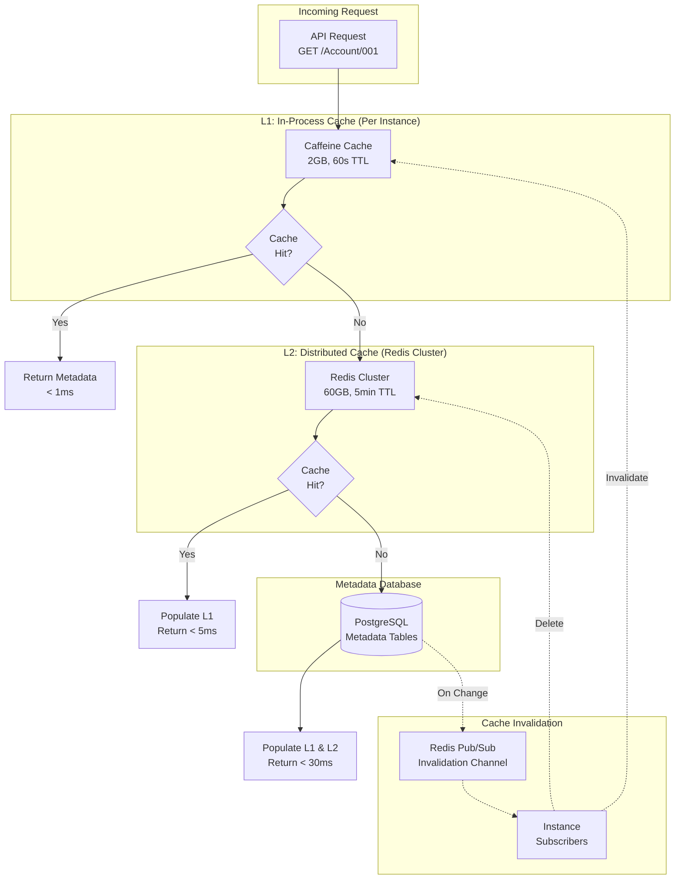
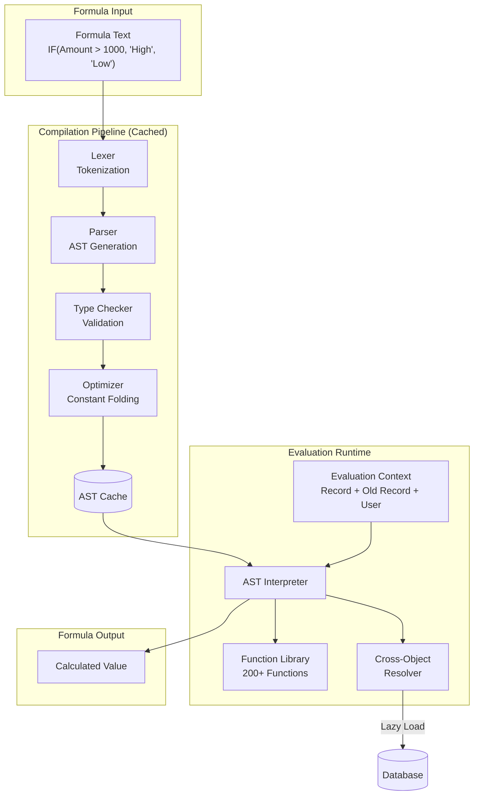
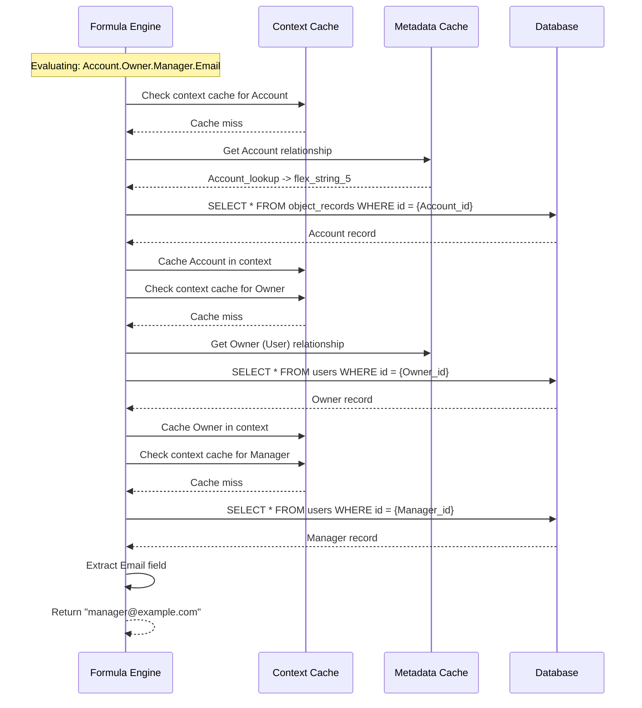
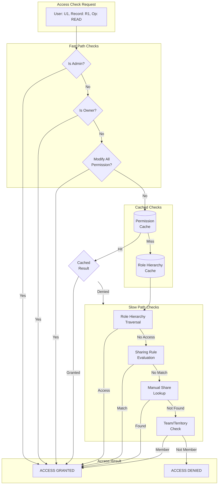

# Deep Dive & Bottlenecks

[Back to Index](./00-index.md)

---

## Critical Component 1: Metadata Cache

### Why Critical

Every single API operation in the platform requires metadata resolution:
- Record read → Object definition + Field mappings + FLS permissions
- Record write → Object definition + Field mappings + Validation rules + Workflow triggers
- Query → Object definition + Field mappings + Sharing rules + Index hints
- UI render → Layout definition + Field definitions + Related lists

**Impact of Cache Miss:**
- Database query for object definition: ~5ms
- Database query for fields (50+ fields): ~10ms
- Database query for validations: ~3ms
- Database query for workflows: ~5ms
- **Total uncached metadata fetch: 20-30ms per request**

At 30,000 QPS peak, uncached metadata would generate **900,000 database queries per second** - an impossible load.

### Architecture Deep Dive



### Cache Entry Structure

```
METADATA CACHE ENTRY:

ObjectMetadata {
    // Object Definition
    id: UUID
    api_name: STRING
    label: STRING
    sharing_model: ENUM
    enable_history: BOOLEAN

    // Field Definitions (Map for O(1) lookup)
    fields: MAP[api_name -> FieldMetadata]

    // Flex Column Mapping (for SQL generation)
    flex_mapping: MAP[api_name -> flex_column_name]

    // Reverse Mapping (for result transformation)
    reverse_flex_mapping: MAP[flex_column_name -> api_name]

    // Pre-compiled Formula ASTs
    formula_asts: MAP[field_api_name -> CompiledAST]

    // Validation Rules (pre-compiled)
    validations: LIST[ValidationRule]

    // Workflow Rules (for trigger evaluation)
    workflows: MAP[trigger_type -> LIST[WorkflowRule]]

    // Relationships (for join generation)
    relationships: LIST[RelationshipDefinition]

    // Layout Metadata (optional, loaded separately)
    layouts: MAP[profile_id -> LayoutDefinition]

    // Cache Metadata
    cached_at: TIMESTAMP
    version: INTEGER
    size_bytes: INTEGER
}

Estimated Size per Object:
- Base definition: 500 bytes
- 50 fields × 200 bytes = 10 KB
- 10 validations × 500 bytes = 5 KB
- 5 workflows × 1 KB = 5 KB
- Relationships: 2 KB
- Compiled ASTs: 5 KB
Total: ~27 KB per object

Cache Capacity:
- L1 (2GB): ~74,000 objects
- L2 (60GB): ~2.2M objects
```

### Failure Modes & Recovery

| Failure Mode | Impact | Detection | Recovery |
|--------------|--------|-----------|----------|
| **L1 Cache Full** | Eviction of cold objects | Memory monitoring | LRU eviction, increase instance count |
| **L2 Cache Down** | All requests hit DB | Health check failures | Fallback to L1 only, increased TTL |
| **L2 Network Partition** | Stale reads possible | Connectivity monitoring | Accept staleness, invalidation queue |
| **Invalidation Lag** | Stale metadata served | Version mismatch detection | Force refresh on write, version check |
| **Thundering Herd** | DB overload on cold start | Request spike detection | Request coalescing, probabilistic refresh |

### Cache Stampede Prevention

```
ALGORITHM: Probabilistic Early Expiration (PER)

FUNCTION get_metadata_with_per(tenant_id, object_api_name):
    cache_key = build_key(tenant_id, object_api_name)
    entry = L1_CACHE.get(cache_key)

    IF entry IS NOT NULL:
        // Probabilistic early refresh
        time_remaining = entry.expires_at - NOW()
        total_ttl = 60 seconds

        // Probability increases as expiration approaches
        // At 10% TTL remaining, ~10% chance of refresh
        IF RANDOM() < (1 - time_remaining / total_ttl) * 0.1:
            // Async refresh, return current value
            ASYNC refresh_metadata(tenant_id, object_api_name)

        RETURN entry.value

    // Cache miss - use request coalescing
    RETURN fetch_with_coalescing(cache_key, tenant_id, object_api_name)

FUNCTION fetch_with_coalescing(cache_key, tenant_id, object_api_name):
    // Check if fetch already in progress
    in_flight = IN_FLIGHT_REQUESTS.get(cache_key)
    IF in_flight IS NOT NULL:
        // Wait for existing fetch
        RETURN in_flight.await()

    // Start new fetch
    promise = new Promise()
    IN_FLIGHT_REQUESTS.put(cache_key, promise)

    TRY:
        metadata = load_from_db_and_cache(tenant_id, object_api_name)
        promise.complete(metadata)
        RETURN metadata
    FINALLY:
        IN_FLIGHT_REQUESTS.remove(cache_key)
```

---

## Critical Component 2: Formula Engine

### Why Critical

Formulas are evaluated in multiple contexts:
- **Formula Fields:** Calculated on every record read
- **Validation Rules:** Evaluated on every record save
- **Workflow Criteria:** Evaluated to determine trigger execution
- **Default Values:** Evaluated on record creation
- **Rollup Summaries:** Aggregated across child records

**Performance Impact:**
- Simple formula (e.g., `Amount * 0.1`): 0.1ms
- Cross-object formula (e.g., `Account.Industry`): 1-5ms (requires join)
- Complex nested formula: 1-10ms
- At 30K QPS with 2 formulas/request: 60K formula evaluations/second

### Architecture Deep Dive



### Circular Dependency Detection

Formulas can reference other formula fields, creating potential cycles.

```
ALGORITHM: Circular Dependency Detection

FUNCTION validate_formula_dependencies(object_id, new_formula_field, formula_ast):
    // Build dependency graph for this object
    dep_graph = build_dependency_graph(object_id)

    // Add new formula's dependencies
    referenced_fields = extract_field_references(formula_ast)
    dep_graph.add_node(new_formula_field)

    FOR field IN referenced_fields:
        IF field.is_formula:
            dep_graph.add_edge(new_formula_field -> field)

    // Detect cycle using DFS
    visited = SET()
    rec_stack = SET()

    FUNCTION dfs(node):
        visited.add(node)
        rec_stack.add(node)

        FOR neighbor IN dep_graph.neighbors(node):
            IF neighbor NOT IN visited:
                IF dfs(neighbor):
                    RETURN TRUE  // Cycle found
            ELSE IF neighbor IN rec_stack:
                RETURN TRUE  // Back edge = cycle

        rec_stack.remove(node)
        RETURN FALSE

    IF dfs(new_formula_field):
        RAISE CircularDependencyException(
            "Formula creates circular dependency"
        )

    // Determine evaluation order using topological sort
    evaluation_order = topological_sort(dep_graph)
    RETURN evaluation_order
```

### Cross-Object Reference Resolution



### Performance Optimizations

| Optimization | Description | Benefit |
|--------------|-------------|---------|
| **AST Caching** | Compile once, evaluate many times | Avoid parsing overhead |
| **Short-Circuit Evaluation** | Stop AND on first false, OR on first true | Skip unnecessary computation |
| **Lazy Cross-Object Loading** | Only fetch related records when needed | Reduce unnecessary queries |
| **Batch Cross-Object Fetch** | Prefetch related records for bulk operations | N+1 → 2 queries |
| **Constant Folding** | Pre-compute constant expressions | `5 + 3` → `8` at compile time |
| **Expression Result Caching** | Cache sub-expression results | Avoid redundant calculations |

### Failure Modes

| Failure Mode | Impact | Prevention |
|--------------|--------|------------|
| **Stack Overflow (Deep Nesting)** | Crash | Max nesting depth limit (10) |
| **Infinite Loop in Formula** | Hang | Max iteration limit, timeout |
| **Division by Zero** | Error | Explicit check, return NULL |
| **Type Mismatch** | Error | Compile-time type checking |
| **Missing Cross-Object Record** | NULL propagation | Graceful NULL handling |
| **Large String Concatenation** | Memory exhaustion | Max string length limit |

---

## Critical Component 3: Permission Calculator

### Why Critical

Record-level access control is evaluated on:
- Every record read (query results filtering)
- Every record update (can user modify this record?)
- Every record delete (can user delete this record?)
- UI rendering (show/hide records in lists)

**Complexity:**
- Organization-Wide Defaults (OWD) → Base access level
- Sharing Rules → Criteria-based or ownership-based sharing
- Role Hierarchy → Managers see subordinate records
- Manual Shares → Explicit record-level grants
- Team Membership → Territory or account team access

**Performance Challenge:**
- Simple check (owner): 0.1ms
- Role hierarchy check: 1-5ms (hierarchy traversal)
- Sharing rule evaluation: 5-20ms (criteria matching)
- Complex sharing: 10-50ms (multiple rules, large hierarchies)

### Architecture Deep Dive



### Sharing Recalculation

When sharing configuration changes, affected records must be recalculated.

```
ALGORITHM: Incremental Sharing Recalculation

TRIGGER_EVENTS = [
    'sharing_rule_created',
    'sharing_rule_updated',
    'sharing_rule_deleted',
    'role_hierarchy_changed',
    'user_role_changed',
    'record_ownership_changed',
    'group_membership_changed'
]

FUNCTION handle_sharing_change(event):
    SWITCH event.type:

        CASE 'sharing_rule_created':
            // Only need to ADD new shares
            rule = event.rule
            affected_records = find_records_matching_rule(rule)

            FOR batch IN chunk(affected_records, 1000):
                enqueue_job('add_implicit_shares', {
                    rule_id: rule.id,
                    record_ids: batch
                })

        CASE 'sharing_rule_deleted':
            // Need to REMOVE shares and recalculate from other rules
            rule = event.rule
            affected_shares = find_shares_from_rule(rule.id)

            FOR batch IN chunk(affected_shares, 1000):
                enqueue_job('recalculate_shares', {
                    record_ids: batch.record_ids
                })

        CASE 'role_hierarchy_changed':
            // Potentially affects all records in subtree
            affected_users = get_users_in_role_subtree(event.role_id)
            owned_records = get_records_owned_by(affected_users)

            // Invalidate permission cache for affected users
            FOR user_id IN affected_users:
                invalidate_permission_cache(user_id)

            // Recalculate in background
            enqueue_job('bulk_recalculate', {
                tenant_id: event.tenant_id,
                reason: 'role_hierarchy_change'
            })

        CASE 'record_ownership_changed':
            record = event.record
            old_owner = event.old_owner
            new_owner = event.new_owner

            // Remove shares based on old owner's role
            remove_role_based_shares(record.id, old_owner)

            // Add shares based on new owner's role
            add_role_based_shares(record.id, new_owner)

            // Recalculate sharing rules for this record
            recalculate_record_shares(record.id)

FUNCTION recalculate_record_shares(record_id):
    record = get_record(record_id)

    // Clear existing implicit shares (keep manual)
    DELETE FROM record_shares
    WHERE record_id = ? AND share_reason != 'manual'

    // Re-evaluate all sharing rules
    rules = get_active_sharing_rules(record.object_definition_id)

    FOR rule IN rules:
        IF rule.rule_type == 'criteria_based':
            IF evaluate_criteria(rule.criteria, record):
                grant_shares_from_rule(record, rule)

        ELSE IF rule.rule_type == 'owner_based':
            owner_role = get_user_role(record.owner_id)
            IF role_matches(owner_role, rule.share_from_role_id):
                grant_shares_from_rule(record, rule)

    // Add role hierarchy shares
    add_role_hierarchy_shares(record)
```

### Permission Cache Strategy

```
PERMISSION CACHE DESIGN:

Key Structure:
  "perm:{tenant_id}:{user_id}:{record_id}" -> ACCESS_LEVEL

  OR (for query filtering):

  "perm_set:{tenant_id}:{user_id}:{object_id}" -> SET[record_ids]

Cache Invalidation Triggers:
  1. User permission set assignment changes
  2. Sharing rule changes affecting user
  3. Role hierarchy changes affecting user
  4. Record ownership changes
  5. Manual share grant/revoke
  6. Group membership changes

TTL Strategy:
  - Individual record permission: 5 minutes
  - User's accessible record set: 2 minutes (expensive to recompute)
  - Object permission (CRUD): 30 minutes (rarely changes)

Size Estimation:
  - Per-record cache entry: ~100 bytes
  - Active users × avg records accessed: 100K users × 100 records = 10M entries
  - Total: ~1 GB for permission cache
```

---

## Bottleneck Analysis

### Bottleneck 1: Hot Tenants (Metadata Cache Contention)

**Problem:** Large tenants with many users hit the same metadata cache entries, causing:
- L1 cache thrashing across instances
- L2 cache hot keys
- Uneven load distribution

**Detection Metrics:**
- Cache hit ratio per tenant
- Metadata fetch latency percentiles
- Redis hot key monitoring

**Mitigation Strategies:**

| Strategy | Implementation | Trade-off |
|----------|---------------|-----------|
| **Dedicated Cache Partitions** | Assign hot tenants to dedicated Redis slots | Operational complexity |
| **Instance Affinity** | Route tenant requests to specific instances | Reduced redundancy |
| **Read Replicas** | Multiple Redis read replicas for hot keys | Increased infrastructure |
| **Client-Side Caching** | Longer L1 TTL for hot tenants | Increased staleness |
| **Tenant Tier Limits** | Reduce QPS for lower tiers | Customer impact |

### Bottleneck 2: Complex Formulas (CPU-Bound Evaluation)

**Problem:** Formulas with:
- Deep cross-object chains (`A.B.C.D.E.Field`)
- Large CASE statements (100+ branches)
- String operations on large text fields
- Nested function calls (10+ levels)

**Detection Metrics:**
- Formula evaluation time percentiles
- CPU utilization during formula-heavy operations
- Slow formula log

**Mitigation Strategies:**

| Strategy | Implementation | Trade-off |
|----------|---------------|-----------|
| **Formula Complexity Limits** | Max depth, max functions, max cross-object hops | Feature limitation |
| **Pre-Computation** | Materialize complex formulas as stored values | Storage cost, staleness |
| **Parallel Evaluation** | Evaluate independent branches in parallel | Implementation complexity |
| **Formula Profiler** | Identify and optimize slow formulas | Admin intervention required |
| **Tiered Execution** | Route complex formulas to dedicated workers | Latency for simple cases |

### Bottleneck 3: Large Sharing Hierarchies

**Problem:** Enterprises with:
- Deep role hierarchies (10+ levels)
- Thousands of roles
- Complex sharing rules (100+ per object)
- Frequent role changes

**Detection Metrics:**
- Sharing calculation time
- Role hierarchy traversal depth
- Sharing recalculation queue depth

**Mitigation Strategies:**

| Strategy | Implementation | Trade-off |
|----------|---------------|-----------|
| **Materialized Role Paths** | Store full path in role table | Write overhead on changes |
| **Sharing Calculation Workers** | Async recalculation with queue | Eventual consistency |
| **Hierarchy Depth Limits** | Max 10 levels | Feature limitation |
| **Incremental Recalculation** | Only recalculate affected branches | Implementation complexity |
| **Query-Time Sharing** | Calculate at query time for small result sets | Query latency |

### Bottleneck 4: Workflow Cascades

**Problem:** Workflows triggering other workflows:
- Record update → Workflow A fires → Updates another field → Workflow B fires → ...
- Infinite loops if not controlled
- Transaction timeout for long chains

**Detection Metrics:**
- Trigger depth per transaction
- Workflow execution time
- Transaction duration percentiles

**Mitigation Strategies:**

| Strategy | Implementation | Trade-off |
|----------|---------------|-----------|
| **Trigger Depth Limit** | Max 5 levels of triggers | Feature limitation |
| **Same-Record Loop Detection** | Detect field update cycles | Blocks legitimate use cases |
| **Transaction Timeout** | Kill transactions exceeding 10s | Data consistency risk |
| **Workflow Execution Isolation** | Each workflow in separate transaction | Complexity, partial failures |
| **Circuit Breaker** | Disable workflows on cascade detection | Service disruption |

---

## Concurrency & Race Conditions

### Race Condition 1: Metadata Deployment Conflicts

**Scenario:** Two admins deploy conflicting metadata changes simultaneously.

```
Admin A: Add field "Status" to Account (deploys at T1)
Admin B: Add field "Status" to Account (deploys at T1 + 100ms)

Result: Second deployment may fail or overwrite
```

**Solution: Optimistic Locking with Versioning**

```
FUNCTION deploy_metadata_change(tenant_id, object_id, change, expected_version):
    BEGIN TRANSACTION

    current_version = SELECT version FROM object_definitions
                      WHERE id = object_id FOR UPDATE

    IF current_version != expected_version:
        ROLLBACK
        RAISE ConcurrentModificationException(
            "Object was modified by another user. Please refresh and retry."
        )

    // Apply change
    apply_change(change)

    // Increment version
    UPDATE object_definitions SET version = version + 1 WHERE id = object_id

    COMMIT

    // Invalidate caches
    invalidate_metadata_cache(tenant_id, object_id)
```

### Race Condition 2: Concurrent Record Updates with Workflows

**Scenario:** Two users update the same record, both triggering workflows.

```
User A: Update Account status to "Active" (triggers welcome email)
User B: Update Account status to "Inactive" (triggers goodbye email)

If interleaved: Both emails might be sent, or final state may be inconsistent
```

**Solution: Record-Level Locking**

```
FUNCTION update_record_with_lock(record_id, changes, user):
    // Acquire lock with timeout
    lock_acquired = acquire_lock(
        key="record:{record_id}",
        timeout=5000ms,
        ttl=30000ms
    )

    IF NOT lock_acquired:
        RAISE RecordLockedException(
            "Record is being modified by another user"
        )

    TRY:
        BEGIN TRANSACTION

        // Re-read record to get latest state
        current_record = SELECT * FROM object_records
                         WHERE id = record_id FOR UPDATE

        // Apply changes
        new_record = merge(current_record, changes)

        // Evaluate workflows with consistent state
        execute_triggers('before_update', current_record, new_record)

        // Validate
        validate_record(new_record)

        // Save
        save_record(new_record)

        // After triggers (may queue async actions)
        execute_triggers('after_update', current_record, new_record)

        COMMIT
    FINALLY:
        release_lock("record:{record_id}")
```

### Race Condition 3: Sharing Recalculation Races

**Scenario:** Sharing rule change triggers recalculation while record ownership changes.

```
T1: Sharing rule change queues recalculation for records A, B, C
T2: Record A ownership changes (different recalculation)
T3: Original recalculation processes A with stale ownership

Result: Incorrect sharing for record A
```

**Solution: Idempotent Recalculation with Timestamps**

```
FUNCTION recalculate_sharing_job(record_id, triggered_at):
    record = get_record(record_id)

    // Check if record was modified after job was queued
    IF record.updated_at > triggered_at:
        // Record changed - newer recalculation will handle it
        LOG "Skipping stale recalculation for record {record_id}"
        RETURN

    // Proceed with recalculation
    recalculate_record_shares(record_id)

    // Update recalculation timestamp
    UPDATE object_records
    SET sharing_recalc_at = NOW()
    WHERE id = record_id
      AND sharing_recalc_at < triggered_at  // Optimistic check
```

---

## Performance Optimization Checklist

| Area | Optimization | Expected Improvement |
|------|--------------|---------------------|
| **Metadata** | Multi-layer caching (L1/L2) | 99%+ cache hit rate |
| **Metadata** | Request coalescing on cache miss | 90% reduction in DB load during cold start |
| **Metadata** | Async cache warming | 50% faster cold start |
| **Formula** | AST compilation caching | 10x faster repeated evaluation |
| **Formula** | Batch cross-object fetching | 90% reduction in N+1 queries |
| **Formula** | Short-circuit evaluation | 30% faster average evaluation |
| **Permissions** | Role hierarchy materialization | 5x faster hierarchy checks |
| **Permissions** | Permission result caching | 95% cache hit for active users |
| **Permissions** | Query-integrated sharing | 50% less post-filtering |
| **Workflows** | Async action execution | 80% faster write response time |
| **Workflows** | Batch action aggregation | 70% reduction in external calls |
| **General** | Connection pooling | Eliminate connection overhead |
| **General** | Prepared statements | 20% faster query execution |
