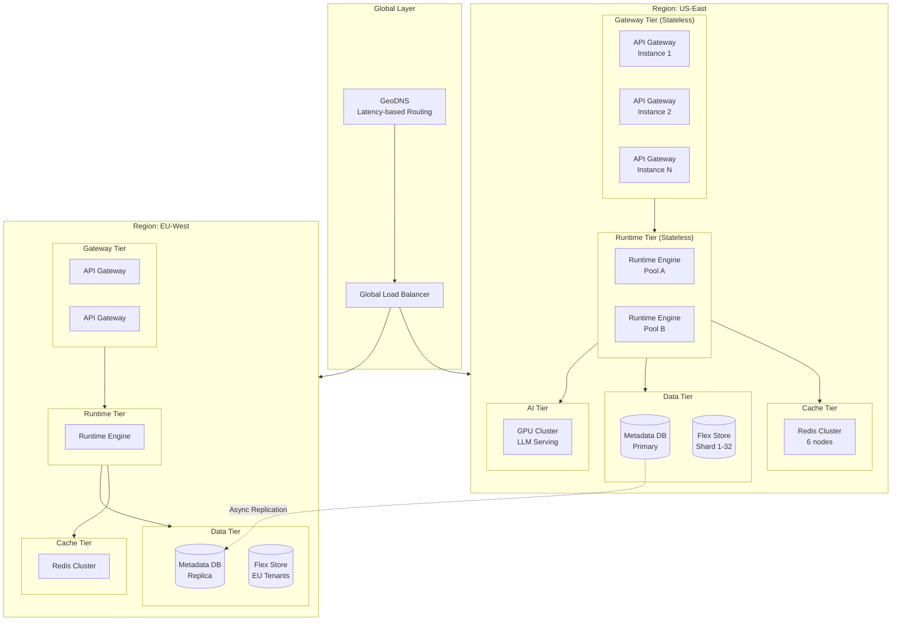
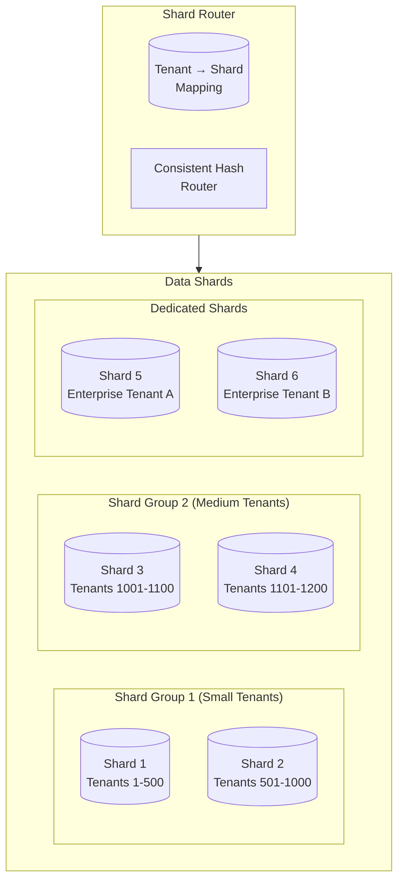
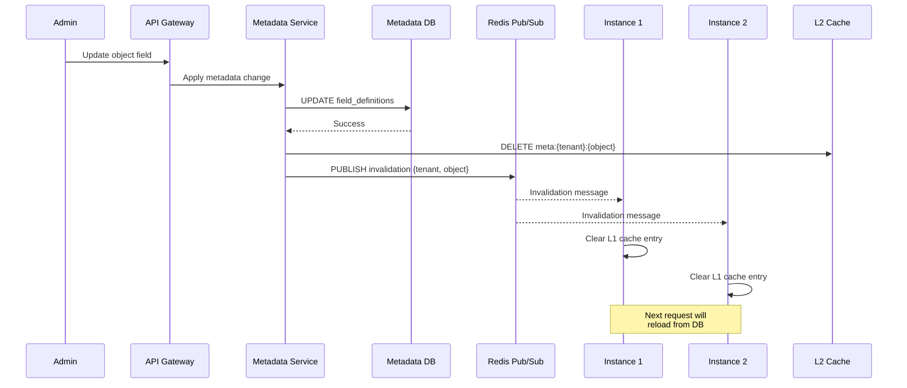
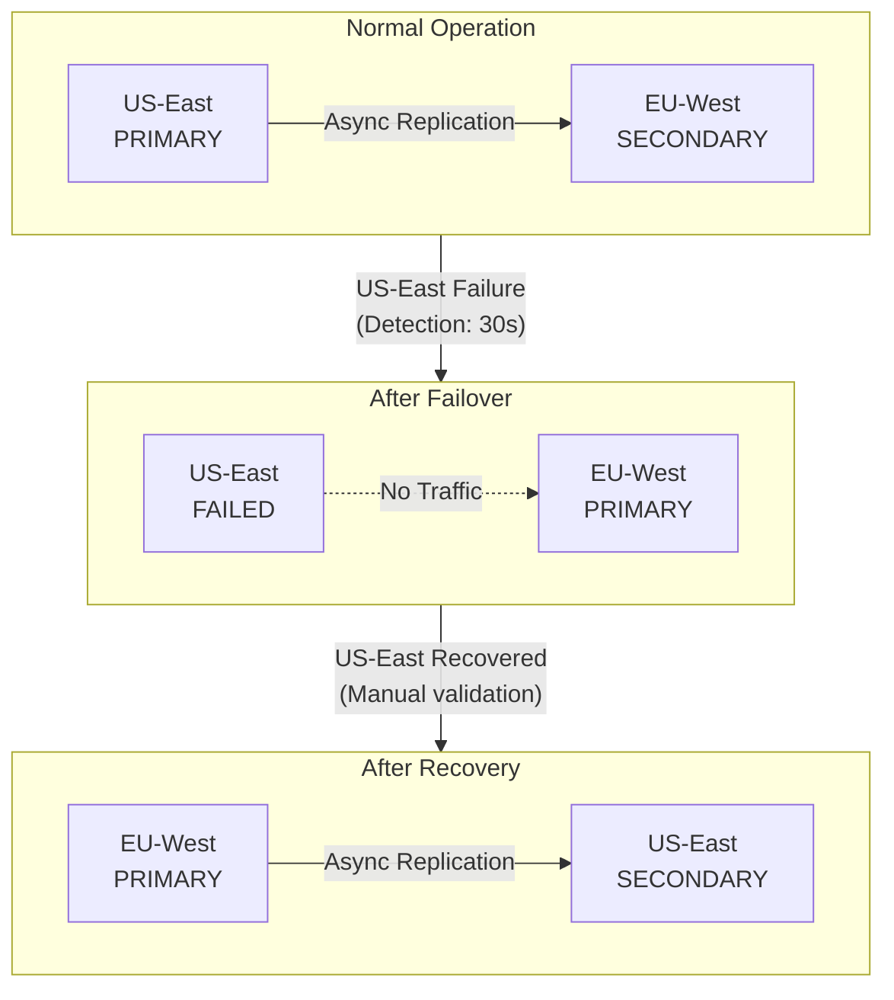

# Scalability & Reliability

[Back to Index](./00-index.md)

---

## Scalability Strategy

### Horizontal Scaling Architecture



### Scaling Dimensions

| Component | Scaling Strategy | Trigger | Target |
|-----------|-----------------|---------|--------|
| **API Gateway** | Horizontal (add instances) | CPU > 70%, Latency > 100ms | < 50ms p99 |
| **Runtime Engine** | Horizontal (add pods) | CPU > 60%, Request queue > 100 | < 200ms p99 |
| **Metadata Cache (Redis)** | Horizontal (add shards) | Memory > 80%, Hit rate < 95% | > 99% hit rate |
| **Metadata DB** | Vertical + Read replicas | CPU > 60%, Query latency > 10ms | < 5ms p99 |
| **Flex Store** | Horizontal (add shards) | Storage > 70%, QPS per shard > 10K | Linear growth |
| **LLM Serving** | Horizontal (add GPUs) | Queue depth > 50, TTFT > 3s | < 2s TTFT |

### Auto-Scaling Configuration

```yaml
# Runtime Engine Auto-Scaling
apiVersion: autoscaling/v2
kind: HorizontalPodAutoscaler
metadata:
  name: runtime-engine-hpa
spec:
  scaleTargetRef:
    apiVersion: apps/v1
    kind: Deployment
    name: runtime-engine
  minReplicas: 10
  maxReplicas: 500
  metrics:
    - type: Resource
      resource:
        name: cpu
        target:
          type: Utilization
          averageUtilization: 60
    - type: Pods
      pods:
        metric:
          name: request_queue_length
        target:
          type: AverageValue
          averageValue: 50
  behavior:
    scaleUp:
      stabilizationWindowSeconds: 60
      policies:
        - type: Percent
          value: 100
          periodSeconds: 60
    scaleDown:
      stabilizationWindowSeconds: 300
      policies:
        - type: Percent
          value: 10
          periodSeconds: 120
```

---

## Database Scaling

### Metadata Database Strategy

**Approach:** Single logical database with read replicas

```
Metadata DB Topology:

Primary (Write Master)
├── Read Replica 1 (Same AZ - sync replication)
├── Read Replica 2 (Different AZ - sync replication)
└── Read Replica 3 (Different Region - async replication)

Write Path: Primary only
Read Path: Load balanced across replicas (prefer same AZ)
Failover: Automatic promotion of sync replica
```

**Scaling Considerations:**
- Metadata is relatively small (~50GB for 10K tenants)
- Write volume is low (metadata changes are infrequent)
- Read volume is high but cacheable
- Single primary is sufficient with aggressive caching

### Flex Column Store Sharding

**Approach:** Tenant-based sharding with dynamic shard allocation



**Shard Assignment Algorithm:**

```
SHARD ASSIGNMENT STRATEGY:

Tier-Based Allocation:
├── Starter Tier: Multi-tenant shard (up to 500 tenants per shard)
├── Professional Tier: Multi-tenant shard (up to 100 tenants per shard)
└── Enterprise Tier: Dedicated shard (1 tenant per shard)

FUNCTION assign_shard(tenant):
    IF tenant.tier == 'enterprise':
        // Dedicated shard
        shard = provision_dedicated_shard(tenant)
        RETURN shard

    ELSE IF tenant.tier == 'professional':
        // Find shard with capacity
        shard = find_shard_with_capacity(
            max_tenants=100,
            max_records=500M
        )

    ELSE:  // Starter
        shard = find_shard_with_capacity(
            max_tenants=500,
            max_records=100M
        )

    IF shard IS NULL:
        shard = provision_new_shard()

    assign_tenant_to_shard(tenant, shard)
    RETURN shard

Hot Tenant Detection:
- Monitor QPS per tenant
- If tenant QPS > 10% of shard QPS for 24 hours → Migrate to dedicated shard
- Automated migration with zero downtime (dual-write, switch, cleanup)
```

### Shard Rebalancing

```
SHARD REBALANCING ALGORITHM:

Triggers:
1. Shard utilization > 80% (storage or QPS)
2. Tenant growth exceeds tier limits
3. Hot tenant detected
4. Planned infrastructure changes

Process:
1. Identify source and target shards
2. Enable dual-write for affected tenant(s)
3. Batch-copy historical data (background)
4. Wait for replication lag < 1 second
5. Acquire brief lock (< 100ms)
6. Update shard mapping
7. Release lock
8. Disable dual-write
9. Cleanup source shard (async)

Zero-Downtime Guarantee:
- Dual-write ensures no data loss
- Brief lock during cutover
- Rollback capability until cleanup
```

---

## Caching Strategy

### Multi-Layer Cache Architecture

```
┌─────────────────────────────────────────────────────────────────────────┐
│                         CACHING ARCHITECTURE                             │
├─────────────────────────────────────────────────────────────────────────┤
│                                                                          │
│  Layer 0: CDN Edge (Cloudflare/Fastly)                                  │
│  ├── Static assets (JS, CSS, images)                                    │
│  ├── Public API documentation                                            │
│  ├── Picklist values (rarely change)                                    │
│  └── TTL: 1 hour, Purge on deploy                                       │
│                                                                          │
│  Layer 1: In-Process Cache (Per Instance)                               │
│  ├── Hot metadata (object definitions, field mappings)                  │
│  ├── Compiled formula ASTs                                               │
│  ├── User session/permission snapshots                                  │
│  ├── Size: 2GB per instance                                              │
│  └── TTL: 60 seconds                                                     │
│                                                                          │
│  Layer 2: Distributed Cache (Redis Cluster)                             │
│  ├── All tenant metadata                                                 │
│  ├── Permission calculations                                             │
│  ├── Query result cache (optional)                                      │
│  ├── Rate limiting counters                                              │
│  ├── Session storage                                                     │
│  ├── Size: 60GB across cluster                                          │
│  └── TTL: 5 minutes (metadata), 2 minutes (permissions)                 │
│                                                                          │
│  Layer 3: Application-Level Cache                                       │
│  ├── Request-scoped context cache                                       │
│  ├── Cross-object record cache (within request)                         │
│  └── TTL: Request duration                                               │
│                                                                          │
└─────────────────────────────────────────────────────────────────────────┘
```

### Cache Configuration

```yaml
# Redis Cluster Configuration
redis:
  cluster:
    nodes: 6  # 3 primary + 3 replica
    replicas_per_primary: 1

  memory:
    maxmemory: 10gb  # Per node
    maxmemory-policy: volatile-lru

  persistence:
    appendonly: no  # Cache only, no persistence needed
    save: ""

  # Key namespaces
  prefixes:
    metadata: "meta:"      # meta:{tenant_id}:{object_api_name}
    permission: "perm:"    # perm:{tenant_id}:{user_id}:{record_id}
    session: "sess:"       # sess:{session_id}
    rate_limit: "rl:"      # rl:{tenant_id}:{endpoint}
    lock: "lock:"          # lock:{resource_type}:{resource_id}

# L1 Cache Configuration (Caffeine)
l1_cache:
  metadata:
    max_size: 50000  # entries
    expire_after_write: 60s
    expire_after_access: 30s

  formula_ast:
    max_size: 100000
    expire_after_write: 300s

  permission:
    max_size: 200000
    expire_after_write: 120s
```

### Cache Invalidation Strategy



---

## Reliability & Fault Tolerance

### Failure Mode Analysis

| Component | Failure Mode | Impact | Detection | Recovery |
|-----------|--------------|--------|-----------|----------|
| **API Gateway** | Instance crash | Traffic rerouted | Health check | Auto-replace |
| **API Gateway** | All instances down | Complete outage | Synthetic monitoring | Multi-region failover |
| **Runtime Engine** | Instance crash | Request retry | Health check | Auto-replace |
| **Runtime Engine** | Memory exhaustion | Slow/failed requests | OOM alerts | Pod restart |
| **Redis Cluster** | Single node failure | Automatic failover | Sentinel | Replica promotion |
| **Redis Cluster** | Cluster partition | Cache unavailable | Cluster health | Fallback to DB |
| **Metadata DB** | Primary failure | Write unavailable | Replication lag | Replica promotion |
| **Metadata DB** | Corruption | Data loss risk | Checksum validation | Point-in-time recovery |
| **Flex Store** | Shard failure | Tenant data unavailable | Health check | Replica failover |
| **LLM Service** | GPU failure | AI features degraded | Inference errors | Graceful degradation |

### Circuit Breaker Implementation

```
CIRCUIT BREAKER CONFIGURATION:

For Metadata DB:
├── Failure Threshold: 5 failures in 30 seconds
├── Open State Duration: 30 seconds
├── Half-Open: Allow 3 test requests
└── Fallback: Serve from L2 cache (stale)

For Redis Cache:
├── Failure Threshold: 10 failures in 10 seconds
├── Open State Duration: 10 seconds
├── Half-Open: Allow 5 test requests
└── Fallback: Direct DB query (increased latency)

For LLM Service:
├── Failure Threshold: 3 failures in 60 seconds
├── Open State Duration: 60 seconds
├── Half-Open: Allow 1 test request
└── Fallback: Return error with retry-after header

IMPLEMENTATION:

FUNCTION call_with_circuit_breaker(service, operation, fallback):
    breaker = get_circuit_breaker(service)

    IF breaker.state == OPEN:
        IF breaker.should_attempt_reset():
            breaker.state = HALF_OPEN
        ELSE:
            RETURN fallback()

    TRY:
        result = operation()
        breaker.record_success()
        RETURN result

    CATCH exception:
        breaker.record_failure()

        IF breaker.failure_count >= breaker.threshold:
            breaker.state = OPEN
            breaker.open_time = NOW()

        IF fallback IS NOT NULL:
            RETURN fallback()
        ELSE:
            RAISE exception
```

### Graceful Degradation Levels

```
DEGRADATION LEVELS:

Level 0: Full Operation
├── All features available
├── Real-time workflows
├── AI features enabled
└── Full caching

Level 1: AI Degraded
├── Core platform fully functional
├── AI formula generation disabled
├── AI query disabled
├── Manual formula/workflow creation only
└── Trigger: LLM service circuit breaker open

Level 2: Cache Degraded
├── Core platform functional (slower)
├── Direct database queries
├── Increased latency (2-5x)
├── AI features disabled
└── Trigger: Redis cluster unavailable

Level 3: Read-Only Mode
├── Read operations only
├── Write operations queued or rejected
├── Workflows paused
├── Admin notification
└── Trigger: Primary database unavailable

Level 4: Maintenance Mode
├── Static maintenance page
├── API returns 503
├── All requests rejected
└── Trigger: Manual activation or catastrophic failure

DEGRADATION DETECTION:

FUNCTION determine_degradation_level():
    IF metadata_db.primary.is_available == FALSE:
        RETURN Level.READ_ONLY

    IF redis_cluster.is_available == FALSE:
        RETURN Level.CACHE_DEGRADED

    IF llm_service.is_available == FALSE:
        RETURN Level.AI_DEGRADED

    RETURN Level.FULL_OPERATION
```

### Retry Strategy

```
RETRY CONFIGURATION:

Idempotent Operations (GET, metadata reads):
├── Max Retries: 3
├── Initial Delay: 100ms
├── Max Delay: 2s
├── Backoff: Exponential (2x)
├── Jitter: 10%
└── Retry On: 5xx, Timeout, Connection Error

Non-Idempotent Operations (POST, PUT, DELETE):
├── Max Retries: 1 (only on connection error before request sent)
├── No retry on 5xx (may have partially succeeded)
└── Client should implement idempotency keys

Database Operations:
├── Max Retries: 3
├── Initial Delay: 50ms
├── Retry On: Deadlock, Lock timeout, Connection lost
└── No Retry On: Constraint violation, Syntax error

External Calls (Webhooks, Outbound messages):
├── Max Retries: 5
├── Initial Delay: 1s
├── Max Delay: 5 minutes
├── Backoff: Exponential with jitter
└── Dead Letter Queue after max retries
```

---

## Disaster Recovery

### Recovery Objectives

| Metric | Target | Justification |
|--------|--------|---------------|
| **RPO (Metadata)** | 1 minute | Synchronous replication within region |
| **RPO (Records)** | 5 minutes | Asynchronous replication, transaction logs |
| **RTO** | 15 minutes | Automated failover with manual validation |
| **Data Durability** | 99.999999999% | Multiple replicas, cross-region backup |

### Backup Strategy

```
BACKUP SCHEDULE:

Metadata Database:
├── Continuous: WAL archiving to object storage
├── Hourly: Incremental snapshot
├── Daily: Full snapshot (retained 30 days)
├── Weekly: Archive to cold storage (retained 1 year)
└── Cross-Region: Async replication + daily snapshot

Flex Column Store (per shard):
├── Continuous: WAL archiving
├── Hourly: Incremental snapshot
├── Daily: Full snapshot (retained 14 days)
└── Point-in-Time: Up to 7 days granularity

Redis (Cache):
├── No backup (reconstructible from DB)
└── Cluster snapshot for faster recovery (optional)

Blob Storage:
├── Cross-region replication (automatic)
├── Versioning enabled (30 days)
└── Lifecycle: Archive after 90 days, delete after 7 years
```

### Multi-Region Failover



### Failover Procedure

```
AUTOMATED FAILOVER PROCEDURE:

Phase 1: Detection (0-30 seconds)
├── Health checks fail for primary region
├── Multiple monitoring systems confirm
├── Alert sent to on-call team
└── Automated failover initiated (if enabled)

Phase 2: Traffic Redirect (30-60 seconds)
├── DNS TTL: 60 seconds (pre-configured low)
├── Update DNS to point to secondary region
├── Load balancer health checks route away from primary
└── CDN cache purge for dynamic content

Phase 3: Database Promotion (60-120 seconds)
├── Verify replication lag is acceptable (< RPO)
├── Promote secondary database to primary
├── Update connection strings in config service
├── Runtime engines reconnect automatically
└── Cache invalidation (full flush)

Phase 4: Validation (120-300 seconds)
├── Synthetic transactions verify functionality
├── Error rates monitored
├── Performance metrics checked
└── On-call confirms or rolls back

Phase 5: Communication (300+ seconds)
├── Status page updated
├── Customer notification (if SLA impacted)
├── Incident tracking initiated
└── Post-mortem scheduled

MANUAL STEPS REQUIRED:
- Validation of data consistency
- Decision to fail back to original region
- Customer communication approval
```

---

## Performance Benchmarks

### Target Performance Metrics

| Operation | Target (p50) | Target (p99) | Measurement |
|-----------|--------------|--------------|-------------|
| Metadata read (cached) | < 1ms | < 5ms | Time to resolve object definition |
| Metadata read (uncached) | < 20ms | < 50ms | Time including DB query |
| Record read (simple) | < 50ms | < 150ms | Single record, no formulas |
| Record read (with formulas) | < 100ms | < 300ms | Including formula evaluation |
| Record write (simple) | < 100ms | < 300ms | No workflows triggered |
| Record write (with workflows) | < 200ms | < 500ms | Sync portion only |
| Query (simple, 100 records) | < 100ms | < 300ms | Single object, indexed filter |
| Query (complex, 1000 records) | < 500ms | < 2s | Joins, aggregations |
| AI formula generation | < 2s | < 5s | LLM inference |
| Page render (cached) | < 100ms | < 300ms | Full page with metadata |

### Load Testing Results

```
LOAD TEST SCENARIO: Mixed Workload
├── Duration: 1 hour
├── Target QPS: 30,000
├── Read:Write Ratio: 80:20
├── Concurrent Users: 10,000
├── Tenants: 1,000

RESULTS:

Throughput:
├── Achieved QPS: 32,145 (107% of target)
├── Successful Requests: 99.97%
├── Error Rate: 0.03%
└── Timeout Rate: 0.01%

Latency (Record Read):
├── p50: 42ms
├── p95: 98ms
├── p99: 187ms
└── Max: 1,245ms

Latency (Record Write):
├── p50: 87ms
├── p95: 198ms
├── p99: 412ms
└── Max: 2,891ms

Resource Utilization:
├── API Gateway CPU: 58%
├── Runtime Engine CPU: 64%
├── Redis Memory: 72%
├── Metadata DB CPU: 34%
├── Flex Store CPU: 48%
└── Network: 12 Gbps

Cache Performance:
├── L1 Hit Rate: 94%
├── L2 Hit Rate: 99.2% (including L1 misses)
└── Overall Cache Hit: 99.95%
```
