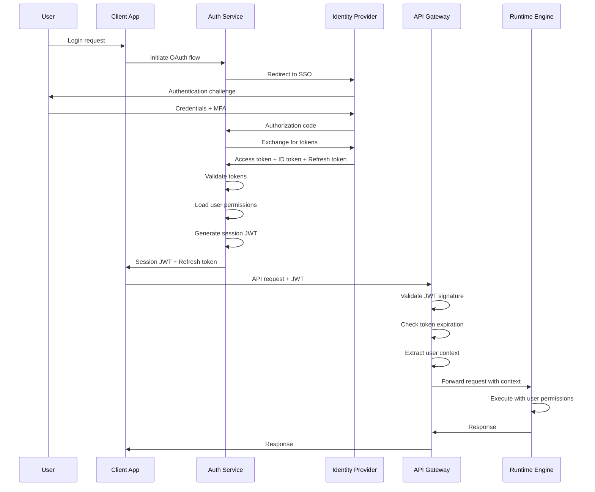
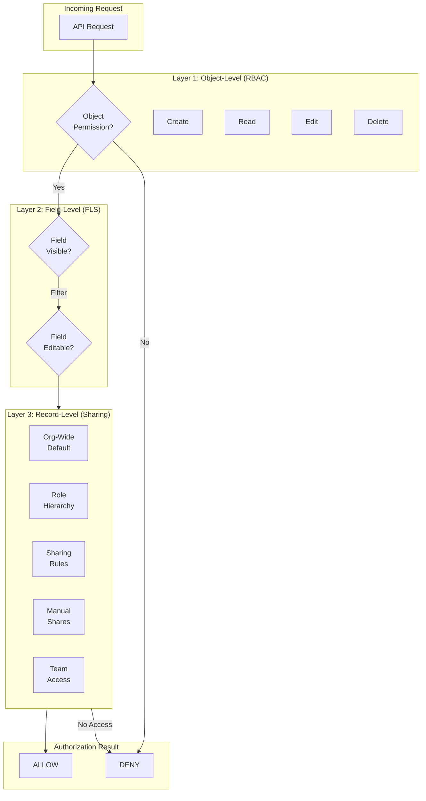

# Security & Compliance

[Back to Index](./00-index.md)

---

## Authentication

### Supported Authentication Methods

| Method | Use Case | Security Level |
|--------|----------|----------------|
| **OAuth 2.0 / OIDC** | Web/Mobile apps, SSO | High |
| **SAML 2.0** | Enterprise SSO (Okta, Azure AD) | High |
| **API Keys** | Server-to-server integration | Medium |
| **JWT Bearer Tokens** | Authenticated API calls | High |
| **MFA (TOTP/WebAuthn)** | Second factor for sensitive operations | Very High |

### Authentication Flow



### Token Management

```
TOKEN ARCHITECTURE:

Access Token (JWT):
├── Issuer: auth.platform.com
├── Audience: api.platform.com
├── Expiry: 15 minutes
├── Claims:
│   ├── sub: user_id
│   ├── tenant_id: tenant_id
│   ├── email: user@example.com
│   ├── roles: [admin, sales_user]
│   ├── permission_set_ids: [ps1, ps2]
│   └── session_id: session_uuid
└── Signature: RS256 with rotating keys

Refresh Token:
├── Format: Opaque (stored server-side)
├── Expiry: 7 days (configurable per tenant)
├── Single use (rotation on each refresh)
├── Bound to: user_id, device_id, IP range
└── Revocable: Immediate via token family revocation

Session Token (Short-lived):
├── Format: JWT
├── Expiry: 1 hour
├── Contains: Cached permission snapshot
├── Refreshed: Automatically before expiry
└── Invalidated: On permission change

API Key:
├── Format: platform_{tenant_id}_{random_32_bytes}
├── Scopes: Read-only, Read-write, Admin
├── Rate limits: Per-key limits
├── IP whitelist: Optional restriction
└── Expiry: Optional, recommended yearly rotation
```

---

## Authorization

### Multi-Layer Authorization Model



### Organization-Wide Defaults (OWD)

| OWD Setting | Description | Record Visibility |
|-------------|-------------|-------------------|
| **Private** | Only owner and admins | Owner + explicit shares |
| **Public Read Only** | Everyone can read | All users read, owner writes |
| **Public Read/Write** | Everyone can read/write | All users full access |
| **Controlled by Parent** | Inherits from master object | Follows parent record access |

### Role Hierarchy Access

```
ROLE HIERARCHY EXAMPLE:

CEO
├── VP Sales
│   ├── Sales Manager West
│   │   ├── Sales Rep 1
│   │   └── Sales Rep 2
│   └── Sales Manager East
│       ├── Sales Rep 3
│       └── Sales Rep 4
└── VP Engineering
    └── Engineering Manager
        ├── Developer 1
        └── Developer 2

Access Rules:
- CEO can see all records owned by anyone below
- VP Sales can see records owned by Sales Managers and Sales Reps
- Sales Manager West CANNOT see Sales Manager East's records
- Developers CANNOT see Sales records (different branch)

Materialized Path Implementation:
- CEO: /ceo/
- VP Sales: /ceo/vp_sales/
- Sales Manager West: /ceo/vp_sales/sm_west/
- Sales Rep 1: /ceo/vp_sales/sm_west/rep1/

Query: WHERE owner_role_path LIKE '/ceo/vp_sales/%'
```

### Sharing Rules

```sql
-- Criteria-Based Sharing Rule Example
{
    "name": "Share High-Value Opportunities with Executives",
    "object": "Opportunity",
    "rule_type": "criteria_based",
    "criteria": {
        "logic": "AND",
        "conditions": [
            {"field": "Amount", "operator": "greater_than", "value": 1000000},
            {"field": "Stage", "operator": "in", "value": ["Negotiation", "Closed Won"]}
        ]
    },
    "share_with": {
        "type": "role",
        "role_name": "Executive"
    },
    "access_level": "read"
}

-- Owner-Based Sharing Rule Example
{
    "name": "Share All Accounts with Support Team",
    "object": "Account",
    "rule_type": "owner_based",
    "owned_by": {
        "type": "role",
        "role_name": "Sales"
    },
    "share_with": {
        "type": "group",
        "group_name": "Support Team"
    },
    "access_level": "read"
}
```

### Permission Evaluation Algorithm

```
FUNCTION evaluate_access(user, record, operation):
    // 1. System Admin bypass
    IF user.is_system_admin:
        RETURN ALLOW

    // 2. Object-level permission
    obj_perm = get_object_permission(user.permission_sets, record.object_type)
    IF NOT has_operation_permission(obj_perm, operation):
        RETURN DENY("No object permission for {operation}")

    // 3. "Modify All" / "View All" permission
    IF operation == READ AND obj_perm.view_all_records:
        RETURN ALLOW
    IF obj_perm.modify_all_records:
        RETURN ALLOW

    // 4. Record ownership
    IF record.owner_id == user.id:
        RETURN ALLOW

    // 5. Role hierarchy (manager access)
    IF is_in_role_hierarchy(user.role, record.owner_role):
        IF operation == READ:
            RETURN ALLOW
        IF operation == EDIT AND get_owd(record.object_type) != 'private':
            RETURN ALLOW

    // 6. Sharing rules
    sharing_access = evaluate_sharing_rules(user, record)
    IF sharing_access.granted:
        IF operation == READ:
            RETURN ALLOW
        IF operation == EDIT AND sharing_access.level == 'read_write':
            RETURN ALLOW

    // 7. Manual shares
    manual_share = get_manual_share(user, record)
    IF manual_share EXISTS:
        IF operation == READ:
            RETURN ALLOW
        IF operation == EDIT AND manual_share.level == 'read_write':
            RETURN ALLOW

    // 8. Team membership
    IF is_team_member(user, record):
        team_access = get_team_access_level(user, record)
        IF operation == READ:
            RETURN ALLOW
        IF operation == EDIT AND team_access == 'read_write':
            RETURN ALLOW

    // 9. Organization-Wide Default
    owd = get_owd(record.object_type)
    IF owd == 'public_read_write':
        RETURN ALLOW
    IF owd == 'public_read' AND operation == READ:
        RETURN ALLOW

    RETURN DENY("No access path found")
```

---

## Data Security

### Encryption Architecture

```
ENCRYPTION LAYERS:

1. Encryption in Transit:
   ├── TLS 1.3 for all external connections
   ├── mTLS for internal service-to-service
   └── Certificate rotation: 90 days

2. Encryption at Rest:
   ├── Database: AES-256 (transparent encryption)
   ├── Blob Storage: AES-256 (server-side)
   ├── Backups: AES-256 with separate keys
   └── Cache: Not encrypted (sensitive data excluded)

3. Application-Level Encryption (Shield Encryption):
   ├── Per-tenant Data Encryption Keys (DEK)
   ├── Master Key Encryption Key (KEK) in HSM
   ├── Bring Your Own Key (BYOK) support
   └── Field-level encryption for PII

KEY HIERARCHY:

┌─────────────────────────────────────────────┐
│              Master KEK (HSM)               │
│         (Hardware Security Module)          │
└───────────────────┬─────────────────────────┘
                    │
        ┌───────────┼───────────┐
        ▼           ▼           ▼
┌───────────┐ ┌───────────┐ ┌───────────┐
│ Tenant A  │ │ Tenant B  │ │ Tenant C  │
│    KEK    │ │    KEK    │ │    KEK    │
└─────┬─────┘ └─────┬─────┘ └─────┬─────┘
      │             │             │
  ┌───┼───┐     ┌───┼───┐     ┌───┼───┐
  ▼   ▼   ▼     ▼   ▼   ▼     ▼   ▼   ▼
┌───┐┌───┐┌───┐┌───┐┌───┐┌───┐┌───┐┌───┐┌───┐
│DEK││DEK││DEK││DEK││DEK││DEK││DEK││DEK││DEK│
│ 1 ││ 2 ││ 3 ││ 1 ││ 2 ││ 3 ││ 1 ││ 2 ││ 3 │
└───┘└───┘└───┘└───┘└───┘└───┘└───┘└───┘└───┘
 │     │     │
 ▼     ▼     ▼
Data  Data  Data
```

### Field-Level Encryption

```
ENCRYPTED FIELD HANDLING:

Storage:
1. Application encrypts field value with tenant DEK
2. Stores: encrypted_value + encryption_metadata
3. Encryption metadata includes: key_version, algorithm

Retrieval:
1. Read encrypted value from database
2. Fetch DEK from key management service (cached)
3. Decrypt value
4. Return to application

Encrypted Field Limitations:
- Cannot be used in WHERE clauses (unless deterministic encryption)
- Cannot be indexed
- Cannot be used in formulas (except as string)
- Cannot be used in reports (aggregations)

Deterministic Encryption Option:
- Same plaintext → same ciphertext (for same tenant)
- Enables equality searches
- Weaker security (pattern analysis possible)
- Use only when search is required
```

### PII Handling

| PII Type | Storage | Access Control | Retention |
|----------|---------|----------------|-----------|
| **Email** | Encrypted at rest | FLS restricted | Account lifetime |
| **Phone** | Encrypted at rest | FLS restricted | Account lifetime |
| **SSN/Tax ID** | Field-level encrypted | Admin only | Legal requirement |
| **Address** | Standard encryption | FLS by role | Account lifetime |
| **Date of Birth** | Standard encryption | FLS restricted | Account lifetime |
| **Financial Data** | Field-level encrypted | Finance role | 7 years |
| **Health Data** | Field-level encrypted | HIPAA compliance | As required |

---

## Threat Model

### STRIDE Analysis

| Threat | Attack Vector | Mitigation |
|--------|---------------|------------|
| **Spoofing** | Stolen credentials, Session hijacking | MFA, Session binding, Token rotation |
| **Tampering** | Data modification, SQL injection | Input validation, Parameterized queries, Audit logs |
| **Repudiation** | Deny actions taken | Immutable audit logs, Digital signatures |
| **Information Disclosure** | Cross-tenant data leak, API exposure | Tenant isolation, FLS, Encryption |
| **Denial of Service** | Rate limit abuse, Resource exhaustion | Rate limiting, Governor limits, Auto-scaling |
| **Elevation of Privilege** | Permission bypass, IDOR | Permission checks on every request, Authorization testing |

### Platform-Specific Threats

| Threat | Description | Mitigation |
|--------|-------------|------------|
| **Cross-Tenant Data Leakage** | Tenant A accesses Tenant B's data | Tenant ID in all queries, Row-level security, Penetration testing |
| **Metadata Injection** | Malicious object/field definitions | Validation of metadata, Sandboxed execution |
| **Formula Injection** | Malicious formula expressions | Formula parsing validation, Function allowlist |
| **Workflow Abuse** | Infinite loops, Resource exhaustion | Governor limits, Depth limits, Monitoring |
| **AI Prompt Injection** | Manipulate AI to generate malicious content | Input sanitization, Output validation, Guardrails |
| **API Key Exposure** | Leaked API keys in client code | Key scoping, IP restrictions, Rotation policies |
| **IDOR (Insecure Direct Object Reference)** | Access records by guessing IDs | Permission check on every access, Unpredictable IDs |

### Security Controls

```
DEFENSE IN DEPTH:

Layer 1: Network
├── WAF (Web Application Firewall)
├── DDoS protection
├── IP reputation filtering
└── Geographic restrictions (optional)

Layer 2: Application
├── Input validation (all inputs)
├── Output encoding (XSS prevention)
├── CSRF protection (tokens)
├── Rate limiting (per tenant, per user, per endpoint)
└── Request size limits

Layer 3: Business Logic
├── Permission checks (every operation)
├── Governor limits (prevent abuse)
├── Audit logging (all changes)
└── Anomaly detection

Layer 4: Data
├── Encryption at rest
├── Field-level encryption (PII)
├── Tenant isolation
└── Backup encryption

Layer 5: Monitoring
├── Security event logging
├── Intrusion detection
├── Anomaly alerting
└── Regular penetration testing
```

---

## Compliance

### Compliance Framework Mapping

| Framework | Key Requirements | Platform Implementation |
|-----------|-----------------|------------------------|
| **SOC 2 Type II** | Security, Availability, Confidentiality | Audit logs, Access controls, Encryption, Monitoring |
| **ISO 27001** | Information Security Management | ISMS, Risk assessment, Security policies |
| **GDPR** | Data protection, Privacy rights | Consent management, Data portability, Right to erasure |
| **HIPAA** | Protected Health Information | BAA, Encryption, Access controls, Audit trails |
| **PCI DSS** | Payment card data | Encryption, Access controls, Network segmentation |
| **CCPA** | California consumer privacy | Data inventory, Opt-out mechanisms, Disclosure |

### GDPR Implementation

```
GDPR FEATURES:

1. Consent Management:
   ├── Consent collection at data input
   ├── Consent tracking per purpose
   ├── Easy consent withdrawal
   └── Consent audit trail

2. Data Subject Rights:
   ├── Right to Access: Export all user data (JSON/CSV)
   ├── Right to Rectification: Edit personal data
   ├── Right to Erasure: Delete all user data
   ├── Right to Portability: Machine-readable export
   └── Right to Object: Opt-out of processing

3. Data Residency:
   ├── EU tenants → EU data centers only
   ├── Cross-border transfer controls
   └── Standard Contractual Clauses support

4. Data Retention:
   ├── Configurable retention policies
   ├── Automated data deletion
   └── Audit log retention (legal minimum)

5. Breach Notification:
   ├── Incident detection and response
   ├── 72-hour notification capability
   └── Communication templates

ERASURE IMPLEMENTATION:

FUNCTION process_erasure_request(user_id, tenant_id):
    // 1. Verify identity and authorization
    verify_identity(user_id)
    check_legal_hold(user_id)

    // 2. Inventory user's data
    data_inventory = collect_user_data(user_id, tenant_id)
    /*
    Returns:
    - Owned records
    - Created records
    - Modified records (tracked in history)
    - Attachments
    - Audit log entries
    - Session data
    */

    // 3. Delete or anonymize based on retention requirements
    FOR item IN data_inventory:
        IF requires_legal_retention(item):
            anonymize(item)  // Replace PII with placeholder
        ELSE:
            hard_delete(item)

    // 4. Update related records
    update_references(user_id, "[DELETED USER]")

    // 5. Purge from backups (next backup cycle)
    schedule_backup_purge(user_id, tenant_id)

    // 6. Generate compliance report
    RETURN erasure_confirmation_report
```

### Audit Logging

```
AUDIT LOG STRUCTURE:

{
    "timestamp": "2026-01-24T10:30:45.123Z",
    "tenant_id": "tenant_uuid",
    "user_id": "user_uuid",
    "session_id": "session_uuid",
    "request_id": "request_uuid",
    "action": "RECORD_UPDATE",
    "resource_type": "Account",
    "resource_id": "record_uuid",
    "changes": {
        "Name": {"old": "Acme Corp", "new": "Acme Corporation"},
        "Industry": {"old": null, "new": "Technology"}
    },
    "ip_address": "192.168.1.100",
    "user_agent": "Mozilla/5.0...",
    "geo_location": "US-NY",
    "result": "SUCCESS",
    "duration_ms": 45,
    "metadata": {
        "api_version": "v1",
        "client_app": "web"
    }
}

AUDIT LOG RETENTION:
├── Hot storage: 90 days (instant query)
├── Warm storage: 1 year (query within minutes)
├── Cold storage: 7 years (query within hours)
└── Immutable: Write-once, append-only

AUDIT EVENTS CAPTURED:
├── Authentication: Login, logout, MFA, password change
├── Authorization: Permission changes, sharing changes
├── Data: Create, read, update, delete (CRUD)
├── Metadata: Object/field creation, workflow changes
├── Admin: User management, tenant settings
├── AI: Formula generation, query execution
└── Security: Failed logins, suspicious activity
```

---

## AI Governance

### AI Security Controls

| Control | Description | Implementation |
|---------|-------------|----------------|
| **Input Sanitization** | Prevent prompt injection | Filter special characters, validate schema context |
| **Output Validation** | Ensure AI output is safe | Syntax validation, permission check before applying |
| **Rate Limiting** | Prevent AI abuse | Per-tenant, per-user AI call limits |
| **Human Approval** | Require review for sensitive actions | Approval workflow for AI-generated workflows |
| **Audit Trail** | Track all AI operations | Log prompts, responses, applications |
| **Model Isolation** | Prevent cross-tenant learning | Tenant-specific context, no shared fine-tuning |

### AI Guardrails

```
AI GUARDRAILS IMPLEMENTATION:

Input Guardrails:
├── Schema context sanitization
├── User input length limits
├── Prohibited content detection
└── Injection pattern detection

Output Guardrails:
├── Formula syntax validation
├── Referenced field existence check
├── Permission verification (can user access referenced fields?)
├── Complexity limits (max formula depth, max cross-object hops)
└── Prohibited function detection (no side effects in formulas)

Deployment Guardrails:
├── Sandbox testing before production
├── Human approval for workflow deployment
├── Rollback capability
└── A/B testing for AI-generated content

FUNCTION apply_ai_guardrails(ai_output, context):
    // Input validation was already done

    // 1. Parse and validate output
    IF ai_output.type == 'formula':
        parsed = parse_formula(ai_output.formula)
        IF parsed.has_errors:
            RETURN REJECT("Invalid formula syntax")

        // 2. Check field references
        FOR field IN parsed.referenced_fields:
            IF NOT field_exists(field, context.object):
                RETURN REJECT("Unknown field: {field}")
            IF NOT user_can_access(context.user, field):
                RETURN REJECT("No access to field: {field}")

        // 3. Check complexity
        IF parsed.depth > MAX_FORMULA_DEPTH:
            RETURN REJECT("Formula too complex")
        IF parsed.cross_object_hops > MAX_CROSS_OBJECT_HOPS:
            RETURN REJECT("Too many relationship traversals")

    ELSE IF ai_output.type == 'workflow':
        // Validate workflow structure
        // Require human approval before deployment
        ai_output.requires_approval = TRUE

    RETURN ACCEPT(ai_output)
```

### AI Audit Requirements

```
AI OPERATION AUDIT LOG:

{
    "timestamp": "2026-01-24T10:30:45.123Z",
    "tenant_id": "tenant_uuid",
    "user_id": "user_uuid",
    "ai_operation": "FORMULA_GENERATION",
    "input": {
        "natural_language": "Calculate 10% discount if quantity > 100",
        "object_context": "Opportunity",
        "sanitized": true
    },
    "output": {
        "formula": "IF(Quantity__c > 100, Amount * 0.1, 0)",
        "confidence": 0.92,
        "model_version": "v2.3"
    },
    "guardrails": {
        "validation_passed": true,
        "complexity_score": 2,
        "referenced_fields": ["Quantity__c", "Amount"]
    },
    "application": {
        "applied": true,
        "field_id": "field_uuid",
        "approved_by": "user_uuid"  // If human approval required
    },
    "tokens_used": 1250,
    "latency_ms": 1823
}
```
