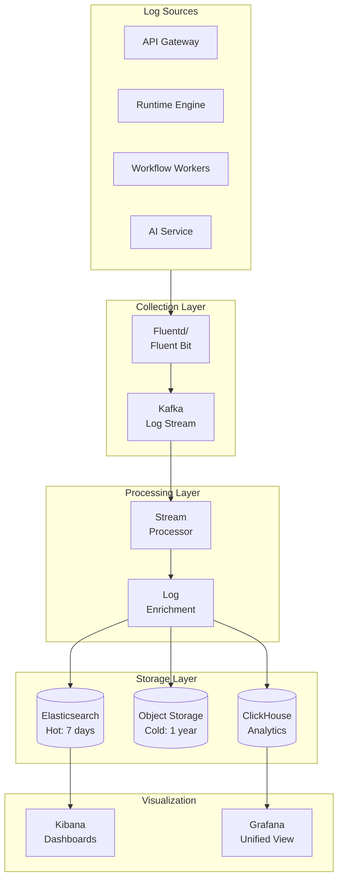

# Observability

[Back to Index](./00-index.md)

---

## Metrics Strategy

### USE Method (Utilization, Saturation, Errors)

| Resource | Utilization | Saturation | Errors |
|----------|-------------|------------|--------|
| **API Gateway** | CPU %, Memory % | Request queue depth | 5xx rate, Timeout rate |
| **Runtime Engine** | CPU %, Memory % | Thread pool saturation | Exception rate |
| **Metadata Cache (Redis)** | Memory %, Connections | Eviction rate | Connection errors |
| **Metadata DB** | CPU %, Disk I/O | Connection pool wait | Query errors |
| **Flex Store Shards** | CPU %, Storage % | Replication lag | Transaction errors |
| **LLM Service** | GPU %, VRAM % | Inference queue depth | Inference errors |

### RED Method (Rate, Errors, Duration)

| Service | Rate | Errors | Duration |
|---------|------|--------|----------|
| **Data API** | Requests/sec | Error rate % | p50, p95, p99 latency |
| **Metadata API** | Requests/sec | Error rate % | p50, p95, p99 latency |
| **Query API** | Queries/sec | Failed queries % | p50, p95, p99 latency |
| **Formula Engine** | Evaluations/sec | Evaluation errors % | p50, p95, p99 latency |
| **Workflow Engine** | Triggers/sec | Failed workflows % | Execution duration |
| **AI API** | Generations/sec | Generation errors % | TTFT, Total latency |

### Key Metrics Dashboard

```
PLATFORM HEALTH DASHBOARD:

┌─────────────────────────────────────────────────────────────────────────┐
│                         PLATFORM OVERVIEW                                │
├───────────────────────┬───────────────────────┬─────────────────────────┤
│   Active Tenants      │   Current QPS         │   Error Rate            │
│        8,234          │      28,456           │       0.02%             │
│   (↑ 12 from yesterday)│  (Peak: 35,000)      │  (Target: < 0.1%)       │
├───────────────────────┴───────────────────────┴─────────────────────────┤
│                                                                          │
│   API Latency (p99)                    Metadata Cache Hit Rate           │
│   ┌────────────────────────────┐      ┌────────────────────────────┐    │
│   │  ▄▄▄▄▄▄▄▄▄▄▄▄▄▄▄▄▄▄▄▄▄▄  │      │  ████████████████████████  │    │
│   │  Record Read:    142ms    │      │         99.7%               │    │
│   │  Record Write:   287ms    │      │  (L1: 94%, L2: 99.2%)       │    │
│   │  Query:          890ms    │      │                              │    │
│   └────────────────────────────┘      └────────────────────────────┘    │
│                                                                          │
├───────────────────────────────────────────────────────────────────────────┤
│                         COMPONENT HEALTH                                 │
├─────────────────┬─────────────────┬─────────────────┬───────────────────┤
│  API Gateway    │  Runtime Engine │  Metadata DB    │  Flex Store       │
│   ● Healthy     │   ● Healthy     │   ● Healthy     │   ● Healthy       │
│   CPU: 58%      │   CPU: 64%      │   CPU: 34%      │   CPU: 48%        │
│   Pods: 50/50   │   Pods: 100/100 │   Replicas: 3/3 │   Shards: 64/64   │
├─────────────────┴─────────────────┴─────────────────┴───────────────────┤
│                         AI PLATFORM                                      │
├─────────────────┬─────────────────┬─────────────────────────────────────┤
│  LLM Service    │  Queue Depth    │  AI Operations                      │
│   ● Healthy     │      23         │   Formula Gen: 1,234/hr             │
│   GPU: 72%      │  (< 50 target)  │   Query Gen: 4,567/hr               │
│   TTFT: 1.8s    │                 │   Workflow Gen: 234/hr              │
└─────────────────┴─────────────────┴─────────────────────────────────────┘
```

### Metric Definitions

```yaml
# Prometheus Metrics Configuration

# API Metrics
- name: api_requests_total
  type: counter
  labels: [tenant_id, endpoint, method, status_code]
  description: Total API requests

- name: api_request_duration_seconds
  type: histogram
  labels: [tenant_id, endpoint, method]
  buckets: [0.01, 0.025, 0.05, 0.1, 0.25, 0.5, 1, 2.5, 5, 10]
  description: API request latency

# Metadata Cache Metrics
- name: metadata_cache_hits_total
  type: counter
  labels: [cache_layer, tenant_id]
  description: Cache hits by layer (L1, L2)

- name: metadata_cache_misses_total
  type: counter
  labels: [cache_layer, tenant_id]
  description: Cache misses by layer

- name: metadata_cache_size_bytes
  type: gauge
  labels: [cache_layer, tenant_id]
  description: Current cache size

# Formula Engine Metrics
- name: formula_evaluations_total
  type: counter
  labels: [tenant_id, object_type, formula_type]
  description: Total formula evaluations

- name: formula_evaluation_duration_seconds
  type: histogram
  labels: [tenant_id, complexity_bucket]
  buckets: [0.001, 0.005, 0.01, 0.025, 0.05, 0.1, 0.25, 0.5, 1]
  description: Formula evaluation latency

- name: formula_cross_object_fetches_total
  type: counter
  labels: [tenant_id, object_type]
  description: Cross-object data fetches during formula evaluation

# Permission Metrics
- name: permission_checks_total
  type: counter
  labels: [tenant_id, object_type, result]
  description: Permission check results (allowed/denied)

- name: permission_check_duration_seconds
  type: histogram
  labels: [tenant_id, complexity]
  description: Permission check latency

- name: sharing_recalculation_duration_seconds
  type: histogram
  labels: [tenant_id, trigger_type]
  description: Sharing recalculation duration

# Workflow Metrics
- name: workflow_triggers_total
  type: counter
  labels: [tenant_id, object_type, trigger_type, result]
  description: Workflow trigger executions

- name: workflow_execution_duration_seconds
  type: histogram
  labels: [tenant_id, action_type]
  description: Workflow action execution time

- name: workflow_queue_depth
  type: gauge
  labels: [tenant_id, priority]
  description: Async workflow queue depth

# AI Metrics
- name: ai_generations_total
  type: counter
  labels: [tenant_id, generation_type, result]
  description: AI generation requests

- name: ai_generation_duration_seconds
  type: histogram
  labels: [generation_type]
  buckets: [0.5, 1, 2, 3, 5, 10, 20]
  description: AI generation latency

- name: ai_tokens_used_total
  type: counter
  labels: [tenant_id, generation_type]
  description: LLM tokens consumed

- name: ai_guardrail_rejections_total
  type: counter
  labels: [tenant_id, rejection_reason]
  description: AI outputs rejected by guardrails
```

---

## Logging Strategy

### Log Levels and Usage

| Level | Usage | Examples |
|-------|-------|----------|
| **ERROR** | Unexpected failures requiring investigation | Database connection failure, Unhandled exception |
| **WARN** | Potential issues, recoverable errors | Rate limit approached, Retry succeeded |
| **INFO** | Significant business events | Record created, Workflow executed, User login |
| **DEBUG** | Detailed diagnostic information | Query execution plan, Cache operations |
| **TRACE** | Very detailed tracing (usually disabled) | Individual formula evaluation steps |

### Structured Log Format

```json
{
  "timestamp": "2026-01-24T10:30:45.123Z",
  "level": "INFO",
  "service": "runtime-engine",
  "instance_id": "runtime-engine-abc123",
  "trace_id": "4bf92f3577b34da6a3ce929d0e0e4736",
  "span_id": "00f067aa0ba902b7",
  "tenant_id": "tenant_12345",
  "user_id": "user_67890",
  "request_id": "req_abcdef123456",
  "message": "Record updated successfully",
  "context": {
    "object_type": "Account",
    "record_id": "001abc123",
    "operation": "UPDATE",
    "fields_changed": ["Name", "Industry"],
    "workflows_triggered": 2,
    "formula_evaluations": 5
  },
  "duration_ms": 87,
  "metadata": {
    "api_version": "v1",
    "client_ip": "192.168.1.100",
    "user_agent": "PlatformSDK/2.0"
  }
}
```

### Log Categories

```
LOG CATEGORIES:

1. Access Logs (All API requests)
   ├── Request metadata (method, path, headers)
   ├── Response status and size
   ├── Latency breakdown
   └── Rate limiting info

2. Audit Logs (Security/Compliance)
   ├── Authentication events
   ├── Authorization decisions
   ├── Data changes (who changed what)
   └── Administrative actions

3. Application Logs (Business logic)
   ├── Formula evaluation results
   ├── Workflow execution details
   ├── Validation failures
   └── Query execution

4. Error Logs (Failures)
   ├── Stack traces
   ├── Error context
   ├── Recovery actions
   └── Alert triggers

5. Performance Logs (Optimization)
   ├── Slow queries
   ├── Cache misses
   ├── Resource exhaustion
   └── Bottleneck indicators

6. AI Logs (AI Operations)
   ├── Generation requests
   ├── Prompts (sanitized)
   ├── Guardrail decisions
   └── Token usage
```

### Log Aggregation Architecture



---

## Distributed Tracing

### Trace Context Propagation

```
TRACE PROPAGATION:

Request Flow:
Client → API Gateway → Runtime Engine → Metadata Cache → Database
                    → Formula Engine → Cross-Object Fetch
                    → Workflow Engine → Async Queue

Trace Context (W3C Trace Context):
traceparent: 00-4bf92f3577b34da6a3ce929d0e0e4736-00f067aa0ba902b7-01
tracestate: platform=runtime-engine

Span Hierarchy:
└── api.request (API Gateway)
    ├── auth.validate (Auth Service)
    ├── tenant.route (Tenant Router)
    └── runtime.process (Runtime Engine)
        ├── metadata.resolve (Metadata Cache)
        │   ├── cache.l1.lookup
        │   ├── cache.l2.lookup
        │   └── db.metadata.query
        ├── permission.check (Permission Engine)
        │   ├── permission.object
        │   ├── permission.field
        │   └── permission.record
        ├── validation.execute (Validation Engine)
        │   └── formula.evaluate
        ├── trigger.before (Trigger Orchestrator)
        │   └── workflow.evaluate
        ├── data.write (Data Layer)
        │   └── db.flex_store.update
        ├── formula.calculate (Formula Engine)
        │   ├── ast.evaluate
        │   └── cross_object.fetch
        └── trigger.after (Trigger Orchestrator)
            ├── workflow.execute
            └── queue.enqueue
```

### Key Spans to Instrument

| Span Name | Purpose | Key Attributes |
|-----------|---------|----------------|
| `api.request` | Full request lifecycle | method, path, status, tenant_id |
| `metadata.resolve` | Metadata lookup | object_name, cache_hit, source |
| `permission.check` | Authorization decision | user_id, record_id, result |
| `formula.evaluate` | Formula execution | formula_id, complexity, duration |
| `workflow.execute` | Workflow trigger | workflow_id, actions_count |
| `db.query` | Database operations | query_type, rows_affected |
| `cache.operation` | Cache read/write | operation, key, hit |
| `ai.generate` | AI operations | generation_type, tokens, model |

### Trace Sampling Strategy

```
SAMPLING CONFIGURATION:

1. Head-Based Sampling:
   ├── Default: 1% of all requests
   ├── Error requests: 100% (always trace errors)
   ├── Slow requests (> p99): 100%
   └── Debug mode: 100% (per-tenant flag)

2. Tail-Based Sampling (Post-Collection):
   ├── Errors: Keep all
   ├── High latency (> 2x p99): Keep all
   ├── AI operations: Keep 10%
   ├── Workflow executions: Keep 5%
   └── Normal requests: Keep 0.1%

3. Priority Sampling:
   ├── Priority 0 (Drop): Routine health checks
   ├── Priority 1 (Sample): Normal requests
   ├── Priority 2 (Keep): Interesting patterns
   └── Priority 3 (Always): Errors, debug flags

IMPLEMENTATION:

FUNCTION should_sample(request, trace_context):
    // Always sample errors
    IF request.is_error:
        RETURN TRUE

    // Always sample slow requests
    IF request.duration > LATENCY_THRESHOLD_P99 * 2:
        RETURN TRUE

    // Always sample AI operations
    IF request.path.startswith('/ai/'):
        RETURN RANDOM() < 0.10  // 10%

    // Debug mode for specific tenant
    IF request.tenant_id IN DEBUG_TENANTS:
        RETURN TRUE

    // Default sampling rate
    RETURN RANDOM() < 0.01  // 1%
```

---

## Alerting Strategy

### Alert Severity Levels

| Severity | Response Time | Examples | Notification |
|----------|---------------|----------|--------------|
| **P1 - Critical** | Immediate (< 5 min) | Complete outage, Data loss risk | Page on-call, Slack, Email |
| **P2 - High** | < 30 min | Degraded performance, Partial outage | Page on-call, Slack |
| **P3 - Medium** | < 4 hours | Elevated errors, Capacity warning | Slack, Email |
| **P4 - Low** | Next business day | Minor issues, Optimization opportunities | Email |

### Critical Alerts (P1)

```yaml
alerts:
  - name: PlatformDown
    severity: P1
    condition: |
      sum(rate(api_requests_total{status_code="5xx"}[5m]))
      / sum(rate(api_requests_total[5m])) > 0.5
    for: 2m
    description: "More than 50% of requests failing"
    runbook: https://runbooks.platform.com/platform-down

  - name: DatabasePrimaryDown
    severity: P1
    condition: |
      pg_up{role="primary"} == 0
    for: 30s
    description: "Primary database is unreachable"
    runbook: https://runbooks.platform.com/db-failover

  - name: AllCacheNodesDown
    severity: P1
    condition: |
      sum(redis_up) == 0
    for: 1m
    description: "All Redis cache nodes are down"
    runbook: https://runbooks.platform.com/cache-recovery

  - name: DataCorruptionDetected
    severity: P1
    condition: |
      data_integrity_check_failures_total > 0
    for: 0s
    description: "Data integrity check failed - potential corruption"
    runbook: https://runbooks.platform.com/data-corruption
```

### High Alerts (P2)

```yaml
alerts:
  - name: HighErrorRate
    severity: P2
    condition: |
      sum(rate(api_requests_total{status_code=~"5.."}[5m]))
      / sum(rate(api_requests_total[5m])) > 0.05
    for: 5m
    description: "Error rate above 5%"
    runbook: https://runbooks.platform.com/high-errors

  - name: HighLatency
    severity: P2
    condition: |
      histogram_quantile(0.99, rate(api_request_duration_seconds_bucket[5m])) > 2
    for: 5m
    description: "p99 latency above 2 seconds"
    runbook: https://runbooks.platform.com/high-latency

  - name: CacheHitRateLow
    severity: P2
    condition: |
      sum(rate(metadata_cache_hits_total[5m]))
      / (sum(rate(metadata_cache_hits_total[5m])) + sum(rate(metadata_cache_misses_total[5m]))) < 0.95
    for: 10m
    description: "Metadata cache hit rate below 95%"
    runbook: https://runbooks.platform.com/cache-degradation

  - name: LLMServiceDegraded
    severity: P2
    condition: |
      histogram_quantile(0.99, rate(ai_generation_duration_seconds_bucket[5m])) > 10
    for: 5m
    description: "AI generation latency above 10 seconds"
    runbook: https://runbooks.platform.com/llm-degradation
```

### Medium Alerts (P3)

```yaml
alerts:
  - name: HighDiskUsage
    severity: P3
    condition: |
      (1 - node_filesystem_avail_bytes / node_filesystem_size_bytes) > 0.8
    for: 30m
    description: "Disk usage above 80%"
    runbook: https://runbooks.platform.com/disk-cleanup

  - name: WorkflowQueueBacklog
    severity: P3
    condition: |
      workflow_queue_depth > 10000
    for: 15m
    description: "Workflow queue backlog exceeds 10K"
    runbook: https://runbooks.platform.com/workflow-backlog

  - name: SlowQueryIncreasing
    severity: P3
    condition: |
      rate(slow_queries_total[1h]) > 100
    for: 30m
    description: "Slow query rate increasing"
    runbook: https://runbooks.platform.com/slow-queries

  - name: TenantApproachingLimits
    severity: P3
    condition: |
      tenant_api_calls_today / tenant_api_limit > 0.9
    for: 1h
    description: "Tenant approaching daily API limit"
    runbook: https://runbooks.platform.com/tenant-limits
```

### Alert Routing

```yaml
routing:
  receiver: default
  routes:
    - match:
        severity: P1
      receiver: pagerduty-critical
      continue: true
    - match:
        severity: P1
      receiver: slack-incidents
    - match:
        severity: P2
      receiver: pagerduty-high
      continue: true
    - match:
        severity: P2
      receiver: slack-alerts
    - match:
        severity: P3
      receiver: slack-alerts
    - match:
        severity: P4
      receiver: email-digest

receivers:
  - name: pagerduty-critical
    pagerduty_configs:
      - service_key: ${PAGERDUTY_KEY}
        severity: critical

  - name: pagerduty-high
    pagerduty_configs:
      - service_key: ${PAGERDUTY_KEY}
        severity: error

  - name: slack-incidents
    slack_configs:
      - channel: '#incidents'
        title: '{{ .GroupLabels.alertname }}'
        text: '{{ .Annotations.description }}'

  - name: slack-alerts
    slack_configs:
      - channel: '#platform-alerts'

  - name: email-digest
    email_configs:
      - to: 'platform-team@company.com'
        send_resolved: true
```

---

## Dashboards

### Tenant Health Dashboard

```
TENANT HEALTH DASHBOARD:

Tenant: Acme Corporation (tenant_12345)
Tier: Enterprise | Status: Active | Region: US-East

┌─────────────────────────────────────────────────────────────────────────┐
│                         USAGE OVERVIEW                                   │
├───────────────────────┬───────────────────────┬─────────────────────────┤
│   API Calls Today     │   Storage Used        │   Active Users          │
│     234,567           │     45.2 GB           │       1,234             │
│   (Limit: 2,000,000)  │   (Limit: 1 TB)       │   (Limit: Unlimited)    │
├───────────────────────┴───────────────────────┴─────────────────────────┤
│                                                                          │
│   Request Volume (24h)               Response Time (p99)                 │
│   ┌────────────────────────────┐    ┌────────────────────────────┐      │
│   │    ▄▄▄                     │    │                ▄▄▄         │      │
│   │ ▄▄█████▄▄▄▄▄▄▄▄▄▄▄▄▄▄▄   │    │ ▄▄▄▄▄▄▄▄▄▄▄▄▄███▄▄▄▄     │      │
│   │ Peak: 15,234 req/min       │    │ Current: 145ms             │      │
│   └────────────────────────────┘    └────────────────────────────┘      │
│                                                                          │
├───────────────────────────────────────────────────────────────────────────┤
│                         FEATURE USAGE                                    │
├─────────────────┬─────────────────┬─────────────────┬───────────────────┤
│  Custom Objects │  Workflow Rules │  Formula Fields │  AI Generations   │
│       87        │       156       │       423       │    234 today      │
│  (Limit: ∞)     │  (Limit: 500)   │  (Limit: ∞)     │  (Limit: 2000)    │
├─────────────────┴─────────────────┴─────────────────┴───────────────────┤
│                         RECENT ISSUES                                    │
├─────────────────────────────────────────────────────────────────────────┤
│  ⚠ High formula evaluation time detected (10:15 AM)                     │
│  ✓ Resolved: Slow query on Opportunity object (9:45 AM)                 │
│  ✓ Resolved: Workflow queue delay (Yesterday 3:30 PM)                   │
└─────────────────────────────────────────────────────────────────────────┘
```

### AI Operations Dashboard

```
AI OPERATIONS DASHBOARD:

┌─────────────────────────────────────────────────────────────────────────┐
│                         AI PLATFORM HEALTH                               │
├───────────────────────┬───────────────────────┬─────────────────────────┤
│   LLM Cluster Status  │   Queue Depth         │   Token Usage (24h)     │
│      ● Healthy        │        23             │     12.5M tokens        │
│   GPU Util: 72%       │   (Target: < 50)      │   ($625 estimated)      │
├───────────────────────┴───────────────────────┴─────────────────────────┤
│                                                                          │
│   Generation Success Rate          Time to First Token (TTFT)            │
│   ┌────────────────────────────┐  ┌────────────────────────────┐        │
│   │ ████████████████████████   │  │                             │        │
│   │         98.7%              │  │  p50: 1.2s  p99: 3.8s       │        │
│   │ (Target: > 95%)            │  │  (Target: < 2s p50)         │        │
│   └────────────────────────────┘  └────────────────────────────┘        │
│                                                                          │
├───────────────────────────────────────────────────────────────────────────┤
│                      GENERATION BY TYPE (24h)                            │
├─────────────────┬─────────────────┬─────────────────┬───────────────────┤
│  Formula Gen    │  Query Gen      │  Workflow Gen   │  Schema Suggest   │
│     4,567       │     12,345      │       890       │       234         │
│  Success: 97%   │  Success: 99%   │  Success: 95%   │  Success: 92%     │
├─────────────────┴─────────────────┴─────────────────┴───────────────────┤
│                      GUARDRAIL REJECTIONS (24h)                          │
├─────────────────────────────────────────────────────────────────────────┤
│  Syntax Error: 45  |  Permission Denied: 23  |  Complexity Limit: 12    │
│  Unknown Field: 34 |  Prompt Injection: 2    |  Other: 8                │
└─────────────────────────────────────────────────────────────────────────┘
```

### SLA Dashboard

```
SLA DASHBOARD - January 2026

┌─────────────────────────────────────────────────────────────────────────┐
│                         SLA COMPLIANCE                                   │
├───────────────────────────────────────────────────────────────────────────┤
│                                                                          │
│   Availability (Target: 99.99%)                                         │
│   ┌────────────────────────────────────────────────────────────────┐    │
│   │ ████████████████████████████████████████████████████████████   │    │
│   │                        99.97%                                   │    │
│   │   Downtime MTD: 8.64 minutes  |  Budget: 4.32 min  |  OVER     │    │
│   └────────────────────────────────────────────────────────────────┘    │
│                                                                          │
│   Latency SLO (p99 < 500ms for writes)                                  │
│   ┌────────────────────────────────────────────────────────────────┐    │
│   │ ████████████████████████████████████████████████████████       │    │
│   │                        99.2%                                    │    │
│   │   Violations: 12,345 requests  |  Total: 1.5M  |  MEETING      │    │
│   └────────────────────────────────────────────────────────────────┘    │
│                                                                          │
│   Error Rate SLO (< 0.1%)                                               │
│   ┌────────────────────────────────────────────────────────────────┐    │
│   │ ████████████████████████████████████████████████████████████   │    │
│   │                        0.02%                                    │    │
│   │   Errors: 3,456  |  Total: 15M  |  MEETING                     │    │
│   └────────────────────────────────────────────────────────────────┘    │
│                                                                          │
├───────────────────────────────────────────────────────────────────────────┤
│                         INCIDENT SUMMARY                                 │
├─────────────────────────────────────────────────────────────────────────┤
│  Date       | Duration | Impact              | Root Cause               │
│  Jan 15     | 6 min    | API Gateway restart | Memory leak in v2.3.1    │
│  Jan 8      | 2.5 min  | Elevated latency    | Cache node failover      │
└─────────────────────────────────────────────────────────────────────────┘
```
