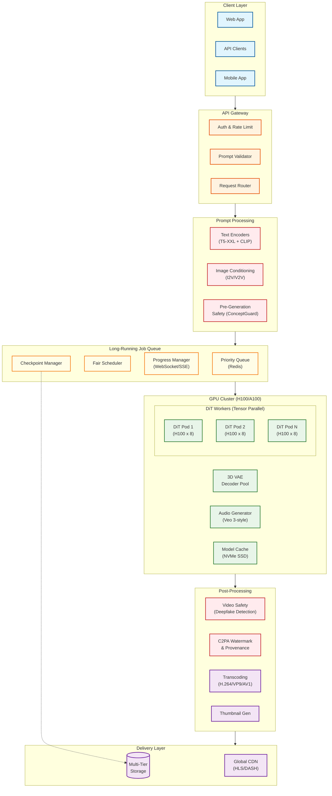

# AI-Native Video Generation Platform

## Overview

**AI-Native Video Generation Platform** is the infrastructure for text-to-video synthesis using Latent Diffusion Transformers (DiT) at scale, powering services like Google Veo 3, OpenAI Sora, Runway Gen-4, Genmo Mochi 1, and Lightricks LTX-Video. It orchestrates GPU clusters for multi-minute generation jobs, manages long-running queues with checkpoint-based recovery, ensures temporal consistency across frames, generates synchronized audio, and delivers generated videos globally through CDN infrastructure.

**Key Differentiator:** Unlike image generation (2D latent space with spatial-only attention), video generation operates in a **3D latent space (T x H x W)** requiring **temporal attention mechanisms (TSAM)** for frame-to-frame coherence. The platform must handle **long-running jobs (30s - 5min)** with checkpoint recovery, **3D VAE encoding/decoding**, and video-specific compliance including **deepfake detection** and **C2PA provenance tracking**. Native audio generation (Veo 3 style) adds synchronized speech and ambient sound.

---

## System Characteristics

| Characteristic | Video Generation | Image Generation (comparison) |
|----------------|------------------|-------------------------------|
| Traffic Pattern | Bursty, 30s-5min per request | Bursty, 5-60s per request |
| Primary Bottleneck | VRAM for 3D latents, temporal attention O(T^2) | GPU compute during denoising |
| Latency Target | Real-time: <2s, Standard: <60s, Cinema: <5min | Turbo: <10s, Fast: <25s |
| Memory Pattern | 3D latent (T x H x W), grows with duration | 2D latent (H x W), fixed |
| Output Size | 50 MB - 5 GB video files | 1-10 MB images |
| Execution Model | Temporal denoising with causal/full attention | Multi-step spatial denoising |
| Model Architecture | DiT with 3D VAE + Audio Transformer | UNet/DiT with 2D VAE |
| Consistency Model | Temporal coherence across frames | Per-image consistency |
| Audio Integration | Native (Veo 3) or post-sync | N/A |
| Compliance | Deepfake detection, C2PA, DEFIANCE Act | NSFW, bias detection |

---

## Complexity Rating

| Component | Rating | Justification |
|-----------|--------|---------------|
| **Overall** | **Very High** | 3D diffusion, temporal consistency, audio sync, deepfake compliance |
| Latent Diffusion Transformer (DiT) | Very High | 10B+ parameters, spacetime patches, multi-head temporal attention |
| Temporal Consistency (TSAM) | Very High | O(T^2) attention, causal masking, long-range dependencies |
| 3D VAE Encoding/Decoding | High | Causal convolutions, 8x spatial + 4x temporal compression |
| TurboDiffusion Acceleration | High | Distillation, adversarial training, 4-8 step generation |
| Audio-Video Synchronization | High | Joint latent space, lip-sync <120ms, ambient generation |
| MoE for Video (Race-DiT) | High | Sparse routing, expert load balancing, memory efficiency |
| Queue Management (Long Jobs) | Medium-High | Checkpoint recovery, progress streaming, multi-minute fairness |
| GPU Orchestration (Tensor Parallel) | Medium-High | Torchrun, Run:ai, VRAM fragmentation across GPUs |

---

## Quick Navigation

| Document | Description |
|----------|-------------|
| [01 - Requirements & Estimations](./01-requirements-and-estimations.md) | Functional/non-functional requirements, 3D latent VRAM calculations, SLOs |
| [02 - High-Level Design](./02-high-level-design.md) | Architecture diagrams, data flow, DiT vs UNet decisions |
| [03 - Low-Level Design](./03-low-level-design.md) | Data models, APIs, core algorithms (DiT, TSAM, 3D VAE pseudocode) |
| [04 - Deep Dive & Bottlenecks](./04-deep-dive-and-bottlenecks.md) | DiT architecture, temporal attention, TurboDiffusion, audio sync |
| [05 - Scalability & Reliability](./05-scalability-and-reliability.md) | GPU cluster scaling, checkpoint recovery, multi-region |
| [06 - Security & Compliance](./06-security-and-compliance.md) | Deepfake detection, C2PA watermarking, DEFIANCE Act, EU AI Act |
| [07 - Observability](./07-observability.md) | Video-specific metrics, temporal consistency scores, generation tracing |
| [08 - Interview Guide](./08-interview-guide.md) | 45-minute pacing, trap questions, DiT/temporal deep dives |

---

## Core Modules

| Module | Responsibility | Key Challenge |
|--------|----------------|---------------|
| **Prompt Processor** | T5-XXL/CLIP text encoding, image conditioning (I2V) | Multi-modal fusion for video context |
| **Queue Manager** | Long-running job scheduling, checkpoint storage | Jobs lasting minutes with progress streaming |
| **GPU Orchestrator** | Tensor parallelism, Torchrun coordination, Run:ai | VRAM allocation for 3D latents across GPUs |
| **Video DiT Engine** | Temporal diffusion, flow matching, denoising steps | Maintaining temporal coherence across frames |
| **3D VAE** | Video latent compression (8x spatial, 4x temporal) | Efficient causal encoding, reconstruction quality |
| **Temporal Attention (TSAM)** | Frame-to-frame consistency, motion coherence | O(T^2) complexity, long-range dependencies |
| **Audio Synthesizer** | Native audio generation synced to video | Lip-sync <120ms, ambient sound generation |
| **Safety Pipeline** | Pre-gen filtering, deepfake detection, C2PA | Video-specific CSAM, regulatory compliance |
| **Transcoding & Delivery** | Format conversion (H.264/VP9), CDN upload | Large file streaming, adaptive bitrate |

---

## Architecture Overview



---

## Key Numbers

### Generation Performance by Model

| Model | Architecture | Resolution | Duration | Audio | Time (H100 8x) | VRAM |
|-------|-------------|------------|----------|-------|----------------|------|
| **Veo 3** | DiT + MoE | 4K | 8-60s | Native | 2-5 min | 80 GB+ |
| **Sora** | DiT | 1080p | 60s | Post-sync | 1-3 min | 60 GB+ |
| **Mochi 1** | Asymmetric DiT (10B) | 1080p | 10s | None | ~30s | 40 GB |
| **LTX-Video** | Real-time DiT | 768p | 5-10s | None | <2s | 24 GB |
| **Gen-4** | DiT + Neural Rendering | 1080p | 10s | None | ~15s | 40 GB |
| **Open-Sora 2.0** | DiT (11B) | 1080p | 16s | None | ~45s | 48 GB |

### 3D Latent VRAM Requirements

```
3D Latent Size = (Frames / temporal_compression) x (H / spatial_compression) x (W / spatial_compression) x channels

Example: 10s @ 24fps, 1080p, 8x spatial, 4x temporal compression:
= (240 / 4) x (1080 / 8) x (1920 / 8) x 16 channels
= 60 x 135 x 240 x 16
= ~31 million elements x 2 bytes (FP16)
= ~62 MB per video latent (just the latent, not model weights)
```

| Configuration | Duration | Resolution | Latent Size | Total VRAM (incl. model) |
|---------------|----------|------------|-------------|--------------------------|
| Short clip | 5s @ 24fps | 720p | ~15 MB | ~25 GB |
| Standard | 10s @ 24fps | 1080p | ~62 MB | ~45 GB |
| Long form | 30s @ 24fps | 1080p | ~185 MB | ~65 GB |
| Cinema | 60s @ 24fps | 4K | ~800 MB | 80+ GB (multi-GPU) |

### Model Architecture Comparison

| Component | Veo 3 | Sora | Mochi 1 | LTX-2 |
|-----------|-------|------|---------|-------|
| **Parameters** | Unknown (est. 30B+) | Unknown (est. 20B+) | 10B | 14B (video) + 5B (audio) |
| **Text Encoder** | T5-based | Unknown | T5-XXL | Gemma 3 |
| **Temporal Compression** | 3D Conv | Spacetime patches | Causal 3D VAE (6x) | 4x |
| **Spatial Compression** | 3D Conv | Spacetime patches | 8x | 8x |
| **Attention** | Full temporal | Spacetime | Asymmetric dual-stream | Dual-stream cross-attn |
| **Audio** | Native joint | None (post-sync) | None | Native joint |
| **Flow Matching** | Yes | Likely | Yes | Yes |

### Generation Time Breakdown (10s 1080p video)

| Stage | Time | % of Total |
|-------|------|------------|
| Prompt encoding (T5-XXL) | 200ms | 0.5% |
| Queue wait (Standard tier) | 5-30s | Variable |
| DiT inference (50 steps) | 25-35s | 80% |
| 3D VAE decoding | 3-5s | 10% |
| Audio generation (if enabled) | 2-3s | 5% |
| Safety check | 500ms | 1% |
| Transcoding + upload | 2-3s | 5% |
| **Total (excluding queue)** | **35-50s** | - |

---

## TurboDiffusion Acceleration

| Approach | Steps | Speedup | Quality Impact | Use Case |
|----------|-------|---------|----------------|----------|
| Full diffusion | 50-100 | 1x (baseline) | Best | Cinema quality |
| Reduced steps | 25-30 | 2x | Minor degradation | Standard |
| TurboDiffusion | 4-8 | 10-25x | Slight degradation | Real-time preview |
| LTX Real-time | 4 | 100-200x | Optimized for speed | Interactive generation |

**TurboDiffusion Key Techniques:**
- Step distillation via rCM (recurrent Consistency Models)
- Sparse-Linear Attention (SLA) for attention acceleration
- W8A8 quantization for linear layer speedup
- Achieves 5-second video in 1.9 seconds on RTX 5090

---

## When to Use This Design

**Use AI-Native Video Generation Platform When:**
- Building text-to-video synthesis at scale (>100K videos/day)
- Need multi-tier queue system for long-running jobs (minutes not seconds)
- Require temporal consistency across generated frames
- Supporting native audio generation with lip-sync
- Compliance with deepfake regulations (DEFIANCE Act, EU AI Act)
- Serving globally with CDN delivery for large video files

**Do NOT Use When:**
- Image generation only (use [3.20 AI Image Generation Platform](../3.20-ai-image-generation-platform/00-index.md))
- Single-user local generation (use ComfyUI with video extensions)
- Batch offline processing without latency requirements
- Model training/fine-tuning (see MLOps Platform design)
- Simple video editing without generation (use traditional video tools)

---

## Real-World References

| Platform | Key Architecture Features | Scale |
|----------|---------------------------|-------|
| **Google Veo 3** | 3D DiT, native audio, unified audio-visual latent space | Part of Gemini/Vertex AI |
| **OpenAI Sora** | DiT with spacetime patches, world simulator concept | Part of ChatGPT Pro |
| **Runway Gen-4** | DiT + neural rendering, "visual memory" for consistency | Enterprise APIs |
| **Genmo Mochi 1** | 10B Asymmetric DiT, open-source, causal 3D VAE | Open-source |
| **Lightricks LTX-2** | 14B+5B dual-stream, real-time generation, NVFP8 | Open-source + API |
| **Pika Labs** | Optimized for creative workflows, turbo mode | Consumer + API |

### Framework Landscape

| Purpose | Open Source | Commercial |
|---------|-------------|------------|
| **Video Diffusion Library** | Diffusers, Open-Sora, CogVideoX | Proprietary (Veo, Sora) |
| **GPU Serving** | vLLM (adapted), Torchrun | NVIDIA Run:ai, Modal |
| **3D VAE** | Wan-VAE, CogVideoX VAE | Proprietary |
| **Safety** | ConceptGuard, PromptGuard | Hive Moderation, AWS Rekognition |
| **Watermarking** | C2PA reference impl | Meta Video Seal |
| **CDN** | - | CloudFlare Stream, Mux, AWS MediaConvert |

---

## Interview Readiness Checklist

**Must Know:**
- [ ] Difference between video and image generation (3D vs 2D latent, temporal attention)
- [ ] Why temporal consistency is critical (flickering, object permanence)
- [ ] DiT architecture basics (patches, temporal positional encoding, AdaLN)
- [ ] 3D VAE compression (spatial + temporal, causal convolutions)
- [ ] Long-running job management (checkpoints, progress streaming)
- [ ] Deepfake detection and C2PA compliance requirements

**Should Know:**
- [ ] Flow matching vs diffusion approaches
- [ ] TurboDiffusion acceleration techniques (distillation, SLA)
- [ ] Asymmetric dual-stream architecture (Mochi 1, LTX-2)
- [ ] Audio-video synchronization (Veo 3's native audio)
- [ ] TSAM (Temporal Self-Attention Module) mechanism
- [ ] VRAM calculations for different video configurations

**Nice to Know:**
- [ ] MoE for video generation (Race-DiT, Mixture of Contexts)
- [ ] Causal vs full temporal attention trade-offs
- [ ] VBench benchmark dimensions (16+ quality metrics)
- [ ] Open-Sora 2.0's $200K training approach
- [ ] LTX-2's multi-keyframe conditioning

---

## Quick Reference Card

```
+-------------------------------------------------------------------------+
|         AI-NATIVE VIDEO GENERATION PLATFORM - QUICK REFERENCE           |
+-------------------------------------------------------------------------+
|                                                                         |
|  GENERATION MODES                      KEY DIFFERENCES VS IMAGE GEN     |
|  ----------------                      ----------------------------     |
|  Real-time: <2s (LTX-style)            3D latent (T x H x W) vs 2D     |
|  Standard:  <60s (most use cases)      Temporal attention (TSAM)       |
|  Cinema:    <5min (4K, long form)      3D VAE (8x spatial, 4x temporal)|
|                                        Native audio (Veo 3 style)       |
|  ARCHITECTURE STACK                    Checkpoint recovery required     |
|  -------------------                                                    |
|  DiT: Diffusion Transformer            VRAM BUDGET (H100 80GB)         |
|  3D VAE: Causal video compression      -----------------------          |
|  TSAM: Temporal self-attention         DiT weights (10B):  20 GB       |
|  T5-XXL: Text encoding                 3D latent (10s):    62 MB       |
|  Flow Matching: ODE-based sampling     VAE decoder:        4 GB        |
|                                        Audio model:        2 GB        |
|  TEMPORAL CONSISTENCY                  Workspace:          15 GB       |
|  ---------------------                 = ~45 GB per generation          |
|  Full attention: O(T^2), best quality                                  |
|  Causal attention: O(T), streaming     GENERATION TIMES (H100 8x)      |
|  Sliding window: O(T*W), balanced      -----------------------          |
|                                        10s 1080p (50 steps): 35-50s    |
|  COMPLIANCE (VIDEO-SPECIFIC)           10s 1080p (TurboDiff):  5s      |
|  --------------------------            5s 768p (LTX real-time): <2s    |
|  Deepfake detection: Required                                          |
|  C2PA watermarking: Standard           AUDIO SYNC (Veo 3)              |
|  DEFIANCE Act: US federal law          -------------------              |
|  EU AI Act: Synthetic disclosure       Lip-sync accuracy: <120ms       |
|                                        Native joint generation         |
|  MODEL COMPARISON                      9B parameter audio engine       |
|  ----------------                                                       |
|  Veo 3:   4K, 60s, native audio, MoE                                   |
|  Sora:    1080p, 60s, spacetime DiT                                    |
|  Mochi 1: 1080p, 10s, 10B params, open                                 |
|  LTX-2:   768p, real-time, dual-stream                                 |
|                                                                         |
+-------------------------------------------------------------------------+
|                                                                         |
|  INTERVIEW KEYWORDS                                                     |
|  ------------------                                                     |
|  Latent Diffusion Transformer (DiT), 3D VAE, temporal attention,       |
|  TSAM, causal convolutions, flow matching, TurboDiffusion, asymmetric  |
|  dual-stream, T5-XXL encoder, spacetime patches, checkpoint recovery,  |
|  C2PA provenance, deepfake detection, DEFIANCE Act, native audio,      |
|  lip-sync, MoE for video, Race-DiT, VBench, Open-Sora, Mochi 1         |
|                                                                         |
+-------------------------------------------------------------------------+
```

---

## Related Systems

- [3.20 AI Image Generation Platform](../3.20-ai-image-generation-platform/00-index.md) - Image generation (compare 2D vs 3D latent)
- [3.23 LLM Inference Engine](../3.23-llm-inference-engine/00-index.md) - Inference optimization patterns (KV cache vs temporal attention)
- [3.22 AI Guardrails & Safety System](../3.22-ai-guardrails-safety-system/00-index.md) - Content safety architecture
- [3.19 AI Voice Assistant](../3.19-ai-voice-assistant/00-index.md) - Audio generation patterns
- [1.15 Content Delivery Network (CDN)](../1.15-content-delivery-network-cdn/00-index.md) - Video delivery infrastructure
- [1.12 Blob Storage System](../1.12-blob-storage-system/00-index.md) - Large video file storage
