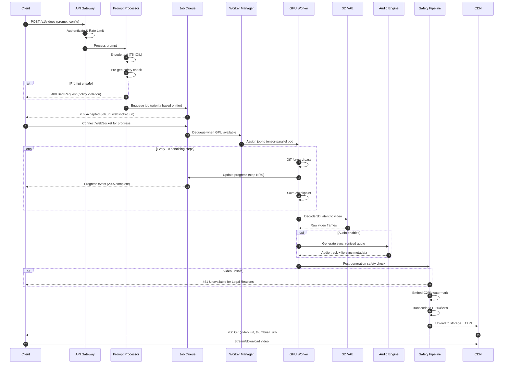
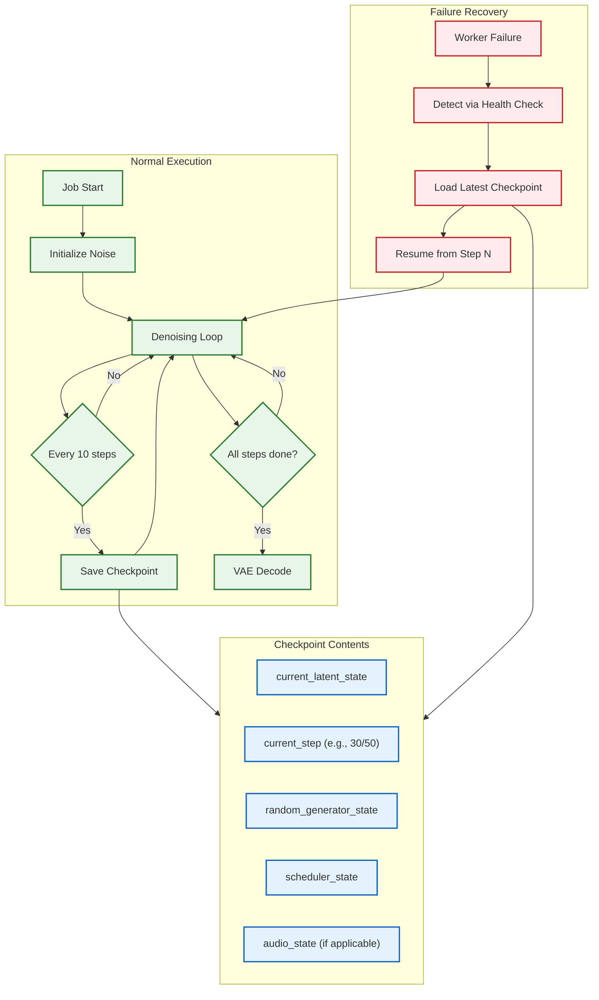
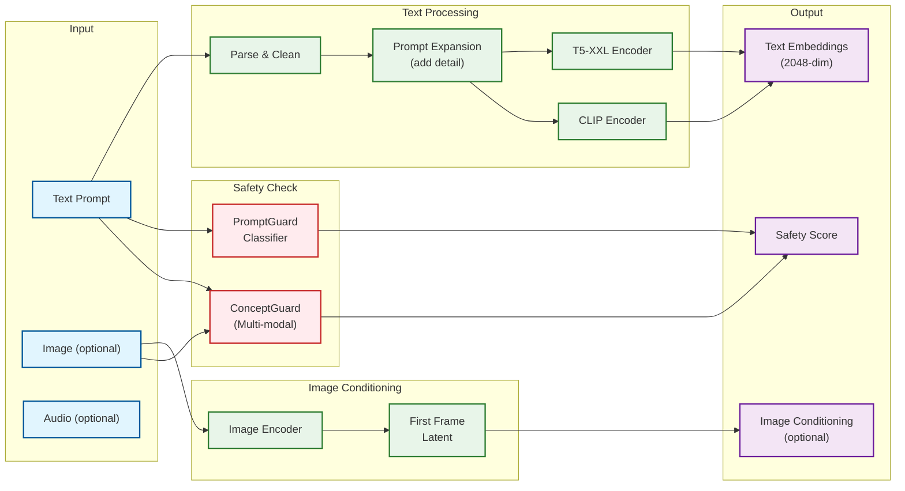
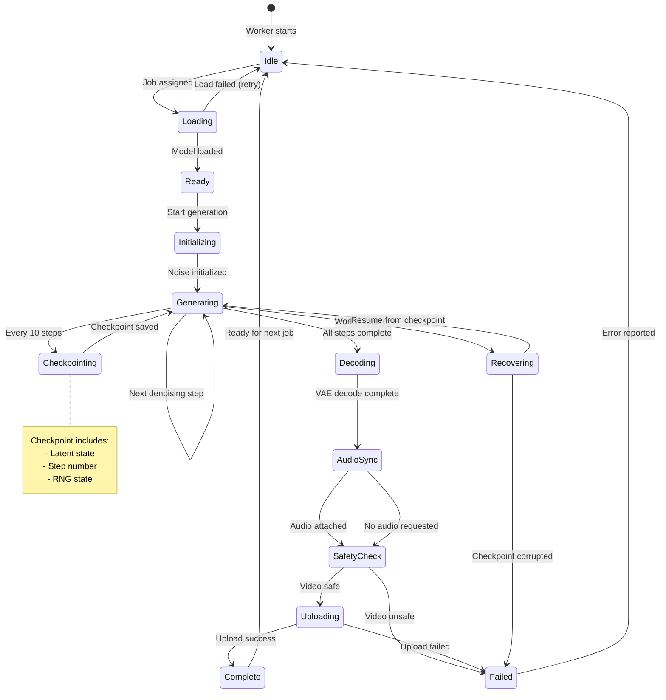
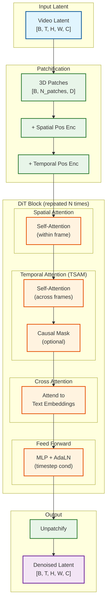

# High-Level Design

## System Architecture

```mermaid
flowchart TB
    subgraph ClientLayer["Client Layer"]
        WebApp["Web Application"]
        APIClient["API Clients<br/>(REST/gRPC)"]
        SDKs["Native SDKs<br/>(Python/JS)"]
    end

    subgraph APIGateway["API Gateway Layer"]
        Auth["Authentication<br/>(OAuth2/API Keys)"]
        RateLimit["Rate Limiter<br/>(Per-second pricing)"]
        Router["Request Router"]
        QuotaMgr["Quota Manager"]
    end

    subgraph PromptProcessing["Prompt Processing Pipeline"]
        PromptParser["Prompt Parser"]
        TextEnc["Text Encoders<br/>(T5-XXL + CLIP)"]
        ImageEnc["Image Encoder<br/>(for I2V)"]
        SafetyPre["Pre-Gen Safety<br/>(ConceptGuard)"]
        PromptExpand["Prompt Expander"]
    end

    subgraph QueueManagement["Long-Running Job Management"]
        JobQueue[("Priority Queue<br/>(Redis Streams)")]
        FairScheduler["Fair Scheduler<br/>(WFQ Algorithm)"]
        ProgressMgr["Progress Manager"]
        CheckpointStore[("Checkpoint Store<br/>(NVMe + S3)")]
        WebSocketHub["WebSocket Hub<br/>(Progress SSE)"]
    end

    subgraph GPUOrchestration["GPU Orchestration Layer"]
        WorkerMgr["Worker Manager<br/>(Run:ai / Torchrun)"]
        subgraph DiTPods["DiT Worker Pods"]
            Pod1["Pod 1<br/>H100 x 8<br/>Tensor Parallel"]
            Pod2["Pod 2<br/>H100 x 8<br/>Tensor Parallel"]
            PodN["Pod N<br/>H100 x 8<br/>Tensor Parallel"]
        end
        ModelRegistry["Model Registry<br/>(Weights + Configs)"]
        ModelCache["Model Cache<br/>(NVMe SSD)"]
    end

    subgraph VideoGenEngine["Video Generation Engine"]
        NoiseInit["Noise Initializer"]
        subgraph DiTCore["DiT Core"]
            PatchEmbed["Patch Embedder<br/>(3D Patches)"]
            TemporalAttn["Temporal Attention<br/>(TSAM)"]
            SpatialAttn["Spatial Attention"]
            CrossAttn["Cross Attention<br/>(Text Conditioning)"]
            AdaLN["AdaLN<br/>(Timestep)"]
        end
        FlowMatch["Flow Matching /<br/>DDPM Sampler"]
        VAEDecode["3D VAE Decoder"]
    end

    subgraph AudioEngine["Audio Generation Engine"]
        AudioEnc["Audio Encoder"]
        AudioDiT["Audio DiT<br/>(Joint Latent)"]
        LipSync["Lip Sync Module"]
        AudioDec["Audio Decoder"]
    end

    subgraph PostProcessing["Post-Processing Pipeline"]
        SafetyPost["Video Safety<br/>(Deepfake Detector)"]
        NSFWCheck["NSFW/Violence<br/>Classifier"]
        C2PAEmbed["C2PA Watermark<br/>Embedder"]
        Transcoder["Transcoder<br/>(H.264/VP9/AV1)"]
        ThumbnailGen["Thumbnail<br/>Generator"]
    end

    subgraph DeliveryLayer["Delivery Layer"]
        HotStorage[("Hot Storage<br/>(SSD)")]
        ColdStorage[("Cold Storage<br/>(S3/GCS)")]
        CDN["Global CDN<br/>(HLS/DASH)"]
        StreamServer["Streaming Server"]
    end

    subgraph Observability["Observability"]
        Metrics["Metrics<br/>(Prometheus)"]
        Tracing["Tracing<br/>(Jaeger)"]
        Logging["Logging<br/>(ELK)"]
    end

    ClientLayer --> APIGateway
    APIGateway --> PromptProcessing
    PromptProcessing --> QueueManagement
    QueueManagement --> GPUOrchestration
    GPUOrchestration --> VideoGenEngine
    VideoGenEngine --> AudioEngine
    AudioEngine --> PostProcessing
    PostProcessing --> DeliveryLayer

    ProgressMgr --> WebSocketHub
    WebSocketHub -.-> ClientLayer

    CheckpointStore -.-> VideoGenEngine
    ModelCache --> DiTPods

    Metrics -.-> GPUOrchestration
    Metrics -.-> VideoGenEngine

    classDef client fill:#e1f5fe,stroke:#01579b,stroke-width:2px
    classDef gateway fill:#fff3e0,stroke:#e65100,stroke-width:2px
    classDef queue fill:#fffde7,stroke:#f57f17,stroke-width:2px
    classDef compute fill:#e8f5e9,stroke:#2e7d32,stroke-width:2px
    classDef safety fill:#ffebee,stroke:#c62828,stroke-width:2px
    classDef storage fill:#f3e5f5,stroke:#6a1b9a,stroke-width:2px
    classDef observability fill:#e0f7fa,stroke:#00695c,stroke-width:2px

    class WebApp,APIClient,SDKs client
    class Auth,RateLimit,Router,QuotaMgr gateway
    class JobQueue,FairScheduler,ProgressMgr,CheckpointStore,WebSocketHub queue
    class WorkerMgr,Pod1,Pod2,PodN,ModelRegistry,ModelCache compute
    class PromptParser,TextEnc,ImageEnc,SafetyPre,PromptExpand,SafetyPost,NSFWCheck,C2PAEmbed safety
    class HotStorage,ColdStorage,CDN,StreamServer,Transcoder,ThumbnailGen storage
    class Metrics,Tracing,Logging observability
```



---

## Request Flow

### Video Generation Request Lifecycle



### Checkpoint and Recovery Flow



---

## Key Architectural Decisions

### Decision 1: DiT vs UNet for Video

| Aspect | DiT (Transformer) | UNet (CNN) |
|--------|-------------------|------------|
| **Scaling** | Scales better with compute (attention) | Diminishing returns at scale |
| **Temporal Modeling** | Native attention across time | Requires temporal layers added |
| **Memory** | Higher (O(T^2) for full attention) | Lower (convolutional) |
| **Quality at Scale** | Superior with large models | Plateaus |
| **Training Efficiency** | Better parallelization | Sequential bottlenecks |

**Decision:** Use **DiT** for video generation
- Modern video models (Veo 3, Sora, Mochi 1) all use DiT
- Better temporal consistency through attention mechanisms
- Scales to 10B+ parameters effectively

### Decision 2: Flow Matching vs Standard Diffusion

| Aspect | Flow Matching | DDPM/DDIM Diffusion |
|--------|---------------|---------------------|
| **Formulation** | ODE-based, deterministic | SDE-based, stochastic |
| **Steps Required** | 10-50 (fewer) | 20-100 (more) |
| **Stability** | More stable for video | Can have temporal artifacts |
| **Sampling** | Euler/RK4 solvers | DDIM, DPM++ |
| **Theory** | Simpler, "straight" paths | Complex ELBO derivation |

**Decision:** Use **Flow Matching** as primary
- Fewer steps = faster generation
- Better stability for long video sequences
- Equivalent to diffusion v-MSE with cosine schedule

### Decision 3: Temporal Attention Strategy

| Strategy | Complexity | Memory | Quality | Use Case |
|----------|------------|--------|---------|----------|
| **Full Temporal** | O(T^2) | High | Best | Short videos, cinema quality |
| **Causal Temporal** | O(T) | Medium | Good | Streaming, real-time |
| **Sliding Window + Anchor** | O(T×W) | Low | Good | Long videos |

**Decision:** Hybrid approach
- **Full attention** for videos <10s (best quality)
- **Causal attention** for real-time/streaming generation
- **Sliding window** for videos >30s (memory efficiency)

### Decision 4: 3D VAE Architecture

| Aspect | Causal 3D VAE | Non-Causal 3D VAE |
|--------|---------------|-------------------|
| **Temporal Direction** | Past frames only | Bidirectional |
| **Streaming** | Supports streaming decode | Requires full video |
| **Quality** | Slightly lower | Slightly higher |
| **Memory** | Lower (feature caching) | Higher |

**Decision:** Use **Causal 3D VAE** (like Mochi 1, Wan-VAE)
- Enables streaming/progressive decode
- Feature caching reduces memory for long videos
- Trade-off: slight quality reduction acceptable

### Decision 5: Audio Integration Strategy

| Strategy | Latency | Sync Quality | Complexity |
|----------|---------|--------------|------------|
| **Native Joint (Veo 3)** | Same as video | <120ms | Very High |
| **Post-sync (Sora style)** | +2-5s | 200-500ms | Medium |
| **No audio** | - | - | Low |

**Decision:** Support both
- **Native joint** for premium tier (Veo 3 architecture)
- **Post-sync** for standard tier (faster, simpler)
- **No audio** for API customers who add their own

### Decision 6: Queue Design for Long-Running Jobs

| Aspect | Standard Queue | Checkpoint-Based Queue |
|--------|----------------|------------------------|
| **Job Duration** | Seconds | Minutes |
| **Failure Recovery** | Retry from start | Resume from checkpoint |
| **Progress Reporting** | Completion only | Real-time streaming |
| **Fairness** | Simple priority | Weighted fair queuing |

**Decision:** **Checkpoint-based queue** with:
- Redis Streams for ordering and persistence
- Checkpoint every 10 denoising steps
- WebSocket/SSE for real-time progress
- Weighted Fair Queuing (WFQ) to prevent starvation

---

## Component Interactions

### Prompt Processing Pipeline



### GPU Worker State Machine



### Temporal Attention Flow



---

## Technology Stack Recommendations

### Core Infrastructure

| Component | Recommended | Alternatives | Notes |
|-----------|-------------|--------------|-------|
| **GPU Type** | H100 80GB | A100 80GB, L40S | H100 for production, A100 for cost |
| **GPU Orchestration** | NVIDIA Run:ai | Kubernetes + Torchrun | Enterprise scheduling |
| **Tensor Parallelism** | Torchrun + NCCL | DeepSpeed, Megatron | Standard for DiT |
| **Container Runtime** | NVIDIA Container Toolkit | - | GPU passthrough |

### Queue and State

| Component | Recommended | Alternatives | Notes |
|-----------|-------------|--------------|-------|
| **Job Queue** | Redis Streams | Kafka, RabbitMQ | Persistence + ordering |
| **Checkpoint Storage** | NVMe SSD (local) + S3 | GCS, Azure Blob | Fast recovery |
| **Progress Streaming** | WebSocket / SSE | gRPC streaming | Real-time updates |
| **State Management** | Redis | Memcached | Session + progress |

### Storage and Delivery

| Component | Recommended | Alternatives | Notes |
|-----------|-------------|--------------|-------|
| **Hot Storage** | SSD (local) | NVMe over Fabric | Recent videos |
| **Warm Storage** | S3 Standard | GCS, Azure Blob | 30-day retention |
| **Cold Storage** | S3 Glacier | GCS Archive | Long-term |
| **CDN** | CloudFlare Stream | Mux, AWS MediaConvert | Video-optimized |
| **Transcoding** | NVENC (hardware) | FFmpeg, AWS Elemental | GPU-accelerated |

### Safety and Compliance

| Component | Recommended | Alternatives | Notes |
|-----------|-------------|--------------|-------|
| **Pre-gen Safety** | ConceptGuard + PromptGuard | Custom classifier | Multi-modal |
| **Post-gen Detection** | Custom + Hive Moderation | AWS Rekognition | Video-specific |
| **Deepfake Detection** | Custom detector | Reality Defender | Required |
| **Watermarking** | C2PA + Meta Video Seal | SynthID | Provenance |

---

## Architecture Pattern Checklist

| Pattern | Decision | Justification |
|---------|----------|---------------|
| **Sync vs Async** | Async (queue-based) | Long-running jobs (minutes) |
| **Event-driven vs Request-response** | Hybrid (request + progress events) | User needs real-time feedback |
| **Push vs Pull** | Pull (workers pull jobs) | Better load balancing |
| **Stateless vs Stateful** | Stateful workers (GPU model cache) | Avoid cold starts |
| **Read-heavy vs Write-heavy** | Write-heavy (generation) | Each request creates new video |
| **Real-time vs Batch** | Both (real-time tier + batch) | Different latency requirements |
| **Edge vs Origin** | Origin (GPU clusters) + Edge (CDN delivery) | Compute centralized, delivery distributed |
| **Monolith vs Microservices** | Microservices | Independent scaling |

---

## Data Flow Summary

```
1. REQUEST INGESTION
   Client → Gateway → Auth → Rate Limit → Prompt Processor

2. PROMPT PROCESSING
   Text → T5-XXL + CLIP → Embeddings
   Image → Image Encoder → First Frame Latent
   Combined → Safety Check → Pass/Reject

3. JOB QUEUING
   Job → Priority Queue (by tier) → Fair Scheduler → Assign to Worker

4. VIDEO GENERATION
   Noise Init → DiT Loop (50 steps) → Checkpoint every 10 → 3D VAE Decode

5. AUDIO GENERATION (if enabled)
   Video Frames → Audio DiT → Lip Sync → Audio Track

6. POST-PROCESSING
   Raw Video → Deepfake Check → NSFW Check → C2PA Watermark → Transcode

7. DELIVERY
   Final Video → Hot Storage → CDN → Client Download/Stream
```
