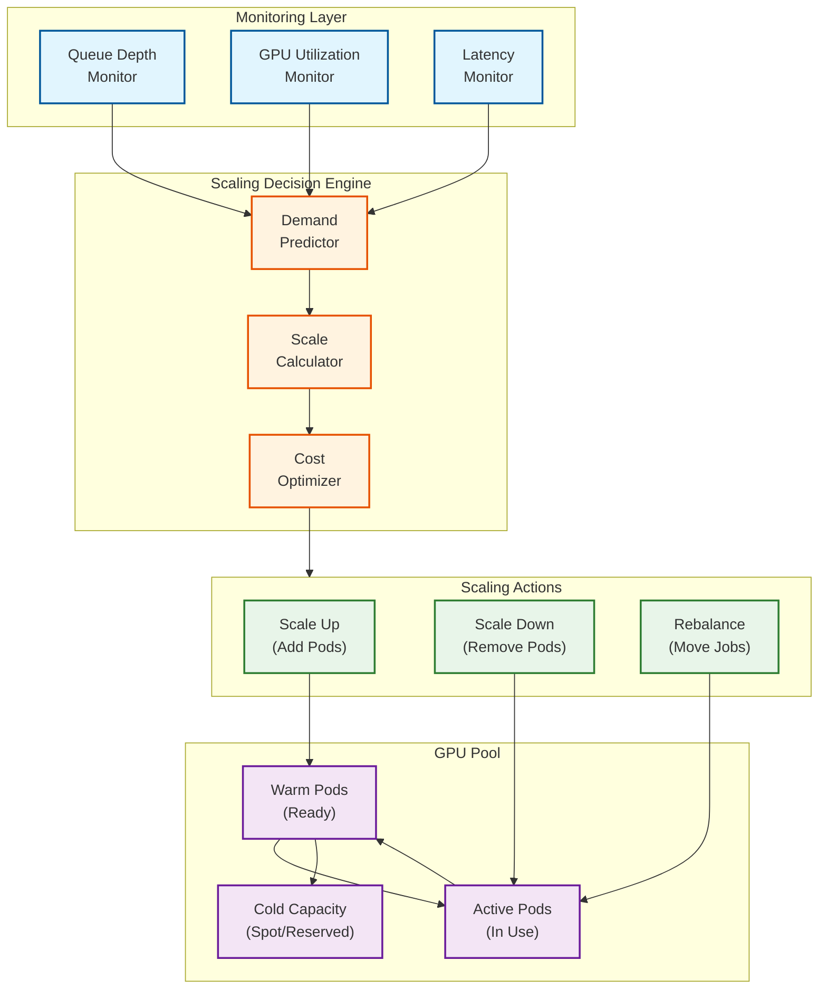
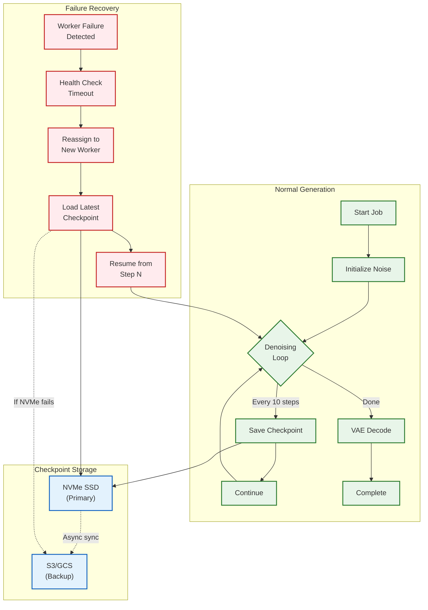
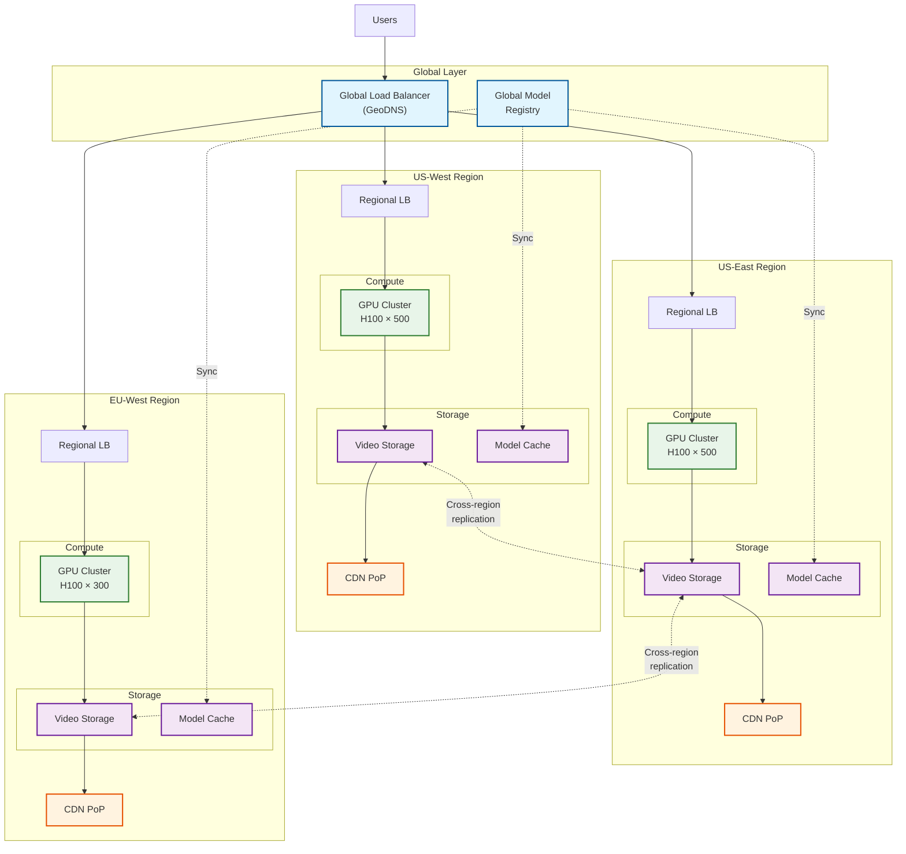

# Scalability and Reliability

## Horizontal Scaling Strategy

### GPU Cluster Auto-Scaling



### Scaling Policies

| Trigger | Condition | Action | Cooldown |
|---------|-----------|--------|----------|
| **Queue Depth High** | >100 jobs waiting >5min | Add 10% capacity | 5 min |
| **Queue Depth Critical** | >500 jobs waiting >10min | Add 25% capacity | 2 min |
| **GPU Utilization High** | >85% for 10min | Add 10% capacity | 5 min |
| **GPU Utilization Low** | <40% for 30min | Remove 10% capacity | 15 min |
| **P99 Latency Breach** | >2x SLO for 5min | Add 20% capacity | 3 min |
| **Scheduled Scale** | Peak hours (9am-9pm) | Pre-scale +30% | N/A |

### Time-of-Day Scaling Pattern

```
Capacity vs Time (UTC)

120% ─┐                                    ┌─────┐
      │          ┌────────────────────────┤     │
100% ─┼──────────┤                        │     │
      │          │                        │     ├──────
 80% ─┤          │                        │     │
      │          │                        │     │
 60% ─┤          │                        │     │
      │          │                        │     │
 40% ─┤          │                        │     │
      └──┬───────┴────┬───────┬───────┬───┴─────┴───┬──
        00:00      06:00    12:00    18:00        24:00

        Night     Morning   Afternoon Evening     Night
        (Low)     (Ramp)    (Peak)    (Peak)      (Low)
```

---

## GPU Orchestration

### Multi-Node Tensor Parallelism with Torchrun

```
┌─────────────────────────────────────────────────────────────────────────────┐
│                    Tensor Parallelism Configuration                          │
├─────────────────────────────────────────────────────────────────────────────┤
│                                                                             │
│  Single Job Distribution (10B param DiT)                                    │
│                                                                             │
│  ┌─────────────────────────────────────────────────────────────────────┐   │
│  │                         Pod: 8× H100 GPUs                            │   │
│  │                                                                      │   │
│  │   GPU 0      GPU 1      GPU 2      GPU 3                            │   │
│  │   ┌────┐     ┌────┐     ┌────┐     ┌────┐                           │   │
│  │   │DiT │     │DiT │     │DiT │     │DiT │                           │   │
│  │   │Shard│◄──►│Shard│◄──►│Shard│◄──►│Shard│   ← NVLink (900 GB/s)    │   │
│  │   │ 0  │     │ 1  │     │ 2  │     │ 3  │                           │   │
│  │   └────┘     └────┘     └────┘     └────┘                           │   │
│  │                                                                      │   │
│  │   GPU 4      GPU 5      GPU 6      GPU 7                            │   │
│  │   ┌────┐     ┌────┐     ┌────┐     ┌────┐                           │   │
│  │   │DiT │     │DiT │     │DiT │     │DiT │                           │   │
│  │   │Shard│◄──►│Shard│◄──►│Shard│◄──►│Shard│                          │   │
│  │   │ 4  │     │ 5  │     │ 6  │     │ 7  │                           │   │
│  │   └────┘     └────┘     └────┘     └────┘                           │   │
│  │                                                                      │   │
│  │   Each GPU holds: 10B / 8 = 1.25B params = 2.5 GB weights           │   │
│  │   Remaining VRAM: 77.5 GB for activations + latents                 │   │
│  │                                                                      │   │
│  └─────────────────────────────────────────────────────────────────────┘   │
│                                                                             │
│  Torchrun Launch:                                                           │
│  torchrun --nnodes=1 --nproc_per_node=8 --rdzv_backend=c10d               │
│           --rdzv_endpoint=localhost:29500 generate.py                      │
│                                                                             │
│  Sharding Strategy:                                                         │
│  - Attention heads split across GPUs (column parallel)                     │
│  - MLP layers split (column parallel for first, row for second)            │
│  - Embedding table replicated                                               │
│                                                                             │
└─────────────────────────────────────────────────────────────────────────────┘
```

### NVIDIA Run:ai Integration

| Feature | Configuration | Purpose |
|---------|---------------|---------|
| **GPU Quotas** | Per-team limits | Fair resource allocation |
| **Preemption** | Premium > Standard > Free | Priority enforcement |
| **Gang Scheduling** | All 8 GPUs or none | Tensor parallelism |
| **Bin Packing** | Optimize utilization | Cost efficiency |
| **Fair Share** | Weighted by tier | Prevent starvation |
| **Over-quota Borrowing** | Allow when idle | Maximize utilization |

### GPU Fleet Configuration

```yaml
# Run:ai Project Configuration
apiVersion: run.ai/v1
kind: Project
metadata:
  name: video-generation
spec:
  resources:
    gpu:
      guaranteed: 1000  # Minimum GPUs
      limit: 2000       # Maximum GPUs
    priority:
      default: 50
      premium: 100
      free: 10

  scheduling:
    policy: fair-share
    preemption:
      enabled: true
      gracePeriod: 60s
      checkpointFirst: true

  nodeSelector:
    nvidia.com/gpu.product: "NVIDIA-H100-80GB"

  tolerations:
    - key: "nvidia.com/gpu"
      operator: "Exists"
      effect: "NoSchedule"
```

---

## GPU Type Selection

### Hardware Comparison

| Spec | H100 80GB | A100 80GB | L40S 48GB | H200 141GB |
|------|-----------|-----------|-----------|------------|
| **VRAM** | 80 GB | 80 GB | 48 GB | 141 GB |
| **Memory BW** | 3.35 TB/s | 2 TB/s | 864 GB/s | 4.8 TB/s |
| **FP16 TFLOPS** | 1,979 | 312 | 362 | 1,979 |
| **TensorCore FP16** | 3,958 | 624 | 724 | 3,958 |
| **Interconnect** | NVLink 4.0 | NVLink 3.0 | PCIe 4.0 | NVLink 4.0 |
| **Price/hour** | $3.00 | $1.50 | $0.80 | $4.50 |
| **10s 1080p Time** | 45s | 90s | N/A (VRAM) | 40s |

### Workload Routing Matrix

| Workload | Resolution | Duration | Recommended GPU | Reason |
|----------|------------|----------|-----------------|--------|
| Real-time preview | 720p | 5s | L40S | Cost, latency |
| Standard | 1080p | 10s | H100 | Performance |
| High quality | 1080p | 30s | H100 8x | VRAM |
| Cinema | 4K | 60s | H100 8x / H200 | Memory BW |
| Batch (overnight) | Any | Any | A100 | Cost |

### Cost Optimization Mix

```
Recommended Fleet Composition:

┌─────────────────────────────────────────────────────────────────────────┐
│                                                                         │
│  Premium Tier (30% of jobs)         Standard Tier (50% of jobs)        │
│  ┌─────────────────────────┐        ┌─────────────────────────┐        │
│  │  100% H100 80GB         │        │  70% H100 80GB          │        │
│  │  Dedicated capacity     │        │  30% A100 80GB (off-peak)│       │
│  │  NVLink topology        │        │  Shared capacity         │        │
│  └─────────────────────────┘        └─────────────────────────┘        │
│                                                                         │
│  Free/Relax Tier (20% of jobs)                                         │
│  ┌─────────────────────────────────────────────────────────────────┐   │
│  │  50% A100 80GB (on-demand)                                       │   │
│  │  50% Spot instances (preemptible)                                │   │
│  │  Longer queue times acceptable                                   │   │
│  └─────────────────────────────────────────────────────────────────┘   │
│                                                                         │
│  Cost Savings:                                                          │
│  - A100 vs H100: 50% cost reduction, 2x time (acceptable for free)    │
│  - Spot instances: 60-70% cost reduction                               │
│  - Blended cost: ~$2.10/GPU-hour (vs $3.00 all H100)                  │
│                                                                         │
└─────────────────────────────────────────────────────────────────────────┘
```

---

## Fault Tolerance

### Checkpoint-Based Recovery



### Checkpoint Contents

```yaml
checkpoint:
  metadata:
    request_id: "550e8400..."
    worker_id: "worker-pod-1"
    step: 30
    total_steps: 50
    created_at: "2026-01-28T10:30:25Z"

  model_state:
    # Not stored - loaded from model registry

  generation_state:
    latent_tensor:
      path: "/nvme/checkpoints/550e8400/step_30.pt"
      shape: [1, 60, 135, 240, 16]
      dtype: "float16"
      size_bytes: 62914560

    rng_state:
      cpu_state: "base64_encoded..."
      cuda_state: "base64_encoded..."

    scheduler_state:
      current_timestep: 0.4
      timesteps_remaining: [0.38, 0.36, ..., 0.0]
      sigma_schedule: [...]

    audio_state:  # If audio enabled
      audio_latent_path: "/nvme/checkpoints/550e8400/audio_30.pt"

  recovery_info:
    last_heartbeat: "2026-01-28T10:30:24Z"
    estimated_remaining_steps: 20
    estimated_remaining_time_ms: 14000
```

### Worker Health Monitoring

| Check | Interval | Timeout | Action on Failure |
|-------|----------|---------|-------------------|
| **Heartbeat** | 5s | 15s | Mark unhealthy |
| **GPU Memory** | 10s | - | Alert if >95% |
| **CUDA Error** | Continuous | - | Restart worker |
| **Progress Stall** | 30s | 60s | Force checkpoint + reassign |
| **Network** | 10s | 30s | Failover to backup |

### Request Recovery Strategy

```
RECOVERY_PROCEDURE:

1. Detect Failure
   - Heartbeat timeout (15s no response)
   - CUDA error reported
   - Progress stalled (60s no update)

2. Immediate Actions
   - Mark worker as DRAINING
   - Stop sending new jobs to worker
   - Log failure event with context

3. Checkpoint Recovery
   IF checkpoint exists AND age < 5 minutes:
       - Load checkpoint from NVMe
       - Verify integrity (checksum)
       - Assign to new healthy worker
       - Resume from checkpoint step
   ELSE:
       - Restart job from beginning
       - Apply priority boost (queue jump)

4. Worker Recovery
   - Attempt CUDA context reset
   - If fails, drain and restart pod
   - Update model cache if corrupted

5. User Notification
   - Send progress event: "Resuming from checkpoint"
   - Update ETA based on recovery time
```

### Circuit Breaker Pattern

```
CIRCUIT_BREAKER_CONFIG:

  per_model:
    error_threshold: 5 failures in 1 minute
    recovery_timeout: 30 seconds
    half_open_requests: 3

  states:
    CLOSED:
      # Normal operation
      # Track error rate
      IF errors > threshold:
          transition to OPEN

    OPEN:
      # Reject new requests for this model
      # Return 503 Service Unavailable
      # After recovery_timeout:
          transition to HALF_OPEN

    HALF_OPEN:
      # Allow limited requests
      IF half_open_requests succeed:
          transition to CLOSED
      ELSE:
          transition to OPEN

  fallback:
    # Route to backup model if primary circuit open
    MOCHI1 -> OPENSORA (quality fallback)
    VEO3 -> MOCHI1 (feature fallback, no audio)
```

---

## Multi-Region Architecture



### Regional Failover

| Scenario | Detection | Action | RTO |
|----------|-----------|--------|-----|
| **Single GPU failure** | Health check | Reassign job | 30s |
| **Pod failure** | K8s liveness | Reschedule pod | 2min |
| **Node failure** | Node controller | Drain + reschedule | 5min |
| **Zone failure** | Zone health | Route to other zones | 5min |
| **Region failure** | Regional health | Route to other region | 10min |

### Cross-Region Data Strategy

| Data Type | Replication | Latency Tolerance | Strategy |
|-----------|-------------|-------------------|----------|
| **Model weights** | All regions | Hours | Pre-deployed |
| **User metadata** | All regions | Minutes | Async sync |
| **Generated videos** | Primary + 1 backup | Hours | Lazy replication |
| **Checkpoints** | Primary region only | N/A | Local only |
| **Queue state** | Primary region | Seconds | Not replicated |

---

## Disaster Recovery

### Recovery Objectives

| Tier | RTO | RPO | Strategy |
|------|-----|-----|----------|
| **Premium** | 10 min | 0 (no data loss) | Multi-region active-active |
| **Standard** | 30 min | 5 min | Multi-region with failover |
| **Free** | 2 hours | 1 hour | Single region, backup restore |

### Backup Strategy

```
BACKUP_SCHEDULE:

  Model Registry:
    - Full backup: Daily at 02:00 UTC
    - Incremental: Hourly
    - Retention: 30 days
    - Cross-region copy: Immediate

  Video Storage:
    - No backup (regenerable)
    - Cross-region replication for premium users

  Metadata Database:
    - Continuous WAL shipping to standby
    - Point-in-time recovery: 7 days
    - Daily snapshots: 30 days

  Configuration:
    - GitOps: All config in version control
    - Secrets: Vault with cross-region replication
```

### Failure Scenarios and Response

| Scenario | Impact | Detection | Response |
|----------|--------|-----------|----------|
| **GPU driver crash** | Single job fails | CUDA error | Restart worker, resume from checkpoint |
| **Model corruption** | Multiple jobs fail | Checksum mismatch | Reload from registry |
| **Storage full** | New jobs rejected | Capacity alert | Delete old checkpoints, scale storage |
| **Network partition** | Region isolated | Health checks | Route traffic to other regions |
| **Database failure** | Metadata unavailable | Connection errors | Failover to standby |
| **CDN outage** | Video delivery fails | 5xx errors | Direct from origin |

### Chaos Engineering Experiments

| Experiment | Frequency | Scope | Expected Outcome |
|------------|-----------|-------|------------------|
| **Kill random worker** | Daily | Single pod | Job resumes from checkpoint |
| **Inject latency** | Weekly | Network | Queue adapts, no failures |
| **Fail zone** | Monthly | Zone | Traffic routes to healthy zones |
| **Corrupt checkpoint** | Monthly | Single job | Job restarts, user notified |
| **Full region failover** | Quarterly | Region | <10min RTO achieved |

---

## Capacity Planning

### Growth Projections

| Metric | Current | +6 Months | +12 Months | +24 Months |
|--------|---------|-----------|------------|------------|
| **Daily Videos** | 10M | 25M | 50M | 100M |
| **Peak QPS** | 350 | 875 | 1,750 | 3,500 |
| **GPU Fleet (H100)** | 2,000 | 5,000 | 10,000 | 20,000 |
| **Storage (PB)** | 0.5 | 1.5 | 4 | 10 |
| **Regions** | 3 | 4 | 5 | 7 |

### Scaling Milestones

| Milestone | Trigger | Action |
|-----------|---------|--------|
| **10M videos/day** | Current | Baseline architecture |
| **25M videos/day** | Q2 2026 | Add 4th region (APAC) |
| **50M videos/day** | Q4 2026 | Implement hierarchical generation |
| **100M videos/day** | 2027 | Edge inference for previews |
