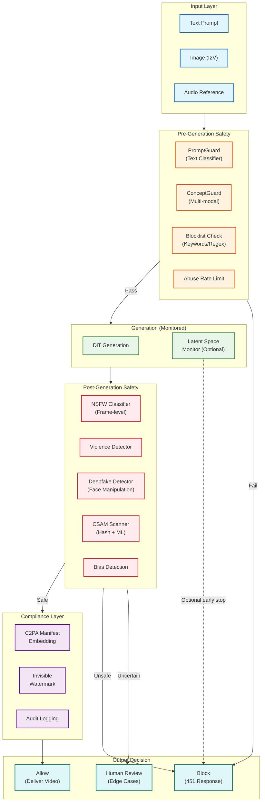

# Security and Compliance

## Content Safety Architecture

### Multi-Layer Safety Pipeline



### Pre-Generation Safety (ConceptGuard, PromptGuard)

| Component | Function | Performance |
|-----------|----------|-------------|
| **PromptGuard** | Text-only harmful prompt detection | 97.65% block rate, 2.35% bypass |
| **ConceptGuard** | Multi-modal (text + image) safety | 99%+ detection for composite threats |
| **Blocklist** | Known harmful patterns | Instant, ~0.1ms |
| **Semantic Classifier** | Intent detection (violence, CSAM, etc.) | ~50ms per prompt |

**PromptGuard Bypass Prevention:**

```
PREGEN_SAFETY_ENSEMBLE:

  Layer 1: Keyword Blocklist
    - Exact match banned terms
    - Regex patterns for obfuscation (l33t speak, etc.)
    - ~99% of obvious violations caught

  Layer 2: PromptGuard Classifier
    - Fine-tuned language model
    - Categories: violence, sexual, hate, self-harm, CSAM
    - Confidence threshold: 0.7 (block) / 0.5 (review)

  Layer 3: ConceptGuard (for I2V)
    - Multi-modal: text + image analysis
    - Detects composite threats (innocent text + harmful image)
    - Critical for image-to-video generation

  Layer 4: Semantic Intent Analysis
    - Detects euphemisms and coded language
    - Tracks prompt evolution (jailbreak attempts)
    - Rate limits suspicious patterns
```

### Post-Generation Safety Classifiers

| Classifier | Granularity | Threshold | Action |
|------------|-------------|-----------|--------|
| **NSFW (Sexual)** | Frame-level | >0.9 any frame | Block |
| **NSFW (Sexual)** | Frame-level | 0.7-0.9 | Human review |
| **Violence (Graphic)** | Clip-level | >0.85 | Block |
| **Violence (Stylized)** | Clip-level | >0.95 | Allow with warning |
| **Deepfake (Face Manip)** | Clip-level | >0.7 | Block |
| **CSAM** | Frame-level | Any detection | Block + Report |
| **Hate Symbols** | Frame-level | >0.8 | Block |

---

## Deepfake Detection and Prevention

### Detection Mechanisms

```
DEEPFAKE_DETECTION_PIPELINE:

  Stage 1: Face Detection
    - Detect all faces in generated video
    - Extract face regions per frame
    - Track face identity across frames

  Stage 2: Manipulation Detection
    ┌─────────────────────────────────────────────────────────────────┐
    │  Detector Ensemble                                               │
    │                                                                  │
    │  1. Frequency Analysis                                          │
    │     - GAN artifacts in frequency domain                         │
    │     - Diffusion-specific patterns                               │
    │                                                                  │
    │  2. Temporal Consistency                                        │
    │     - Unnatural blinking patterns                               │
    │     - Lip-sync artifacts                                        │
    │     - Expression discontinuities                                │
    │                                                                  │
    │  3. Physiological Signals                                       │
    │     - Pulse detection (should be absent in synthetic)           │
    │     - Breathing patterns                                        │
    │                                                                  │
    │  4. Semantic Analysis                                           │
    │     - Identity verification against known faces                 │
    │     - Context appropriateness                                   │
    │                                                                  │
    └─────────────────────────────────────────────────────────────────┘

  Stage 3: Decision
    - Ensemble score > 0.7: Block
    - Ensemble score 0.4-0.7: Human review
    - Ensemble score < 0.4: Allow (with C2PA marking)

  Stage 4: Reporting
    - All detected deepfakes logged
    - Suspicious patterns reported to trust & safety
    - Repeat offenders flagged for account review
```

### Real Person Protection

| Protection | Implementation |
|------------|----------------|
| **Celebrity Detection** | Face recognition against protected persons database |
| **Public Figure Blocking** | Block generation of politicians, executives, etc. |
| **Identity Consent** | Require explicit consent for likeness use |
| **De-identification** | Blur/anonymize faces if consent not verified |
| **Voice Protection** | Block voice cloning of protected individuals |

---

## Watermarking and Provenance

### C2PA Manifest for Video

```
C2PA_MANIFEST_STRUCTURE:

{
  "claim": {
    "dc:title": "AI Generated Video",
    "dc:format": "video/mp4",
    "claim_generator": "VideoGenPlatform/1.0",

    "assertions": [
      {
        "label": "c2pa.actions",
        "data": {
          "actions": [
            {
              "action": "c2pa.created",
              "digitalSourceType": "http://cv.iptc.org/newscodes/digitalsourcetype/trainedAlgorithmicMedia",
              "softwareAgent": {
                "name": "VideoGen DiT v3.0",
                "version": "3.0.0"
              },
              "parameters": {
                "prompt": "[REDACTED]",  // Optional: include or hash
                "model": "MOCHI1",
                "seed": 42,
                "duration_seconds": 10
              }
            }
          ]
        }
      },
      {
        "label": "c2pa.hash.data",
        "data": {
          "exclusions": [],
          "name": "jumbf manifest",
          "hash": "sha256:abc123...",
          "pad": 0
        }
      }
    ],

    "signature_info": {
      "issuer": "CN=VideoGenPlatform,O=Example Inc",
      "time": "2026-01-28T10:30:45Z",
      "alg": "ES256"
    }
  }
}
```

### Invisible Watermarking

| Technique | Robustness | Payload | Detection |
|-----------|------------|---------|-----------|
| **Frequency Domain** | Survives compression | 128 bits | Requires full video |
| **Temporal Pattern** | Survives re-encoding | 64 bits | Requires 5+ seconds |
| **Meta Video Seal** | Survives editing | 256 bits | Open-source detector |
| **Combined** | High | 256+ bits | Multiple methods |

```
WATERMARK_EMBEDDING:

  Per-Frame Watermark:
    1. Transform frame to frequency domain (DCT/DWT)
    2. Embed payload in mid-frequency coefficients
    3. Ensure invisibility: PSNR > 40dB
    4. Inverse transform

  Temporal Watermark:
    1. Encode message as temporal pattern
    2. Modulate frame brightness/color slightly
    3. Pattern spans multiple frames
    4. Survives frame drops up to 30%

  Payload Contents:
    - Platform identifier (8 bits)
    - Generation timestamp (32 bits)
    - Request ID hash (64 bits)
    - User ID hash (32 bits)
    - Version (8 bits)
    - Checksum (16 bits)
    - Padding/ECC (96 bits)
    Total: 256 bits
```

---

## Regulatory Compliance

### Compliance Requirements by Regulation

| Regulation | Requirement | Implementation |
|------------|-------------|----------------|
| **EU AI Act** | Synthetic media disclosure | C2PA manifest, visible label option |
| **EU AI Act** | High-risk AI documentation | Model cards, training data disclosure |
| **DEFIANCE Act (US)** | Deepfake prevention | Face detection + blocking |
| **DEFIANCE Act (US)** | Victim recourse | Takedown process, evidence preservation |
| **CSAM Laws** | Detection + reporting | NCMEC integration, hash matching |
| **GDPR** | Data subject rights | Prompt/video deletion on request |
| **CCPA** | Consumer rights | Data access, deletion, opt-out |

### EU AI Act Compliance

```
EU_AI_ACT_REQUIREMENTS:

  Article 50 - Transparency for AI-Generated Content:

    1. Marking Requirement:
       - AI-generated videos must be marked as synthetic
       - Machine-readable (C2PA) + human-visible option
       - Marking must be "clear and distinguishable"

    2. Implementation:
       ┌─────────────────────────────────────────────────────────────┐
       │  Compliance Checklist:                                       │
       │                                                              │
       │  [x] C2PA manifest embedded in all videos                   │
       │  [x] "AI Generated" metadata in file                        │
       │  [ ] Optional visible watermark (user choice)               │
       │  [x] Provenance preserved through distribution              │
       │  [x] Detection API for verification                         │
       └─────────────────────────────────────────────────────────────┘

    3. Exemptions:
       - Clearly artistic/satirical content (still recommend marking)
       - Private, non-distributed use

    4. Penalties:
       - Up to 3% of global annual turnover
       - Individual fines up to €15M
```

### DEFIANCE Act (US) Compliance

```
DEFIANCE_ACT_REQUIREMENTS (Effective January 2026):

  Scope:
    - Non-consensual deepfakes depicting identifiable individuals
    - Sexual content without consent
    - Malicious impersonation

  Platform Obligations:

    1. Prevention:
       - Detect and block deepfakes of real persons
       - Face recognition against protected database
       - Block generation requests for known public figures

    2. Takedown:
       - 48-hour takedown SLA upon valid request
       - Evidence preservation for legal proceedings
       - Notification to user who created content

    3. Victim Support:
       - Clear reporting mechanism
       - Dedicated trust & safety team
       - Cooperation with law enforcement

  Implementation:
    ┌─────────────────────────────────────────────────────────────────┐
    │  Face Detection Pipeline:                                        │
    │                                                                  │
    │  Input Prompt → Check for real person mentions                  │
    │  Generated Video → Face extraction → Identity check             │
    │                                                                  │
    │  IF identity matches protected person AND no consent:           │
    │      BLOCK generation                                           │
    │      LOG attempt                                                │
    │      ALERT if repeat offender                                   │
    └─────────────────────────────────────────────────────────────────┘
```

---

## Authentication and Authorization

### API Authentication

| Method | Use Case | Security Level |
|--------|----------|----------------|
| **API Key** | Server-to-server | Medium |
| **OAuth 2.0** | User-facing apps | High |
| **JWT** | Session management | High |
| **mTLS** | Enterprise integration | Very High |

### Per-Second Pricing Authorization

```
AUTHORIZATION_FLOW:

  1. Request Received:
     - Validate API key / OAuth token
     - Check account status (active, not suspended)

  2. Quota Check:
     - Retrieve user's current usage
     - Calculate cost: duration × resolution_multiplier × tier_multiplier
     - Check against prepaid balance or credit limit

  3. Authorization Decision:
     IF balance >= estimated_cost:
         AUTHORIZE (reserve funds)
     ELSE IF credit_limit_available:
         AUTHORIZE with credit
     ELSE:
         REJECT (402 Payment Required)

  4. Post-Generation:
     - Calculate actual cost (may differ from estimate)
     - Finalize charge
     - Update usage metrics
```

### Rate Limiting per Tier

| Tier | Requests/min | Concurrent Jobs | Daily Limit |
|------|--------------|-----------------|-------------|
| **Free** | 5 | 1 | 10 videos |
| **Standard** | 30 | 5 | 100 videos |
| **Premium** | 100 | 20 | Unlimited |
| **Enterprise** | Custom | Custom | Custom |

---

## Data Security

### Encryption Specification

| Data State | Encryption | Algorithm | Key Management |
|------------|------------|-----------|----------------|
| **In Transit** | TLS 1.3 | AES-256-GCM | Automatic rotation |
| **At Rest (Storage)** | AES-256 | AES-256-GCM | KMS (HSM-backed) |
| **At Rest (GPU)** | Memory encryption | AMD SME / NVIDIA CC | Hardware |
| **Checkpoints** | AES-256 | AES-256-GCM | Per-user key |

### PII Handling

```
PII_HANDLING_POLICY:

  Collected PII:
    - User ID (required for billing)
    - Email (required for account)
    - IP address (logged for abuse prevention)
    - Payment info (via third-party processor)

  NOT Collected:
    - Full prompts (hashed for analytics, not stored)
    - Generated video content (user owns)
    - Face biometrics (processed transiently, not stored)

  Retention:
    - Account data: Duration of account + 30 days
    - Billing records: 7 years (legal requirement)
    - Audit logs: 90 days
    - Generated videos: User-controlled (default 30 days)

  Data Subject Rights:
    - Access: Export all data within 30 days
    - Deletion: Delete within 30 days (except legal holds)
    - Portability: Standard format export
    - Objection: Opt-out of analytics
```

---

## Threat Model

### Attack Vectors

| Attack | Likelihood | Impact | Mitigation |
|--------|------------|--------|------------|
| **Prompt Injection** | High | Medium | Multi-layer safety, input validation |
| **Jailbreak Attempts** | High | High | Evolving classifiers, rate limiting |
| **Deepfake for Fraud** | Medium | Very High | Face detection, identity verification |
| **CSAM Generation** | Low | Critical | Hash matching, ML detection, reporting |
| **DDoS** | Medium | High | Rate limiting, CDN protection |
| **Account Takeover** | Medium | High | MFA, anomaly detection |
| **API Key Theft** | Medium | High | Key rotation, IP allowlisting |
| **Model Extraction** | Low | Medium | API-only access, no model download |

### Deepfake Attack Scenarios

```
DEEPFAKE_THREAT_SCENARIOS:

  Scenario 1: Political Manipulation
    Attack: Generate fake video of politician
    Detection: Celebrity database check
    Mitigation: Block known public figures

  Scenario 2: Non-Consensual Intimate Imagery
    Attack: Generate explicit content of real person
    Detection: Face + NSFW detection
    Mitigation: Block, report, preserve evidence

  Scenario 3: Financial Fraud
    Attack: Fake video for KYC/identity verification
    Detection: Liveness check fails, C2PA absent
    Mitigation: Encourage C2PA verification at recipients

  Scenario 4: Reputation Damage
    Attack: Generate embarrassing content of individual
    Detection: Identity match + context analysis
    Mitigation: Block, takedown process, legal support
```

---

## Security Monitoring

### Audit Logging

```
AUDIT_LOG_SCHEMA:

{
  "timestamp": "2026-01-28T10:30:45.123Z",
  "event_type": "generation.completed",
  "request_id": "550e8400...",
  "user_id": "user_123",
  "ip_address": "203.0.113.1",
  "user_agent": "VideoGenSDK/1.0",

  "request": {
    "prompt_hash": "sha256:abc123...",  // Not full prompt
    "model": "MOCHI1",
    "duration_seconds": 10,
    "resolution": "1080P",
    "enable_audio": false
  },

  "safety": {
    "pre_gen_score": 0.95,
    "post_gen_score": 0.98,
    "classifiers_triggered": [],
    "deepfake_score": 0.12
  },

  "outcome": {
    "status": "COMPLETED",
    "video_hash": "sha256:def456...",
    "c2pa_manifest_id": "manifest_789",
    "generation_time_ms": 45000
  }
}
```

### CSAM Response Procedure

```
CSAM_RESPONSE_PROCEDURE:

  Detection:
    1. PhotoDNA hash matching against NCMEC database
    2. ML classifier (conservative threshold: 0.5)
    3. Human review for borderline cases

  Immediate Actions:
    1. Block video delivery
    2. Preserve evidence (encrypted, access-controlled)
    3. Suspend user account pending investigation
    4. Alert Trust & Safety team

  Reporting (within 24 hours):
    1. File CyberTipline report to NCMEC
    2. Include: User info, IP, timestamp, content hash
    3. Do NOT include actual content

  Legal:
    1. Cooperate with law enforcement requests
    2. Retain evidence per legal hold
    3. Document chain of custody

  Follow-up:
    1. Review account history
    2. Block related accounts
    3. Update detection models with new patterns
```
