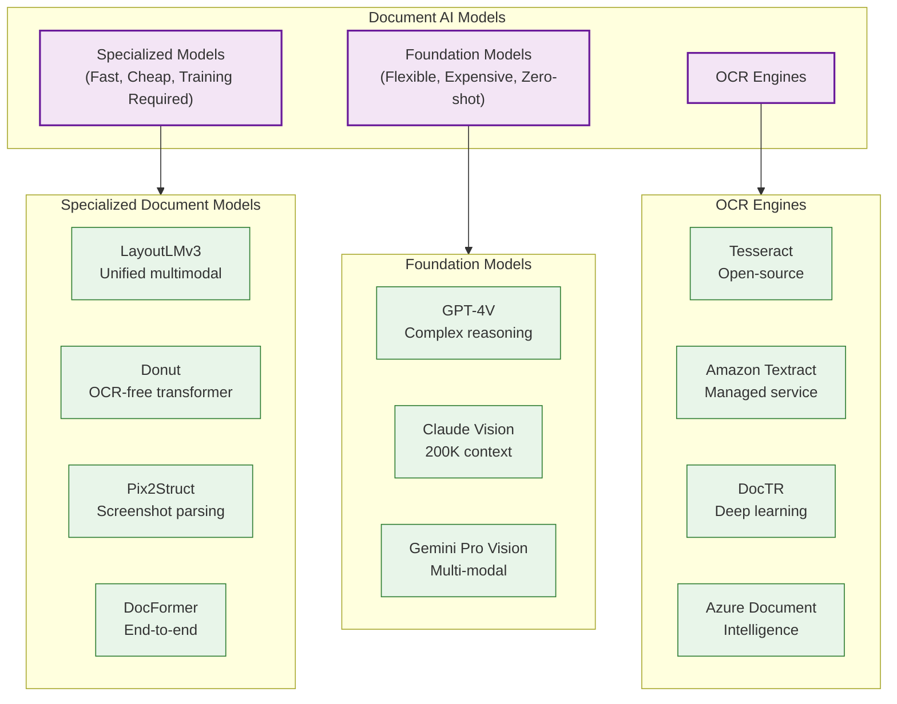
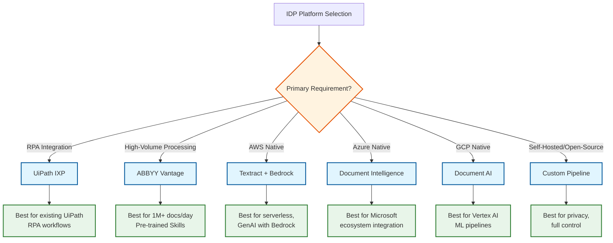
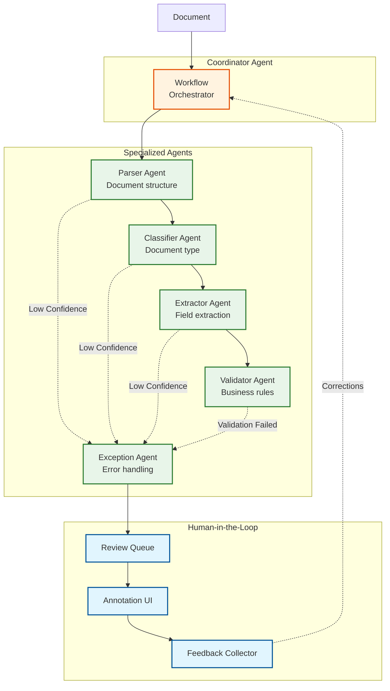

# AI-Native Document Processing Platform (IDP)

## System Overview

An **AI-Native Intelligent Document Processing (IDP) Platform** combines foundation models (GPT-4V, Claude Vision), specialized document understanding models (LayoutLMv3, Donut, Pix2Struct), and agentic workflows to automate document classification, extraction, validation, and integration. Unlike traditional template-based OCR systems, AI-native IDP uses a **hybrid model strategy** where specialized models handle high-volume document types with speed and cost efficiency, while foundation models serve as fallbacks for complex, novel, or edge-case documents.

The platform implements a **multi-stage processing pipeline**: documents flow through ingestion, pre-processing, classification, extraction, validation, and export stages. **Confidence-based routing** directs low-confidence results to Human-in-the-Loop (HITL) review queues, while high-confidence results auto-complete. Core platforms include UiPath IXP (hybrid foundation + specialized models), ABBYY Vantage 3.0 (containerized microservices with GenAI), Amazon Textract + Bedrock, Microsoft Document Intelligence, and Google Document AI.

**Complexity Rating:** `Very High`

This system is complex due to:
- Multi-model orchestration (OCR, classification, extraction, validation)
- Agentic workflow with confidence-based routing and exception handling
- Human-in-the-Loop integration with variable latency
- Multi-channel ingestion (email, API, scan, upload)
- Compliance requirements (GDPR, HIPAA, PII redaction, audit trails)
- Continuous learning via feedback loops
- Real-time + batch processing modes

---

## Quick Navigation

| Document | Description |
|----------|-------------|
| [01 - Requirements & Estimations](./01-requirements-and-estimations.md) | Functional/Non-functional requirements, capacity planning |
| [02 - High-Level Design](./02-high-level-design.md) | System architecture, data flows, component interactions |
| [03 - Low-Level Design](./03-low-level-design.md) | Data models, API specifications, core algorithms |
| [04 - Deep Dive & Bottlenecks](./04-deep-dive-and-bottlenecks.md) | Critical components, optimizations, failure modes |
| [05 - Scalability & Reliability](./05-scalability-and-reliability.md) | Scaling strategies, fault tolerance, disaster recovery |
| [06 - Security & Compliance](./06-security-and-compliance.md) | PII redaction, threat model, GDPR/HIPAA compliance |
| [07 - Observability](./07-observability.md) | Metrics, logging, tracing, alerting |
| [08 - Interview Guide](./08-interview-guide.md) | Pacing, trade-offs, trap questions |

---

## Key Characteristics

| Aspect | Description |
|--------|-------------|
| **Multi-Channel Ingestion** | Email, REST API, file upload, scanner integration, SFTP |
| **Hybrid AI Pipeline** | Specialized models (LayoutLMv3, Donut) + Foundation models (GPT-4V, Claude) |
| **Agentic Workflows** | Multi-agent orchestration: Parser, Classifier, Extractor, Validator, Exception Handler |
| **Confidence-Based Routing** | Configurable thresholds route low-confidence results to HITL queues |
| **Human-in-the-Loop** | Review interface for corrections, annotations feed back into model training |
| **Continuous Learning** | Feedback loops for model improvement, active learning for labeling prioritization |
| **Compliance** | GDPR, HIPAA, PII detection/redaction, immutable audit trails |

---

## Document Processing Pipeline

```mermaid
flowchart LR
    subgraph Ingestion["Document Ingestion"]
        direction TB
        EMAIL["Email Gateway"]
        API["REST API"]
        UPLOAD["File Upload"]
        SCAN["Scanner"]
    end

    subgraph PreProcess["Pre-Processing"]
        direction TB
        FORMAT["Format Detection"]
        SPLIT["Page Splitting"]
        ENHANCE["Image Enhancement"]
        LANG["Language Detection"]
    end

    subgraph AIModels["AI Model Pipeline"]
        direction TB
        OCR["OCR Engine<br/>(Tesseract/Textract/DocTR)"]
        CLASS["Classification<br/>(LayoutLMv3/Zero-shot)"]
        EXTRACT["Extraction<br/>(Donut/GPT-4V)"]
        VALIDATE["Validation<br/>(Rules + ML)"]
    end

    subgraph Routing["Confidence Routing"]
        direction TB
        CONF{{"Confidence<br/>Check"}}
        AUTO["Auto-Approve"]
        REVIEW["HITL Queue"]
    end

    subgraph Output["Integration"]
        direction TB
        ERP["ERP Systems"]
        CRM["CRM Systems"]
        EXPORT["Export Service"]
    end

    EMAIL --> FORMAT
    API --> FORMAT
    UPLOAD --> FORMAT
    SCAN --> FORMAT

    FORMAT --> SPLIT --> ENHANCE --> LANG
    LANG --> OCR --> CLASS --> EXTRACT --> VALIDATE

    VALIDATE --> CONF
    CONF -->|">90%"| AUTO
    CONF -->|"<90%"| REVIEW
    REVIEW -->|"Corrected"| AUTO

    AUTO --> ERP
    AUTO --> CRM
    AUTO --> EXPORT

    classDef ingestion fill:#e1f5fe,stroke:#01579b,stroke-width:2px
    classDef preprocess fill:#fff3e0,stroke:#e65100,stroke-width:2px
    classDef ai fill:#e8f5e9,stroke:#2e7d32,stroke-width:2px
    classDef routing fill:#fffde7,stroke:#f57f17,stroke-width:2px
    classDef output fill:#f3e5f5,stroke:#6a1b9a,stroke-width:2px

    class EMAIL,API,UPLOAD,SCAN ingestion
    class FORMAT,SPLIT,ENHANCE,LANG preprocess
    class OCR,CLASS,EXTRACT,VALIDATE ai
    class CONF,AUTO,REVIEW routing
    class ERP,CRM,EXPORT output
```

---

## Model Taxonomy

### Model Comparison

| Model | Type | Speed | Accuracy | Cost | Best For |
|-------|------|-------|----------|------|----------|
| **LayoutLMv3** | Specialized | 50ms/page | 90-95% | Free/Self-hosted | Forms, receipts, invoices |
| **Donut** | Specialized | 100ms/page | 88-93% | Free/Self-hosted | OCR-free extraction |
| **Pix2Struct** | Specialized | 80ms/page | 90-94% | Free/Self-hosted | Visual documents, infographics |
| **GPT-4V** | Foundation | 2-3s/page | 92-97% | $0.01/image | Complex, novel documents |
| **Claude Vision** | Foundation | 1-2s/page | 91-96% | $0.008/image | Long documents (200K context) |
| **Tesseract** | OCR | 200ms/page | 85-95% | Free | Basic text extraction |
| **Amazon Textract** | OCR | 500ms/page | 92-98% | $1.50/1K pages | Tables, forms, handwriting |

---

## Platform Comparison

| Platform | Architecture | Key Innovation | Deployment | Best For |
|----------|-------------|----------------|------------|----------|
| **UiPath IXP** | Hybrid Foundation + Specialized | Agentic looping, GenAI fallback | Cloud/On-prem | Enterprise RPA integration |
| **ABBYY Vantage 3.0** | Containerized microservices | Pre-trained Skills, LLM integration | Kubernetes | High-volume processing |
| **Amazon Textract + Bedrock** | Serverless, managed | Native AWS, Bedrock GenAI | Cloud | AWS-native workloads |
| **Microsoft Document Intelligence** | Azure-native | Prebuilt models, custom training | Cloud | Microsoft ecosystem |
| **Google Document AI** | Vertex AI integration | Processor-based, industry models | Cloud | GCP workloads |

### Platform Decision Tree

---

## Key Metrics Reference

| Metric Category | Metric | Target | Description |
|-----------------|--------|--------|-------------|
| **Processing** | Touchless Rate | 50-80% | Documents processed without human review |
| **Processing** | Classification Accuracy | 94-98% | Document type classification |
| **Processing** | Extraction Accuracy | 95%+ | Field-level extraction with HITL |
| **Processing** | Processing Time Reduction | 50-80% | vs manual processing |
| **Latency** | OCR (p95) | < 2s/page | Per-page OCR processing |
| **Latency** | Classification (p95) | < 500ms | Document type classification |
| **Latency** | Extraction (p95) | < 5s/page | Field extraction per page |
| **Latency** | End-to-end (p95) | < 30s | Single-page document |
| **Scale** | Documents/day | 1 million | Enterprise target |
| **Scale** | Document Types | 100+ | Unique types supported |
| **Quality** | HITL Correction Rate | < 20% | Fields needing human correction |
| **Cost** | Cost per Document | $0.05-0.10 | All-in processing cost |

---

## Agentic Workflow Overview

---

## Interview Preparation Checklist

### Must Know
- [ ] Why hybrid models beat single-modal (specialized speed + foundation flexibility)
- [ ] Multi-stage pipeline: Ingestion -> Pre-processing -> Classification -> Extraction -> Validation
- [ ] Confidence-based routing: thresholds determine HITL vs auto-approve
- [ ] HITL feedback loop: corrections improve model over time
- [ ] OCR engine trade-offs (Tesseract vs Textract vs DocTR)
- [ ] Compliance basics (PII detection, GDPR right to erasure, audit trails)

### Should Know
- [ ] LayoutLMv3 architecture (unified text + vision + spatial)
- [ ] Donut OCR-free approach (end-to-end transformer)
- [ ] Agentic workflow patterns (coordinator, specialized agents)
- [ ] Zero-shot classification for new document types
- [ ] Confidence calibration challenges
- [ ] Batch vs real-time processing trade-offs

### Nice to Know
- [ ] Active learning for labeling prioritization
- [ ] Model versioning and A/B testing
- [ ] ColPali for document image retrieval
- [ ] UiPath IXP agentic looping
- [ ] ABBYY pre-trained Skills marketplace
- [ ] GenAI summarization for long documents

---

## Related Systems

| System | Relationship |
|--------|--------------|
| [3.15 RAG System](../3.15-rag-system/00-index.md) | IDP feeds extracted content into RAG pipelines |
| [3.14 Vector Database](../3.14-vector-database/00-index.md) | Stores document embeddings for similarity search |
| [3.24 Multi-Agent Orchestration](../3.24-multi-agent-orchestration-platform/00-index.md) | Patterns for agentic workflow coordination |
| [3.29 AI-Native Hybrid Search](../3.29-ai-native-hybrid-search-engine/00-index.md) | Document search and retrieval |
| [3.22 AI Guardrails & Safety](../3.22-ai-guardrails-safety-system/00-index.md) | Content safety for document processing |
| [3.25 AI Observability & LLMOps](../3.25-ai-observability-llmops-platform/00-index.md) | Monitoring IDP model performance |

---

## References

### Industry Platforms
- [UiPath Document Understanding](https://www.uipath.com/product/document-understanding) - Enterprise IDP with RPA integration
- [ABBYY Vantage](https://www.abbyy.com/vantage/) - Containerized IDP with pre-trained Skills
- [Amazon Textract](https://aws.amazon.com/textract/) - Managed document extraction
- [Microsoft Document Intelligence](https://azure.microsoft.com/en-us/products/ai-services/ai-document-intelligence) - Azure-native IDP
- [Google Document AI](https://cloud.google.com/document-ai) - Vertex AI document processing

### Foundation Models
- [LayoutLMv3 Paper](https://arxiv.org/abs/2204.08387) - Unified multimodal document understanding
- [Donut Paper](https://arxiv.org/abs/2111.15664) - OCR-free document understanding transformer
- [Pix2Struct Paper](https://arxiv.org/abs/2210.03347) - Screenshot parsing as pretraining

### Engineering Blogs
- [AWS GenAI IDP Accelerator](https://aws.amazon.com/blogs/machine-learning/accelerate-intelligent-document-processing-with-generative-ai-on-aws/)
- [ABBYY Vantage 3.0 GenAI Integration](https://www.abbyy.com/company/news/abbyy-launches-vantage-3-genai-integration/)
- [UiPath IXP Platform Evolution](https://www.uipath.com/blog/product-and-updates/intelligent-document-processing-evolution-uipath-ixp)

### Research
- [Document AI: From OCR to Agentic Extraction](https://learn.deeplearning.ai/courses/document-ai-from-ocr-to-agentic-doc-extraction)
- [Hybrid OCR-LLM Framework](https://arxiv.org/html/2510.10138v1) - Enterprise-scale document extraction
