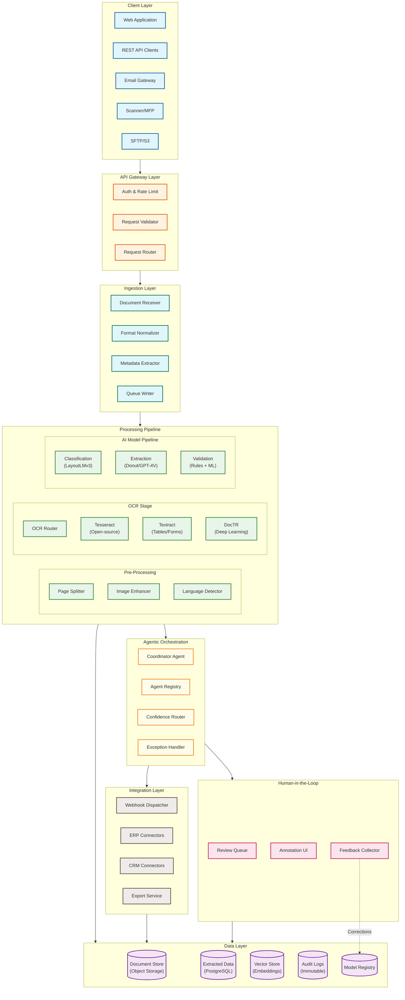
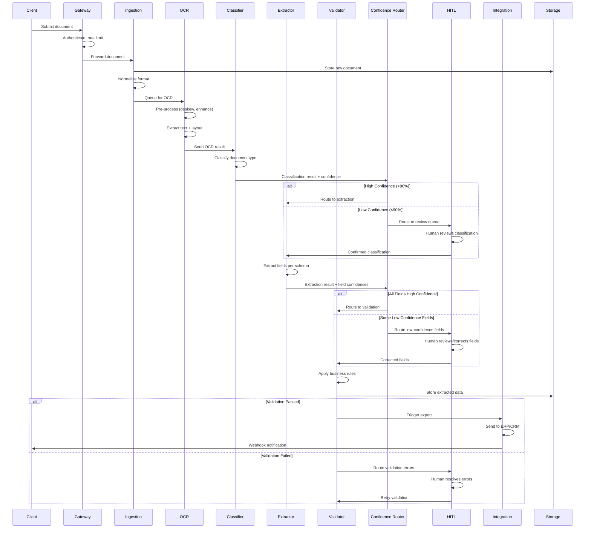
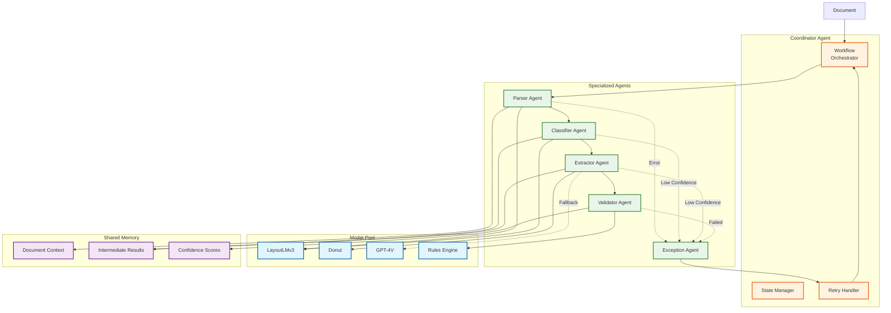
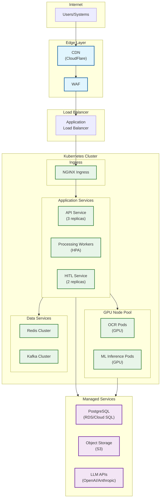

# High-Level Design

## System Architecture



---

## Component Descriptions

### Ingestion Layer

| Component | Responsibility | Technology |
|-----------|----------------|------------|
| **Document Receiver** | Accept documents from all channels, validate format | REST API, SMTP listener, S3 events |
| **Format Normalizer** | Convert all formats to standardized PDF/images | ImageMagick, Ghostscript, LibreOffice |
| **Metadata Extractor** | Extract file metadata (size, pages, type) | Apache Tika, custom parsers |
| **Queue Writer** | Write processing jobs to message queue | Kafka producer, SQS |

### Pre-Processing

| Component | Responsibility | Technology |
|-----------|----------------|------------|
| **Page Splitter** | Split multi-page documents into individual pages | PyMuPDF, pdf2image |
| **Image Enhancer** | Deskew, denoise, binarize, enhance contrast | OpenCV, Pillow |
| **Language Detector** | Identify document language for OCR routing | fastText, langdetect |

### OCR Stage

| Component | Responsibility | Technology |
|-----------|----------------|------------|
| **OCR Router** | Route to appropriate OCR engine based on document type | Custom router |
| **Tesseract** | Open-source OCR for standard documents | Tesseract 5.x |
| **Textract** | Managed OCR for tables, forms, handwriting | Amazon Textract |
| **DocTR** | Deep learning OCR for complex layouts | DocTR (Mindee) |

### AI Model Pipeline

| Component | Responsibility | Technology |
|-----------|----------------|------------|
| **Classifier** | Classify document type with confidence | LayoutLMv3, CLIP |
| **Extractor** | Extract fields based on document type schema | Donut, GPT-4V (fallback) |
| **Validator** | Validate extracted data against business rules | Custom rules engine, ML anomaly detection |

### Agentic Orchestration

| Component | Responsibility | Technology |
|-----------|----------------|------------|
| **Coordinator Agent** | Orchestrate multi-agent workflow, manage retries | Temporal, custom |
| **Agent Registry** | Register and discover available agents | etcd, Consul |
| **Confidence Router** | Route based on confidence thresholds | Custom decision engine |
| **Exception Handler** | Handle errors, escalate to HITL | Custom, alerting integration |

### Human-in-the-Loop

| Component | Responsibility | Technology |
|-----------|----------------|------------|
| **Review Queue** | Prioritized queue of items needing review | Redis, PostgreSQL |
| **Annotation UI** | Web interface for document annotation | React, Canvas-based |
| **Feedback Collector** | Collect corrections, feed into training pipeline | Event streaming |

### Data Layer

| Component | Responsibility | Technology |
|-----------|----------------|------------|
| **Document Store** | Store raw documents with versioning | S3, MinIO |
| **Extracted Data** | Store structured extraction results | PostgreSQL, MongoDB |
| **Vector Store** | Store document embeddings for similarity | Pinecone, Qdrant |
| **Audit Logs** | Immutable processing history | Kafka, ClickHouse |
| **Model Registry** | Version and serve ML models | MLflow, custom |

---

## Data Flow: Document Processing



---

## Agentic Workflow Architecture



### Agent Responsibilities

| Agent | Input | Output | Failure Mode |
|-------|-------|--------|--------------|
| **Parser Agent** | Raw document + OCR | Document structure, sections, tables | Retry with different OCR engine |
| **Classifier Agent** | Parsed document | Document type + confidence | Fallback to zero-shot + HITL |
| **Extractor Agent** | Document type + schema | Field values + confidences | Fallback to foundation model |
| **Validator Agent** | Extracted fields + rules | Validation result + errors | Route to HITL for resolution |
| **Exception Agent** | Any failed task | Recovery action or escalation | Escalate to human operators |

---

## Key Architectural Decisions

### Decision 1: Foundation Model vs Specialized Models

| Option | Pros | Cons |
|--------|------|------|
| **Foundation Only (GPT-4V)** | Flexible, zero-shot, handles novel docs | Expensive ($0.01/image), slow (2-3s), privacy concerns |
| **Specialized Only (LayoutLMv3)** | Fast (50ms), cheap, on-prem privacy | Requires training data, limited to trained types |
| **Hybrid Approach** | Best of both: speed + flexibility | Complexity in routing |

**Decision:** `Hybrid Approach`

**Rationale:**
- Use specialized models (LayoutLMv3, Donut) as primary for trained document types (80% of volume)
- Use foundation models (GPT-4V, Claude) as fallback for low-confidence or novel documents (20%)
- Route based on classification confidence threshold
- Result: 80% cost savings vs foundation-only, 15% accuracy improvement vs specialized-only

### Decision 2: Synchronous vs Asynchronous Processing

| Option | Pros | Cons |
|--------|------|------|
| **Synchronous** | Simple, immediate results | Blocks on slow operations, poor scaling |
| **Asynchronous** | Scalable, resilient, handles variable latency | Eventual consistency, complexity |

**Decision:** `Asynchronous with Queues`

**Rationale:**
- Document processing involves variable latency (OCR, LLM calls)
- HITL creates unpredictable delays (minutes to hours)
- Queue-based architecture enables independent scaling
- Allows batch optimization for GPU utilization
- Provides natural retry and dead-letter handling

### Decision 3: HITL Integration Pattern

| Option | Pros | Cons |
|--------|------|------|
| **Block and Wait** | Simple, guaranteed review | High latency, blocks pipeline |
| **Queue-Based (Selected)** | Non-blocking, scalable | Eventual consistency |
| **Parallel Processing** | Fast for high-confidence | Complexity in reconciliation |

**Decision:** `Queue-Based with Confidence Routing`

**Rationale:**
- Non-blocking: High-confidence documents complete without waiting
- Configurable thresholds per field and document type
- Priority queues for urgent documents
- Feedback loop: Corrections improve models over time

### Decision 4: OCR Strategy

| Option | Pros | Cons |
|--------|------|------|
| **Single Engine** | Simple | Limited accuracy across document types |
| **Multi-Engine Routing** | Optimal per document type | Complexity, multiple integrations |
| **OCR-Free (Donut)** | End-to-end, language-agnostic | Lower accuracy for complex layouts |

**Decision:** `Multi-Engine Routing with OCR-Free Fallback`

**Rationale:**
- Route based on document characteristics:
  - Standard text: Tesseract (fast, free)
  - Tables/forms: Textract (best accuracy)
  - Handwriting: Textract or specialized
  - Complex layouts: DocTR
- OCR-free models (Donut) for validation/comparison

### Decision 5: Storage Architecture

| Option | Pros | Cons |
|--------|------|------|
| **Single Tier** | Simple | Expensive for 7-year retention |
| **Multi-Tier (Hot/Warm/Cold)** | Cost-optimized | Complexity, retrieval latency |
| **Hybrid (Local + Cloud)** | Compliance, performance | Sync complexity |

**Decision:** `Multi-Tier Storage`

**Rationale:**
- Hot (30 days): Frequently accessed, fast retrieval
- Warm (1 year): Occasional access, lower cost
- Cold (7 years): Compliance archive, cheapest
- Automatic lifecycle policies for tier transitions
- Estimated 50% cost savings vs single-tier

---

## Technology Stack

### Core Services

| Layer | Technology | Rationale |
|-------|------------|-----------|
| **API Gateway** | Kong / AWS API Gateway | Rate limiting, auth, routing |
| **Message Queue** | Apache Kafka | High throughput, durability, replay |
| **Task Queue** | Celery + Redis | Python workers, task routing |
| **Workflow Orchestration** | Temporal | Durable workflows, retries, visibility |
| **Service Mesh** | Istio / Linkerd | mTLS, observability, traffic management |

### AI/ML Stack

| Component | Technology | Rationale |
|-----------|------------|-----------|
| **Model Serving** | Triton Inference Server | GPU optimization, batching |
| **Model Registry** | MLflow | Version control, deployment tracking |
| **Feature Store** | Feast | Feature management for ML models |
| **Vector Database** | Qdrant / Pinecone | Document embeddings, similarity search |
| **LLM Gateway** | LiteLLM / Portkey | Multi-provider routing, caching |

### Data Stack

| Component | Technology | Rationale |
|-----------|------------|-----------|
| **Primary Database** | PostgreSQL | ACID, JSON support, mature |
| **Document Store** | S3 / MinIO | Scalable object storage |
| **Cache** | Redis Cluster | Session, queue, caching |
| **Search** | Elasticsearch | Full-text search, analytics |
| **Audit Log** | ClickHouse | Columnar, high-write throughput |

### OCR Engines

| Engine | Use Case | Integration |
|--------|----------|-------------|
| **Tesseract 5.x** | Standard documents | Local, containerized |
| **Amazon Textract** | Tables, forms, handwriting | API |
| **DocTR** | Complex layouts | Local, GPU |
| **Azure Document Intelligence** | Alternative managed | API |

### Frontend

| Component | Technology | Rationale |
|-----------|------------|-----------|
| **HITL Interface** | React + Canvas | Rich annotation UI |
| **Admin Dashboard** | React Admin | Configuration, monitoring |
| **Document Viewer** | PDF.js | In-browser PDF rendering |

---

## Deployment Architecture



---

## Integration Patterns

### Inbound Document Sources

| Source | Protocol | Authentication | Rate Limit |
|--------|----------|----------------|------------|
| **REST API** | HTTPS | API Key / OAuth2 | 1000 req/min |
| **Email** | SMTP/IMAP | Allowlist + SPF/DKIM | 100 emails/min |
| **SFTP** | SFTP | SSH Key | 1000 files/hour |
| **S3 Events** | S3 Notification | IAM Role | Unlimited |
| **Webhook** | HTTPS | HMAC Signature | 500 req/min |

### Outbound Integrations

| Target | Protocol | Pattern | Retry Policy |
|--------|----------|---------|--------------|
| **ERP (SAP/Oracle)** | REST/SOAP | Async webhook | 3 retries, exponential backoff |
| **CRM (Salesforce)** | REST | Async webhook | 3 retries, exponential backoff |
| **Custom Systems** | Webhook | Async | Configurable |
| **File Export** | S3/SFTP | Scheduled batch | N/A |
| **Email Notification** | SMTP | Fire and forget | No retry |

### Webhook Payload Structure

```yaml
{
  "event": "document.processed",
  "timestamp": "2024-01-15T10:30:00Z",
  "document_id": "doc-12345",
  "status": "completed",
  "classification": {
    "type": "invoice",
    "confidence": 0.95
  },
  "extractions": {
    "vendor_name": {"value": "Acme Corp", "confidence": 0.98},
    "invoice_number": {"value": "INV-001", "confidence": 0.99},
    "total_amount": {"value": 1500.00, "confidence": 0.97}
  },
  "validation": {
    "passed": true,
    "errors": []
  },
  "processing_time_ms": 4500,
  "hitl_required": false
}
```
