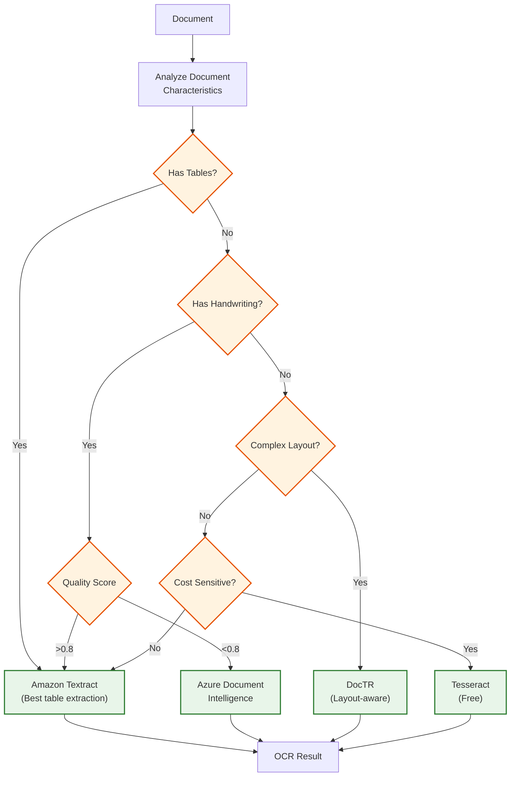
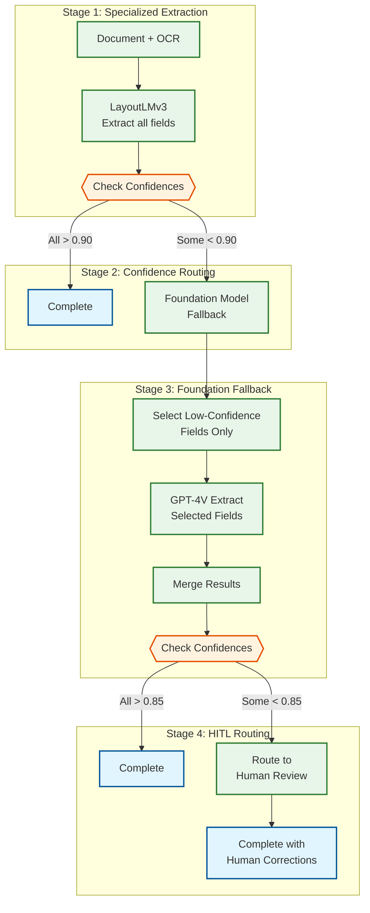
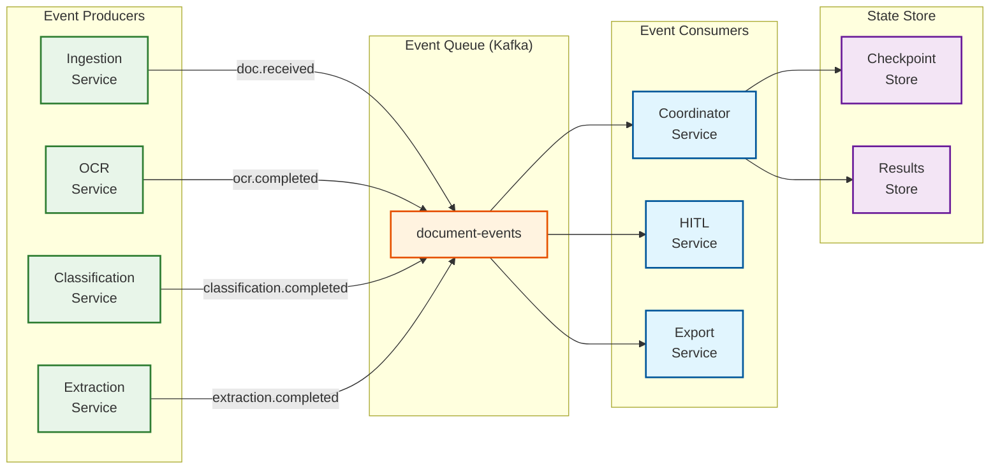

# Deep Dive & Bottlenecks

## Critical Component 1: OCR Quality and Performance

### The Challenge

Document quality varies dramatically in production:
- Clean digital PDFs: 95-98% character accuracy
- High-quality scans (300 DPI): 92-96% accuracy
- Low-quality scans/faxes: 70-85% accuracy
- Handwritten content: 60-80% accuracy
- Mixed content (printed + handwritten): Highly variable

**Impact:** OCR errors compound through the pipeline - a misread digit in an invoice number causes downstream matching failures.

### OCR Engine Comparison

| Engine | Speed | Print Accuracy | Handwriting | Tables | Cost | Best For |
|--------|-------|----------------|-------------|--------|------|----------|
| **Tesseract 5.x** | 200ms/page | 92-96% | Poor (60%) | Basic | Free | Standard documents |
| **Amazon Textract** | 500ms/page | 96-99% | Good (85%) | Excellent | $1.50/1K | Forms, tables, handwriting |
| **DocTR** | 300ms/page | 94-97% | Fair (70%) | Good | Free | Complex layouts |
| **Azure Document Intelligence** | 400ms/page | 96-99% | Good (85%) | Excellent | $1.50/1K | Microsoft ecosystem |
| **Google Document AI** | 400ms/page | 96-99% | Good (85%) | Excellent | $1.50/1K | GCP ecosystem |

### OCR Routing Strategy



### Pre-Processing Pipeline

| Stage | Operation | Impact on Accuracy |
|-------|-----------|-------------------|
| **1. Deskew** | Correct rotation (±5°) | +5-10% on tilted docs |
| **2. Denoise** | Remove speckles, artifacts | +3-5% on faxes/copies |
| **3. Binarization** | Convert to black/white | +2-3% on colored docs |
| **4. DPI Normalization** | Scale to 300 DPI | +5-8% on low-res scans |
| **5. Border Removal** | Remove black borders | +1-2% on scanned docs |
| **6. Contrast Enhancement** | Improve text visibility | +3-5% on faded docs |

### Pre-Processing Algorithm

```
ALGORITHM PreprocessForOCR(image)
INPUT: Raw document image
OUTPUT: Optimized image for OCR

PROCEDURE:
1. // Detect and correct rotation
   angle = detect_skew_angle(image)
   IF abs(angle) > 0.5 THEN
     image = rotate(image, -angle)
   END IF

2. // Assess image quality
   quality = assess_quality(image)
   // Returns: {brightness, contrast, noise_level, dpi, blur_score}

3. // Apply adaptive enhancements based on quality
   IF quality.dpi < 300 THEN
     image = upscale_to_300dpi(image)
   END IF

   IF quality.contrast < 0.5 THEN
     image = enhance_contrast(image, target=0.7)
   END IF

   IF quality.noise_level > 0.3 THEN
     image = denoise(image, strength=quality.noise_level)
   END IF

   IF quality.blur_score < 0.6 THEN
     image = sharpen(image)
   END IF

4. // Binarization for text extraction
   IF is_grayscale_or_bw_beneficial(image) THEN
     image = adaptive_binarize(image)
   END IF

5. RETURN image, quality_report
```

---

## Critical Component 2: Multi-Model Extraction Strategy

### The Challenge

Different field types require different extraction approaches:
- **Structured fields** (dates, amounts): Pattern matching + model confirmation
- **Semi-structured** (addresses, names): NER + layout context
- **Unstructured** (contract clauses): LLM understanding required

Specialized models are 10x faster and 100x cheaper but need training data. Foundation models handle edge cases but are expensive.

### Extraction Strategy Matrix

| Field Type | Primary Model | Fallback | Confidence Threshold | Example Fields |
|------------|---------------|----------|---------------------|----------------|
| **Key-Value Pairs** | LayoutLMv3 | Donut | 0.90 | Invoice number, date |
| **Tables** | Textract/LayoutLMv3 | GPT-4V | 0.85 | Line items, tax breakdown |
| **Named Entities** | LayoutLMv3 + NER | Claude | 0.88 | Vendor name, addresses |
| **Amounts/Currency** | LayoutLMv3 + Rules | GPT-4V | 0.95 | Total, tax, subtotal |
| **Dates** | LayoutLMv3 + Parser | GPT-4V | 0.92 | Invoice date, due date |
| **Free Text** | GPT-4V | Claude | 0.80 | Contract terms, notes |
| **Signatures** | CNN Detector | Human | 0.70 | Signature presence |
| **Handwritten** | Textract | GPT-4V + Human | 0.75 | Handwritten notes |

### Hybrid Extraction Pipeline



### Confidence Calibration

**Problem:** Model confidence scores are often miscalibrated - a model might report 95% confidence but only be correct 80% of the time.

**Solution:** Isotonic regression calibration

```
ALGORITHM CalibrateConfidence(raw_confidence, field_type, model)
INPUT:
  raw_confidence: Model's reported confidence
  field_type: Type of field extracted
  model: Model that produced the confidence

OUTPUT:
  calibrated_confidence: Adjusted confidence based on historical accuracy

PROCEDURE:
1. // Load calibration model for this field type and model
   calibration_model = load_calibration(model, field_type)

2. // Apply isotonic regression
   calibrated = calibration_model.predict(raw_confidence)

3. // Apply field-specific adjustments
   IF field_type IN ["amount", "total"] AND has_currency_symbol THEN
     calibrated *= 1.05  // Currency symbol adds reliability
   END IF

   IF document_quality < 0.7 THEN
     calibrated *= 0.9  // Reduce confidence for poor quality docs
   END IF

4. RETURN min(calibrated, 1.0)

// Calibration model is trained on:
// - (raw_confidence, actual_correct) pairs from HITL feedback
// - Updated weekly with new corrections
```

---

## Critical Component 3: Agentic Coordination Complexity

### The Challenge

Multi-agent systems introduce coordination complexity:
- **Race conditions:** Multiple agents updating shared state
- **Cascading failures:** One agent failure affects downstream agents
- **Variable latency:** HITL introduces minutes-to-hours delays
- **Resource contention:** GPU/API rate limits shared across agents

### Agent Communication Patterns

| Pattern | Use Case | Pros | Cons |
|---------|----------|------|------|
| **Sequential (Pipeline)** | Classification → Extraction → Validation | Simple, predictable | Slow, blocking |
| **Parallel with Join** | Extract multiple fields simultaneously | Fast | Coordination overhead |
| **Event-Driven** | Async processing with callbacks | Scalable, non-blocking | Complex state management |
| **Saga Pattern** | Multi-step with compensation | Supports rollback | Complex implementation |

### Recommended Pattern: Event-Driven with Checkpoints



### Exception Handling Strategies

| Exception Type | Detection | Recovery Strategy |
|----------------|-----------|-------------------|
| **Agent Timeout** | No response within SLA | Retry with same agent, then fallback |
| **Low Confidence** | Confidence < threshold | Retry with foundation model |
| **Model Error** | Exception from model | Retry with different model version |
| **Validation Failure** | Business rules violated | Route to HITL with context |
| **Resource Exhaustion** | OOM, GPU unavailable | Queue, retry when resources available |
| **Permanent Failure** | 3+ retries failed | Mark failed, alert, manual intervention |

### Checkpoint and Recovery

```
ALGORITHM CheckpointAndRecover(document_id, current_stage)
INPUT:
  document_id: Document being processed
  current_stage: Stage that completed/failed

OUTPUT:
  Persisted checkpoint for recovery

PROCEDURE:
1. // Create checkpoint
   checkpoint = {
     document_id: document_id,
     stage: current_stage,
     timestamp: now(),
     state: {
       ocr_result: get_ocr_result(document_id),
       classification: get_classification(document_id),
       extractions: get_extractions(document_id),
       validation: get_validation(document_id)
     },
     retry_count: get_retry_count(document_id)
   }

2. // Persist atomically
   store_checkpoint(checkpoint)

3. // On failure recovery:
   IF recovering THEN
     last_checkpoint = load_checkpoint(document_id)
     resume_from_stage = last_checkpoint.stage + 1
     restore_state(last_checkpoint.state)
     resume_processing(resume_from_stage)
   END IF
```

---

## Critical Component 4: HITL Queue Management

### The Challenge

HITL introduces variable, human-dependent latency:
- Review time: 30 seconds to 10 minutes per item
- Reviewer availability: Business hours, capacity constraints
- Queue buildup: Spikes can overwhelm reviewers
- Quality variance: Different reviewers have different accuracy

### Queue Prioritization Factors

| Factor | Weight | Rationale |
|--------|--------|-----------|
| **SLA Deadline** | 3.0x | Breach penalties, customer impact |
| **Document Value** | 2.0x | High-value invoices need faster processing |
| **Field Importance** | 1.5x | Critical fields (amounts) prioritized |
| **Confidence Gap** | 1.2x | Lower confidence = more ambiguous = needs attention |
| **Age** | 1.1x | Prevent starvation |
| **Reviewer Expertise** | 1.3x | Match complex docs to skilled reviewers |

### Dynamic Threshold Adjustment

**Problem:** Fixed confidence thresholds don't adapt to business conditions.

**Solution:** Dynamic thresholds based on queue depth and reviewer capacity.

```
ALGORITHM AdjustConfidenceThresholds(current_thresholds, queue_metrics)
INPUT:
  current_thresholds: {classification: 0.90, extraction: 0.85}
  queue_metrics: {
    queue_depth: int,
    avg_review_time: float,
    reviewer_capacity: int,
    processing_rate: float
  }

OUTPUT:
  adjusted_thresholds: Modified thresholds

PROCEDURE:
1. // Calculate queue pressure
   estimated_clear_time = queue_metrics.queue_depth *
                          queue_metrics.avg_review_time /
                          queue_metrics.reviewer_capacity

2. // Define adjustment bands
   IF estimated_clear_time > 4 hours THEN
     // Queue overwhelmed - raise thresholds to reduce HITL load
     adjustment = 0.05  // Lower standards slightly
   ELSE IF estimated_clear_time > 2 hours THEN
     adjustment = 0.02
   ELSE IF estimated_clear_time < 30 minutes THEN
     // Queue light - can be more strict
     adjustment = -0.02  // Higher standards
   ELSE
     adjustment = 0  // Normal
   END IF

3. // Apply adjustments with bounds
   adjusted_thresholds = {
     classification: clamp(
       current_thresholds.classification - adjustment,
       min = 0.80,  // Never go below 80%
       max = 0.95   // Never require > 95%
     ),
     extraction: clamp(
       current_thresholds.extraction - adjustment,
       min = 0.75,
       max = 0.92
     )
   }

4. // Log adjustment for monitoring
   log_threshold_adjustment(current_thresholds, adjusted_thresholds, reason)

5. RETURN adjusted_thresholds
```

### Reviewer Assignment Algorithm

```
ALGORITHM AssignReviewer(review_item, available_reviewers)
INPUT:
  review_item: Item needing review
  available_reviewers: List of available reviewers with skills

OUTPUT:
  assigned_reviewer: Best reviewer for this item

PROCEDURE:
1. // Filter reviewers by required skills
   qualified = filter(available_reviewers, WHERE
     has_skill(reviewer, review_item.document_type) AND
     has_skill(reviewer, review_item.review_type)
   )

2. // Score each qualified reviewer
   FOR each reviewer IN qualified DO
     // Expertise match
     expertise_score = skill_level(reviewer, review_item.document_type)

     // Current load
     load_score = 1.0 - (reviewer.current_queue / reviewer.max_queue)

     // Historical accuracy for this document type
     accuracy_score = historical_accuracy(reviewer, review_item.document_type)

     // Availability (time until shift end)
     availability_score = min(reviewer.hours_remaining / 2, 1.0)

     reviewer.assignment_score =
       expertise_score * 0.3 +
       load_score * 0.3 +
       accuracy_score * 0.25 +
       availability_score * 0.15
   END FOR

3. // Select best reviewer
   best_reviewer = argmax(qualified, by=assignment_score)

4. // Assign with timeout
   assign(review_item, best_reviewer, timeout=30 minutes)

5. RETURN best_reviewer
```

---

## Bottleneck Analysis

### Identified Bottlenecks

| Bottleneck | Symptom | Impact | Severity |
|------------|---------|--------|----------|
| **GPU Saturation** | Queue buildup, high latency | Processing delays | High |
| **LLM API Rate Limits** | 429 errors, timeouts | Extraction failures | High |
| **HITL Backlog** | Queue > 1000 items | Touchless rate drops | Medium |
| **Database Write Contention** | High write latency | End-to-end slowdown | Medium |
| **Object Storage Throughput** | Upload/download delays | Ingestion bottleneck | Low |

### Mitigation Strategies

| Bottleneck | Mitigation | Implementation |
|------------|------------|----------------|
| **GPU Saturation** | Auto-scaling, batch optimization | HPA on queue depth, batch size tuning |
| **LLM API Rate Limits** | Caching, request batching, multi-provider | LRU cache, combine requests, LiteLLM routing |
| **HITL Backlog** | Dynamic thresholds, reviewer scaling | Adaptive thresholds, on-call reviewers |
| **Database Write Contention** | Batch inserts, async writes | Buffer and flush every 100ms |
| **Object Storage** | Multipart upload, CDN | Parallel uploads, edge caching |

### GPU Optimization Strategies

```
ALGORITHM OptimizeGPUBatching(pending_requests, gpu_memory)
INPUT:
  pending_requests: Queue of documents awaiting processing
  gpu_memory: Available GPU memory in GB

OUTPUT:
  batches: Optimized batches for GPU processing

PROCEDURE:
1. // Group requests by model type
   by_model = group_by(pending_requests, model_type)

2. // For each model, create optimal batches
   batches = []
   FOR each (model, requests) IN by_model DO
     model_memory = model_memory_requirement(model)
     batch_memory = model_memory + per_item_memory * batch_size

     // Find optimal batch size
     max_batch_size = floor((gpu_memory - model_memory) / per_item_memory)
     optimal_batch_size = min(max_batch_size, len(requests), 32)  // Cap at 32

     // Create batches
     FOR i = 0 TO len(requests) STEP optimal_batch_size DO
       batch = requests[i:i+optimal_batch_size]
       batches.append({
         model: model,
         items: batch,
         estimated_time: estimate_batch_time(model, len(batch))
       })
     END FOR
   END FOR

3. // Sort batches by urgency
   batches = sort(batches, by=max(item.sla_deadline for item in items))

4. RETURN batches
```

---

## Race Conditions

### Identified Race Conditions

| Race Condition | Scenario | Impact | Prevention |
|----------------|----------|--------|------------|
| **Concurrent Document Update** | Two agents update same document | Data corruption | Optimistic locking with version |
| **Model Version Change** | Model updated mid-processing | Inconsistent results | Pin model version per job |
| **HITL Feedback After Completion** | Human correction arrives after auto-complete | Lost correction | Event ordering, idempotency |
| **Duplicate Processing** | Same document submitted twice | Wasted resources, conflicts | Idempotency key, deduplication |
| **Threshold Change Mid-Batch** | Threshold adjusted during processing | Inconsistent routing | Snapshot config per batch |

### Prevention Mechanisms

```
ALGORITHM PreventConcurrentUpdate(document_id, update, expected_version)
INPUT:
  document_id: Document to update
  update: Changes to apply
  expected_version: Version we expect

OUTPUT:
  success: boolean
  new_version: Updated version if successful

PROCEDURE:
1. // Optimistic locking
   BEGIN TRANSACTION

2. current = SELECT version, data
             FROM documents
             WHERE document_id = document_id
             FOR UPDATE

3. IF current.version != expected_version THEN
     ROLLBACK
     RETURN {success: false, error: "Version conflict"}
   END IF

4. new_version = current.version + 1
   UPDATE documents
   SET data = merge(current.data, update),
       version = new_version,
       updated_at = now()
   WHERE document_id = document_id

5. COMMIT
   RETURN {success: true, new_version: new_version}
```

### Event Ordering for HITL

```
ALGORITHM HandleHITLFeedback(feedback_event)
INPUT:
  feedback_event: {document_id, corrections, timestamp}

OUTPUT:
  Applied corrections or conflict resolution

PROCEDURE:
1. // Check document state
   document = get_document(feedback_event.document_id)

2. IF document.status == "completed" THEN
     // Document already exported - need to reconcile
     IF feedback_event.timestamp > document.completed_at THEN
       // Feedback is newer - apply corrections
       apply_corrections(document, feedback_event.corrections)
       trigger_re_export(document)
       log_late_correction(feedback_event)
     ELSE
       // Feedback is stale - ignore but log
       log_stale_feedback(feedback_event)
     END IF
   ELSE IF document.status == "processing" THEN
     // Normal case - apply and continue
     apply_corrections(document, feedback_event.corrections)
     resume_processing(document)
   END IF
```
