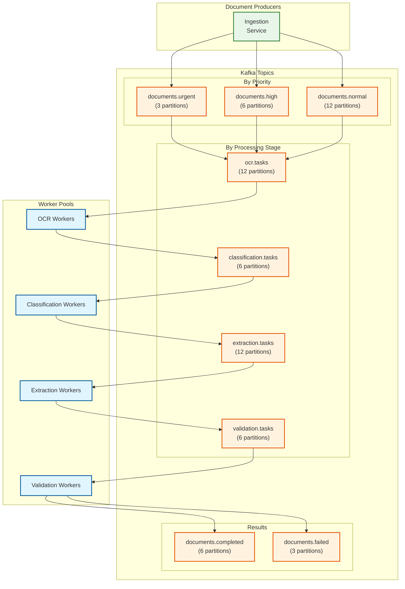
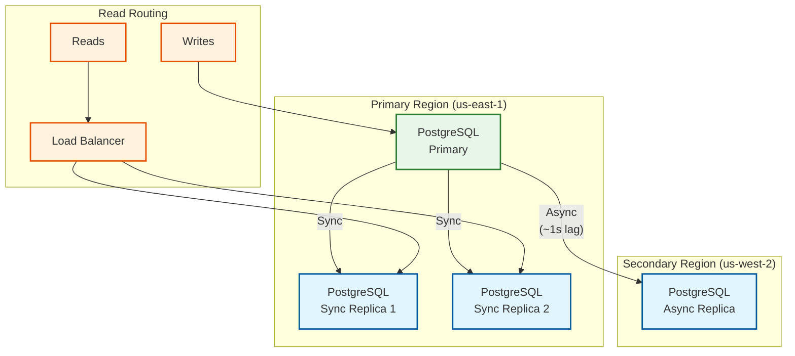
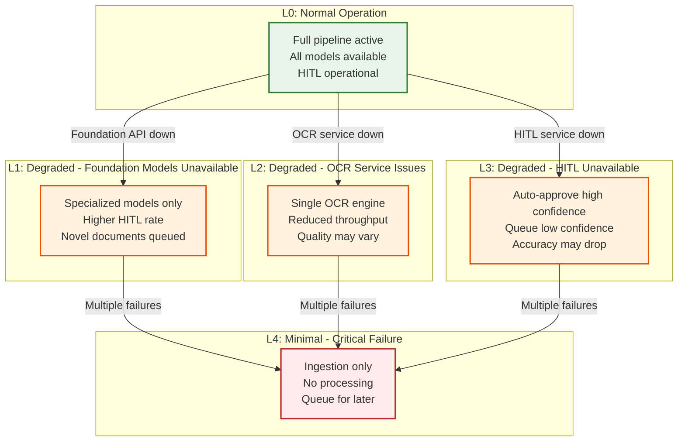
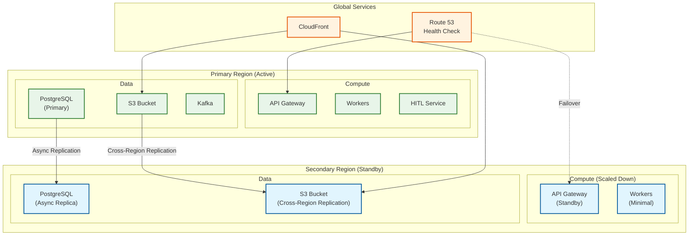
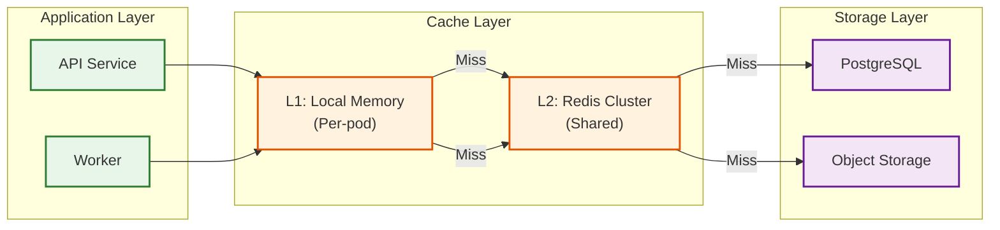

# Scalability & Reliability

## Horizontal Scaling Strategy

### Service Scaling Matrix

| Component | Stateless | Scaling Trigger | Min | Max | Strategy |
|-----------|-----------|-----------------|-----|-----|----------|
| **Ingestion API** | Yes | QPS > 500/pod | 3 | 20 | HPA on request rate |
| **Pre-processing Workers** | Yes | Queue depth > 100 | 5 | 50 | HPA on queue depth |
| **OCR Workers (GPU)** | Yes | GPU util > 70% | 4 | 24 | Manual/KEDA on queue |
| **Classification Workers (GPU)** | Yes | Queue depth > 50 | 2 | 12 | HPA on queue depth |
| **Extraction Workers (GPU)** | Yes | Queue depth > 50 | 4 | 24 | HPA on queue depth |
| **Validation Workers** | Yes | CPU > 70% | 3 | 15 | HPA on CPU |
| **HITL Backend** | Yes | Concurrent users | 2 | 10 | HPA on connections |
| **Integration Workers** | Yes | Queue depth > 100 | 2 | 10 | HPA on queue depth |

### Auto-Scaling Configuration

```yaml
# Horizontal Pod Autoscaler for Extraction Workers
apiVersion: autoscaling/v2
kind: HorizontalPodAutoscaler
metadata:
  name: extraction-worker-hpa
spec:
  scaleTargetRef:
    apiVersion: apps/v1
    kind: Deployment
    name: extraction-worker
  minReplicas: 4
  maxReplicas: 24
  metrics:
    # Primary: Queue depth
    - type: External
      external:
        metric:
          name: kafka_consumer_lag
          selector:
            matchLabels:
              topic: extraction-tasks
        target:
          type: AverageValue
          averageValue: "50"
    # Secondary: GPU utilization
    - type: Pods
      pods:
        metric:
          name: gpu_utilization
        target:
          type: AverageValue
          averageValue: "70"
  behavior:
    scaleUp:
      stabilizationWindowSeconds: 60
      policies:
        - type: Pods
          value: 4
          periodSeconds: 60
    scaleDown:
      stabilizationWindowSeconds: 300
      policies:
        - type: Percent
          value: 25
          periodSeconds: 120
```

### GPU Node Pool Auto-Scaling

```yaml
# KEDA ScaledObject for GPU workers
apiVersion: keda.sh/v1alpha1
kind: ScaledObject
metadata:
  name: ocr-worker-scaler
spec:
  scaleTargetRef:
    name: ocr-worker
  minReplicaCount: 4
  maxReplicaCount: 24
  triggers:
    - type: kafka
      metadata:
        bootstrapServers: kafka:9092
        consumerGroup: ocr-workers
        topic: ocr-tasks
        lagThreshold: "100"
    - type: prometheus
      metadata:
        serverAddress: http://prometheus:9090
        metricName: ocr_queue_depth
        threshold: "50"
        query: |
          sum(kafka_consumer_lag{topic="ocr-tasks"})
```

---

## Document Routing and Partitioning

### Partitioning Strategy

| Dimension | Strategy | Rationale |
|-----------|----------|-----------|
| **Tenant** | Separate Kafka partitions | Isolation, fair scheduling |
| **Document Type** | Specialized worker pools | Optimized model loading |
| **Priority** | Dedicated high-priority queues | SLA guarantees |
| **Region** | Geo-partitioning | Data residency compliance |

### Kafka Topic Architecture



### Partition Key Strategy

```
FUNCTION CalculatePartitionKey(document)
  // Ensure same tenant's documents go to same partition for ordering
  base_key = hash(document.tenant_id)

  // Add priority lane
  IF document.priority == "urgent" THEN
    partition = base_key % 3  // Only 3 urgent partitions
  ELSE IF document.priority == "high" THEN
    partition = base_key % 6  // 6 high partitions
  ELSE
    partition = base_key % 12  // 12 normal partitions
  END IF

  RETURN partition
```

---

## Replication Strategy

### Data Replication

| Component | Replication Factor | Cross-AZ | Cross-Region | Consistency |
|-----------|-------------------|----------|--------------|-------------|
| **Document Store (S3)** | 3 | Yes | Optional | Eventual |
| **Extracted Data (PostgreSQL)** | 3 | Yes | Async standby | Strong |
| **Audit Logs (ClickHouse)** | 3 | Yes | Yes | Eventual |
| **Kafka** | 3 | Yes | No (separate clusters) | Strong |
| **Redis Cache** | 2 | Yes | No | Eventual |
| **Model Registry** | 2 | Yes | Yes | Strong |

### Database Replication Architecture



---

## Fault Tolerance

### Circuit Breaker Configuration

| Service | Failure Threshold | Recovery Time | Fallback |
|---------|------------------|---------------|----------|
| **OCR (Textract)** | 50% in 30s | 60s | DocTR/Tesseract |
| **Foundation Model (GPT-4V)** | 30% in 30s | 120s | Specialized model only |
| **Database** | 30% in 10s | 30s | Cache reads, queue writes |
| **HITL Service** | 50% in 60s | 120s | Auto-approve high confidence |
| **Export Webhook** | 50% in 60s | 300s | Retry queue |

### Circuit Breaker Implementation

```yaml
# Resilience4j configuration
resilience4j:
  circuitbreaker:
    instances:
      textract:
        registerHealthIndicator: true
        slidingWindowSize: 10
        minimumNumberOfCalls: 5
        failureRateThreshold: 50
        waitDurationInOpenState: 60s
        permittedNumberOfCallsInHalfOpenState: 3
        automaticTransitionFromOpenToHalfOpenEnabled: true

      foundation-model:
        slidingWindowSize: 20
        failureRateThreshold: 30
        waitDurationInOpenState: 120s
        slowCallDurationThreshold: 10s
        slowCallRateThreshold: 50

  retry:
    instances:
      textract:
        maxAttempts: 3
        waitDuration: 2s
        exponentialBackoffMultiplier: 2
        retryExceptions:
          - java.io.IOException
          - java.util.concurrent.TimeoutException
```

### Graceful Degradation Levels



### Degradation Decision Matrix

| Trigger | Degradation Level | Actions |
|---------|------------------|---------|
| Foundation model 429s > 30% | L1 | Use specialized only, queue complex docs |
| Textract unavailable | L2 | Route all to DocTR/Tesseract |
| HITL service down | L3 | Auto-approve > 85% confidence, queue rest |
| Database write latency > 5s | L1 | Buffer writes, async persistence |
| GPU availability < 50% | L2 | Reduce batch size, increase queue tolerance |
| Multiple services down | L4 | Accept ingestion only, stop processing |

---

## Disaster Recovery

### Recovery Objectives

| Scenario | RTO | RPO | Strategy |
|----------|-----|-----|----------|
| **Single Node Failure** | 30s | 0 | Kubernetes auto-restart |
| **AZ Failure** | 5 min | 0 | Multi-AZ deployment |
| **Region Failure** | 15 min | 5 min | Active-passive failover |
| **Data Corruption** | 1 hour | 15 min | Point-in-time recovery |
| **Complete System Failure** | 4 hours | 1 hour | Backup restoration |

### Multi-Region Architecture



### Backup Strategy

| Data Type | Backup Frequency | Retention | Storage |
|-----------|-----------------|-----------|---------|
| **PostgreSQL** | Continuous WAL + Daily full | 30 days (full), 7 days (WAL) | Cross-region S3 |
| **Document Store** | Cross-region replication | 7 years | S3 Glacier |
| **Kafka Topics** | Topic mirroring | 7 days | Secondary cluster |
| **Model Artifacts** | On change | All versions | S3 + Git LFS |
| **Configuration** | On change | All versions | Git + Secrets Manager |

### Failover Procedure

```
PROCEDURE RegionFailover(failed_region, target_region)
1. // Detection (automated)
   health_check_failures >= 3 consecutive
   OR manual trigger by operator

2. // DNS failover
   update_route53_health_check(failed_region, unhealthy)
   // Automatic failover to secondary within 60s

3. // Promote database replica
   pg_promote(target_region.db_replica)
   update_connection_strings(target_region.db)

4. // Scale up secondary compute
   scale_deployment(target_region.api, replicas=original)
   scale_deployment(target_region.workers, replicas=original)

5. // Resume processing
   resume_kafka_consumers(target_region)
   process_queued_documents()

6. // Verify
   run_health_checks(target_region)
   verify_data_consistency()

7. // Notify
   alert_operations_team()
   update_status_page()
```

---

## Caching Strategy

### Cache Layers

| Layer | Content | TTL | Size | Purpose |
|-------|---------|-----|------|---------|
| **L1: Model Cache** | Loaded ML models | Session | 50 GB | Reduce cold start |
| **L2: OCR Cache** | Page hash → OCR result | 24h | 100 GB | Deduplicate OCR |
| **L3: Schema Cache** | Document type → schema | 1h | 1 GB | Reduce DB reads |
| **L4: Classification Cache** | Doc hash → type | 1h | 10 GB | Skip reclassification |
| **L5: Result Cache** | API response cache | 5 min | 5 GB | Reduce latency |

### Cache Architecture



### Cache Invalidation Strategy

| Cache Type | Invalidation Trigger | Strategy |
|------------|---------------------|----------|
| **Model Cache** | Model version change | TTL + version tag |
| **OCR Cache** | Document re-processed | TTL expiry |
| **Schema Cache** | Schema updated | Pub/Sub notification |
| **Classification Cache** | Model retrained | Version-based key |
| **Result Cache** | Document updated | Write-through invalidation |

### OCR Deduplication

```
ALGORITHM CheckOCRCache(page_image)
INPUT:
  page_image: Image to OCR

OUTPUT:
  ocr_result: Cached or fresh OCR result

PROCEDURE:
1. // Generate content hash
   image_hash = sha256(normalize(page_image))

2. // Check cache
   cached = redis.get(f"ocr:{image_hash}")
   IF cached THEN
     metrics.increment("ocr_cache_hit")
     RETURN deserialize(cached)
   END IF

3. // Cache miss - perform OCR
   metrics.increment("ocr_cache_miss")
   ocr_result = perform_ocr(page_image)

4. // Store in cache
   redis.setex(
     f"ocr:{image_hash}",
     ttl = 24 * 60 * 60,  // 24 hours
     value = serialize(ocr_result)
   )

5. RETURN ocr_result

FUNCTION normalize(image):
  // Normalize for consistent hashing
  resized = resize(image, max_dimension=2000)
  grayscale = convert_to_grayscale(resized)
  RETURN grayscale
```
