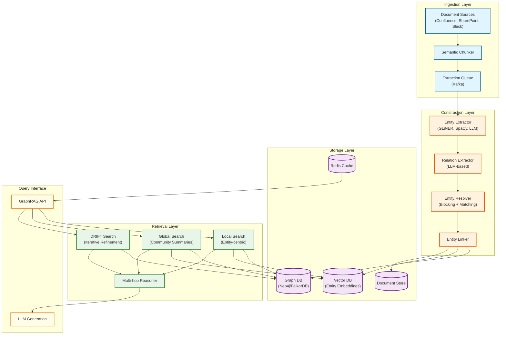
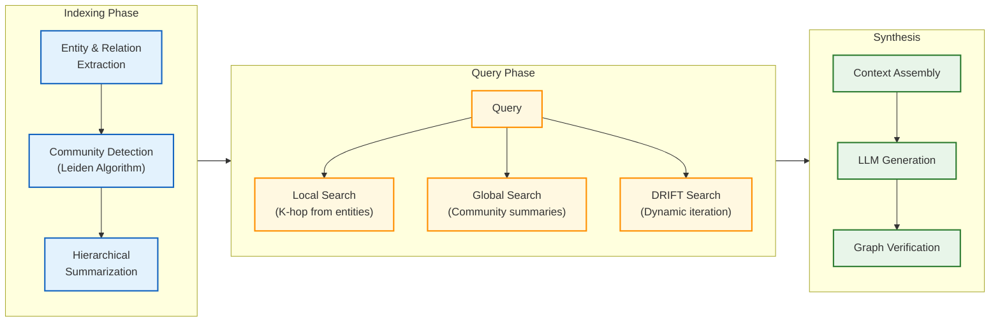
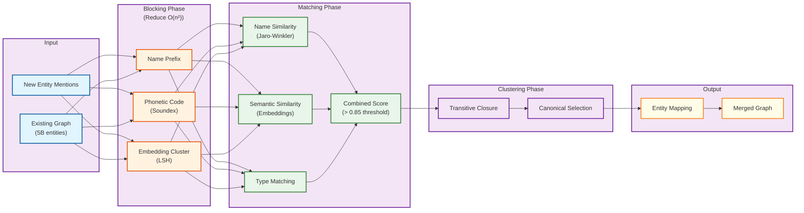

# AI-Native Enterprise Knowledge Graph

## System Overview

An **AI-Native Enterprise Knowledge Graph** is a platform that combines LLM-based knowledge extraction, entity resolution, graph storage, and GraphRAG retrieval to create a structured, queryable representation of enterprise knowledge. Unlike traditional knowledge bases that rely on manual curation, AI-native systems automatically extract entities and relationships from unstructured documents, resolve duplicates across sources, and enable sophisticated reasoning over the resulting graph structure.

The platform ingests documents from across the enterprise (wikis, emails, tickets, code repositories), extracts entities (people, projects, concepts, events) and their relationships, resolves duplicate mentions into canonical entities, and stores everything in a property graph database. At query time, **GraphRAG** (Graph Retrieval-Augmented Generation) combines vector similarity search with graph traversal to retrieve contextually rich information, enabling LLMs to answer complex questions that require multi-hop reasoning across connected facts.

Key innovations include **community detection** (Leiden algorithm) for hierarchical summarization, **bi-temporal modeling** for tracking knowledge evolution, and **entity resolution at scale** using blocking and semantic matching. Platforms like Neo4j (with Infinigraph supporting 100TB+), FalkorDB (sub-50ms GraphRAG queries), Glean (enterprise knowledge + personal graph layer), Microsoft GraphRAG (local/global/DRIFT search), and Graphiti/Zep (temporal knowledge graphs for agents) represent the state of the art.

**Complexity Rating:** `Very High`

This system is complex due to:
- Multi-stage knowledge extraction pipeline (NER, relation extraction, entity resolution)
- Hybrid storage model (vector DB + graph DB + document store)
- GraphRAG with community detection and hierarchical summarization
- Multi-hop reasoning with verification to prevent hallucination
- Temporal bi-temporal model support for knowledge evolution
- Entity resolution at scale (deduplication, linking across billions of entities)
- Personal knowledge layer on shared enterprise graph

---

## Quick Navigation

| Document | Description |
|----------|-------------|
| [01 - Requirements & Estimations](./01-requirements-and-estimations.md) | Functional/non-functional requirements, capacity planning, SLOs |
| [02 - High-Level Design](./02-high-level-design.md) | Architecture diagrams, data flow, technology choices |
| [03 - Low-Level Design](./03-low-level-design.md) | Data models, APIs, core algorithms in pseudocode |
| [04 - Deep Dive & Bottlenecks](./04-deep-dive-and-bottlenecks.md) | Entity resolution, GraphRAG retrieval, multi-hop reasoning |
| [05 - Scalability & Reliability](./05-scalability-and-reliability.md) | Sharding, fault tolerance, disaster recovery |
| [06 - Security & Compliance](./06-security-and-compliance.md) | Threat model, access control, GDPR compliance |
| [07 - Observability](./07-observability.md) | Metrics, tracing, alerting, dashboards |
| [08 - Interview Guide](./08-interview-guide.md) | Pacing, trap questions, quick reference |

---

## Key Characteristics

| Aspect | Description |
|--------|-------------|
| **Knowledge Extraction** | LLM-based NER + relation extraction + entity linking from unstructured documents |
| **Entity Resolution** | Deduplication, semantic linking, canonical forms at billion-entity scale |
| **Graph Storage** | Property graphs with Neo4j/FalkorDB supporting trillion-edge traversal |
| **GraphRAG Retrieval** | Hybrid local (entity-centric) + global (community summaries) + DRIFT search |
| **Multi-Hop Reasoning** | Chain-of-thought with graph-grounded verification at each step |
| **Temporal Support** | Bi-temporal model tracking event time and ingestion time |
| **Personal Knowledge** | User-specific graphs layered on shared enterprise graph (Glean-style) |
| **Semantic Layer** | Ontology-backed abstraction connecting people, processes, and data |

---

## High-Level Architecture

---

## GraphRAG Architecture

---

## Platform Comparison

| Platform | Architecture | Key Innovation | Best For | Latency |
|----------|--------------|----------------|----------|---------|
| **Neo4j + Infinigraph** | Native property graph | 100TB+ scale, trillion relationships | Enterprise scale | ~100ms |
| **FalkorDB** | Redis-based graph | Sub-50ms, GraphRAG-native, sparse matrices | Real-time AI apps | <50ms |
| **Microsoft GraphRAG** | Community detection + hierarchical | DRIFT search, local/global modes | Complex reasoning | Variable |
| **Glean** | Enterprise search + personal graph | Hybrid search, semantic understanding | Enterprise knowledge | N/A |
| **Graphiti/Zep** | Temporal knowledge graph | Bi-temporal, MCP protocol, 300ms P95 | Agent memory | 300ms |
| **TigerGraph** | Parallel graph analytics | 100B+ edges, GSQL | Massive-scale analytics | Sub-second |
| **Amazon Neptune** | Managed graph service | AWS-native, auto-scaling | Cloud-native | ~100ms |

---

## Knowledge Graph Construction Approaches

```mermaid
flowchart TB
    subgraph Traditional["Traditional Pipeline"]
        T1["Preprocessing"]
        T2["NER Model<br/>(Supervised)"]
        T3["Relation Extraction<br/>(Supervised)"]
        T4["Manual Review"]
        T1 --> T2 --> T3 --> T4
    end

    subgraph Modern["LLM-Native Pipeline"]
        M1["Semantic Chunking"]
        M2["Multi-Model Extraction<br/>(GLiNER + SpaCy + LLM)"]
        M3["Entity Resolution<br/>(Semantic Matching)"]
        M4["Incremental Updates"]
        M1 --> M2 --> M3 --> M4
    end

    subgraph Hybrid["Enterprise Hybrid"]
        H1["Document Ingestion"]
        H2["Specialized Models<br/>(Domain NER)"]
        H3["LLM Enhancement<br/>(Complex Relations)"]
        H4["Human-in-Loop<br/>(High-value)"]
        H1 --> H2 --> H3 --> H4
    end

    classDef trad fill:#ffebee,stroke:#c62828,stroke-width:2px
    classDef modern fill:#e8f5e9,stroke:#2e7d32,stroke-width:2px
    classDef hybrid fill:#e3f2fd,stroke:#1565c0,stroke-width:2px

    class T1,T2,T3,T4 trad
    class M1,M2,M3,M4 modern
    class H1,H2,H3,H4 hybrid
```

---

## Key Metrics Reference

| Category | Metric | Target | Notes |
|----------|--------|--------|-------|
| **Extraction** | Entity extraction F1 | > 85% | GLiNER + LLM ensemble |
| **Extraction** | Relation extraction F1 | > 75% | Complex relations harder |
| **Resolution** | Entity resolution precision | > 90% | Critical for graph quality |
| **Resolution** | Entity resolution recall | > 80% | Balance with precision |
| **Retrieval** | GraphRAG local latency P95 | < 500ms | Entity-centric queries |
| **Retrieval** | GraphRAG global latency P95 | < 2s | Community summarization |
| **Retrieval** | Multi-hop accuracy | > 80% | With verification |
| **Scale** | Entities supported | 10B+ | Neo4j Infinigraph |
| **Scale** | Relationships supported | 100B+ | TigerGraph / Neo4j |
| **Quality** | Community modularity | > 0.3 | Leiden algorithm |

---

## Entity Resolution Pipeline

---

## Multi-Hop Reasoning Comparison

| Approach | Description | Accuracy | Latency | Best For |
|----------|-------------|----------|---------|----------|
| **Direct RAG** | Single retrieval + LLM | 60-70% | 500ms | Simple questions |
| **Iterative RAG** | Multiple retrieval rounds | 70-75% | 1-2s | 2-hop questions |
| **GraphRAG Local** | K-hop graph traversal | 75-80% | 500ms | Entity-focused |
| **GraphRAG Global** | Community summaries | 70-75% | 1.5s | Theme questions |
| **GraphTrace** | Decompose + verify each step | 80-85% | 2-3s | Complex reasoning |
| **KD-CoT** | Knowledge-driven chain-of-thought | 82-88% | 2-4s | High-stakes |

---

## Interview Preparation Checklist

### Must Know
- [ ] Four-layer architecture (Ingestion, Construction, Storage, Retrieval)
- [ ] Entity resolution: blocking + matching + clustering
- [ ] GraphRAG: local vs global search trade-offs
- [ ] Leiden algorithm for community detection (why not Louvain)
- [ ] Multi-hop reasoning with verification
- [ ] Latency targets: entity lookup <50ms, GraphRAG <500ms

### Should Know
- [ ] KGGen multi-stage extraction approach
- [ ] DRIFT search (dynamic, iterative, filtered traversal)
- [ ] Bi-temporal model (event time vs ingestion time)
- [ ] Graph sharding strategies (hash, label, community-based)
- [ ] Semantic layer and ontology concepts
- [ ] Personal knowledge layer (Glean-style)

### Nice to Know
- [ ] FalkorDB sparse matrix implementation
- [ ] Neo4j Infinigraph architecture details
- [ ] Graphiti/Zep MCP protocol integration
- [ ] Knowledge graph embeddings (TransE, ComplEx)
- [ ] Contradiction detection algorithms
- [ ] Cross-document coreference resolution

---

## Related Systems

| System | Relationship |
|--------|--------------|
| [RAG System](../3.15-rag-system/00-index.md) | Knowledge graphs extend RAG with structured relationships |
| [Vector Database](../3.14-vector-database/00-index.md) | Entity embeddings stored for semantic search |
| [AI Memory Management](../3.28-ai-memory-management-system/00-index.md) | Temporal knowledge graphs power agent memory |
| [Hybrid Search Engine](../3.29-ai-native-hybrid-search-engine/00-index.md) | Combined vector + keyword + graph retrieval |
| [Multi-Agent Orchestration](../3.24-multi-agent-orchestration-platform/00-index.md) | Knowledge graphs provide shared context |

---

## References

### Industry Platforms
- [Neo4j Infinigraph Architecture](https://neo4j.com/blog/graph-database/infinigraph-scalable-architecture/)
- [FalkorDB for AI Applications](https://www.falkordb.com/blog/falkordb-vs-neo4j-for-ai-applications/)
- [Glean Knowledge Graph](https://www.glean.com/blog/knowledge-graph-agentic-engine)
- [Microsoft GraphRAG](https://microsoft.github.io/graphrag/)
- [Graphiti/Zep Temporal Knowledge Graph](https://github.com/getzep/graphiti)

### Research & Engineering Blogs
- [Microsoft: From Local to Global GraphRAG](https://www.microsoft.com/en-us/research/publication/from-local-to-global-a-graph-rag-approach-to-query-focused-summarization/)
- [Neo4j: Entity Resolved Knowledge Graphs](https://neo4j.com/blog/developer/entity-resolved-knowledge-graphs/)
- [Neo4j: Multi-Hop Reasoning with KGs and LLMs](https://neo4j.com/blog/genai/knowledge-graph-llm-multi-hop-reasoning/)
- [Databricks: Building GraphRAG Systems](https://www.databricks.com/blog/building-improving-and-deploying-knowledge-graph-rag-systems-databricks)
- [Semantic Entity Resolution for Knowledge Graphs](https://blog.graphlet.ai/the-rise-of-semantic-entity-resolution-45c48d5eb00a)

### Academic Papers
- Leiden Algorithm: Traag, Waltman, van Eck (2019) - Community detection in large networks
- KGGen: Multi-stage knowledge graph extraction from text
- Zep: A Temporal Knowledge Graph Architecture for Agent Memory (arXiv:2501.13956)
