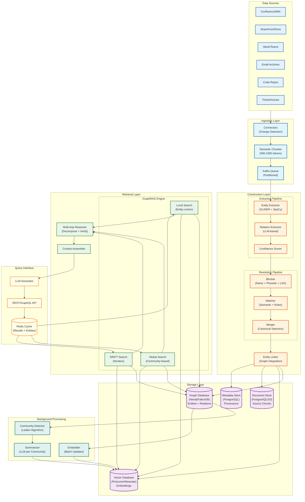
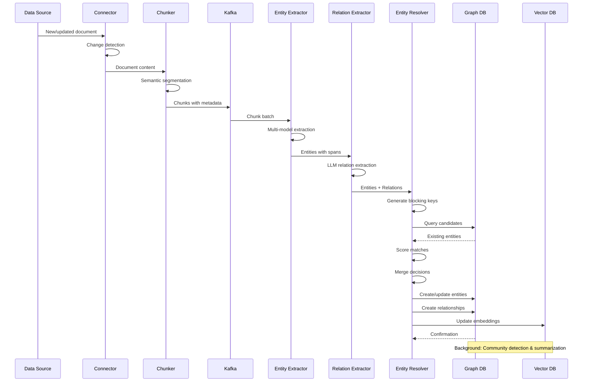
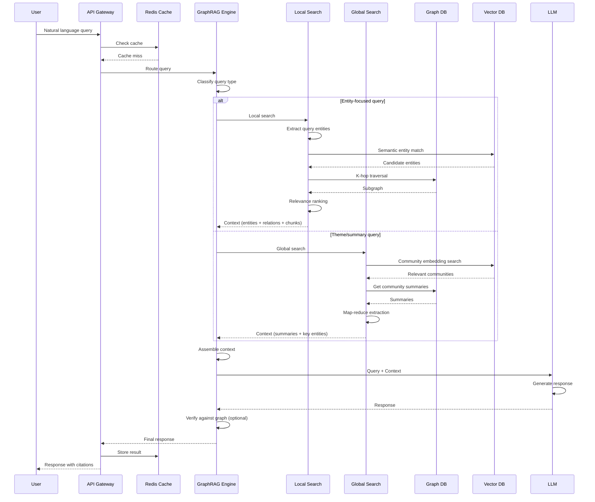
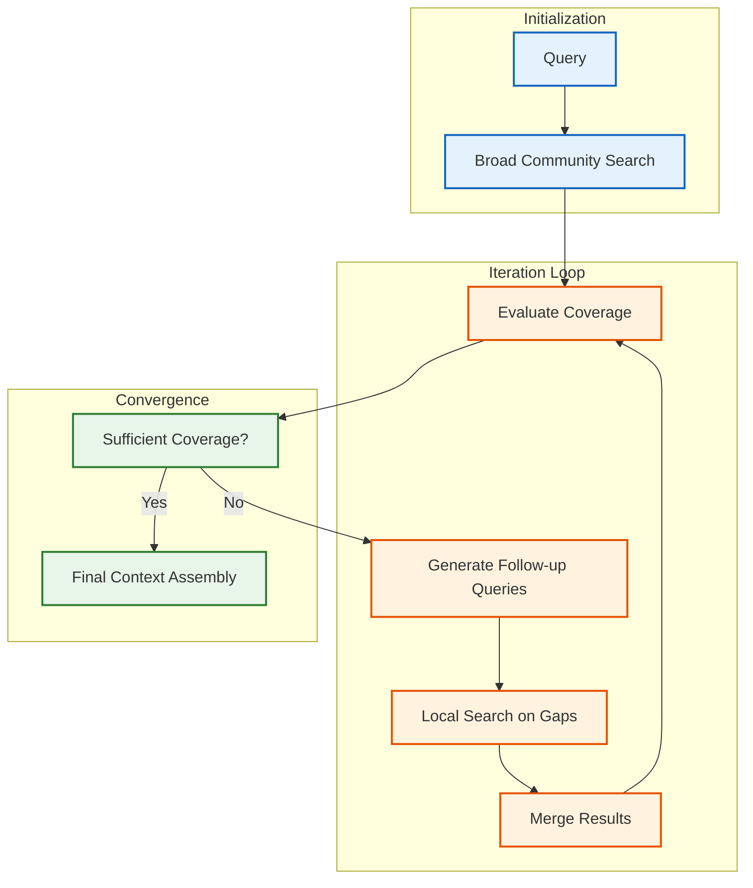
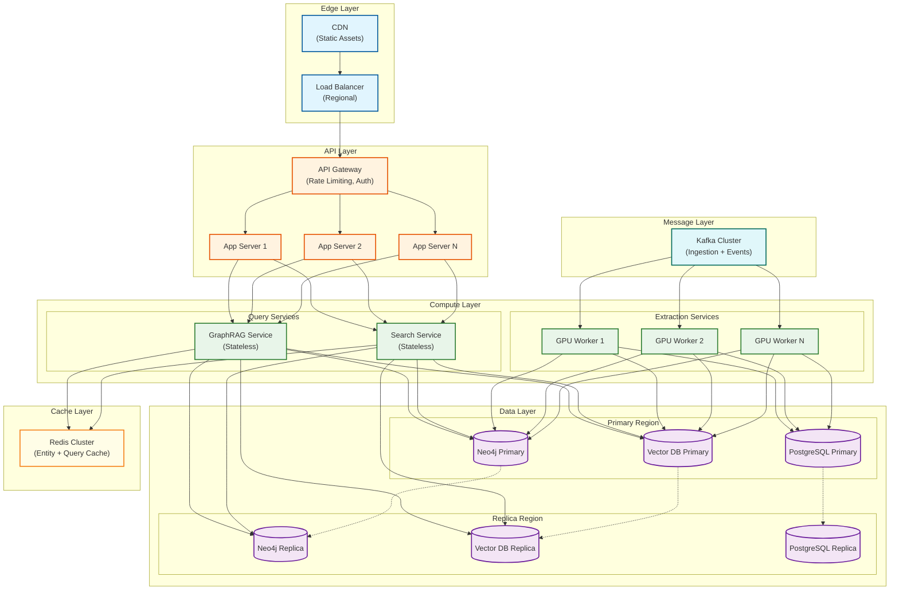

# High-Level Design

## System Architecture

---

## Component Descriptions

### Ingestion Layer

| Component | Purpose | Key Responsibilities |
|-----------|---------|---------------------|
| **Connectors** | Integrate with data sources | OAuth authentication, incremental sync, change detection, rate limiting |
| **Semantic Chunker** | Split documents into meaningful units | Respect section boundaries, 500-1000 token chunks, overlap handling |
| **Kafka Queue** | Decouple ingestion from processing | Partitioned by source, exactly-once delivery, backpressure handling |

### Construction Layer

| Component | Purpose | Key Responsibilities |
|-----------|---------|---------------------|
| **Entity Extractor** | Identify named entities | Multi-model ensemble (GLiNER for zero-shot, SpaCy for speed, LLM for complex), entity type classification |
| **Relation Extractor** | Find relationships | LLM-based extraction with structured output, relation type taxonomy, directional relationships |
| **Confidence Scorer** | Assess extraction quality | Ensemble voting, model agreement, context quality signals |
| **Blocker** | Reduce resolution candidates | Multiple blocking keys (name prefix, Soundex, LSH), union of candidate sets |
| **Matcher** | Score entity similarity | Name similarity (Jaro-Winkler), semantic similarity (embeddings), type matching, combined scoring |
| **Merger** | Create canonical entities | Transitive closure, canonical selection (oldest or highest confidence), property merging |
| **Entity Linker** | Integrate with graph | Create/update nodes and edges, maintain provenance links |

### Storage Layer

| Component | Purpose | Technology Options |
|-----------|---------|-------------------|
| **Graph Database** | Store entities and relationships | Neo4j (enterprise), FalkorDB (real-time), Neptune (AWS), TigerGraph (analytics) |
| **Vector Database** | Store embeddings for semantic search | Pinecone (managed), Weaviate (hybrid), pgvector (integrated) |
| **Document Store** | Store source chunks | PostgreSQL (structured), S3 (blob), Elasticsearch (search) |
| **Metadata Store** | Track provenance and lineage | PostgreSQL with audit tables |

### Background Processing

| Component | Purpose | Schedule |
|-----------|---------|----------|
| **Community Detector** | Cluster related entities | Daily full run, incremental for hot areas |
| **Summarizer** | Generate community descriptions | After community detection, on-demand for queries |
| **Embedder** | Update entity embeddings | Real-time for new entities, batch for property changes |

### Retrieval Layer

| Component | Purpose | Key Responsibilities |
|-----------|---------|---------------------|
| **Local Search** | Entity-centric retrieval | Start from query entities, K-hop traversal, relevance pruning |
| **Global Search** | Theme-based retrieval | Search community summaries, retrieve representative entities |
| **DRIFT Search** | Iterative refinement | Initial broad search, refine based on results, converge to answer |
| **Multi-hop Reasoner** | Complex question answering | Decompose into sub-questions, answer with graph evidence, verify each step |
| **Context Assembler** | Prepare LLM input | Rank and select context, fit within token budget, format for LLM |

---

## Data Flow: Knowledge Construction

---

## Data Flow: GraphRAG Query

---

## GraphRAG Search Modes

### Local Search (Entity-Centric)

```mermaid
flowchart LR
    subgraph Query["Query Processing"]
        Q["User Query"]
        ENT["Extract Entities"]
    end

    subgraph Match["Entity Matching"]
        VEC["Vector Search"]
        FUZZY["Fuzzy Name Match"]
        CAND["Candidate Entities"]
    end

    subgraph Traverse["Graph Traversal"]
        HOP1["1-Hop: Direct Relations"]
        HOP2["2-Hop: Connected Entities"]
        HOPK["K-Hop: Extended Context"]
    end

    subgraph Context["Context Assembly"]
        RANK["Relevance Ranking"]
        PRUNE["Token Budget Pruning"]
        CTX["Final Context"]
    end

    Q --> ENT --> VEC & FUZZY --> CAND
    CAND --> HOP1 --> HOP2 --> HOPK
    HOPK --> RANK --> PRUNE --> CTX

    classDef query fill:#e3f2fd,stroke:#1565c0,stroke-width:2px
    classDef match fill:#fff3e0,stroke:#e65100,stroke-width:2px
    classDef traverse fill:#e8f5e9,stroke:#2e7d32,stroke-width:2px
    classDef context fill:#f3e5f5,stroke:#6a1b9a,stroke-width:2px

    class Q,ENT query
    class VEC,FUZZY,CAND match
    class HOP1,HOP2,HOPK traverse
    class RANK,PRUNE,CTX context
```

### Global Search (Community-Based)

```mermaid
flowchart LR
    subgraph Query["Query Processing"]
        Q["User Query"]
        EMB["Query Embedding"]
    end

    subgraph Community["Community Search"]
        CSEARCH["Search Community Summaries"]
        TOPK["Top-K Communities"]
        HIER["Select Hierarchy Level"]
    end

    subgraph MapReduce["Map-Reduce"]
        MAP["Map: Extract Relevant Points"]
        RED["Reduce: Combine Points"]
    end

    subgraph Synthesis["Synthesis"]
        SYN["Synthesize Answer"]
        REF["Add References"]
    end

    Q --> EMB --> CSEARCH --> TOPK --> HIER
    HIER --> MAP --> RED --> SYN --> REF

    classDef query fill:#e3f2fd,stroke:#1565c0,stroke-width:2px
    classDef comm fill:#fff3e0,stroke:#e65100,stroke-width:2px
    classDef mr fill:#e8f5e9,stroke:#2e7d32,stroke-width:2px
    classDef synth fill:#f3e5f5,stroke:#6a1b9a,stroke-width:2px

    class Q,EMB query
    class CSEARCH,TOPK,HIER comm
    class MAP,RED mr
    class SYN,REF synth
```

### DRIFT Search (Dynamic Iterative)

---

## Technology Choices

### Graph Database Selection

| Technology | Pros | Cons | Best For |
|------------|------|------|----------|
| **Neo4j** | Mature ecosystem, Cypher query language, enterprise features, 100TB+ with Infinigraph | Cost at scale, single-writer architecture | Enterprise deployments with complex queries |
| **FalkorDB** | Sub-50ms latency, Redis-compatible, sparse matrix optimization | Newer, smaller community | Real-time AI applications, GraphRAG |
| **Amazon Neptune** | Fully managed, AWS integration, auto-scaling | AWS lock-in, less flexible | Cloud-native AWS environments |
| **TigerGraph** | 100B+ edges, parallel processing, GSQL | Steep learning curve, cost | Massive-scale analytics |
| **ArangoDB** | Multi-model (document + graph), flexible | Graph performance trade-offs | Teams needing document + graph |

**Recommendation:** Neo4j for enterprise scale with mature tooling, FalkorDB for real-time performance-critical applications.

### Vector Database Selection

| Technology | Pros | Cons | Best For |
|------------|------|------|----------|
| **Pinecone** | Fully managed, excellent performance | Cost, vendor lock-in | Teams prioritizing simplicity |
| **Weaviate** | Hybrid search, open-source option | Operational complexity | Teams needing flexibility |
| **pgvector** | Integrated with PostgreSQL | Scale limits | Smaller deployments |
| **Qdrant** | High performance, open-source | Newer | Performance-focused teams |

**Recommendation:** Weaviate for hybrid vector + keyword search, Pinecone for managed simplicity.

### Entity Extraction Model Selection

| Model | Pros | Cons | Use Case |
|-------|------|------|----------|
| **GLiNER** | Zero-shot NER, no training needed | Less accurate than fine-tuned | Diverse entity types |
| **SpaCy** | Fast, reliable, well-tested | Requires training for custom types | Standard NER at scale |
| **LLM (GPT-4o-mini)** | Handles complex cases, flexible | Cost, latency | Complex relations, edge cases |
| **Fine-tuned BERT** | High accuracy for known types | Training data required | Domain-specific NER |

**Recommendation:** Ensemble approach - SpaCy for speed on common types, GLiNER for zero-shot, LLM for complex cases.

---

## Key Architectural Decisions

### Decision 1: Graph Model

| Option | Description | Trade-offs |
|--------|-------------|------------|
| **RDF/Triples** | Subject-predicate-object model, semantic web standards | Rigid schema, complex queries |
| **Property Graph** | Nodes and edges with arbitrary properties | More flexible, better tooling |

**Decision:** Property Graph (Neo4j/FalkorDB)
- Richer attribute support for confidence scores, timestamps
- Better performance for traversal queries
- Stronger ecosystem and tooling

### Decision 2: Entity Resolution Timing

| Option | Description | Trade-offs |
|--------|-------------|------------|
| **Online** | Resolve during ingestion | Low latency, potential inconsistency |
| **Batch** | Periodic resolution runs | More accurate, ingestion lag |
| **Hybrid** | Online for hot path, batch for cleanup | Complexity, best of both |

**Decision:** Hybrid
- Online resolution for new ingestion (fast, good-enough matching)
- Nightly batch for transitive closure and cleanup
- Weekly full resolution for quality maintenance

### Decision 3: Community Detection Algorithm

| Option | Description | Trade-offs |
|--------|-------------|------------|
| **Louvain** | Fast, widely used | Can create poorly-connected communities |
| **Leiden** | Improved quality, guarantees connectivity | Slightly slower |
| **Label Propagation** | Very fast | Lower quality |

**Decision:** Leiden
- Guarantees well-connected communities
- Better for summarization (no disconnected subgroups)
- Marginal performance difference at our scale

### Decision 4: GraphRAG Mode Default

| Option | Description | Trade-offs |
|--------|-------------|------------|
| **Local First** | Start with entity-centric search | Fast, may miss broad context |
| **Global First** | Start with community summaries | Comprehensive, slower |
| **Hybrid/Adaptive** | Classify query, choose mode | Complexity, best results |

**Decision:** Hybrid/Adaptive
- Classify query intent (specific vs broad)
- Route to appropriate search mode
- Fall back to DRIFT for complex queries

---

## Deployment Architecture

---

## Architecture Pattern Checklist

| Pattern | Decision | Rationale |
|---------|----------|-----------|
| Sync vs Async communication | **Async** for ingestion, **Sync** for queries | Decouple extraction from storage, low-latency queries |
| Event-driven vs Request-response | **Event-driven** for construction, **Request-response** for retrieval | Scale extraction independently, real-time query response |
| Push vs Pull model | **Pull** for extraction workers, **Push** for cache invalidation | Workers control pace, immediate cache updates |
| Stateless vs Stateful services | **Stateless** for all services except databases | Horizontal scaling, easy recovery |
| Read-heavy vs Write-heavy | **Read-heavy** (100:1 ratio) | Optimize for query latency, eventual consistency for writes acceptable |
| Real-time vs Batch processing | **Hybrid** - real-time ingestion, batch community detection | Balance freshness with cost |
| Edge vs Origin processing | **Origin** - graphs too large for edge | Centralized graph storage, edge caching for common queries |

---

## Integration Points

### Source System Integrations

| System | Integration Method | Sync Frequency |
|--------|-------------------|----------------|
| Confluence | REST API + Webhooks | Real-time + daily full sync |
| SharePoint | Microsoft Graph API | Real-time + daily full sync |
| Slack | Events API | Real-time |
| GitHub | Webhooks + REST API | Real-time |
| Jira | Webhooks + REST API | Real-time |
| Email (Exchange) | Microsoft Graph API | Hourly batch |

### External Service Integrations

| Service | Purpose | Fallback |
|---------|---------|----------|
| OpenAI API | Entity extraction, summarization, generation | Self-hosted Llama 3 |
| Embedding API | Entity/chunk embeddings | Self-hosted sentence-transformers |
| Identity Provider | User authentication | Local user store |
| Monitoring | Metrics, logs, traces | Self-hosted Prometheus/Jaeger |
