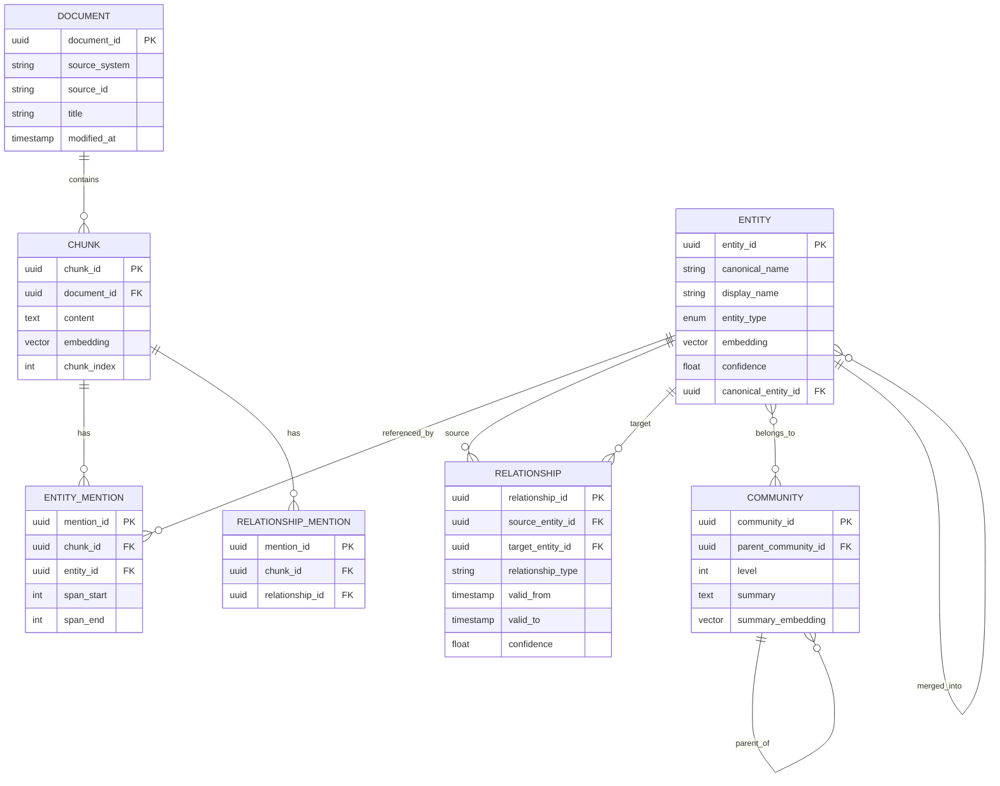

# Low-Level Design

## Data Models

### Entity Schema

```yaml
Entity:
  # Primary identification
  entity_id: uuid                    # Globally unique identifier
  canonical_name: string             # Normalized form (lowercase, no titles)
  display_name: string               # Human-readable preferred name
  aliases: string[]                  # Alternative names/spellings

  # Classification
  entity_type: enum                  # PERSON, ORGANIZATION, LOCATION, CONCEPT, EVENT, PRODUCT, TECHNOLOGY
  subtype: string                    # Domain-specific subtype (e.g., "DEPARTMENT", "TEAM" for ORG)

  # Properties (type-specific)
  properties: jsonb
    # PERSON: title, department, email, manager_id
    # ORGANIZATION: industry, size, parent_org_id
    # LOCATION: address, coordinates, type
    # CONCEPT: definition, domain
    # EVENT: date, location, participants
    # PRODUCT: version, status, owner
    # TECHNOLOGY: category, vendor, version

  # Embeddings
  embedding: vector[1536]            # text-embedding-3-small
  description_embedding: vector[1536] # Embedding of full description

  # Quality signals
  confidence: float                  # Extraction confidence (0.0-1.0)
  evidence_count: int                # Number of supporting mentions
  last_mentioned: timestamp          # Most recent reference

  # Provenance
  source_documents: uuid[]           # Document IDs where mentioned
  source_chunks: uuid[]              # Chunk IDs with mentions
  created_from_chunk: uuid           # Original extraction source

  # Resolution tracking
  merged_from: uuid[]                # Entity IDs merged into this one
  canonical_entity_id: uuid          # Points to self if canonical, else to canonical
  resolution_confidence: float       # Confidence in resolution decision

  # Metadata
  created_at: timestamp
  updated_at: timestamp
  created_by: string                 # System or user ID
  version: int                       # Optimistic locking
```

### Relationship Schema

```yaml
Relationship:
  # Primary identification
  relationship_id: uuid
  source_entity_id: uuid             # FK to Entity
  target_entity_id: uuid             # FK to Entity

  # Classification
  relationship_type: string          # Normalized type from taxonomy
  relationship_subtype: string       # More specific classification
  direction: enum                    # DIRECTED, BIDIRECTIONAL

  # Properties
  properties: jsonb
    # WORKS_AT: role, department, start_date, end_date
    # REPORTS_TO: direct_report (bool)
    # LOCATED_IN: type (headquarters, branch)
    # RELATED_TO: description
    # OWNS: percentage, acquisition_date
    # USES: purpose, frequency

  # Temporal validity (bi-temporal model)
  valid_from: timestamp              # When relationship became true in world
  valid_to: timestamp                # When relationship ended (null = current)
  event_time: timestamp              # When the event occurred
  ingestion_time: timestamp          # When we learned about it

  # Quality signals
  confidence: float                  # Extraction confidence
  evidence_count: int                # Supporting mentions
  strength: float                    # Computed from evidence + recency

  # Provenance
  source_chunks: uuid[]              # Chunks supporting this relationship
  extraction_method: string          # "llm", "rule", "manual"

  # Metadata
  created_at: timestamp
  updated_at: timestamp
  version: int
```

### Community Schema

```yaml
Community:
  # Identification
  community_id: uuid
  name: string                       # Auto-generated descriptive name

  # Hierarchy
  level: int                         # 0 = leaf, higher = more abstract
  parent_community_id: uuid          # Parent in hierarchy (null for root)
  child_community_ids: uuid[]        # Children communities

  # Membership
  entity_ids: uuid[]                 # Member entities at this level
  entity_count: int                  # Denormalized count

  # Summaries
  summary: text                      # LLM-generated summary (1-2 paragraphs)
  summary_embedding: vector[1536]    # For semantic search
  key_topics: string[]               # Main themes in this community

  # Representative entities
  central_entities: uuid[]           # Most connected entities
  representative_entities: uuid[]    # Best examples of community

  # Quality metrics
  modularity_contribution: float     # This community's modularity
  internal_density: float            # Edge density within community
  external_connectivity: float       # Edges to other communities

  # Metadata
  created_at: timestamp
  updated_at: timestamp
  last_summarized_at: timestamp
  summary_stale: boolean             # Needs re-summarization
```

### Document and Chunk Schemas

```yaml
Document:
  document_id: uuid
  source_system: string              # confluence, sharepoint, slack
  source_id: string                  # Original system's ID

  # Content
  title: string
  content_hash: string               # For change detection
  mime_type: string

  # Metadata
  author: string
  created_at: timestamp
  modified_at: timestamp
  url: string

  # Processing status
  last_processed_at: timestamp
  processing_status: enum            # PENDING, PROCESSING, COMPLETED, FAILED
  chunk_count: int
  entity_count: int

Chunk:
  chunk_id: uuid
  document_id: uuid                  # FK to Document

  # Content
  content: text                      # Chunk text (500-1000 tokens)
  content_embedding: vector[1536]

  # Position
  chunk_index: int                   # Order in document
  start_offset: int                  # Character offset
  end_offset: int

  # Extracted data
  entity_mentions: jsonb[]           # [{entity_id, span_start, span_end, text}]
  relationship_mentions: jsonb[]     # [{relationship_id, source_span, target_span}]

  # Metadata
  created_at: timestamp
```

---

## Entity-Relationship Diagram



---

## Database Indexes

### Neo4j Graph Indexes

```cypher
// Entity indexes
CREATE INDEX entity_id_idx FOR (e:Entity) ON (e.entity_id);
CREATE INDEX entity_type_idx FOR (e:Entity) ON (e.entity_type);
CREATE INDEX entity_canonical_idx FOR (e:Entity) ON (e.canonical_name);
CREATE CONSTRAINT entity_id_unique FOR (e:Entity) REQUIRE e.entity_id IS UNIQUE;

// Full-text search on entity names
CREATE FULLTEXT INDEX entity_name_fulltext
FOR (e:Entity) ON EACH [e.display_name, e.canonical_name, e.aliases];

// Relationship indexes
CREATE INDEX rel_type_idx FOR ()-[r:RELATES]-() ON (r.relationship_type);
CREATE INDEX rel_temporal_idx FOR ()-[r:RELATES]-() ON (r.valid_from, r.valid_to);
CREATE INDEX rel_confidence_idx FOR ()-[r:RELATES]-() ON (r.confidence);

// Community indexes
CREATE INDEX community_level_idx FOR (c:Community) ON (c.level);
CREATE INDEX community_id_idx FOR (c:Community) ON (c.community_id);

// Composite indexes for common query patterns
CREATE INDEX entity_type_confidence_idx FOR (e:Entity) ON (e.entity_type, e.confidence);
```

### Vector Database Indexes

```yaml
# Entity embeddings collection
entity_embeddings:
  index_type: HNSW
  metric: cosine
  dimensions: 1536
  ef_construction: 200
  M: 16
  metadata_fields:
    - entity_type (keyword, filterable)
    - confidence (float, filterable)
    - entity_id (keyword)
  shards: 50  # ~100M entities per shard

# Chunk embeddings collection
chunk_embeddings:
  index_type: HNSW
  metric: cosine
  dimensions: 1536
  ef_construction: 200
  M: 16
  metadata_fields:
    - document_id (keyword)
    - source_system (keyword)
  shards: 100

# Community summary embeddings
community_embeddings:
  index_type: HNSW
  metric: cosine
  dimensions: 1536
  ef_construction: 100
  M: 12
  metadata_fields:
    - level (int, filterable)
    - entity_count (int)
  shards: 1  # ~500K communities
```

### PostgreSQL Indexes

```sql
-- Document indexes
CREATE INDEX idx_document_source ON documents(source_system, source_id);
CREATE INDEX idx_document_modified ON documents(modified_at DESC);
CREATE INDEX idx_document_status ON documents(processing_status);

-- Chunk indexes
CREATE INDEX idx_chunk_document ON chunks(document_id);
CREATE INDEX idx_chunk_document_order ON chunks(document_id, chunk_index);

-- Entity mention indexes
CREATE INDEX idx_mention_chunk ON entity_mentions(chunk_id);
CREATE INDEX idx_mention_entity ON entity_mentions(entity_id);

-- Audit log indexes
CREATE INDEX idx_audit_entity ON audit_log(entity_id, created_at DESC);
CREATE INDEX idx_audit_time ON audit_log(created_at DESC);
```

---

## API Specifications

### Entity APIs

```yaml
# Create Entity
POST /v1/entities
Request:
  display_name: string (required)
  entity_type: enum (required)
  properties: object
  source_chunk_id: uuid
Response:
  entity_id: uuid
  canonical_entity_id: uuid  # May differ if resolved to existing
  created: boolean

# Get Entity
GET /v1/entities/{entity_id}
Response:
  entity: Entity
  relationships: Relationship[]  # First-hop connections
  mentions_count: int

# Search Entities
POST /v1/entities/search
Request:
  query: string
  entity_types: enum[]  # Filter by type
  min_confidence: float
  limit: int (default: 20, max: 100)
  include_aliases: boolean (default: true)
Response:
  entities: Entity[]
  total_count: int

# Resolve Entity Mention
POST /v1/entities/resolve
Request:
  mention_text: string
  context: string  # Surrounding text
  entity_type_hint: enum
Response:
  resolved_entity_id: uuid
  confidence: float
  alternatives: [{entity_id, confidence}]
```

### Graph APIs

```yaml
# K-Hop Traversal
POST /v1/graph/traverse
Request:
  entity_ids: uuid[]  # Starting entities
  max_hops: int (default: 2, max: 4)
  relationship_types: string[]  # Filter by type
  direction: enum (OUTGOING, INCOMING, BOTH)
  min_confidence: float
  max_entities: int (default: 100)
Response:
  entities: Entity[]
  relationships: Relationship[]
  paths: Path[]  # Optional, for path-aware queries

# Extract Subgraph
POST /v1/graph/subgraph
Request:
  entity_ids: uuid[]
  include_hops: int
  include_communities: boolean
Response:
  entities: Entity[]
  relationships: Relationship[]
  communities: Community[]

# Find Paths
POST /v1/graph/paths
Request:
  source_entity_id: uuid
  target_entity_id: uuid
  max_length: int (default: 4)
  relationship_types: string[]
Response:
  paths: Path[]
  shortest_path_length: int
```

### GraphRAG APIs

```yaml
# Natural Language Query
POST /v1/graphrag/query
Request:
  query: string
  mode: enum (AUTO, LOCAL, GLOBAL, DRIFT)
  max_context_tokens: int (default: 4000)
  include_citations: boolean (default: true)
  temperature: float (default: 0.1)
Response:
  answer: string
  citations: [{entity_id, chunk_id, text}]
  confidence: float
  mode_used: enum
  reasoning_trace: string[]  # Optional

# Local Search (Entity-Centric)
POST /v1/graphrag/local
Request:
  query: string
  seed_entity_ids: uuid[]  # Optional starting points
  max_hops: int (default: 2)
  max_context_tokens: int
Response:
  context: string
  entities: Entity[]
  relationships: Relationship[]
  chunks: Chunk[]

# Global Search (Community-Based)
POST /v1/graphrag/global
Request:
  query: string
  community_level: int  # Hierarchy level (0=detailed, higher=abstract)
  top_k_communities: int (default: 10)
Response:
  context: string
  communities: Community[]
  key_entities: Entity[]

# DRIFT Search (Iterative)
POST /v1/graphrag/drift
Request:
  query: string
  max_iterations: int (default: 3)
  convergence_threshold: float (default: 0.9)
Response:
  answer: string
  iterations: [{query, results, coverage}]
  final_coverage: float
```

### Error Codes

| Code | Description | Resolution |
|------|-------------|------------|
| 400 | Invalid request | Check request format |
| 401 | Unauthorized | Provide valid API key |
| 403 | Forbidden | Check entity access permissions |
| 404 | Entity not found | Verify entity_id exists |
| 409 | Conflict | Entity was modified, retry with current version |
| 429 | Rate limited | Back off and retry |
| 500 | Internal error | Retry, contact support if persistent |
| 503 | Service unavailable | Graph database overloaded, retry |

---

## Core Algorithms

### Entity Extraction Algorithm (Multi-Stage)

```
ALGORITHM ExtractEntities(document)
════════════════════════════════════

INPUT: document (text content)
OUTPUT: list of (entity_text, entity_type, span, confidence)

PROCEDURE:
  1. PREPROCESS:
     chunks = semantic_chunk(document, max_tokens=800, overlap=100)

  2. PARALLEL EXTRACTION (for each chunk):
     // Strategy A: Zero-shot NER (GLiNER)
     gliner_entities = GLiNER.extract(
       chunk,
       entity_types=["person", "organization", "location", "concept", "event"]
     )

     // Strategy B: Statistical NER (SpaCy)
     spacy_entities = SpaCy.extract(chunk, model="en_core_web_lg")

     // Strategy C: LLM-based extraction (for complex cases)
     IF chunk.has_complex_structure OR confidence < 0.7:
       llm_entities = LLM.extract(
         chunk,
         prompt=ENTITY_EXTRACTION_PROMPT,
         model="gpt-4o-mini"
       )

  3. ENSEMBLE VOTING:
     FOR each unique entity span:
       votes = count_agreeing_extractors(entity)
       IF votes >= 2:
         confidence = calculate_ensemble_confidence(extractors, entity)
         entity.confidence = confidence
       ELSE IF single_extractor AND extractor_confidence > 0.9:
         entity.confidence = extractor_confidence * 0.8  // Discount

  4. NORMALIZE:
     FOR each entity:
       entity.canonical_text = normalize_name(entity.text)
       entity.type = map_to_taxonomy(entity.raw_type)

  5. DEDUPLICATE within document:
     entities = merge_overlapping_spans(entities)
     entities = link_coreferent_mentions(entities)

  RETURN entities

COMPLEXITY: O(n * m) where n = chunks, m = avg entities per chunk
TIME: ~2s per document (parallel extraction)
```

### Relation Extraction Algorithm

```
ALGORITHM ExtractRelations(chunk, entities)
═══════════════════════════════════════════

INPUT: chunk (text), entities (list of extracted entities with spans)
OUTPUT: list of (source_entity, relation_type, target_entity, confidence)

PROCEDURE:
  1. IDENTIFY CANDIDATE PAIRS:
     pairs = []
     FOR each entity_pair (e1, e2) in entities:
       IF distance(e1.span, e2.span) < MAX_SPAN_DISTANCE:
         pairs.append((e1, e2))

     // Limit pairs to avoid combinatorial explosion
     IF len(pairs) > MAX_PAIRS:
       pairs = prioritize_by_proximity(pairs, MAX_PAIRS)

  2. EXTRACT RELATIONS (batch LLM call):
     context_windows = []
     FOR each (e1, e2) in pairs:
       window = extract_context_window(chunk, e1, e2, context_size=200)
       context_windows.append({
         "text": window,
         "entity1": e1.text,
         "entity2": e2.text
       })

     relations = LLM.batch_extract(
       context_windows,
       prompt=RELATION_EXTRACTION_PROMPT,
       output_schema={
         "relation_type": "string",
         "direction": "enum(e1_to_e2, e2_to_e1, bidirectional)",
         "confidence": "float",
         "evidence": "string"
       }
     )

  3. FILTER AND NORMALIZE:
     FOR each relation in relations:
       IF relation.confidence < MIN_RELATION_CONFIDENCE:
         CONTINUE
       relation.type = map_to_relation_taxonomy(relation.raw_type)
       IF relation.type == "UNKNOWN":
         relation.type = "RELATED_TO"  // Fallback

  4. VALIDATE:
     // Check for contradictions
     FOR each relation:
       IF contradicts_existing(relation, graph):
         flag_for_review(relation)

  RETURN relations

RELATION_TAXONOMY:
  - WORKS_AT, REPORTS_TO, MANAGES
  - LOCATED_IN, HEADQUARTERED_IN
  - OWNS, ACQUIRED, INVESTED_IN
  - RELATED_TO, COLLABORATED_WITH
  - CREATED, DEVELOPED, MAINTAINS
  - USES, DEPENDS_ON

COMPLEXITY: O(p * c) where p = pairs, c = context extraction cost
TIME: ~500ms per chunk (batched LLM)
```

### Entity Resolution Algorithm (Blocking + Matching)

```
ALGORITHM ResolveEntity(new_entity, existing_graph)
═══════════════════════════════════════════════════

INPUT: new_entity (extracted entity), existing_graph (5B entities)
OUTPUT: canonical_entity_id, resolution_confidence

PROCEDURE:
  1. GENERATE BLOCKING KEYS:
     keys = []

     // Strategy A: Name prefix (first 4 chars, lowercase)
     keys.append(("prefix", new_entity.canonical_name[:4]))

     // Strategy B: Phonetic (Soundex)
     keys.append(("soundex", soundex(new_entity.canonical_name)))

     // Strategy C: Metaphone (better for names)
     keys.append(("metaphone", double_metaphone(new_entity.canonical_name)))

     // Strategy D: Embedding LSH (locality-sensitive hashing)
     lsh_buckets = compute_lsh_buckets(new_entity.embedding, num_buckets=10)
     FOR bucket in lsh_buckets:
       keys.append(("lsh", bucket))

  2. RETRIEVE CANDIDATES:
     candidates = set()
     FOR (key_type, key_value) in keys:
       matches = graph.query(
         "MATCH (e:Entity) WHERE e.{key_type}_index = $key RETURN e LIMIT 100",
         {key: key_value}
       )
       candidates.update(matches)

     // Filter by type if confident
     IF new_entity.type_confidence > 0.9:
       candidates = filter_by_type(candidates, new_entity.entity_type)

     // Limit total candidates
     candidates = limit_candidates(candidates, max=500)

  3. SCORE CANDIDATES:
     scores = []
     FOR candidate in candidates:
       // Name similarity (40% weight)
       name_sim = jaro_winkler(new_entity.canonical_name, candidate.canonical_name)
       alias_sim = max(jaro_winkler(new_entity.canonical_name, alias)
                       for alias in candidate.aliases)
       name_score = max(name_sim, alias_sim)

       // Semantic similarity (40% weight)
       semantic_score = cosine_similarity(new_entity.embedding, candidate.embedding)

       // Type match (20% weight)
       type_score = 1.0 if new_entity.entity_type == candidate.entity_type else 0.3

       // Combined score
       combined = 0.4 * name_score + 0.4 * semantic_score + 0.2 * type_score
       scores.append((candidate, combined))

     scores.sort(by=combined, descending=True)

  4. MAKE RESOLUTION DECISION:
     IF len(scores) == 0 OR scores[0].combined < MATCH_THRESHOLD (0.85):
       // No match - create new entity
       RETURN (create_new_entity(new_entity), 1.0)

     best_match = scores[0]
     IF best_match.combined > HIGH_CONFIDENCE_THRESHOLD (0.95):
       // High-confidence match
       RETURN (best_match.candidate.entity_id, best_match.combined)

     IF best_match.combined > MATCH_THRESHOLD (0.85):
       // Moderate confidence - check for ambiguity
       IF scores[1].combined > 0.80:  // Multiple good matches
         flag_for_review(new_entity, scores[:3])
       RETURN (best_match.candidate.entity_id, best_match.combined)

  5. UPDATE GRAPH:
     merge_entity_properties(best_match.candidate, new_entity)
     add_alias(best_match.candidate, new_entity.display_name)
     increment_evidence_count(best_match.candidate)

  RETURN (canonical_entity_id, resolution_confidence)

CONSTANTS:
  MATCH_THRESHOLD = 0.85
  HIGH_CONFIDENCE_THRESHOLD = 0.95
  MAX_CANDIDATES_PER_KEY = 100
  MAX_TOTAL_CANDIDATES = 500

COMPLEXITY: O(k * c + c * m) where k = keys, c = candidates, m = matching cost
TIME: ~50ms average, ~200ms worst case
```

### Leiden Community Detection Algorithm

```
ALGORITHM DetectCommunities(graph)
══════════════════════════════════

INPUT: entity-relationship graph G = (V, E)
OUTPUT: hierarchical community assignments

PROCEDURE:
  1. INITIALIZE:
     FOR each vertex v in V:
       community[v] = v  // Each node in own community

     partition = list of communities
     quality = compute_modularity(partition, G)

  2. LOCAL MOVING PHASE:
     improved = True
     WHILE improved:
       improved = False
       FOR each vertex v in random_order(V):
         current_community = community[v]
         best_community = current_community
         best_delta = 0

         // Try moving to each neighbor's community
         FOR each neighbor_community in neighbor_communities(v):
           delta = compute_modularity_delta(v, neighbor_community, G)
           IF delta > best_delta:
             best_delta = delta
             best_community = neighbor_community

         IF best_community != current_community:
           move_vertex(v, best_community)
           improved = True

  3. REFINEMENT PHASE (Leiden-specific):
     // Ensure communities are well-connected
     FOR each community c in partition:
       subgraph = induced_subgraph(G, c)
       IF NOT is_well_connected(subgraph):
         // Split poorly connected community
         sub_communities = local_moving_phase(subgraph)
         replace_community(partition, c, sub_communities)

  4. AGGREGATION PHASE:
     IF partition changed:
       // Create super-graph
       G_agg = aggregate_graph(G, partition)

       // Recurse on aggregated graph
       higher_partition = DetectCommunities(G_agg)

       // Map back to original vertices
       partition = expand_partition(higher_partition, partition)

  5. BUILD HIERARCHY:
     levels = []
     current_graph = G
     current_partition = initial_partition

     WHILE len(current_partition) > 1:
       levels.append(current_partition)
       current_graph = aggregate_graph(current_graph, current_partition)
       current_partition = DetectCommunities_single_level(current_graph)

     RETURN levels

HELPER - compute_modularity_delta(v, target_community, G):
  // Change in modularity from moving v to target_community
  k_v = degree(v)
  k_c = sum of degrees in target_community
  e_vc = edges from v to target_community
  m = total edges in G

  RETURN (e_vc / m) - (k_v * k_c) / (2 * m^2)

COMPLEXITY: O(n * log(n)) for sparse graphs
TIME: ~30 minutes for 5B entities (distributed implementation)
```

### GraphRAG Local Search Algorithm

```
ALGORITHM LocalSearch(query, max_hops=2)
════════════════════════════════════════

INPUT: natural language query, max traversal hops
OUTPUT: context string for LLM, supporting entities/relationships

PROCEDURE:
  1. EXTRACT QUERY ENTITIES:
     query_entities = extract_entities(query)  // NER on query

     // Also try embedding-based entity detection
     query_embedding = embed(query)
     semantic_entities = vector_search(
       query_embedding,
       collection="entity_embeddings",
       top_k=10,
       min_similarity=0.7
     )

     seed_entities = merge_and_rank(query_entities, semantic_entities)

  2. MATCH TO GRAPH ENTITIES:
     matched_entities = []
     FOR each seed in seed_entities:
       // Fuzzy name match
       name_matches = graph.fulltext_search(seed.text, limit=5)

       // Semantic match
       semantic_matches = vector_search(
         seed.embedding,
         filter={"entity_type": seed.type},
         top_k=5
       )

       best_match = select_best_match(name_matches, semantic_matches, seed)
       IF best_match.confidence > 0.7:
         matched_entities.append(best_match)

  3. K-HOP TRAVERSAL:
     visited = set(matched_entities)
     frontier = matched_entities
     all_relationships = []

     FOR hop in range(max_hops):
       next_frontier = []
       FOR entity in frontier:
         neighbors = graph.query("""
           MATCH (e:Entity {entity_id: $id})-[r]-(n:Entity)
           WHERE r.confidence > 0.5
           RETURN r, n
           ORDER BY r.strength DESC
           LIMIT 20
         """, {id: entity.entity_id})

         FOR (relationship, neighbor) in neighbors:
           IF neighbor NOT IN visited:
             visited.add(neighbor)
             next_frontier.append(neighbor)
           all_relationships.append(relationship)

       frontier = next_frontier

       // Early termination if enough context
       IF len(visited) > MAX_CONTEXT_ENTITIES:
         BREAK

  4. RELEVANCE RANKING:
     // Score entities by relevance to query
     FOR entity in visited:
       entity.relevance = compute_relevance(entity, query_embedding, hop_distance)

     // Score relationships
     FOR rel in all_relationships:
       rel.relevance = (rel.source.relevance + rel.target.relevance) / 2 * rel.confidence

     // Sort by relevance
     ranked_entities = sort_by_relevance(visited)
     ranked_relationships = sort_by_relevance(all_relationships)

  5. CONTEXT ASSEMBLY:
     context_parts = []
     token_budget = MAX_CONTEXT_TOKENS

     // Add entity descriptions
     FOR entity in ranked_entities:
       description = format_entity_description(entity)
       IF len(context_parts) + len(description) < token_budget:
         context_parts.append(description)

     // Add relationship descriptions
     FOR rel in ranked_relationships:
       description = format_relationship(rel)
       IF len(context_parts) + len(description) < token_budget:
         context_parts.append(description)

     // Add supporting chunks
     source_chunks = get_source_chunks(ranked_entities, ranked_relationships)
     FOR chunk in source_chunks:
       IF len(context_parts) + len(chunk.content) < token_budget:
         context_parts.append(chunk.content)

  RETURN {
    context: join(context_parts),
    entities: ranked_entities,
    relationships: ranked_relationships
  }

COMPLEXITY: O(E * d^k) where E = seed entities, d = avg degree, k = hops
TIME: ~200-500ms typical
```

### Multi-Hop Reasoning Algorithm (GraphTrace-style)

```
ALGORITHM MultiHopReason(query, max_hops=4)
═══════════════════════════════════════════

INPUT: complex query requiring multi-hop reasoning
OUTPUT: answer with reasoning trace and confidence

PROCEDURE:
  1. QUERY DECOMPOSITION:
     sub_questions = LLM.decompose(
       query,
       prompt="""
       Break this question into sub-questions that can be answered step-by-step.
       Each sub-question should be answerable with a single fact lookup.
       Return as JSON array of {question, depends_on: [indices]}.
       """
     )

     // Build dependency DAG
     dag = build_dependency_graph(sub_questions)

  2. ITERATIVE ANSWERING:
     answers = {}
     reasoning_trace = []

     FOR level in topological_order(dag):
       FOR sub_q in level:
         // Get context from previous answers
         prior_context = gather_prior_answers(sub_q.depends_on, answers)

         // Retrieve relevant subgraph
         subgraph = LocalSearch(sub_q.question, max_hops=2)

         // Generate intermediate answer
         intermediate_answer = LLM.answer(
           sub_q.question,
           context=prior_context + subgraph.context,
           prompt="Answer this specific question based only on the provided context."
         )

         // VERIFICATION STEP (key innovation)
         verified, confidence = verify_against_graph(
           intermediate_answer,
           subgraph.entities,
           subgraph.relationships
         )

         IF NOT verified AND confidence < 0.7:
           // Backtrack - try alternative path
           alternative_subgraph = LocalSearch(
             sub_q.question,
             max_hops=3,  // Deeper search
             exclude=subgraph.entities
           )
           intermediate_answer = LLM.answer(
             sub_q.question,
             context=prior_context + alternative_subgraph.context
           )
           verified, confidence = verify_against_graph(...)

         answers[sub_q.index] = {
           answer: intermediate_answer,
           confidence: confidence,
           supporting_entities: subgraph.entities
         }

         reasoning_trace.append({
           question: sub_q.question,
           answer: intermediate_answer,
           evidence: subgraph.entities[:3],
           confidence: confidence
         })

  3. SYNTHESIS:
     final_answer = LLM.synthesize(
       query,
       intermediate_answers=answers,
       prompt="""
       Synthesize the final answer from these intermediate findings.
       Be concise and cite the evidence.
       """
     )

     // Aggregate confidence
     overall_confidence = geometric_mean(
       [a.confidence for a in answers.values()]
     )

  RETURN {
    answer: final_answer,
    confidence: overall_confidence,
    reasoning_trace: reasoning_trace,
    supporting_entities: flatten([a.supporting_entities for a in answers.values()])
  }

HELPER - verify_against_graph(answer, entities, relationships):
  // Extract factual claims from answer
  claims = LLM.extract_claims(answer)

  verified_count = 0
  FOR claim in claims:
    // Check if claim is supported by graph
    IF claim.type == "entity_attribute":
      entity = find_entity(claim.entity_name, entities)
      IF entity AND entity.properties[claim.attribute] == claim.value:
        verified_count += 1

    ELIF claim.type == "relationship":
      rel = find_relationship(claim.source, claim.target, relationships)
      IF rel AND rel.type == claim.relation_type:
        verified_count += 1

  confidence = verified_count / len(claims) IF claims ELSE 0.5
  verified = confidence > 0.6

  RETURN (verified, confidence)

COMPLEXITY: O(q * L * T) where q = sub-questions, L = local search, T = LLM latency
TIME: 2-4 seconds typical
```

---

## Cache Strategy

### Cache Layers

| Layer | Content | TTL | Hit Rate Target |
|-------|---------|-----|-----------------|
| L1 (Redis) | Entity by ID | 1 hour | 80% |
| L1 (Redis) | Entity search results | 15 min | 50% |
| L1 (Redis) | Subgraph by entity set | 5 min | 30% |
| L2 (Redis) | Community summaries | 24 hours | 90% |
| L2 (Redis) | GraphRAG query results | 5 min | 30% |
| CDN | Static entity pages | 1 hour | N/A |

### Cache Invalidation Strategy

```yaml
Triggers:
  entity_update:
    - Invalidate: entity:{entity_id}
    - Invalidate: search:* (containing entity)
    - Invalidate: subgraph:* (containing entity)
    - Invalidate: community:{community_id}
    - Set stale flag: community summary

  relationship_update:
    - Invalidate: entity:{source_id}, entity:{target_id}
    - Invalidate: subgraph:* (containing either entity)

  community_detection_complete:
    - Invalidate: community:* (all)
    - Rebuild: community_summary:*

Pattern: Write-through for entities, write-behind for community summaries
```

---

## Queue Message Formats

### Extraction Task

```json
{
  "task_id": "uuid",
  "task_type": "EXTRACT_ENTITIES",
  "document_id": "uuid",
  "chunk_id": "uuid",
  "chunk_content": "string",
  "chunk_index": 0,
  "metadata": {
    "source_system": "confluence",
    "document_title": "string"
  },
  "priority": "NORMAL",
  "created_at": "timestamp",
  "retry_count": 0
}
```

### Resolution Task

```json
{
  "task_id": "uuid",
  "task_type": "RESOLVE_ENTITY",
  "entity": {
    "display_name": "string",
    "entity_type": "PERSON",
    "embedding": [1536 floats],
    "source_chunk_id": "uuid"
  },
  "blocking_keys": ["prefix:john", "soundex:J500"],
  "priority": "HIGH",
  "created_at": "timestamp"
}
```

### Community Update Event

```json
{
  "event_type": "COMMUNITY_UPDATED",
  "community_id": "uuid",
  "level": 0,
  "entity_count": 1234,
  "summary_stale": true,
  "timestamp": "timestamp"
}
```
