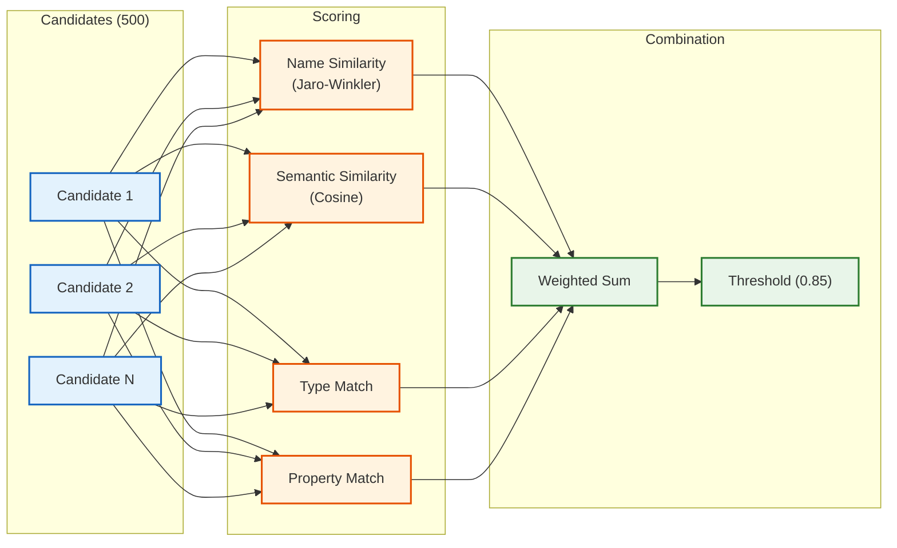
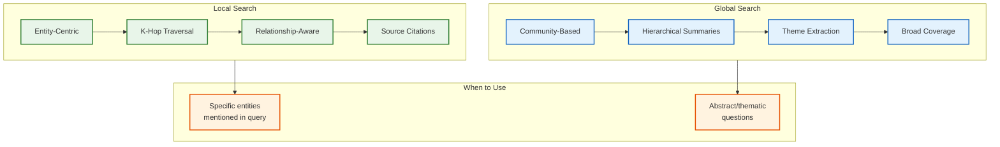
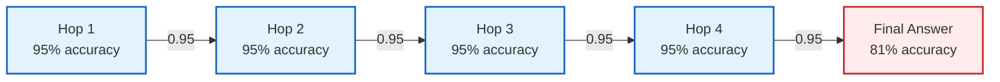
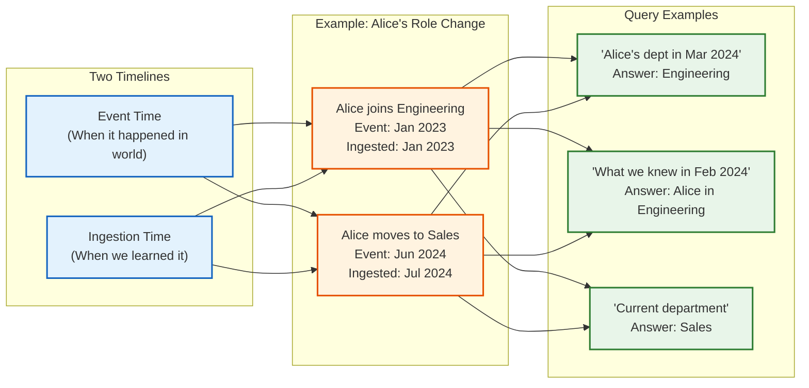
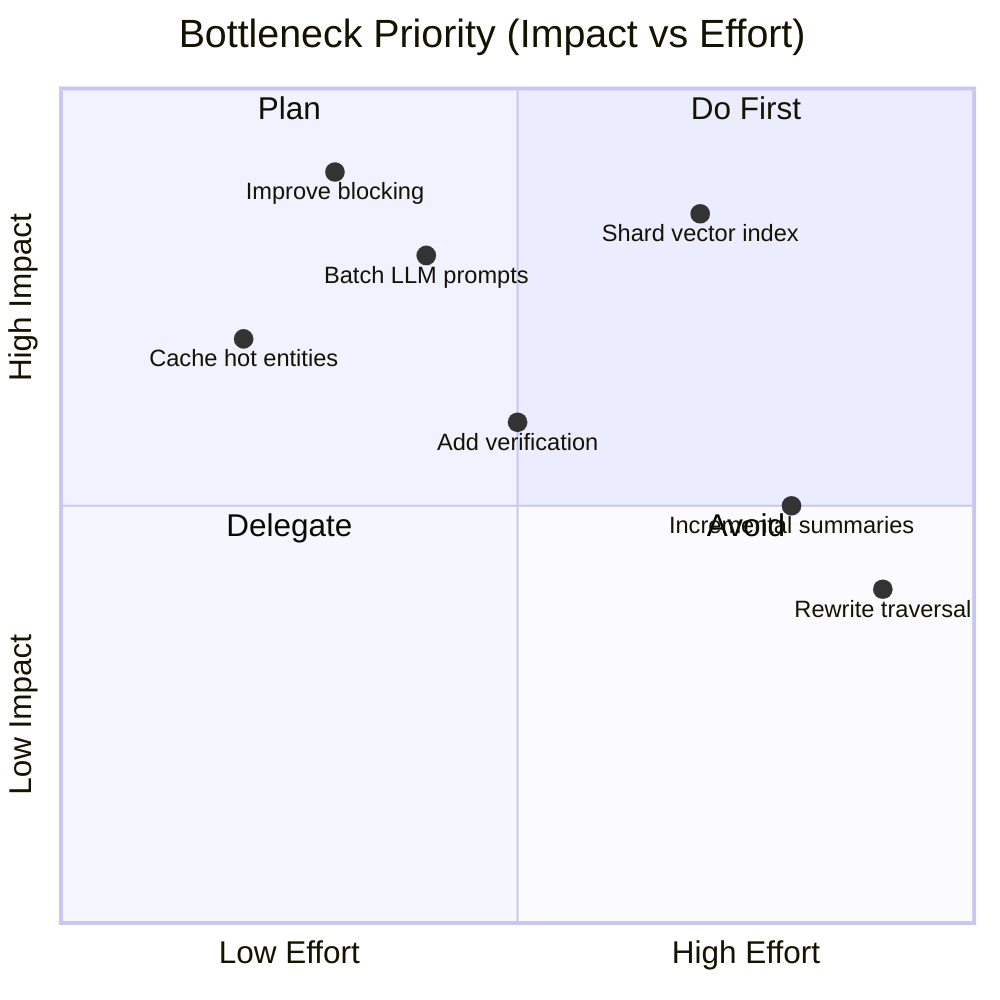

# Deep Dive and Bottlenecks

## Critical Component 1: Entity Resolution at Scale

### The Challenge

Entity resolution is the process of determining whether two entity mentions refer to the same real-world entity. At enterprise scale:

- **5 billion existing entities** in the knowledge graph
- **50 million new mentions** processed daily
- **O(n²) naive complexity** (comparing every pair) is infeasible
- **Precision > 90% required** - false merges corrupt the graph permanently
- **Sub-200ms latency** for real-time ingestion

A naive approach comparing 50M new mentions against 5B entities would require 250 quadrillion comparisons—clearly impossible.

### Impact of Poor Resolution

| Failure Mode | Impact | Example |
|--------------|--------|---------|
| **False Positive (Wrong Merge)** | Graph corruption, incorrect reasoning | "John Smith (CEO)" merged with "John Smith (Intern)" |
| **False Negative (Missed Match)** | Fragmented knowledge, duplicate entities | "IBM", "International Business Machines", "I.B.M." as separate entities |
| **High Latency** | Ingestion backlog, stale knowledge | Hours delay before new documents appear |
| **Inconsistent Results** | Trust issues, conflicting answers | Same entity resolved differently in different queries |

### Blocking Strategies Comparison

Blocking reduces the candidate set from O(n) to a manageable size before expensive matching.

| Strategy | Reduction Ratio | Recall | Pros | Cons |
|----------|-----------------|--------|------|------|
| **Name Prefix (4 chars)** | 100x | 95% | Simple, fast | Misses spelling variations |
| **Soundex** | 50x | 98% | Handles phonetic similarity | Poor for non-English names |
| **Double Metaphone** | 60x | 97% | Better than Soundex for names | Still misses semantic equivalents |
| **Character N-grams (3)** | 80x | 96% | Handles typos | Large index |
| **Embedding LSH** | 200x | 92% | Captures semantic similarity | Requires embedding computation |
| **Hybrid (Union)** | 30x | 99% | Best recall | More candidates to score |

**Recommendation:** Use hybrid blocking with name prefix + Metaphone + LSH. Union the candidate sets.

### Matching Models Comparison



| Model | Precision | Recall | Latency | Use Case |
|-------|-----------|--------|---------|----------|
| **Jaro-Winkler Only** | 75% | 90% | 0.1ms | Quick filter |
| **Embedding Similarity Only** | 80% | 85% | 2ms | Semantic matching |
| **LLM-based Matching** | 95% | 80% | 200ms | High-value entities |
| **Ensemble (Name + Embedding + Type)** | 92% | 88% | 5ms | **Production default** |
| **Two-stage (Ensemble → LLM for uncertain)** | 94% | 87% | 15ms avg | Critical applications |

### Resolution Algorithm Trade-offs

| Decision | Option A | Option B | Recommendation |
|----------|----------|----------|----------------|
| **Precision vs Recall** | High precision (90%+) | High recall (95%+) | **Precision** - false merges are worse than duplicates |
| **Online vs Batch** | Real-time resolution | Daily batch jobs | **Hybrid** - online for hot path, batch for cleanup |
| **Threshold Selection** | Conservative (0.90) | Aggressive (0.80) | **0.85** with human review for 0.80-0.90 range |
| **Transitive Closure** | At resolution time | Periodic batch | **Batch** - too expensive for real-time |

### Optimization Techniques

```
OPTIMIZATION: Hierarchical Resolution

1. FAST PATH (90% of mentions):
   - Exact canonical name match in cache
   - Return immediately
   - Time: <5ms

2. STANDARD PATH (9% of mentions):
   - Blocking with 2 strategies
   - Ensemble scoring
   - Threshold decision
   - Time: ~50ms

3. SLOW PATH (1% of mentions):
   - All blocking strategies
   - LLM-based verification
   - Human review queue for uncertain
   - Time: ~500ms + async
```

### Failure Modes and Mitigations

| Failure Mode | Detection | Mitigation |
|--------------|-----------|------------|
| Blocking key collision | Monitor candidates per query | Add more blocking strategies |
| Embedding model drift | Track similarity score distribution | Periodic recomputation |
| Entity type mismatch | Log type disagreements | Increase type weight in scoring |
| Name normalization errors | Sample and audit | Improve normalization rules |
| Transitive closure explosion | Monitor cluster sizes | Cap cluster size, human review |

---

## Critical Component 2: GraphRAG Retrieval Quality

### The Challenge

GraphRAG must return relevant context for diverse query types:

- **Specific queries:** "Who is Alice's manager?" → Need precise entity lookup
- **Broad queries:** "What are our main products?" → Need thematic overview
- **Complex queries:** "How did Project X affect Team Y's roadmap?" → Need multi-hop reasoning

Traditional RAG retrieves text chunks by similarity; it loses the structural relationships that make knowledge graphs valuable.

### Local vs Global Search Trade-offs



| Aspect | Local Search | Global Search |
|--------|--------------|---------------|
| **Query Type** | "Who manages Alice?" | "What are the main initiatives this quarter?" |
| **Starting Point** | Specific entities | All communities |
| **Retrieval** | K-hop graph traversal | Community summary search |
| **Context Size** | Small (focused) | Large (comprehensive) |
| **Latency** | 200-500ms | 500ms-2s |
| **Accuracy** | High for specific facts | Good for themes |
| **Failure Mode** | Misses broader context | Loses specific details |

### Community Detection Quality

The quality of GraphRAG global search depends directly on community quality.

**Leiden vs Louvain:**

| Aspect | Louvain | Leiden |
|--------|---------|--------|
| Speed | Faster | Slightly slower |
| Community Quality | Can have poorly-connected communities | Guarantees well-connected |
| Summarization | Summaries may be incoherent | Coherent summaries |
| Modularity | Good | Better |

**Why Leiden is preferred:** Louvain can create communities where some nodes are only connected to the community through nodes in other communities. Leiden's refinement phase prevents this, ensuring every community is internally well-connected—critical for coherent summarization.

**Quality Metrics:**

| Metric | Target | Action if Below |
|--------|--------|-----------------|
| Modularity | > 0.3 | Tune resolution parameter |
| Avg Community Size | 100-10,000 | Adjust hierarchical levels |
| Singleton Rate | < 5% | Check for disconnected entities |
| Bridge Entity Rate | < 10% | Review community boundaries |

### Summarization Strategies

| Strategy | Quality | Cost | Latency | Use Case |
|----------|---------|------|---------|----------|
| **Direct LLM** | High | $0.01/community | 2s | Small communities (<100 entities) |
| **Map-Reduce** | Medium-High | $0.02/community | 5s | Large communities (>1000 entities) |
| **Incremental** | Medium | $0.001/update | 100ms | Dynamic graphs with frequent updates |
| **Hierarchical** | High | $0.05/community | 10s | Deep summaries at multiple levels |

**Recommendation:** Use direct LLM for leaf communities, map-reduce for mid-level, hierarchical for top-level abstractions.

### DRIFT Search Deep Dive

DRIFT (Dynamic, Iterative, Filtered Traversal) improves on single-shot retrieval:

```
ALGORITHM DRIFTSearch(query)
═══════════════════════════

1. INITIAL BROAD SEARCH:
   communities = GlobalSearch(query, top_k=20)
   coverage = estimate_coverage(communities, query)

2. ITERATION (while coverage < threshold):
   // Identify gaps
   gaps = identify_uncovered_aspects(query, current_context)

   // Generate follow-up queries
   follow_ups = LLM.generate_follow_ups(query, gaps)

   // Local search on gaps
   FOR follow_up in follow_ups:
     local_results = LocalSearch(follow_up, max_hops=2)
     merge_results(current_context, local_results)

   coverage = estimate_coverage(current_context, query)

3. CONVERGENCE:
   IF coverage > 0.9 OR iterations > max_iterations:
     RETURN assemble_final_context(current_context)
```

**When to use DRIFT:**
- Complex multi-faceted queries
- Queries spanning multiple domains
- When initial retrieval seems incomplete

### Retrieval Failure Modes

| Failure Mode | Symptom | Cause | Mitigation |
|--------------|---------|-------|------------|
| Entity not found | "I don't have information about X" | Poor entity matching | Improve fuzzy matching, add aliases |
| Shallow context | Missing relationship context | K too small | Increase hop depth, add relevance-guided expansion |
| Stale summaries | Outdated thematic answers | Summary not refreshed | Trigger re-summarization on entity changes |
| Over-retrieval | Slow, irrelevant context | Too many hops, no pruning | Add relevance scoring, prune early |
| Community mismatch | Wrong theme in answer | Poor community assignment | Review community detection parameters |

---

## Critical Component 3: Multi-Hop Reasoning

### The Challenge

Multi-hop reasoning answers questions requiring traversal of multiple relationships:

- **2-hop:** "Who manages Alice's manager?" (Alice → Manager → Manager's Manager)
- **3-hop:** "What products does Alice's department sell?" (Alice → Department → Products)
- **4-hop:** "Who are the customers of products from Alice's department?" (Alice → Dept → Products → Customers)

Each hop introduces:
- Potential for error (wrong entity, wrong relationship)
- Latency (additional retrieval)
- Context window pressure (more facts to include)

### Error Propagation Analysis



**Error compounds exponentially:** Even with 95% per-hop accuracy, 4 hops yields only 81% final accuracy. This is why verification is critical.

### Verification Strategies Comparison

| Strategy | Accuracy Gain | Latency Cost | Implementation |
|----------|---------------|--------------|----------------|
| **No Verification** | Baseline | 0 | Direct LLM generation |
| **Rule-Based** | +10% | +50ms | Check entity types, relationship constraints |
| **Graph Constraint** | +15% | +100ms | Verify path exists in graph |
| **LLM Self-Verification** | +20% | +500ms | Ask LLM to verify its own answer |
| **Cross-Reference** | +25% | +800ms | Check against multiple sources |
| **Human-in-Loop** | +35% | +minutes | Queue for expert review |

**Recommendation:** Use graph constraint checking (fast, effective) + LLM self-verification for important queries.

### Decomposition Strategies

```
STRATEGY 1: Sequential Decomposition
────────────────────────────────────
Q: "What products does Alice's department sell?"

Sub-questions:
1. "What department does Alice work in?" → Engineering
2. "What products does Engineering sell?" → Product A, B

Pros: Simple, linear reasoning
Cons: Early errors cascade


STRATEGY 2: Parallel Decomposition
──────────────────────────────────
Q: "Compare the products of Team A and Team B"

Sub-questions (parallel):
1a. "What products does Team A own?" → [P1, P2]
1b. "What products does Team B own?" → [P3, P4]
2. "Compare [P1, P2] with [P3, P4]" → Comparison

Pros: Faster, independent errors
Cons: More complex orchestration


STRATEGY 3: Adaptive Decomposition
──────────────────────────────────
Start with coarse question, refine based on results

Q: "Why did Project X fail?"

Iteration 1: "What was Project X?" → Got basic info
Iteration 2: "What problems did Project X face?" → Got issues
Iteration 3: "Which issue was the root cause?" → Got cause

Pros: Handles ambiguity well
Cons: More LLM calls, slower
```

### Reasoning Trace Example

```json
{
  "query": "Who are the customers of products from Alice's department?",
  "reasoning_trace": [
    {
      "step": 1,
      "question": "What department does Alice work in?",
      "evidence": ["Entity: Alice (PERSON) -[WORKS_IN]-> Engineering (DEPARTMENT)"],
      "answer": "Alice works in Engineering",
      "confidence": 0.95,
      "verified": true
    },
    {
      "step": 2,
      "question": "What products does Engineering own?",
      "evidence": [
        "Engineering -[OWNS]-> Product A",
        "Engineering -[OWNS]-> Product B"
      ],
      "answer": "Engineering owns Product A and Product B",
      "confidence": 0.92,
      "verified": true
    },
    {
      "step": 3,
      "question": "Who are the customers of Product A and Product B?",
      "evidence": [
        "Product A -[USED_BY]-> Acme Corp",
        "Product A -[USED_BY]-> Beta Inc",
        "Product B -[USED_BY]-> Gamma LLC"
      ],
      "answer": "Customers are Acme Corp, Beta Inc, and Gamma LLC",
      "confidence": 0.88,
      "verified": true
    }
  ],
  "final_answer": "The customers of products from Alice's department (Engineering) are Acme Corp, Beta Inc, and Gamma LLC.",
  "overall_confidence": 0.76,
  "hops_traversed": 3
}
```

---

## Critical Component 4: Temporal Knowledge Management

### The Challenge

Enterprise knowledge evolves:
- People change roles, departments, companies
- Projects start, change scope, complete
- Relationships form and dissolve
- Facts get corrected or superseded

A knowledge graph must handle:
- **Point-in-time queries:** "Who was the CEO in 2020?"
- **Change tracking:** "When did Alice change departments?"
- **Contradiction handling:** "Is this fact still true?"

### Bi-Temporal Model



| Query Type | SQL-like Expression | Use Case |
|------------|---------------------|----------|
| Current state | `WHERE valid_to IS NULL` | Normal queries |
| Point-in-time (event) | `WHERE event_time <= '2024-03' AND (valid_to IS NULL OR valid_to > '2024-03')` | Historical questions |
| Point-in-time (knowledge) | `WHERE ingestion_time <= '2024-02'` | "What did we know then?" |
| Change history | `ORDER BY event_time` | Audit trail |

### Temporal Indexing Strategies

| Strategy | Query Performance | Storage Overhead | Best For |
|----------|-------------------|------------------|----------|
| **Append-only with flags** | O(n) scan | Low | Small graphs |
| **Period trees** | O(log n) | Medium | Range queries |
| **Snapshot isolation** | O(1) for latest | High (copies) | Read-heavy |
| **Versioned edges** | O(log v) per edge | Medium | Fine-grained history |

**Recommendation:** Versioned edges with period tree indexes for time-range queries.

### Contradiction Detection

```
ALGORITHM DetectContradiction(new_fact, existing_facts)
═══════════════════════════════════════════════════════

1. FIND POTENTIALLY CONFLICTING FACTS:
   conflicts = query("""
     MATCH (e1)-[r:same_type]->(e2)
     WHERE e1 = new_fact.source
       AND r.type = new_fact.type
       AND r.valid_to IS NULL
     RETURN r
   """)

2. CLASSIFY CONFLICT:
   FOR each existing in conflicts:
     IF new_fact.target != existing.target:
       IF is_exclusive_relationship(new_fact.type):
         // e.g., "reports_to" is exclusive
         conflict_type = "SUPERSESSION"
       ELSE:
         // e.g., "works_on" allows multiple
         conflict_type = "ADDITION"

3. RESOLVE:
   IF conflict_type == "SUPERSESSION":
     IF new_fact.event_time > existing.event_time:
       // New fact supersedes old
       existing.valid_to = new_fact.event_time
       create(new_fact)
     ELSE:
       // Old fact is more recent - flag for review
       flag_for_review(new_fact, existing)

   ELIF conflict_type == "FACTUAL_CONFLICT":
     // Same relationship, different values, same time
     // e.g., "Alice's title is VP" vs "Alice's title is Director"
     flag_for_human_review(new_fact, existing)
```

---

## Bottleneck Analysis

| Bottleneck | Symptom | Cause | Solution |
|------------|---------|-------|----------|
| **Entity Resolution** | Ingestion queue backlog (>10K) | Too many candidates per entity | Improve blocking (add LSH), increase parallelism |
| **Graph Traversal** | High P95 latency (>500ms) | Dense neighborhoods (super-nodes) | Add hop-by-hop pruning, cache hot entities |
| **Community Summarization** | Stale summaries (>24h old) | Expensive LLM calls | Incremental updates, prioritize active communities |
| **LLM Extraction** | High cost ($50K+/month) | Per-document LLM calls | Batch prompting, use smaller models for easy cases |
| **Multi-Hop Reasoning** | Low accuracy (<75%) | Error propagation | Verification at each step, backtracking |
| **Vector Index** | Slow entity search (>100ms) | Index size (5B embeddings) | Shard by entity type, use IVF instead of HNSW |
| **Graph Index** | Slow relationship queries | Missing indexes | Add composite indexes on (type, confidence) |

### Bottleneck Prioritization Matrix



---

## Race Conditions and Concurrency

### Race Condition 1: Concurrent Entity Resolution

**Scenario:** Two documents mention "John Smith" and are processed simultaneously.

```
Timeline:
  T1: Doc A extracts "John Smith"
  T2: Doc B extracts "John Smith"
  T3: Doc A queries candidates → no match → creates Entity_1
  T4: Doc B queries candidates → no match → creates Entity_2
  T5: Now we have duplicate entities

Solution: Optimistic locking with retry

PROCEDURE SafeResolveEntity(new_entity):
  1. Acquire distributed lock on blocking keys
  2. Query candidates
  3. If no match, create new entity
  4. Release lock
  5. If lock acquisition fails, wait and retry
```

### Race Condition 2: Read During Graph Update

**Scenario:** User queries graph while batch update is running.

```
Timeline:
  T1: Batch starts updating community 5
  T2: User queries entities in community 5
  T3: User sees partial community (some entities moved)
  T4: Batch completes

Solution: Snapshot isolation

Graph transactions use MVCC (Multi-Version Concurrency Control):
- Readers see consistent snapshot at query start time
- Writers create new versions
- Old versions garbage collected after readers complete
```

### Race Condition 3: Summary Staleness

**Scenario:** Community summary is being read while entity update arrives.

```
Solution: Eventual consistency with staleness flag

1. Entity update sets community.summary_stale = true
2. Background job regenerates summary
3. Queries check staleness:
   IF community.summary_stale AND query.requires_fresh:
     regenerate_inline()  // Slower but fresh
   ELSE:
     return cached_summary  // Fast but possibly stale
```

### Locking Strategy Summary

| Resource | Locking Strategy | Lock Granularity | Timeout |
|----------|------------------|------------------|---------|
| Entity creation | Distributed lock (Redis) | Blocking key set | 5s |
| Entity update | Optimistic (version field) | Single entity | N/A |
| Graph traversal | None (MVCC) | N/A | N/A |
| Community update | Advisory lock | Single community | 30s |
| Summary generation | Queue-based (one at a time) | Per community | 60s |
