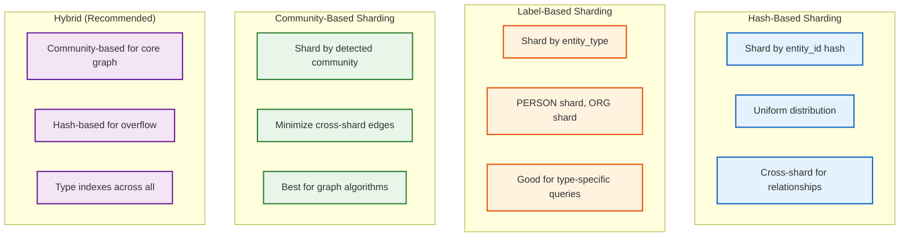
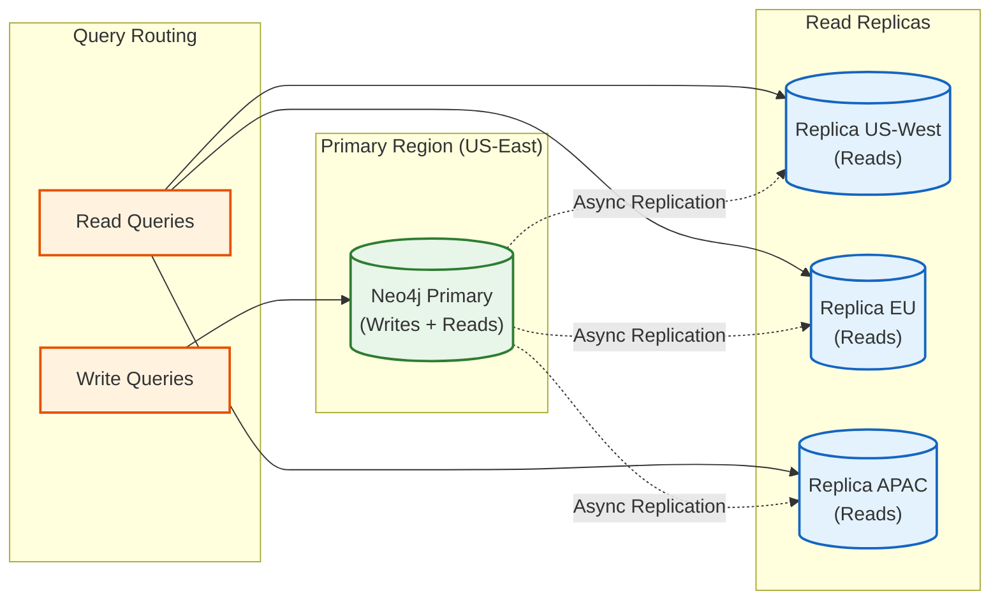
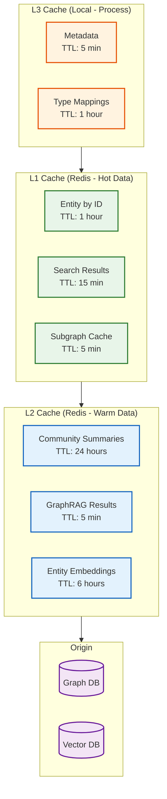
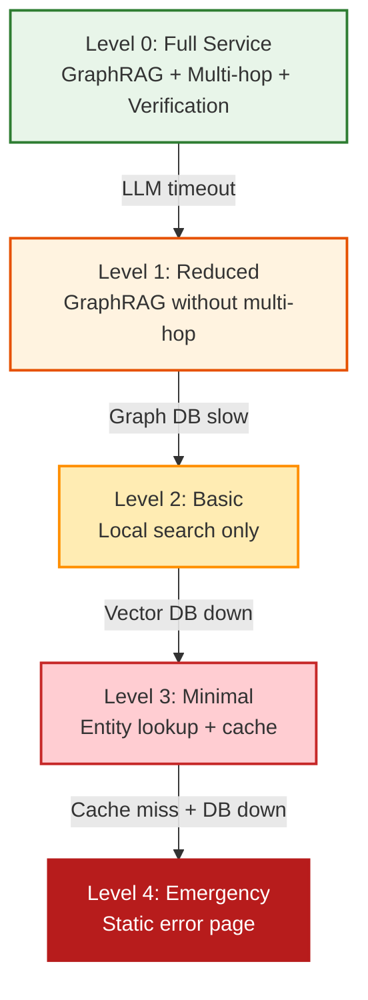

# Scalability and Reliability

## Horizontal Scaling Strategy

### Service Scaling Matrix

| Component | Stateless | Scaling Trigger | Min | Max | Strategy |
|-----------|-----------|-----------------|-----|-----|----------|
| **API Gateway** | Yes | Request rate > 80% capacity | 3 | 20 | HPA on RPS |
| **GraphRAG Service** | Yes | Latency P95 > 400ms | 5 | 50 | HPA on latency |
| **Entity Search Service** | Yes | CPU > 70% | 3 | 30 | HPA on CPU |
| **Extraction Workers** | Yes | Queue depth > 1000 | 5 | 100 | KEDA on queue |
| **Resolution Workers** | Yes | Queue depth > 500 | 3 | 50 | KEDA on queue |
| **Graph DB (Neo4j)** | No | Storage > 80%, latency spike | 3 | 9 | Manual + read replicas |
| **Vector DB** | Partial | Query latency > 50ms | 3 | 15 | Sharding + replicas |
| **Redis Cache** | No | Memory > 80% | 6 | 24 | Cluster scaling |

### Auto-Scaling Configuration

```yaml
# GraphRAG Service HPA
apiVersion: autoscaling/v2
kind: HorizontalPodAutoscaler
metadata:
  name: graphrag-service-hpa
spec:
  scaleTargetRef:
    apiVersion: apps/v1
    kind: Deployment
    name: graphrag-service
  minReplicas: 5
  maxReplicas: 50
  metrics:
    - type: Pods
      pods:
        metric:
          name: http_request_latency_p95
        target:
          type: AverageValue
          averageValue: 400m  # 400ms
    - type: Resource
      resource:
        name: cpu
        target:
          type: Utilization
          averageUtilization: 70
  behavior:
    scaleUp:
      stabilizationWindowSeconds: 60
      policies:
        - type: Percent
          value: 50
          periodSeconds: 60
    scaleDown:
      stabilizationWindowSeconds: 300
      policies:
        - type: Percent
          value: 25
          periodSeconds: 120

---
# Extraction Workers (KEDA)
apiVersion: keda.sh/v1alpha1
kind: ScaledObject
metadata:
  name: extraction-workers-scaler
spec:
  scaleTargetRef:
    name: extraction-workers
  minReplicaCount: 5
  maxReplicaCount: 100
  triggers:
    - type: kafka
      metadata:
        bootstrapServers: kafka:9092
        consumerGroup: extraction-workers
        topic: document-chunks
        lagThreshold: "1000"
```

---

## Graph Database Scaling

### Sharding Strategies



| Strategy | Cross-Shard Queries | Data Locality | Rebalancing | Best For |
|----------|---------------------|---------------|-------------|----------|
| **Hash-based** | Frequent (random) | Poor | Easy | Uniform workloads |
| **Label-based** | Moderate | Good for type queries | Moderate | Type-heavy queries |
| **Community-based** | Rare (by design) | Excellent | Complex | Graph traversals |
| **Hybrid** | Low | Good | Moderate | **Production** |

### Neo4j Fabric Configuration

```cypher
// Fabric configuration for sharded deployment
// fabric.conf

fabric.database.name=knowledge_graph
fabric.graph.0.uri=neo4j://shard0:7687
fabric.graph.0.database=shard0
fabric.graph.0.name=shard0

fabric.graph.1.uri=neo4j://shard1:7687
fabric.graph.1.database=shard1
fabric.graph.1.name=shard1

// ... up to shard N

// Query routing based on community
USE fabric.knowledge_graph
CALL {
  USE fabric.shard0
  MATCH (e:Entity {community_shard: 0})-[r]->(n)
  RETURN e, r, n
  UNION
  USE fabric.shard1
  MATCH (e:Entity {community_shard: 1})-[r]->(n)
  RETURN e, r, n
}
```

### Read Replica Configuration



---

## Vector Index Scaling

### Sharding Configuration

| Collection | Entities | Shards | Replicas | Index Type |
|------------|----------|--------|----------|------------|
| entity_embeddings | 5B | 50 | 3 | HNSW |
| chunk_embeddings | 10B | 100 | 2 | IVF-PQ |
| community_embeddings | 500K | 1 | 3 | HNSW |

### Index Parameter Tuning

```yaml
# HNSW parameters for entity embeddings
entity_embeddings:
  index_type: HNSW
  parameters:
    M: 16                    # Connections per node (higher = better recall, more memory)
    ef_construction: 200     # Build-time beam width (higher = better quality, slower build)
    ef_search: 100           # Query-time beam width (higher = better recall, slower query)

  # Dynamic ef_search based on required recall
  recall_profiles:
    fast:    { ef_search: 50, recall: 0.85 }
    default: { ef_search: 100, recall: 0.92 }
    precise: { ef_search: 200, recall: 0.97 }

# IVF-PQ for chunk embeddings (larger scale)
chunk_embeddings:
  index_type: IVF_PQ
  parameters:
    nlist: 10000             # Number of clusters
    nprobe: 32               # Clusters to search
    pq_m: 48                 # PQ subvectors
    pq_bits: 8               # Bits per subvector
```

### Query Routing Strategy

```
ALGORITHM RouteVectorQuery(query_embedding, filters, recall_requirement):

1. DETERMINE COLLECTION:
   IF filters.entity_id:
     collection = "entity_embeddings"
   ELIF filters.chunk_id:
     collection = "chunk_embeddings"

2. SELECT SHARDS:
   IF filters.entity_type:
     shards = get_shards_for_type(filters.entity_type)
   ELSE:
     shards = all_shards

3. PARALLEL SEARCH:
   results = []
   FOR shard IN shards (parallel):
     shard_results = shard.search(
       query_embedding,
       top_k=request.top_k * 2,  # Over-fetch for merge
       ef_search=recall_to_ef(recall_requirement)
     )
     results.extend(shard_results)

4. MERGE AND RERANK:
   sorted_results = sort_by_similarity(results)
   RETURN sorted_results[:request.top_k]
```

---

## Caching Strategy

### Cache Hierarchy



### Cache Key Design

```
# Entity cache
entity:{entity_id} → Entity JSON
entity:search:{hash(query+filters)} → [entity_ids]
entity:type:{entity_type}:hot → [top_100_entity_ids]

# Graph cache
graph:subgraph:{hash(entity_ids+hops)} → Subgraph JSON
graph:neighbors:{entity_id}:{hop_depth} → [relationship_ids]

# Community cache
community:{community_id}:summary → Summary text
community:{community_id}:entities → [entity_ids]
community:level:{level}:all → [community_ids]

# GraphRAG cache
graphrag:query:{hash(query+mode)} → Result JSON
graphrag:context:{hash(entity_ids)} → Context string
```

### Cache Warming Strategy

```yaml
# Warm cache on startup and periodically
cache_warming:
  startup:
    - hot_entities: "top 10K by access count"
    - active_communities: "level 0-2 communities"
    - type_indexes: "all entity types"

  periodic:
    every_5_minutes:
      - trending_entities: "recently accessed"
    every_hour:
      - community_summaries: "stale summaries"
    every_day:
      - hot_entity_refresh: "recalculate hot list"
```

---

## Fault Tolerance

### Circuit Breaker Configuration

```yaml
circuit_breakers:
  graph_db:
    failure_threshold: 5
    success_threshold: 3
    timeout: 30s
    half_open_requests: 3
    fallback: "return cached data or error"

  vector_db:
    failure_threshold: 3
    success_threshold: 2
    timeout: 10s
    fallback: "use graph-only search"

  llm_api:
    failure_threshold: 5
    success_threshold: 2
    timeout: 60s
    fallback: "return raw context without generation"

  extraction_service:
    failure_threshold: 10
    success_threshold: 5
    timeout: 120s
    fallback: "queue for retry"
```

### Graceful Degradation Levels



| Level | Available Features | User Experience |
|-------|-------------------|-----------------|
| **L0** | All features | Full functionality |
| **L1** | GraphRAG, no multi-hop | Complex queries may fail |
| **L2** | Local search, entity lookup | No thematic queries |
| **L3** | Cached entities only | Search degraded |
| **L4** | Nothing | Maintenance page |

### Retry Strategy

```yaml
retry_policies:
  graph_queries:
    max_attempts: 3
    initial_delay: 100ms
    max_delay: 2s
    multiplier: 2
    retryable_errors:
      - TIMEOUT
      - TRANSIENT_ERROR
      - LEADER_ELECTION

  llm_requests:
    max_attempts: 3
    initial_delay: 500ms
    max_delay: 10s
    multiplier: 3
    retryable_errors:
      - RATE_LIMITED
      - SERVICE_UNAVAILABLE

  extraction_tasks:
    max_attempts: 5
    initial_delay: 1s
    max_delay: 5m
    multiplier: 2
    dead_letter_after: 5
```

---

## Disaster Recovery

### Recovery Objectives

| Tier | RPO | RTO | Data Type |
|------|-----|-----|-----------|
| **Tier 1** | 1 minute | 5 minutes | Core graph (entities, relationships) |
| **Tier 2** | 1 hour | 30 minutes | Community summaries, embeddings |
| **Tier 3** | 24 hours | 4 hours | Extraction logs, audit data |

### Backup Strategy

```mermaid
flowchart LR
    subgraph Continuous["Continuous"]
        WAL["Write-Ahead Log<br/>Streaming"]
        SYNC["Sync Replication<br/>to Secondary"]
    end

    subgraph Periodic["Periodic"]
        HOUR["Hourly Incremental<br/>Backup"]
        DAY["Daily Full<br/>Snapshot"]
        WEEK["Weekly Archive<br/>to Cold Storage"]
    end

    subgraph Retention["Retention"]
        R1["Hourly: 24 copies"]
        R2["Daily: 30 copies"]
        R3["Weekly: 52 copies"]
        R4["Monthly: 12 copies"]
    end

    Continuous --> Periodic --> Retention

    classDef cont fill:#e8f5e9,stroke:#2e7d32,stroke-width:2px
    classDef period fill:#e3f2fd,stroke:#1565c0,stroke-width:2px
    classDef ret fill:#fff3e0,stroke:#e65100,stroke-width:2px

    class WAL,SYNC cont
    class HOUR,DAY,WEEK period
    class R1,R2,R3,R4 ret
```



### Multi-Region Failover

```yaml
regions:
  primary:
    name: us-east-1
    services: [api, graphrag, extraction, graph_db_primary, vector_db]
    traffic: 100%

  secondary:
    name: eu-west-1
    services: [api, graphrag, graph_db_replica, vector_db]
    traffic: 0%  # Warm standby

  tertiary:
    name: ap-southeast-1
    services: [api, graph_db_replica]
    traffic: 0%  # Cold standby

failover_procedure:
  automatic:
    trigger: "primary health check fails for 2 minutes"
    action: "promote secondary to primary"
    traffic_shift: "gradual over 5 minutes"

  manual:
    trigger: "operator decision"
    playbook: "runbooks/regional-failover.md"
```

### Recovery Procedures

```
PROCEDURE RecoverFromPrimaryFailure:

1. DETECT (automated):
   - Health checks fail for 2 minutes
   - Alert triggered to on-call

2. ASSESS (automated + manual):
   - Check if transient or persistent
   - Verify secondary is healthy

3. FAILOVER (automated):
   - Promote secondary graph DB to primary
   - Update DNS to point to secondary region
   - Shift traffic gradually (10% → 50% → 100%)

4. VERIFY:
   - Check query latency and errors
   - Verify data consistency
   - Test extraction pipeline

5. RECOVER PRIMARY (manual):
   - Diagnose root cause
   - Restore or rebuild primary
   - Re-sync data from new primary
   - Re-establish replication

6. FAILBACK (manual):
   - Verify primary is healthy
   - Gradual traffic shift back
   - Return to normal operation
```

---

## Capacity Planning

### Growth Projections

| Metric | Year 1 | Year 2 | Year 3 |
|--------|--------|--------|--------|
| Documents | 100M | 200M | 400M |
| Entities | 5B | 10B | 20B |
| Relationships | 25B | 50B | 100B |
| Storage | 120TB | 250TB | 500TB |
| Daily Queries | 5M | 15M | 40M |
| Peak QPS | 200 | 500 | 1200 |

### Scaling Triggers

| Resource | Warning | Critical | Action |
|----------|---------|----------|--------|
| Graph DB Storage | 70% | 85% | Add shards or increase storage |
| Graph DB CPU | 70% | 85% | Add read replicas |
| Vector DB Latency | P95 > 30ms | P95 > 50ms | Add shards |
| Extraction Queue | 5K depth | 10K depth | Add GPU workers |
| Redis Memory | 70% | 85% | Scale cluster |
| API Latency | P95 > 400ms | P95 > 800ms | Scale horizontally |

### Cost Scaling Model

| Scale | Monthly Infrastructure | LLM API | Total |
|-------|----------------------|---------|-------|
| Base (5B entities) | $115K | $26K | $141K |
| 2x (10B entities) | $200K | $40K | $240K |
| 4x (20B entities) | $380K | $60K | $440K |

**Cost optimization at scale:**
- Self-hosted LLM saves 70% on API costs above 10B entities
- Tiered storage saves 40% on cold data
- Reserved instances save 30% on compute
