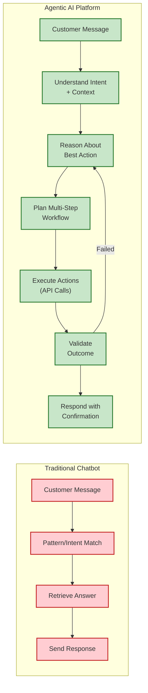
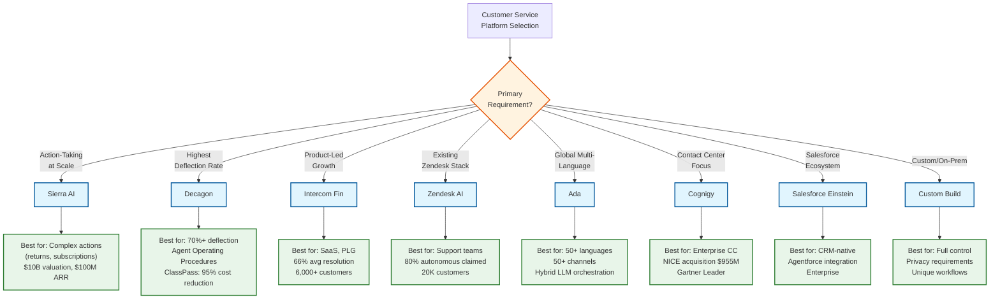
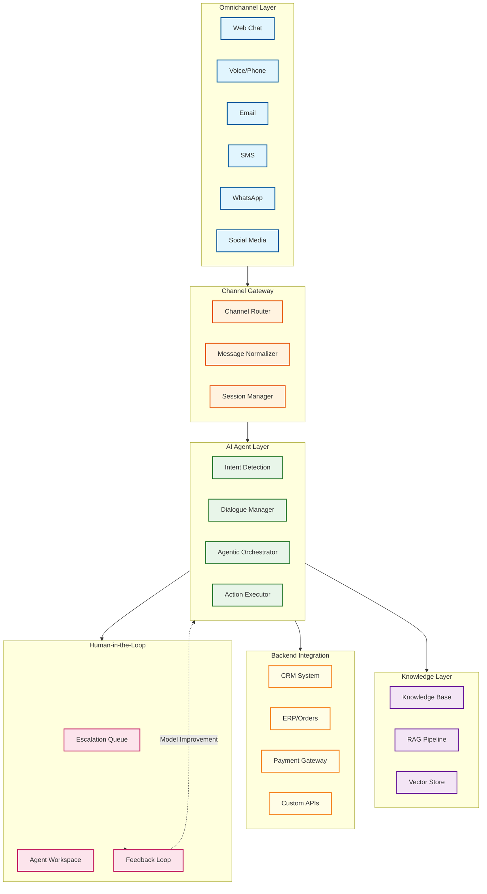

# AI-Native Customer Service Platform

## System Overview

An **AI-Native Customer Service Platform** deploys autonomous AI agents that understand customer intent, take actions on backend systems, and resolve issues end-to-end—not just answer questions. Unlike traditional chatbots that follow scripted flows, these platforms use **agentic AI** to reason about problems, execute multi-step workflows, and know when to escalate to humans. The platform operates across **50+ channels** (chat, voice, email, social, messaging apps) with unified context, delivering 60-80% autonomous resolution rates at enterprise scale.

The core architectural shift from 2024-2026: moving from **retrieval-only** systems (RAG chatbots that fetch answers) to **action-taking** agents that authenticate users, process returns, modify subscriptions, issue refunds, and complete complex transactions autonomously. Leading platforms include Sierra AI ($10B valuation, $100M ARR in 21 months), Decagon (70% deflection rate), Intercom Fin (66% resolution across 6,000+ customers), Zendesk AI (80% autonomous claims), Ada, Cognigy (acquired by NICE for $955M), and Salesforce Einstein Service.

**Complexity Rating:** `Very High`

This system is complex due to:
- Multi-channel unification with context preservation across 50+ channels
- Agentic architecture with tool use, API orchestration, and action execution
- Real-time intent detection with multi-turn dialogue management
- Human handoff with complete context transfer (71% of customers expect this)
- Continuous learning from feedback with model improvement loops
- Sub-300ms latency requirements for voice, sub-2s for text
- Safety guardrails for autonomous actions on customer data
- Sentiment analysis with proactive escalation triggers

---

## Quick Navigation

| Document | Description |
|----------|-------------|
| [01 - Requirements & Estimations](./01-requirements-and-estimations.md) | Functional/Non-functional requirements, capacity planning |
| [02 - High-Level Design](./02-high-level-design.md) | System architecture, omnichannel data flow, key decisions |
| [03 - Low-Level Design](./03-low-level-design.md) | Data model, API design, intent detection algorithms |
| [04 - Deep Dive & Bottlenecks](./04-deep-dive-and-bottlenecks.md) | Agent orchestration, handoffs, sentiment analysis |
| [05 - Scalability & Reliability](./05-scalability-and-reliability.md) | Scaling to millions of conversations, fault tolerance |
| [06 - Security & Compliance](./06-security-and-compliance.md) | PII handling, guardrails, GDPR/HIPAA compliance |
| [07 - Observability](./07-observability.md) | Metrics, conversation tracing, alerting |
| [08 - Interview Guide](./08-interview-guide.md) | 45-min pacing, trade-offs, trap questions |

---

## Key Characteristics

| Aspect | Description |
|--------|-------------|
| **Agentic Architecture** | Autonomous action-taking, not scripted responses—agents reason, plan, and execute |
| **Omnichannel Unification** | 50+ channels (chat, voice, email, SMS, WhatsApp, social) with single customer context |
| **Action Execution** | Direct integration with CRM, ERP, payments, orders—completes tasks, not just answers |
| **Human Handoff** | Warm transfers with full context (conversation, sentiment, customer profile, metadata) |
| **Continuous Learning** | Closed-loop feedback from resolutions, corrections, and ratings improves models |
| **Real-Time Sentiment** | Proactive escalation based on tone, keywords, confidence, and complexity detection |
| **Multi-Turn Dialogue** | Maintains context across 10-20+ message turns within and across sessions |

---

## Platform Comparison (2025-2026)

| Platform | Resolution Rate | Key Differentiator | Deployment | Best For |
|----------|----------------|-------------------|------------|----------|
| **Sierra AI** | 50-70% handling | Action-taking agents, fastest to $100M ARR | Cloud | Enterprise with complex actions |
| **Decagon** | 70% avg (80%+ leaders) | Agent Operating Procedures (AOPs) | Cloud | High deflection targets |
| **Intercom Fin** | 66% avg resolution | Unified customer agent vision | Cloud | Product-led companies |
| **Zendesk AI** | 80% autonomous (claimed) | Multi-agent approach (5 agent types) | Cloud | Existing Zendesk customers |
| **Ada** | 50+ channels, 50+ languages | Hybrid LLM orchestration, Ada² | Cloud/Hybrid | Global omnichannel |
| **Cognigy** | Gartner Leader | Live Agent workspace, NICE ecosystem | Cloud/On-prem | Enterprise contact centers |
| **Salesforce Einstein** | Variable | Agentforce integration, CRM-native | Cloud | Salesforce ecosystem |

### Performance Benchmarks (2025-2026)

| Metric | Industry Average | Top Performers | Target |
|--------|------------------|----------------|--------|
| Autonomous Resolution | 45-50% | 70-80% (Decagon leaders) | 60-80% |
| First Response Time | 30-60 seconds | < 5 seconds | < 10 seconds |
| Time to Resolution | 10-15 minutes | 2-5 minutes | < 5 minutes |
| CSAT Score | 3.8/5 | 4.5+/5 (Sierra Weight Watchers: 4.6/5) | > 4.2/5 |
| Cost per Resolution | $5-15 | $0.50-2 (AI-only) | < $3 blended |
| Human Escalation Rate | 50-60% | 20-30% | < 30% |

---

## Agentic vs Traditional Chatbots

### Capability Comparison

| Capability | Traditional Chatbot | Agentic AI Platform |
|------------|---------------------|---------------------|
| **Decision Making** | Rule-based, predetermined | Autonomous reasoning |
| **Action Capability** | Information retrieval only | Execute complex transactions |
| **Learning** | Static post-deployment | Continuous improvement |
| **Planning** | Scripted responses | Dynamic workflow design |
| **Complexity Handling** | Simple, single-turn queries | Multi-step, multi-system operations |
| **Adaptation** | None - fixed behavior | Adapts to context and feedback |
| **Backend Integration** | Passive information access | Active API orchestration |
| **Failure Recovery** | Escalate immediately | Retry, alternative paths, then escalate |

---

## Platform Decision Tree

---

## Core Architecture Overview

---

## Key Metrics Reference

| Metric Category | Metric | Target | Alert Threshold |
|-----------------|--------|--------|-----------------|
| **Resolution** | Autonomous Resolution Rate | 60-80% | < 50% |
| **Resolution** | First Contact Resolution | > 70% | < 60% |
| **Resolution** | Human Escalation Rate | < 30% | > 40% |
| **Latency** | First Response (Chat) | < 2s | > 5s |
| **Latency** | First Response (Voice) | < 300ms | > 500ms |
| **Latency** | Time to Resolution | < 5 min | > 10 min |
| **Quality** | CSAT Score | > 4.2/5 | < 3.8/5 |
| **Quality** | Intent Detection Accuracy | > 95% | < 90% |
| **Quality** | Action Success Rate | > 98% | < 95% |
| **Cost** | Cost per Resolution | < $3 | > $5 |
| **Scale** | Concurrent Conversations | 10K+ | Capacity planning |
| **Scale** | Conversations per Day | 1M+ | Capacity planning |

---

## Real-World Implementations

| Company | Platform | Results | Use Case |
|---------|----------|---------|----------|
| **Weight Watchers** | Sierra AI | 70% AI handling, 4.6/5 CSAT | Meal choices, membership management |
| **OluKai** | Sierra AI | 50%+ cases during Black Friday | Peak season scaling |
| **SiriusXM** | Sierra AI | Complex subscription management | Enterprise loyalty |
| **Duolingo** | Decagon | 80%+ deflection rate | Learning platform support |
| **ClassPass** | Decagon | 95% cost reduction | Fitness booking support |
| **NG.CASH** | Decagon | 13% → 70% autonomous resolution | Fintech support |
| **Lightspeed Commerce** | Intercom Fin | 99% participation, 65% autonomous | Commerce platform |

---

## Interview Preparation Checklist

### Must Know
- [ ] Agentic vs traditional chatbot architecture (action-taking vs retrieval)
- [ ] Omnichannel unification patterns (single context across 50+ channels)
- [ ] Intent detection pipeline (NLU → classification → entity extraction)
- [ ] Human handoff with context preservation (71% customer expectation)
- [ ] Confidence-based routing (threshold triggers for escalation)
- [ ] Latency requirements (sub-300ms voice, sub-2s text)

### Should Know
- [ ] Multi-turn dialogue state management
- [ ] Action execution with API orchestration
- [ ] Real-time sentiment analysis for proactive escalation
- [ ] Continuous learning feedback loops
- [ ] Platform comparison (Sierra, Decagon, Intercom, Zendesk)
- [ ] Cost optimization (AI vs human blended cost)

### Nice to Know
- [ ] Agent Operating Procedures (Decagon AOPs)
- [ ] Multi-agent approaches (Zendesk 5-agent model)
- [ ] Voice-specific latency optimization
- [ ] Cross-channel identity resolution
- [ ] A/B testing for response quality
- [ ] Guardrails for autonomous actions

---

## Related Systems

| System | Relationship |
|--------|--------------|
| [3.17 AI Agent Orchestration Platform](../3.17-ai-agent-orchestration-platform/00-index.md) | Foundation for agentic architecture |
| [3.24 Multi-Agent Orchestration Platform](../3.24-multi-agent-orchestration-platform/00-index.md) | Advanced multi-agent coordination patterns |
| [3.22 AI Guardrails & Safety System](../3.22-ai-guardrails-safety-system/00-index.md) | Safety rails for autonomous customer actions |
| [3.25 AI Observability & LLMOps Platform](../3.25-ai-observability-llmops-platform/00-index.md) | Monitoring AI agent performance |
| [3.15 RAG System](../3.15-rag-system/00-index.md) | Knowledge retrieval for agent responses |
| [3.28 AI Memory Management System](../3.28-ai-memory-management-system/00-index.md) | Cross-session context and personalization |
| [6.14 Customer Support Platform](../6.14-customer-support-platform/00-index.md) | Traditional ticketing (if exists) |

---

## References

### Platform Documentation
- [Sierra AI](https://sierra.ai) - Autonomous customer service agents
- [Decagon](https://decagon.ai) - AI customer service with AOPs
- [Intercom Fin](https://fin.ai) - AI agent for customer service
- [Zendesk AI](https://www.zendesk.com/service/ai/) - Multi-agent AI platform
- [Ada](https://www.ada.cx) - Omnichannel AI platform
- [Cognigy](https://www.cognigy.com) - Enterprise conversational AI

### Industry Research (2025-2026)
- [Gartner Magic Quadrant for Conversational AI](https://www.gartner.com) - 2025 Leader analysis
- [Cisco Agentic AI Projection](https://newsroom.cisco.com) - 68% of interactions by 2028
- [Deloitte Agentic AI Study](https://www.deloitte.com) - 25% enterprise adoption by 2025

### Engineering Blogs
- [Sierra: Weight Watchers Case Study](https://sierra.ai/customers/weightwatchers)
- [Decagon: ClassPass Cost Reduction](https://decagon.ai/case-studies)
- [Intercom: Fin 3 Architecture](https://www.intercom.com/blog/whats-new-with-fin-3/)
- [Zendesk: 80% Autonomous Resolution](https://techcrunch.com/2025/10/08/zendesk-ai-agent/)
