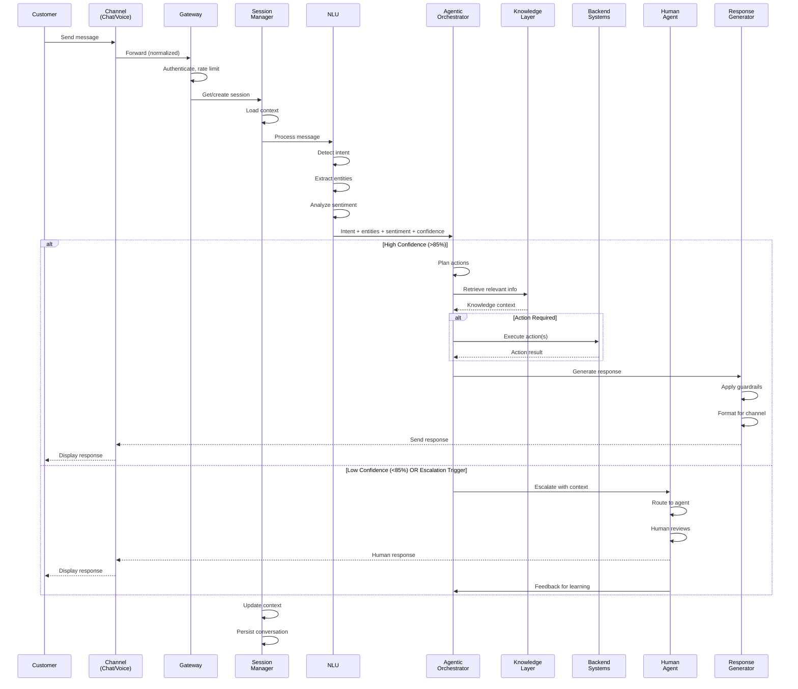
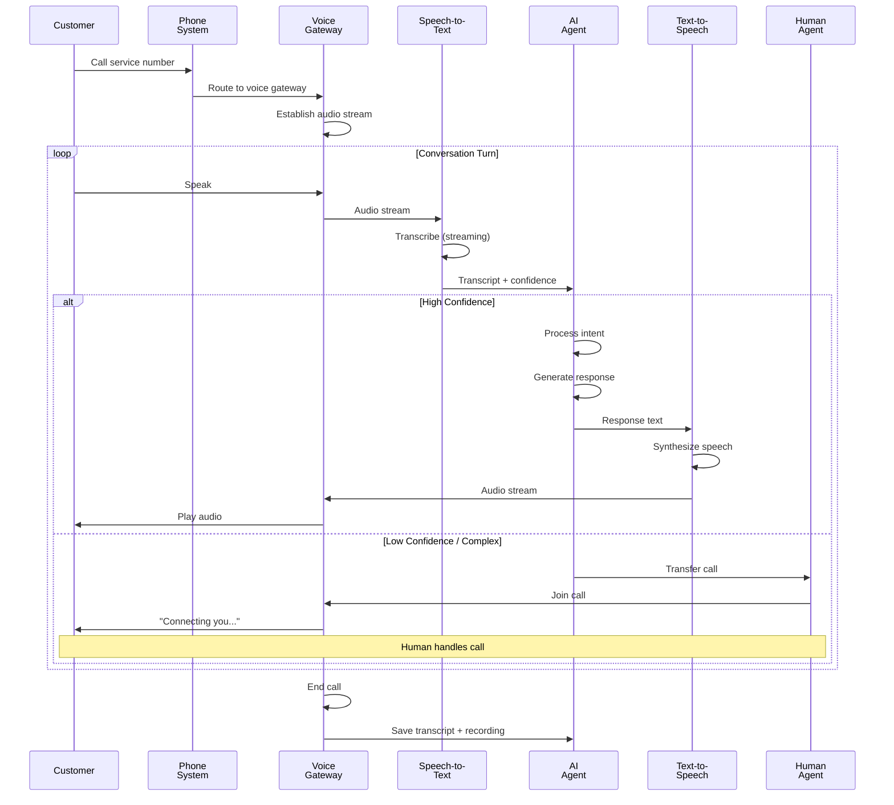
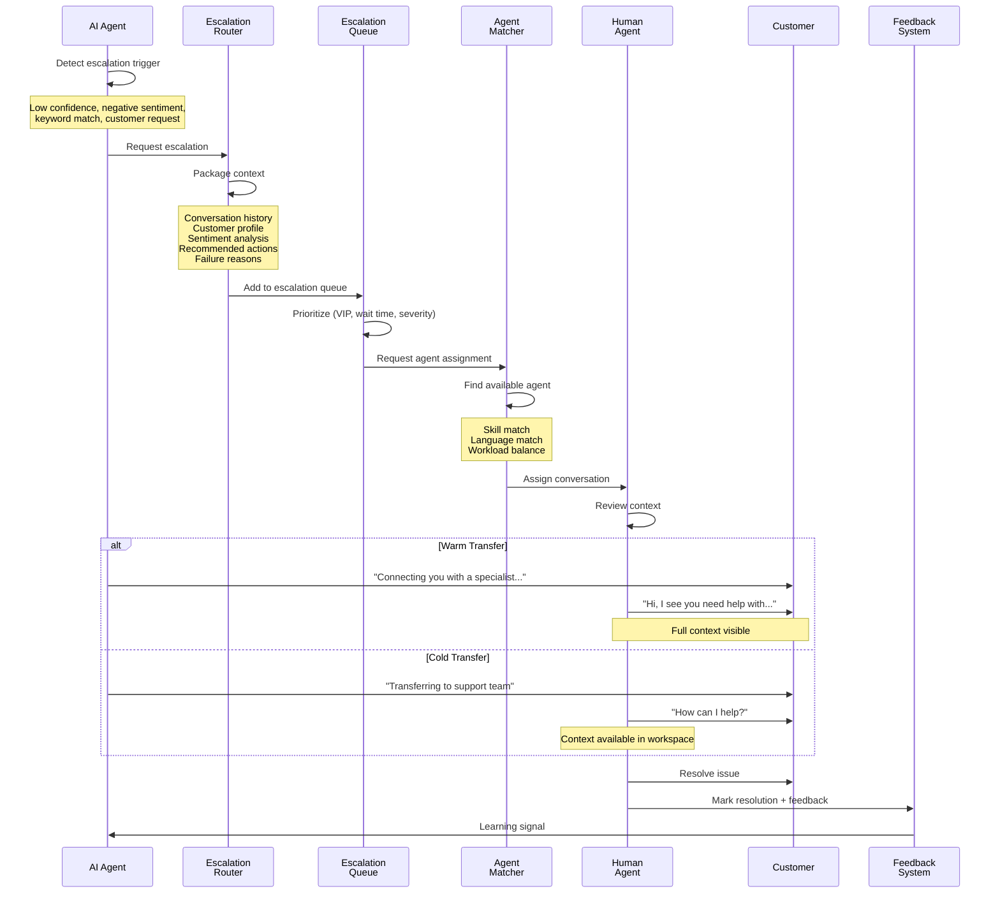
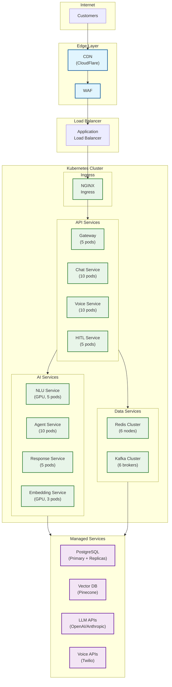

# High-Level Design

## System Architecture

```mermaid
flowchart TB
    subgraph Channels["Omnichannel Layer"]
        direction LR
        WEBCHAT["Web Chat<br/>Widget"]
        MOBILECHAT["Mobile<br/>In-App"]
        VOICE["Voice<br/>(Phone/VoIP)"]
        EMAIL["Email<br/>Gateway"]
        SMS["SMS<br/>Gateway"]
        WHATSAPP["WhatsApp<br/>Business"]
        SOCIAL["Social<br/>(FB/Twitter)"]
        SLACK["Slack/<br/>Teams"]
    end

    subgraph Gateway["API Gateway Layer"]
        AUTH["Authentication<br/>& Authorization"]
        RATELIMIT["Rate Limiter"]
        CHANNELROUTER["Channel Router"]
        NORMALIZER["Message<br/>Normalizer"]
    end

    subgraph ConversationLayer["Conversation Management"]
        SESSIONMGR["Session Manager"]
        CONTEXTSTORE["Context Store"]
        DIALOGUEMGR["Dialogue Manager"]
        STATEMACHINE["Conversation<br/>State Machine"]
    end

    subgraph AILayer["AI Agent Layer"]
        subgraph NLU["NLU Pipeline"]
            INTENT["Intent<br/>Classifier"]
            ENTITY["Entity<br/>Extractor"]
            SENTIMENT["Sentiment<br/>Analyzer"]
        end

        subgraph Agent["Agentic Orchestrator"]
            PLANNER["Action<br/>Planner"]
            ROUTER["Confidence<br/>Router"]
            EXECUTOR["Action<br/>Executor"]
        end

        subgraph Response["Response Generation"]
            RESPGEN["Response<br/>Generator"]
            GUARDRAIL["Guardrails<br/>& Safety"]
            FORMATTER["Channel<br/>Formatter"]
        end
    end

    subgraph KnowledgeLayer["Knowledge Layer"]
        KB["Knowledge<br/>Base"]
        RAG["RAG<br/>Pipeline"]
        VECTORDB[("Vector<br/>Store")]
        EMBEDDINGS["Embedding<br/>Service"]
    end

    subgraph BackendLayer["Backend Integration"]
        CRM["CRM<br/>Connector"]
        ERP["ERP/Order<br/>Connector"]
        PAYMENTS["Payment<br/>Connector"]
        CUSTOM["Custom API<br/>Connector"]
        WEBHOOK["Webhook<br/>Dispatcher"]
    end

    subgraph HITLLayer["Human-in-the-Loop"]
        ESCQUEUE["Escalation<br/>Queue"]
        SKILLROUTER["Skill-Based<br/>Router"]
        AGENTWS["Agent<br/>Workspace"]
        FEEDBACK["Feedback<br/>Collector"]
    end

    subgraph DataLayer["Data Layer"]
        CONVODB[("Conversation<br/>Store")]
        CUSTOMERDB[("Customer<br/>Profile DB")]
        ANALYTICSDB[("Analytics<br/>Store")]
        CACHE[("Redis<br/>Cache")]
        QUEUE[("Message<br/>Queue")]
    end

    subgraph MLOps["ML Operations"]
        MODELREG["Model<br/>Registry"]
        TRAINING["Training<br/>Pipeline"]
        EVAL["Evaluation<br/>Service"]
    end

    Channels --> Gateway
    Gateway --> ConversationLayer
    ConversationLayer --> AILayer
    AILayer --> KnowledgeLayer
    AILayer --> BackendLayer
    AILayer --> HITLLayer

    ConversationLayer --> DataLayer
    AILayer --> DataLayer
    HITLLayer --> DataLayer
    BackendLayer --> DataLayer

    FEEDBACK -.->|"Corrections"| MLOps
    MLOps -.->|"Updated Models"| AILayer

    classDef channel fill:#e1f5fe,stroke:#01579b,stroke-width:2px
    classDef gateway fill:#fff3e0,stroke:#e65100,stroke-width:2px
    classDef conversation fill:#e0f7fa,stroke:#00695c,stroke-width:2px
    classDef ai fill:#e8f5e9,stroke:#2e7d32,stroke-width:2px
    classDef knowledge fill:#f3e5f5,stroke:#6a1b9a,stroke-width:2px
    classDef backend fill:#fffde7,stroke:#f57f17,stroke-width:2px
    classDef hitl fill:#fce4ec,stroke:#c2185b,stroke-width:2px
    classDef data fill:#efebe9,stroke:#5d4037,stroke-width:2px
    classDef mlops fill:#e3f2fd,stroke:#1565c0,stroke-width:2px

    class WEBCHAT,MOBILECHAT,VOICE,EMAIL,SMS,WHATSAPP,SOCIAL,SLACK channel
    class AUTH,RATELIMIT,CHANNELROUTER,NORMALIZER gateway
    class SESSIONMGR,CONTEXTSTORE,DIALOGUEMGR,STATEMACHINE conversation
    class INTENT,ENTITY,SENTIMENT,PLANNER,ROUTER,EXECUTOR,RESPGEN,GUARDRAIL,FORMATTER ai
    class KB,RAG,VECTORDB,EMBEDDINGS knowledge
    class CRM,ERP,PAYMENTS,CUSTOM,WEBHOOK backend
    class ESCQUEUE,SKILLROUTER,AGENTWS,FEEDBACK hitl
    class CONVODB,CUSTOMERDB,ANALYTICSDB,CACHE,QUEUE data
    class MODELREG,TRAINING,EVAL mlops
```



---

## Component Descriptions

### Channel Layer

| Component | Responsibility | Technology |
|-----------|----------------|------------|
| **Web Chat Widget** | Embedded chat UI for websites | JavaScript SDK, WebSocket |
| **Mobile In-App** | Native SDK for iOS/Android apps | Native SDKs, WebSocket |
| **Voice Gateway** | Phone/VoIP integration with ASR/TTS | Twilio, WebRTC, SIP |
| **Email Gateway** | Inbound/outbound email processing | SMTP/IMAP, SendGrid |
| **SMS Gateway** | Two-way SMS messaging | Twilio, MessageBird |
| **WhatsApp Business** | WhatsApp Business API integration | Official API |
| **Social Channels** | Facebook, Twitter, Instagram DMs | Platform APIs |
| **Collaboration** | Slack, Microsoft Teams integration | Bot APIs |

### API Gateway Layer

| Component | Responsibility | Technology |
|-----------|----------------|------------|
| **Authentication** | Verify customer/agent identity | OAuth2, JWT, API Keys |
| **Rate Limiter** | Protect against abuse, ensure fairness | Token bucket, Redis |
| **Channel Router** | Route messages to correct handler | Custom router |
| **Message Normalizer** | Convert channel-specific formats to unified schema | Custom transformer |

### Conversation Management

| Component | Responsibility | Technology |
|-----------|----------------|------------|
| **Session Manager** | Create, maintain, close conversation sessions | Stateful service, Redis |
| **Context Store** | Persist conversation context across turns | Redis, PostgreSQL |
| **Dialogue Manager** | Track dialogue state, manage turn-taking | State machine |
| **State Machine** | Define conversation flow states and transitions | Custom FSM |

### AI Agent Layer

| Component | Responsibility | Technology |
|-----------|----------------|------------|
| **Intent Classifier** | Detect customer intent from message | Fine-tuned LLM, BERT |
| **Entity Extractor** | Extract named entities (dates, orders, amounts) | NER models, LLM |
| **Sentiment Analyzer** | Real-time tone and emotion detection | Sentiment models |
| **Action Planner** | Determine actions needed to resolve issue | LLM with tool use |
| **Confidence Router** | Route based on confidence thresholds | Decision engine |
| **Action Executor** | Execute planned actions on backend systems | API orchestrator |
| **Response Generator** | Generate natural language responses | LLM (GPT-4, Claude) |
| **Guardrails** | Safety checks, policy enforcement | NeMo Guardrails |
| **Channel Formatter** | Format response for target channel | Channel adapters |

### Knowledge Layer

| Component | Responsibility | Technology |
|-----------|----------------|------------|
| **Knowledge Base** | Store FAQs, documentation, policies | CMS, Markdown, Notion |
| **RAG Pipeline** | Retrieve relevant knowledge for context | LangChain, custom |
| **Vector Store** | Store document embeddings | Pinecone, Qdrant, Weaviate |
| **Embedding Service** | Generate embeddings for documents/queries | OpenAI, Cohere, local |

### Backend Integration

| Component | Responsibility | Technology |
|-----------|----------------|------------|
| **CRM Connector** | Read/write customer data | Salesforce, HubSpot APIs |
| **ERP/Order Connector** | Query/modify orders, inventory | SAP, custom APIs |
| **Payment Connector** | Process refunds, check payment status | Stripe, payment APIs |
| **Custom API Connector** | Generic connector for custom backends | REST, GraphQL |
| **Webhook Dispatcher** | Send events to external systems | HTTP webhooks |

### Human-in-the-Loop

| Component | Responsibility | Technology |
|-----------|----------------|------------|
| **Escalation Queue** | Priority queue for human review | Redis, PostgreSQL |
| **Skill-Based Router** | Route to agent with matching skills | Routing engine |
| **Agent Workspace** | UI for human agents to handle escalations | React, real-time |
| **Feedback Collector** | Collect corrections, ratings, annotations | Event streaming |

### Data Layer

| Component | Responsibility | Technology |
|-----------|----------------|------------|
| **Conversation Store** | Persist all conversations and messages | PostgreSQL, MongoDB |
| **Customer Profile DB** | Customer data, preferences, history | PostgreSQL |
| **Analytics Store** | Metrics, events, aggregations | ClickHouse, BigQuery |
| **Cache** | Session cache, hot data, rate limiting | Redis Cluster |
| **Message Queue** | Async event processing | Kafka, RabbitMQ |

---

## Data Flow: Customer Message



---

## Data Flow: Voice Conversation



---

## Data Flow: Human Handoff



---

## Key Architectural Decisions

### Decision 1: Agentic vs Retrieval-Only Architecture

| Option | Pros | Cons |
|--------|------|------|
| **Retrieval-Only (RAG Chatbot)** | Simpler, safer, lower cost | Cannot take actions, limited resolution |
| **Agentic (Action-Taking)** | Higher resolution rate, full task completion | Complex, safety concerns, higher latency |
| **Hybrid** | Best of both—retrieval for info, agentic for actions | Routing complexity |

**Decision:** `Agentic with Retrieval`

**Rationale:**
- 60-80% autonomous resolution requires action-taking capability
- Retrieval-only caps at ~40% resolution (information-only queries)
- Actions (refunds, cancellations, updates) are highest-value resolutions
- Guardrails mitigate safety concerns for autonomous actions
- Industry leaders (Sierra, Decagon) all use agentic architecture

### Decision 2: Omnichannel vs Channel-Specific Bots

| Option | Pros | Cons |
|--------|------|------|
| **Channel-Specific Bots** | Optimized per channel, simpler | Inconsistent experience, context loss on switch |
| **Unified Omnichannel** | Single context, consistent experience | Complex normalization, channel-specific formatting |

**Decision:** `Unified Omnichannel`

**Rationale:**
- Customers expect seamless experience across channels
- 71% expect agents to know history without re-explanation (applies to AI too)
- Single customer context enables better personalization
- Reduces engineering overhead (one AI system, not 8)
- Channel-specific formatting handled at presentation layer

### Decision 3: Synchronous vs Asynchronous Processing

| Option | Pros | Cons |
|--------|------|------|
| **Synchronous** | Simple, immediate response | Blocks on slow operations, scaling limits |
| **Asynchronous** | Scalable, handles variable latency | Complexity, eventual consistency |
| **Hybrid** | Fast path for simple, async for complex | Routing complexity |

**Decision:** `Hybrid with Async Fallback`

**Rationale:**
- Chat/voice require synchronous for user experience (<2s latency)
- Simple queries: Synchronous fast path (intent → response)
- Complex actions: Async execution with progress updates
- Email/batch: Fully async with queuing
- Backend API calls: Async with timeout handling

### Decision 4: LLM Strategy

| Option | Pros | Cons |
|--------|------|------|
| **Single Large Model** | Simple, highest quality | Expensive, slow, single point of failure |
| **Single Small Model** | Fast, cheap | Lower quality, limited reasoning |
| **Model Cascade** | Cost-optimized, quality where needed | Routing complexity |
| **Specialized Models** | Best per task | Many models to manage |

**Decision:** `Model Cascade with Specialization`

**Rationale:**
- Intent detection: Fast, fine-tuned smaller model (BERT-class)
- Simple responses: Medium model (GPT-3.5 class)
- Complex reasoning/actions: Large model (GPT-4/Claude class)
- Sentiment: Specialized sentiment model
- Saves 60-70% on LLM costs vs always using largest model
- Faster latency for simple queries

### Decision 5: State Management

| Option | Pros | Cons |
|--------|------|------|
| **Stateless** | Scalable, simple | Must pass full context every call |
| **Session State in Memory** | Fast access | Lost on pod restart |
| **Session State in Redis** | Fast, persistent, shareable | Redis dependency |
| **Full State in Database** | Durable | Slower, complex |

**Decision:** `Redis for Session + Database for Persistence`

**Rationale:**
- Redis: Active conversation state (fast reads/writes, TTL)
- PostgreSQL: Conversation history (durable, queryable)
- Write-through: Update Redis, async persist to PostgreSQL
- Session timeout: 30 minutes idle → close session
- Cross-channel: Redis enables channel switching with shared state

### Decision 6: Knowledge Base Architecture

| Option | Pros | Cons |
|--------|------|------|
| **Centralized KB** | Single source of truth, consistent | Bottleneck, complex governance |
| **Federated KB** | Domain ownership, independent updates | Inconsistency, duplication |
| **Hybrid** | Shared foundation + domain-specific | Sync complexity |

**Decision:** `Centralized with Domain Curation`

**Rationale:**
- Single vector store for all knowledge
- Domain owners curate and update their sections
- Versioned knowledge with rollback capability
- Regular sync from source systems (CMS, docs, FAQs)
- Embedding refresh pipeline for updates

---

## Technology Stack

### Core Services

| Layer | Technology | Rationale |
|-------|------------|-----------|
| **API Gateway** | Kong / AWS API Gateway | Rate limiting, auth, routing |
| **Service Mesh** | Istio | mTLS, observability, traffic management |
| **Container Orchestration** | Kubernetes | Scaling, deployment, resilience |
| **Message Queue** | Apache Kafka | Event streaming, durability, replay |
| **Task Queue** | Celery + Redis | Async task processing |
| **Workflow Orchestration** | Temporal | Durable workflows, retries, visibility |

### AI/ML Stack

| Component | Technology | Rationale |
|-----------|------------|-----------|
| **LLM Gateway** | LiteLLM / Portkey | Multi-provider routing, caching, fallbacks |
| **Primary LLM** | GPT-4 / Claude | Best reasoning for complex queries |
| **Fast LLM** | GPT-3.5 / Claude Haiku | Cost-effective for simple queries |
| **Intent Model** | Fine-tuned BERT | Fast intent classification |
| **Embedding Model** | text-embedding-3-small | Cost-effective embeddings |
| **Vector Database** | Pinecone / Qdrant | Managed vector search |
| **Guardrails** | NeMo Guardrails | Input/output safety filters |
| **ASR (Speech-to-Text)** | Whisper / Deepgram | Accurate transcription |
| **TTS (Text-to-Speech)** | ElevenLabs / OpenAI TTS | Natural voice synthesis |

### Data Stack

| Component | Technology | Rationale |
|-----------|------------|-----------|
| **Primary Database** | PostgreSQL | ACID, JSON support, mature |
| **Session Cache** | Redis Cluster | Fast session state, pub/sub |
| **Search** | Elasticsearch | Full-text search on conversations |
| **Analytics** | ClickHouse | Columnar, high-write analytics |
| **Object Storage** | S3 / MinIO | Voice recordings, attachments |
| **Data Warehouse** | Snowflake / BigQuery | Historical analytics, reporting |

### Frontend

| Component | Technology | Rationale |
|-----------|------------|-----------|
| **Chat Widget** | React + WebSocket | Real-time, embeddable |
| **Agent Workspace** | React | Rich UI for human agents |
| **Admin Dashboard** | React Admin | Configuration, analytics |
| **Mobile SDKs** | Native iOS/Android | In-app chat integration |

---

## Deployment Architecture



---

## Integration Patterns

### Inbound Channels

| Channel | Protocol | Authentication | Rate Limit |
|---------|----------|----------------|------------|
| **Web Chat** | WebSocket | Session token | 60 msg/min |
| **Mobile SDK** | WebSocket | App token + user ID | 60 msg/min |
| **Voice** | SIP/WebRTC | Phone number + PIN | N/A |
| **Email** | SMTP inbound | From address verification | 100/hour |
| **SMS** | Webhook (Twilio) | Phone number | 10/min |
| **WhatsApp** | Webhook (Meta) | Phone number + OTP | 30/min |
| **Social** | Platform webhooks | Platform tokens | Platform limits |
| **API** | REST/WebSocket | API Key / OAuth2 | Configurable |

### Outbound Integrations

| System | Protocol | Pattern | Use Case |
|--------|----------|---------|----------|
| **CRM (Salesforce)** | REST API | Sync + Async | Customer lookup, case creation |
| **ERP (SAP)** | REST/SOAP | Async | Order status, modifications |
| **Payment (Stripe)** | REST API | Sync | Refund processing |
| **Ticketing (Zendesk)** | REST API | Async | Ticket creation, updates |
| **Webhooks** | HTTPS POST | Async | Event notifications |
| **Data Warehouse** | Batch | Scheduled | Analytics export |

### Event Schema

```yaml
# Conversation Event
{
  "event_type": "message.received",
  "timestamp": "2026-01-15T10:30:00Z",
  "conversation_id": "conv-12345",
  "session_id": "sess-67890",
  "customer_id": "cust-11111",
  "channel": "web_chat",
  "message": {
    "id": "msg-22222",
    "content": "I want to cancel my subscription",
    "type": "text"
  },
  "nlu": {
    "intent": "cancel_subscription",
    "confidence": 0.94,
    "entities": [
      {"type": "product", "value": "subscription", "confidence": 0.98}
    ],
    "sentiment": {
      "label": "neutral",
      "score": 0.1
    }
  },
  "action": {
    "type": "execute",
    "name": "cancel_subscription",
    "status": "success",
    "result": {"subscription_id": "sub-33333", "cancelled_at": "2026-01-15"}
  },
  "response": {
    "content": "I've cancelled your subscription. You'll receive a confirmation email shortly.",
    "confidence": 0.96
  },
  "metadata": {
    "latency_ms": 1250,
    "model_used": "gpt-4",
    "cost_usd": 0.003
  }
}
```

---

## Architecture Pattern Checklist

| Pattern | Decision | Rationale |
|---------|----------|-----------|
| **Sync vs Async** | Hybrid | Sync for chat/voice, async for actions |
| **Event-driven vs Request-response** | Event-driven | Loose coupling, scalability |
| **Push vs Pull** | Push (WebSocket) | Real-time chat/voice |
| **Stateless vs Stateful** | Stateful sessions | Context required for multi-turn |
| **Read-heavy vs Write-heavy** | Balanced | Read context, write responses/events |
| **Real-time vs Batch** | Real-time primary | Customer service is synchronous |
| **Edge vs Origin** | Edge for delivery | CDN for widget, origin for processing |
| **Monolith vs Microservices** | Microservices | Independent scaling, team ownership |
