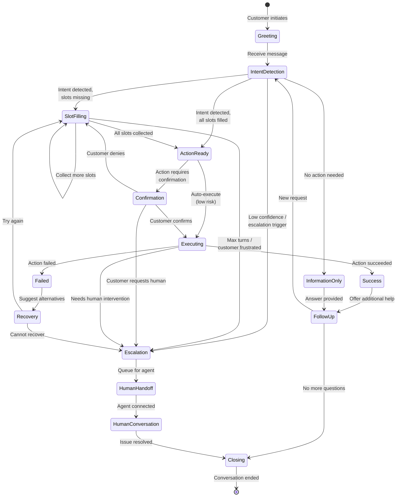

# Low-Level Design

## Data Model

### Entity Relationship Diagram

```mermaid
erDiagram
    CUSTOMER ||--o{ CONVERSATION : "initiates"
    CUSTOMER ||--o{ CUSTOMER_PROFILE : "has"
    CONVERSATION ||--o{ MESSAGE : "contains"
    CONVERSATION ||--o{ ACTION : "triggers"
    CONVERSATION }o--|| HUMAN_AGENT : "escalated_to"
    MESSAGE ||--o{ INTENT_RESULT : "analyzed_as"
    MESSAGE ||--o{ ENTITY : "contains"
    ACTION ||--o{ ACTION_LOG : "produces"
    CONVERSATION ||--o{ FEEDBACK : "receives"
    KNOWLEDGE_ARTICLE ||--o{ MESSAGE : "referenced_in"

    CUSTOMER {
        uuid customer_id PK
        string external_id
        string email
        string phone
        string channel_ids JSON
        timestamp created_at
        timestamp last_seen_at
    }

    CUSTOMER_PROFILE {
        uuid profile_id PK
        uuid customer_id FK
        string name
        string tier
        jsonb preferences
        jsonb metadata
        timestamp updated_at
    }

    CONVERSATION {
        uuid conversation_id PK
        uuid customer_id FK
        uuid session_id
        string channel
        string status
        string resolution_type
        uuid assigned_agent_id FK
        float sentiment_score
        timestamp started_at
        timestamp ended_at
        jsonb context
    }

    MESSAGE {
        uuid message_id PK
        uuid conversation_id FK
        string sender_type
        string content
        string content_type
        jsonb attachments
        timestamp created_at
        int sequence_number
    }

    INTENT_RESULT {
        uuid intent_id PK
        uuid message_id FK
        string intent_name
        float confidence
        jsonb raw_response
        string model_version
    }

    ENTITY {
        uuid entity_id PK
        uuid message_id FK
        string entity_type
        string value
        int start_offset
        int end_offset
        float confidence
    }

    ACTION {
        uuid action_id PK
        uuid conversation_id FK
        uuid message_id FK
        string action_type
        string target_system
        jsonb parameters
        string status
        jsonb result
        timestamp executed_at
        int latency_ms
    }

    ACTION_LOG {
        uuid log_id PK
        uuid action_id FK
        string step
        string status
        jsonb details
        timestamp created_at
    }

    HUMAN_AGENT {
        uuid agent_id PK
        string name
        string email
        jsonb skills
        string status
        int concurrent_limit
        timestamp last_active_at
    }

    FEEDBACK {
        uuid feedback_id PK
        uuid conversation_id FK
        uuid message_id FK
        string feedback_type
        int rating
        string comment
        jsonb corrections
        timestamp created_at
    }

    KNOWLEDGE_ARTICLE {
        uuid article_id PK
        string title
        text content
        vector embedding
        jsonb metadata
        timestamp updated_at
    }
```

### Core Tables Schema

#### Conversations Table

```sql
CREATE TABLE conversations (
    conversation_id UUID PRIMARY KEY DEFAULT gen_random_uuid(),
    customer_id UUID NOT NULL REFERENCES customers(customer_id),
    session_id UUID NOT NULL,
    channel VARCHAR(50) NOT NULL,
    status VARCHAR(20) NOT NULL DEFAULT 'active',
    resolution_type VARCHAR(50),
    assigned_agent_id UUID REFERENCES human_agents(agent_id),
    sentiment_score FLOAT,
    intent_summary JSONB,
    context JSONB DEFAULT '{}',
    started_at TIMESTAMPTZ NOT NULL DEFAULT NOW(),
    ended_at TIMESTAMPTZ,
    created_at TIMESTAMPTZ NOT NULL DEFAULT NOW(),
    updated_at TIMESTAMPTZ NOT NULL DEFAULT NOW(),

    CONSTRAINT valid_status CHECK (status IN ('active', 'waiting', 'escalated', 'resolved', 'abandoned')),
    CONSTRAINT valid_channel CHECK (channel IN ('web_chat', 'mobile', 'voice', 'email', 'sms', 'whatsapp', 'social', 'slack'))
);

CREATE INDEX idx_conversations_customer ON conversations(customer_id);
CREATE INDEX idx_conversations_status ON conversations(status);
CREATE INDEX idx_conversations_channel_started ON conversations(channel, started_at);
CREATE INDEX idx_conversations_agent ON conversations(assigned_agent_id) WHERE assigned_agent_id IS NOT NULL;
```

#### Messages Table

```sql
CREATE TABLE messages (
    message_id UUID PRIMARY KEY DEFAULT gen_random_uuid(),
    conversation_id UUID NOT NULL REFERENCES conversations(conversation_id),
    sender_type VARCHAR(20) NOT NULL,
    content TEXT NOT NULL,
    content_type VARCHAR(20) NOT NULL DEFAULT 'text',
    attachments JSONB DEFAULT '[]',
    intent_name VARCHAR(100),
    intent_confidence FLOAT,
    sentiment_label VARCHAR(20),
    sentiment_score FLOAT,
    entities JSONB DEFAULT '[]',
    sequence_number INT NOT NULL,
    created_at TIMESTAMPTZ NOT NULL DEFAULT NOW(),

    CONSTRAINT valid_sender CHECK (sender_type IN ('customer', 'ai_agent', 'human_agent', 'system')),
    CONSTRAINT valid_content_type CHECK (content_type IN ('text', 'image', 'audio', 'file', 'rich'))
);

CREATE INDEX idx_messages_conversation ON messages(conversation_id, sequence_number);
CREATE INDEX idx_messages_created ON messages(created_at);
CREATE INDEX idx_messages_intent ON messages(intent_name) WHERE intent_name IS NOT NULL;
```

#### Actions Table

```sql
CREATE TABLE actions (
    action_id UUID PRIMARY KEY DEFAULT gen_random_uuid(),
    conversation_id UUID NOT NULL REFERENCES conversations(conversation_id),
    message_id UUID REFERENCES messages(message_id),
    action_type VARCHAR(50) NOT NULL,
    target_system VARCHAR(50) NOT NULL,
    parameters JSONB NOT NULL DEFAULT '{}',
    status VARCHAR(20) NOT NULL DEFAULT 'pending',
    result JSONB,
    error_message TEXT,
    retry_count INT DEFAULT 0,
    executed_at TIMESTAMPTZ,
    latency_ms INT,
    created_at TIMESTAMPTZ NOT NULL DEFAULT NOW(),

    CONSTRAINT valid_action_status CHECK (status IN ('pending', 'executing', 'success', 'failed', 'cancelled'))
);

CREATE INDEX idx_actions_conversation ON actions(conversation_id);
CREATE INDEX idx_actions_status ON actions(status);
CREATE INDEX idx_actions_type ON actions(action_type);
```

### Session State (Redis)

```yaml
# Session Key: session:{session_id}
{
  "session_id": "sess-67890",
  "conversation_id": "conv-12345",
  "customer_id": "cust-11111",
  "channel": "web_chat",
  "status": "active",
  "context": {
    "intent_history": ["greeting", "check_order_status", "cancel_order"],
    "entities": {
      "order_id": "ORD-99999",
      "product_name": "Widget Pro"
    },
    "slots": {
      "cancellation_reason": null,
      "confirmation": null
    },
    "dialogue_state": "awaiting_confirmation",
    "turn_count": 5
  },
  "customer_profile": {
    "name": "John Doe",
    "tier": "premium",
    "lifetime_value": 5000,
    "recent_orders": ["ORD-99999", "ORD-88888"]
  },
  "sentiment": {
    "current": -0.2,
    "trend": "declining",
    "escalation_risk": 0.3
  },
  "last_message_at": "2026-01-15T10:30:00Z",
  "ttl": 1800
}
```

---

## API Design

### Chat API

#### Send Message

```yaml
POST /api/v1/conversations/{conversation_id}/messages

Request:
{
  "content": "I want to cancel my order",
  "content_type": "text",
  "attachments": [],
  "metadata": {
    "client_timestamp": "2026-01-15T10:30:00Z",
    "client_id": "web-widget-v2"
  }
}

Response:
{
  "message_id": "msg-22222",
  "conversation_id": "conv-12345",
  "response": {
    "content": "I can help you cancel your order. Which order would you like to cancel?",
    "content_type": "text",
    "suggestions": [
      {"label": "Order #99999 - Widget Pro", "value": "ORD-99999"},
      {"label": "Order #88888 - Gadget Plus", "value": "ORD-88888"}
    ]
  },
  "intent": {
    "name": "cancel_order",
    "confidence": 0.94
  },
  "entities": [
    {"type": "action", "value": "cancel"}
  ],
  "conversation_state": "awaiting_order_selection",
  "latency_ms": 850
}

Errors:
- 400: Invalid request (missing content, invalid format)
- 401: Unauthorized (invalid session token)
- 404: Conversation not found
- 429: Rate limit exceeded
- 503: Service temporarily unavailable
```

#### Start Conversation

```yaml
POST /api/v1/conversations

Request:
{
  "channel": "web_chat",
  "customer_id": "cust-11111",  # Optional for anonymous
  "initial_message": "Hello, I need help",
  "context": {
    "page_url": "https://example.com/orders",
    "user_agent": "Mozilla/5.0..."
  }
}

Response:
{
  "conversation_id": "conv-12345",
  "session_id": "sess-67890",
  "session_token": "eyJhbGciOiJIUzI1NiIs...",
  "response": {
    "content": "Hello! I'm here to help. What can I assist you with today?",
    "content_type": "text"
  },
  "customer_identified": true,
  "greeting_personalized": true
}
```

#### Get Conversation History

```yaml
GET /api/v1/conversations/{conversation_id}/messages?limit=50&before={message_id}

Response:
{
  "messages": [
    {
      "message_id": "msg-11111",
      "sender_type": "customer",
      "content": "I want to cancel my order",
      "created_at": "2026-01-15T10:30:00Z"
    },
    {
      "message_id": "msg-22222",
      "sender_type": "ai_agent",
      "content": "I can help you with that...",
      "created_at": "2026-01-15T10:30:01Z"
    }
  ],
  "has_more": false,
  "conversation_status": "active"
}
```

### Voice API

#### Start Voice Session

```yaml
POST /api/v1/voice/sessions

Request:
{
  "phone_number": "+1234567890",
  "customer_id": "cust-11111",
  "language": "en-US",
  "callback_url": "https://api.example.com/voice/events"
}

Response:
{
  "session_id": "voice-sess-12345",
  "websocket_url": "wss://voice.example.com/v1/stream/voice-sess-12345",
  "audio_format": {
    "encoding": "LINEAR16",
    "sample_rate": 16000,
    "channels": 1
  }
}
```

#### Voice WebSocket Protocol

```yaml
# Client → Server: Audio chunk
{
  "type": "audio",
  "data": "<base64 encoded audio>",
  "timestamp": 1705312200000
}

# Server → Client: Transcript (interim)
{
  "type": "transcript",
  "is_final": false,
  "text": "I want to cancel my ord...",
  "confidence": 0.85
}

# Server → Client: Transcript (final)
{
  "type": "transcript",
  "is_final": true,
  "text": "I want to cancel my order",
  "confidence": 0.96
}

# Server → Client: Response audio
{
  "type": "response",
  "text": "I can help you cancel your order. Which order?",
  "audio": "<base64 encoded audio>",
  "duration_ms": 3200
}

# Server → Client: Handoff notification
{
  "type": "handoff",
  "reason": "customer_request",
  "message": "Connecting you with a specialist...",
  "estimated_wait_seconds": 30
}
```

### Action API

#### Execute Action

```yaml
POST /api/v1/conversations/{conversation_id}/actions

Request:
{
  "action_type": "cancel_order",
  "parameters": {
    "order_id": "ORD-99999",
    "reason": "customer_request",
    "refund_method": "original_payment"
  },
  "confirmation_required": true
}

Response:
{
  "action_id": "act-33333",
  "status": "awaiting_confirmation",
  "preview": {
    "order_id": "ORD-99999",
    "refund_amount": 149.99,
    "refund_method": "Credit Card ending in 4242",
    "estimated_refund_days": 5
  },
  "confirmation_prompt": "I'll cancel order #99999 and refund $149.99 to your card ending in 4242. Should I proceed?"
}
```

#### Confirm Action

```yaml
POST /api/v1/actions/{action_id}/confirm

Request:
{
  "confirmed": true
}

Response:
{
  "action_id": "act-33333",
  "status": "success",
  "result": {
    "order_id": "ORD-99999",
    "cancelled_at": "2026-01-15T10:35:00Z",
    "refund_id": "ref-44444",
    "refund_amount": 149.99,
    "refund_status": "processing"
  },
  "response_text": "Done! I've cancelled your order and initiated a refund of $149.99. You should see it in 3-5 business days."
}
```

### Handoff API

#### Request Handoff

```yaml
POST /api/v1/conversations/{conversation_id}/handoff

Request:
{
  "reason": "customer_request",
  "priority": "normal",
  "required_skills": ["billing", "cancellations"],
  "preferred_language": "en",
  "context_notes": "Customer frustrated about delayed refund"
}

Response:
{
  "handoff_id": "hoff-55555",
  "status": "queued",
  "queue_position": 3,
  "estimated_wait_seconds": 120,
  "context_packaged": true
}
```

#### Handoff Status (WebSocket)

```yaml
# Server → Client: Queue update
{
  "type": "handoff_status",
  "handoff_id": "hoff-55555",
  "status": "queued",
  "queue_position": 2,
  "estimated_wait_seconds": 60
}

# Server → Client: Agent assigned
{
  "type": "handoff_status",
  "handoff_id": "hoff-55555",
  "status": "assigned",
  "agent": {
    "name": "Sarah",
    "avatar_url": "https://..."
  }
}

# Server → Client: Agent joined
{
  "type": "handoff_status",
  "handoff_id": "hoff-55555",
  "status": "connected",
  "message": "Hi, I'm Sarah. I see you need help with a refund. Let me look into that for you."
}
```

---

## Core Algorithms

### Intent Detection Pipeline

```
ALGORITHM: Intent Detection
INPUT: customer_message, conversation_context
OUTPUT: intent_result {name, confidence, entities, should_escalate}

1. PREPROCESS(message):
   - Normalize text (lowercase, remove excess whitespace)
   - Detect language
   - Tokenize

2. CONTEXT_ENRICHMENT:
   context = {
     recent_intents: last_3_intents(conversation),
     active_slots: get_unfilled_slots(conversation),
     customer_tier: customer.tier,
     channel: conversation.channel
   }

3. INTENT_CLASSIFICATION:
   # Fast path: Rule-based for common patterns
   IF message matches GREETING_PATTERNS:
     RETURN {name: "greeting", confidence: 1.0}
   IF message matches TRANSFER_PATTERNS:
     RETURN {name: "request_human", confidence: 1.0, should_escalate: true}

   # ML path: Neural intent classifier
   embedding = ENCODE(message, context)
   intent_scores = INTENT_MODEL.predict(embedding)
   top_intent = argmax(intent_scores)
   confidence = intent_scores[top_intent]

4. ENTITY_EXTRACTION:
   entities = NER_MODEL.extract(message)
   # Validate entities against schema
   FOR each entity in entities:
     IF entity.type in REQUIRED_VALIDATION:
       entity.valid = VALIDATE(entity)

5. CONFIDENCE_ADJUSTMENT:
   # Adjust based on context
   IF top_intent in recent_intents:
     confidence *= 0.9  # Penalize repetition
   IF entities provide strong signal:
     confidence *= 1.1  # Boost if entities match

6. ESCALATION_CHECK:
   should_escalate = FALSE
   IF confidence < CONFIDENCE_THRESHOLD (0.85):
     should_escalate = TRUE
   IF top_intent in ALWAYS_ESCALATE_INTENTS:
     should_escalate = TRUE
   IF SENTIMENT_SCORE(message) < -0.5:
     should_escalate = TRUE

7. RETURN {
     name: top_intent,
     confidence: min(confidence, 1.0),
     entities: entities,
     should_escalate: should_escalate,
     alternatives: top_3_intents
   }
```

**Complexity:** O(n) where n is message length, plus O(1) model inference

### Multi-Turn Dialogue Management

```
ALGORITHM: Dialogue State Tracking
INPUT: message, intent_result, current_state
OUTPUT: next_state, action_plan, response_context

1. STATE_UPDATE:
   state = COPY(current_state)

   # Update intent history
   state.intent_history.append(intent_result.name)

   # Update slot values from entities
   FOR each entity in intent_result.entities:
     IF entity.type in state.required_slots:
       state.slots[entity.type] = entity.value

2. DIALOGUE_POLICY:
   # Determine next action based on state
   SWITCH state.dialogue_phase:
     CASE "initial":
       IF all_slots_filled(state):
         next_phase = "confirmation"
       ELSE:
         next_phase = "slot_filling"
         missing = get_missing_slots(state)

     CASE "slot_filling":
       IF all_slots_filled(state):
         next_phase = "confirmation"
       ELIF turn_count > MAX_TURNS:
         next_phase = "escalation"
       ELSE:
         next_phase = "slot_filling"

     CASE "confirmation":
       IF intent_result.name == "confirm":
         next_phase = "execution"
       ELIF intent_result.name == "deny":
         next_phase = "slot_filling"  # Re-collect
       ELSE:
         next_phase = "clarification"

     CASE "execution":
       next_phase = "completed"

3. ACTION_PLANNING:
   action_plan = []

   IF next_phase == "slot_filling":
     action_plan.append({
       type: "ask_slot",
       slot: missing[0],
       prompt_template: SLOT_PROMPTS[missing[0]]
     })

   IF next_phase == "confirmation":
     action_plan.append({
       type: "confirm",
       action: state.pending_action,
       preview: GENERATE_PREVIEW(state)
     })

   IF next_phase == "execution":
     action_plan.append({
       type: "execute",
       action: state.pending_action,
       parameters: state.slots
     })

4. RESPONSE_CONTEXT:
   response_context = {
     intent: intent_result.name,
     phase: next_phase,
     slots: state.slots,
     missing_slots: get_missing_slots(state),
     customer_name: state.customer.name,
     action_preview: action_plan[0].preview if action_plan else None
   }

5. RETURN {
     state: state,
     action_plan: action_plan,
     response_context: response_context
   }
```

### Conversation State Machine



### Action Selection and Execution

```
ALGORITHM: Action Execution
INPUT: action_type, parameters, conversation_context
OUTPUT: action_result

1. ACTION_VALIDATION:
   # Validate action is allowed
   IF action_type NOT IN ALLOWED_ACTIONS:
     RETURN {status: "rejected", reason: "action_not_allowed"}

   # Validate customer authorization
   IF action_type IN HIGH_RISK_ACTIONS:
     IF NOT customer.authenticated:
       RETURN {status: "auth_required", challenge: AUTH_CHALLENGE}

   # Validate parameters
   validation_errors = VALIDATE_PARAMS(action_type, parameters)
   IF validation_errors:
     RETURN {status: "invalid_params", errors: validation_errors}

2. ACTION_PLANNING:
   # Decompose into steps
   steps = ACTION_REGISTRY[action_type].get_steps(parameters)

   # Example for cancel_order:
   steps = [
     {name: "lookup_order", system: "erp", params: {order_id}},
     {name: "check_cancellable", system: "internal", params: {order}},
     {name: "process_cancellation", system: "erp", params: {order_id, reason}},
     {name: "initiate_refund", system: "payments", params: {order, refund_method}},
     {name: "send_confirmation", system: "notifications", params: {customer, order}}
   ]

3. STEP_EXECUTION:
   results = []
   FOR each step in steps:
     TRY:
       # Execute with timeout and retry
       result = EXECUTE_WITH_RETRY(
         system: step.system,
         operation: step.name,
         params: step.params,
         timeout: STEP_TIMEOUT,
         retries: MAX_RETRIES
       )
       results.append({step: step.name, status: "success", result: result})

     CATCH error:
       results.append({step: step.name, status: "failed", error: error})

       # Determine if we should continue or abort
       IF step.critical:
         # Rollback previous steps if possible
         ROLLBACK(results)
         RETURN {status: "failed", step: step.name, error: error, partial_results: results}
       ELSE:
         # Non-critical step, continue
         CONTINUE

4. RESULT_AGGREGATION:
   final_result = {
     status: all_success(results) ? "success" : "partial",
     action_type: action_type,
     steps: results,
     summary: GENERATE_SUMMARY(action_type, results)
   }

5. AUDIT_LOGGING:
   LOG_ACTION({
     conversation_id: context.conversation_id,
     customer_id: context.customer_id,
     action_type: action_type,
     parameters: REDACT_PII(parameters),
     result: final_result,
     timestamp: NOW()
   })

6. RETURN final_result
```

### Confidence-Based Routing

```
ALGORITHM: Confidence Router
INPUT: intent_result, sentiment, conversation_state
OUTPUT: routing_decision {route, reason, priority}

1. ESCALATION_RULES:
   # Priority-ordered rules
   rules = [
     # Rule 1: Explicit request
     {
       condition: intent_result.name == "request_human",
       route: "human",
       reason: "customer_request",
       priority: "high"
     },

     # Rule 2: Safety keywords
     {
       condition: contains_keywords(message, SAFETY_KEYWORDS),
       route: "human",
       reason: "safety_trigger",
       priority: "urgent"
     },

     # Rule 3: Negative sentiment
     {
       condition: sentiment.score < -0.6,
       route: "human",
       reason: "negative_sentiment",
       priority: "high"
     },

     # Rule 4: Low intent confidence
     {
       condition: intent_result.confidence < 0.70,
       route: "human",
       reason: "low_confidence",
       priority: "normal"
     },

     # Rule 5: Multiple failures
     {
       condition: conversation_state.failure_count >= 2,
       route: "human",
       reason: "repeated_failures",
       priority: "high"
     },

     # Rule 6: Complex intent
     {
       condition: intent_result.name IN COMPLEX_INTENTS,
       route: "human",
       reason: "complex_issue",
       priority: "normal"
     },

     # Rule 7: VIP customer
     {
       condition: customer.tier == "vip" AND confidence < 0.90,
       route: "human",
       reason: "vip_preference",
       priority: "high"
     }
   ]

2. RULE_EVALUATION:
   FOR each rule in rules:
     IF EVALUATE(rule.condition):
       RETURN {
         route: rule.route,
         reason: rule.reason,
         priority: rule.priority,
         confidence: intent_result.confidence,
         sentiment: sentiment.score
       }

3. DEFAULT_AI_ROUTING:
   # No escalation rules triggered
   RETURN {
     route: "ai",
     reason: "within_capability",
     priority: "normal",
     confidence: intent_result.confidence
   }
```

### Sentiment Analysis Pipeline

```
ALGORITHM: Real-Time Sentiment Analysis
INPUT: message, voice_features (optional), conversation_history
OUTPUT: sentiment_result {label, score, emotions, escalation_risk}

1. TEXT_SENTIMENT:
   # Analyze text content
   text_embedding = ENCODE(message)
   text_sentiment = SENTIMENT_MODEL.predict(text_embedding)
   # Returns: {positive: 0.1, negative: 0.7, neutral: 0.2}

2. VOICE_SENTIMENT (if voice channel):
   # Analyze acoustic features
   voice_features = EXTRACT_FEATURES(audio)
   # pitch, energy, speaking_rate, pauses
   voice_sentiment = VOICE_SENTIMENT_MODEL.predict(voice_features)

3. EMOTION_DETECTION:
   # Fine-grained emotion classification
   emotions = EMOTION_MODEL.predict(text_embedding)
   # Returns: {frustration: 0.6, confusion: 0.3, anger: 0.1, ...}

4. CONTEXTUAL_ADJUSTMENT:
   # Consider conversation trajectory
   history_sentiments = [m.sentiment for m in last_5_messages]
   trend = calculate_trend(history_sentiments)
   # trend: "improving", "declining", "stable"

   # Adjust score based on trend
   IF trend == "declining":
     adjusted_score = text_sentiment.score * 1.2  # Amplify negative
   ELIF trend == "improving":
     adjusted_score = text_sentiment.score * 0.9  # Dampen negative

5. ESCALATION_RISK:
   risk_factors = {
     negative_sentiment: text_sentiment.negative > 0.6,
     high_frustration: emotions.frustration > 0.5,
     declining_trend: trend == "declining",
     long_conversation: turn_count > 10,
     multiple_intents: intent_changes > 3
   }
   escalation_risk = sum(risk_factors.values()) / len(risk_factors)

6. RETURN {
     label: dominant_sentiment(text_sentiment),
     score: adjusted_score,  # -1 to 1
     emotions: emotions,
     trend: trend,
     escalation_risk: escalation_risk,
     voice_sentiment: voice_sentiment if voice else None
   }
```

---

## Response Generation

### Response Generation Pipeline

```
ALGORITHM: Response Generation
INPUT: intent, action_result, dialogue_state, customer_context
OUTPUT: response {text, suggestions, rich_content}

1. TEMPLATE_SELECTION:
   # Select base template based on intent and state
   template_key = f"{intent.name}_{dialogue_state.phase}"
   base_template = TEMPLATES.get(template_key, TEMPLATES["generic"])

2. CONTEXT_BUILDING:
   context = {
     customer_name: customer.name or "there",
     intent: intent.name,
     action_result: action_result,
     slots: dialogue_state.slots,
     missing_slots: get_missing_slots(dialogue_state),
     sentiment: sentiment.label,
     channel: conversation.channel
   }

3. LLM_GENERATION:
   prompt = f"""
   You are a helpful customer service agent for {COMPANY_NAME}.

   Context:
   - Customer: {context.customer_name}
   - Intent: {context.intent}
   - Current state: {dialogue_state.phase}
   - Action result: {context.action_result}

   Generate a response that:
   1. Is friendly and professional
   2. Addresses the customer's need
   3. Is concise (1-2 sentences for simple, 3-4 for complex)
   4. Uses simple language
   5. Matches the sentiment appropriately

   Base template (optional): {base_template}
   """

   raw_response = LLM.generate(prompt, max_tokens=200)

4. GUARDRAILS:
   # Safety checks
   IF contains_pii(raw_response):
     raw_response = REDACT_PII(raw_response)

   IF fails_toxicity_check(raw_response):
     raw_response = TEMPLATES["safe_fallback"]

   IF contains_competitor_mention(raw_response):
     raw_response = REMOVE_COMPETITORS(raw_response)

5. CHANNEL_FORMATTING:
   formatted = FORMAT_FOR_CHANNEL(raw_response, conversation.channel)
   # Add buttons for chat, SSML for voice, etc.

6. SUGGESTIONS:
   IF dialogue_state.phase == "slot_filling":
     suggestions = generate_slot_options(missing_slots[0])
   ELIF dialogue_state.phase == "follow_up":
     suggestions = COMMON_FOLLOW_UPS
   ELSE:
     suggestions = []

7. RETURN {
     text: formatted,
     suggestions: suggestions,
     rich_content: build_rich_content(action_result),
     metadata: {
       template_used: template_key,
       llm_used: LLM.model_name,
       tokens: LLM.last_token_count
     }
   }
```

---

## Indexing Strategy

### Primary Indexes

| Table | Index | Type | Purpose |
|-------|-------|------|---------|
| conversations | customer_id | B-tree | Customer lookup |
| conversations | status, started_at | B-tree | Active conversation queries |
| conversations | channel, started_at | B-tree | Channel analytics |
| messages | conversation_id, sequence | B-tree | Message ordering |
| messages | created_at | B-tree | Time-range queries |
| messages | intent_name | B-tree | Intent analytics |
| actions | conversation_id | B-tree | Action lookup |
| actions | status, created_at | B-tree | Pending action processing |

### Partitioning Strategy

```sql
-- Partition messages by month for efficient archival
CREATE TABLE messages (
    ...
) PARTITION BY RANGE (created_at);

CREATE TABLE messages_2026_01 PARTITION OF messages
    FOR VALUES FROM ('2026-01-01') TO ('2026-02-01');

CREATE TABLE messages_2026_02 PARTITION OF messages
    FOR VALUES FROM ('2026-02-01') TO ('2026-03-01');
-- Continue for future months

-- Automated partition creation
CREATE OR REPLACE FUNCTION create_monthly_partition()
RETURNS void AS $$
DECLARE
    next_month DATE;
    partition_name TEXT;
BEGIN
    next_month := date_trunc('month', NOW() + interval '1 month');
    partition_name := 'messages_' || to_char(next_month, 'YYYY_MM');

    EXECUTE format(
        'CREATE TABLE IF NOT EXISTS %I PARTITION OF messages
         FOR VALUES FROM (%L) TO (%L)',
        partition_name,
        next_month,
        next_month + interval '1 month'
    );
END;
$$ LANGUAGE plpgsql;
```

### Vector Index (Knowledge Base)

```sql
-- Using pgvector for knowledge embeddings
CREATE TABLE knowledge_articles (
    article_id UUID PRIMARY KEY,
    title TEXT NOT NULL,
    content TEXT NOT NULL,
    embedding vector(1536),  -- OpenAI embedding dimension
    metadata JSONB,
    updated_at TIMESTAMPTZ
);

-- IVFFlat index for approximate nearest neighbor
CREATE INDEX idx_knowledge_embedding ON knowledge_articles
    USING ivfflat (embedding vector_cosine_ops)
    WITH (lists = 100);

-- Query for similar articles
SELECT article_id, title, content,
       1 - (embedding <=> query_embedding) as similarity
FROM knowledge_articles
ORDER BY embedding <=> query_embedding
LIMIT 5;
```
