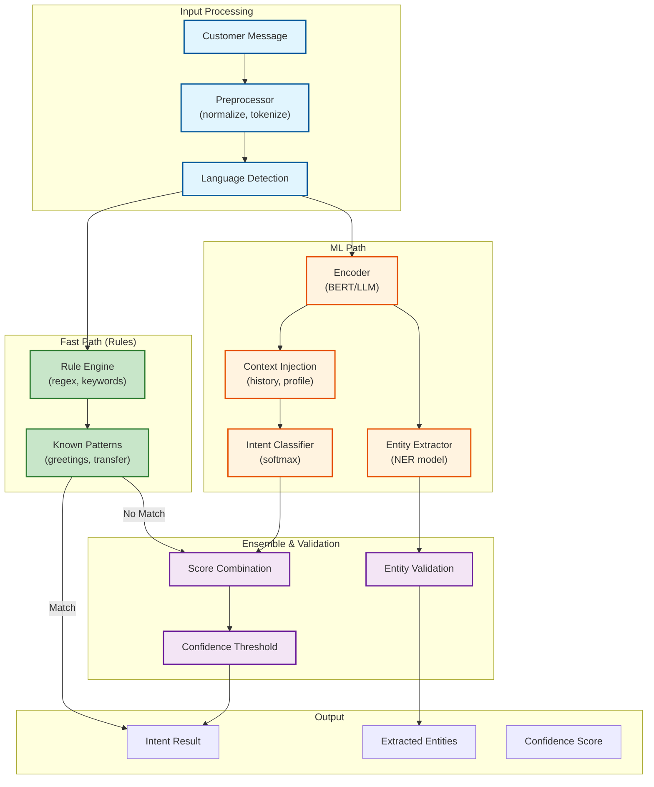
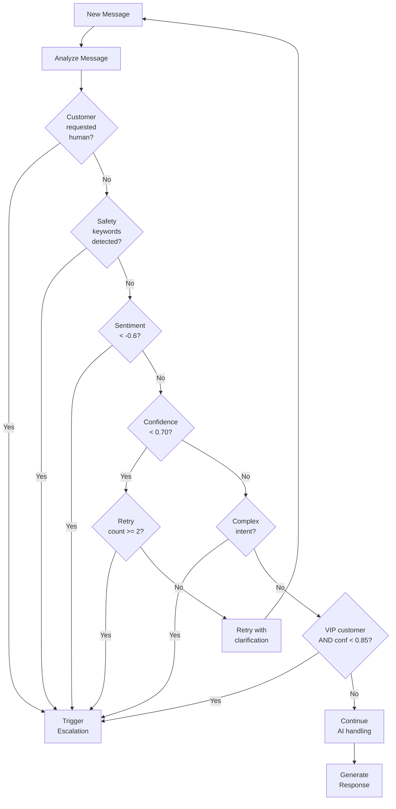
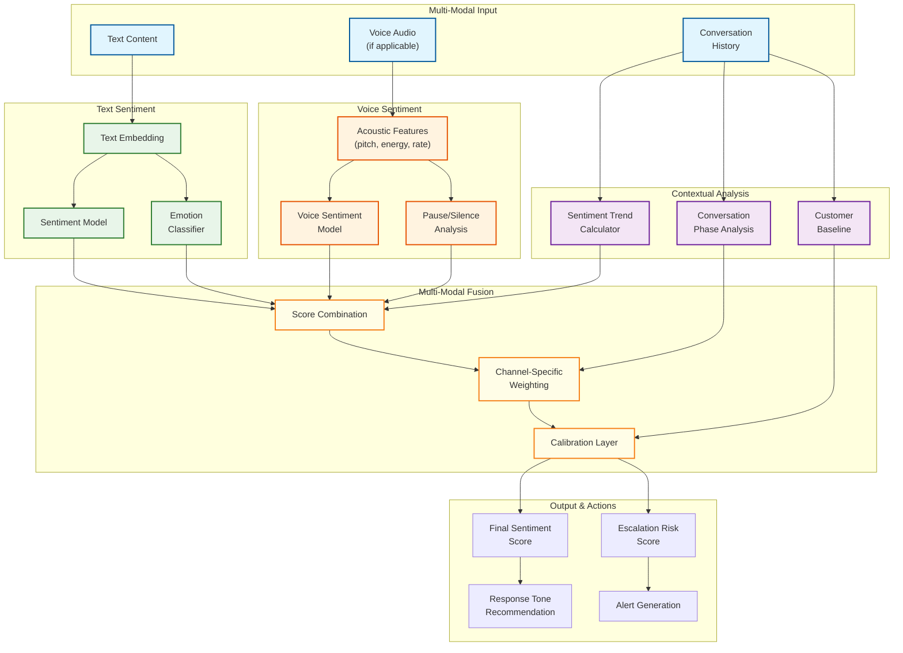
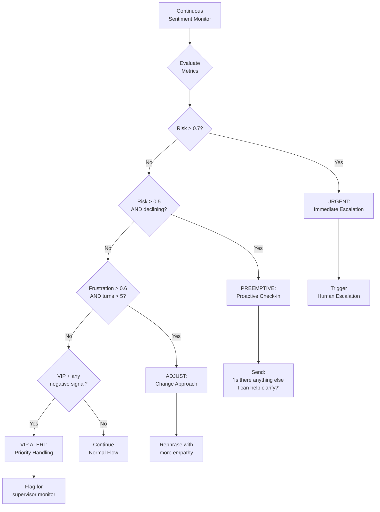
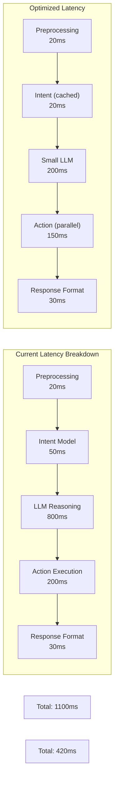

# Deep Dive & Bottlenecks

## Critical Component 1: Intent Detection & Entity Extraction

### Why This Is Critical

Intent detection is the **first decision point** in every conversation. A misclassified intent leads to:
- Wrong response generation (customer frustration)
- Incorrect action execution (potentially harmful)
- Unnecessary escalations (increased costs)
- Missed autonomous resolution opportunities

**Impact:** A 5% improvement in intent accuracy can translate to 3-5% higher autonomous resolution rate.

### Architecture Deep Dive



### Internal Workings

**1. Preprocessing Pipeline**
```
Input: "i want 2 cancel my order #12345 pls!!!"

Steps:
1. Lowercase: "i want 2 cancel my order #12345 pls!!!"
2. Expand contractions: "i want to cancel my order #12345 please!!!"
3. Normalize numbers: "i want to cancel my order #NUMBER please"
4. Remove excess punctuation: "i want to cancel my order #NUMBER please"
5. Tokenize: ["i", "want", "to", "cancel", "my", "order", "#NUMBER", "please"]

Output: Normalized text + original (for entity extraction)
```

**2. Context-Aware Classification**
```
Context Window:
- Last 3 intents: [greeting, check_order_status, ...]
- Active entities: {order_id: "12345"}
- Customer tier: premium
- Channel: web_chat
- Time in conversation: 3 minutes

Context Embedding:
[intent_history_emb, entity_emb, profile_emb] → context_vector

Combined Input:
message_embedding + context_vector → classification_input
```

**3. Multi-Intent Handling**
```
Message: "Cancel my order and also change my email address"

Detection:
- Intent 1: cancel_order (confidence: 0.89)
- Intent 2: update_profile (confidence: 0.84)

Strategy:
1. Identify primary intent (first mentioned, highest confidence)
2. Queue secondary intents for follow-up
3. Address primary first, then: "I also noticed you wanted to update your email..."
```

### Failure Modes

| Failure Mode | Cause | Detection | Mitigation |
|--------------|-------|-----------|------------|
| **Misclassification** | Ambiguous language, novel phrasing | Low confidence, customer correction | Confidence threshold, HITL review |
| **Entity Extraction Error** | Typos, unusual formats | Validation failure | Fuzzy matching, confirmation prompts |
| **Context Poisoning** | Incorrect previous intent | Inconsistent conversation flow | State reset triggers, fresh context |
| **Language Confusion** | Code-switching, mixed languages | Language detection uncertainty | Multi-language models, fallback |
| **Adversarial Input** | Prompt injection attempts | Pattern detection | Input sanitization, guardrails |

### Performance Optimization

| Optimization | Technique | Impact |
|--------------|-----------|--------|
| **Model Quantization** | INT8 quantization of BERT | 2x speedup, <1% accuracy loss |
| **Caching** | Cache embeddings for common phrases | 50% latency reduction for repeats |
| **Batching** | Batch inference during high load | 3x throughput improvement |
| **Distillation** | Smaller student model from GPT-4 teacher | 10x faster inference |
| **Speculative Execution** | Pre-compute likely next intents | Perceived latency reduction |

---

## Critical Component 2: Human Handoff System

### Why This Is Critical

Handoff is the **bridge between AI and human resolution**. Poor handoffs cause:
- Customer frustration (repeating information)
- Agent inefficiency (missing context)
- Increased handle time
- Lower CSAT scores

**Stat:** 71% of customers expect agents to know their history without re-explanation.

### Architecture Deep Dive



```mermaid
flowchart TB
    subgraph Trigger["Escalation Triggers"]
        SENTIMENT["Negative Sentiment<br/>< -0.6"]
        CONFIDENCE["Low Confidence<br/>< 0.70"]
        KEYWORD["Safety Keywords"]
        REQUEST["Customer Request"]
        FAILURE["Repeated Failures<br/>>= 2"]
        COMPLEXITY["Complex Issue"]
    end

    subgraph ContextPackage["Context Packaging"]
        HISTORY["Conversation<br/>History"]
        PROFILE["Customer<br/>Profile"]
        SENTIMENT_DATA["Sentiment<br/>Timeline"]
        INTENT_LOG["Intent<br/>History"]
        ACTION_LOG["Actions<br/>Attempted"]
        SUGGESTION["Recommended<br/>Resolution"]
    end

    subgraph Routing["Skill-Based Routing"]
        SKILLS["Skill Matcher"]
        LANGUAGE["Language Matcher"]
        TIER["Customer Tier"]
        AVAILABILITY["Agent Availability"]
        LOAD["Load Balancer"]
    end

    subgraph Queue["Queue Management"]
        PRIORITY["Priority Queue"]
        SLA["SLA Monitor"]
        POSITION["Position Updates"]
    end

    subgraph Transfer["Transfer Execution"]
        WARM["Warm Transfer<br/>(Agent joins)"]
        COLD["Cold Transfer<br/>(Context passed)"]
        CALLBACK["Callback Scheduled"]
    end

    subgraph AgentWorkspace["Agent Workspace"]
        CONTEXT_VIEW["Context Panel"]
        CONVO_VIEW["Conversation View"]
        SUGGESTIONS_VIEW["AI Suggestions"]
        ACTIONS_VIEW["Quick Actions"]
    end

    Trigger --> ContextPackage
    ContextPackage --> Routing
    Routing --> Queue
    Queue --> Transfer
    Transfer --> AgentWorkspace

    classDef trigger fill:#ffcdd2,stroke:#c62828,stroke-width:2px
    classDef context fill:#e1f5fe,stroke:#01579b,stroke-width:2px
    classDef routing fill:#fff3e0,stroke:#e65100,stroke-width:2px
    classDef queue fill:#e8f5e9,stroke:#2e7d32,stroke-width:2px
    classDef transfer fill:#f3e5f5,stroke:#6a1b9a,stroke-width:2px

    class SENTIMENT,CONFIDENCE,KEYWORD,REQUEST,FAILURE,COMPLEXITY trigger
    class HISTORY,PROFILE,SENTIMENT_DATA,INTENT_LOG,ACTION_LOG,SUGGESTION context
    class SKILLS,LANGUAGE,TIER,AVAILABILITY,LOAD routing
    class PRIORITY,SLA,POSITION queue
    class WARM,COLD,CALLBACK transfer
```

### Context Package Structure

```yaml
handoff_context:
  # Core Identification
  handoff_id: "hoff-55555"
  conversation_id: "conv-12345"
  customer_id: "cust-11111"
  channel: "web_chat"
  timestamp: "2026-01-15T10:35:00Z"

  # Escalation Reason
  trigger:
    type: "negative_sentiment"
    details: "Sentiment score dropped to -0.7 after failed refund attempt"
    confidence_at_trigger: 0.65
    ai_recommendation: "Process manual refund, offer discount"

  # Customer Profile
  customer:
    name: "John Doe"
    email: "john@example.com"
    tier: "premium"
    lifetime_value: 5000
    account_age_days: 730
    recent_purchases: 5
    previous_escalations: 1
    preferred_language: "en"

  # Conversation Summary
  conversation:
    started_at: "2026-01-15T10:20:00Z"
    duration_minutes: 15
    message_count: 12
    primary_intent: "request_refund"
    secondary_intents: ["check_order_status", "complaint"]

    # Full history with timestamps
    messages:
      - role: "customer"
        content: "Where is my refund?"
        timestamp: "2026-01-15T10:20:00Z"
        sentiment: -0.2
      # ... all messages

    # Key extracted information
    extracted_entities:
      order_id: "ORD-99999"
      product: "Widget Pro"
      purchase_date: "2026-01-01"
      refund_amount: 149.99

  # Sentiment Timeline
  sentiment:
    current: -0.7
    trend: "declining"
    timeline:
      - timestamp: "2026-01-15T10:20:00Z"
        score: -0.2
      - timestamp: "2026-01-15T10:25:00Z"
        score: -0.4
      - timestamp: "2026-01-15T10:30:00Z"
        score: -0.7
    emotions:
      frustration: 0.8
      anger: 0.3
      confusion: 0.2

  # Actions Taken by AI
  actions_attempted:
    - action: "lookup_order"
      status: "success"
      result: "Order found, shipped 2026-01-05"
    - action: "check_refund_status"
      status: "success"
      result: "Refund initiated 2026-01-10, pending"
    - action: "expedite_refund"
      status: "failed"
      error: "Manual approval required"

  # AI Recommendations for Human
  ai_suggestions:
    - "Process manual refund (requires supervisor approval)"
    - "Offer 10% discount on next order as goodwill"
    - "Verify bank details if refund continues to fail"

  # Routing Preferences
  routing:
    required_skills: ["refunds", "escalation_handling"]
    preferred_language: "en"
    priority: "high"
    customer_tier_boost: true
```

### Escalation Trigger Decision Flow



### Warm vs Cold Transfer

| Aspect | Warm Transfer | Cold Transfer |
|--------|---------------|---------------|
| **Experience** | Agent joins while AI present | Complete handover |
| **Context** | AI briefs agent, customer present | Context panel for agent |
| **Customer Effort** | Minimal (no repeat) | May need brief recap |
| **Wait Time** | Agent available immediately | May queue |
| **Use Case** | Complex issues, VIP | Standard escalations |
| **Implementation** | Three-way state | Context serialization |

### Failure Modes

| Failure Mode | Cause | Detection | Mitigation |
|--------------|-------|-----------|------------|
| **Context Loss** | Serialization error, timeout | Context validation check | Redundant storage, retry |
| **Routing Failure** | No matching agents | Queue timeout | Fallback skill groups |
| **Long Wait Time** | Agent unavailability | SLA monitoring | Callback option, priority boost |
| **Agent Mismatch** | Wrong skill routing | Agent feedback | Routing algorithm tuning |
| **Duplicate Handoff** | Race condition | Idempotency check | Handoff locking |

---

## Critical Component 3: Real-Time Sentiment Analysis

### Why This Is Critical

Sentiment analysis enables **proactive escalation** before customers become extremely frustrated. It:
- Predicts escalation needs before explicit requests
- Adjusts response tone dynamically
- Identifies at-risk customers for intervention
- Provides feedback for AI improvement

**Impact:** 25% increase in customer retention with advanced sentiment implementations.

### Architecture Deep Dive



### Sentiment Scoring Model

```
ALGORITHM: Multi-Dimensional Sentiment Score
INPUT: message, voice_features, history
OUTPUT: sentiment {score, emotions, trend, risk}

1. TEXT SENTIMENT (primary signal):
   Base sentiment: [-1.0 to 1.0]
   - -1.0: Extremely negative (anger, threat)
   - -0.5: Negative (frustration, complaint)
   -  0.0: Neutral
   - +0.5: Positive (satisfied, appreciative)
   - +1.0: Extremely positive (delighted)

2. EMOTION DECOMPOSITION:
   emotions = {
     frustration: 0.0-1.0,
     anger: 0.0-1.0,
     confusion: 0.0-1.0,
     satisfaction: 0.0-1.0,
     urgency: 0.0-1.0
   }

3. VOICE MODIFIERS (if voice channel):
   pitch_variance → stress indicator
   speaking_rate → urgency indicator
   pause_frequency → frustration indicator
   volume_changes → emotional intensity

   voice_modifier = weighted_average(indicators) * 0.3

4. TREND CALCULATION:
   last_5_scores = [s1, s2, s3, s4, s5]
   trend = linear_regression_slope(last_5_scores)
   # trend: positive = improving, negative = declining

5. RISK SCORING:
   risk_factors = {
     negative_sentiment: score < -0.4,           # 0.25 weight
     high_frustration: emotions.frustration > 0.6, # 0.20 weight
     declining_trend: trend < -0.1,              # 0.20 weight
     long_conversation: turns > 8,               # 0.10 weight
     repeated_intents: same_intent_count > 2,    # 0.15 weight
     failed_actions: action_failures > 0         # 0.10 weight
   }

   escalation_risk = weighted_sum(risk_factors)

6. RESPONSE TONE RECOMMENDATION:
   IF score > 0.3:
     tone = "friendly"
   ELIF score > -0.3:
     tone = "neutral_professional"
   ELIF score > -0.6:
     tone = "empathetic"
   ELSE:
     tone = "apologetic_urgent"
```

### Proactive Intervention Triggers



---

## Bottleneck Analysis

### Bottleneck 1: LLM Inference Latency

**Problem:** LLM calls add 500ms-2s to each response, which compounds for multi-step reasoning.

**Impact:** Voice channels require <300ms total latency; LLM alone exceeds this.



**Mitigation Strategies:**

| Strategy | Implementation | Latency Reduction |
|----------|----------------|-------------------|
| **Model Cascade** | Use small model for simple intents, large for complex | 40-60% |
| **Streaming Responses** | Stream tokens as generated | Perceived 50% |
| **Response Caching** | Cache common responses | 80% for cache hits |
| **Speculative Execution** | Pre-compute likely responses | 30% |
| **Edge Inference** | Run small models at edge | 50ms network savings |
| **Prompt Optimization** | Shorter, efficient prompts | 20-30% |

### Bottleneck 2: Knowledge Retrieval Latency

**Problem:** RAG pipeline adds 200-500ms for vector search + document fetch.

**Impact:** Knowledge-heavy conversations see compounded delays.

**Mitigation Strategies:**

| Strategy | Implementation | Latency Reduction |
|----------|----------------|-------------------|
| **Embedding Cache** | Cache query embeddings | 50% for repeat queries |
| **Hierarchical Index** | Course-to-fine retrieval | 40% |
| **Pre-fetching** | Prefetch likely documents | 60% perceived |
| **Hybrid Search** | BM25 + vector (parallel) | 20% (better results) |
| **Document Chunking** | Smaller, focused chunks | 30% processing |

### Bottleneck 3: Backend API Latency

**Problem:** External system calls (CRM, ERP, payments) add 200-2000ms.

**Impact:** Action execution becomes the longest step.

**Mitigation Strategies:**

| Strategy | Implementation | Latency Reduction |
|----------|----------------|-------------------|
| **Parallel Execution** | Execute independent calls in parallel | 50-70% |
| **Response Caching** | Cache read-only queries (orders, profile) | 80% for cache hits |
| **Circuit Breakers** | Fail fast when backends slow | Prevents timeouts |
| **Timeout Budgets** | Strict timeouts with fallbacks | Bounded latency |
| **Async Actions** | Return immediately, confirm later | Perceived 90% |

### Bottleneck 4: Session State Management

**Problem:** Redis reads/writes for every message add 5-20ms.

**Impact:** Accumulates across multi-turn conversations.

**Mitigation Strategies:**

| Strategy | Implementation | Latency Reduction |
|----------|----------------|-------------------|
| **Local Caching** | In-memory cache with Redis fallback | 80% for reads |
| **Batch Writes** | Aggregate state updates | 50% write reduction |
| **Compression** | Compress session state | 30% network savings |
| **Sticky Sessions** | Route to same pod | Local cache hits |

### End-to-End Latency Budget

```
Target: < 500ms for simple queries, < 2s for actions

Budget Allocation (Simple Query):
┌─────────────────────────┬────────────┐
│ Component               │ Budget     │
├─────────────────────────┼────────────┤
│ Network (client→server) │ 50ms       │
│ Gateway + Auth          │ 20ms       │
│ Session Load            │ 10ms       │
│ Intent Detection        │ 50ms       │
│ Knowledge Retrieval     │ 100ms      │
│ Response Generation     │ 200ms      │
│ Formatting              │ 20ms       │
│ Session Save            │ 10ms       │
│ Network (server→client) │ 40ms       │
├─────────────────────────┼────────────┤
│ Total                   │ 500ms      │
└─────────────────────────┴────────────┘

Budget Allocation (Action Query):
┌─────────────────────────┬────────────┐
│ Component               │ Budget     │
├─────────────────────────┼────────────┤
│ Network (client→server) │ 50ms       │
│ Gateway + Auth          │ 20ms       │
│ Session Load            │ 10ms       │
│ Intent Detection        │ 50ms       │
│ Action Planning (LLM)   │ 500ms      │
│ Action Execution        │ 800ms      │
│ Response Generation     │ 300ms      │
│ Formatting              │ 20ms       │
│ Session Save            │ 10ms       │
│ Network (server→client) │ 40ms       │
├─────────────────────────┼────────────┤
│ Total                   │ 1800ms     │
└─────────────────────────┴────────────┘
```

---

## Concurrency & Race Conditions

### Race Condition 1: Duplicate Message Processing

**Scenario:** Customer rapidly sends two messages before first is processed.

**Problem:** Both messages trigger intent detection, potentially conflicting actions.

**Solution:**
```
1. Message Sequencing:
   - Assign sequence_number to each message
   - Process in order within session
   - Use Redis lock per session during processing

2. Idempotency:
   - Generate client-side message_id
   - Check for duplicate before processing
   - Return cached response for duplicates

3. Conversation Lock:
   LOCK = f"conv_lock:{conversation_id}"
   IF NOT acquire_lock(LOCK, timeout=5s):
     QUEUE message for retry
   ELSE:
     PROCESS message
     RELEASE lock
```

### Race Condition 2: Concurrent Action Execution

**Scenario:** Customer requests cancellation while refund is being processed.

**Problem:** Both actions modify same order, potential inconsistent state.

**Solution:**
```
1. Action Serialization:
   - Queue actions per conversation
   - Process sequentially
   - Check preconditions before execution

2. Optimistic Locking:
   - Include version in action request
   - Backend rejects if version mismatch
   - Retry with fresh state

3. Action Conflicts:
   DEFINE conflict_matrix = {
     ("cancel_order", "refund_order"): "BLOCK",
     ("update_order", "cancel_order"): "BLOCK",
     ("check_status", "any"): "ALLOW"
   }

   IF actions_conflict(pending_action, new_action):
     RETURN error: "Please wait for current action to complete"
```

### Race Condition 3: Handoff During AI Response

**Scenario:** Human agent assigned while AI is mid-response.

**Problem:** Customer receives both AI and human response simultaneously.

**Solution:**
```
1. Handoff Lock:
   - When handoff triggered, set HANDOFF_PENDING flag
   - AI checks flag before sending response
   - If flag set, discard AI response

2. State Transition:
   conversation.status transitions:
   ACTIVE → ESCALATING → ASSIGNED → HUMAN_HANDLING

   AI only responds if status == ACTIVE

3. Grace Period:
   - When escalation triggered, allow 2s for in-flight responses
   - Then hard-cut to human
```

### Race Condition 4: Session Expiry During Conversation

**Scenario:** Session times out while customer is typing.

**Problem:** Message arrives to expired session, context lost.

**Solution:**
```
1. Session Heartbeat:
   - Client sends heartbeat every 30s
   - Extends session TTL on activity

2. Graceful Expiry:
   - Soft expiry: Warn customer at 25 minutes
   - Hard expiry: Close at 30 minutes with save
   - Resume capability: Load from persistent store

3. Message Arrival After Expiry:
   IF session_expired(session_id):
     new_session = create_session(customer_id)
     new_session.context = load_recent_context(customer_id)
     PROCESS message with new_session
```
