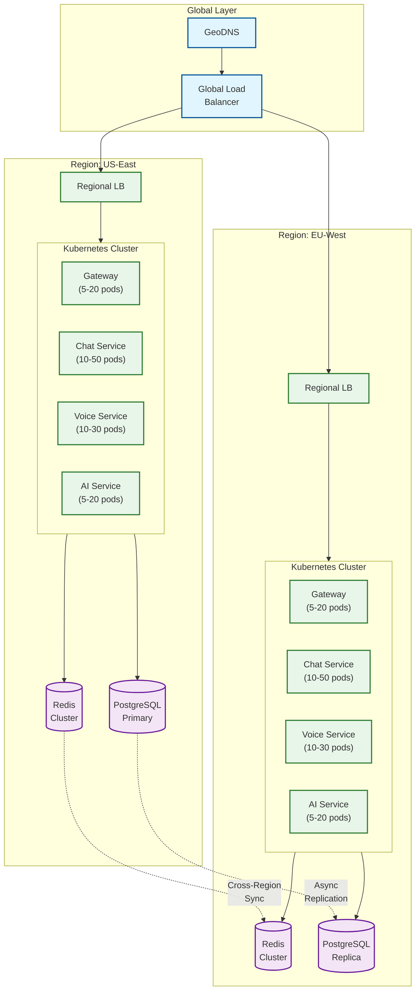
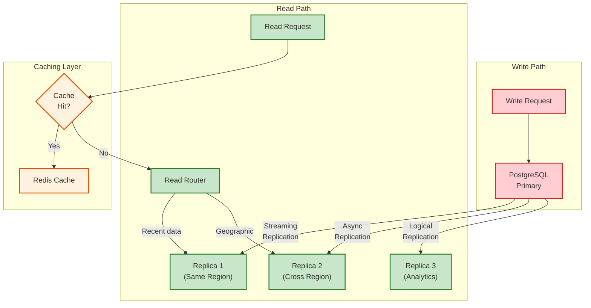
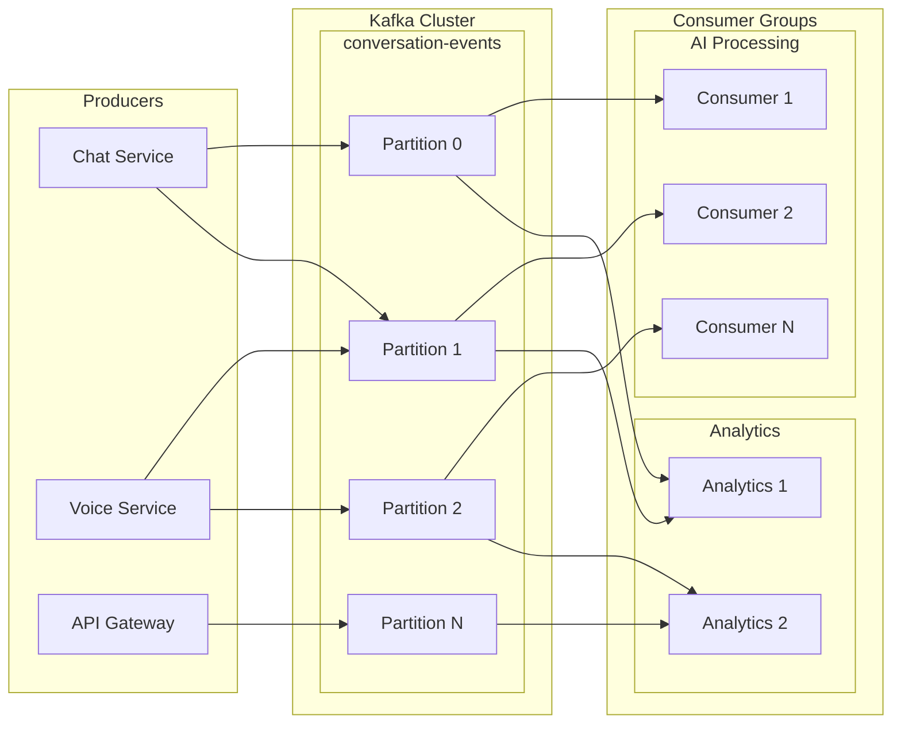
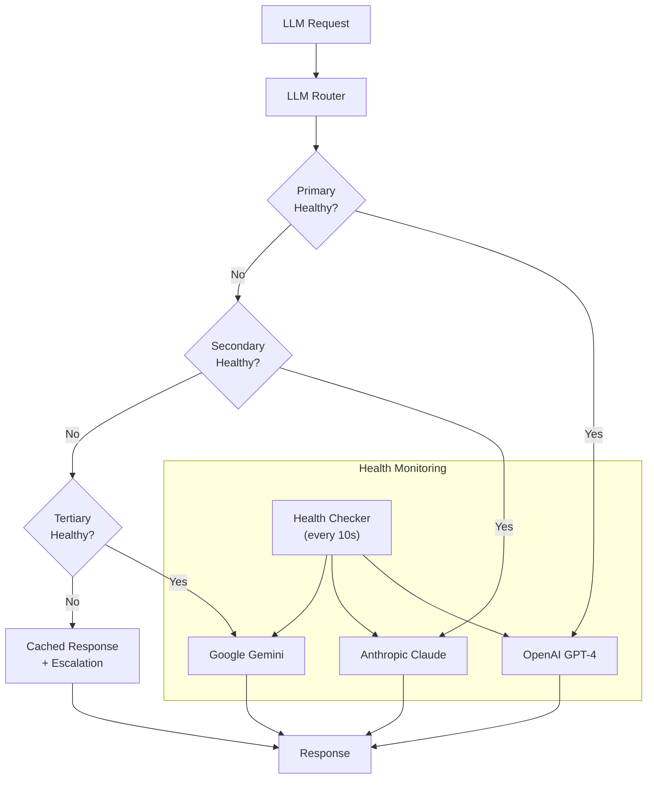
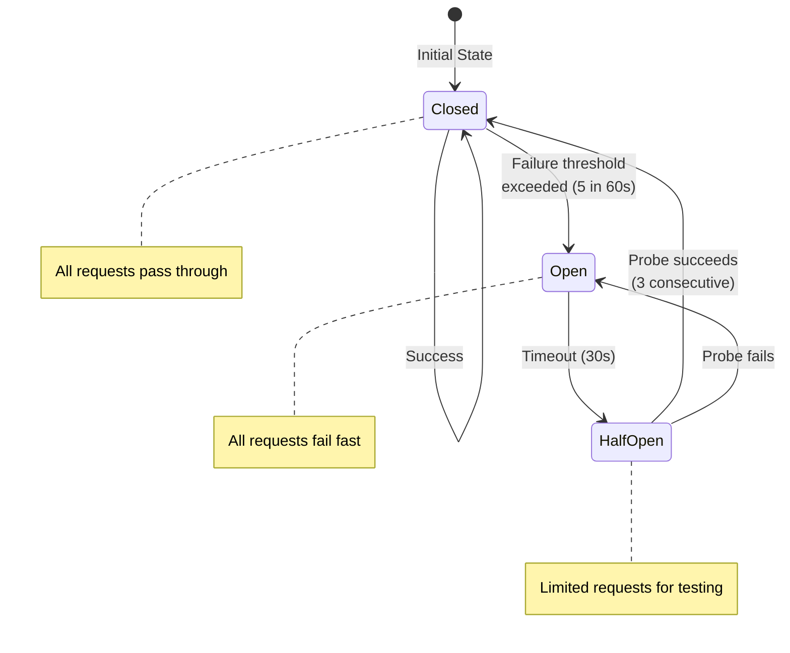
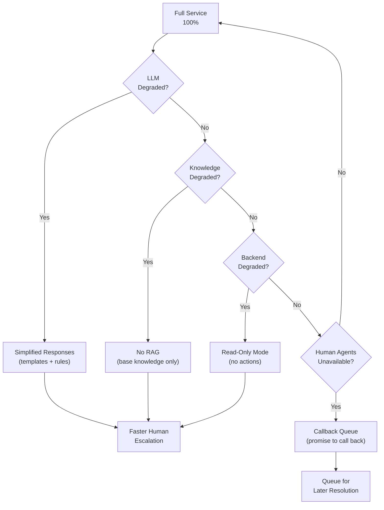
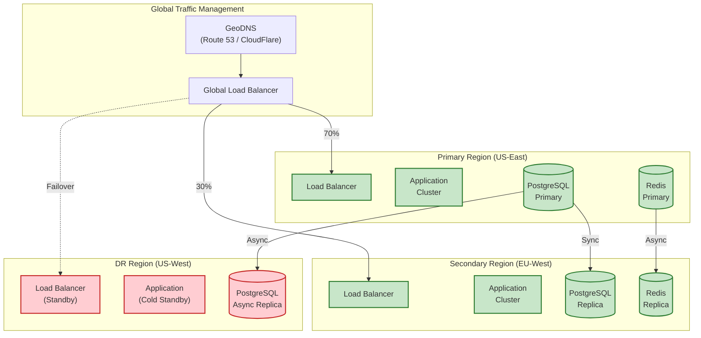

# Scalability & Reliability

## Scalability Strategy

### Horizontal Scaling Architecture



### Service Scaling Characteristics

| Service | Scaling Trigger | Min Pods | Max Pods | Scale Speed |
|---------|-----------------|----------|----------|-------------|
| **Gateway** | CPU > 70%, QPS | 5 | 50 | Fast (30s) |
| **Chat Service** | Active sessions | 10 | 100 | Medium (60s) |
| **Voice Service** | Concurrent calls | 10 | 50 | Fast (30s) |
| **AI Service** | Queue depth, latency | 5 | 30 | Slow (120s) |
| **HITL Service** | Queue size | 3 | 20 | Medium (60s) |
| **Embedding Service** | Queue depth | 3 | 15 | Slow (120s) |

### Auto-Scaling Configuration

```yaml
# Horizontal Pod Autoscaler for Chat Service
apiVersion: autoscaling/v2
kind: HorizontalPodAutoscaler
metadata:
  name: chat-service-hpa
spec:
  scaleTargetRef:
    apiVersion: apps/v1
    kind: Deployment
    name: chat-service
  minReplicas: 10
  maxReplicas: 100
  metrics:
    # Scale on active WebSocket connections
    - type: Pods
      pods:
        metric:
          name: active_sessions
        target:
          type: AverageValue
          averageValue: "100"  # 100 sessions per pod
    # Scale on CPU
    - type: Resource
      resource:
        name: cpu
        target:
          type: Utilization
          averageUtilization: 70
    # Scale on memory
    - type: Resource
      resource:
        name: memory
        target:
          type: Utilization
          averageUtilization: 80
  behavior:
    scaleUp:
      stabilizationWindowSeconds: 30
      policies:
        - type: Percent
          value: 50
          periodSeconds: 60
    scaleDown:
      stabilizationWindowSeconds: 300
      policies:
        - type: Percent
          value: 10
          periodSeconds: 60
```

### Database Scaling Strategy



**Read Scaling:**
- 3+ read replicas for read-heavy workloads
- Geographic replicas for latency reduction
- Connection pooling (PgBouncer) for connection management
- Read routing based on query type and freshness requirements

**Write Scaling:**
- Vertical scaling of primary (up to 64 vCPUs, 256GB RAM)
- Sharding by tenant_id for multi-tenant deployments
- Write batching for high-throughput events
- Async writes for non-critical data (analytics, logs)

### Caching Strategy

| Cache Layer | Technology | TTL | Use Case |
|-------------|------------|-----|----------|
| **L1: Pod Memory** | In-process | 60s | Hot session state |
| **L2: Redis Local** | Redis Cluster | 5m | Session state, rate limits |
| **L3: Redis Global** | Redis with replication | 30m | Customer profiles, knowledge |
| **L4: CDN** | CloudFlare/Fastly | 24h | Static assets, widget code |

```yaml
# Cache Configuration
cache_config:
  session_state:
    l1_enabled: true
    l1_ttl: 60
    l2_enabled: true
    l2_ttl: 1800  # 30 minutes
    write_through: true

  customer_profile:
    l1_enabled: false
    l2_enabled: true
    l2_ttl: 300  # 5 minutes
    invalidation: "event_based"

  knowledge_base:
    l1_enabled: false
    l2_enabled: true
    l2_ttl: 3600  # 1 hour
    warming: "scheduled"

  llm_responses:
    l1_enabled: false
    l2_enabled: true
    l2_ttl: 86400  # 24 hours
    key_strategy: "content_hash"
```

### Message Queue Scaling



**Kafka Configuration:**
```yaml
# Topic: conversation-events
partitions: 24  # Scale with consumers
replication_factor: 3
min_insync_replicas: 2

# Partition key: conversation_id
# Ensures message ordering per conversation

# Consumer group: ai-processing
consumers: 12  # Match partitions / 2
auto_offset_reset: latest
enable_auto_commit: false  # Manual commit for exactly-once

# Consumer group: analytics
consumers: 4
auto_offset_reset: earliest
```

---

## Reliability & Fault Tolerance

### Single Points of Failure (SPOF) Analysis

| Component | SPOF Risk | Mitigation | Recovery Time |
|-----------|-----------|------------|---------------|
| **API Gateway** | Medium | Multi-pod, multi-AZ | < 30s (failover) |
| **Database Primary** | High | Streaming replication + auto-failover | < 60s |
| **Redis Cluster** | Medium | Cluster mode, multi-AZ | < 30s |
| **Kafka** | Medium | Multi-broker, replication | < 60s |
| **LLM API** | High | Multi-provider fallback | < 5s (fallback) |
| **Voice Gateway** | Medium | Multiple SIP trunks | < 30s |
| **DNS** | Low | Multiple providers | < 5min (propagation) |

### LLM Provider Failover



**Failover Logic:**
```
ALGORITHM: LLM Request with Failover
INPUT: prompt, model_preference
OUTPUT: response

providers = [
  {name: "openai", model: "gpt-4", weight: 0.7, healthy: true},
  {name: "anthropic", model: "claude-3", weight: 0.2, healthy: true},
  {name: "google", model: "gemini-pro", weight: 0.1, healthy: true}
]

1. SELECT primary provider based on weight + health
2. TRY request with timeout (5s for intent, 30s for generation)
3. IF success: RETURN response
4. IF failure (timeout, rate limit, error):
   - Mark provider unhealthy (30s cooldown)
   - SELECT next healthy provider
   - RETRY
5. IF all providers fail:
   - Check response cache
   - IF cache hit: RETURN cached response
   - ELSE: Escalate to human with apology message

Health Recovery:
- Probe unhealthy providers every 10s
- 3 consecutive successes → mark healthy
- Circuit breaker: Open after 5 failures in 60s
```

### Circuit Breaker Pattern



**Implementation:**
```yaml
circuit_breaker:
  crm_service:
    failure_threshold: 5
    failure_window_seconds: 60
    open_timeout_seconds: 30
    half_open_max_requests: 3
    success_threshold: 3

  llm_service:
    failure_threshold: 3
    failure_window_seconds: 30
    open_timeout_seconds: 15
    half_open_max_requests: 2
    success_threshold: 2

  payment_service:
    failure_threshold: 2
    failure_window_seconds: 60
    open_timeout_seconds: 60
    half_open_max_requests: 1
    success_threshold: 3
```

### Retry Strategy

| Service | Max Retries | Backoff | Timeout | Idempotent |
|---------|-------------|---------|---------|------------|
| **LLM API** | 3 | Exponential (1s, 2s, 4s) | 30s | Yes |
| **CRM Read** | 2 | Linear (500ms) | 5s | Yes |
| **CRM Write** | 1 | None | 10s | No (idempotency key) |
| **Payment** | 0 | None | 30s | No (manual retry) |
| **Knowledge Retrieval** | 2 | Linear (200ms) | 3s | Yes |
| **Email Send** | 3 | Exponential (1s, 5s, 30s) | 60s | Yes (dedup key) |

### Graceful Degradation



**Degradation Levels:**

| Level | Trigger | Behavior | User Impact |
|-------|---------|----------|-------------|
| **L0: Normal** | All systems healthy | Full autonomous capability | None |
| **L1: LLM Degraded** | LLM latency > 5s or errors | Template responses, faster escalation | Slower, less natural |
| **L2: Knowledge Degraded** | Vector DB down | Base knowledge only, no RAG | Less accurate answers |
| **L3: Backend Degraded** | CRM/ERP errors | Read-only, no actions | Information only |
| **L4: Partial Outage** | Multiple systems down | Human-only mode | Long wait times |
| **L5: Full Outage** | Platform down | Callback queue | Service unavailable |

---

## Disaster Recovery

### Recovery Objectives

| Scenario | RTO | RPO | Strategy |
|----------|-----|-----|----------|
| **Single Pod Failure** | < 30s | 0 | Kubernetes self-healing |
| **Single AZ Failure** | < 2min | 0 | Multi-AZ deployment |
| **Database Failure** | < 5min | < 1min | Streaming replication + failover |
| **Region Failure** | < 15min | < 5min | Cross-region failover |
| **Complete Outage** | < 1hr | < 15min | DR site activation |

### Multi-Region Architecture



### Failover Procedure

```
RUNBOOK: Regional Failover

TRIGGER: Primary region unavailable for > 5 minutes

PRE-CHECKS:
1. Verify primary region is truly unavailable (not false alarm)
2. Check secondary region health
3. Verify database replica lag (must be < 30s)
4. Notify on-call team

EXECUTION:
1. Update GeoDNS to route 100% traffic to secondary
   - DNS TTL is 60s, propagation takes ~5 minutes

2. Promote secondary database to primary
   - Run: pg_ctl promote -D /var/lib/postgresql/data
   - Verify write capability

3. Update application config to use new primary
   - Deploy config change via Kubernetes ConfigMap

4. Scale secondary region to handle full load
   - Increase pod counts to match primary region sizing

5. Notify customers of potential brief service degradation

POST-FAILOVER:
1. Monitor secondary region metrics closely
2. Begin investigation of primary region failure
3. Plan failback procedure once primary is recovered

FAILBACK (when primary recovered):
1. Resync data from secondary (now primary) to original primary
2. Verify data consistency
3. Gradually shift traffic back (10% → 50% → 100%)
4. Demote secondary back to replica role
```

### Backup Strategy

| Data Type | Frequency | Retention | Storage |
|-----------|-----------|-----------|---------|
| **Database (full)** | Daily | 30 days | Cross-region object storage |
| **Database (incremental)** | Hourly | 7 days | Same region object storage |
| **Database (WAL)** | Continuous | 7 days | Streaming to archive |
| **Redis (RDB)** | Hourly | 3 days | Object storage |
| **Conversation Exports** | Real-time | 7 years | Cold storage (compliance) |
| **Model Artifacts** | On change | Forever | Versioned object storage |
| **Configuration** | On change | Forever | Git repository |

### Data Integrity Checks

```yaml
integrity_checks:
  daily:
    - name: "conversation_count_match"
      query: |
        SELECT COUNT(*) FROM conversations
        WHERE DATE(created_at) = CURRENT_DATE - 1
      compare_with: "analytics.daily_conversations"

    - name: "message_sequence_gaps"
      query: |
        SELECT conversation_id, MAX(sequence_number) - COUNT(*) as gaps
        FROM messages
        GROUP BY conversation_id
        HAVING MAX(sequence_number) - COUNT(*) > 0

    - name: "orphaned_messages"
      query: |
        SELECT COUNT(*) FROM messages m
        LEFT JOIN conversations c ON m.conversation_id = c.conversation_id
        WHERE c.conversation_id IS NULL

  weekly:
    - name: "action_result_consistency"
      description: "Verify all actions have logged results"

    - name: "customer_profile_sync"
      description: "Verify customer data matches CRM"

alerts:
  - condition: "any check fails"
    severity: "warning"
    channel: "#data-integrity"

  - condition: "orphaned_messages > 0"
    severity: "critical"
    channel: "#on-call"
```
