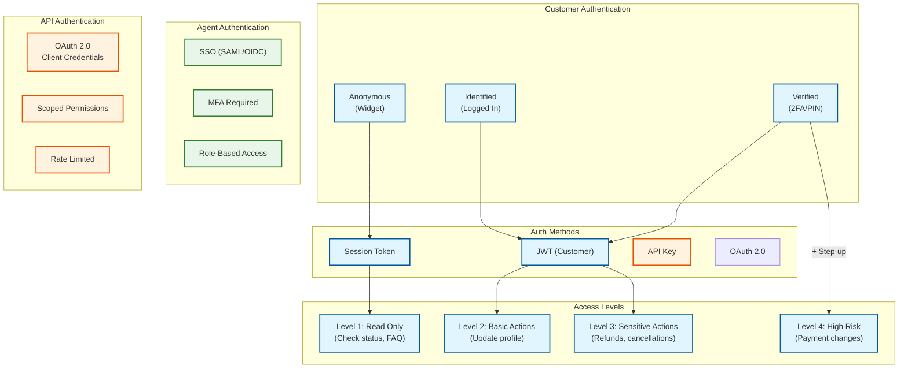
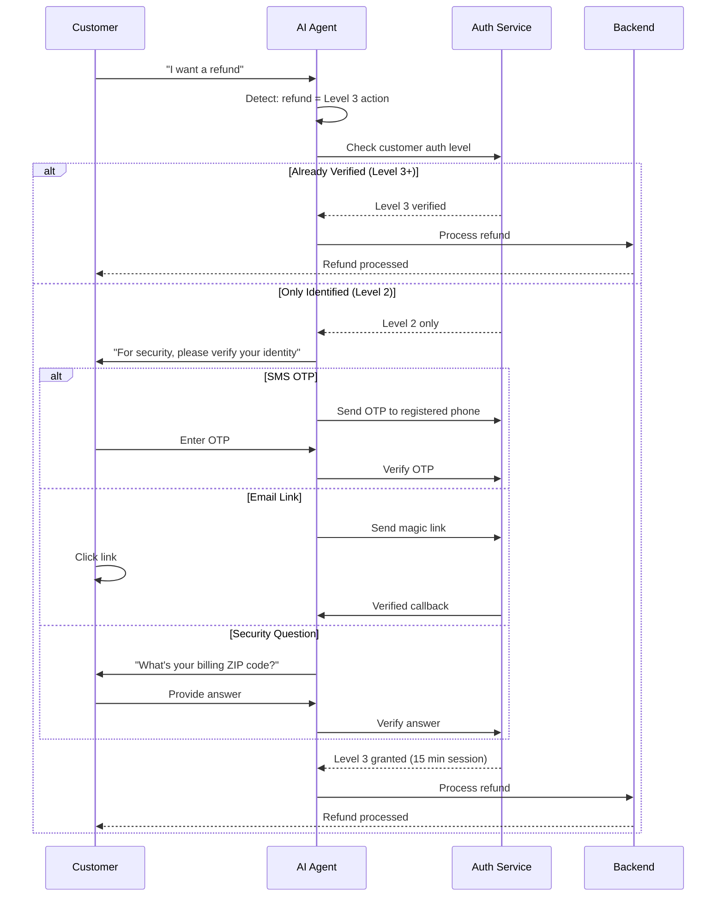
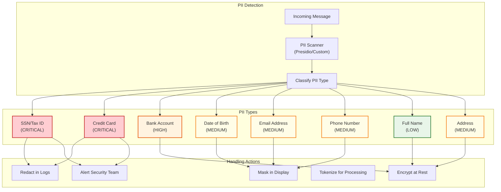
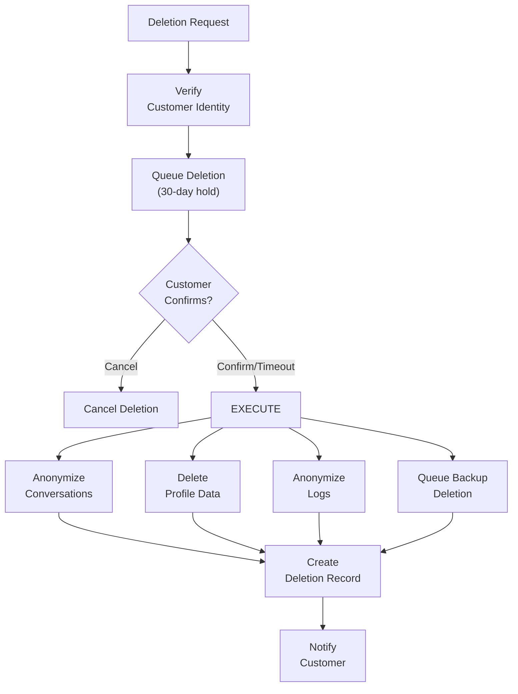

# Security & Compliance

## Authentication & Authorization

### Authentication Architecture



### Step-Up Authentication for Sensitive Actions



### Authorization Model (RBAC + ABAC)

**Role Definitions:**

| Role | Description | Permissions |
|------|-------------|-------------|
| **customer** | End customer | Read own data, initiate support |
| **customer_verified** | Verified customer | + Sensitive actions |
| **support_agent_l1** | Tier 1 support | Read customer data, resolve simple issues |
| **support_agent_l2** | Tier 2 support | + Refunds, cancellations, account changes |
| **support_supervisor** | Team lead | + Override actions, view all conversations |
| **admin** | Platform admin | Full access, configuration |
| **api_readonly** | API integration | Read-only programmatic access |
| **api_full** | API integration | Full programmatic access |

**Attribute-Based Rules:**

```yaml
authorization_rules:
  - name: "customer_own_data"
    effect: "allow"
    resource: "conversations"
    action: ["read", "create"]
    condition:
      customer_id: "${subject.customer_id}"

  - name: "refund_limit"
    effect: "allow"
    resource: "actions.refund"
    action: "execute"
    condition:
      amount_usd: "<= 500"
      customer_verified: true
      consecutive_refunds: "<= 2 in 30 days"

  - name: "high_value_refund"
    effect: "allow"
    resource: "actions.refund"
    action: "execute"
    condition:
      amount_usd: "> 500"
      approver_role: "support_supervisor"

  - name: "agent_jurisdiction"
    effect: "allow"
    resource: "conversations"
    action: "handle"
    condition:
      customer_region: "${subject.agent_region}"
      OR:
        - conversation_escalated: true
        - agent_role: "support_supervisor"
```

---

## Data Security

### PII Detection & Handling



**PII Detection Patterns:**

```yaml
pii_patterns:
  ssn:
    regex: '\b\d{3}-\d{2}-\d{4}\b'
    action: "redact"
    replacement: "[SSN REDACTED]"
    log_level: "critical"

  credit_card:
    regex: '\b(?:\d{4}[-\s]?){3}\d{4}\b'
    action: "redact"
    replacement: "[CARD REDACTED]"
    log_level: "critical"
    additional_check: "luhn_checksum"

  email:
    regex: '\b[A-Za-z0-9._%+-]+@[A-Za-z0-9.-]+\.[A-Z|a-z]{2,}\b'
    action: "mask"
    replacement: "j***@***.com"
    log_level: "info"

  phone:
    regex: '\b(?:\+?1[-.\s]?)?(?:\(?\d{3}\)?[-.\s]?)?\d{3}[-.\s]?\d{4}\b'
    action: "mask"
    replacement: "***-***-1234"
    log_level: "info"

  # Entity-based detection (NER model)
  person_name:
    model: "presidio_ner"
    entity_type: "PERSON"
    action: "encrypt"
    log_level: "info"
```

### Encryption Strategy

| Data State | Method | Key Management |
|------------|--------|----------------|
| **At Rest (Database)** | AES-256-GCM | Cloud KMS |
| **At Rest (Object Storage)** | Server-side encryption | Cloud KMS |
| **In Transit** | TLS 1.3 | Certificate rotation |
| **In Memory (Sensitive)** | Encrypted in process | Vault transit |
| **Backups** | AES-256 | Separate backup keys |
| **LLM Prompts** | Tokenization | N/A (no PII sent) |

**Field-Level Encryption:**

```sql
-- Encrypted columns in customer table
CREATE TABLE customers (
    customer_id UUID PRIMARY KEY,
    email_encrypted BYTEA,  -- Encrypted with customer key
    phone_encrypted BYTEA,  -- Encrypted with customer key
    email_hash VARCHAR(64), -- For lookup (SHA-256)
    tier VARCHAR(20),       -- Not sensitive
    created_at TIMESTAMPTZ
);

-- Encryption function
CREATE OR REPLACE FUNCTION encrypt_pii(value TEXT, key_id TEXT)
RETURNS BYTEA AS $$
DECLARE
    key BYTEA;
BEGIN
    key := get_encryption_key(key_id);
    RETURN pgp_sym_encrypt(value, key);
END;
$$ LANGUAGE plpgsql SECURITY DEFINER;
```

---

## AI Guardrails for Autonomous Actions

### Guardrail Architecture

```mermaid
flowchart TB
    subgraph Input["Input Guardrails"]
        INP_MSG["Customer Message"]
        INP_TOXIC["Toxicity Filter"]
        INP_INJECT["Prompt Injection<br/>Detection"]
        INP_PII["PII Redaction"]
    end

    subgraph Processing["Processing Guardrails"]
        AI["AI Agent"]
        SCOPE["Scope Limiter<br/>(allowed intents)"]
        FACT["Fact Checker<br/>(hallucination)"]
        POLICY["Policy Checker<br/>(business rules)"]
    end

    subgraph Action["Action Guardrails"]
        ACT_VALIDATE["Parameter<br/>Validation"]
        ACT_LIMIT["Rate/Amount<br/>Limits"]
        ACT_APPROVE["Approval<br/>Workflow"]
        ACT_AUDIT["Audit Logging"]
    end

    subgraph Output["Output Guardrails"]
        OUT_TOXIC["Response Toxicity"]
        OUT_PII["PII Leakage"]
        OUT_BRAND["Brand/Tone Check"]
        OUT_LEGAL["Legal Compliance"]
    end

    INP_MSG --> INP_TOXIC --> INP_INJECT --> INP_PII --> AI
    AI --> SCOPE --> FACT --> POLICY
    POLICY --> ACT_VALIDATE --> ACT_LIMIT --> ACT_APPROVE --> ACT_AUDIT
    ACT_AUDIT --> OUT_TOXIC --> OUT_PII --> OUT_BRAND --> OUT_LEGAL --> RESPONSE["Response"]

    classDef input fill:#e1f5fe,stroke:#01579b,stroke-width:2px
    classDef process fill:#e8f5e9,stroke:#2e7d32,stroke-width:2px
    classDef action fill:#fff3e0,stroke:#e65100,stroke-width:2px
    classDef output fill:#f3e5f5,stroke:#6a1b9a,stroke-width:2px

    class INP_MSG,INP_TOXIC,INP_INJECT,INP_PII input
    class AI,SCOPE,FACT,POLICY process
    class ACT_VALIDATE,ACT_LIMIT,ACT_APPROVE,ACT_AUDIT action
    class OUT_TOXIC,OUT_PII,OUT_BRAND,OUT_LEGAL output
```



### Prompt Injection Prevention

```yaml
prompt_injection_rules:
  # Pattern-based detection
  patterns:
    - name: "ignore_instructions"
      regex: "(?i)(ignore|disregard|forget).*(?:previous|above|instructions)"
      action: "block"
      severity: "high"

    - name: "role_override"
      regex: "(?i)(you are|act as|pretend to be|roleplay as)"
      action: "flag"
      severity: "medium"

    - name: "system_prompt_extraction"
      regex: "(?i)(show|reveal|display|print).*(?:system|instructions|prompt)"
      action: "block"
      severity: "high"

    - name: "delimiter_injection"
      regex: "```|<\|.*\|>|<<.*>>|\[INST\]"
      action: "sanitize"
      severity: "medium"

  # Semantic detection (ML model)
  semantic_check:
    enabled: true
    model: "injection_classifier_v2"
    threshold: 0.85
    action: "block"

  # Response to blocked injections
  blocked_response: "I'm here to help with customer service questions. How can I assist you today?"
```

### Action Limits and Approvals

```yaml
action_limits:
  refund:
    # Automatic limits
    auto_approve_limit_usd: 100
    auto_approve_limit_per_day: 500
    auto_approve_count_per_day: 3

    # Requires human approval
    human_approval_threshold_usd: 500
    human_approval_always:
      - customer_lifetime_value < 100
      - account_age_days < 30
      - consecutive_refunds >= 2

    # Hard limits (even with approval)
    max_single_refund_usd: 10000
    max_daily_per_customer_usd: 5000

  account_change:
    # Email/phone change requires verification
    require_verification: true
    verification_methods: ["sms_otp", "email_link"]
    cooldown_hours: 24

  subscription:
    # Cancellation limits
    require_reason: true
    offer_retention: true
    retention_discount_max_percent: 30

  payment_method:
    # Always requires human
    auto_approve: false
    require_supervisor: true
```

### Sensitive Topic Routing

```yaml
sensitive_topics:
  immediate_escalation:
    - "suicide"
    - "self-harm"
    - "abuse"
    - "threat"
    - "emergency"
    response: "I'm concerned about what you've shared. Let me connect you with someone who can help right away."
    action: "escalate_urgent"
    notify: "supervisor"

  careful_handling:
    - "legal"
    - "lawsuit"
    - "attorney"
    - "discrimination"
    response: "I understand this is a serious matter. Let me connect you with a specialist who can help."
    action: "escalate_priority"
    skills: ["legal_escalation"]

  competitor_mentions:
    - "{competitor_name}"
    response: null  # Don't acknowledge
    action: "continue_normal"
    log: true

  profanity:
    threshold: "moderate"  # Allow mild, flag heavy
    action: "warn_and_continue"
    escalate_after: 2
```

---

## Compliance

### GDPR Compliance

| Requirement | Implementation |
|-------------|----------------|
| **Right to Access** | Export API for customer data |
| **Right to Rectification** | Update profile API |
| **Right to Erasure** | Anonymization pipeline |
| **Data Portability** | JSON/CSV export |
| **Consent Management** | Opt-in/opt-out tracking |
| **Data Minimization** | Auto-delete after retention period |
| **Purpose Limitation** | Strict data access controls |
| **Processing Records** | Audit logs for all operations |

**Data Deletion Pipeline:**



**Anonymization Strategy:**

```yaml
anonymization:
  conversations:
    # Replace customer identifiers with anonymous tokens
    customer_id: "anon_[hash]"
    customer_name: "Customer"
    email: "[REDACTED]"
    phone: "[REDACTED]"

    # Keep for analytics but anonymize
    retain_fields:
      - intent_name
      - sentiment_score
      - resolution_type
      - created_at (date only, no time)

  messages:
    # Anonymize content
    redact_patterns:
      - names
      - addresses
      - order_numbers
      - account_numbers

    # Replace with placeholders
    content: "[ANONYMIZED MESSAGE]"  # Or fully delete based on policy

  audit_logs:
    # Legal requirement: retain for 7 years
    anonymize_after_years: 3
    delete_after_years: 7
```

### HIPAA Compliance (Healthcare Use Cases)

| Requirement | Implementation |
|-------------|----------------|
| **PHI Protection** | Encryption at rest and in transit |
| **Access Controls** | Role-based access, minimum necessary |
| **Audit Trails** | Immutable logs of PHI access |
| **BAA** | Business Associate Agreements with vendors |
| **Breach Notification** | 60-day notification process |
| **Training** | Annual HIPAA training for agents |

**PHI Detection and Handling:**

```yaml
phi_detection:
  categories:
    - patient_name
    - date_of_birth
    - social_security
    - medical_record_number
    - health_plan_number
    - diagnosis_codes
    - prescription_information
    - lab_results

  handling:
    # Never send to LLM
    llm_policy: "tokenize_or_remove"

    # Encrypt in storage
    storage_policy: "field_level_encryption"

    # Strict logging
    log_policy: "never_log_content"

  llm_guardrails:
    # Additional prompting for healthcare
    system_prompt_addition: |
      CRITICAL: Never request, store, or repeat any Protected Health Information (PHI).
      If a customer shares medical information, acknowledge it generally without repeating specifics.
      Example: Instead of "I see you have diabetes medication", say "I see you have a prescription concern".
```

### SOC 2 Compliance

| Trust Principle | Controls |
|----------------|----------|
| **Security** | Encryption, access controls, vulnerability management |
| **Availability** | Redundancy, monitoring, incident response |
| **Processing Integrity** | Input validation, error handling, audit trails |
| **Confidentiality** | Data classification, access restrictions, encryption |
| **Privacy** | Consent, data minimization, retention policies |

---

## Threat Model

### Attack Surface

```mermaid
flowchart TB
    subgraph External["External Threats"]
        T1["Prompt Injection<br/>(Manipulate AI)"]
        T2["Data Exfiltration<br/>(Extract PII via AI)"]
        T3["Account Takeover<br/>(Impersonation)"]
        T4["DDoS<br/>(Availability)"]
        T5["Social Engineering<br/>(Manipulate Agents)"]
    end

    subgraph Internal["Internal Threats"]
        T6["Insider Threat<br/>(Agent abuse)"]
        T7["Misconfiguration<br/>(Exposed data)"]
        T8["Supply Chain<br/>(Compromised LLM)"]
    end

    subgraph AISpecific["AI-Specific Threats"]
        T9["Model Poisoning<br/>(Training data)"]
        T10["Jailbreaking<br/>(Bypass guardrails)"]
        T11["Hallucination Exploit<br/>(False information)"]
    end

    T1 --> MITIGATE1["Input Sanitization<br/>Injection Detection"]
    T2 --> MITIGATE2["Output Filtering<br/>PII Detection"]
    T3 --> MITIGATE3["Step-up Auth<br/>Behavioral Analysis"]
    T4 --> MITIGATE4["Rate Limiting<br/>WAF/CDN"]
    T5 --> MITIGATE5["Agent Training<br/>Verification Protocols"]
    T6 --> MITIGATE6["Least Privilege<br/>Activity Monitoring"]
    T7 --> MITIGATE7["Config Scanning<br/>Security Reviews"]
    T8 --> MITIGATE8["Vendor Assessment<br/>Output Validation"]
    T9 --> MITIGATE9["Training Data Review<br/>Model Monitoring"]
    T10 --> MITIGATE10["Multi-layer Guardrails<br/>Behavioral Limits"]
    T11 --> MITIGATE11["Fact Checking<br/>Source Citation"]
```



### Top Threats and Mitigations

| Threat | Likelihood | Impact | Mitigation | Residual Risk |
|--------|------------|--------|------------|---------------|
| **Prompt Injection** | High | High | Multi-layer detection, input sanitization | Medium |
| **PII Exfiltration** | Medium | Critical | Output filtering, never send PII to LLM | Low |
| **Account Takeover** | Medium | High | Step-up auth, behavioral analysis | Low |
| **Unauthorized Actions** | Medium | High | Action limits, approval workflows | Low |
| **AI Jailbreaking** | High | Medium | Guardrails, behavioral constraints | Medium |
| **Social Engineering** | Medium | Medium | Verification protocols, training | Medium |
| **Hallucination** | High | Medium | Fact checking, knowledge grounding | Medium |
| **DDoS** | High | Medium | Rate limiting, WAF, auto-scaling | Low |

### Security Monitoring

```yaml
security_monitoring:
  real_time_alerts:
    - name: "prompt_injection_attempt"
      condition: "injection_detection.blocked > 5 in 5 minutes"
      severity: "high"
      action: "block_session, notify_security"

    - name: "unusual_data_access"
      condition: "customer_profile_queries > 100 in 1 hour by same agent"
      severity: "medium"
      action: "flag_for_review"

    - name: "high_value_actions"
      condition: "refund_total > 10000 in 1 hour"
      severity: "medium"
      action: "notify_supervisor"

    - name: "failed_auth_spike"
      condition: "auth_failures > 50 in 5 minutes from same IP"
      severity: "high"
      action: "block_ip, notify_security"

  daily_review:
    - "All actions over $500"
    - "All escalations to supervisor"
    - "All guardrail triggers"
    - "Unusual conversation patterns"

  weekly_audit:
    - "Access control reviews"
    - "Permission changes"
    - "New integrations"
    - "Model behavior changes"
```
