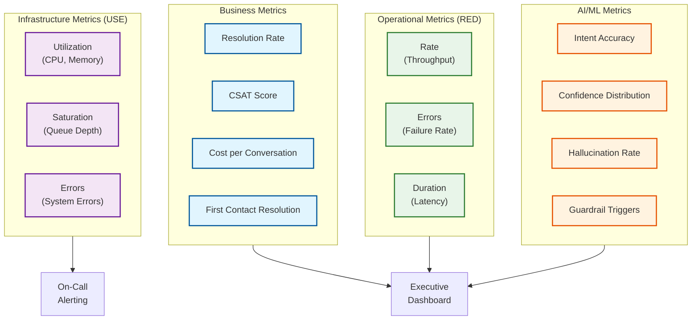
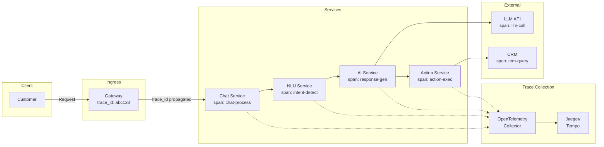

# Observability

## Metrics Strategy

### Key Metrics Overview



### Business Metrics

| Metric | Description | Target | Alert Threshold |
|--------|-------------|--------|-----------------|
| **Autonomous Resolution Rate** | % resolved without human | > 65% | < 55% |
| **First Contact Resolution** | % resolved in first conversation | > 70% | < 60% |
| **Customer Satisfaction (CSAT)** | Average rating (1-5) | > 4.2 | < 3.8 |
| **Net Promoter Score (NPS)** | Likelihood to recommend | > 30 | < 10 |
| **Cost per Conversation** | Total cost / conversations | < $3 | > $5 |
| **Average Handle Time** | Time to resolution | < 5 min | > 10 min |
| **Human Escalation Rate** | % escalated to human | < 30% | > 40% |
| **Conversation Abandonment** | % customers who leave | < 5% | > 10% |

### Operational Metrics (RED Method)

**Rate (Throughput):**

| Metric | Description | Measurement |
|--------|-------------|-------------|
| `conversations_started_total` | New conversations | Counter |
| `messages_received_total` | Customer messages | Counter |
| `messages_sent_total` | AI/Agent responses | Counter |
| `actions_executed_total` | Backend actions | Counter |
| `handoffs_initiated_total` | Escalations | Counter |

**Errors:**

| Metric | Description | Measurement |
|--------|-------------|-------------|
| `intent_detection_errors_total` | Failed intent classification | Counter by error_type |
| `action_execution_failures_total` | Failed backend actions | Counter by action_type |
| `llm_request_errors_total` | LLM API failures | Counter by provider |
| `handoff_failures_total` | Failed escalations | Counter |
| `guardrail_blocks_total` | Blocked by guardrails | Counter by rule |

**Duration (Latency):**

| Metric | Description | Buckets |
|--------|-------------|---------|
| `response_latency_seconds` | End-to-end response time | 0.1, 0.25, 0.5, 1, 2, 5, 10 |
| `intent_detection_latency_seconds` | Intent classification | 0.01, 0.05, 0.1, 0.25, 0.5 |
| `llm_request_latency_seconds` | LLM API call | 0.1, 0.5, 1, 2, 5, 10 |
| `action_execution_latency_seconds` | Backend action | 0.1, 0.5, 1, 2, 5 |
| `knowledge_retrieval_latency_seconds` | RAG retrieval | 0.05, 0.1, 0.25, 0.5, 1 |

### AI/ML Metrics

| Metric | Description | Target | Alert |
|--------|-------------|--------|-------|
| `intent_accuracy` | Correct classifications | > 95% | < 90% |
| `intent_confidence_mean` | Average confidence score | > 0.85 | < 0.75 |
| `intent_confidence_p50` | Median confidence | > 0.90 | < 0.80 |
| `low_confidence_rate` | % below threshold | < 15% | > 25% |
| `entity_extraction_accuracy` | Correct entity extraction | > 92% | < 85% |
| `hallucination_detected_rate` | % flagged as hallucination | < 2% | > 5% |
| `guardrail_trigger_rate` | % blocked/modified | < 5% | > 10% |
| `sentiment_accuracy` | Sentiment classification | > 90% | < 85% |

### Infrastructure Metrics (USE Method)

**Utilization:**

| Resource | Warning | Critical |
|----------|---------|----------|
| CPU per pod | > 70% | > 85% |
| Memory per pod | > 75% | > 90% |
| GPU utilization | > 80% | > 95% |
| Redis memory | > 70% | > 85% |
| PostgreSQL connections | > 70% | > 85% |

**Saturation:**

| Metric | Warning | Critical |
|--------|---------|----------|
| Kafka consumer lag | > 1000 | > 10000 |
| Request queue depth | > 100 | > 500 |
| WebSocket connections/pod | > 1000 | > 2000 |
| DB query queue | > 50 | > 200 |

---

## Distributed Tracing

### Trace Architecture



### Span Structure

```yaml
# Example conversation trace
trace:
  trace_id: "abc123def456"
  spans:
    - span_id: "root"
      operation: "conversation.message"
      service: "gateway"
      duration_ms: 1250
      tags:
        conversation_id: "conv-12345"
        customer_id: "cust-11111"
        channel: "web_chat"
        message_length: 45

    - span_id: "span-1"
      parent_id: "root"
      operation: "nlu.intent_detection"
      service: "nlu-service"
      duration_ms: 85
      tags:
        intent: "cancel_order"
        confidence: 0.94
        model_version: "intent-v3.2"

    - span_id: "span-2"
      parent_id: "root"
      operation: "knowledge.retrieval"
      service: "knowledge-service"
      duration_ms: 120
      tags:
        query: "order cancellation policy"
        results_count: 5
        top_score: 0.89

    - span_id: "span-3"
      parent_id: "root"
      operation: "llm.completion"
      service: "ai-service"
      duration_ms: 850
      tags:
        provider: "openai"
        model: "gpt-4"
        prompt_tokens: 450
        completion_tokens: 85
        temperature: 0.3

    - span_id: "span-4"
      parent_id: "root"
      operation: "action.execute"
      service: "action-service"
      duration_ms: 180
      tags:
        action_type: "cancel_order"
        target_system: "erp"
        status: "success"
```

### Conversation-Level Tracing

```yaml
# Extended trace for full conversation
conversation_trace:
  conversation_id: "conv-12345"
  customer_id: "cust-11111"
  channel: "web_chat"
  started_at: "2026-01-15T10:20:00Z"
  ended_at: "2026-01-15T10:25:00Z"

  # Message-level traces
  messages:
    - sequence: 1
      direction: "inbound"
      trace_id: "trace-001"
      content_hash: "sha256:..."
      intent: "greeting"

    - sequence: 2
      direction: "outbound"
      trace_id: "trace-001"
      response_type: "greeting"

    - sequence: 3
      direction: "inbound"
      trace_id: "trace-002"
      intent: "cancel_order"
      entities: ["order_id: ORD-99999"]

    # ... more messages

  # Aggregated metrics
  metrics:
    total_messages: 8
    total_latency_ms: 4500
    avg_response_latency_ms: 562
    intent_changes: 2
    action_count: 1
    escalated: false

  # Linked resources
  links:
    - type: "action"
      id: "act-33333"
      trace_id: "trace-004"
    - type: "feedback"
      id: "fb-44444"
```

---

## Logging Strategy

### Log Levels and Content

| Level | Use Case | Example |
|-------|----------|---------|
| **ERROR** | Failures requiring attention | LLM timeout, action failure, DB error |
| **WARN** | Degraded performance, near-limits | High latency, retry success, approaching quota |
| **INFO** | Significant business events | Conversation started, action executed, handoff |
| **DEBUG** | Detailed debugging info | Intent scores, prompt content (redacted), state |
| **TRACE** | Very detailed, high volume | Every function call, full payloads |

### Structured Log Format

```json
{
  "timestamp": "2026-01-15T10:25:00.123Z",
  "level": "INFO",
  "service": "ai-service",
  "trace_id": "abc123def456",
  "span_id": "span-3",
  "conversation_id": "conv-12345",
  "customer_id": "cust-11111",
  "event": "llm_request_completed",
  "data": {
    "provider": "openai",
    "model": "gpt-4",
    "prompt_tokens": 450,
    "completion_tokens": 85,
    "latency_ms": 850,
    "cache_hit": false
  },
  "context": {
    "intent": "cancel_order",
    "confidence": 0.94,
    "action_planned": "cancel_order"
  }
}
```

### Log Sanitization

```yaml
log_sanitization:
  # Never log these fields
  redact_always:
    - password
    - token
    - api_key
    - credit_card
    - ssn

  # Mask these fields
  mask_partial:
    - email: "j***@***.com"
    - phone: "***-***-1234"
    - customer_name: "J*** D***"

  # Hash for correlation
  hash_for_lookup:
    - customer_id
    - conversation_id

  # Full redaction in production
  production_only:
    - message_content: "[REDACTED]"
    - prompt_content: "[REDACTED]"
```

### Conversation Audit Log

```json
{
  "timestamp": "2026-01-15T10:25:00Z",
  "event_type": "action_executed",
  "conversation_id": "conv-12345",
  "customer_id_hash": "sha256:a1b2c3...",
  "session_id": "sess-67890",
  "channel": "web_chat",

  "actor": {
    "type": "ai_agent",
    "model": "gpt-4",
    "version": "2026-01"
  },

  "action": {
    "type": "cancel_order",
    "target": "erp_system",
    "parameters_hash": "sha256:d4e5f6...",
    "result": "success"
  },

  "authorization": {
    "customer_auth_level": 3,
    "action_approved": true,
    "approval_method": "customer_confirmation"
  },

  "compliance": {
    "pii_detected": false,
    "guardrails_triggered": [],
    "retention_policy": "7_years"
  }
}
```

---

## Alerting Strategy

### Alert Severity Levels

| Severity | Response Time | Examples | Notification |
|----------|---------------|----------|--------------|
| **P1 Critical** | < 5 min | Service down, data breach, 0% resolution | PagerDuty, all channels |
| **P2 High** | < 30 min | High error rate, major degradation | PagerDuty, Slack |
| **P3 Medium** | < 4 hours | Elevated latency, approaching limits | Slack, email |
| **P4 Low** | Next business day | Non-critical, informational | Email, ticket |

### Alert Definitions

```yaml
alerts:
  # P1 Critical
  - name: "service_unavailable"
    severity: "P1"
    condition: |
      up{service="chat-service"} == 0
      OR up{service="ai-service"} == 0
    for: "1m"
    annotations:
      summary: "Critical service {{ $labels.service }} is down"
      runbook: "https://wiki/runbooks/service-down"

  - name: "resolution_rate_collapsed"
    severity: "P1"
    condition: |
      sum(rate(conversations_resolved{resolution="ai"}[5m])) /
      sum(rate(conversations_total[5m])) < 0.2
    for: "5m"
    annotations:
      summary: "AI resolution rate dropped below 20%"

  # P2 High
  - name: "high_error_rate"
    severity: "P2"
    condition: |
      sum(rate(http_requests_total{status=~"5.."}[5m])) /
      sum(rate(http_requests_total[5m])) > 0.05
    for: "5m"
    annotations:
      summary: "Error rate exceeded 5%"

  - name: "llm_provider_degraded"
    severity: "P2"
    condition: |
      llm_request_latency_seconds{quantile="0.95"} > 5
      OR rate(llm_request_errors_total[5m]) > 0.1
    for: "3m"
    annotations:
      summary: "LLM provider {{ $labels.provider }} degraded"

  - name: "high_escalation_rate"
    severity: "P2"
    condition: |
      sum(rate(handoffs_total[1h])) /
      sum(rate(conversations_total[1h])) > 0.5
    for: "15m"
    annotations:
      summary: "Human escalation rate exceeded 50%"

  # P3 Medium
  - name: "elevated_latency"
    severity: "P3"
    condition: |
      histogram_quantile(0.95, response_latency_seconds_bucket) > 3
    for: "10m"
    annotations:
      summary: "P95 latency exceeded 3 seconds"

  - name: "low_intent_confidence"
    severity: "P3"
    condition: |
      avg(intent_confidence) < 0.75
    for: "30m"
    annotations:
      summary: "Average intent confidence dropped below 0.75"

  - name: "csat_declining"
    severity: "P3"
    condition: |
      avg_over_time(csat_score[1h]) < 3.5
    for: "1h"
    annotations:
      summary: "CSAT score dropped below 3.5"

  # P4 Low
  - name: "approaching_rate_limit"
    severity: "P4"
    condition: |
      llm_quota_remaining / llm_quota_total < 0.2
    for: "1h"
    annotations:
      summary: "LLM quota below 20% remaining"
```

### Alert Routing

```yaml
alert_routing:
  routes:
    - match:
        severity: "P1"
      receiver: "pagerduty-critical"
      continue: true
    - match:
        severity: "P1"
      receiver: "slack-incidents"

    - match:
        severity: "P2"
      receiver: "pagerduty-high"
      group_wait: "1m"

    - match:
        severity: "P3"
      receiver: "slack-alerts"
      group_wait: "5m"

    - match:
        severity: "P4"
      receiver: "email-daily-digest"
      group_by: ["alertname"]

  receivers:
    - name: "pagerduty-critical"
      pagerduty_configs:
        - service_key: "${PAGERDUTY_KEY}"
          severity: "critical"

    - name: "slack-incidents"
      slack_configs:
        - channel: "#incidents"
          send_resolved: true
```

---

## Dashboards

### Executive Dashboard

```yaml
executive_dashboard:
  refresh: "1m"
  time_range: "24h"

  panels:
    - title: "Resolution Rate"
      type: "stat"
      query: |
        sum(rate(conversations_resolved{resolution="ai"}[1h])) /
        sum(rate(conversations_total[1h])) * 100
      thresholds:
        - value: 60
          color: "red"
        - value: 70
          color: "yellow"
        - value: 80
          color: "green"

    - title: "Customer Satisfaction"
      type: "gauge"
      query: "avg(csat_score)"
      min: 1
      max: 5
      thresholds:
        - value: 3.5
          color: "red"
        - value: 4.0
          color: "yellow"
        - value: 4.5
          color: "green"

    - title: "Conversations Today"
      type: "stat"
      query: "sum(increase(conversations_total[24h]))"

    - title: "Cost per Conversation"
      type: "stat"
      query: |
        (sum(increase(llm_tokens_total[24h])) * 0.00001 +
         sum(increase(actions_total[24h])) * 0.001) /
        sum(increase(conversations_total[24h]))

    - title: "Resolution Rate Trend"
      type: "timeseries"
      query: |
        sum(rate(conversations_resolved{resolution="ai"}[1h])) by (hour) /
        sum(rate(conversations_total[1h])) by (hour) * 100

    - title: "Top Intents"
      type: "piechart"
      query: "topk(10, sum by (intent) (rate(intent_detected_total[24h])))"

    - title: "Channel Distribution"
      type: "piechart"
      query: "sum by (channel) (rate(conversations_total[24h]))"
```

### Operations Dashboard

```yaml
operations_dashboard:
  refresh: "30s"
  time_range: "6h"

  panels:
    - title: "Request Rate"
      type: "timeseries"
      query: "sum(rate(http_requests_total[1m]))"

    - title: "Error Rate"
      type: "timeseries"
      query: |
        sum(rate(http_requests_total{status=~"5.."}[1m])) /
        sum(rate(http_requests_total[1m])) * 100
      alert: "> 1%"

    - title: "Response Latency (P50, P95, P99)"
      type: "timeseries"
      queries:
        - "histogram_quantile(0.50, response_latency_seconds_bucket)"
        - "histogram_quantile(0.95, response_latency_seconds_bucket)"
        - "histogram_quantile(0.99, response_latency_seconds_bucket)"

    - title: "LLM Latency by Provider"
      type: "timeseries"
      query: "histogram_quantile(0.95, llm_request_latency_seconds_bucket) by (provider)"

    - title: "Active Conversations"
      type: "stat"
      query: "sum(active_conversations)"

    - title: "Queue Depth"
      type: "timeseries"
      query: "sum(escalation_queue_depth)"

    - title: "Pod CPU Utilization"
      type: "heatmap"
      query: "sum by (pod) (rate(container_cpu_usage_seconds_total[1m]))"

    - title: "Kafka Consumer Lag"
      type: "timeseries"
      query: "sum(kafka_consumer_lag) by (consumer_group)"
```

### AI/ML Dashboard

```yaml
ai_ml_dashboard:
  refresh: "1m"
  time_range: "24h"

  panels:
    - title: "Intent Detection Accuracy"
      type: "stat"
      query: "avg(intent_accuracy_score)"
      subtitle: "Based on human corrections"

    - title: "Confidence Distribution"
      type: "histogram"
      query: "histogram_quantile(0.5, intent_confidence_bucket)"
      buckets: [0.5, 0.6, 0.7, 0.8, 0.9, 1.0]

    - title: "Low Confidence Rate"
      type: "timeseries"
      query: |
        sum(rate(intent_detected_total{confidence="low"}[1h])) /
        sum(rate(intent_detected_total[1h])) * 100

    - title: "Guardrail Triggers"
      type: "table"
      query: "topk(10, sum by (rule) (rate(guardrail_triggered_total[24h])))"

    - title: "Hallucination Detected"
      type: "stat"
      query: |
        sum(rate(hallucination_detected_total[24h])) /
        sum(rate(llm_responses_total[24h])) * 100

    - title: "Model Version Performance"
      type: "table"
      query: |
        avg by (model_version) (intent_accuracy_score)
        AND avg by (model_version) (response_latency_seconds)

    - title: "Entity Extraction Accuracy"
      type: "gauge"
      query: "avg(entity_extraction_accuracy)"

    - title: "Sentiment Distribution"
      type: "piechart"
      query: "sum by (sentiment_label) (rate(sentiment_detected_total[24h]))"
```
