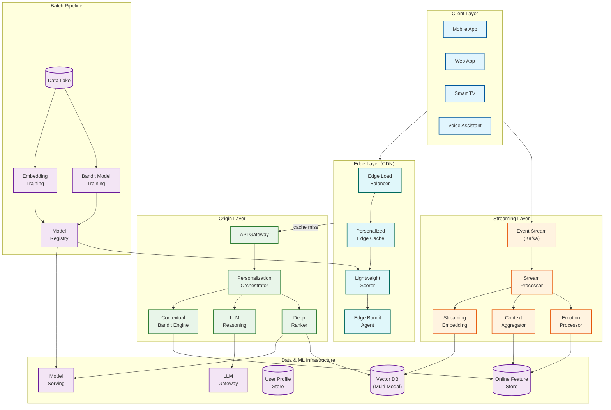
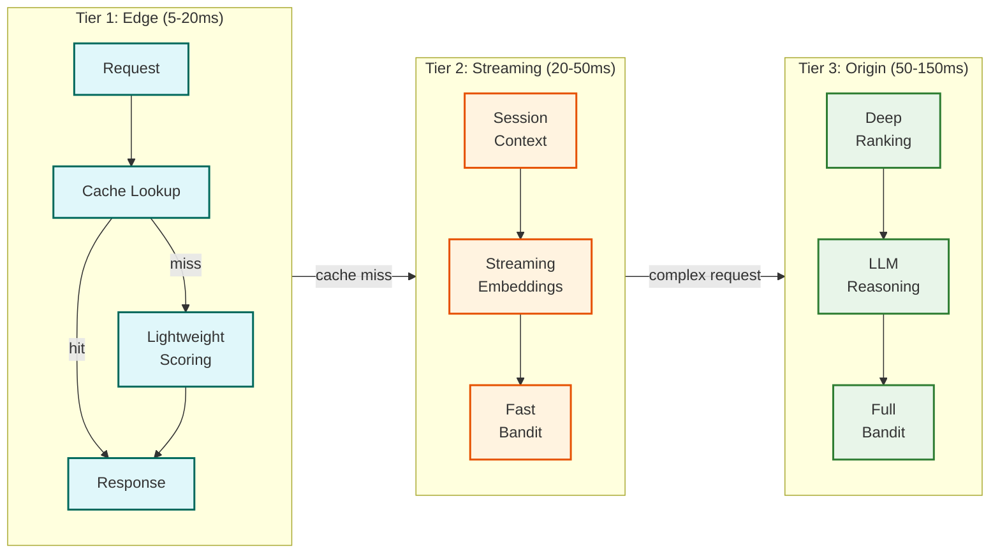

# AI-Native Real-Time Personalization Engine

## Overview

The **AI-Native Real-Time Personalization Engine** is a next-generation system that delivers hyper-personalized experiences using **LLM-based reasoning**, **streaming embeddings**, **multi-modal understanding**, and **edge-first delivery**. Unlike traditional recommendation engines that rely on batch-computed models, this system adapts to user behavior within seconds using contextual bandits, emotion-aware signals, and generative AI agents that create unique experiences for each user.

**Key Differentiator:** Combines streaming embedding computation (sub-minute freshness), contextual Thompson Sampling for exploration/exploitation, multi-modal vector fusion (text + image + audio + video), and optional LLM reasoning for complex personalization decisions—all served through a three-tier architecture (edge/streaming/origin) achieving <50ms p95 latency at the edge.

---

## How This Differs from Traditional Recommendation Engines

| Aspect | Traditional Recommendation (3.12) | AI-Native Personalization (3.34) |
|--------|-----------------------------------|----------------------------------|
| **Embedding Updates** | Daily batch recomputation | Streaming (sub-minute freshness) |
| **Personalization Logic** | Static two-tower + ranking models | LLM reasoning + contextual bandits |
| **Content Modalities** | Primarily text/metadata | Multi-modal (text, image, audio, video) |
| **User Signals** | Historical interactions | Real-time session + emotional signals |
| **Exploration Strategy** | Epsilon-greedy or fixed | Thompson Sampling with contextual features |
| **Serving Architecture** | Origin-only | Three-tier (edge/streaming/origin) |
| **Latency Target** | <100ms p99 | <50ms p95 at edge |
| **Personalization Paradigm** | Rules + segments | Generative AI agents per user |

---

## System Characteristics

| Characteristic | Value | Implication |
|----------------|-------|-------------|
| Traffic Pattern | Read-heavy (serving), Event-heavy (streaming) | Edge caching, stream processing |
| Latency Target | <50ms p95 (edge), <100ms p95 (origin) | Three-tier delivery, edge scoring |
| Embedding Freshness | <60 seconds | Streaming pipeline, incremental updates |
| Consistency Model | Eventual (embeddings), Strong (preferences) | Async updates, sync preference writes |
| Availability Target | 99.99% for personalization | Multi-region, graceful degradation |
| Resource Type | GPU (LLM/embeddings), CPU (bandits), Edge (scoring) | Heterogeneous compute |
| Scale Target | 100M+ users, 10M+ items, 500K+ QPS | Sharded edge + streaming + origin |

---

## Complexity Rating

| Component | Rating | Justification |
|-----------|--------|---------------|
| **Overall** | Very High | LLM integration + streaming + edge + bandits |
| Streaming Embedding Service | High | Real-time vector computation, staleness management |
| Contextual Bandit Engine | High | Thompson Sampling at scale, posterior updates |
| LLM Reasoning Layer | High | Latency management, RAG integration |
| Multi-Modal Fusion | Medium-High | Cross-modal alignment, unified embeddings |
| Edge Personalization | Medium-High | Cache invalidation, lightweight scoring |
| Emotion/Sentiment Analysis | Medium | Real-time NLP, signal fusion |
| A/B Testing with Bandits | Medium | Statistical rigor with exploration |

---

## Quick Navigation

| Document | Description |
|----------|-------------|
| [01 - Requirements & Estimations](./01-requirements-and-estimations.md) | Functional/non-functional requirements, capacity planning, SLOs |
| [02 - High-Level Design](./02-high-level-design.md) | Three-tier architecture, data flow, key decisions |
| [03 - Low-Level Design](./03-low-level-design.md) | Data model, APIs, algorithms (streaming embeddings, Thompson Sampling) |
| [04 - Deep Dive & Bottlenecks](./04-deep-dive-and-bottlenecks.md) | Streaming embeddings, bandit engine, LLM reasoning internals |
| [05 - Scalability & Reliability](./05-scalability-and-reliability.md) | Edge scaling, fault tolerance, disaster recovery |
| [06 - Security & Compliance](./06-security-and-compliance.md) | Privacy, AI Act compliance, PII handling |
| [07 - Observability](./07-observability.md) | Business metrics, bandit regret, embedding freshness |
| [08 - Interview Guide](./08-interview-guide.md) | 45-minute pacing, trap questions, trade-offs |

---

## Core Modules

| Module | Responsibility | Key Challenge |
|--------|----------------|---------------|
| **Edge Personalization** | Low-latency scoring at CDN edge | Cache invalidation, lightweight models |
| **Streaming Embedding Service** | Real-time embedding updates | Staleness vs compute cost trade-off |
| **Contextual Bandit Engine** | Thompson Sampling exploration | Posterior updates at scale |
| **LLM Reasoning Layer** | Complex personalization decisions | Latency budget, when to invoke |
| **Multi-Modal Encoder** | Unified embeddings for all content types | Cross-modal alignment |
| **Emotion Signal Processor** | Sentiment and affect extraction | Real-time NLP accuracy |
| **User Context Builder** | Aggregate session + history + preferences | Feature freshness hierarchy |
| **Personalization Orchestrator** | Route requests through tiers | Dynamic tier selection |

---

## Architecture Overview



---

## Three-Tier Personalization Architecture



**Tier Selection Logic:**
- **Tier 1 (Edge):** Returning users with recent context, high confidence scores
- **Tier 2 (Streaming):** Active session with fresh signals, medium complexity
- **Tier 3 (Origin):** New users, cold items, explainability required, low confidence

---

## Key Algorithms Comparison

| Algorithm | Use Case | Latency | Accuracy | When to Use |
|-----------|----------|---------|----------|-------------|
| **Thompson Sampling** | Exploration/exploitation | <5ms | High | Real-time decisions |
| **Streaming Two-Tower** | Candidate retrieval | <10ms | High | Fresh embeddings |
| **LLM Reasoning** | Complex personalization | 50-200ms | Very High | Explainability, cold start |
| **Multi-Modal Fusion** | Cross-content matching | <20ms | High | Diverse content catalogs |
| **Emotion-Aware Re-ranking** | Affect-based adjustments | <10ms | Medium | Mood-sensitive contexts |

---

## When to Use This Design

**Use AI-Native Personalization When:**
- Personalization must adapt within the same session (sub-minute)
- Content spans multiple modalities (text, image, video, audio)
- Explainability and "why this recommendation" is required
- Cold start is frequent (new users/items constantly)
- User emotional state influences engagement
- Edge latency (<50ms) is critical for UX
- Exploration of new content is business-critical

**Do NOT Use When:**
- Simple popularity-based recommendations suffice
- Content catalog is small and homogeneous
- Batch daily recommendations are acceptable
- Cost constraints prohibit LLM/streaming infrastructure
- Privacy regulations prevent real-time tracking

---

## Technology Stack Reference

| Layer | Technology Options | Selection Criteria |
|-------|-------------------|-------------------|
| **Edge Platform** | Cloudflare Workers, Fastly Compute, Akamai EdgeWorkers | Latency, ML support, global coverage |
| **Streaming** | Kafka + Flink, Kafka Streams, Spark Structured Streaming | Latency, exactly-once, state management |
| **Vector Database** | Pinecone, Weaviate, Qdrant, Milvus | Multi-modal support, real-time updates |
| **Feature Store** | Redis Cluster, Feast + Redis, Tecton | Sub-10ms latency, streaming updates |
| **LLM Gateway** | vLLM, TensorRT-LLM, Portkey | Latency, cost optimization, caching |
| **Model Serving** | Triton, TorchServe, KServe | GPU batching, multi-framework |
| **Bandit Library** | Vowpal Wabbit, custom Thompson | Scale, contextual features |

---

## Key Numbers

| Metric | Value | Context |
|--------|-------|---------|
| Edge latency p95 | <50ms | User-facing personalization |
| Origin latency p95 | <100ms | Complex reasoning path |
| Embedding freshness | <60 seconds | Session adaptation |
| Thompson Sampling update | <10ms | Real-time exploration |
| LLM reasoning budget | 100-200ms | Only when needed |
| Edge cache hit ratio | >80% | Returning users |
| Multi-modal embedding dim | 512-1024 | Unified space |
| Exploration rate | 5-15% | Traffic for bandits |
| Personalization lift | 15-40% | vs non-personalized baseline |

---

## Interview Readiness Checklist

- [ ] Can explain three-tier architecture (edge/streaming/origin) and tier selection
- [ ] Understand streaming embeddings vs batch and freshness trade-offs
- [ ] Know Thompson Sampling algorithm and contextual bandit formulation
- [ ] Can design LLM integration for personalization (when to invoke, latency management)
- [ ] Understand multi-modal embedding fusion techniques
- [ ] Know edge personalization patterns and cache invalidation
- [ ] Can discuss exploration vs exploitation trade-offs quantitatively
- [ ] Understand emotion/sentiment signal integration
- [ ] Can design graceful degradation from LLM to heuristics
- [ ] Know privacy implications (GDPR, AI Act) for real-time personalization

---

## Real-World References

| Company/Product | Key Innovation |
|-----------------|----------------|
| **Shaped** | Two-tower with warehouse-native connectors, real-time learning within session |
| **Recombee** | Auto-optimizing ensemble with ReQL business rules |
| **Netflix** | Foundation model embeddings, near-real-time embedding generation |
| **Amplitude** | Generative personalization with AI agents per user (2026 vision) |
| **TikTok** | Real-time interest modeling with Monolith system |
| **Spotify** | LLM-powered playlist explanations, contextual recommendations |
| **Pinterest** | Generative retrieval with transformers, PinRec |

---

## Quick Reference Card

```
+------------------------------------------------------------------------+
|    AI-NATIVE REAL-TIME PERSONALIZATION ENGINE - QUICK REFERENCE         |
+------------------------------------------------------------------------+
|                                                                         |
|  THREE-TIER ARCHITECTURE                                                |
|  -----------------------                                                |
|  Tier 1 - EDGE (5-20ms):                                               |
|    * Personalized cache lookup                                          |
|    * Lightweight ONNX scorer                                            |
|    * Edge bandit for exploration                                        |
|                                                                         |
|  Tier 2 - STREAMING (20-50ms):                                         |
|    * Session context aggregation                                        |
|    * Streaming embedding updates                                        |
|    * Fast Thompson Sampling                                             |
|                                                                         |
|  Tier 3 - ORIGIN (50-150ms):                                           |
|    * Deep neural ranking                                                |
|    * LLM reasoning (RAG)                                                |
|    * Full contextual bandit                                             |
|                                                                         |
+------------------------------------------------------------------------+
|                                                                         |
|  KEY ALGORITHMS                          LATENCY BUDGETS               |
|  ---------------                         ----------------               |
|  * Thompson Sampling                     * Edge: <50ms p95              |
|  * Streaming Two-Tower                   * Origin: <100ms p95           |
|  * Multi-Modal Fusion                    * LLM path: <200ms             |
|  * Emotion-Aware Reranking               * Embedding refresh: <60s      |
|                                                                         |
+------------------------------------------------------------------------+
|                                                                         |
|  INTERVIEW KEYWORDS                                                     |
|  ------------------                                                     |
|  Three-tier, edge personalization, streaming embeddings, Thompson       |
|  Sampling, contextual bandit, LLM reasoning, multi-modal, emotion       |
|  signals, generative personalization, exploration/exploitation,         |
|  cache invalidation, embedding freshness, bandit regret, AI Act        |
|                                                                         |
+------------------------------------------------------------------------+
```

---

## Related Systems

- [3.12 Recommendation Engine](../3.12-recommendation-engine/00-index.md) - Traditional two-stage architecture
- [3.14 Vector Database](../3.14-vector-database/00-index.md) - ANN search infrastructure
- [3.16 Feature Store](../3.16-feature-store/00-index.md) - Online/offline feature serving
- [3.21 LLM Gateway](../3.21-llm-gateway-prompt-management/00-index.md) - LLM routing and caching
- [3.28 AI Memory Management](../3.28-ai-memory-management-system/00-index.md) - Long-term personalization memory
- [2.8 Edge Computing Platform](../2.8-edge-computing-platform/00-index.md) - Edge infrastructure
- [2.15 Edge-Native Feature Flags](../2.15-edge-native-feature-flags/00-index.md) - Edge evaluation patterns
