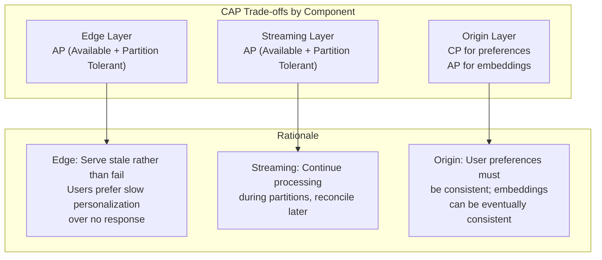

# Requirements & Estimations

## Functional Requirements

### Core Features (Must Have)

| Feature | Description | Priority |
|---------|-------------|----------|
| **Real-Time Personalization** | Deliver personalized content within 50ms at edge, 100ms at origin | P0 |
| **Streaming Embeddings** | Update user embeddings within 60 seconds of new interactions | P0 |
| **Multi-Modal Content** | Support text, image, video, and audio content in unified embedding space | P0 |
| **Contextual Bandits** | Thompson Sampling for exploration with contextual features | P0 |
| **Session Adaptation** | Adapt recommendations within the same user session | P0 |
| **Personalization Explanation** | Provide "why this recommendation" reasoning | P1 |
| **LLM Reasoning** | Use LLM for complex personalization decisions when needed | P1 |
| **Emotion-Aware Signals** | Incorporate sentiment/mood from user behavior | P1 |
| **Edge Delivery** | Serve personalized content from CDN edge nodes | P0 |
| **Graceful Degradation** | Fall back to cached/popular when systems fail | P0 |

### Extended Features (Nice to Have)

| Feature | Description | Priority |
|---------|-------------|----------|
| **Cross-Device Continuity** | Seamless personalization across devices | P2 |
| **Cohort Personalization** | Privacy-preserving group-level personalization | P2 |
| **Federated Learning** | On-device model updates without data centralization | P3 |
| **Voice-Based Personalization** | Adapt to voice tone and speech patterns | P3 |

### Out of Scope

- Full recommendation engine capabilities (covered in 3.12)
- Content catalog management
- Content moderation and safety (covered in 3.22)
- User authentication and identity management
- Billing and monetization
- Content creation/generation

---

## Non-Functional Requirements

### Performance

| Metric | Requirement | Measurement |
|--------|-------------|-------------|
| **Edge Latency** | <50ms p95, <30ms p50 | Client-perceived response time |
| **Origin Latency** | <100ms p95, <70ms p50 | API response time |
| **LLM Path Latency** | <200ms p95 | When LLM reasoning invoked |
| **Embedding Freshness** | <60 seconds | Time from event to updated embedding |
| **Throughput** | 500K+ QPS (edge), 100K+ QPS (origin) | Requests per second |
| **Bandit Update** | <10ms | Posterior update latency |

### Reliability

| Metric | Requirement | Justification |
|--------|-------------|---------------|
| **Availability** | 99.99% (edge), 99.95% (origin) | User experience, revenue impact |
| **Error Rate** | <0.1% | Failed personalization requests |
| **Graceful Degradation** | 100% | Always return something (cached/popular) |
| **Data Durability** | 99.999999% | User preference data |
| **Recovery Time** | <30 seconds | Service restoration |

### Consistency

| Data Type | Model | Justification |
|-----------|-------|---------------|
| User Embeddings | Eventual (seconds) | Real-time updates, read-your-writes within session |
| User Preferences | Strong | Explicit user choices |
| Bandit Parameters | Eventual (seconds) | Continuous learning |
| Content Embeddings | Eventual (minutes) | Batch updates acceptable |
| Personalization Results | Best-effort | Slight staleness acceptable |

### Scalability

| Dimension | Target | Growth Expectation |
|-----------|--------|-------------------|
| Users | 100M+ MAU | 50% YoY |
| Items | 10M+ | 30% YoY |
| Events | 10B+/day | 100% YoY |
| Edge Nodes | 200+ PoPs | Global coverage |
| Embedding Dimensions | 512-1024 | Fixed |

---

## CAP Theorem Analysis



**Decision:** Prioritize **Availability + Partition Tolerance** for personalization delivery, with **Consistency** only for explicit user preference changes.

---

## Capacity Estimations

### User & Traffic Assumptions

| Metric | Value | Basis |
|--------|-------|-------|
| Monthly Active Users (MAU) | 100M | Target scale |
| Daily Active Users (DAU) | 30M | 30% of MAU |
| Sessions per DAU | 3 | Average usage |
| Interactions per session | 20 | Views, clicks, etc. |
| Personalization requests per session | 10 | Page loads, recommendations |
| Read:Write ratio | 10:1 | More reads than writes |

### QPS Calculations

```
Peak QPS (personalization requests):
  30M DAU × 3 sessions × 10 requests = 900M requests/day
  Average QPS = 900M / 86,400 = ~10,400 QPS
  Peak QPS (3x average) = ~31,200 QPS

  With geographic distribution:
  - US (40%): ~12,500 peak QPS
  - EU (30%): ~9,400 peak QPS
  - APAC (30%): ~9,400 peak QPS

Event ingestion (interactions):
  30M DAU × 3 sessions × 20 interactions = 1.8B events/day
  Average events/sec = 1.8B / 86,400 = ~20,800 events/sec
  Peak events/sec (3x) = ~62,500 events/sec
```

### Storage Calculations

```
User Embeddings:
  100M users × 512 dimensions × 4 bytes (float32) = 200 GB
  With 2x replication = 400 GB

Item Embeddings (Multi-Modal):
  10M items × 1024 dimensions × 4 bytes = 40 GB
  With multi-modal (4 modalities) = 160 GB
  With 2x replication = 320 GB

User Profiles & Preferences:
  100M users × 5 KB average = 500 GB
  With 3x replication = 1.5 TB

Session Context (hot data):
  30M DAU × 10 KB session data = 300 GB
  TTL: 24 hours (rolling)

Bandit Parameters:
  10M items × 100 contexts × 16 bytes (alpha/beta) = 16 GB
  With 2x replication = 32 GB

Event Log (30 days):
  1.8B events/day × 30 days × 500 bytes = 27 TB
```

### Bandwidth Calculations

```
Personalization Response:
  Average response size: 5 KB (10-20 items with metadata)
  Peak QPS: 31,200
  Peak egress: 31,200 × 5 KB = 156 MB/s = 1.25 Gbps

Event Ingestion:
  Average event size: 500 bytes
  Peak events/sec: 62,500
  Peak ingress: 62,500 × 500 bytes = 31.25 MB/s = 250 Mbps

Embedding Updates (streaming):
  Changed embeddings per second: ~1,000 users
  Update size: 512 × 4 bytes = 2 KB
  Bandwidth: 1,000 × 2 KB = 2 MB/s = 16 Mbps
```

### Capacity Summary Table

| Metric | Estimation | Calculation |
|--------|------------|-------------|
| DAU | 30M | 30% of 100M MAU |
| Peak QPS (Edge) | ~500K | With edge caching (80% hit rate) |
| Peak QPS (Origin) | ~100K | Cache misses + complex requests |
| Events/sec (Peak) | ~62,500 | 3x average |
| User Embeddings | 400 GB | 100M × 512d × 4B × 2 |
| Item Embeddings | 320 GB | 10M × 1024d × 4B × 4 modalities × 2 |
| User Profiles | 1.5 TB | 100M × 5KB × 3 |
| Session Data | 300 GB | 30M × 10KB (hot) |
| Event Log (30d) | 27 TB | 1.8B/day × 30 × 500B |
| Peak Egress | 1.25 Gbps | 31,200 × 5KB |

---

## SLOs & SLAs

### Service Level Objectives (SLOs)

| Metric | Objective | Error Budget (monthly) |
|--------|-----------|------------------------|
| **Availability (Edge)** | 99.99% | 4.3 minutes |
| **Availability (Origin)** | 99.95% | 21.9 minutes |
| **Edge Latency p50** | <30ms | N/A |
| **Edge Latency p95** | <50ms | N/A |
| **Edge Latency p99** | <100ms | N/A |
| **Origin Latency p50** | <70ms | N/A |
| **Origin Latency p95** | <100ms | N/A |
| **Origin Latency p99** | <200ms | N/A |
| **Embedding Freshness** | <60s p95 | N/A |
| **Error Rate** | <0.1% | N/A |
| **Personalization Lift** | >15% | vs baseline |

### Service Level Agreements (SLAs)

| Tier | Availability | Latency p95 | Support |
|------|--------------|-------------|---------|
| **Premium** | 99.99% | <50ms | 24/7, 15-min response |
| **Standard** | 99.95% | <100ms | Business hours, 4-hr response |
| **Free** | 99.9% | <200ms | Community support |

### SLI Definitions

```
Availability:
  SLI = (successful_requests / total_requests) × 100

  Where successful = HTTP 2xx within latency threshold
  Exclude: Health checks, synthetic monitoring

Edge Latency:
  SLI = percentile(request_duration, 95)

  Where request_duration =
    edge_response_timestamp - client_request_timestamp

Embedding Freshness:
  SLI = percentile(embedding_update_latency, 95)

  Where embedding_update_latency =
    embedding_stored_timestamp - event_timestamp

Personalization Lift:
  SLI = (personalized_engagement - baseline_engagement) / baseline_engagement × 100

  Measured via A/B testing with statistical significance
```

---

## Latency Budget Breakdown

### Edge Path (Target: <50ms p95)

| Component | Budget | Cumulative |
|-----------|--------|------------|
| DNS + TLS | 5ms | 5ms |
| Edge routing | 2ms | 7ms |
| Cache lookup | 3ms | 10ms |
| Lightweight scoring (cache miss) | 15ms | 25ms |
| Edge bandit decision | 5ms | 30ms |
| Response serialization | 5ms | 35ms |
| **Buffer** | 15ms | 50ms |

### Origin Path (Target: <100ms p95)

| Component | Budget | Cumulative |
|-----------|--------|------------|
| Gateway routing | 5ms | 5ms |
| User context fetch | 10ms | 15ms |
| Feature store lookup | 10ms | 25ms |
| Candidate retrieval (ANN) | 15ms | 40ms |
| Deep ranking | 25ms | 65ms |
| Bandit scoring | 5ms | 70ms |
| Response assembly | 10ms | 80ms |
| **Buffer** | 20ms | 100ms |

### LLM Path (Target: <200ms p95)

| Component | Budget | Cumulative |
|-----------|--------|------------|
| Origin path base | 70ms | 70ms |
| LLM gateway | 10ms | 80ms |
| LLM inference | 80ms | 160ms |
| Response parsing | 10ms | 170ms |
| **Buffer** | 30ms | 200ms |

```mermaid
gantt
    title Latency Budget Breakdown
    dateFormat X
    axisFormat %L ms

    section Edge Path
    DNS + TLS           :0, 5
    Edge routing        :5, 7
    Cache lookup        :7, 10
    Lightweight scoring :10, 25
    Bandit decision     :25, 30
    Response            :30, 35
    Buffer              :35, 50

    section Origin Path
    Gateway             :0, 5
    Context fetch       :5, 15
    Feature lookup      :15, 25
    ANN retrieval       :25, 40
    Deep ranking        :40, 65
    Bandit scoring      :65, 70
    Response            :70, 80
    Buffer              :80, 100
```



---

## Infrastructure Sizing

### Edge Infrastructure

| Component | Specification | Quantity | Purpose |
|-----------|---------------|----------|---------|
| Edge PoPs | 200+ locations | Global | Geographic coverage |
| Edge Workers | 2 vCPU, 128MB RAM | 1000s | Per-request processing |
| Edge Cache | 100GB per PoP | 200 | Personalized responses |
| Edge KV Store | 10GB per PoP | 200 | User context cache |

### Streaming Infrastructure

| Component | Specification | Quantity | Purpose |
|-----------|---------------|----------|---------|
| Kafka Brokers | 32 vCPU, 128GB RAM, 2TB SSD | 15 | Event streaming |
| Stream Processors | 16 vCPU, 64GB RAM | 50 | Real-time computation |
| Embedding Workers | 8 vCPU, 32GB RAM, GPU optional | 20 | Streaming embeddings |

### Origin Infrastructure

| Component | Specification | Quantity | Purpose |
|-----------|---------------|----------|---------|
| API Servers | 16 vCPU, 32GB RAM | 100 | Request handling |
| Ranking Servers | 16 vCPU, 64GB RAM, GPU | 30 | Deep ranking |
| Bandit Servers | 8 vCPU, 32GB RAM | 20 | Thompson Sampling |
| LLM Servers | 32 vCPU, 128GB RAM, A100 GPU | 10 | LLM inference |

### Data Infrastructure

| Component | Specification | Quantity | Purpose |
|-----------|---------------|----------|---------|
| Vector DB Nodes | 32 vCPU, 128GB RAM, 1TB SSD | 10 | Embedding storage |
| Redis Cluster | 16 vCPU, 64GB RAM | 15 | Online feature store |
| User Profile DB | 32 vCPU, 256GB RAM, 2TB SSD | 6 | User data |

---

## Cost Estimation (Monthly)

### Infrastructure Costs

| Category | Monthly Cost | Notes |
|----------|--------------|-------|
| Edge (CDN + Compute) | $50,000 | 500K QPS at edge |
| Streaming (Kafka + Flink) | $30,000 | 62K events/sec peak |
| Origin Compute | $80,000 | 100 API + 30 ranking + 20 bandit |
| LLM Inference | $40,000 | 10% requests, $0.01/call |
| Vector Database | $25,000 | 10 nodes managed |
| Feature Store (Redis) | $20,000 | 15 nodes |
| Data Lake | $15,000 | 30TB storage |
| Networking | $20,000 | Egress + inter-region |
| **Total Infrastructure** | **$280,000** | |

### Per-Request Cost Breakdown

```
Edge request (cache hit): $0.000001
Edge request (cache miss): $0.000005
Origin request: $0.00001
Origin + LLM request: $0.0001

Blended cost per request:
  (80% × $0.000001) + (15% × $0.00001) + (5% × $0.0001)
  = $0.0000078 per request

Monthly requests: 500K QPS × 86,400 × 30 = 1.3T requests
Monthly cost verification: 1.3T × $0.0000078 ≈ $10M

Note: Above estimates assume managed services at enterprise scale.
Actual costs vary significantly by provider and negotiated rates.
```

---

## Comparison: Build vs Buy

| Aspect | Build In-House | Buy (Shaped/Recombee) |
|--------|----------------|----------------------|
| **Time to Market** | 12-18 months | 1-3 months |
| **Initial Cost** | $2-5M engineering | $50-200K/year subscription |
| **Ongoing Cost** | $500K+/year maintenance | Included in subscription |
| **Customization** | Full control | Limited by platform |
| **Scale Ceiling** | Unlimited | Platform-dependent |
| **ML Expertise** | Required in-house | Provided by vendor |
| **Data Privacy** | Full control | Depends on vendor |

**Recommendation:**
- **Buy** if: Time-to-market critical, team <5 ML engineers, <500K QPS
- **Build** if: Scale >1M QPS, unique ML requirements, data sovereignty critical
