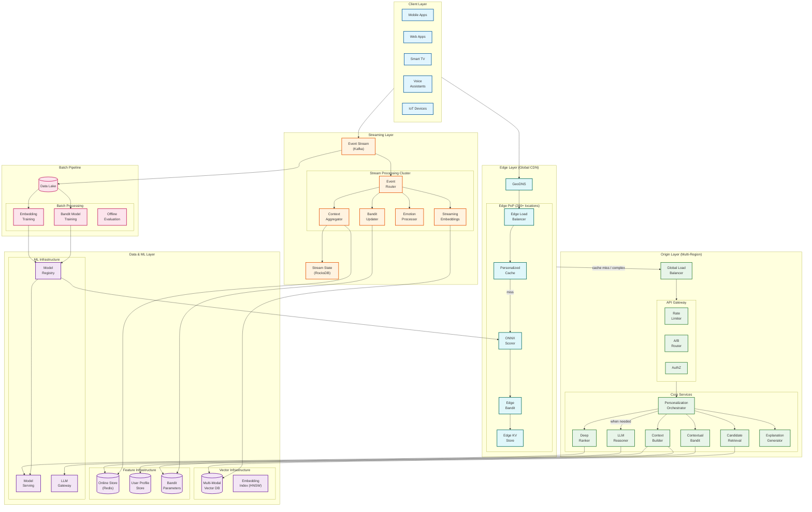
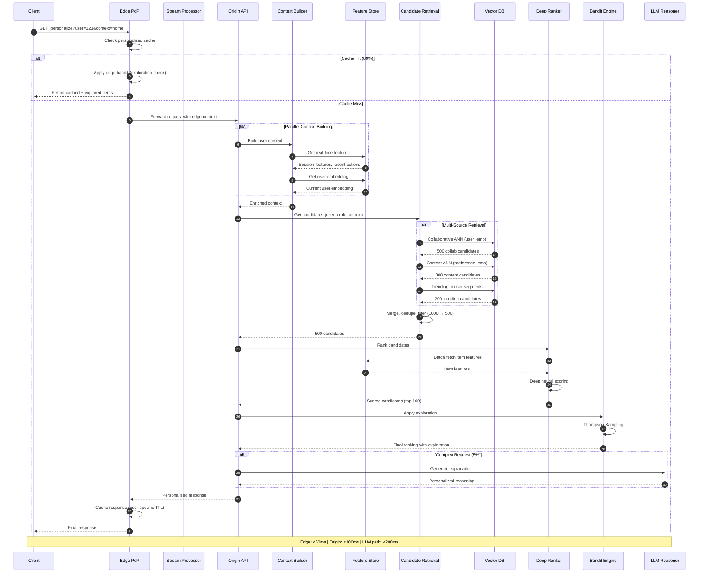
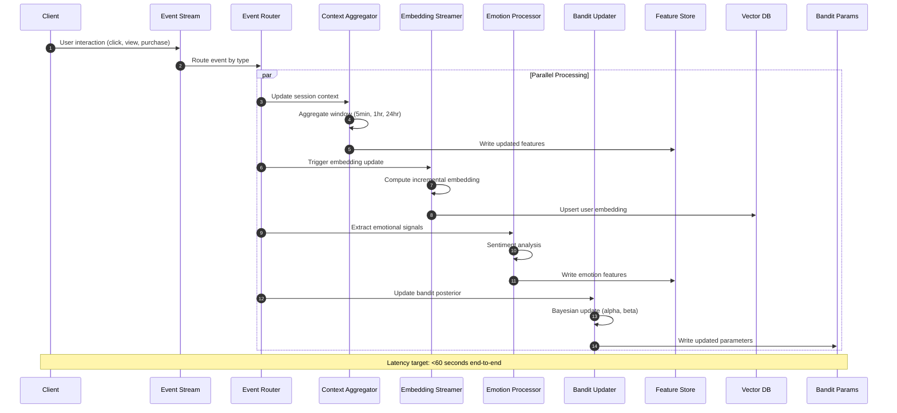
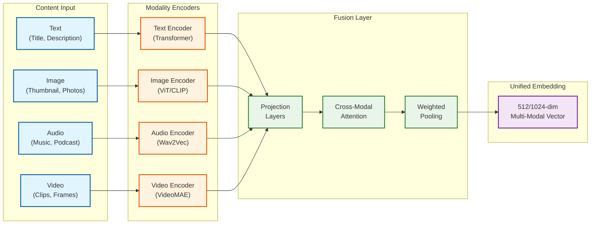
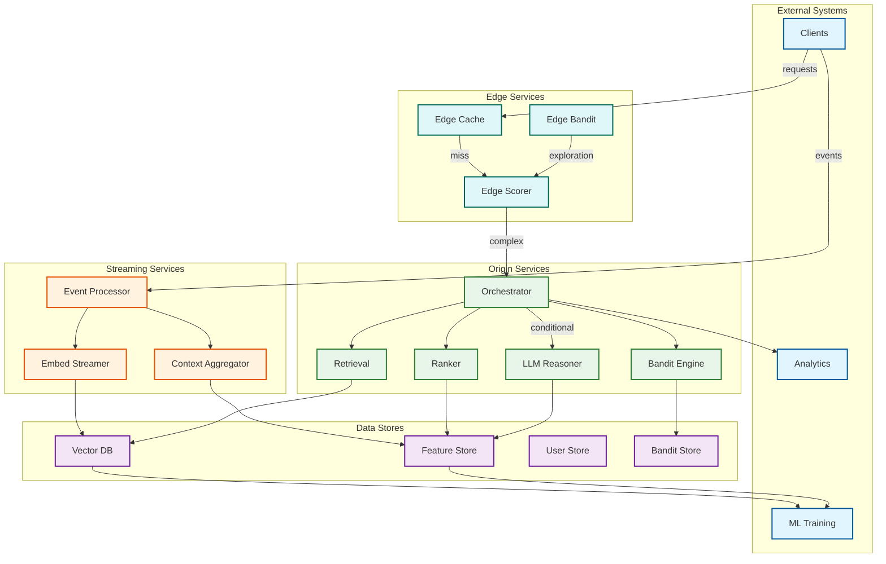
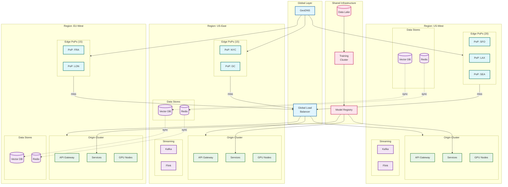

# High-Level Design

## System Architecture



---

## Data Flow: Real-Time Personalization Request



---

## Data Flow: Streaming Embedding Update



---

## Data Flow: Multi-Modal Embedding Pipeline



---

## Key Architectural Decisions

### Decision 1: Three-Tier vs Two-Tier Architecture

| Criterion | Two-Tier (Edge + Origin) | Three-Tier (Edge + Streaming + Origin) |
|-----------|--------------------------|----------------------------------------|
| **Latency** | 50-100ms | <50ms at edge |
| **Freshness** | Minutes to hours | Sub-minute |
| **Complexity** | Lower | Higher |
| **Cost** | Lower | Higher |
| **Real-time Adaptation** | Limited | Full session adaptation |

**Decision: Three-Tier Architecture**

**Rationale:**
- Sub-minute embedding freshness requires dedicated streaming layer
- Edge scoring with streaming context enables <50ms latency
- Separation of concerns: edge (delivery), streaming (freshness), origin (complexity)
- Allows independent scaling of each tier

---

### Decision 2: Streaming Embeddings vs Batch Embeddings

| Criterion | Batch (Daily) | Streaming (Real-time) |
|-----------|---------------|----------------------|
| **Freshness** | 24 hours | <60 seconds |
| **Cost** | Lower (scheduled) | Higher (always-on) |
| **Complexity** | Simple | Complex (state management) |
| **User Experience** | Stale within session | Adaptive within session |
| **Cold Start** | Poor | Good (fast adaptation) |

**Decision: Streaming with Batch Fallback**

**Architecture:**
```
Streaming Path (primary):
  Event → Stream Processor → Incremental Embedding → Vector DB
  Latency: <60 seconds
  Used for: Active users with recent interactions

Batch Path (fallback):
  Data Lake → Embedding Training → Full Recomputation → Vector DB
  Latency: Daily
  Used for: Inactive users, new model deployment
```

**Rationale:**
- User intent changes within a session (Netflix research)
- Streaming embeddings capture "budget travel" → "business class" pivots
- Batch provides fallback and enables full model retraining

---

### Decision 3: LLM Integration Strategy

| Criterion | LLM as Ranker | LLM as Reasoner (RAG) | No LLM |
|-----------|---------------|----------------------|--------|
| **Latency** | 200-500ms | 100-200ms (cached) | <100ms |
| **Cost** | Very High | Medium | Low |
| **Accuracy** | Highest | High | Good |
| **Explainability** | Excellent | Excellent | Limited |
| **Scale** | Limited | Moderate | Unlimited |

**Decision: LLM as Reasoner with Selective Invocation**

**Invocation Criteria:**
```
Invoke LLM when:
  1. Explainability required (user requested "why this?")
  2. Cold start user (insufficient history for embeddings)
  3. Low confidence from bandit (uncertainty > threshold)
  4. High-value decision (purchase consideration)
  5. Complex cross-domain personalization

Do NOT invoke when:
  1. Cache hit with high confidence
  2. Returning user with strong signals
  3. Latency budget exhausted
  4. Rate limit reached
```

**Rationale:**
- LLM latency (100-200ms) exceeds edge budget (<50ms)
- Selective invocation keeps cost manageable (~5-10% of requests)
- RAG approach leverages user context without fine-tuning

---

### Decision 4: Contextual Bandit Algorithm

| Criterion | Epsilon-Greedy | UCB | Thompson Sampling | LinUCB |
|-----------|----------------|-----|-------------------|--------|
| **Exploration** | Random | Optimistic | Probability matching | Confidence bound |
| **Regret** | Linear | Logarithmic | Logarithmic | Logarithmic |
| **Implementation** | Simple | Medium | Medium | Complex |
| **Contextual** | No | No | Yes (with features) | Yes (native) |
| **Interpretability** | Low | Medium | Medium | High |

**Decision: Thompson Sampling with Contextual Features**

**Algorithm:**
```
For each request:
  1. Observe context x (user features, session state)
  2. For each candidate item i:
     a. Sample θ_i ~ Beta(α_i, β_i)  // Posterior
     b. Predict reward: r_i = f(x, θ_i)  // Contextual model
  3. Select items with highest sampled rewards
  4. Observe actual reward (click, engagement)
  5. Update posteriors: α_i += reward, β_i += (1 - reward)
```

**Rationale:**
- Thompson Sampling naturally balances exploration/exploitation
- Probability matching is intuitive and robust
- Contextual extension handles diverse user segments
- Recent research (NeurIPS 2025) validates Feel-Good TS improvements

---

### Decision 5: Edge Personalization Strategy

| Criterion | No Edge Personalization | Edge Cache Only | Edge Scoring |
|-----------|------------------------|-----------------|--------------|
| **Latency** | 70-100ms | 20-40ms (hit) | 30-50ms |
| **Cache Hit Rate** | N/A | 70-80% | 80-90% |
| **Personalization Quality** | Highest | Stale | Good |
| **Edge Compute Cost** | None | Low | Medium |

**Decision: Edge Scoring with Personalized Cache**

**Architecture:**
```
Edge Components:
  1. Personalized Cache
     - Key: hash(user_id, context_type, segment)
     - TTL: 5-15 minutes (dynamic based on activity)
     - Size: ~100GB per PoP

  2. ONNX Scorer
     - Lightweight ranking model (~10MB)
     - Runs on edge workers
     - Latency: <15ms

  3. Edge Bandit
     - Local exploration with global sync
     - Thompson Sampling with shared posteriors
     - Exploration rate: 10-15%

  4. Edge KV Store
     - User context (last 10 interactions)
     - Session state
     - Synced from streaming layer every 30s
```

**Rationale:**
- 80%+ requests served from edge (<50ms)
- ONNX enables ML on edge without GPU
- Personalized cache keys prevent mixing user results
- Edge bandit maintains exploration without origin round-trip

---

## Component Interactions



---

## Architecture Pattern Checklist

| Pattern | Decision | Rationale |
|---------|----------|-----------|
| **Sync vs Async** | Sync (serving), Async (streaming, training) | Low latency serving, high throughput processing |
| **Event-driven vs Request-response** | Both | Events for updates, requests for personalization |
| **Push vs Pull** | Push (embeddings to edge), Pull (features on-demand) | Freshness at edge, flexibility at origin |
| **Stateless vs Stateful** | Stateless services, Stateful streaming | Scale services, maintain context |
| **Read-heavy vs Write-heavy** | Read-heavy serving, Write-heavy streaming | Optimize for QPS, handle event volume |
| **Real-time vs Batch** | Real-time primary, Batch fallback | Freshness priority with reliability |
| **Edge vs Origin** | Edge-first with origin fallback | Latency optimization |

---

## Technology Mapping

| Component | Options | Recommended | Rationale |
|-----------|---------|-------------|-----------|
| **Edge Platform** | Cloudflare Workers, Fastly, Akamai | Cloudflare Workers | V8 isolates, global KV, ML support |
| **Event Streaming** | Kafka, Pulsar, Kinesis | Kafka | Throughput, ecosystem, exactly-once |
| **Stream Processing** | Flink, Kafka Streams, Spark | Flink | Low latency, state management |
| **Vector Database** | Pinecone, Weaviate, Qdrant, Milvus | Qdrant or Weaviate | Multi-modal, real-time updates |
| **Feature Store** | Redis, Feast+Redis, Tecton | Redis Cluster | Sub-ms latency, streams integration |
| **Model Serving** | Triton, TorchServe, KServe | Triton | GPU batching, ONNX support |
| **LLM Gateway** | vLLM, TensorRT-LLM, Portkey | vLLM + Portkey | Inference speed + routing |
| **Bandit Library** | Vowpal Wabbit, custom | Custom (Thompson) | Full control, contextual |
| **Orchestration** | Kubernetes, Ray | Kubernetes | Standard, GPU scheduling |

---

## Deployment Topology



---

## Integration Points

| Integration | Protocol | Direction | Purpose |
|-------------|----------|-----------|---------|
| Client SDKs | REST/gRPC | Inbound | Personalization requests |
| Event Collection | Kafka | Inbound | User interactions |
| Analytics Export | Kafka | Outbound | Personalization events |
| A/B Testing | gRPC | Bidirectional | Experiment allocation |
| Model Registry | gRPC | Pull | Model deployment |
| LLM Gateway | REST/gRPC | Outbound | LLM inference |
| Content Catalog | Kafka | Inbound | New item embeddings |
| User Management | gRPC | Bidirectional | Profile sync |
| Edge Sync | WebSocket | Push | Context and cache updates |
