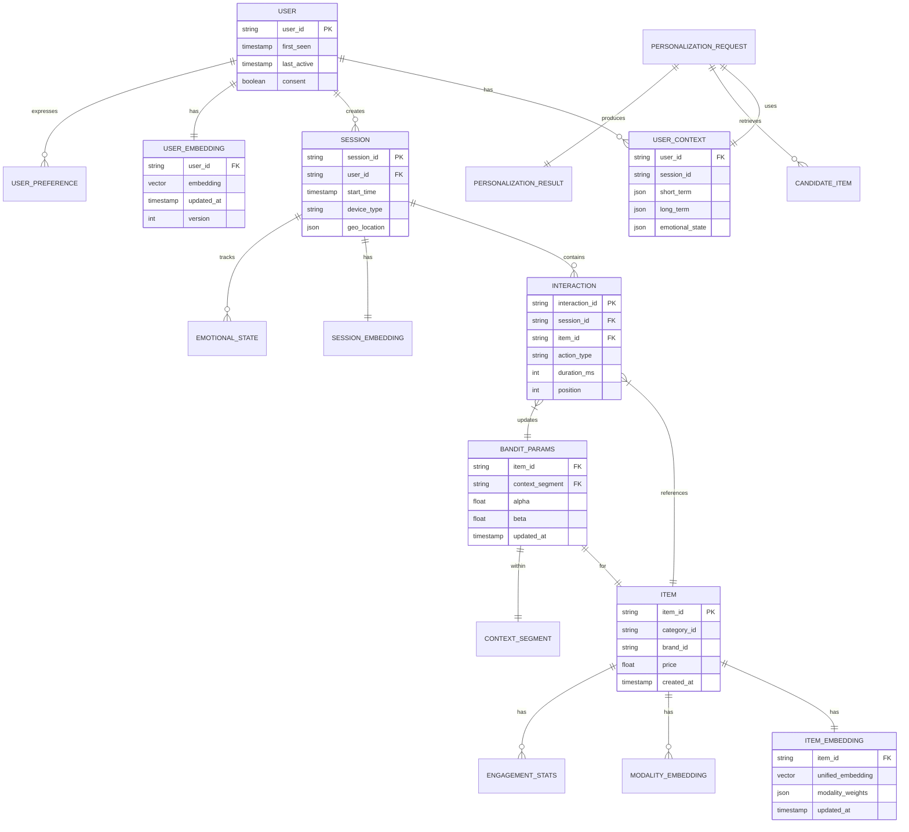

# Low-Level Design

## Data Model

### User Context Schema

```
UserContext:
  user_id: string (UUID)
  session_id: string (UUID)

  # Real-time signals (updated per interaction)
  session_state:
    start_time: timestamp
    interactions: list<Interaction>  # Last 50 in session
    current_page: string
    device_type: enum (mobile, desktop, tablet, tv)
    geo_location: GeoPoint

  # Short-term preferences (last 24 hours)
  short_term:
    viewed_items: set<item_id>  # Last 100
    clicked_items: set<item_id>  # Last 50
    engaged_items: set<item_id>  # >30s engagement
    search_queries: list<string>  # Last 10
    category_affinity: map<category_id, float>

  # Long-term preferences (lifetime)
  long_term:
    preferred_categories: list<category_id>  # Top 10
    disliked_categories: list<category_id>
    price_sensitivity: float (0-1)
    brand_preferences: list<brand_id>
    content_format_preference: map<format, float>

  # Emotional signals (real-time)
  emotional_state:
    sentiment_score: float (-1 to 1)
    engagement_velocity: float  # Interactions per minute
    scroll_behavior: enum (browsing, searching, deciding)
    frustration_score: float (0-1)

  # Embeddings
  embeddings:
    user_embedding: vector<512>  # Streaming updated
    preference_embedding: vector<512>  # Content-based
    session_embedding: vector<256>  # Current session

  # Metadata
  metadata:
    first_seen: timestamp
    last_active: timestamp
    total_sessions: int
    total_interactions: int
    personalization_consent: boolean

Interaction:
  interaction_id: string
  timestamp: timestamp
  item_id: string
  action_type: enum (view, click, add_to_cart, purchase, scroll, dwell)
  duration_ms: int
  position: int  # Position in list where shown
  context: map<string, string>  # Page, source, etc.
```

### Multi-Modal Item Embedding Schema

```
ItemEmbedding:
  item_id: string (UUID)
  version: int
  updated_at: timestamp

  # Individual modality embeddings
  modality_embeddings:
    text_embedding: vector<512>      # From title, description
    image_embedding: vector<512>     # From primary image
    audio_embedding: vector<512>     # For audio content (optional)
    video_embedding: vector<512>     # For video content (optional)

  # Fused multi-modal embedding
  unified_embedding: vector<1024>    # Cross-modal fusion

  # Modality weights (learned)
  modality_weights:
    text_weight: float
    image_weight: float
    audio_weight: float
    video_weight: float

  # Content metadata for filtering
  metadata:
    category_id: string
    brand_id: string
    price: float
    availability: enum (in_stock, limited, out_of_stock)
    content_rating: string
    language: string
    created_at: timestamp
    popularity_score: float
    freshness_score: float

  # Engagement statistics (for bandit)
  engagement_stats:
    total_impressions: int
    total_clicks: int
    total_conversions: int
    avg_dwell_time_ms: float
    ctr: float  # Click-through rate
    cvr: float  # Conversion rate
```

### Bandit Parameters Schema

```
BanditParameters:
  item_id: string
  context_segment: string  # e.g., "mobile_us_evening"

  # Thompson Sampling parameters
  thompson:
    alpha: float  # Successes + prior
    beta: float   # Failures + prior
    prior_alpha: float  # Initial prior (default: 1)
    prior_beta: float   # Initial prior (default: 1)

  # Contextual features (for contextual Thompson Sampling)
  contextual:
    feature_weights: vector<64>  # Learned weights
    feature_covariance: matrix<64, 64>  # For uncertainty

  # Statistics
  statistics:
    total_impressions: int
    total_rewards: int
    last_updated: timestamp
    exploration_count: int
    exploitation_count: int

  # Confidence metrics
  confidence:
    uncertainty: float  # sqrt(alpha + beta)^-1
    expected_value: float  # alpha / (alpha + beta)
    credible_interval_lower: float  # 5th percentile
    credible_interval_upper: float  # 95th percentile
```

### Personalization Signal Schema

```
PersonalizationSignal:
  signal_id: string
  user_id: string
  timestamp: timestamp
  signal_type: enum (
    interaction,
    preference_update,
    context_change,
    emotional_shift,
    explicit_feedback
  )

  # Signal-specific payload
  payload:
    # For interaction signals
    interaction:
      item_id: string
      action: string
      reward: float (0-1)

    # For preference signals
    preference:
      category: string
      direction: enum (positive, negative)
      strength: float

    # For emotional signals
    emotion:
      sentiment_delta: float
      frustration_delta: float
      velocity_change: float

  # Derived features
  derived:
    session_position: int  # Nth signal in session
    time_since_last: int   # Milliseconds
    cumulative_engagement: float

  # Processing metadata
  processing:
    processed: boolean
    embedding_updated: boolean
    bandit_updated: boolean
    processing_latency_ms: int
```

---

## Entity Relationship Diagram



---

## API Design

### Personalization API

#### Get Personalized Content

```
POST /v1/personalize

Request:
{
  "user_id": "uuid",
  "session_id": "uuid",
  "context": {
    "page_type": "home | search | category | item_detail",
    "placement": "hero | feed | sidebar | related",
    "device": "mobile | desktop | tablet | tv",
    "geo": {
      "country": "US",
      "region": "CA",
      "city": "San Francisco"
    },
    "timestamp": "2026-01-29T10:30:00Z"
  },
  "constraints": {
    "count": 20,
    "categories": ["cat1", "cat2"],  // Optional filter
    "exclude_items": ["item1"],       // Already seen
    "price_range": {
      "min": 10.00,
      "max": 100.00
    }
  },
  "options": {
    "include_explanation": true,
    "exploration_rate": 0.1,
    "diversity_weight": 0.3
  }
}

Response:
{
  "request_id": "uuid",
  "user_id": "uuid",
  "items": [
    {
      "item_id": "uuid",
      "rank": 1,
      "score": 0.95,
      "source": "collaborative | content | trending | exploration",
      "explanation": {
        "primary_reason": "Based on your recent interest in electronics",
        "signals": ["viewed_similar", "category_match", "trending"]
      },
      "metadata": {
        "title": "Item Title",
        "category": "Electronics",
        "price": 49.99,
        "image_url": "https://..."
      }
    }
  ],
  "metadata": {
    "latency_ms": 45,
    "tier": "edge | origin | llm",
    "cache_hit": true,
    "exploration_applied": true,
    "model_version": "v2.3.1"
  }
}

Status Codes:
  200 OK - Successful personalization
  400 Bad Request - Invalid parameters
  401 Unauthorized - Missing/invalid auth
  429 Too Many Requests - Rate limited
  500 Internal Error - Fallback to popular
  503 Service Unavailable - Degraded mode
```

#### Record Feedback

```
POST /v1/feedback

Request:
{
  "user_id": "uuid",
  "session_id": "uuid",
  "request_id": "uuid",  // From personalization response
  "feedback": [
    {
      "item_id": "uuid",
      "action": "click | view | add_to_cart | purchase | dismiss",
      "position": 3,
      "duration_ms": 5000,
      "timestamp": "2026-01-29T10:31:00Z",
      "reward_override": 0.8  // Optional explicit reward
    }
  ]
}

Response:
{
  "status": "accepted",
  "processed": 1,
  "latency_ms": 5
}
```

#### Get Explanation

```
POST /v1/explain

Request:
{
  "user_id": "uuid",
  "item_id": "uuid",
  "context": {
    "page_type": "item_detail",
    "explanation_style": "concise | detailed | conversational"
  }
}

Response:
{
  "item_id": "uuid",
  "explanation": {
    "headline": "Recommended because you love electronics",
    "detailed": "This item matches your preference for mid-range electronics...",
    "factors": [
      {
        "factor": "category_affinity",
        "weight": 0.4,
        "description": "You've viewed 15 items in this category"
      },
      {
        "factor": "price_match",
        "weight": 0.3,
        "description": "Within your typical price range"
      },
      {
        "factor": "trending",
        "weight": 0.2,
        "description": "Popular among similar users"
      }
    ],
    "llm_generated": true
  },
  "latency_ms": 150
}
```

### Internal APIs

#### Streaming Embedding Update

```
// Kafka Topic: user-embedding-updates
{
  "user_id": "uuid",
  "event_type": "embedding_update",
  "timestamp": "2026-01-29T10:30:00Z",
  "embedding": {
    "vector": [0.123, -0.456, ...],  // 512 dimensions
    "version": 12345,
    "source": "streaming | batch"
  },
  "trigger": {
    "interaction_id": "uuid",
    "action": "purchase",
    "item_id": "uuid"
  }
}
```

#### Bandit Update

```
// Internal gRPC service
service BanditService {
  rpc UpdatePosterior(UpdateRequest) returns (UpdateResponse);
  rpc Sample(SampleRequest) returns (SampleResponse);
  rpc GetParameters(ParameterRequest) returns (ParameterResponse);
}

message UpdateRequest {
  string item_id = 1;
  string context_segment = 2;
  float reward = 3;  // 0-1
  repeated float context_features = 4;  // For contextual bandit
}

message SampleRequest {
  repeated string item_ids = 1;
  string context_segment = 2;
  repeated float context_features = 3;
  int32 num_samples = 4;  // For batch sampling
}

message SampleResponse {
  repeated ItemSample samples = 1;

  message ItemSample {
    string item_id = 1;
    float sampled_value = 2;
    float uncertainty = 3;
  }
}
```

---

## Core Algorithms

### Algorithm 1: Streaming Embedding Computation

```
ALGORITHM: StreamingEmbeddingUpdate
INPUT: user_id, new_interaction, current_embedding, model
OUTPUT: updated_embedding

PROCEDURE UpdateEmbedding(user_id, interaction, current_emb, model):
    // Get item embedding for the interacted item
    item_emb = VectorDB.get(interaction.item_id)

    // Compute interaction weight based on action type
    action_weights = {
        "view": 0.1,
        "click": 0.3,
        "add_to_cart": 0.5,
        "purchase": 1.0,
        "dismiss": -0.2
    }
    weight = action_weights[interaction.action]

    // Apply time decay (exponential decay over 24 hours)
    time_delta = now() - interaction.timestamp
    decay = exp(-time_delta.hours / 24)
    weight = weight * decay

    // Incremental embedding update (momentum-based)
    momentum = 0.9
    learning_rate = 0.1

    // Direction: move user embedding toward (or away from) item
    direction = item_emb - current_emb
    update = learning_rate * weight * direction

    // Apply momentum from previous updates
    prev_update = Cache.get(f"emb_momentum:{user_id}")
    IF prev_update EXISTS:
        update = momentum * prev_update + (1 - momentum) * update
    Cache.set(f"emb_momentum:{user_id}", update, ttl=3600)

    // Update embedding
    new_emb = current_emb + update

    // Normalize to unit sphere
    new_emb = new_emb / norm(new_emb)

    // Version control
    version = Cache.incr(f"emb_version:{user_id}")

    // Write to vector DB
    VectorDB.upsert(
        collection="user_embeddings",
        id=user_id,
        vector=new_emb,
        metadata={"version": version, "updated_at": now()}
    )

    // Publish update event
    Kafka.publish("embedding-updates", {
        "user_id": user_id,
        "version": version,
        "trigger": interaction.interaction_id
    })

    RETURN new_emb

COMPLEXITY:
  Time: O(d) where d = embedding dimension (512)
  Space: O(d) for embedding storage
  Latency: <50ms end-to-end
```

### Algorithm 2: Thompson Sampling with Contextual Features

```
ALGORITHM: ContextualThompsonSampling
INPUT: candidates, user_context, bandit_params
OUTPUT: ranked_candidates with exploration

PROCEDURE ThompsonSample(candidates, context, params):
    // Extract context features
    context_features = ExtractContextFeatures(context)
    // Features: [device, time_of_day, geo, session_length, recent_category, ...]

    sampled_values = []

    FOR EACH candidate IN candidates:
        // Get bandit parameters for this item in context
        item_params = params.get(candidate.item_id, context.segment)

        IF item_params IS NULL:
            // Cold start: use prior
            alpha = 1.0
            beta = 1.0
            context_weights = zeros(64)
        ELSE:
            alpha = item_params.alpha
            beta = item_params.beta
            context_weights = item_params.context_weights

        // Sample from Beta distribution (Thompson Sampling)
        base_sample = BetaSample(alpha, beta)

        // Add contextual adjustment
        context_adjustment = dot(context_weights, context_features)
        context_adjustment = sigmoid(context_adjustment) - 0.5  // Center at 0

        // Final sampled value
        sampled_value = base_sample + 0.2 * context_adjustment
        sampled_value = clip(sampled_value, 0, 1)

        // Track uncertainty for potential LLM escalation
        uncertainty = 1.0 / sqrt(alpha + beta)

        sampled_values.append({
            "item_id": candidate.item_id,
            "sampled_value": sampled_value,
            "uncertainty": uncertainty,
            "base_score": candidate.base_score
        })

    // Combine with base ranking score
    FOR EACH sv IN sampled_values:
        // Weighted combination: exploit base score + explore via sampling
        exploration_weight = 0.3  // Configurable
        sv.final_score = (
            (1 - exploration_weight) * sv.base_score +
            exploration_weight * sv.sampled_value
        )

    // Sort by final score
    ranked = sort(sampled_values, key=final_score, descending=True)

    // Mark exploration vs exploitation
    FOR i, item IN enumerate(ranked):
        IF item.sampled_value > item.base_score:
            item.source = "exploration"
        ELSE:
            item.source = "exploitation"

    RETURN ranked

PROCEDURE UpdatePosterior(item_id, context_segment, reward, context_features):
    // Get current parameters
    params = BanditStore.get(item_id, context_segment)

    IF params IS NULL:
        params = {
            "alpha": 1.0,
            "beta": 1.0,
            "context_weights": zeros(64),
            "context_covariance": identity(64) * 0.1
        }

    // Update Beta parameters
    params.alpha += reward
    params.beta += (1 - reward)

    // Update contextual weights (online learning)
    learning_rate = 0.01
    prediction = sigmoid(dot(params.context_weights, context_features))
    error = reward - prediction

    // Gradient update
    params.context_weights += learning_rate * error * context_features

    // Update covariance (simplified diagonal approximation)
    params.context_covariance *= 0.99  // Decay
    params.context_covariance += 0.01 * outer(context_features, context_features)

    // Store updated parameters
    BanditStore.set(item_id, context_segment, params)

COMPLEXITY:
  Time: O(n * f) where n = candidates, f = context features
  Space: O(n) for sampled values
  Sampling: O(1) per item (Beta sampling is constant time)
```

### Algorithm 3: Multi-Modal Embedding Fusion

```
ALGORITHM: MultiModalFusion
INPUT: text_emb, image_emb, audio_emb, video_emb, modality_weights
OUTPUT: unified_embedding

PROCEDURE FuseModalities(embeddings, weights, cross_attention_model):
    // embeddings: dict of modality -> vector
    // weights: learned importance weights per modality

    available_modalities = []
    FOR modality, emb IN embeddings:
        IF emb IS NOT NULL:
            available_modalities.append((modality, emb))

    IF len(available_modalities) == 0:
        RETURN zero_vector(1024)

    IF len(available_modalities) == 1:
        // Single modality: project to unified space
        modality, emb = available_modalities[0]
        projected = ProjectionLayer[modality](emb)  // 512 -> 1024
        RETURN normalize(projected)

    // Multiple modalities: cross-attention fusion

    // Step 1: Project each modality to common dimension
    projected = {}
    FOR modality, emb IN available_modalities:
        projected[modality] = ProjectionLayer[modality](emb)  // -> 1024

    // Step 2: Normalize weights for available modalities
    total_weight = sum(weights[m] for m, _ in available_modalities)
    norm_weights = {m: weights[m] / total_weight for m, _ in available_modalities}

    // Step 3: Weighted average (baseline fusion)
    weighted_avg = zeros(1024)
    FOR modality, emb IN projected:
        weighted_avg += norm_weights[modality] * emb

    // Step 4: Cross-modal attention (learned interactions)
    // Query: weighted average, Keys/Values: individual modalities
    attention_input = stack([projected[m] for m, _ in available_modalities])

    query = Linear_Q(weighted_avg)  // 1024 -> 256
    keys = Linear_K(attention_input)  // n x 1024 -> n x 256
    values = Linear_V(attention_input)  // n x 1024 -> 1024

    // Scaled dot-product attention
    scores = matmul(query, keys.T) / sqrt(256)
    attention_weights = softmax(scores)
    attention_output = matmul(attention_weights, values)

    // Step 5: Combine weighted average and attention output
    fusion_gate = sigmoid(Linear_gate(concatenate(weighted_avg, attention_output)))
    fused = fusion_gate * weighted_avg + (1 - fusion_gate) * attention_output

    // Step 6: Final normalization
    unified = normalize(fused)

    RETURN unified

COMPLEXITY:
  Time: O(m * d + m^2) where m = modalities, d = dimension
  Space: O(m * d) for projected embeddings
  Typically: 4 modalities, 1024 dim -> ~4K operations
```

### Algorithm 4: Emotion-Aware Re-ranking

```
ALGORITHM: EmotionAwareReranking
INPUT: ranked_candidates, user_emotional_state, emotion_config
OUTPUT: reranked_candidates

PROCEDURE EmotionRerank(candidates, emotion_state, config):
    // emotion_state: {sentiment, engagement_velocity, frustration, scroll_behavior}

    // Define emotion-based adjustments
    adjustments = []

    FOR EACH candidate IN candidates:
        adjustment = 1.0  // Neutral multiplier

        // Sentiment-based: positive mood -> prefer aspirational content
        IF emotion_state.sentiment > 0.3:
            IF candidate.category IN ["premium", "trending", "new"]:
                adjustment *= 1.1
        ELIF emotion_state.sentiment < -0.3:
            // Negative mood -> prefer familiar, comfortable content
            IF candidate.is_previously_engaged:
                adjustment *= 1.15
            IF candidate.category IN ["comfort", "familiar"]:
                adjustment *= 1.1

        // Engagement velocity: high velocity -> shorter content
        IF emotion_state.engagement_velocity > 5:  // >5 interactions/min
            IF candidate.content_length == "short":
                adjustment *= 1.1
            ELIF candidate.content_length == "long":
                adjustment *= 0.9

        // Frustration: high frustration -> boost high-confidence items
        IF emotion_state.frustration > 0.5:
            IF candidate.confidence > 0.8:
                adjustment *= 1.2
            // Reduce exploration when frustrated
            IF candidate.source == "exploration":
                adjustment *= 0.7

        // Scroll behavior: deciding mode -> show decisive content
        IF emotion_state.scroll_behavior == "deciding":
            IF candidate.has_clear_cta:
                adjustment *= 1.1
            IF candidate.is_comparison:
                adjustment *= 1.15
        ELIF emotion_state.scroll_behavior == "browsing":
            // Browsing: increase diversity
            IF candidate.is_novel_category:
                adjustment *= 1.1

        // Apply adjustment to score
        new_score = candidate.score * adjustment

        adjustments.append({
            "item_id": candidate.item_id,
            "original_score": candidate.score,
            "adjustment": adjustment,
            "new_score": new_score,
            "reasons": []  // Track which rules applied
        })

    // Sort by adjusted score
    reranked = sort(adjustments, key=new_score, descending=True)

    // Diversity preservation: ensure we don't cluster too much
    reranked = ApplyDiversityConstraint(reranked, min_category_diversity=0.3)

    RETURN reranked

PROCEDURE ApplyDiversityConstraint(candidates, min_diversity):
    // Ensure at least min_diversity fraction of top-N are from different categories
    final_list = []
    category_count = {}
    n = len(candidates)
    max_per_category = int(n * (1 - min_diversity))

    FOR candidate IN candidates:
        cat = candidate.category
        IF category_count.get(cat, 0) < max_per_category:
            final_list.append(candidate)
            category_count[cat] = category_count.get(cat, 0) + 1
        ELSE:
            // Move to end of list
            deferred.append(candidate)

    final_list.extend(deferred)
    RETURN final_list

COMPLEXITY:
  Time: O(n log n) for sorting + O(n) for adjustments
  Space: O(n) for adjustment storage
```

### Algorithm 5: Edge Cache Key Generation

```
ALGORITHM: PersonalizedCacheKeyGeneration
INPUT: user_id, context, cache_config
OUTPUT: cache_key, ttl

PROCEDURE GenerateCacheKey(user_id, context, config):
    // Goal: Balance personalization granularity with cache efficiency

    // Level 1: User segment (coarse)
    user_segment = GetUserSegment(user_id)  // e.g., "power_user", "casual", "new"

    // Level 2: Context bucketing
    context_bucket = BucketContext(context)
    // Bucket time into 15-min windows
    time_bucket = floor(context.timestamp / 900) * 900
    // Bucket geo into regions
    geo_bucket = GeoRegion(context.geo)  // e.g., "us-west", "eu-central"
    // Device type
    device = context.device

    // Level 3: Behavioral recency (for active users)
    IF user_segment IN ["power_user", "active"]:
        // Include recent behavior hash for more personalization
        recent_hash = HashRecentInteractions(user_id, last_n=5)
        granularity = "high"
    ELSE:
        recent_hash = ""
        granularity = "low"

    // Construct cache key
    key_components = [
        context.page_type,
        user_segment,
        geo_bucket,
        device,
        time_bucket,
        recent_hash
    ]
    cache_key = sha256(join(key_components, ":"))

    // Determine TTL based on user activity
    IF user_segment == "power_user":
        ttl = 300  // 5 minutes (frequent updates)
    ELIF user_segment == "active":
        ttl = 600  // 10 minutes
    ELSE:
        ttl = 900  // 15 minutes

    // Reduce TTL if user is currently active
    IF SessionActive(user_id):
        ttl = min(ttl, 180)  // Cap at 3 minutes during active session

    RETURN cache_key, ttl

PROCEDURE HashRecentInteractions(user_id, last_n):
    // Get last N interaction item IDs
    interactions = FeatureStore.get(f"recent_interactions:{user_id}")
    recent_items = interactions[:last_n]

    // Sort for deterministic hash
    sorted_items = sort(recent_items)

    // Hash
    RETURN sha256(join(sorted_items, ","))[:8]  // 8-char hash

CACHE HIT RATES:
  With this approach:
    - Power users: ~70% hit rate (more granular keys)
    - Active users: ~80% hit rate
    - Casual users: ~90% hit rate
    - Overall: ~80% hit rate
```

---

## Database Schemas

### Vector Database (Qdrant/Weaviate)

```
// User Embeddings Collection
Collection: user_embeddings
  Schema:
    id: string (user_id)
    vector: float[512]
    payload:
      segment: string
      last_active: timestamp
      version: int
      embedding_source: string  // "streaming" | "batch"

  Index: HNSW
    m: 16
    ef_construction: 200
    ef_search: 100

// Item Embeddings Collection (Multi-Modal)
Collection: item_embeddings
  Schema:
    id: string (item_id)
    vector: float[1024]  // Unified multi-modal
    payload:
      category_id: string
      brand_id: string
      price: float
      popularity: float
      freshness: float
      availability: string
      modalities: string[]  // ["text", "image", "video"]

  Index: HNSW
    m: 32
    ef_construction: 400
    ef_search: 150

  Named Vectors (for modality-specific search):
    text: float[512]
    image: float[512]
    video: float[512]
```

### Redis Schema (Online Feature Store)

```
// User Context (String with JSON)
Key: context:{user_id}
Value: JSON(UserContext)
TTL: 86400 (24 hours)

// Session State (Hash)
Key: session:{session_id}
Fields:
  user_id: string
  start_time: timestamp
  device: string
  geo: JSON
  interaction_count: int
TTL: 3600 (1 hour)

// Recent Interactions (Sorted Set)
Key: interactions:{user_id}
Score: timestamp
Value: JSON({item_id, action, position})
TTL: 86400 (24 hours)
Max Size: 100 (ZREMRANGEBYRANK)

// User Embedding (String)
Key: embedding:{user_id}
Value: Binary(float32[512])
TTL: 3600 (1 hour, refreshed by streaming)

// Bandit Parameters (Hash)
Key: bandit:{item_id}:{context_segment}
Fields:
  alpha: float
  beta: float
  context_weights: Binary
  updated_at: timestamp
TTL: None (persistent)

// Edge Sync Queue (Stream)
Key: edge_sync:{region}
Fields:
  user_id: string
  update_type: string
  payload: JSON
MaxLen: 100000
```

### Kafka Topics

```
// User Events
Topic: user-events
  Partitions: 100
  Replication: 3
  Retention: 7 days
  Key: user_id
  Value: Avro(InteractionEvent)

// Embedding Updates
Topic: embedding-updates
  Partitions: 50
  Replication: 3
  Retention: 24 hours
  Key: user_id
  Value: Avro(EmbeddingUpdate)

// Bandit Updates
Topic: bandit-updates
  Partitions: 50
  Replication: 3
  Retention: 24 hours
  Key: item_id:context_segment
  Value: Avro(BanditUpdate)

// Personalization Results (for analytics)
Topic: personalization-results
  Partitions: 100
  Replication: 3
  Retention: 30 days
  Key: request_id
  Value: Avro(PersonalizationResult)
```

---

## API Rate Limiting

```
Rate Limits by Tier:

Premium:
  /personalize: 1000 req/sec per user, 100K req/sec total
  /feedback: 5000 req/sec per user, 500K req/sec total
  /explain: 100 req/sec per user, 10K req/sec total

Standard:
  /personalize: 100 req/sec per user, 50K req/sec total
  /feedback: 500 req/sec per user, 100K req/sec total
  /explain: 10 req/sec per user, 5K req/sec total

Free:
  /personalize: 10 req/sec per user, 10K req/sec total
  /feedback: 50 req/sec per user, 20K req/sec total
  /explain: 1 req/sec per user, 1K req/sec total

Implementation:
  - Token bucket algorithm
  - Redis-based distributed counter
  - Sliding window for burst handling
  - Graceful degradation on limit (return cached/popular)
```

---

## Idempotency and Deduplication

```
// Feedback Deduplication
Key: feedback_dedup:{user_id}:{item_id}:{action}
Value: request_id
TTL: 60 seconds

// Request Deduplication (for retries)
Key: request_dedup:{request_id}
Value: cached_response
TTL: 30 seconds

// Embedding Update Deduplication
// Use interaction_id as idempotency key
Key: embed_update:{interaction_id}
Value: 1
TTL: 3600 seconds

// Bandit Update Deduplication
// Dedupe by (item_id, context, timestamp bucket)
Key: bandit_dedup:{item_id}:{context}:{timestamp_bucket}
Value: 1
TTL: 60 seconds
```
