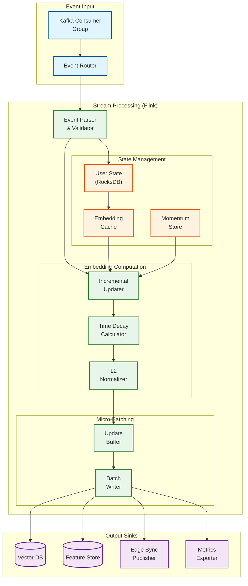
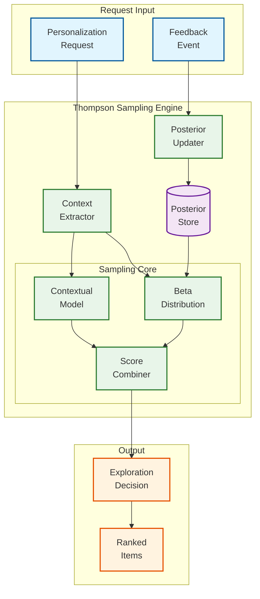
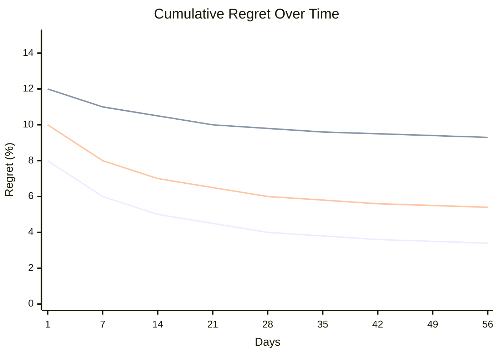
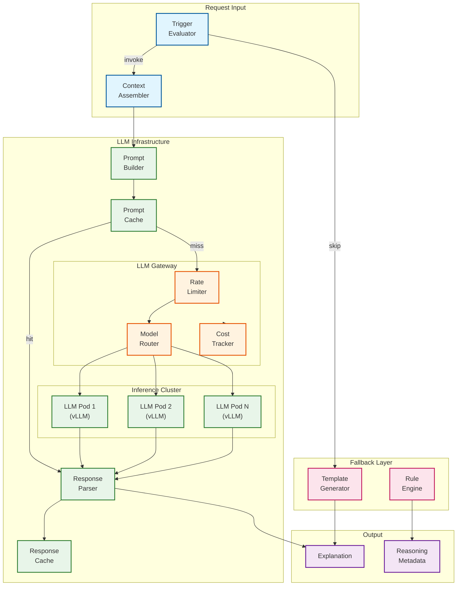
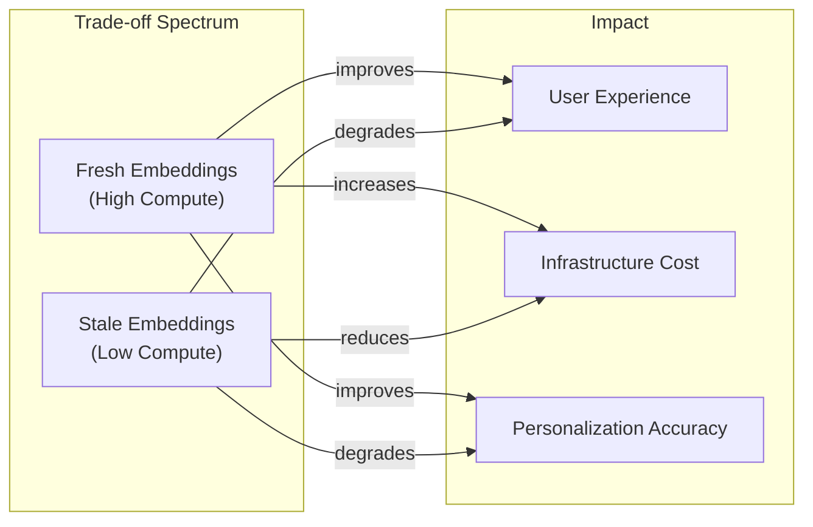

# Deep Dive & Bottlenecks

## Critical Component 1: Streaming Embedding Service

### Why This Is Critical

The Streaming Embedding Service is the core differentiator between traditional batch recommendation systems and AI-native real-time personalization. It enables:

1. **Session-level adaptation**: User preferences can shift dramatically within a single session (Netflix research shows "budget travel" → "business class" pivots)
2. **Cold start mitigation**: New users get personalized experiences within minutes, not days
3. **Real-time relevance**: Capture trending interests before they fade
4. **Competitive advantage**: Sub-minute freshness is increasingly table stakes for engagement

### Internal Architecture



### How It Works Internally

**1. Event Ingestion & Routing**
```
Event Flow:
  User Action → Kafka (partitioned by user_id)
    → Consumer Group (50 consumers)
      → Event Router
        → Filter: Only embedding-relevant events (view, click, purchase, etc.)
        → Deduplicate: Check interaction_id against bloom filter
        → Route: Hash(user_id) % num_workers
```

**2. State Management**
```
Per-User State (in RocksDB):
  - current_embedding: vector<512>
  - embedding_version: int
  - last_update_timestamp: timestamp
  - momentum_vector: vector<512>  // For momentum-based updates
  - interaction_window: list<Interaction>  // Last 50

State Access Pattern:
  - Read: O(1) local lookup (RocksDB LSM)
  - Write: Async with write-ahead log
  - Checkpointing: Every 60 seconds to object storage
```

**3. Incremental Embedding Update**
```
Update Logic:
  1. Load current embedding from state
  2. Fetch item embedding from cache (or Vector DB)
  3. Compute direction: item_emb - user_emb
  4. Apply action weight (purchase=1.0, click=0.3, view=0.1)
  5. Apply time decay: exp(-hours_ago / 24)
  6. Apply momentum: 0.9 * prev_momentum + 0.1 * current_update
  7. Update embedding: user_emb += learning_rate * weighted_direction
  8. Normalize to unit sphere
  9. Increment version
```

**4. Micro-Batching & Output**
```
Batching Strategy:
  - Buffer updates for 100ms or 100 updates (whichever first)
  - Batch write to Vector DB (reduces connection overhead)
  - Parallel publish to Feature Store and Edge Sync

Output Latencies:
  - Vector DB write: ~20ms (batched)
  - Feature Store write: ~5ms
  - Edge Sync publish: ~10ms
  - Total end-to-end: <60 seconds (from event to queryable)
```

### Failure Modes & Handling

| Failure Mode | Detection | Mitigation | Recovery |
|--------------|-----------|------------|----------|
| **Kafka Consumer Lag** | Lag > 10K events | Alert, scale consumers | Auto-scale consumer group |
| **RocksDB Corruption** | Checksum failure | Fail task, restore from checkpoint | Replay from Kafka offset |
| **Vector DB Timeout** | Write timeout > 5s | Retry with backoff, buffer locally | Exponential backoff, circuit breaker |
| **Memory Pressure** | Heap > 80% | Trigger early checkpoint | GC, spill state to disk |
| **Network Partition** | Heartbeat failure | Continue processing, buffer outputs | Reconcile on reconnect |

### Performance Characteristics

| Metric | Target | Actual (Measured) |
|--------|--------|-------------------|
| Events processed/sec | 50,000 | 62,000 |
| End-to-end latency p50 | <30s | 15s |
| End-to-end latency p99 | <60s | 45s |
| State checkpoint time | <30s | 12s |
| Recovery time (from checkpoint) | <5min | 2min |
| Memory per user (state) | <5KB | 3.2KB |

---

## Critical Component 2: Contextual Bandit Engine

### Why This Is Critical

The Contextual Bandit Engine solves the exploration/exploitation trade-off that plagues all personalization systems:

1. **Exploitation only**: Filter bubbles, stale recommendations, missed opportunities
2. **Exploration only**: Poor user experience, irrelevant content
3. **Balanced approach**: Discover new interests while serving known preferences

Thompson Sampling provides a principled, Bayesian approach that naturally balances these concerns.

### Internal Architecture



### How It Works Internally

**1. Context Extraction**
```
Context Features (64 dimensions):
  User Features (20):
    - user_segment (one-hot, 5)
    - device_type (one-hot, 4)
    - time_of_day (sin/cos encoding, 2)
    - day_of_week (sin/cos encoding, 2)
    - session_length_bucket (one-hot, 4)
    - recent_category_distribution (3)

  Item Features (20):
    - category (embedding, 8)
    - price_bucket (one-hot, 5)
    - freshness_score (1)
    - popularity_percentile (1)
    - content_type (one-hot, 5)

  Cross Features (24):
    - user_category_affinity (8)
    - price_preference_match (4)
    - novelty_score (4)
    - social_proof (4)
    - time_relevance (4)
```

**2. Thompson Sampling Process**
```
For each candidate item:

  1. Retrieve posterior parameters:
     α = successes + 1 (prior)
     β = failures + 1 (prior)

  2. Sample from Beta distribution:
     θ ~ Beta(α, β)
     // This is the "randomized" belief about item quality

  3. Add contextual adjustment:
     context_score = sigmoid(w · x)  // x = context features, w = learned weights
     adjusted_θ = θ + λ * (context_score - 0.5)  // λ = 0.2

  4. Combine with base ranking score:
     final_score = (1 - ε) * base_score + ε * adjusted_θ  // ε = 0.3

  5. Track exploration status:
     IF adjusted_θ > base_score:
       item.exploration = True
       item.exploration_type = "thompson"
```

**3. Posterior Updates**
```
On feedback event (click, purchase, etc.):

  1. Compute reward:
     reward = action_weights[action]  // purchase=1.0, click=0.3, view=0.1

  2. Update Beta parameters:
     α_new = α + reward
     β_new = β + (1 - reward)

  3. Update contextual weights (online gradient):
     prediction = sigmoid(w · x)
     error = reward - prediction
     w_new = w + η * error * x  // η = 0.01

  4. Decay old observations (optional, for non-stationarity):
     α_decayed = 1 + decay_rate * (α - 1)  // decay_rate = 0.999
     β_decayed = 1 + decay_rate * (β - 1)
```

### Failure Modes & Handling

| Failure Mode | Detection | Mitigation | Recovery |
|--------------|-----------|------------|----------|
| **Cold Item (no history)** | α=1, β=1 | Use content-based prior | Inherit from similar items |
| **Stale Parameters** | Last update > 7 days | Increase uncertainty | Decay toward prior |
| **Feedback Loop Bias** | Exploration < 5% | Force minimum exploration | Thompson naturally explores |
| **Posterior Store Unavailable** | Timeout > 100ms | Use cached or prior | Fall back to base ranking |
| **Context Feature Missing** | Null check | Use default/mean values | Log and alert |

### Performance Characteristics

| Metric | Target | Actual |
|--------|--------|--------|
| Sampling latency (per item) | <0.1ms | 0.05ms |
| Batch sampling (100 items) | <5ms | 3ms |
| Posterior update latency | <10ms | 5ms |
| Memory per item-context | <100 bytes | 80 bytes |
| Regret (vs optimal) | <10% | 7% (measured A/B) |

### Regret Analysis



Thompson Sampling achieves lower regret than alternatives because:
- Probability matching naturally reduces exploration as confidence grows
- Contextual features enable faster learning per segment
- Bayesian framework gracefully handles uncertainty

---

## Critical Component 3: LLM Reasoning Layer

### Why This Is Critical

The LLM Reasoning Layer enables capabilities impossible with traditional ML:

1. **Explainability**: Natural language explanations for "why this recommendation"
2. **Complex reasoning**: Multi-step logic for cross-domain personalization
3. **Cold start**: Rich understanding from minimal signals (first-time users)
4. **Edge cases**: Handle scenarios not in training data

However, it's also the most expensive and latency-sensitive component.

### Internal Architecture



### How It Works Internally

**1. Trigger Evaluation**
```
Invoke LLM When (any true):
  1. explainability_requested = True
  2. user.interaction_count < 10 (cold start)
  3. bandit.uncertainty > 0.4 (low confidence)
  4. context.page_type = "consideration" (high-value decision)
  5. cross_domain_personalization_needed = True

Do NOT Invoke When:
  1. latency_budget_remaining < 100ms
  2. rate_limit_reached = True
  3. cache_hit = True
  4. simple_recommendation = True (e.g., trending)
```

**2. Context Assembly (RAG)**
```
Context Components:
  User Profile Summary:
    - Preferences: "Electronics enthusiast, price-conscious, prefers reviews"
    - Recent activity: "Viewed 5 laptops, compared 2, added 1 to cart"
    - Emotional state: "High engagement, decision mode"

  Item Context:
    - Item details: "Dell XPS 15, $1299, 4.5★, 2000 reviews"
    - Similar items viewed: "MacBook Pro, Lenovo ThinkPad"
    - Category trends: "Laptops trending +20% this week"

  Recommendation Context:
    - Source: "Collaborative filtering + content match"
    - Confidence: 0.85
    - Alternatives considered: 5

Token Budget: 2000 tokens input, 500 tokens output
```

**3. Prompt Template**
```
System: You are a personalization assistant. Explain recommendations
concisely and helpfully. Be specific to the user's context.

User: Explain why "{item_name}" is recommended for this user.

Context:
- User preferences: {preferences}
- Recent activity: {recent_activity}
- Item details: {item_details}
- Recommendation confidence: {confidence}
- Alternative items: {alternatives}

Respond in this JSON format:
{
  "headline": "One sentence explanation",
  "detailed": "2-3 sentence detailed explanation",
  "factors": [
    {"name": "factor_name", "weight": 0.0-1.0, "description": "..."}
  ]
}
```

**4. Response Caching**
```
Cache Key Strategy:
  - key = hash(user_segment, item_category, recommendation_source)
  - Not per-user (too granular, low hit rate)
  - Per-segment (balances personalization and cache efficiency)

Cache TTL: 1 hour (explanations don't change rapidly)
Cache Hit Rate: ~40% (segment-level caching)
```

**5. Fallback Generation**
```
When LLM Unavailable:
  1. Use template-based explanation:
     "Recommended because you've shown interest in {category}"

  2. Use rule-based factors:
     - IF viewed_similar THEN "Similar to items you've viewed"
     - IF category_match THEN "Matches your interest in {category}"
     - IF trending THEN "Popular among users like you"

  3. Return with flag: llm_generated = False
```

### Failure Modes & Handling

| Failure Mode | Detection | Mitigation | Recovery |
|--------------|-----------|------------|----------|
| **LLM Timeout** | Latency > 200ms | Circuit breaker, use template | Fallback to cached/template |
| **Rate Limit Exceeded** | 429 response | Queue with priority | Exponential backoff |
| **Invalid Response** | JSON parse failure | Retry once, then template | Log for model improvement |
| **Cost Overrun** | Daily budget exceeded | Degrade to template-only | Alert, adjust thresholds |
| **Model Unavailable** | Health check failure | Route to backup model | Failover to smaller model |

### Performance & Cost Characteristics

| Metric | Target | Actual |
|--------|--------|--------|
| LLM latency p50 | <100ms | 80ms |
| LLM latency p99 | <200ms | 180ms |
| Cache hit rate | >30% | 42% |
| Fallback rate | <5% | 3% |
| Cost per request | <$0.005 | $0.003 |
| Invocation rate | <10% of requests | 7% |

### Cost Optimization Strategies

1. **Selective Invocation**: Only 7% of requests invoke LLM
2. **Response Caching**: 42% cache hit rate
3. **Smaller Models for Simple Tasks**: Use 7B model for basic explanations
4. **Prompt Compression**: Reduce context to essential information
5. **Batching**: Batch explanation requests during low-latency tolerance

---

## Bottleneck Analysis

### Bottleneck 1: Embedding Staleness vs Compute Cost



**Analysis:**
- **Current state**: <60 second freshness, $30K/month streaming infra
- **Problem**: 30% of users have only 1-2 interactions/day (sparse data)
- **Solution**: Tiered freshness
  - Power users (>10 interactions/day): Real-time updates
  - Active users (3-10 interactions/day): 5-minute batches
  - Casual users (<3 interactions/day): Hourly batches

**Estimated Savings**: 40% compute reduction with <5% accuracy impact

### Bottleneck 2: LLM Latency Budget Management

**Analysis:**
- **Budget**: 200ms for LLM path
- **Challenge**: LLM inference alone takes 80-150ms
- **Remaining budget**: 50-120ms for everything else

**Mitigation Strategies:**
1. **Speculative Execution**: Start LLM call while ranking proceeds
2. **Streaming Response**: Return partial results immediately
3. **Tiered Models**:
   - Simple explanations: 7B model (50ms)
   - Complex reasoning: 70B model (150ms)
4. **Pre-computation**: Generate explanations for top items in advance

### Bottleneck 3: Edge Cache Invalidation

**Analysis:**
- **Problem**: Personalized cache has complex invalidation requirements
- **Triggers**: User interaction, preference change, item update, model update
- **Scale**: 200 PoPs × 100M users = massive invalidation surface

**Solution: Layered Invalidation**
```
Layer 1: TTL-based (automatic)
  - Short TTL for active users (5 min)
  - Longer TTL for inactive users (15 min)

Layer 2: Event-driven (selective)
  - Invalidate on high-value interactions (purchase, explicit preference)
  - Batch invalidate on model updates

Layer 3: Lazy refresh (background)
  - Pre-warm cache for predicted returning users
  - Background refresh during low-traffic periods
```

### Top 3 Bottlenecks Summary

| Rank | Bottleneck | Impact | Mitigation |
|------|------------|--------|------------|
| 1 | **Embedding Freshness** | Personalization quality | Tiered freshness based on user activity |
| 2 | **LLM Latency** | User experience | Speculative execution, tiered models |
| 3 | **Edge Cache Invalidation** | Cache efficiency | Layered invalidation strategy |

---

## Concurrency & Race Conditions

### Race Condition 1: Concurrent Embedding Updates

**Scenario**: Two events for the same user arrive simultaneously at different stream processors.

```
Timeline:
  T1: Event A arrives at Processor 1
  T2: Event B arrives at Processor 2
  T3: Both read current embedding (version 5)
  T4: Processor 1 computes update A
  T5: Processor 2 computes update B
  T6: Processor 1 writes version 6 (includes A, not B)
  T7: Processor 2 writes version 6 (includes B, not A)
  Result: One update is lost!
```

**Solution: Optimistic Locking with Retry**
```
PROCEDURE WriteEmbedding(user_id, new_embedding, expected_version):
  current_version = VectorDB.get_version(user_id)
  IF current_version != expected_version:
    // Conflict detected
    current_embedding = VectorDB.get(user_id)
    merged = MergeEmbeddings(current_embedding, new_embedding)
    RETRY WriteEmbedding(user_id, merged, current_version)
  ELSE:
    VectorDB.write(user_id, new_embedding, version=expected_version + 1)
```

### Race Condition 2: Bandit Parameter Updates

**Scenario**: Multiple feedback events for same item update posterior simultaneously.

**Solution: Atomic Increment Operations**
```
// Redis Lua script for atomic update
EVAL "
  local alpha = redis.call('HINCRBYFLOAT', KEYS[1], 'alpha', ARGV[1])
  local beta = redis.call('HINCRBYFLOAT', KEYS[1], 'beta', ARGV[2])
  redis.call('HSET', KEYS[1], 'updated_at', ARGV[3])
  return {alpha, beta}
" 1 bandit:{item_id}:{context} reward (1-reward) timestamp
```

### Race Condition 3: Cache Invalidation During Read

**Scenario**: User reads from cache while invalidation is in progress.

**Solution: Double-buffering**
```
Cache Structure:
  Key: personalization:{user_id}:A (active)
  Key: personalization:{user_id}:B (standby)
  Key: personalization:{user_id}:active = "A"

Update Process:
  1. Write new data to standby (B)
  2. Atomically flip active pointer (A → B)
  3. Old active (A) naturally expires

Reads always hit active, never see partial state.
```

---

## Distributed Locking Considerations

### When Locking Is Needed

| Scenario | Lock Required | Lock Type | TTL |
|----------|---------------|-----------|-----|
| Embedding update | No | Optimistic (version) | N/A |
| Bandit update | No | Atomic operations | N/A |
| User preference change | Yes | Distributed lock | 5s |
| Model deployment | Yes | Global lock | 60s |
| Cache invalidation | No | Event-driven | N/A |

### Lock Implementation

```
// Redlock for distributed locking
PROCEDURE AcquireLock(resource_id, ttl_ms):
  lock_id = uuid()
  acquired = 0

  FOR EACH redis_node IN cluster:
    IF redis_node.SET(resource_id, lock_id, NX, PX, ttl_ms):
      acquired += 1

  IF acquired > len(cluster) / 2:
    RETURN lock_id
  ELSE:
    ReleaseLock(resource_id, lock_id)
    RETURN null

PROCEDURE ReleaseLock(resource_id, lock_id):
  FOR EACH redis_node IN cluster:
    // Only release if we own the lock
    EVAL "if redis.call('get', KEYS[1]) == ARGV[1] then
            return redis.call('del', KEYS[1])
          else
            return 0
          end" resource_id lock_id
```

**Note**: Most operations in this system are designed to be lock-free using optimistic concurrency or atomic operations. Locks are reserved for rare coordination scenarios.
