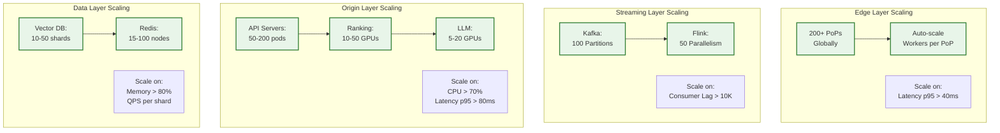
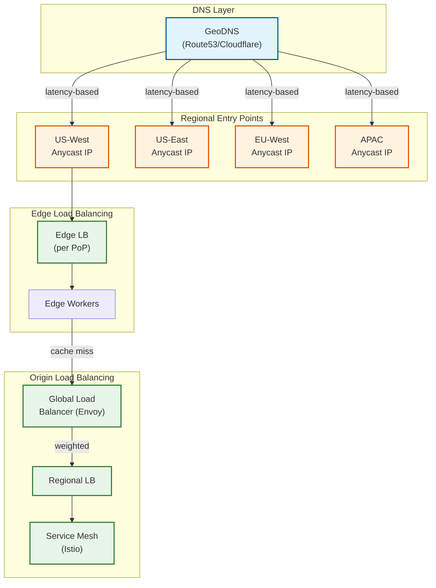
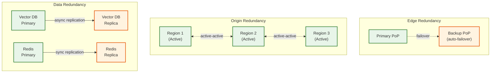
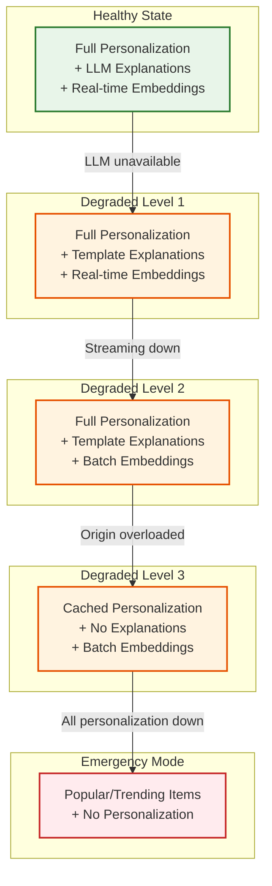
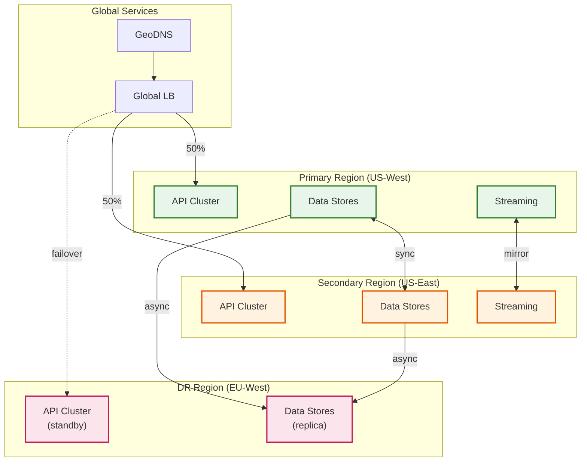

# Scalability & Reliability

## Scalability Strategy

### Horizontal Scaling by Component



### Edge Layer Scaling

| Component | Min | Max | Scale Trigger | Scale Speed |
|-----------|-----|-----|---------------|-------------|
| Edge PoPs | 200 | 300 | Geographic coverage | Manual (new region) |
| Workers per PoP | 10 | 1000 | Latency p95 > 40ms | 30 seconds |
| Edge Cache | 50GB | 200GB | Hit rate < 75% | Manual |
| Edge KV | 5GB | 20GB | Memory > 80% | Manual |

**Auto-scaling Configuration:**
```
HPA for Edge Workers:
  min_replicas: 10
  max_replicas: 1000
  metrics:
    - type: latency_p95
      target: 40ms
      scale_up_threshold: 50ms
      scale_down_threshold: 30ms
    - type: requests_per_second
      target: 10000
      scale_up_threshold: 12000
      scale_down_threshold: 8000

  scale_up_stabilization: 30s
  scale_down_stabilization: 300s
```

### Streaming Layer Scaling

| Component | Min | Max | Scale Trigger | Scale Speed |
|-----------|-----|-----|---------------|-------------|
| Kafka Partitions | 100 | 500 | Producer throughput | Manual (rebalance) |
| Flink Parallelism | 50 | 200 | Consumer lag > 10K | 2 minutes |
| Checkpoint Interval | 60s | 300s | State size | Manual |
| State Backend | 1TB | 10TB | Memory pressure | Manual |

**Flink Scaling:**
```
Reactive Scaling:
  - Monitor consumer lag via Kafka metrics
  - Trigger scale-up when lag exceeds 10K events
  - Trigger scale-down when lag < 1K for 10 minutes
  - Use incremental checkpointing to minimize restart time

Parallelism Strategy:
  - Event Router: parallelism = Kafka partitions
  - Context Aggregator: parallelism = active_users / 50K
  - Embedding Streamer: parallelism = events_per_second / 1000
```

### Origin Layer Scaling

| Component | Min | Max | Scale Trigger | Scale Speed |
|-----------|-----|-----|---------------|-------------|
| API Servers | 50 | 500 | CPU > 70%, Latency > 80ms | 60 seconds |
| Ranking Servers | 10 | 100 | GPU util > 70% | 5 minutes |
| Bandit Servers | 10 | 50 | CPU > 60% | 60 seconds |
| LLM Servers | 5 | 50 | Queue depth > 100 | 5 minutes |

**GPU Scaling Considerations:**
```
Ranking GPU Scaling:
  - Use GPU fractional allocation (MIG)
  - Batch size optimization: 64-256 items
  - Model quantization: INT8 for inference
  - Spot instances for cost optimization (70% savings)

LLM GPU Scaling:
  - Pre-warm instances during low traffic
  - Use smaller models during peak (7B vs 70B)
  - Queue-based admission control
  - Reserved capacity for premium users
```

### Data Layer Scaling

| Component | Min | Max | Scale Trigger | Scale Speed |
|-----------|-----|-----|---------------|-------------|
| Vector DB Shards | 10 | 100 | QPS per shard > 5K | Manual (rebalance) |
| Redis Nodes | 15 | 200 | Memory > 80% | 5 minutes |
| Redis Cluster Slots | 16384 | 16384 | Fixed | N/A |

**Vector DB Sharding Strategy:**
```
Sharding Key: hash(user_id) % num_shards

Rebalancing:
  1. Add new shards (empty)
  2. Split hash ranges
  3. Background migration (no downtime)
  4. Update routing table
  5. Remove old shard assignments

Shard Sizing:
  - Target: 10M vectors per shard
  - Max: 50M vectors per shard
  - Memory: ~20GB per 10M vectors (512d)
```

---

## Load Balancing Strategy

### Global Load Balancing



**Load Balancing Algorithms:**

| Layer | Algorithm | Rationale |
|-------|-----------|-----------|
| GeoDNS | Latency-based | Route to nearest PoP |
| Edge | Round-robin | Stateless workers |
| Origin API | Weighted round-robin | Handle heterogeneous instances |
| Ranking | Least connections | GPU-bound, variable duration |
| LLM | Queue-based | Long-running requests |

### Session Affinity

```
Edge Layer:
  - No affinity (stateless, cache is per-user keyed)

Origin Layer:
  - Soft affinity via consistent hashing
  - Key: hash(user_id) for context locality
  - Failover: Any node can serve any user

Streaming Layer:
  - Partition affinity (Kafka key = user_id)
  - State locality maintained by stream processor
```

---

## Fault Tolerance

### Redundancy Strategy



**Redundancy Configuration:**

| Component | Redundancy | Replication | Failover Time |
|-----------|------------|-------------|---------------|
| Edge PoPs | N+1 per region | CDN-managed | <5 seconds |
| API Servers | 3x per region | Stateless | <30 seconds |
| Ranking Servers | 2x per region | Stateless | <60 seconds |
| LLM Servers | 2x per region | Stateless | <60 seconds |
| Vector DB | 2x replicas | Async | <30 seconds |
| Redis | 3x replicas | Semi-sync | <10 seconds |
| Kafka | 3x replicas | Sync (ISR) | <30 seconds |

### Failover Mechanisms

**Edge Failover:**
```
Trigger: Health check failure (3 consecutive)
Action:
  1. DNS removes unhealthy PoP (TTL=60s)
  2. Traffic routes to next-nearest PoP
  3. Alert on-call team
Recovery:
  1. Health checks pass (5 consecutive)
  2. Gradual traffic shift (10% → 50% → 100%)
```

**Origin Failover:**
```
Trigger: Region health < 50%
Action:
  1. Global LB shifts traffic to healthy regions
  2. Circuit breaker opens for failing services
  3. Graceful degradation activates
Recovery:
  1. Region health > 80%
  2. Circuit breaker half-open (10% traffic)
  3. Full traffic restoration
```

**Data Failover:**
```
Vector DB:
  Trigger: Primary unreachable for 30s
  Action: Promote replica to primary
  Recovery: Original primary becomes replica after sync

Redis:
  Trigger: Sentinel detects primary failure
  Action: Automatic failover via Sentinel
  Recovery: Old primary rejoins as replica
```

### Circuit Breaker Pattern

```
Circuit Breaker States:
  CLOSED (normal):
    - All requests pass through
    - Track failure rate

  OPEN (failing):
    - Requests fail fast
    - Return fallback response
    - Timer starts

  HALF-OPEN (testing):
    - Allow limited requests
    - If success: → CLOSED
    - If failure: → OPEN

Configuration:
  failure_threshold: 50%
  failure_count_threshold: 10
  timeout_duration: 30s
  half_open_requests: 5

Applied to:
  - Vector DB queries
  - LLM inference
  - External APIs
  - Cross-region calls
```

### Graceful Degradation



**Degradation Triggers:**

| Level | Trigger | User Impact | Duration Tolerance |
|-------|---------|-------------|-------------------|
| Level 1 | LLM latency > 300ms | No explanations | Hours |
| Level 2 | Streaming lag > 1 hour | Stale embeddings | Hours |
| Level 3 | Origin latency > 200ms | Cached results | Minutes |
| Emergency | All services down | No personalization | Minutes |

---

## Disaster Recovery

### Recovery Objectives

| Metric | Target | Justification |
|--------|--------|---------------|
| **RTO (Recovery Time Objective)** | <15 minutes | Business continuity |
| **RPO (Recovery Point Objective)** | <5 minutes | Minimal data loss |
| **MTTR (Mean Time to Recovery)** | <30 minutes | Service restoration |

### Backup Strategy

```
Continuous Backups:
  Vector DB:
    - Continuous replication to DR region
    - Point-in-time recovery: 7 days
    - Snapshot: Every 6 hours

  Redis:
    - AOF persistence (every 1 second)
    - RDB snapshot: Every 1 hour
    - Cross-region backup: Every 15 minutes

  Kafka:
    - 3x replication (ISR)
    - Log retention: 7 days
    - Cross-region mirroring: Real-time

  Configuration:
    - GitOps (all config in Git)
    - Encrypted secrets in Vault
    - Infrastructure as Code (Terraform)

Model Artifacts:
  - Model Registry with versioning
  - Cross-region replication
  - Retention: Last 10 versions
```

### Multi-Region Strategy



**Active-Active Configuration:**
- US-West and US-East: Both serve production traffic (50/50)
- EU-West: Warm standby for DR (serves EU traffic, can absorb US)
- Data sync: Bi-directional between US regions, unidirectional to EU

### DR Runbook

```
Scenario: US-West Region Failure

Detection (0-2 min):
  1. Health checks fail for US-West
  2. Alerts fire (PagerDuty)
  3. On-call acknowledges

Assessment (2-5 min):
  1. Verify failure scope (partial vs full)
  2. Check data replication status
  3. Assess impact (users affected)

Failover (5-15 min):
  1. DNS: Shift US-West traffic to US-East
  2. GLB: Update weights (US-West: 0%, US-East: 100%)
  3. Kafka: Promote US-East as leader for mirrored topics
  4. Monitor: Confirm traffic shift complete

Validation (15-30 min):
  1. Verify all services healthy
  2. Check personalization quality
  3. Monitor error rates
  4. Confirm customer impact minimized

Recovery (Post-incident):
  1. Root cause analysis
  2. US-West restoration
  3. Data reconciliation
  4. Traffic rebalancing
```

---

## Capacity Planning

### Growth Projections

| Metric | Current | Year 1 | Year 2 | Year 3 |
|--------|---------|--------|--------|--------|
| MAU | 100M | 150M | 225M | 340M |
| Peak QPS | 500K | 750K | 1.1M | 1.7M |
| Items | 10M | 15M | 22M | 33M |
| Events/day | 1.8B | 2.7B | 4B | 6B |
| Storage | 30TB | 45TB | 68TB | 100TB |

### Capacity Planning Process

```
Quarterly Capacity Review:

1. Collect Metrics:
   - Current utilization by component
   - Growth trends (MAU, QPS, storage)
   - Seasonality patterns

2. Project Demand:
   - Apply growth rate to current usage
   - Account for new features
   - Model seasonal peaks (holidays, events)

3. Plan Capacity:
   - Add 30% headroom for peaks
   - Lead time: 4-8 weeks for hardware
   - Budget approval for major changes

4. Execute:
   - Pre-provision before growth
   - Test with load testing
   - Monitor after deployment

5. Review:
   - Compare projected vs actual
   - Adjust models
   - Document learnings
```

### Auto-scaling vs Pre-provisioning

| Component | Strategy | Rationale |
|-----------|----------|-----------|
| Edge Workers | Auto-scale | Fast scale, stateless |
| API Servers | Auto-scale | Fast scale, stateless |
| Streaming | Pre-provision + Auto | State migration cost |
| GPU (Ranking) | Pre-provision | Long startup time |
| GPU (LLM) | Pre-provision | Long startup time |
| Vector DB | Pre-provision | Rebalancing cost |
| Redis | Pre-provision | Data migration cost |

---

## Performance Optimization

### Caching Strategy

```
Cache Hierarchy:

L1 - Edge Cache (per PoP):
  Type: Personalized responses
  TTL: 5-15 minutes
  Hit rate: 80%
  Size: 100GB per PoP

L2 - Edge KV (per PoP):
  Type: User context, embeddings
  TTL: 1 hour
  Hit rate: 90%
  Size: 10GB per PoP

L3 - Origin Cache (Redis):
  Type: Features, bandit params
  TTL: Varies (1h - 24h)
  Hit rate: 95%
  Size: 1TB cluster

L4 - Local Cache (in-process):
  Type: Model weights, config
  TTL: Until update
  Hit rate: 99%
  Size: 1GB per pod
```

### Query Optimization

```
Vector DB Optimization:
  - Use HNSW with ef_search=100 (balance recall/latency)
  - Pre-filter with metadata before ANN search
  - Batch queries when possible (ranking stage)
  - Use product quantization for memory efficiency

Redis Optimization:
  - Pipeline commands (reduce round trips)
  - Use MGET for batch reads
  - Lua scripts for complex operations
  - Cluster mode for horizontal scale

API Optimization:
  - gRPC for internal services (50% latency reduction)
  - Connection pooling
  - Request coalescing for duplicate requests
  - Response streaming for large results
```

### Resource Optimization

```
GPU Optimization:
  - INT8 quantization (2x throughput)
  - Dynamic batching (maximize utilization)
  - Model sharding across GPUs
  - Prioritize inference over training

Memory Optimization:
  - Embedding compression (float32 → float16)
  - LRU eviction for caches
  - Off-heap storage for large state
  - Memory-mapped files for indexes

Network Optimization:
  - Compression for inter-service calls
  - Regional affinity to reduce cross-region traffic
  - CDN for static assets
  - HTTP/2 multiplexing
```
