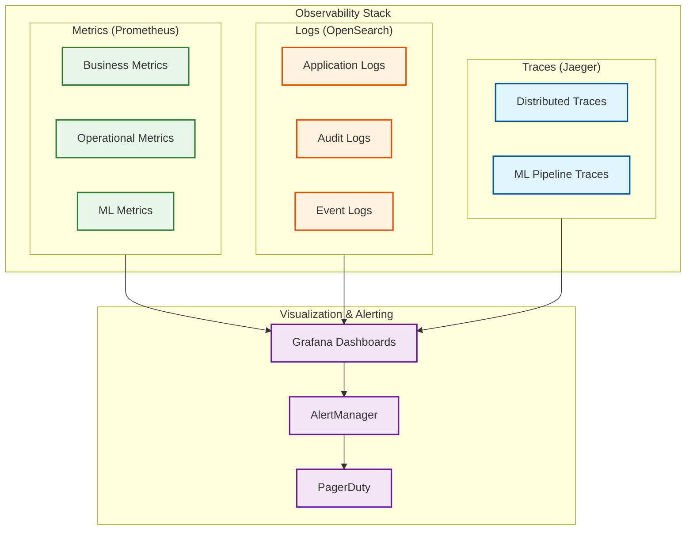
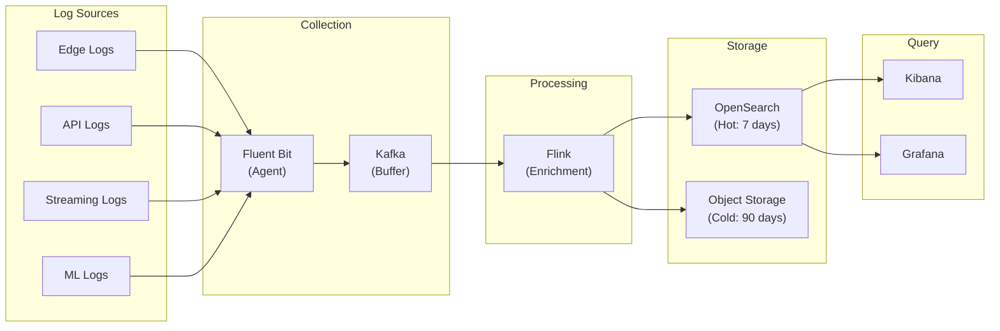

# Observability

## Metrics Strategy

### Three Pillars Overview



---

## Business Metrics

### Personalization Effectiveness

| Metric | Definition | Target | Measurement |
|--------|------------|--------|-------------|
| **Personalization Lift** | (personalized - baseline) / baseline | >15% | A/B test |
| **Click-Through Rate (CTR)** | clicks / impressions | Varies by context | Real-time |
| **Conversion Rate** | conversions / impressions | Varies by context | Real-time |
| **Engagement Time** | Total time spent with personalized content | +20% vs baseline | Session tracking |
| **Return Rate** | Users who return within 7 days | >30% | Cohort analysis |

### Content Quality Metrics

| Metric | Definition | Target | Alert Threshold |
|--------|------------|--------|-----------------|
| **Catalog Coverage** | Unique items shown / total items | >60% | <40% |
| **Diversity Score** | 1 - (Σ(category_share²)) | >0.7 | <0.5 |
| **Novelty Score** | % items user hasn't seen before | 20-40% | <10% or >60% |
| **Freshness** | % items created in last 7 days | >10% | <5% |
| **Serendipity** | % unexpected but liked items | 5-15% | <3% |

### Prometheus Metrics Definition

```
# Personalization request metrics
personalization_requests_total{tier="edge|origin|llm", status="success|error"}
personalization_request_duration_seconds{tier, quantile="0.5|0.95|0.99"}

# Business outcome metrics
personalization_clicks_total{source="personalized|baseline"}
personalization_conversions_total{source="personalized|baseline"}
personalization_engagement_seconds{source="personalized|baseline"}

# Content quality metrics
personalization_catalog_coverage_ratio
personalization_diversity_score
personalization_novelty_ratio
personalization_freshness_ratio

# Exploration metrics
personalization_exploration_rate{algorithm="thompson|random"}
personalization_exploration_reward_total
personalization_exploitation_reward_total
```

---

## Operational Metrics (RED/USE)

### RED Metrics (Request-Oriented)

| Component | Rate | Errors | Duration |
|-----------|------|--------|----------|
| **Edge** | `edge_requests_total` | `edge_errors_total` | `edge_latency_seconds` |
| **Origin API** | `api_requests_total` | `api_errors_total` | `api_latency_seconds` |
| **Retrieval** | `retrieval_requests_total` | `retrieval_errors_total` | `retrieval_latency_seconds` |
| **Ranking** | `ranking_requests_total` | `ranking_errors_total` | `ranking_latency_seconds` |
| **Bandit** | `bandit_requests_total` | `bandit_errors_total` | `bandit_latency_seconds` |
| **LLM** | `llm_requests_total` | `llm_errors_total` | `llm_latency_seconds` |

### USE Metrics (Resource-Oriented)

| Resource | Utilization | Saturation | Errors |
|----------|-------------|------------|--------|
| **CPU** | `cpu_usage_percent` | `cpu_throttle_seconds` | N/A |
| **Memory** | `memory_usage_bytes` | `memory_oom_kills` | `memory_errors` |
| **GPU** | `gpu_utilization_percent` | `gpu_memory_used` | `gpu_errors` |
| **Network** | `network_bytes_total` | `network_queue_length` | `network_errors` |
| **Disk** | `disk_usage_percent` | `disk_io_wait` | `disk_errors` |

### Prometheus Metrics Definition

```
# Edge tier
edge_requests_total{pop="sfo|nyc|fra", cache="hit|miss"}
edge_latency_seconds{pop, quantile}
edge_cache_hit_ratio{pop}
edge_cache_size_bytes{pop}

# Origin tier
api_requests_total{endpoint="/personalize|/feedback|/explain", status_code}
api_latency_seconds{endpoint, quantile}
api_concurrent_requests{endpoint}

# Streaming tier
streaming_events_processed_total{processor="embed|context|bandit"}
streaming_lag_seconds{consumer_group}
streaming_checkpoint_duration_seconds
streaming_state_size_bytes

# Data tier
vectordb_queries_total{operation="search|upsert"}
vectordb_latency_seconds{operation, quantile}
redis_commands_total{command}
redis_latency_seconds{command, quantile}
redis_memory_used_bytes
kafka_consumer_lag{topic, partition}
```

---

## ML Metrics

### Embedding Quality

| Metric | Definition | Target | Alert |
|--------|------------|--------|-------|
| **Embedding Freshness** | Time since last update | <60s (active users) | >300s |
| **Embedding Staleness Rate** | % users with stale embeddings | <5% | >15% |
| **Embedding Coverage** | Users with embeddings / total users | >95% | <90% |
| **Embedding Drift** | Cosine distance from baseline | <0.1 | >0.2 |

### Bandit Performance

| Metric | Definition | Target | Alert |
|--------|------------|--------|-------|
| **Cumulative Regret** | (optimal - actual) reward | <10% | >20% |
| **Exploration Rate** | Exploration actions / total | 5-15% | <3% or >25% |
| **Posterior Uncertainty** | Avg uncertainty across items | Decreasing | Increasing |
| **Arm Pull Distribution** | Gini coefficient of item impressions | <0.8 | >0.9 |
| **Cold Item Coverage** | New items with >10 impressions | >80% in 24h | <50% |

### Model Quality

| Metric | Definition | Target | Alert |
|--------|------------|--------|-------|
| **Ranking NDCG@10** | Normalized DCG at position 10 | >0.7 | <0.6 |
| **Retrieval Recall@100** | Relevant items in top 100 | >0.9 | <0.8 |
| **LLM Response Quality** | Human eval score (1-5) | >4.0 | <3.5 |
| **Feature Drift** | KL divergence from training | <0.1 | >0.2 |
| **Prediction Confidence** | Avg model confidence | >0.7 | <0.5 |

### Prometheus Metrics Definition

```
# Embedding metrics
embedding_freshness_seconds{user_segment="power|active|casual"}
embedding_staleness_rate
embedding_coverage_ratio
embedding_drift_score

# Bandit metrics
bandit_cumulative_regret
bandit_exploration_rate
bandit_posterior_uncertainty{item_segment}
bandit_arm_pull_distribution_gini
bandit_cold_item_coverage_ratio

# Model metrics
model_ndcg_score{model_version}
model_recall_score{model_version, k="10|100|1000"}
model_confidence_score{model_version, quantile}
model_feature_drift_score{feature_name}
model_inference_latency_seconds{model_name, quantile}

# LLM metrics
llm_invocation_rate
llm_cache_hit_rate
llm_response_tokens{quantile}
llm_quality_score
llm_cost_dollars_total
```

---

## Logging Strategy

### Log Levels

| Level | Use Case | Example |
|-------|----------|---------|
| **ERROR** | Failures requiring attention | API error, model failure |
| **WARN** | Degraded but functioning | Cache miss, fallback used |
| **INFO** | Normal operations | Request processed, model deployed |
| **DEBUG** | Detailed debugging | Feature values, scores |
| **TRACE** | Ultra-detailed | Algorithm steps, intermediate values |

### Structured Log Format

```json
{
  "timestamp": "2026-01-29T10:30:00.123Z",
  "level": "INFO",
  "service": "personalization-api",
  "instance": "api-pod-xyz",
  "trace_id": "abc123",
  "span_id": "def456",
  "user_id_hash": "sha256:...",  // Never log raw user_id
  "request_id": "req-789",
  "event": "personalization_complete",
  "metrics": {
    "latency_ms": 45,
    "candidates_retrieved": 500,
    "candidates_ranked": 100,
    "tier": "edge",
    "cache_hit": true
  },
  "context": {
    "device": "mobile",
    "geo": "us-west",
    "page_type": "home"
  }
}
```

### What to Log (and What NOT to Log)

**DO Log:**
- Request IDs and trace IDs
- Latencies and performance metrics
- Error messages and stack traces
- Model versions and configurations
- Business events (anonymized)

**DO NOT Log:**
- Raw user IDs (use hashed)
- Actual recommendations (privacy)
- API keys or tokens
- Full embedding vectors
- PII or sensitive data

### Log Aggregation Pipeline



---

## Distributed Tracing

### Trace Propagation

```
Trace Context Headers:
  traceparent: 00-{trace_id}-{span_id}-{flags}
  tracestate: vendor=value

Propagation Path:
  Client → Edge → Origin API → Retrieval → Ranking → LLM

Span Naming Convention:
  {service}.{operation}
  Examples:
    - edge.personalize
    - api.validate_request
    - retrieval.ann_search
    - ranking.score_candidates
    - llm.generate_explanation
```

### Key Spans to Instrument

| Span Name | Parent | Attributes |
|-----------|--------|------------|
| `edge.personalize` | root | cache_hit, pop_location |
| `edge.cache_lookup` | edge.personalize | key, hit/miss |
| `edge.score` | edge.personalize | model_version, latency |
| `api.personalize` | edge.personalize | tier, user_segment |
| `context.build` | api.personalize | feature_count, latency |
| `retrieval.candidates` | api.personalize | sources, candidate_count |
| `retrieval.ann_search` | retrieval.candidates | index, top_k, latency |
| `ranking.score` | api.personalize | model, batch_size |
| `bandit.sample` | api.personalize | algorithm, exploration |
| `llm.reason` | api.personalize | model, tokens, cached |

### Trace Sampling Strategy

```
Sampling Rules:
  1. Always sample errors (100%)
  2. Always sample slow requests (>200ms) (100%)
  3. Always sample LLM requests (100%)
  4. Sample normal requests (1%)
  5. Sample edge-only requests (0.1%)

Head-based Sampling:
  - Decision at root span
  - Consistent across all services
  - Reduces storage cost

Tail-based Sampling (for errors):
  - Collect all spans initially
  - Decide to keep after request complete
  - Keeps error traces that would be missed
```

---

## Alerting

### Alert Categories

#### Critical Alerts (Page-Worthy)

| Alert | Condition | Response |
|-------|-----------|----------|
| **Availability < 99%** | Error rate > 1% for 5 min | Immediate investigation |
| **Latency Spike** | p95 > 150ms for 5 min | Scale or investigate |
| **Data Pipeline Down** | No events for 5 min | Check Kafka/Flink |
| **Model Serving Failed** | 100% model errors | Rollback model |
| **LLM Unavailable** | 100% LLM errors for 2 min | Switch to fallback |

#### Warning Alerts (Notify)

| Alert | Condition | Response |
|-------|-----------|----------|
| **Latency Elevated** | p95 > 100ms for 15 min | Monitor, prepare to scale |
| **Cache Hit Rate Low** | <70% for 30 min | Investigate cache config |
| **Embedding Staleness** | >20% stale for 30 min | Check streaming pipeline |
| **Bandit Regret High** | >15% for 1 hour | Review bandit params |
| **LLM Cost Overrun** | >120% daily budget | Review invocation rate |

#### Informational Alerts (Log)

| Alert | Condition | Action |
|-------|-----------|--------|
| **Model Deployed** | New version live | Log for tracking |
| **Traffic Spike** | 2x normal | Monitor |
| **Region Failover** | Traffic shifted | Document |

### Alert Configuration (Prometheus/AlertManager)

```yaml
groups:
  - name: personalization_critical
    rules:
      - alert: HighErrorRate
        expr: |
          sum(rate(api_requests_total{status_code=~"5.."}[5m]))
          /
          sum(rate(api_requests_total[5m])) > 0.01
        for: 5m
        labels:
          severity: critical
        annotations:
          summary: "High error rate detected"
          description: "Error rate is {{ $value | humanizePercentage }}"

      - alert: HighLatency
        expr: |
          histogram_quantile(0.95,
            sum(rate(api_latency_seconds_bucket[5m])) by (le)
          ) > 0.15
        for: 5m
        labels:
          severity: critical
        annotations:
          summary: "High latency detected"
          description: "P95 latency is {{ $value | humanizeDuration }}"

      - alert: EmbeddingPipelineDown
        expr: |
          sum(rate(streaming_events_processed_total{processor="embed"}[5m])) == 0
        for: 5m
        labels:
          severity: critical
        annotations:
          summary: "Embedding pipeline stopped"

  - name: personalization_warning
    rules:
      - alert: LowCacheHitRate
        expr: edge_cache_hit_ratio < 0.7
        for: 30m
        labels:
          severity: warning
        annotations:
          summary: "Cache hit rate below threshold"

      - alert: HighBanditRegret
        expr: bandit_cumulative_regret > 0.15
        for: 1h
        labels:
          severity: warning
        annotations:
          summary: "Bandit regret exceeds threshold"
```

---

## Dashboards

### Executive Dashboard

```
┌─────────────────────────────────────────────────────────────────┐
│                    PERSONALIZATION KPIs                          │
├─────────────────────────────────────────────────────────────────┤
│  Personalization Lift: +18%    │  CTR: 4.2% (+0.3%)             │
│  Conversion Rate: 2.1% (+0.2%) │  Revenue Impact: +$1.2M        │
├─────────────────────────────────────────────────────────────────┤
│  [Graph: Daily Lift Over Time]  │  [Graph: CTR by Segment]      │
├─────────────────────────────────────────────────────────────────┤
│  Active Users: 28M             │  Requests Today: 1.2B          │
│  Edge Hit Rate: 82%            │  Avg Latency: 32ms             │
└─────────────────────────────────────────────────────────────────┘
```

### Operations Dashboard

```
┌─────────────────────────────────────────────────────────────────┐
│                    SYSTEM HEALTH                                 │
├─────────────────────────────────────────────────────────────────┤
│  Edge: ✓ Healthy (200 PoPs)    │  Origin: ✓ Healthy (3 regions) │
│  Streaming: ✓ Lag: 2.3s        │  LLM: ✓ Available (5% usage)   │
├─────────────────────────────────────────────────────────────────┤
│  [Graph: Latency p50/p95/p99]  │  [Graph: QPS by Tier]          │
├─────────────────────────────────────────────────────────────────┤
│  [Graph: Error Rate]           │  [Graph: Cache Hit Rate]       │
├─────────────────────────────────────────────────────────────────┤
│  CPU: 45% │ Memory: 62% │ GPU: 58% │ Network: 30%               │
└─────────────────────────────────────────────────────────────────┘
```

### ML Dashboard

```
┌─────────────────────────────────────────────────────────────────┐
│                    ML METRICS                                    │
├─────────────────────────────────────────────────────────────────┤
│  Embedding Freshness: 23s avg  │  Staleness Rate: 3.2%          │
│  Bandit Regret: 7.8%           │  Exploration: 11%              │
├─────────────────────────────────────────────────────────────────┤
│  [Graph: Embedding Freshness]  │  [Graph: Bandit Reward]        │
├─────────────────────────────────────────────────────────────────┤
│  [Graph: Feature Drift]        │  [Graph: Model Confidence]     │
├─────────────────────────────────────────────────────────────────┤
│  Model Version: v2.3.1         │  Last Deploy: 2h ago           │
│  NDCG@10: 0.73                 │  Recall@100: 0.91              │
└─────────────────────────────────────────────────────────────────┘
```

---

## Runbook References

### Runbook: High Latency

```
Symptoms:
  - Alert: HighLatency (p95 > 150ms)
  - User complaints about slow recommendations

Diagnosis:
  1. Check which tier is slow (edge vs origin)
     → Dashboard: Latency by Tier
  2. Check for traffic spike
     → Dashboard: QPS
  3. Check resource utilization
     → Dashboard: CPU/Memory/GPU

Resolution:
  If edge slow:
    → Check cache hit rate
    → Check edge worker count
    → Consider cache warming

  If origin slow:
    → Check ranking GPU utilization
    → Check feature store latency
    → Consider scaling ranking pods

  If LLM slow:
    → Check LLM queue depth
    → Switch to smaller model
    → Increase fallback rate

Escalation:
  → If unresolved in 15 min, page on-call
```

### Runbook: Embedding Pipeline Failure

```
Symptoms:
  - Alert: EmbeddingPipelineDown
  - Increasing embedding staleness

Diagnosis:
  1. Check Kafka consumer lag
     → kafka_consumer_lag{topic="user-events"}
  2. Check Flink job status
     → Flink dashboard / kubectl get pods
  3. Check Vector DB health
     → vectordb_health_status

Resolution:
  If Kafka issue:
    → Check broker health
    → Restart consumers if stuck
    → Verify partition assignment

  If Flink issue:
    → Check for exceptions in logs
    → Restart failed job
    → Restore from checkpoint

  If Vector DB issue:
    → Check write latency
    → Verify cluster health
    → Failover to replica if needed

Impact Mitigation:
  → Enable batch fallback embeddings
  → Increase edge cache TTL
  → Alert users of degraded personalization
```
