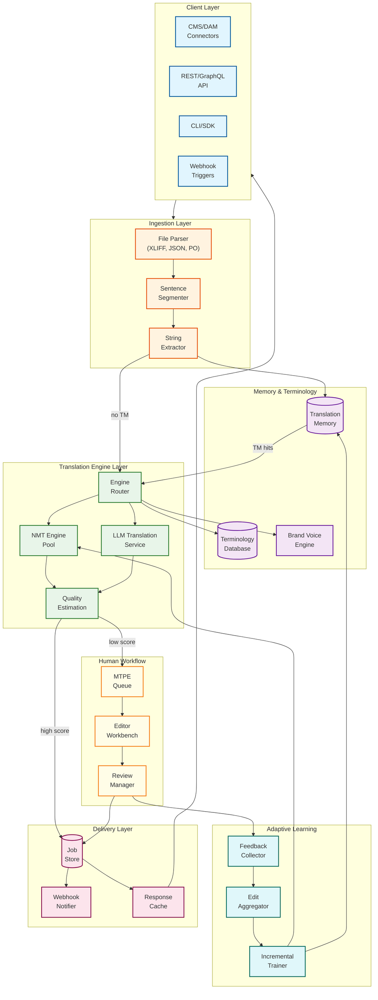
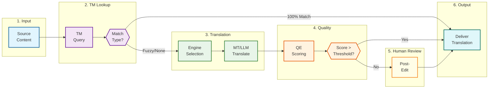
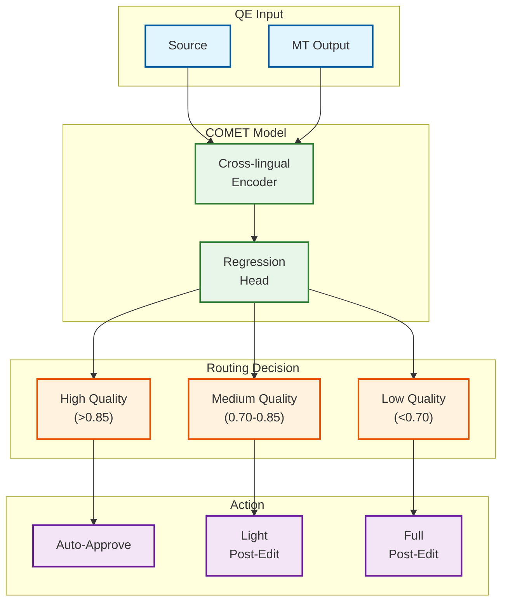

# AI-Native Translation & Localization Platform

## Overview

The **AI-Native Translation & Localization Platform** is a next-generation system that combines Neural Machine Translation (NMT), LLM-based translation, adaptive learning, and human-in-the-loop workflows to deliver high-quality, context-aware, brand-consistent translations at enterprise scale. Unlike traditional Translation Management Systems (TMS) that rely on single MT engines with manual post-editing, this platform intelligently orchestrates multiple translation engines, predicts quality in real-time using neural Quality Estimation (QE), and continuously learns from human corrections.

**Key Differentiator:** Combines intelligent engine orchestration (NMT vs LLM routing), neural Quality Estimation (COMET/CometKiwi), adaptive learning from human feedback, terminology injection with constrained decoding, and agentic workflow automation—all serving <500ms p95 translation latency while maintaining BLEU/COMET scores competitive with human translation.

---

## How This Differs from Traditional TMS

| Aspect | Traditional TMS | AI-Native Platform |
|--------|-----------------|-------------------|
| **Engine Selection** | Single MT engine for all content | Intelligent orchestration (NMT/LLM/hybrid per segment) |
| **Quality Assurance** | Post-hoc rule-based QA checks | Real-time neural QE scoring (COMET) |
| **Learning** | Manual TM maintenance, periodic retraining | Adaptive MT from real-time human feedback |
| **Terminology** | Static glossary lookup | Dynamic terminology injection + LLM context awareness |
| **Workflow Routing** | Manual assignment to translators | AI agents routing based on QE scores |
| **Context Handling** | Segment-level isolation | Document-level LLM reasoning |
| **Human Effort** | Full post-editing of all content | Targeted MTPE based on QE thresholds |
| **Quality Metrics** | Manual spot-checks, BLEU | Continuous COMET/QE scoring, human edit distance |

---

## System Characteristics

| Characteristic | Value | Implication |
|----------------|-------|-------------|
| Traffic Pattern | Write-heavy (translation jobs), Read-heavy (TM lookups) | Write-optimized job queue, read-optimized TM cache |
| Latency Target | <500ms p95 (MT), <100ms p95 (QE) | Streaming inference, batched QE |
| Consistency Model | Strong (TM writes), Eventual (adaptive model updates) | Sync TM commits, async model fine-tuning |
| Availability Target | 99.9% for translation API | Multi-region failover, degradation to cached TM |
| Durability | 99.999999% for TM segments | Replicated storage, backup TM snapshots |
| Scale Target | 50M words/day, 150+ language pairs, 500M+ TM segments | Sharded TM, distributed MT engines |

---

## Complexity Rating

| Component | Rating | Justification |
|-----------|--------|---------------|
| **Overall** | High | Multi-engine orchestration + neural QE + adaptive learning |
| Translation Engine Orchestrator | High | Dynamic routing decisions, multi-engine management |
| Quality Estimation Service | High | Neural model inference, calibration, threshold tuning |
| Translation Memory System | Medium-High | Fuzzy matching at scale, ICE detection, deduplication |
| Adaptive Learning Pipeline | High | Real-time feedback aggregation, incremental fine-tuning |
| Terminology Management | Medium | Glossary enforcement, constrained decoding |
| Human Workflow (MTPE) | Medium | Queue routing, workload balancing |
| Content Connectors | Medium | Multi-format parsing, webhook orchestration |

---

## Quick Navigation

| Document | Description |
|----------|-------------|
| [01 - Requirements & Estimations](./01-requirements-and-estimations.md) | Functional/non-functional requirements, capacity planning, SLOs |
| [02 - High-Level Design](./02-high-level-design.md) | Multi-tier architecture, engine orchestration, data flow |
| [03 - Low-Level Design](./03-low-level-design.md) | Data models, APIs, algorithms (fuzzy match, QE, routing) |
| [04 - Deep Dive & Bottlenecks](./04-deep-dive-and-bottlenecks.md) | QE pipeline, adaptive learning, terminology injection |
| [05 - Scalability & Reliability](./05-scalability-and-reliability.md) | Multi-region TM, LLM scaling, failover |
| [06 - Security & Compliance](./06-security-and-compliance.md) | PII handling, GDPR data residency, content security |
| [07 - Observability](./07-observability.md) | Translation quality metrics, COMET tracking, alerting |
| [08 - Interview Guide](./08-interview-guide.md) | 45-minute pacing, trap questions, trade-offs |

---

## Core Modules

| Module | Responsibility | Key Challenge |
|--------|----------------|---------------|
| **Content Ingestion** | File parsing, string extraction, segmentation | Multi-format support (XLIFF, JSON, PO, SRT) |
| **Translation Engine Orchestrator** | Route to optimal engine (NMT/LLM/hybrid) | Dynamic routing decisions, cost optimization |
| **NMT Engine Pool** | High-volume, consistent translation | Low latency, terminology consistency |
| **LLM Translation Service** | Context-aware, creative content | Latency management, prompt engineering |
| **Quality Estimation Service** | Neural QE scoring (COMET/CometKiwi) | Calibration, threshold tuning |
| **Translation Memory Store** | Fuzzy matching, ICE detection | Sub-100ms retrieval at 500M+ segments |
| **Terminology Database** | Glossary, style guide enforcement | Constrained decoding, brand voice |
| **MTPE Workbench** | Human post-editing interface | UX, real-time suggestions |
| **Adaptive Learning Pipeline** | Model updates from corrections | Incremental fine-tuning, staleness management |
| **Delivery Layer** | API, webhooks, CI/CD integration | Async job completion, rate limiting |

---

## Architecture Overview



---

## Translation Pipeline Flow



---

## Key Algorithms Comparison

| Algorithm | Use Case | Latency | Quality Impact | When to Use |
|-----------|----------|---------|----------------|-------------|
| **NMT (Neural MT)** | High-volume technical content | <200ms | High consistency | Documentation, UI strings, repetitive content |
| **LLM Translation** | Creative, context-heavy content | 500ms-2s | Higher fluency | Marketing, legal, nuanced content |
| **Fuzzy TM Match** | Leveraging existing translations | <50ms | Perfect for 100% | Any content with TM history |
| **COMET QE** | Quality prediction | <100ms | Routing accuracy | All MT output for human routing |
| **Adaptive Learning** | Model improvement | Async | Long-term quality | High-edit segments |
| **Constrained Decoding** | Terminology enforcement | +50ms | Brand consistency | Glossary-critical content |

---

## Quality Estimation Tiers



---

## When to Use This Design

**Use AI-Native Translation Platform When:**
- Enterprise scale with 10M+ words/month
- Multiple content types requiring different engines (technical vs creative)
- Quality requirements vary by content (legal vs internal docs)
- Human translators are a bottleneck—need intelligent routing
- Brand voice and terminology consistency is critical
- Continuous learning from corrections is valuable
- Integration with CI/CD pipelines is required

**Do NOT Use When:**
- Small-scale translation needs (<100K words/month)
- Single content type that works well with one MT engine
- Fully human translation is required (no MT acceptable)
- Budget doesn't support LLM inference costs
- Real-time latency (<100ms) is required (use simpler MT)

---

## Technology Stack Reference

| Layer | Technology Options | Selection Criteria |
|-------|-------------------|-------------------|
| **NMT Engines** | Language Weaver, Google NMT, DeepL, ModernMT | Language coverage, adaptive learning support |
| **LLM Translation** | GPT-4, Claude, Gemini, fine-tuned Llama | Quality, latency, cost per token |
| **Quality Estimation** | COMET, CometKiwi, OpenKiwi, Language Weaver MTQE | Accuracy, calibration, speed |
| **Translation Memory** | Postgres + pgvector, Elasticsearch, Memsource | Fuzzy match speed, scalability |
| **Terminology** | TermBase, SDL Trados, Custom glossary service | Integration, constrained decoding support |
| **Workflow Engine** | Temporal, Apache Airflow, custom state machine | Complexity, human-in-loop support |
| **Job Queue** | Kafka, RabbitMQ, SQS | Throughput, ordering guarantees |
| **API Gateway** | Kong, AWS API Gateway, custom | Rate limiting, auth, routing |

---

## Key Numbers

| Metric | Value | Context |
|--------|-------|---------|
| Translation latency (NMT) p95 | <200ms | Single segment |
| Translation latency (LLM) p95 | <2s | With context window |
| QE inference p95 | <100ms | Per segment |
| TM lookup p95 | <50ms | Fuzzy match at 500M segments |
| Words per day capacity | 50M | Enterprise scale |
| Language pairs supported | 150+ | Major and long-tail languages |
| TM segment storage | 500M+ | 10+ years enterprise TM |
| QE threshold for auto-approve | >0.85 COMET | Configurable per project |
| Human edit ratio target | <30% | Segments requiring MTPE |
| Adaptive learning latency | <24 hours | From correction to model update |

---

## Interview Readiness Checklist

- [ ] Can explain the trade-offs between NMT and LLM translation (speed/cost vs quality/context)
- [ ] Understand how neural Quality Estimation (COMET) works and its limitations
- [ ] Know fuzzy matching algorithms (Levenshtein, TM-specific scoring)
- [ ] Can design engine routing logic (content type, domain, quality requirements)
- [ ] Understand adaptive learning from human corrections (online vs batch)
- [ ] Know terminology enforcement techniques (constrained decoding, glossary injection)
- [ ] Can discuss MTPE workflow optimization (light vs full post-edit)
- [ ] Understand TM scaling challenges (sharding, replication, cache invalidation)
- [ ] Know GDPR implications for translation data (data residency, PII in content)
- [ ] Can design graceful degradation (LLM fallback to NMT, MT fallback to TM)

---

## Real-World References

| Company/Product | Key Innovation |
|-----------------|----------------|
| **Unbabel** | TowerLLM outperforming GPT-4, CometKiwi QE, 100K+ translator community |
| **Language Weaver (RWS)** | Adaptive NMT, MTQE models, 500K words/minute processing |
| **LILT** | Interactive adaptive MT, real-time learning from keystrokes |
| **Smartling** | Multi-MT orchestration, 15+ MT providers, GDN for web |
| **Phrase (Memsource)** | Enterprise TMS, extensive integrations, TMS analytics |
| **ModernMT** | Open-source adaptive NMT, continuous learning architecture |
| **Lokalise** | Developer-focused, Git integration, AI-powered workflows |
| **DeepL** | High-quality NMT, document translation, glossary support |

---

## Quick Reference Card

```
+------------------------------------------------------------------------+
|    AI-NATIVE TRANSLATION & LOCALIZATION PLATFORM - QUICK REFERENCE      |
+------------------------------------------------------------------------+
|                                                                         |
|  TRANSLATION PIPELINE                                                   |
|  --------------------                                                   |
|  1. Content → Parse → Segment → Extract strings                        |
|  2. TM Lookup → 100% match? → Use cached translation                   |
|  3. Engine Selection → NMT (technical) or LLM (creative)               |
|  4. Quality Estimation → COMET score per segment                       |
|  5. Routing → High QE auto-approve, Low QE → Human MTPE               |
|  6. Delivery → Webhook notification, CI/CD integration                 |
|                                                                         |
+------------------------------------------------------------------------+
|                                                                         |
|  ENGINE SELECTION                      QUALITY THRESHOLDS              |
|  ----------------                      -------------------              |
|  NMT: Technical docs, UI strings,      > 0.85 COMET: Auto-approve      |
|       repetitive content               0.70-0.85: Light MTPE           |
|  LLM: Marketing, legal, creative,      < 0.70: Full MTPE               |
|       context-heavy content            < 0.50: Re-translate            |
|                                                                         |
+------------------------------------------------------------------------+
|                                                                         |
|  KEY METRICS                           LATENCY TARGETS                 |
|  -----------                           ---------------                  |
|  * Words/day: 50M                      * NMT: <200ms p95               |
|  * Language pairs: 150+                * LLM: <2s p95                  |
|  * TM segments: 500M+                  * QE: <100ms p95                |
|  * Human edit ratio: <30%              * TM lookup: <50ms p95          |
|                                                                         |
+------------------------------------------------------------------------+
|                                                                         |
|  INTERVIEW KEYWORDS                                                     |
|  ------------------                                                     |
|  NMT vs LLM, COMET, CometKiwi, Quality Estimation, Translation Memory, |
|  fuzzy matching, ICE match, MTPE, adaptive learning, constrained       |
|  decoding, terminology injection, engine orchestration, BLEU, TER      |
|                                                                         |
+------------------------------------------------------------------------+
```

---

## Related Systems

- [3.15 RAG System](../3.15-rag-system/00-index.md) - Context retrieval for LLM translation
- [3.21 LLM Gateway](../3.21-llm-gateway-prompt-management/00-index.md) - LLM routing and cost optimization
- [3.23 LLM Inference Engine](../3.23-llm-inference-engine/00-index.md) - Efficient LLM serving
- [3.25 AI Observability & LLMOps](../3.25-ai-observability-llmops-platform/00-index.md) - Translation quality monitoring
- [3.31 AI-Native Document Processing](../3.31-ai-native-document-processing-platform/00-index.md) - Content extraction
- [2.6 Distributed Job Scheduler](../2.6-distributed-job-scheduler/00-index.md) - Translation job orchestration
