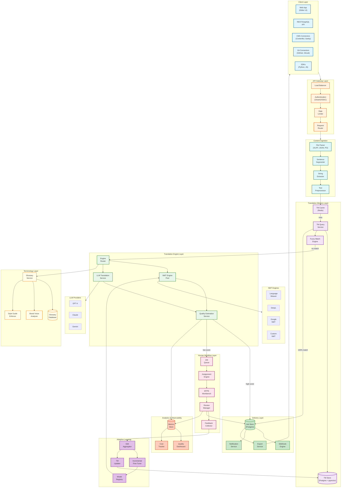
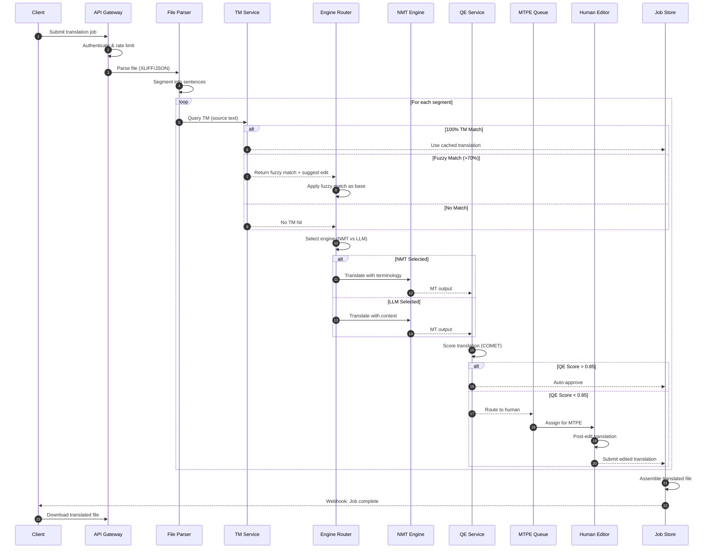
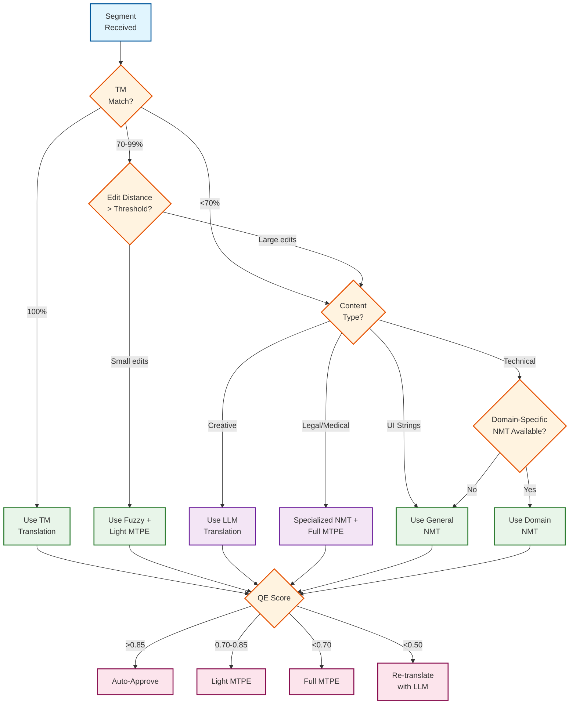
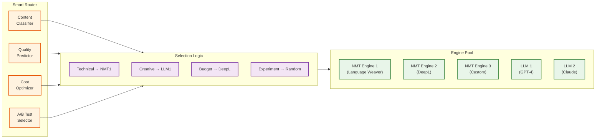
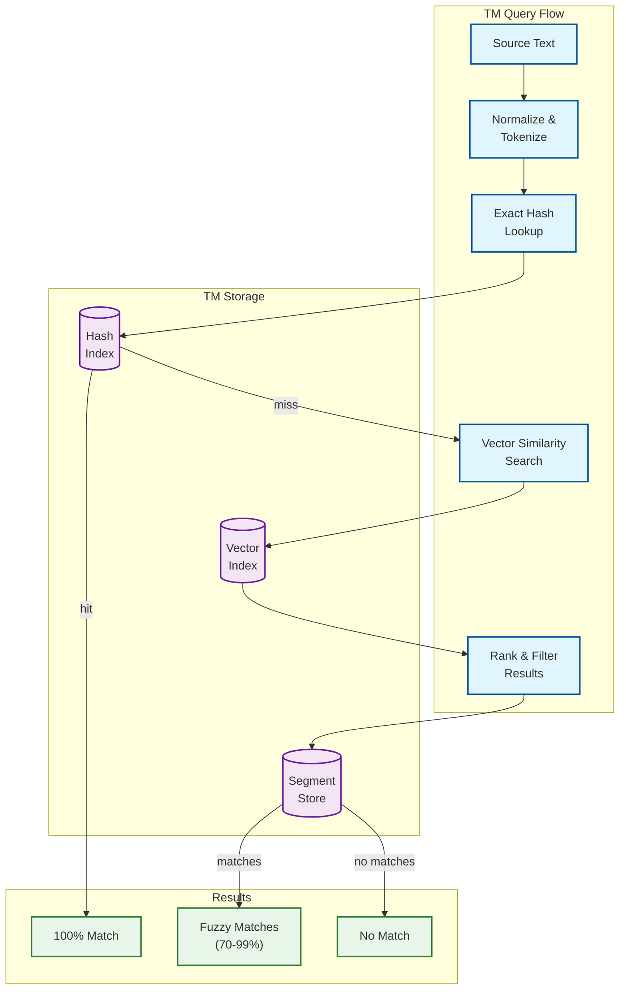
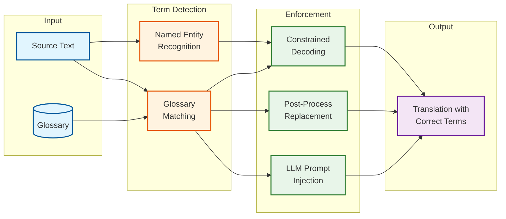
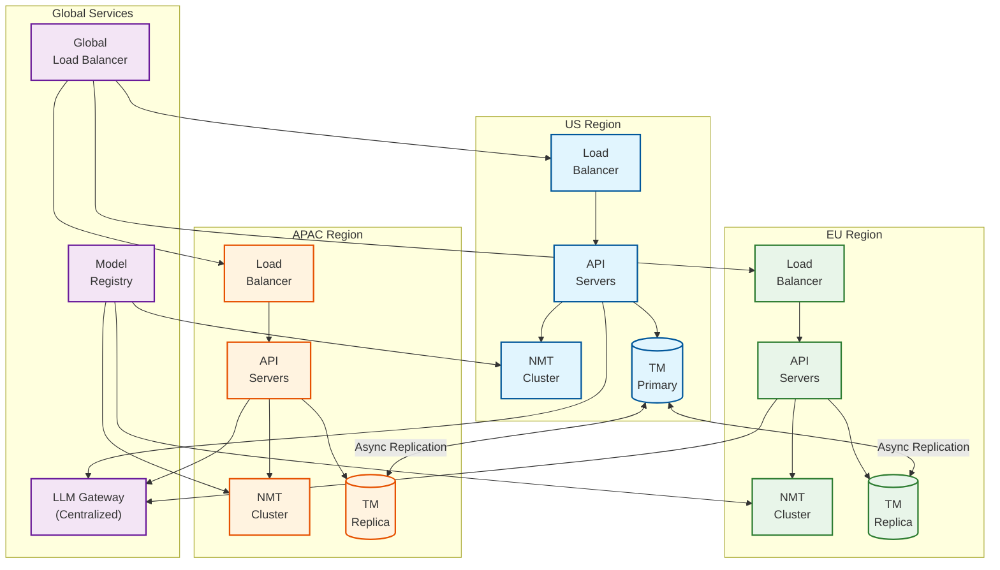

# High-Level Design

## System Architecture

---

## Data Flow

### Translation Request Flow

### Engine Routing Decision Flow

---

## Key Architectural Decisions

### 1. Microservices vs Monolith

| Decision | Choice | Justification |
|----------|--------|---------------|
| **Architecture** | Microservices | Independent scaling of MT/QE/TM, different tech stacks for engines |
| **Communication** | Sync (API) + Async (Queue) | Real-time translation + async human workflow |
| **Service Boundaries** | By domain capability | TM Service, Engine Service, QE Service, Workflow Service |

**Rationale:** Translation platform has clearly separable concerns with different scaling needs:
- TM needs read-heavy optimization
- NMT needs GPU scaling
- Human workflow needs stateful orchestration

### 2. Synchronous vs Asynchronous

| Flow | Pattern | Justification |
|------|---------|---------------|
| TM Lookup | Synchronous | Sub-100ms requirement, critical path |
| MT Translation | Synchronous (with timeout) | Part of request flow, bounded latency |
| Human MTPE | Asynchronous | Unbounded human time, webhook completion |
| Adaptive Learning | Asynchronous | Batch aggregation, non-critical path |
| Webhook Delivery | Asynchronous | Fire-and-forget with retry |

### 3. Database Choices

| Data Type | Database | Justification |
|-----------|----------|---------------|
| **Translation Memory** | Postgres + pgvector | Structured segments + vector similarity for fuzzy match |
| **Job/Project State** | Postgres | ACID transactions, complex queries |
| **TM Cache** | Redis | Sub-10ms exact match lookups |
| **QE Scores** | TimescaleDB | Time-series analytics, retention policies |
| **Glossary** | Postgres | Relational with full-text search |
| **File Storage** | Object Storage (S3-compatible) | Large files, lifecycle management |
| **Session State** | Redis | Editor sessions, real-time collaboration |

### 4. Multi-Engine Strategy

**Decision:** Multi-engine with intelligent routing
- **Why not single engine?** Different engines excel at different content types
- **Selection criteria:** Content type, domain, quality requirement, cost budget, A/B testing

### 5. Caching Strategy

| Cache Layer | Purpose | TTL | Invalidation |
|-------------|---------|-----|--------------|
| **CDN (Edge)** | Static assets, exported files | 24h | On file update |
| **API Response Cache** | Repeated TM queries | 1h | On TM update |
| **TM Cache (Redis)** | Exact match lookups | Indefinite | On segment update |
| **QE Model Cache** | Model weights | On deploy | Model update |
| **LLM Response Cache** | Repeated prompts | 7d | TTL-based |

### 6. Message Queue Usage

| Queue | Purpose | Pattern | Ordering |
|-------|---------|---------|----------|
| **translation-jobs** | Async job processing | Work queue | Per-project FIFO |
| **mtpe-assignments** | Human task routing | Fan-out | Priority-based |
| **webhook-delivery** | Completion notifications | At-least-once | Per-customer |
| **learning-events** | Feedback aggregation | Stream | Time-ordered |
| **tm-updates** | TM replication | Pub/sub | Causal |

---

## Architecture Pattern Checklist

- [x] **Sync vs Async:** Hybrid - sync for translation, async for human workflow
- [x] **Event-driven vs Request-response:** Event-driven for learning, request-response for translation
- [x] **Push vs Pull:** Push for webhooks, pull for human task claiming
- [x] **Stateless vs Stateful:** Stateless API, stateful editor sessions
- [x] **Read-heavy vs Write-heavy:** TM is read-heavy, job store is write-heavy
- [x] **Real-time vs Batch:** Real-time translation, batch adaptive learning
- [x] **Edge vs Origin:** Origin-only (no edge translation caching due to personalization)

---

## Component Interactions

### Translation Memory Integration

### Terminology Enforcement

---

## Multi-Region Architecture

**Design Decisions:**
- **TM Replication:** Async replication from US primary to EU/APAC replicas
- **NMT:** Each region has local GPU clusters for latency
- **LLM:** Centralized gateway (API calls to providers are already global)
- **Data Residency:** EU data stays in EU region (GDPR compliance)

---

## Technology Stack Summary

| Layer | Technology | Alternative |
|-------|------------|-------------|
| **API Gateway** | Kong / AWS API Gateway | Traefik, Envoy |
| **Application** | Python (FastAPI) / Go | Node.js, Java |
| **NMT Inference** | NVIDIA Triton | TorchServe, TensorFlow Serving |
| **LLM Gateway** | Custom / Portkey | LiteLLM |
| **TM Database** | Postgres + pgvector | Elasticsearch |
| **Cache** | Redis Cluster | Memcached |
| **Job Queue** | Kafka / RabbitMQ | SQS, Redis Streams |
| **Workflow Engine** | Temporal | Airflow, Prefect |
| **Object Storage** | S3-compatible | MinIO, GCS |
| **Monitoring** | Prometheus + Grafana | Datadog |
| **Tracing** | Jaeger / OpenTelemetry | Zipkin |
