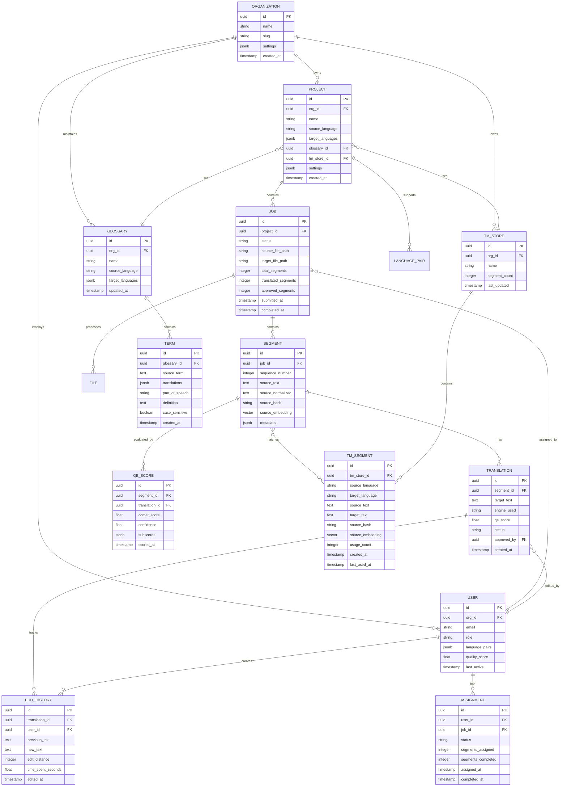

# Low-Level Design

## Data Model

### Entity-Relationship Diagram



---

## Database Schema

### Core Tables

```sql
-- Organizations
CREATE TABLE organizations (
    id UUID PRIMARY KEY DEFAULT gen_random_uuid(),
    name VARCHAR(255) NOT NULL,
    slug VARCHAR(100) UNIQUE NOT NULL,
    settings JSONB DEFAULT '{}',
    created_at TIMESTAMP WITH TIME ZONE DEFAULT NOW(),
    updated_at TIMESTAMP WITH TIME ZONE DEFAULT NOW()
);

-- Projects
CREATE TABLE projects (
    id UUID PRIMARY KEY DEFAULT gen_random_uuid(),
    org_id UUID NOT NULL REFERENCES organizations(id),
    name VARCHAR(255) NOT NULL,
    source_language VARCHAR(10) NOT NULL,
    target_languages JSONB NOT NULL DEFAULT '[]',
    glossary_id UUID REFERENCES glossaries(id),
    tm_store_id UUID REFERENCES tm_stores(id),
    settings JSONB DEFAULT '{}',
    created_at TIMESTAMP WITH TIME ZONE DEFAULT NOW(),
    UNIQUE(org_id, name)
);

-- Translation Jobs
CREATE TABLE jobs (
    id UUID PRIMARY KEY DEFAULT gen_random_uuid(),
    project_id UUID NOT NULL REFERENCES projects(id),
    status VARCHAR(50) NOT NULL DEFAULT 'pending',
    source_file_path TEXT,
    target_file_path TEXT,
    file_format VARCHAR(50),
    total_segments INTEGER DEFAULT 0,
    translated_segments INTEGER DEFAULT 0,
    approved_segments INTEGER DEFAULT 0,
    total_words INTEGER DEFAULT 0,
    submitted_at TIMESTAMP WITH TIME ZONE DEFAULT NOW(),
    started_at TIMESTAMP WITH TIME ZONE,
    completed_at TIMESTAMP WITH TIME ZONE,
    webhook_url TEXT,
    metadata JSONB DEFAULT '{}'
);

CREATE INDEX idx_jobs_project_status ON jobs(project_id, status);
CREATE INDEX idx_jobs_submitted ON jobs(submitted_at DESC);

-- Segments
CREATE TABLE segments (
    id UUID PRIMARY KEY DEFAULT gen_random_uuid(),
    job_id UUID NOT NULL REFERENCES jobs(id) ON DELETE CASCADE,
    sequence_number INTEGER NOT NULL,
    source_text TEXT NOT NULL,
    source_normalized TEXT NOT NULL,
    source_hash VARCHAR(64) NOT NULL,
    source_embedding VECTOR(768),
    word_count INTEGER NOT NULL,
    context_before TEXT,
    context_after TEXT,
    metadata JSONB DEFAULT '{}',
    UNIQUE(job_id, sequence_number)
);

CREATE INDEX idx_segments_job ON segments(job_id);
CREATE INDEX idx_segments_hash ON segments(source_hash);
CREATE INDEX idx_segments_embedding ON segments USING ivfflat (source_embedding vector_cosine_ops);

-- Translations
CREATE TABLE translations (
    id UUID PRIMARY KEY DEFAULT gen_random_uuid(),
    segment_id UUID NOT NULL REFERENCES segments(id) ON DELETE CASCADE,
    target_language VARCHAR(10) NOT NULL,
    target_text TEXT NOT NULL,
    engine_used VARCHAR(50) NOT NULL,
    engine_version VARCHAR(50),
    qe_score FLOAT,
    status VARCHAR(50) NOT NULL DEFAULT 'pending',
    approved_by UUID REFERENCES users(id),
    approved_at TIMESTAMP WITH TIME ZONE,
    created_at TIMESTAMP WITH TIME ZONE DEFAULT NOW(),
    UNIQUE(segment_id, target_language)
);

CREATE INDEX idx_translations_segment ON translations(segment_id);
CREATE INDEX idx_translations_status ON translations(status);
CREATE INDEX idx_translations_qe ON translations(qe_score);
```

### Translation Memory Tables

```sql
-- TM Stores
CREATE TABLE tm_stores (
    id UUID PRIMARY KEY DEFAULT gen_random_uuid(),
    org_id UUID NOT NULL REFERENCES organizations(id),
    name VARCHAR(255) NOT NULL,
    segment_count INTEGER DEFAULT 0,
    created_at TIMESTAMP WITH TIME ZONE DEFAULT NOW(),
    last_updated TIMESTAMP WITH TIME ZONE DEFAULT NOW(),
    UNIQUE(org_id, name)
);

-- TM Segments
CREATE TABLE tm_segments (
    id UUID PRIMARY KEY DEFAULT gen_random_uuid(),
    tm_store_id UUID NOT NULL REFERENCES tm_stores(id) ON DELETE CASCADE,
    source_language VARCHAR(10) NOT NULL,
    target_language VARCHAR(10) NOT NULL,
    source_text TEXT NOT NULL,
    source_normalized TEXT NOT NULL,
    target_text TEXT NOT NULL,
    source_hash VARCHAR(64) NOT NULL,
    source_embedding VECTOR(768),
    usage_count INTEGER DEFAULT 0,
    quality_score FLOAT,
    origin VARCHAR(50), -- 'human', 'mt_approved', 'import'
    created_by UUID REFERENCES users(id),
    created_at TIMESTAMP WITH TIME ZONE DEFAULT NOW(),
    last_used_at TIMESTAMP WITH TIME ZONE
);

-- Composite indexes for TM queries
CREATE INDEX idx_tm_segments_store_lang ON tm_segments(tm_store_id, source_language, target_language);
CREATE INDEX idx_tm_segments_hash ON tm_segments(source_hash);
CREATE INDEX idx_tm_segments_embedding ON tm_segments USING ivfflat (source_embedding vector_cosine_ops)
    WITH (lists = 100);

-- Partitioning for large TM stores (optional)
CREATE TABLE tm_segments_partitioned (
    LIKE tm_segments INCLUDING ALL
) PARTITION BY HASH (tm_store_id);
```

### Quality Estimation Tables

```sql
-- QE Scores
CREATE TABLE qe_scores (
    id UUID PRIMARY KEY DEFAULT gen_random_uuid(),
    segment_id UUID NOT NULL REFERENCES segments(id) ON DELETE CASCADE,
    translation_id UUID NOT NULL REFERENCES translations(id) ON DELETE CASCADE,
    model_version VARCHAR(50) NOT NULL,
    comet_score FLOAT NOT NULL,
    confidence FLOAT,
    subscores JSONB, -- {"fluency": 0.9, "adequacy": 0.85, "terminology": 0.95}
    scored_at TIMESTAMP WITH TIME ZONE DEFAULT NOW()
);

CREATE INDEX idx_qe_scores_translation ON qe_scores(translation_id);
CREATE INDEX idx_qe_scores_comet ON qe_scores(comet_score);

-- QE Model Metadata
CREATE TABLE qe_models (
    id UUID PRIMARY KEY DEFAULT gen_random_uuid(),
    name VARCHAR(100) NOT NULL,
    version VARCHAR(50) NOT NULL,
    model_path TEXT NOT NULL,
    supported_languages JSONB NOT NULL,
    calibration_params JSONB,
    deployed_at TIMESTAMP WITH TIME ZONE DEFAULT NOW(),
    is_active BOOLEAN DEFAULT TRUE,
    UNIQUE(name, version)
);
```

### Glossary Tables

```sql
-- Glossaries
CREATE TABLE glossaries (
    id UUID PRIMARY KEY DEFAULT gen_random_uuid(),
    org_id UUID NOT NULL REFERENCES organizations(id),
    name VARCHAR(255) NOT NULL,
    source_language VARCHAR(10) NOT NULL,
    target_languages JSONB NOT NULL DEFAULT '[]',
    term_count INTEGER DEFAULT 0,
    created_at TIMESTAMP WITH TIME ZONE DEFAULT NOW(),
    updated_at TIMESTAMP WITH TIME ZONE DEFAULT NOW(),
    UNIQUE(org_id, name)
);

-- Terms
CREATE TABLE terms (
    id UUID PRIMARY KEY DEFAULT gen_random_uuid(),
    glossary_id UUID NOT NULL REFERENCES glossaries(id) ON DELETE CASCADE,
    source_term TEXT NOT NULL,
    translations JSONB NOT NULL, -- {"es": "término", "fr": "terme"}
    part_of_speech VARCHAR(50),
    definition TEXT,
    context TEXT,
    case_sensitive BOOLEAN DEFAULT FALSE,
    forbidden_translations JSONB, -- terms to avoid
    created_at TIMESTAMP WITH TIME ZONE DEFAULT NOW(),
    updated_at TIMESTAMP WITH TIME ZONE DEFAULT NOW()
);

CREATE INDEX idx_terms_glossary ON terms(glossary_id);
CREATE INDEX idx_terms_source ON terms(glossary_id, source_term);
CREATE INDEX idx_terms_source_gin ON terms USING gin(source_term gin_trgm_ops);
```

---

## API Design

### RESTful API Endpoints

#### Translation Jobs API

```yaml
# Submit Translation Job
POST /v1/projects/{project_id}/jobs
Content-Type: multipart/form-data

Request:
  file: <binary>                    # Source file (XLIFF, JSON, PO, etc.)
  target_languages: ["es", "fr"]    # Target language codes
  priority: "normal"                # normal, high, urgent
  callback_url: "https://..."       # Webhook for completion
  settings:
    auto_approve_threshold: 0.85    # QE score for auto-approval
    use_tm: true                    # Enable TM lookup
    use_glossary: true              # Enable terminology enforcement
    engine_preference: "nmt"        # nmt, llm, auto

Response:
  201 Created
  {
    "job_id": "uuid",
    "status": "queued",
    "total_segments": 150,
    "estimated_completion": "2025-01-29T12:00:00Z"
  }

# Get Job Status
GET /v1/jobs/{job_id}

Response:
  {
    "job_id": "uuid",
    "status": "in_progress",
    "progress": {
      "total_segments": 150,
      "translated": 120,
      "approved": 80,
      "pending_review": 40
    },
    "quality": {
      "average_qe_score": 0.82,
      "auto_approved_rate": 0.53
    }
  }

# Download Translated File
GET /v1/jobs/{job_id}/download?language=es

Response:
  200 OK
  Content-Type: application/xliff+xml
  <binary>
```

#### Real-Time Translation API

```yaml
# Translate Text (Synchronous)
POST /v1/translate

Request:
  {
    "source_language": "en",
    "target_language": "es",
    "text": "Hello, world!",
    "context": "UI button label",
    "project_id": "uuid",           # Optional: for TM/glossary
    "options": {
      "engine": "auto",             # auto, nmt, llm
      "use_tm": true,
      "include_alternatives": true,
      "include_qe_score": true
    }
  }

Response:
  {
    "translation": "¡Hola, mundo!",
    "engine_used": "nmt_deepl",
    "qe_score": 0.92,
    "tm_match": {
      "type": "fuzzy",
      "score": 0.85,
      "source": "Hello, World!",
      "target": "¡Hola, Mundo!"
    },
    "alternatives": [
      {"text": "Hola, mundo", "score": 0.88}
    ],
    "terminology_applied": [
      {"source": "world", "target": "mundo"}
    ]
  }

# Batch Translate
POST /v1/translate/batch

Request:
  {
    "source_language": "en",
    "target_language": "es",
    "segments": [
      {"id": "1", "text": "Hello"},
      {"id": "2", "text": "World"}
    ],
    "project_id": "uuid"
  }

Response:
  {
    "translations": [
      {"id": "1", "text": "Hola", "qe_score": 0.95},
      {"id": "2", "text": "Mundo", "qe_score": 0.93}
    ]
  }
```

#### Translation Memory API

```yaml
# Query TM
POST /v1/tm/{tm_store_id}/query

Request:
  {
    "source_language": "en",
    "target_language": "es",
    "text": "Welcome to our application",
    "min_score": 0.7,
    "max_results": 5
  }

Response:
  {
    "matches": [
      {
        "score": 1.0,
        "match_type": "exact",
        "source": "Welcome to our application",
        "target": "Bienvenido a nuestra aplicación",
        "last_used": "2025-01-28T10:00:00Z"
      },
      {
        "score": 0.85,
        "match_type": "fuzzy",
        "source": "Welcome to the application",
        "target": "Bienvenido a la aplicación",
        "edit_distance": 3
      }
    ]
  }

# Add TM Entry
POST /v1/tm/{tm_store_id}/segments

Request:
  {
    "source_language": "en",
    "target_language": "es",
    "source_text": "New segment",
    "target_text": "Nuevo segmento",
    "origin": "human_approved"
  }

Response:
  201 Created
  {"segment_id": "uuid"}
```

#### Glossary API

```yaml
# List Terms
GET /v1/glossaries/{glossary_id}/terms?search=product

Response:
  {
    "terms": [
      {
        "id": "uuid",
        "source_term": "product",
        "translations": {"es": "producto", "fr": "produit"},
        "definition": "Item for sale",
        "case_sensitive": false
      }
    ],
    "total": 1
  }

# Add Term
POST /v1/glossaries/{glossary_id}/terms

Request:
  {
    "source_term": "dashboard",
    "translations": {"es": "panel de control", "fr": "tableau de bord"},
    "part_of_speech": "noun",
    "definition": "Main control interface"
  }
```

### GraphQL API (Alternative)

```graphql
type Query {
  job(id: ID!): Job
  translateText(input: TranslateInput!): TranslationResult
  queryTM(input: TMQueryInput!): [TMMatch!]!
}

type Mutation {
  submitJob(input: SubmitJobInput!): Job!
  approveTranslation(translationId: ID!): Translation!
  addTMSegment(input: AddTMSegmentInput!): TMSegment!
}

type Job {
  id: ID!
  status: JobStatus!
  progress: JobProgress!
  segments(status: SegmentStatus): [Segment!]!
  quality: QualityMetrics!
}

type Segment {
  id: ID!
  sourceText: String!
  translations: [Translation!]!
  tmMatches: [TMMatch!]!
}

type Translation {
  id: ID!
  targetText: String!
  engineUsed: String!
  qeScore: Float!
  status: TranslationStatus!
}

input TranslateInput {
  sourceLanguage: String!
  targetLanguage: String!
  text: String!
  projectId: ID
  engine: Engine
}
```

### Webhook Events

```yaml
# Job Completed
POST {callback_url}
X-Webhook-Signature: sha256=...

{
  "event": "job.completed",
  "job_id": "uuid",
  "project_id": "uuid",
  "status": "completed",
  "statistics": {
    "total_segments": 150,
    "words_translated": 2500,
    "average_qe_score": 0.84,
    "human_edited_rate": 0.25
  },
  "download_urls": {
    "es": "https://api.example.com/v1/jobs/{id}/download?lang=es",
    "fr": "https://api.example.com/v1/jobs/{id}/download?lang=fr"
  },
  "timestamp": "2025-01-29T12:00:00Z"
}

# Segment Needs Review
{
  "event": "segment.needs_review",
  "job_id": "uuid",
  "segment_id": "uuid",
  "reason": "low_qe_score",
  "qe_score": 0.62,
  "source_text": "...",
  "mt_output": "...",
  "timestamp": "..."
}
```

---

## Core Algorithms

### 1. Fuzzy Match Scoring Algorithm

```
ALGORITHM FuzzyMatchScore(source, candidate)
  INPUT:
    source: normalized source text
    candidate: TM segment source text
  OUTPUT:
    score: similarity score [0, 1]

  -- Step 1: Exact match check
  IF source == candidate THEN
    RETURN 1.0
  END IF

  -- Step 2: Calculate Levenshtein distance
  distance = LevenshteinDistance(source, candidate)
  max_len = MAX(LENGTH(source), LENGTH(candidate))
  base_score = 1 - (distance / max_len)

  -- Step 3: Apply penalties
  penalties = 0

  -- Penalty for length difference
  len_diff = ABS(LENGTH(source) - LENGTH(candidate)) / max_len
  penalties += len_diff * 0.1

  -- Penalty for word order changes
  source_words = TOKENIZE(source)
  candidate_words = TOKENIZE(candidate)
  order_similarity = LongestCommonSubsequence(source_words, candidate_words)
  order_penalty = 1 - (order_similarity / MAX(LEN(source_words), LEN(candidate_words)))
  penalties += order_penalty * 0.15

  -- Penalty for missing/extra words
  missing_words = SET_DIFFERENCE(source_words, candidate_words)
  extra_words = SET_DIFFERENCE(candidate_words, source_words)
  word_penalty = (LEN(missing_words) + LEN(extra_words)) / (LEN(source_words) + LEN(candidate_words))
  penalties += word_penalty * 0.2

  -- Step 4: Apply bonuses
  bonuses = 0

  -- Bonus for matching numbers
  IF EXTRACT_NUMBERS(source) == EXTRACT_NUMBERS(candidate) THEN
    bonuses += 0.05
  END IF

  -- Bonus for matching placeholders
  IF EXTRACT_PLACEHOLDERS(source) == EXTRACT_PLACEHOLDERS(candidate) THEN
    bonuses += 0.05
  END IF

  -- Step 5: Calculate final score
  final_score = base_score - penalties + bonuses
  RETURN CLAMP(final_score, 0, 1)
END ALGORITHM
```

### 2. Quality Estimation (COMET-style) Scoring

```
ALGORITHM COMETScore(source, translation, reference=NULL)
  INPUT:
    source: source text
    translation: MT output
    reference: (optional) human reference translation
  OUTPUT:
    score: quality score [0, 1]

  -- Step 1: Encode texts using cross-lingual encoder
  source_embedding = CrossLingualEncoder.encode(source)
  translation_embedding = CrossLingualEncoder.encode(translation)

  IF reference IS NOT NULL THEN
    reference_embedding = CrossLingualEncoder.encode(reference)
  END IF

  -- Step 2: Compute features
  features = []

  -- Cosine similarity features
  features.append(CosineSimilarity(source_embedding, translation_embedding))

  IF reference IS NOT NULL THEN
    features.append(CosineSimilarity(translation_embedding, reference_embedding))
    features.append(CosineSimilarity(source_embedding, reference_embedding))
  END IF

  -- Element-wise product features
  features.append(source_embedding * translation_embedding)

  -- Absolute difference features
  features.append(ABS(source_embedding - translation_embedding))

  -- Step 3: Pass through regression head
  concatenated = CONCATENATE(features)
  hidden = ReLU(Linear(concatenated, hidden_dim))
  hidden = Dropout(hidden, 0.1)
  score = Sigmoid(Linear(hidden, 1))

  -- Step 4: Calibrate score (optional)
  calibrated_score = CalibrateScore(score, language_pair)

  RETURN calibrated_score
END ALGORITHM
```

### 3. Engine Routing Decision Algorithm

```
ALGORITHM SelectTranslationEngine(segment, project_settings)
  INPUT:
    segment: source segment with metadata
    project_settings: project configuration
  OUTPUT:
    engine: selected translation engine

  -- Step 1: Check for forced engine preference
  IF project_settings.forced_engine IS NOT NULL THEN
    RETURN project_settings.forced_engine
  END IF

  -- Step 2: Classify content type
  content_type = ClassifyContentType(segment.text, segment.metadata)
  -- Returns: "technical", "creative", "legal", "medical", "ui_string", "general"

  -- Step 3: Check domain-specific NMT availability
  domain_nmt = GetDomainNMT(content_type, segment.language_pair)

  -- Step 4: Apply routing rules
  SWITCH content_type:
    CASE "technical", "ui_string":
      -- Technical content: prioritize consistency, use NMT
      IF domain_nmt.available THEN
        RETURN domain_nmt.engine
      ELSE
        RETURN "nmt_general"
      END IF

    CASE "creative", "marketing":
      -- Creative content: prioritize fluency, use LLM
      IF segment.word_count > 100 THEN
        -- Long creative content benefits from LLM context
        RETURN "llm_gpt4"
      ELSE
        -- Short creative: try NMT first, fallback to LLM on low QE
        RETURN "nmt_with_llm_fallback"
      END IF

    CASE "legal", "medical":
      -- High-stakes content: use specialized NMT + mandatory human review
      RETURN "specialized_nmt_with_human_review"

    DEFAULT:
      -- A/B test for general content
      IF InABTestGroup(segment.id, "engine_experiment") THEN
        RETURN SampleFromDistribution(["nmt_deepl", "nmt_google", "llm_claude"])
      ELSE
        RETURN "nmt_deepl"  -- Default engine
      END IF
  END SWITCH

END ALGORITHM
```

### 4. Terminology Injection Algorithm

```
ALGORITHM InjectTerminology(source, translation, glossary)
  INPUT:
    source: source text
    translation: initial MT output
    glossary: applicable glossary terms
  OUTPUT:
    modified_translation: translation with correct terminology

  -- Step 1: Find glossary terms in source
  found_terms = []
  FOR term IN glossary.terms:
    positions = FindAllOccurrences(source, term.source_term, term.case_sensitive)
    FOR pos IN positions:
      found_terms.append({
        "term": term,
        "position": pos,
        "source_match": ExtractMatch(source, pos, term.source_term)
      })
    END FOR
  END FOR

  -- Step 2: Align source and translation
  alignment = WordAlignment(source, translation)
  -- Returns: mapping of source positions to target positions

  -- Step 3: Check and replace terms
  corrections = []
  FOR found IN found_terms:
    target_term = found.term.translations[target_language]

    -- Find corresponding position in translation
    aligned_positions = GetAlignedPositions(alignment, found.position)
    current_translation = ExtractAtPositions(translation, aligned_positions)

    -- Check if correct term is used
    IF NOT MatchesTerm(current_translation, target_term, found.term.case_sensitive) THEN
      corrections.append({
        "positions": aligned_positions,
        "current": current_translation,
        "correct": target_term
      })
    END IF
  END FOR

  -- Step 4: Apply corrections (in reverse order to preserve positions)
  SORT corrections BY position DESC
  modified = translation
  FOR correction IN corrections:
    modified = ReplaceAtPositions(modified, correction.positions, correction.correct)
  END FOR

  -- Step 5: Validate grammar after replacement
  IF NOT GrammarCheck(modified) THEN
    -- Use LLM to fix grammar while preserving terminology
    modified = LLMGrammarFix(modified, corrections)
  END IF

  RETURN modified
END ALGORITHM
```

### 5. Adaptive Learning Update Algorithm

```
ALGORITHM ProcessHumanFeedback(edit_event)
  INPUT:
    edit_event: {
      segment_id: UUID,
      original_mt: string,
      human_edit: string,
      editor_id: UUID,
      time_spent: float
    }
  OUTPUT:
    updated: boolean

  -- Step 1: Calculate edit significance
  edit_distance = LevenshteinDistance(edit_event.original_mt, edit_event.human_edit)
  edit_ratio = edit_distance / LENGTH(edit_event.original_mt)

  -- Skip trivial edits (typos, punctuation)
  IF edit_ratio < 0.05 THEN
    RETURN FALSE
  END IF

  -- Step 2: Classify edit type
  edit_type = ClassifyEdit(edit_event.original_mt, edit_event.human_edit)
  -- Returns: "terminology", "fluency", "adequacy", "style", "error"

  -- Step 3: Update Translation Memory
  tm_segment = {
    source: GetSegmentSource(edit_event.segment_id),
    target: edit_event.human_edit,
    quality_score: 1.0,  -- Human-approved
    origin: "human_edit"
  }
  AddToTM(tm_segment)

  -- Step 4: Queue for model fine-tuning (if significant)
  IF edit_ratio > 0.15 OR edit_type IN ["adequacy", "error"] THEN
    fine_tune_queue.push({
      source: tm_segment.source,
      mt_output: edit_event.original_mt,
      human_reference: edit_event.human_edit,
      edit_type: edit_type,
      weight: CalculateSampleWeight(edit_ratio, edit_type)
    })
  END IF

  -- Step 5: Update editor quality metrics
  UpdateEditorMetrics(edit_event.editor_id, {
    edit_ratio: edit_ratio,
    time_spent: edit_event.time_spent,
    edit_type: edit_type
  })

  -- Step 6: Trigger model update if queue threshold reached
  IF fine_tune_queue.size >= FINE_TUNE_BATCH_SIZE THEN
    TriggerIncrementalFineTune(fine_tune_queue)
  END IF

  RETURN TRUE
END ALGORITHM
```

---

## Data Structures

### Translation Job State Machine


### Segment Translation State


### TM Segment Index Structure

```
TM_INDEX:
├── HASH_INDEX (exact match)
│   └── source_hash → [segment_ids]
│
├── VECTOR_INDEX (fuzzy match - IVF-Flat or HNSW)
│   ├── Cluster 1
│   │   └── vectors with metadata
│   ├── Cluster 2
│   │   └── vectors with metadata
│   └── ...
│
└── METADATA_INDEX
    ├── language_pair → [segment_ids]
    ├── tm_store_id → [segment_ids]
    └── last_used → [segment_ids] (for LRU eviction)
```

---

## API Rate Limiting

| Endpoint | Free Tier | Pro Tier | Enterprise |
|----------|-----------|----------|------------|
| `POST /translate` | 100/min | 1,000/min | 10,000/min |
| `POST /jobs` | 10/hour | 100/hour | Unlimited |
| `GET /jobs/{id}` | 100/min | 1,000/min | 10,000/min |
| `POST /tm/query` | 500/min | 5,000/min | 50,000/min |
| Batch translate | 1,000 segments | 10,000 segments | 100,000 segments |

### Rate Limit Response

```json
{
  "error": "rate_limit_exceeded",
  "message": "Too many requests",
  "retry_after": 30,
  "limit": 100,
  "remaining": 0,
  "reset": "2025-01-29T12:01:00Z"
}
```

---

## Idempotency

### Idempotent Operations

| Operation | Idempotency Key | Behavior |
|-----------|-----------------|----------|
| Submit job | `X-Idempotency-Key` header | Return existing job if key matches |
| Add TM segment | `source_hash + target_language` | Update if exists, insert if not |
| Approve translation | `translation_id` | No-op if already approved |
| Webhook delivery | `event_id` | Retry with same payload |

### Idempotency Implementation

```
FUNCTION HandleIdempotentRequest(request, handler)
  key = request.headers["X-Idempotency-Key"]

  IF key IS NOT NULL THEN
    -- Check cache for existing response
    cached = IdempotencyCache.get(key)
    IF cached IS NOT NULL THEN
      RETURN cached.response
    END IF
  END IF

  -- Process request
  response = handler(request)

  -- Cache response for idempotent key
  IF key IS NOT NULL AND response.status IN [200, 201] THEN
    IdempotencyCache.set(key, {
      response: response,
      expires: NOW() + 24_HOURS
    })
  END IF

  RETURN response
END FUNCTION
```

---

## Versioning Strategy

### API Versioning

- **URL Path:** `/v1/`, `/v2/` prefix
- **Deprecation:** 12-month notice before removing old versions
- **Headers:** `X-API-Version: 2025-01-01` for minor updates

### Schema Versioning

- **Database:** Numbered migrations with rollback support
- **TM Format:** Versioned export format (XLIFF 2.0, TMX 1.4b)
- **Model Versioning:** Semantic versioning for MT/QE models
