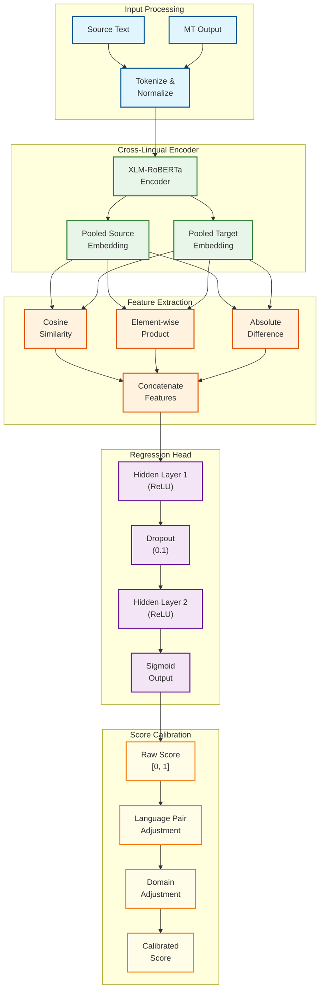
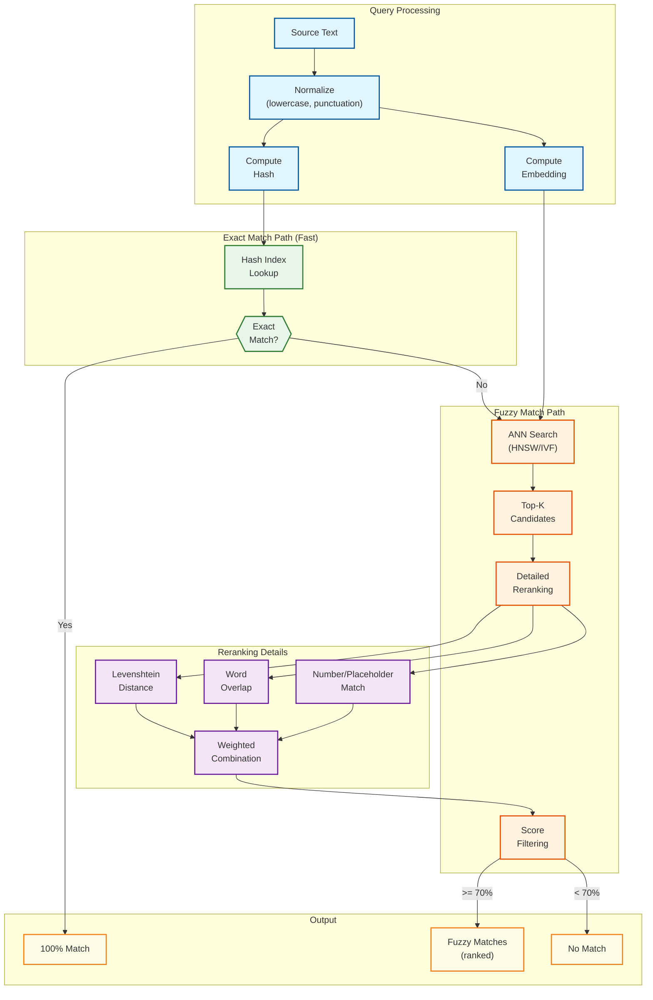
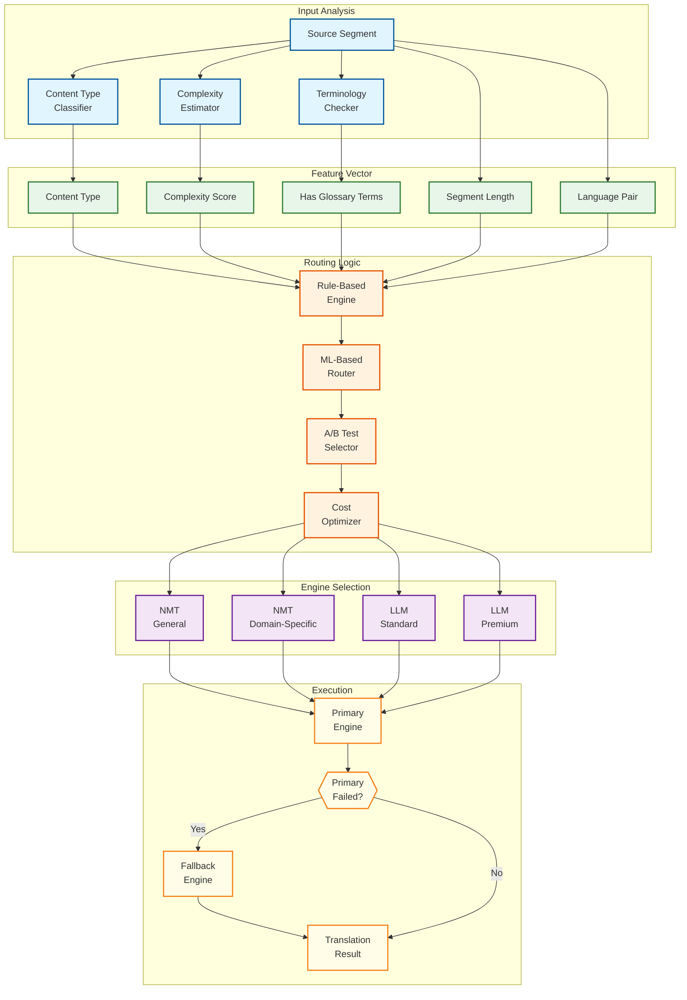
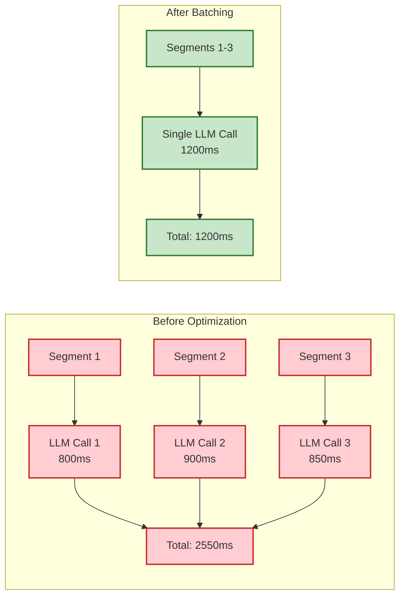
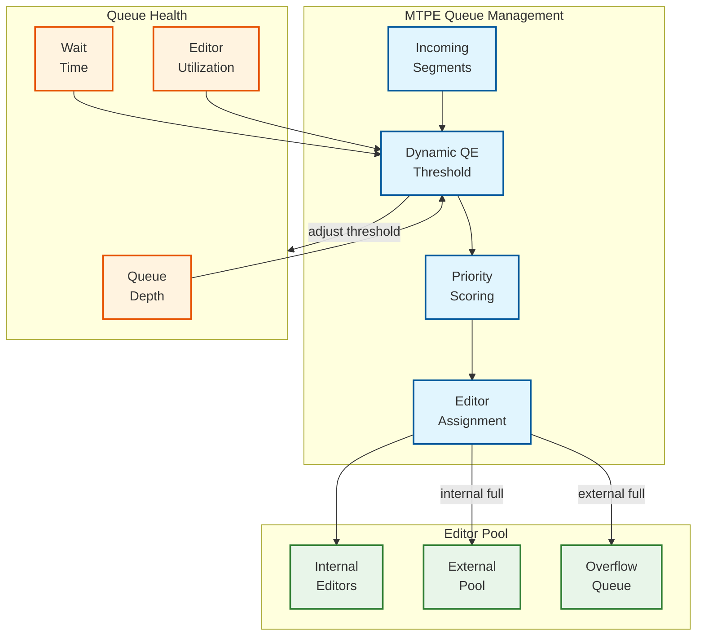
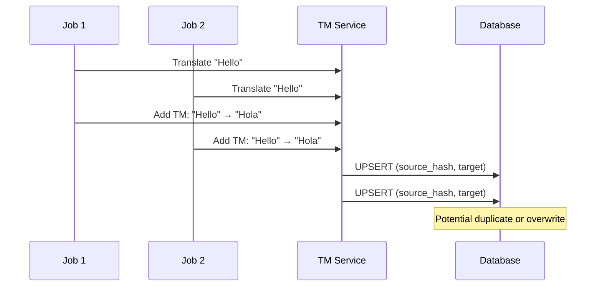

# Deep Dive & Bottlenecks

## Critical Component #1: Quality Estimation (QE) Pipeline

### Why This is Critical

Quality Estimation is the linchpin of the entire platform—it determines which translations are auto-approved vs. routed to human editors. A miscalibrated QE model can either:
1. **Over-approve** → Bad translations reach customers, damaging brand trust
2. **Under-approve** → Excessive human review costs, defeating the purpose of MT

### How It Works Internally



### Model Architecture Details

| Layer | Dimensions | Purpose |
|-------|------------|---------|
| XLM-RoBERTa Encoder | 768 | Cross-lingual sentence embeddings |
| Feature Concatenation | 768 × 4 = 3072 | Combined source-target features |
| Hidden Layer 1 | 3072 → 1024 | Non-linear transformation |
| Hidden Layer 2 | 1024 → 256 | Further compression |
| Output | 256 → 1 | Quality score prediction |

### Failure Modes

| Failure Mode | Cause | Detection | Mitigation |
|--------------|-------|-----------|------------|
| **Score Collapse** | Model predicts same score for all inputs | Histogram analysis shows narrow range | Retrain with diverse data |
| **Language Pair Bias** | Model trained mostly on EN-DE | QE-human correlation varies by pair | Per-pair calibration layer |
| **Length Sensitivity** | Shorter segments get higher scores | Correlation analysis | Length normalization |
| **Adversarial Inputs** | Empty translations score non-zero | Unit tests with edge cases | Input validation, minimum thresholds |
| **Domain Shift** | Medical content scores low | Domain-specific validation set | Domain adaptation fine-tuning |

### Calibration Strategy

```
ALGORITHM CalibrateQEScore(raw_score, language_pair, domain)
  -- Step 1: Apply language pair adjustment
  -- Learned offsets from human evaluation correlation
  lp_offset = LANGUAGE_PAIR_CALIBRATION[language_pair]  -- e.g., {"en-de": 0.02, "en-zh": -0.05}
  adjusted = raw_score + lp_offset

  -- Step 2: Apply domain adjustment
  domain_scale = DOMAIN_CALIBRATION[domain]  -- e.g., {"medical": 0.95, "legal": 0.90}
  adjusted = adjusted * domain_scale

  -- Step 3: Apply Platt scaling for probability calibration
  -- sigmoid(a * score + b) where a, b learned from validation set
  calibrated = 1 / (1 + exp(-(PLATT_A * adjusted + PLATT_B)))

  -- Step 4: Ensure score is within bounds
  RETURN CLAMP(calibrated, 0.0, 1.0)
END ALGORITHM
```

### Performance Optimization

| Technique | Latency Impact | Quality Impact | When to Use |
|-----------|---------------|----------------|-------------|
| **Batched Inference** | -60% (amortized) | None | Always |
| **ONNX Runtime** | -40% | None | Production |
| **Quantization (INT8)** | -30% | -0.5% accuracy | CPU-only deployments |
| **Distillation** | -50% | -1-2% accuracy | Edge deployments |
| **Caching** | -95% (on hit) | None | Repeated segments |

---

## Critical Component #2: Translation Memory (TM) Fuzzy Matching

### Why This is Critical

TM is the foundation of translation consistency and cost savings. A 40% TM hit rate means 40% of translations are essentially free (just lookup). Slow or inaccurate fuzzy matching directly impacts:
1. Translation latency (TM lookup is in critical path)
2. Human editor productivity (poor fuzzy matches waste time)
3. Cost (missed TM hits mean paying for MT unnecessarily)

### How It Works Internally



### Index Structure

| Index Type | Purpose | Size (500M segments) | Query Time |
|------------|---------|---------------------|------------|
| **Hash Index** | Exact match | ~20GB (hash → id) | O(1), <1ms |
| **Vector Index (HNSW)** | Fuzzy candidate retrieval | ~400GB (768-dim vectors) | O(log n), 5-20ms |
| **Metadata Index** | Filtering by TM store, language | ~10GB | O(1) + filter |
| **Full-Text Index** | Keyword fallback search | ~50GB | O(log n), 10-50ms |

### ANN Search Configuration (HNSW)

| Parameter | Value | Trade-off |
|-----------|-------|-----------|
| `M` (connections per node) | 16 | Higher = better recall, more memory |
| `ef_construction` | 200 | Higher = better index quality, slower build |
| `ef_search` | 100 | Higher = better recall, slower query |
| `distance_metric` | Cosine | Semantic similarity |

### Failure Modes

| Failure Mode | Cause | Impact | Mitigation |
|--------------|-------|--------|------------|
| **Index Staleness** | New segments not indexed | Missed TM hits | Real-time index updates |
| **Embedding Drift** | Encoder model updated | Old segments misaligned | Re-embed on model change |
| **Hot Partition** | One TM store dominates queries | Latency spikes | Per-store sharding |
| **False Positives** | High vector similarity, low text similarity | Poor fuzzy suggestions | Two-stage reranking |
| **OOM on Large TM** | Index exceeds memory | Service crash | Disk-based index (DiskANN) |

### Optimization Techniques

```
ALGORITHM OptimizedTMLookup(query, tm_store_id, min_score)
  -- Stage 1: Check exact match cache (Redis)
  cache_key = HASH(query.normalized_text + tm_store_id)
  cached = ExactMatchCache.get(cache_key)
  IF cached IS NOT NULL THEN
    RETURN cached  -- Sub-millisecond
  END IF

  -- Stage 2: Hash lookup for exact match
  hash_matches = HashIndex.get(query.source_hash, tm_store_id)
  IF hash_matches.length > 0 THEN
    result = FormatExactMatch(hash_matches[0])
    ExactMatchCache.set(cache_key, result, TTL=1_HOUR)
    RETURN result
  END IF

  -- Stage 3: ANN search with pre-filtering
  candidates = VectorIndex.search(
    query.embedding,
    filter: {tm_store_id: tm_store_id, language_pair: query.language_pair},
    top_k: 50,  -- Over-fetch for reranking
    ef_search: 100
  )

  -- Stage 4: Batch rerank top candidates
  reranked = []
  FOR candidate IN candidates:
    detailed_score = ComputeDetailedScore(query.text, candidate.text)
    IF detailed_score >= min_score THEN
      reranked.append({candidate, detailed_score})
    END IF
  END FOR

  -- Stage 5: Sort and return top matches
  SORT reranked BY score DESC
  RETURN reranked[0:5]
END ALGORITHM
```

---

## Critical Component #3: Engine Routing & Orchestration

### Why This is Critical

The engine router determines cost, quality, and latency for every translation. Poor routing decisions can:
1. Waste money on expensive LLM calls for simple content
2. Produce poor translations by using NMT for nuanced content
3. Create latency issues by overloading a single engine

### How It Works Internally



### Routing Rules Matrix

| Content Type | Complexity | Has Terms | Recommended Engine | Fallback |
|--------------|------------|-----------|-------------------|----------|
| UI Strings | Low | No | NMT General | NMT Domain |
| UI Strings | Low | Yes | NMT + Term Injection | LLM Standard |
| Technical Docs | Medium | Yes | NMT Domain | LLM Standard |
| Marketing | High | No | LLM Standard | LLM Premium |
| Legal/Medical | High | Yes | NMT Specialized + Human | LLM Premium + Human |
| Creative | High | No | LLM Premium | LLM Standard |

### Cost Optimization Logic

```
ALGORITHM OptimizeEngineCost(segment, quality_requirement, budget_remaining)
  -- Step 1: Get candidate engines
  candidates = GetEligibleEngines(segment.language_pair, segment.content_type)

  -- Step 2: Estimate quality and cost for each
  scored_candidates = []
  FOR engine IN candidates:
    estimated_quality = PredictQuality(engine, segment)
    cost_per_word = GetCostPerWord(engine, segment.language_pair)

    IF estimated_quality >= quality_requirement THEN
      score = estimated_quality / cost_per_word  -- Quality per dollar
      scored_candidates.append({engine, estimated_quality, cost_per_word, score})
    END IF
  END FOR

  -- Step 3: Apply budget constraint
  SORT scored_candidates BY score DESC
  FOR candidate IN scored_candidates:
    segment_cost = candidate.cost_per_word * segment.word_count
    IF segment_cost <= budget_remaining THEN
      RETURN candidate.engine
    END IF
  END FOR

  -- Step 4: Fallback to cheapest eligible engine
  cheapest = MIN(candidates, BY cost_per_word)
  RETURN cheapest
END ALGORITHM
```

### Failure Modes

| Failure Mode | Cause | Detection | Mitigation |
|--------------|-------|-----------|------------|
| **Engine Timeout** | LLM API slow | Request timeout >5s | Circuit breaker, fallback to NMT |
| **Rate Limited** | Exceeded LLM quota | 429 response | Backoff, switch engine |
| **Quality Degradation** | Engine model changed | QE score distribution shift | A/B monitoring, rollback |
| **Cost Overrun** | Too many LLM calls | Budget monitoring | Dynamic routing adjustment |
| **Routing Bias** | ML router overfit | Offline evaluation | Regular retraining, rule fallback |

---

## Bottleneck Analysis

### Top 3 Bottlenecks

#### 1. LLM API Latency (P0 - Critical)

| Aspect | Details |
|--------|---------|
| **Symptom** | Translation p99 latency exceeds 3s |
| **Root Cause** | LLM API calls are 500ms-2s, plus network |
| **Impact** | User experience, timeout errors |
| **Mitigation** | <ul><li>Batch segments into single LLM call</li><li>LLM response caching (same prompt = same response)</li><li>Speculative NMT execution while LLM pending</li><li>Stream partial responses</li></ul> |
| **Monitoring** | LLM latency percentiles, timeout rate |



#### 2. TM Index Memory Pressure (P1 - High)

| Aspect | Details |
|--------|---------|
| **Symptom** | TM query latency spikes during high load |
| **Root Cause** | Vector index (500M × 768 dim) exceeds memory |
| **Impact** | Fuzzy match degradation, missed TM hits |
| **Mitigation** | <ul><li>Tiered storage: hot TM in memory, cold on disk</li><li>Quantized vectors (768 → 256 dim with PQ)</li><li>Per-customer TM sharding</li><li>LRU eviction of unused segments</li></ul> |
| **Monitoring** | TM memory usage, disk I/O, cache hit rate |

```
Memory Calculation:
- 500M segments × 768 dimensions × 4 bytes = 1.5TB raw vectors
- With HNSW index overhead: ~2TB
- Available memory per node: 256GB
- Required nodes: 8+ (for redundancy)

After Quantization (PQ with 256 subvectors):
- 500M segments × 256 bytes = 128GB
- Required nodes: 1-2
```

#### 3. Human Editor Queue Backlog (P1 - High)

| Aspect | Details |
|--------|---------|
| **Symptom** | MTPE turnaround >24 hours |
| **Root Cause** | QE threshold too aggressive, editor shortage for language |
| **Impact** | SLA violations, customer complaints |
| **Mitigation** | <ul><li>Dynamic QE threshold per language pair</li><li>Predictive editor scheduling</li><li>Overflow to external translator pool</li><li>Auto-escalation rules</li></ul> |
| **Monitoring** | Queue depth, wait time, editor utilization |



---

## Concurrency & Race Conditions

### Race Condition #1: Concurrent TM Updates

**Scenario:** Two jobs translate the same source segment simultaneously, both want to add to TM.



**Solution:** Use database-level UPSERT with conflict resolution:

```sql
INSERT INTO tm_segments (tm_store_id, source_hash, source_text, target_text, ...)
VALUES ($1, $2, $3, $4, ...)
ON CONFLICT (tm_store_id, source_hash, target_language)
DO UPDATE SET
  usage_count = tm_segments.usage_count + 1,
  last_used_at = NOW()
WHERE tm_segments.quality_score <= EXCLUDED.quality_score;
```

### Race Condition #2: Editor Assignment Collision

**Scenario:** Multiple workers try to assign the same segment to different editors.

**Solution:** Optimistic locking with version check:

```
FUNCTION AssignSegment(segment_id, editor_id)
  -- Atomic claim with version check
  result = UPDATE segments
           SET assigned_to = editor_id,
               assigned_at = NOW(),
               version = version + 1
           WHERE id = segment_id
             AND assigned_to IS NULL
             AND version = expected_version
           RETURNING id

  IF result.rows_affected == 0 THEN
    -- Already assigned or version mismatch
    RETURN {success: false, reason: "already_assigned"}
  END IF

  RETURN {success: true}
END FUNCTION
```

### Race Condition #3: QE Score vs. Human Edit

**Scenario:** QE scores a translation while human is actively editing it.

**Solution:** State machine with transitions:

```
VALID_TRANSITIONS = {
  "pending" → ["translated"],
  "translated" → ["scored"],
  "scored" → ["auto_approved", "assigned"],
  "assigned" → ["in_progress"],
  "in_progress" → ["edited"],
  "edited" → ["approved", "rejected"],
  "rejected" → ["in_progress"],
  "approved" → []  -- Terminal state
}

FUNCTION UpdateSegmentStatus(segment_id, new_status)
  current = GetCurrentStatus(segment_id)
  IF new_status NOT IN VALID_TRANSITIONS[current] THEN
    RETURN {error: "invalid_transition", from: current, to: new_status}
  END IF
  -- Proceed with update
END FUNCTION
```

---

## Performance Optimization Summary

| Component | Bottleneck | Optimization | Expected Improvement |
|-----------|------------|--------------|---------------------|
| QE Inference | GPU saturation | Batching + ONNX | 3x throughput |
| TM Lookup | Memory pressure | Vector quantization | 10x memory reduction |
| LLM Calls | API latency | Batching + caching | 50% latency reduction |
| Human Queue | Editor availability | Dynamic thresholds | 30% queue reduction |
| File Parsing | Large files | Streaming parser | Handle 100MB+ files |
| Webhook Delivery | Retries on failure | Exponential backoff | 99.9% delivery rate |
