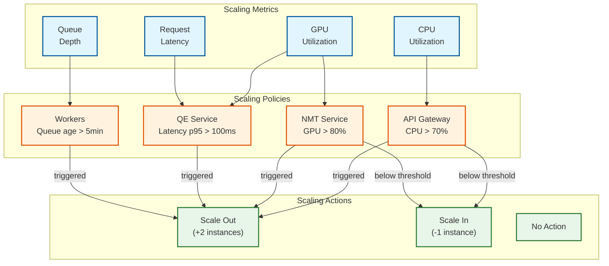
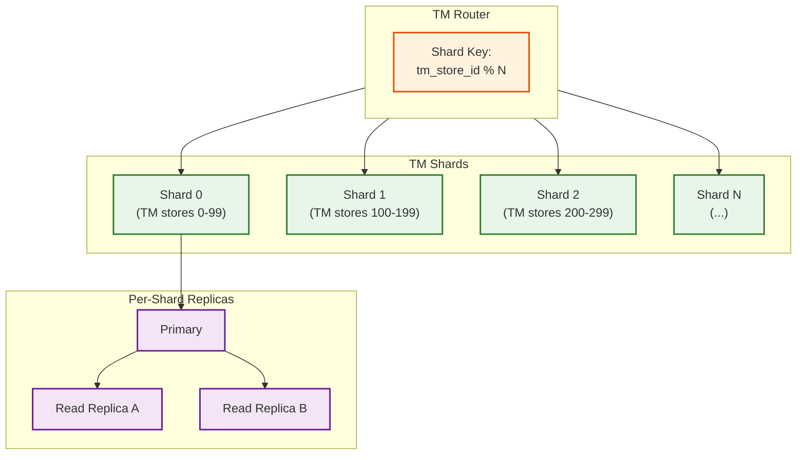
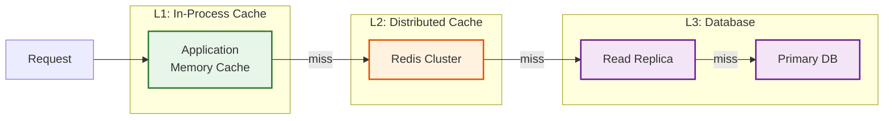
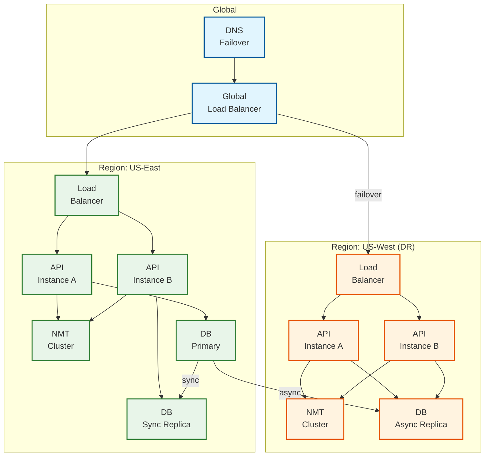
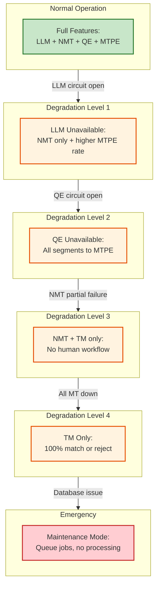

# Scalability & Reliability

## Scalability Strategy

### Horizontal vs. Vertical Scaling

| Component | Scaling Type | Rationale |
|-----------|--------------|-----------|
| **API Gateway** | Horizontal | Stateless, CPU-bound |
| **NMT Inference** | Horizontal | GPU-bound, model replicas |
| **QE Inference** | Horizontal | GPU-bound, independent requests |
| **TM Service** | Horizontal + Vertical | Sharded by TM store, memory-intensive |
| **Job Orchestrator** | Horizontal | Stateless workers, queue-driven |
| **Database (Primary)** | Vertical first, then sharding | Write master, read replicas |
| **Editor Workbench** | Horizontal | WebSocket sessions, stateless |

### Auto-Scaling Configuration



### Scaling Triggers

| Component | Scale-Up Trigger | Scale-Down Trigger | Min | Max |
|-----------|------------------|-------------------|-----|-----|
| API Gateway | CPU > 70% for 2min | CPU < 30% for 10min | 3 | 20 |
| NMT Service | GPU > 80% for 3min | GPU < 40% for 15min | 2 | 50 |
| QE Service | Latency p95 > 100ms | Latency p95 < 30ms for 10min | 2 | 20 |
| TM Service | Memory > 80% OR Latency > 50ms | Memory < 50% | 3 | 30 |
| Job Workers | Queue age > 5min | Queue empty for 10min | 2 | 100 |
| MTPE Workers | Queue depth > 1000 | Queue depth < 100 | 1 | 20 |

---

## Database Scaling Strategy

### Translation Memory Sharding



**Sharding Strategy:**
- **Shard Key:** `tm_store_id` (customer's TM store)
- **Rationale:** All queries include TM store ID, no cross-shard queries
- **Rebalancing:** Consistent hashing with virtual nodes

### Job Database Partitioning

```sql
-- Time-based partitioning for jobs table
CREATE TABLE jobs (
    id UUID,
    project_id UUID,
    status VARCHAR(50),
    submitted_at TIMESTAMP WITH TIME ZONE,
    ...
) PARTITION BY RANGE (submitted_at);

-- Create monthly partitions
CREATE TABLE jobs_2025_01 PARTITION OF jobs
    FOR VALUES FROM ('2025-01-01') TO ('2025-02-01');

CREATE TABLE jobs_2025_02 PARTITION OF jobs
    FOR VALUES FROM ('2025-02-01') TO ('2025-03-01');

-- Auto-create future partitions via cron job
```

**Benefits:**
- Faster queries on recent jobs (hot data)
- Easy archival of old partitions
- Parallel vacuum/analyze per partition

### Read Replica Strategy

| Database | Read Replicas | Replication Lag Target | Use Case |
|----------|---------------|----------------------|----------|
| TM Store | 2 per shard | <1s | Fuzzy match queries |
| Job Store | 3 | <5s | Job status queries |
| Metrics | 1 | <30s | Dashboard queries |
| User Store | 2 | <1s | Authentication |

---

## Caching Layers

### Multi-Layer Cache Architecture



### Cache Configuration

| Data Type | Cache Layer | TTL | Invalidation |
|-----------|-------------|-----|--------------|
| TM exact match | L2 (Redis) | Indefinite | On TM update |
| TM fuzzy results | L1 + L2 | 10 min | TTL-based |
| QE model weights | L1 | On deploy | Manual |
| Glossary terms | L2 | 1 hour | On glossary update |
| Job status | L2 | 30 sec | On status change |
| User sessions | L2 | 24 hours | On logout |
| LLM responses | L2 | 7 days | TTL-based |

### Cache Invalidation Strategy

```
ALGORITHM InvalidateTMCache(tm_store_id, segment_hash)
  -- Invalidate specific segment
  cache_key = "tm:" + tm_store_id + ":" + segment_hash
  Redis.delete(cache_key)

  -- Invalidate fuzzy match results that might include this segment
  -- Use Redis SCAN to find related keys (bounded iteration)
  pattern = "tm_fuzzy:" + tm_store_id + ":*"
  cursor = 0
  LOOP:
    cursor, keys = Redis.scan(cursor, pattern, count=100)
    FOR key IN keys:
      Redis.delete(key)
    IF cursor == 0 THEN BREAK
  END LOOP

  -- Publish invalidation event for L1 caches
  Redis.publish("tm_invalidation", {tm_store_id, segment_hash})
END ALGORITHM
```

---

## Reliability & Fault Tolerance

### Single Points of Failure Analysis

| Component | SPOF Risk | Mitigation |
|-----------|-----------|------------|
| API Gateway | High | Multi-instance behind load balancer |
| NMT Service | High | Multiple replicas, health checks |
| LLM Provider | High | Multi-provider fallback (GPT → Claude → Gemini) |
| TM Database | Critical | Primary + sync replica + async replicas |
| Redis Cache | Medium | Redis Cluster with replicas |
| Job Queue | High | Kafka with replication factor 3 |
| Model Registry | Low | Replicated object storage |

### Redundancy Architecture



### Failover Mechanisms

| Scenario | Detection | Failover Action | RTO | RPO |
|----------|-----------|-----------------|-----|-----|
| API instance failure | Health check failure (3x) | LB removes instance | <30s | 0 |
| NMT cluster failure | GPU health + latency spike | Route to backup cluster | <1min | 0 |
| LLM provider outage | 5xx rate > 10% | Switch to backup provider | <30s | 0 |
| Database primary failure | Replication lag + health | Promote sync replica | <5min | <1s |
| Region failure | Multi-probe health check | DNS failover to DR | <10min | <1min |
| Cache cluster failure | Connection errors | Bypass cache, hit DB | <1min | 0 |

### Circuit Breaker Pattern

```
CLASS CircuitBreaker:
  state: CLOSED | OPEN | HALF_OPEN
  failure_count: int
  last_failure_time: timestamp

  FUNCTION call(operation):
    IF state == OPEN:
      IF now() - last_failure_time > RESET_TIMEOUT:
        state = HALF_OPEN
      ELSE:
        RAISE CircuitOpenError

    TRY:
      result = operation()
      IF state == HALF_OPEN:
        state = CLOSED
        failure_count = 0
      RETURN result

    CATCH Exception:
      failure_count += 1
      last_failure_time = now()

      IF failure_count >= FAILURE_THRESHOLD:
        state = OPEN

      RAISE

CONFIGURATION:
  LLM_CIRCUIT_BREAKER:
    failure_threshold: 5
    reset_timeout: 30 seconds

  NMT_CIRCUIT_BREAKER:
    failure_threshold: 10
    reset_timeout: 60 seconds
```

### Retry Strategy

| Operation | Max Retries | Backoff | Jitter | Idempotent |
|-----------|-------------|---------|--------|------------|
| TM Lookup | 3 | Exponential (100ms, 200ms, 400ms) | ±50ms | Yes |
| NMT Translation | 2 | Linear (500ms) | ±100ms | Yes |
| LLM Translation | 2 | Exponential (1s, 4s) | ±500ms | Yes |
| Webhook Delivery | 5 | Exponential (1min, 5min, 30min, 2hr, 12hr) | ±10% | Yes |
| Database Write | 3 | Exponential (50ms, 100ms, 200ms) | ±25ms | Depends |

---

## Graceful Degradation

### Degradation Hierarchy



### Degradation Policies

| Trigger | Action | User Communication |
|---------|--------|-------------------|
| LLM latency > 5s | Fallback to NMT | "Using fast translation mode" |
| QE service down | Route all to human review | "Quality verification in progress" |
| MTPE queue > 4hr wait | Raise auto-approve threshold | "Expedited processing enabled" |
| Database read replica lag > 30s | Direct reads to primary | (Internal - no user impact) |
| Region failover | Redirect traffic | "Temporary latency increase expected" |

---

## Disaster Recovery

### Backup Strategy

| Data Type | Backup Frequency | Retention | Storage Location |
|-----------|------------------|-----------|------------------|
| TM Segments | Continuous (CDC) | Indefinite | Cross-region object storage |
| Job History | Daily | 7 years | Archive storage |
| User/Project Config | Hourly | 90 days | Cross-region replicated |
| QE Model Weights | On release | 1 year | Model registry |
| Audit Logs | Continuous | 7 years | Immutable storage |

### Recovery Procedures

#### Database Recovery

```
PROCEDURE RecoverFromDatabaseFailure(failure_type):
  IF failure_type == "PRIMARY_FAILURE":
    -- Promote sync replica
    1. Verify sync replica is caught up (lag < 1s)
    2. Promote replica to primary
    3. Update connection strings via service discovery
    4. Spin up new replica from promoted primary
    5. Verify replication healthy

  ELSE IF failure_type == "REGION_FAILURE":
    -- Failover to DR region
    1. Trigger DNS failover to DR region
    2. Promote async replica in DR (accept data loss)
    3. Update all services to use DR endpoints
    4. Queue backfill of lost transactions from audit log
    5. Communicate potential data loss to affected customers

  ELSE IF failure_type == "CORRUPTION":
    -- Point-in-time recovery
    1. Identify corruption timestamp from audit log
    2. Restore from backup prior to corruption
    3. Replay WAL/binlog to just before corruption
    4. Verify data integrity
    5. Resume normal operations
END PROCEDURE
```

### RTO/RPO Targets

| Scenario | RTO Target | RPO Target | Achieved |
|----------|------------|------------|----------|
| Single instance failure | <1 min | 0 | Auto-healing |
| Database failover (same region) | <5 min | <1s | Sync replication |
| Region failover | <15 min | <1 min | Async replication |
| Complete rebuild from backup | <4 hr | <1 hr | Backup frequency |

---

## Load Testing Results

### Baseline Performance (Normal Load)

| Metric | Target | Achieved |
|--------|--------|----------|
| Translation QPS | 100 | 150 |
| TM Lookup p99 | <100ms | 45ms |
| NMT Translation p99 | <500ms | 320ms |
| QE Scoring p99 | <100ms | 65ms |
| Error Rate | <0.1% | 0.02% |

### Peak Load (3x Normal)

| Metric | Target | Achieved | Notes |
|--------|--------|----------|-------|
| Translation QPS | 300 | 350 | Auto-scaled to 15 NMT instances |
| TM Lookup p99 | <150ms | 120ms | Cache hit rate improved |
| NMT Translation p99 | <800ms | 650ms | Batch size optimization |
| QE Scoring p99 | <150ms | 140ms | Scaled to 8 QE instances |
| Error Rate | <0.5% | 0.15% | Mostly timeouts |

### Stress Test (10x Normal)

| Metric | Target | Achieved | Action Required |
|--------|--------|----------|-----------------|
| Translation QPS | 1000 | 800 | Queue backpressure activated |
| TM Lookup p99 | <500ms | 1.2s | Need additional shards |
| NMT Translation p99 | <2s | 3.5s | GPU pool exhausted |
| Error Rate | <2% | 4.5% | Need capacity planning |

### Recommendations from Load Testing

1. **Pre-warm NMT instances** before expected peak periods
2. **Increase TM cache TTL** during high load (reduces DB pressure)
3. **Implement request coalescing** for identical translation requests
4. **Add GPU auto-scaling based on queue depth** not just utilization
