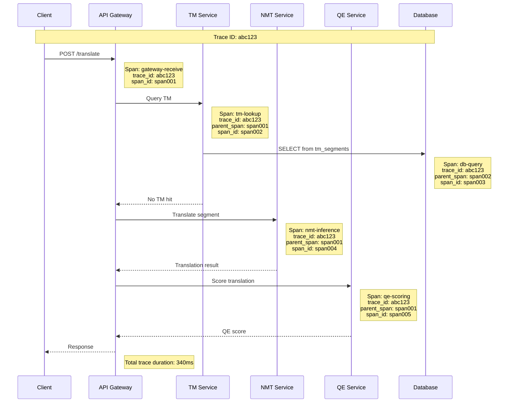
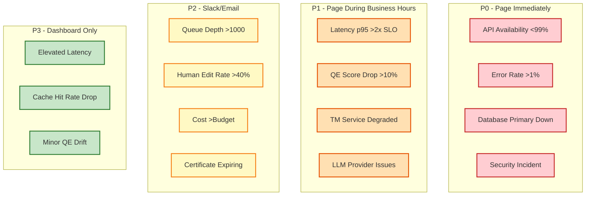
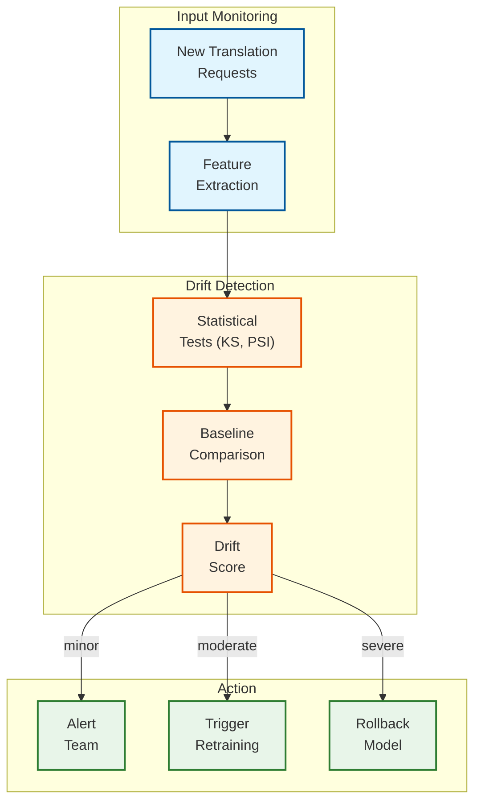

# Observability

## Metrics Strategy

### USE Method (Utilization, Saturation, Errors)

| Component | Utilization | Saturation | Errors |
|-----------|-------------|------------|--------|
| **API Gateway** | Request rate, CPU% | Request queue depth | 4xx, 5xx rate |
| **NMT Service** | GPU%, batch utilization | Pending inference queue | Inference failures |
| **QE Service** | GPU%, model load | Scoring queue depth | Scoring failures |
| **TM Service** | Memory%, query rate | Connection pool usage | Query timeouts |
| **Job Workers** | CPU%, worker count | Job queue depth | Job failures |
| **Database** | Connection pool, IOPS | Lock wait time | Query errors |

### RED Method (Rate, Errors, Duration)

| Service | Rate | Errors | Duration |
|---------|------|--------|----------|
| **Translation API** | Requests/sec by endpoint | Error rate by type | Latency percentiles |
| **TM Lookup** | Queries/sec | Miss rate, timeout rate | p50, p95, p99 |
| **MT Inference** | Segments/sec | Engine error rate | Per-engine latency |
| **QE Scoring** | Scores/sec | Model error rate | Scoring latency |
| **Webhook Delivery** | Events/sec | Delivery failure rate | Delivery latency |

---

## Key Metrics

### Business Metrics

| Metric | Description | Target | Alert |
|--------|-------------|--------|-------|
| **Words Translated/Day** | Total translation volume | Trending up | Drop >30% |
| **TM Hit Rate** | % segments served from TM | >40% | <30% |
| **Auto-Approve Rate** | % segments auto-approved by QE | >50% | <40% |
| **Human Edit Rate** | % segments requiring MTPE | <35% | >50% |
| **Average QE Score** | Mean COMET score | >0.80 | <0.75 |
| **Job Turnaround Time** | Submission to completion | <24h p95 | >48h |
| **Cost per Word** | Infrastructure + human cost | <$0.015 | >$0.02 |

### Quality Metrics

| Metric | Description | Calculation | Target |
|--------|-------------|-------------|--------|
| **COMET Score Distribution** | QE score histogram | Histogram buckets | Normal distribution, mean >0.80 |
| **Human Edit Distance** | Changes made by editors | Levenshtein(MT, human) / len(MT) | <0.15 average |
| **Terminology Accuracy** | Glossary term usage rate | Correct terms / Total terms | >95% |
| **QE-Human Correlation** | QE score vs human judgment | Pearson correlation | >0.7 |
| **Review Rejection Rate** | % translations rejected by reviewer | Rejected / Reviewed | <10% |

### Operational Metrics

| Metric | Description | Target | Critical |
|--------|-------------|--------|----------|
| **API Availability** | Successful responses / Total | >99.9% | <99.5% |
| **Translation Latency p95** | End-to-end translation time | <500ms (NMT), <3s (LLM) | >2x target |
| **TM Lookup Latency p99** | Query to response time | <100ms | >200ms |
| **QE Scoring Latency p95** | Segment to score time | <100ms | >200ms |
| **Error Rate** | 5xx responses / Total | <0.1% | >0.5% |
| **Queue Depth** | Pending jobs in queue | <1000 | >5000 |
| **Editor Wait Time** | Time in MTPE queue | <4h p95 | >8h |

---

## Dashboard Design

### Executive Dashboard

```
┌─────────────────────────────────────────────────────────────────────┐
│                    TRANSLATION PLATFORM - EXECUTIVE VIEW             │
├───────────────┬───────────────┬───────────────┬───────────────┬─────┤
│ Words Today   │ Active Jobs   │ TM Hit Rate   │ Avg QE Score  │     │
│   2.5M ↑12%   │     847       │    42.3%      │    0.84       │     │
├───────────────┴───────────────┴───────────────┴───────────────┴─────┤
│                                                                      │
│  Translation Volume (7 days)              Quality Trend (30 days)   │
│  ▄▄▄▄▅▅▆▆▆▇▇███                          ────────────────────       │
│  M  T  W  T  F  S  S                     QE: 0.84 (stable)          │
│                                          Edit Rate: 28% ↓           │
│                                                                      │
├──────────────────────────────────────────────────────────────────────┤
│                                                                      │
│  Engine Distribution            Human Workflow Health               │
│  ┌────────────┐                 Queue Depth: 1,247 (normal)        │
│  │ NMT: 72%   │                 Avg Wait: 2.3 hours                 │
│  │ LLM: 18%   │                 Editor Utilization: 78%             │
│  │ TM:  10%   │                 Review Pass Rate: 94%               │
│  └────────────┘                                                      │
│                                                                      │
└──────────────────────────────────────────────────────────────────────┘
```

### Operations Dashboard

```
┌─────────────────────────────────────────────────────────────────────┐
│                    TRANSLATION PLATFORM - OPERATIONS                 │
├─────────────────────────────────────────────────────────────────────┤
│                                                                      │
│  Service Health                    Latency (last hour)              │
│  ┌──────────────────────┐         ┌──────────────────────┐         │
│  │ API Gateway    [OK]  │         │ Translation p95: 340ms│         │
│  │ NMT Service    [OK]  │         │ TM Lookup p99:   65ms │         │
│  │ LLM Gateway    [OK]  │         │ QE Scoring p95:  52ms │         │
│  │ QE Service     [OK]  │         │ API Response p99: 89ms│         │
│  │ TM Service     [OK]  │         └──────────────────────┘         │
│  │ Job Workers    [OK]  │                                           │
│  │ Redis Cache    [OK]  │         Error Rate: 0.02%                 │
│  │ Database       [OK]  │         Requests/sec: 127                 │
│  └──────────────────────┘                                           │
│                                                                      │
├─────────────────────────────────────────────────────────────────────┤
│                                                                      │
│  Infrastructure                    Resource Utilization             │
│  ┌──────────────────────┐         ┌──────────────────────┐         │
│  │ NMT GPU Pool:  8/12  │         │ CPU: ████████░░ 78%  │         │
│  │ QE GPU Pool:   3/5   │         │ Mem: ██████░░░░ 62%  │         │
│  │ API Instances: 5/20  │         │ GPU: ███████░░░ 71%  │         │
│  │ Workers:      15/100 │         │ Disk: ████░░░░░░ 41% │         │
│  └──────────────────────┘         └──────────────────────┘         │
│                                                                      │
└──────────────────────────────────────────────────────────────────────┘
```

### Quality Dashboard

```
┌─────────────────────────────────────────────────────────────────────┐
│                    TRANSLATION QUALITY DASHBOARD                     │
├─────────────────────────────────────────────────────────────────────┤
│                                                                      │
│  QE Score Distribution (Today)     QE by Language Pair             │
│  ┌──────────────────────────┐     ┌──────────────────────┐         │
│  │     ▃▅▇██▇▅▃             │     │ en→es: 0.86 ████████ │         │
│  │  0.5  0.7  0.9  1.0      │     │ en→de: 0.84 ███████░ │         │
│  │                          │     │ en→fr: 0.85 ████████ │         │
│  │  Mean: 0.84  Std: 0.08   │     │ en→zh: 0.79 ██████░░ │         │
│  └──────────────────────────┘     │ en→ja: 0.81 ███████░ │         │
│                                   └──────────────────────┘         │
│                                                                      │
├─────────────────────────────────────────────────────────────────────┤
│                                                                      │
│  Human Edit Analysis               Engine Performance               │
│  ┌──────────────────────────┐     ┌──────────────────────┐         │
│  │ Edit Rate: 28%           │     │ DeepL:  0.85, 180ms  │         │
│  │ Avg Edit Distance: 0.12  │     │ Google: 0.82, 150ms  │         │
│  │                          │     │ GPT-4:  0.88, 1.2s   │         │
│  │ Top Edit Types:          │     │ Claude: 0.87, 0.9s   │         │
│  │ - Terminology: 35%       │     │                      │         │
│  │ - Fluency: 28%           │     │ Cost/1K words:       │         │
│  │ - Accuracy: 22%          │     │ NMT: $0.05, LLM: $0.15│         │
│  │ - Style: 15%             │     └──────────────────────┘         │
│  └──────────────────────────┘                                       │
│                                                                      │
└──────────────────────────────────────────────────────────────────────┘
```

---

## Logging Strategy

### Log Levels

| Level | Use Case | Examples | Retention |
|-------|----------|----------|-----------|
| **ERROR** | Failures requiring attention | API errors, MT failures, DB errors | 90 days |
| **WARN** | Potential issues | High latency, retry success, threshold breach | 30 days |
| **INFO** | Business events | Job submitted, translation complete, user login | 14 days |
| **DEBUG** | Troubleshooting | Request details, algorithm steps | 3 days |
| **TRACE** | Deep debugging | Full request/response bodies | 1 day (on-demand) |

### Structured Log Format

```json
{
  "timestamp": "2025-01-29T12:00:00.000Z",
  "level": "INFO",
  "service": "translation-api",
  "instance_id": "api-prod-3a",
  "trace_id": "abc123def456",
  "span_id": "span789",
  "event": "translation.completed",
  "data": {
    "job_id": "job-uuid",
    "segment_count": 150,
    "engine": "nmt_deepl",
    "language_pair": "en-es",
    "latency_ms": 2340,
    "qe_score_avg": 0.84,
    "tm_hit_rate": 0.42
  },
  "context": {
    "org_id": "org-uuid",
    "project_id": "project-uuid",
    "user_id": "user-uuid"
  }
}
```

### Log Aggregation Pipeline

```mermaid
flowchart LR
    subgraph Sources["Log Sources"]
        API["API Logs"]
        NMT["NMT Logs"]
        QE["QE Logs"]
        TM["TM Logs"]
        Worker["Worker Logs"]
    end

    subgraph Collection["Collection"]
        Agent["Log Agents<br/>(Fluent Bit)"]
        Buffer["Message Queue<br/>(Kafka)"]
    end

    subgraph Processing["Processing"]
        Parser["Log Parser"]
        Enricher["Context Enricher"]
        Filter["Filter/Sample"]
    end

    subgraph Storage["Storage"]
        HotStore["Hot Storage<br/>(Elasticsearch)"]
        ColdStore["Cold Storage<br/>(Object Store)"]
    end

    subgraph Query["Query Layer"]
        Kibana["Kibana"]
        Grafana["Grafana<br/>Loki"]
    end

    Sources --> Agent --> Buffer --> Parser --> Enricher --> Filter
    Filter --> HotStore
    Filter --> ColdStore
    HotStore --> Kibana
    HotStore --> Grafana

    classDef source fill:#e1f5fe,stroke:#01579b,stroke-width:2px
    classDef collection fill:#fff3e0,stroke:#e65100,stroke-width:2px
    classDef processing fill:#e8f5e9,stroke:#2e7d32,stroke-width:2px
    classDef storage fill:#f3e5f5,stroke:#6a1b9a,stroke-width:2px
    classDef query fill:#fffde7,stroke:#f57f17,stroke-width:2px

    class API,NMT,QE,TM,Worker source
    class Agent,Buffer collection
    class Parser,Enricher,Filter processing
    class HotStore,ColdStore storage
    class Kibana,Grafana query
```



---

## Distributed Tracing

### Trace Propagation



### Key Spans to Instrument

| Span Name | Service | Key Attributes |
|-----------|---------|----------------|
| `api.request` | Gateway | method, path, status_code, user_id |
| `tm.lookup` | TM | query_type, match_type, match_score |
| `nmt.inference` | NMT | engine, language_pair, segment_count, batch_size |
| `llm.request` | LLM Gateway | provider, model, token_count, latency |
| `qe.scoring` | QE | model_version, score, confidence |
| `db.query` | All | query_type, table, row_count, latency |
| `cache.operation` | All | operation, hit, key_prefix |

### Trace Sampling Strategy

| Traffic Type | Sample Rate | Rationale |
|--------------|-------------|-----------|
| Errors (5xx) | 100% | Always capture failures |
| Slow requests (>p99) | 100% | Performance debugging |
| Normal requests | 1% | Cost management |
| Synthetic monitoring | 100% | Baseline tracking |
| Debug mode (header) | 100% | On-demand debugging |

---

## Alerting

### Alert Hierarchy



### Alert Definitions

| Alert | Condition | Duration | Severity | Runbook |
|-------|-----------|----------|----------|---------|
| **APIDown** | availability < 99% | 5 min | P0 | [Runbook: API Outage](#) |
| **HighErrorRate** | error_rate > 1% | 3 min | P0 | [Runbook: Error Spike](#) |
| **HighLatency** | latency_p95 > 2s | 5 min | P1 | [Runbook: Latency](#) |
| **QEDegradation** | avg_qe_score < 0.75 | 15 min | P1 | [Runbook: QE Issues](#) |
| **TMSlowQuery** | tm_latency_p99 > 200ms | 5 min | P1 | [Runbook: TM Performance](#) |
| **LLMProviderDown** | llm_error_rate > 10% | 2 min | P1 | [Runbook: LLM Fallback](#) |
| **HighQueueDepth** | job_queue_depth > 5000 | 15 min | P2 | [Runbook: Queue Backlog](#) |
| **CostOverrun** | daily_cost > budget * 1.2 | 1 hour | P2 | [Runbook: Cost Control](#) |

### Alert Notification Channels

| Severity | Channels | Escalation |
|----------|----------|------------|
| P0 | PagerDuty (page on-call), Slack #incidents | Auto-escalate after 15 min |
| P1 | PagerDuty (notify), Slack #alerts | Manual escalation |
| P2 | Slack #alerts, Email | No escalation |
| P3 | Dashboard only | N/A |

---

## Observability for ML Components

### QE Model Monitoring

| Metric | Description | Alert Condition |
|--------|-------------|-----------------|
| **Score Distribution Shift** | KL divergence from baseline | >0.1 KL divergence |
| **Prediction Latency** | Inference time | p99 > 100ms |
| **QE-Human Correlation** | Score vs human judgment | Correlation < 0.6 |
| **Input Distribution** | Source text characteristics | Shift from training data |
| **Confidence Calibration** | Predicted vs actual accuracy | ECE > 0.1 |

### Model Drift Detection



---

## SLO Dashboard

### SLO Summary

| SLO | Target | Current | Budget | Status |
|-----|--------|---------|--------|--------|
| API Availability | 99.9% | 99.95% | 50% remaining | OK |
| Translation Latency p95 | <500ms | 340ms | - | OK |
| Error Rate | <0.1% | 0.02% | 80% remaining | OK |
| QE Score Average | >0.80 | 0.84 | - | OK |
| Human Edit Rate | <35% | 28% | - | OK |
| Job Turnaround p95 | <24h | 18h | - | OK |

### Error Budget Tracking

```
Error Budget = (1 - SLO) × Time Period

For 99.9% availability over 30 days:
- Total minutes: 30 × 24 × 60 = 43,200 minutes
- Error budget: 0.1% × 43,200 = 43.2 minutes

Current usage:
- Downtime incidents: 12 minutes
- Budget remaining: 31.2 minutes (72%)
- Burn rate: 0.4x (sustainable)
```

### Burn Rate Alert

```
ALERT ErrorBudgetBurnRate
  IF (
    (1 - avg_over_time(api_availability[1h])) / (1 - 0.999)
  ) > 14.4
  FOR 1 hour
  LABELS { severity: "P0" }
  ANNOTATIONS {
    summary: "Error budget burning too fast",
    description: "At current rate, error budget will be exhausted in < 2 hours"
  }
```
