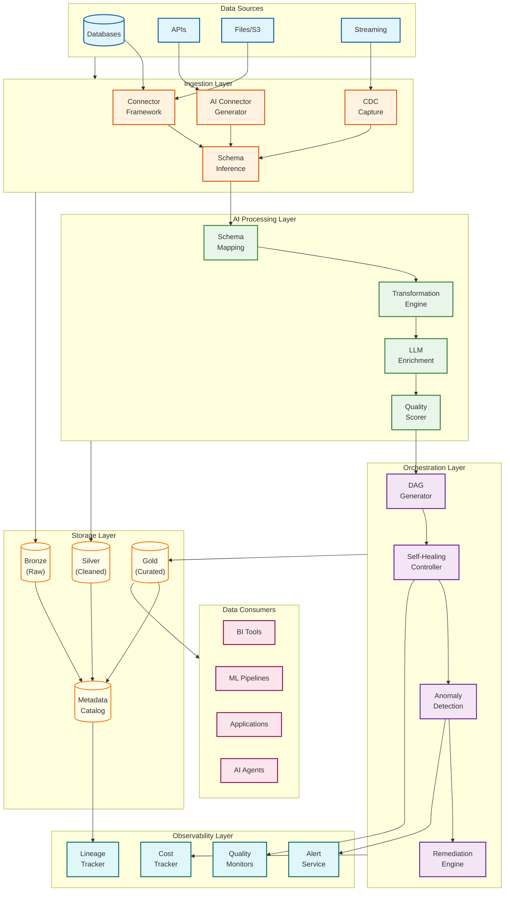
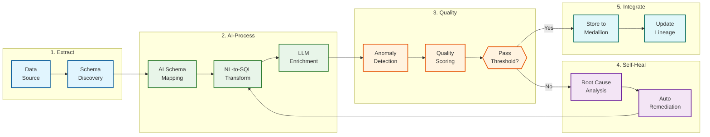
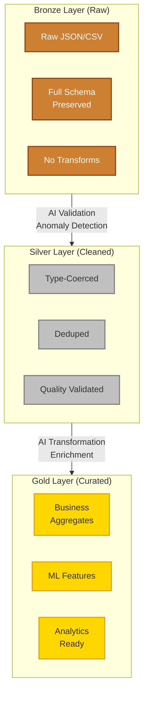

# AI-Native Data Pipeline (EAI)

## Overview

The **AI-Native Data Pipeline (EAI)** is a next-generation data integration platform that evolves beyond traditional ETL/ELT by embedding artificial intelligence throughout the entire pipeline lifecycle. EAI (Extract, AI-Process, Integrate) represents the convergence of autonomous schema mapping, self-healing pipelines, natural language transformations, and intelligent data quality orchestration—enabling data teams to shift from manual pipeline maintenance to strategic data architecture.

**Key Differentiator:** Unlike traditional ETL tools that require manual schema mapping and human intervention for failures, EAI platforms autonomously discover schemas with 95%+ accuracy, self-heal 78% of transient failures without human intervention, and generate transformations from natural language—reducing pipeline development time by 40% and time-to-insight by 64%.

---

## How This Differs from Traditional ETL/ELT

| Aspect | Traditional ETL/ELT | AI-Native Data Pipeline (EAI) |
|--------|---------------------|-------------------------------|
| **Schema Discovery** | Manual mapping, weeks of work | AI infers schemas in minutes with confidence scoring |
| **Schema Drift** | Pipeline failures, manual fixes | Auto-detection, mapping rewrites, self-healing |
| **Transformations** | Hand-coded SQL/Python | Natural language → SQL/dbt generation |
| **Error Handling** | Fixed retry logic, alerts to humans | ML-powered root cause analysis, autonomous remediation |
| **Data Quality** | Post-hoc validation rules | Real-time anomaly detection (freshness, volume, distribution) |
| **Connector Creation** | Days/weeks of development | AI generates from API specs/prompts in minutes |
| **Lineage** | Manual documentation | Auto-generated, column-level tracking |
| **Data Engineer Role** | Pipeline builder | Pipeline strategist validating AI outputs |

---

## System Characteristics

| Characteristic | Value | Implication |
|----------------|-------|-------------|
| Traffic Pattern | Write-heavy (ingestion), Read-heavy (analytics) | Separate compute for ingest vs query |
| Latency Target | <5min (batch), <1s (CDC) | Event-driven for CDC, scheduled for batch |
| Consistency Model | Eventual (ingestion), Strong (quality gates) | Async writes, sync quality validation |
| Availability Target | 99.9% for pipeline execution | Multi-region orchestration, failover |
| Durability | 99.9999% for processed data | Replicated storage, checkpointing |
| Scale Target | 10TB/day, 1000 sources, 1B CDC events/day | Horizontal scaling, sharded metadata |

---

## Complexity Rating

| Component | Rating | Justification |
|-----------|--------|---------------|
| **Overall** | High | ML-powered schema mapping + self-healing + anomaly detection |
| AI Schema Mapping Service | High | Embedding-based matching, LLM reasoning, confidence scoring |
| Self-Healing Controller | High | Error classification, root cause analysis, remediation selection |
| Anomaly Detection Engine | High | Statistical baselines + ML models, adaptive thresholds |
| Transformation Engine | Medium-High | NL-to-SQL generation, dbt integration |
| Data Quality Scorer | Medium-High | Multi-dimensional quality metrics, automated remediation |
| Connector Framework | Medium | API parsing, schema inference, CDC capture |
| Lineage Tracker | Medium | Graph construction, incremental updates |
| Orchestration Layer | Medium | DAG generation, scheduling, backpressure |

---

## Quick Navigation

| Document | Description |
|----------|-------------|
| [01 - Requirements & Estimations](./01-requirements-and-estimations.md) | Functional/non-functional requirements, capacity planning, SLOs |
| [02 - High-Level Design](./02-high-level-design.md) | EAI architecture, medallion layers, data flow |
| [03 - Low-Level Design](./03-low-level-design.md) | Data models, APIs, algorithms (schema mapping, self-healing) |
| [04 - Deep Dive & Bottlenecks](./04-deep-dive-and-bottlenecks.md) | AI mapping, self-healing, anomaly detection internals |
| [05 - Scalability & Reliability](./05-scalability-and-reliability.md) | Scaling patterns, fault tolerance, disaster recovery |
| [06 - Security & Compliance](./06-security-and-compliance.md) | Data security, governance, GDPR/HIPAA/SOC2 |
| [07 - Observability](./07-observability.md) | Data quality metrics, pipeline monitoring, alerting |
| [08 - Interview Guide](./08-interview-guide.md) | 45-minute pacing, trap questions, trade-offs |

---

## Core Modules

| Module | Responsibility | Key Challenge |
|--------|----------------|---------------|
| **Connector Framework** | Source connectivity, API integration | Multi-protocol support (REST, JDBC, CDC) |
| **AI Connector Generator** | Create connectors from API specs/prompts | Accurate inference, authentication handling |
| **Schema Inference Engine** | Discover and infer source schemas | Confidence scoring, type detection |
| **Schema Mapping Service** | Map source → target fields autonomously | Semantic matching, ambiguity resolution |
| **Transformation Engine** | NL → SQL/dbt, code generation | Accuracy, latency, cost management |
| **LLM Enrichment Service** | Context-aware data enrichment | Token costs, caching strategies |
| **Self-Healing Controller** | Error detection, root cause, remediation | Avoiding incorrect auto-fixes |
| **Anomaly Detection Service** | Monitor freshness, volume, distribution | False positive/negative balance |
| **Data Quality Scorer** | Calculate and track quality metrics | Multi-dimensional scoring |
| **Lineage Tracker** | Column-level lineage tracking | Graph computation at scale |
| **Orchestration Engine** | DAG execution, scheduling | Backpressure, dependency management |
| **Medallion Storage** | Bronze/Silver/Gold data layers | Schema evolution, compaction |

---

## Architecture Overview



---

## EAI Pipeline Flow



---

## Key Algorithms Comparison

| Algorithm | Use Case | Latency | Accuracy | When to Use |
|-----------|----------|---------|----------|-------------|
| **Embedding-based Schema Mapping** | Field name matching | <100ms | 85-90% | Initial schema discovery |
| **LLM Schema Reasoning** | Semantic disambiguation | 500ms-2s | 95%+ | Low-confidence mappings |
| **Statistical Anomaly Detection** | Volume, freshness monitoring | <50ms | High precision | Known metric patterns |
| **ML Anomaly Detection** | Distribution drift | 100-500ms | High recall | Complex patterns |
| **Rule-based Self-Healing** | Known failure patterns | <10ms | 100% (for rules) | Transient errors |
| **ML Root Cause Analysis** | Unknown failures | 200ms-1s | 70-85% | Novel error patterns |
| **NL-to-SQL Generation** | Transformation creation | 1-5s | 80-95% | Complex transformations |

---

## Medallion Architecture Layers



---

## Technology Stack Reference

| Layer | Technology Options | Selection Criteria |
|-------|-------------------|-------------------|
| **Connector Framework** | Airbyte, Fivetran, custom | Connector coverage, CDC support |
| **Schema Mapping** | Embedding models, LLMs | Accuracy, latency, cost |
| **Transformation** | dbt, Spark SQL, custom | Ecosystem, semantic layer support |
| **Orchestration** | Temporal, Airflow, Prefect | Self-healing support, DAG flexibility |
| **Storage Format** | Apache Iceberg, Delta Lake | Schema evolution, performance |
| **Data Warehouse** | Snowflake, BigQuery, Redshift | Cost, performance, integration |
| **Anomaly Detection** | Monte Carlo, Acceldata, custom | Coverage, ML capabilities |
| **Quality Metrics** | Great Expectations, Soda | Rule definition, integration |
| **Lineage** | Atlan, Collibra, OpenLineage | Column-level support |
| **Message Queue** | Kafka, Pulsar, Kinesis | Throughput, CDC support |
| **LLM Provider** | GPT-4, Claude, Gemini | Quality, cost, latency |

---

## Key Numbers

| Metric | Value | Context |
|--------|-------|---------|
| Schema mapping accuracy | 95%+ | With LLM disambiguation |
| Self-healing success rate | 78% | For transient failures |
| Pipeline development time reduction | 40% | vs manual ETL |
| Time-to-insight reduction | 64% | With self-healing |
| Connector generation time | <10 minutes | From API spec |
| Anomaly detection latency | <5 minutes | For batch pipelines |
| CDC event latency | <1 second | End-to-end |
| Quality scoring coverage | 100% | All ingested data |
| False positive rate target | <5% | Anomaly detection |
| Human intervention rate | <30% | For pipeline issues |

---

## Interview Readiness Checklist

- [ ] Can explain EAI vs ETL/ELT evolution (AI integration, autonomous operations)
- [ ] Understand embedding-based vs LLM schema mapping trade-offs
- [ ] Know self-healing patterns (error classification, remediation selection)
- [ ] Can design anomaly detection (statistical vs ML, threshold tuning)
- [ ] Understand medallion architecture (Bronze/Silver/Gold layers)
- [ ] Know Apache Iceberg schema evolution patterns
- [ ] Can discuss NL-to-SQL accuracy and validation strategies
- [ ] Understand lineage computation at scale
- [ ] Know cost optimization for LLM transformations
- [ ] Can design graceful degradation (fallback strategies)

---

## Real-World References

| Company/Product | Key Innovation |
|-----------------|----------------|
| **Matillion MAIA** | Agentic data team, NL → full pipelines, virtual data engineers |
| **Informatica CLAIRE** | ELT agents, Data Quality agents, Agent Engineering Hub |
| **Airbyte** | AI Connector Builder, self-healing jobs, 600+ connectors |
| **Fivetran + Census** | End-to-end data loop, reverse ETL, 700+ connectors |
| **dbt Fusion** | Rust-based engine, MCP server, AI agents for discovery/quality |
| **Monte Carlo** | Data + AI observability, ML anomaly detection, agent observability |
| **Acceldata** | GenAI pipeline observability, automated remediation |
| **Apache Iceberg** | Schema evolution, partition evolution, time travel |

---

## Quick Reference Card

```
+------------------------------------------------------------------------+
|       AI-NATIVE DATA PIPELINE (EAI) - QUICK REFERENCE                  |
+------------------------------------------------------------------------+
|                                                                         |
|  EAI PARADIGM                                                           |
|  ------------                                                           |
|  Extract: Ingest from any source with AI schema discovery              |
|  AI-Process: Transform with NL-to-SQL, LLM enrichment                  |
|  Integrate: Store in medallion layers with quality gates               |
|                                                                         |
+------------------------------------------------------------------------+
|                                                                         |
|  SELF-HEALING TIERS                 ANOMALY DETECTION                  |
|  ------------------                 -----------------                   |
|  Auto-heal: Transient errors        Freshness: Time since update       |
|  (network, rate limits)             Volume: Row count deviations       |
|                                     Distribution: Value profile        |
|  Human-approve: Schema drift,       Schema: Column changes             |
|  data model changes                                                     |
|                                                                         |
+------------------------------------------------------------------------+
|                                                                         |
|  MEDALLION LAYERS                   KEY METRICS                        |
|  ---------------                    -----------                         |
|  Bronze: Raw, full schema           * Schema accuracy: 95%+            |
|  Silver: Cleaned, validated         * Self-heal rate: 78%              |
|  Gold: Curated, analytics-ready     * Dev time reduction: 40%          |
|                                     * Human intervention: <30%          |
|                                                                         |
+------------------------------------------------------------------------+
|                                                                         |
|  INTERVIEW KEYWORDS                                                     |
|  ------------------                                                     |
|  EAI, ETL/ELT evolution, schema mapping, self-healing, anomaly         |
|  detection, medallion architecture, Iceberg, NL-to-SQL, dbt, lineage,  |
|  data quality, CDC, embedding-based matching, LLM disambiguation       |
|                                                                         |
+------------------------------------------------------------------------+
```

---

## When to Use This Design

**Use AI-Native Data Pipeline (EAI) When:**
- Managing 100+ data sources with frequent schema changes
- Data engineers spend >60% time on pipeline maintenance
- Self-service data integration is a strategic goal
- Real-time CDC requirements alongside batch processing
- Data quality is a first-class concern (not afterthought)
- Natural language transformation authoring is valuable
- Autonomous operations reduce on-call burden

**Do NOT Use When:**
- Simple, stable pipelines (<10 sources, no schema drift)
- Latency requirements are sub-100ms (use streaming directly)
- Budget doesn't support LLM inference costs
- Regulatory requirements prohibit AI decision-making
- Data volumes are low (<100GB/day)

---

## Related Systems

- [3.15 RAG System](../3.15-rag-system/00-index.md) - Context retrieval for LLM transformations
- [3.21 LLM Gateway](../3.21-llm-gateway-prompt-management/00-index.md) - LLM routing and cost optimization
- [3.25 AI Observability & LLMOps](../3.25-ai-observability-llmops-platform/00-index.md) - Pipeline quality monitoring
- [16.8 CDC System](../16.8-change-data-capture-cdc/00-index.md) - Real-time data capture
- [16.9 Data Mesh Architecture](../16.9-data-mesh-architecture/00-index.md) - Decentralized data ownership
- [2.6 Distributed Job Scheduler](../2.6-distributed-job-scheduler/00-index.md) - Pipeline orchestration
