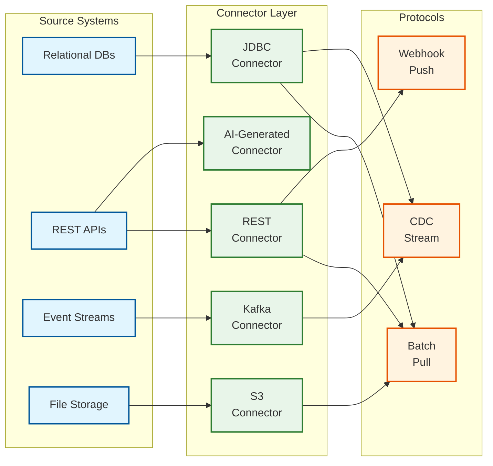

# High-Level Design

## Architecture Overview

The AI-Native Data Pipeline follows a five-layer architecture that separates concerns while enabling AI capabilities to permeate each layer. The design prioritizes autonomous operation, self-healing, and intelligent data quality management.

```mermaid
flowchart TB
    subgraph External["External Systems"]
        direction LR
        RDBMS[(Relational<br/>Databases)]
        NoSQL[(NoSQL<br/>Stores)]
        APIs[REST/GraphQL<br/>APIs]
        Files[Files<br/>(S3/GCS)]
        Streams[Event<br/>Streams]
        SaaS[SaaS<br/>Apps]
    end

    subgraph Layer1["Layer 1: Ingestion"]
        direction TB
        ConnectorMgr["Connector<br/>Manager"]
        AIConnGen["AI Connector<br/>Generator"]
        SchemaDisc["Schema<br/>Discovery"]
        CDCEngine["CDC<br/>Engine"]
        BatchPuller["Batch<br/>Puller"]
    end

    subgraph Layer2["Layer 2: AI Processing"]
        direction TB
        SchemaMapper["AI Schema<br/>Mapper"]
        TransformGen["NL-to-SQL<br/>Generator"]
        LLMEnricher["LLM<br/>Enricher"]
        QualityEngine["Quality<br/>Engine"]
    end

    subgraph Layer3["Layer 3: Orchestration"]
        direction TB
        DAGCompiler["DAG<br/>Compiler"]
        Scheduler["Pipeline<br/>Scheduler"]
        SelfHealCtrl["Self-Healing<br/>Controller"]
        AnomalyEngine["Anomaly<br/>Engine"]
    end

    subgraph Layer4["Layer 4: Storage"]
        direction TB
        subgraph Medallion["Medallion Architecture"]
            Bronze[("Bronze<br/>(Raw)")]
            Silver[("Silver<br/>(Clean)")]
            Gold[("Gold<br/>(Curated)")]
        end
        MetaCatalog[("Metadata<br/>Catalog")]
        LineageStore[("Lineage<br/>Graph")]
    end

    subgraph Layer5["Layer 5: Observability"]
        direction TB
        QualityMon["Quality<br/>Monitors"]
        PipelineMon["Pipeline<br/>Monitors"]
        CostTracker["Cost<br/>Tracker"]
        AlertMgr["Alert<br/>Manager"]
    end

    subgraph Consumers["Data Consumers"]
        direction LR
        BI[BI Tools]
        Analytics[Analytics]
        MLPlatform[ML Platform]
        AIAgents[AI Agents]
        ReverseETL[Reverse<br/>ETL]
    end

    External --> Layer1
    Layer1 --> Layer2
    Layer2 --> Layer3
    Layer3 --> Layer4
    Layer4 --> Consumers

    Layer3 --> Layer5
    Layer4 --> Layer5
    Layer5 -.->|Feedback| Layer3

    classDef external fill:#e1f5fe,stroke:#01579b,stroke-width:2px
    classDef layer1 fill:#fff3e0,stroke:#e65100,stroke-width:2px
    classDef layer2 fill:#e8f5e9,stroke:#2e7d32,stroke-width:2px
    classDef layer3 fill:#f3e5f5,stroke:#6a1b9a,stroke-width:2px
    classDef layer4 fill:#fffde7,stroke:#f57f17,stroke-width:2px
    classDef layer5 fill:#e0f7fa,stroke:#00695c,stroke-width:2px
    classDef consumer fill:#fce4ec,stroke:#880e4f,stroke-width:2px

    class RDBMS,NoSQL,APIs,Files,Streams,SaaS external
    class ConnectorMgr,AIConnGen,SchemaDisc,CDCEngine,BatchPuller layer1
    class SchemaMapper,TransformGen,LLMEnricher,QualityEngine layer2
    class DAGCompiler,Scheduler,SelfHealCtrl,AnomalyEngine layer3
    class Bronze,Silver,Gold,MetaCatalog,LineageStore layer4
    class QualityMon,PipelineMon,CostTracker,AlertMgr layer5
    class BI,Analytics,MLPlatform,AIAgents,ReverseETL consumer
```

---

## Layer Details

### Layer 1: Ingestion Layer

| Component | Responsibility | Key Features |
|-----------|----------------|--------------|
| **Connector Manager** | Manage source connections | Connection pooling, credential management, health monitoring |
| **AI Connector Generator** | Generate connectors from specs | API spec parsing, auth pattern detection, pagination inference |
| **Schema Discovery** | Infer source schemas | Type detection, nested structure handling, confidence scoring |
| **CDC Engine** | Capture real-time changes | Log-based CDC, event ordering, exactly-once delivery |
| **Batch Puller** | Full/incremental extraction | Parallel extraction, checkpoint management, rate limiting |

### Layer 2: AI Processing Layer

| Component | Responsibility | Key Features |
|-----------|----------------|--------------|
| **AI Schema Mapper** | Map source → target fields | Embedding similarity, LLM disambiguation, human-in-loop |
| **NL-to-SQL Generator** | Transform natural language to code | Prompt engineering, SQL validation, dbt model generation |
| **LLM Enricher** | Add context and derived fields | Entity extraction, classification, summarization |
| **Quality Engine** | Compute quality scores | Completeness, accuracy, consistency, timeliness |

### Layer 3: Orchestration Layer

| Component | Responsibility | Key Features |
|-----------|----------------|--------------|
| **DAG Compiler** | Generate execution DAGs | Dependency resolution, parallelization, AI-assisted optimization |
| **Pipeline Scheduler** | Execute pipelines on schedule | Cron, event-driven, backfill management |
| **Self-Healing Controller** | Detect and fix failures | Error classification, root cause analysis, remediation selection |
| **Anomaly Engine** | Detect data anomalies | Statistical analysis, ML models, adaptive thresholds |

### Layer 4: Storage Layer

| Component | Responsibility | Key Features |
|-----------|----------------|--------------|
| **Bronze (Raw)** | Store raw ingested data | Schema-on-read, full fidelity, audit trail |
| **Silver (Clean)** | Store validated data | Type coercion, deduplication, quality gates |
| **Gold (Curated)** | Store business-ready data | Aggregations, ML features, semantic models |
| **Metadata Catalog** | Track schemas and configs | Version history, search, governance policies |
| **Lineage Graph** | Track data flow | Column-level lineage, impact analysis |

### Layer 5: Observability Layer

| Component | Responsibility | Key Features |
|-----------|----------------|--------------|
| **Quality Monitors** | Track data quality metrics | Freshness, volume, distribution, schema drift |
| **Pipeline Monitors** | Track execution metrics | Duration, success rate, resource usage |
| **Cost Tracker** | Track infrastructure costs | Per-pipeline costs, optimization recommendations |
| **Alert Manager** | Route and manage alerts | Severity routing, deduplication, escalation |

---

## Data Flow Architecture

### Batch Pipeline Flow


### CDC Pipeline Flow


---

## Key Architectural Decisions

### Decision 1: ELT over ETL

| Factor | ETL | ELT | Decision: ELT |
|--------|-----|-----|---------------|
| **Transformation Location** | Pre-load | Post-load | Leverage warehouse compute |
| **Raw Data Preservation** | Transformed only | Full fidelity | Better for AI/ML |
| **Schema Evolution** | Complex | Native (Iceberg) | Supports drift handling |
| **Cost** | Dedicated compute | Warehouse compute | Consolidate resources |
| **Flexibility** | Fixed transforms | Dynamic transforms | NL-to-SQL enables flexibility |

### Decision 2: Event-Driven for CDC, Scheduled for Batch

| Scenario | Pattern | Rationale |
|----------|---------|-----------|
| **Real-time sources** | Event-driven | Minimize latency, react to changes |
| **Full table syncs** | Scheduled | Predictable resource allocation |
| **Dependency chains** | Event + Schedule | Events trigger, schedule enforces SLAs |
| **Backfills** | Scheduled | Controlled resource consumption |

### Decision 3: Medallion Architecture

```
Bronze (Raw)
├── Append-only, full fidelity
├── Schema-on-read
├── Short retention (7 days)
└── Purpose: Reprocessing, audit

Silver (Cleaned)
├── Type-coerced, deduplicated
├── Quality validated
├── Medium retention (90 days)
└── Purpose: Analysis, ML features

Gold (Curated)
├── Business aggregations
├── Semantic models
├── Long retention (years)
└── Purpose: BI, reporting, AI
```

### Decision 4: Apache Iceberg for Storage Format

| Feature | Benefit for EAI |
|---------|-----------------|
| **Schema Evolution** | Handle drift without rewrites |
| **Partition Evolution** | Optimize without migration |
| **Time Travel** | Audit, debugging, reprocessing |
| **Hidden Partitioning** | Abstract partitioning from queries |
| **ACID Transactions** | Reliable concurrent writes |

### Decision 5: Semantic Layer Integration


**Rationale:** Semantic layer provides:
- Consistent business definitions for AI agents
- Grounding to prevent LLM hallucinations
- Reusable metrics across tools

---

## Architecture Pattern Checklist

| Pattern | Decision | Rationale |
|---------|----------|-----------|
| ✅ Sync vs Async | Async (event-driven) for CDC, Sync for batch | Latency vs throughput trade-off |
| ✅ Event-driven vs Request-response | Event-driven primary | Decoupling, scalability |
| ✅ Push vs Pull | Pull for batch, Push for CDC | Source capability varies |
| ✅ Stateless vs Stateful | Stateless workers, Stateful orchestrator | Scalability + coordination |
| ✅ Read-heavy vs Write-heavy | Write-heavy ingestion, Read-heavy analytics | Separate compute pools |
| ✅ Real-time vs Batch | Hybrid (CDC + scheduled) | Support both patterns |
| ✅ Edge vs Origin | Origin processing | Central AI model deployment |

---

## Self-Healing Architecture


### Self-Healing Decision Matrix

| Error Type | Detection | Remediation | Auto-Heal? |
|------------|-----------|-------------|------------|
| Network timeout | Connection error | Exponential backoff retry | Yes |
| Rate limit exceeded | 429 response | Adaptive rate limiting | Yes |
| Transient DB error | Connection pool error | Retry with fresh connection | Yes |
| Schema column added | Schema diff | Update mapping, continue | Yes |
| Schema column removed | Schema diff | Flag for review, use defaults | Partial |
| Schema type change | Type coercion error | Flag for review | No |
| Data quality violation | Quality check failure | Quarantine + alert | Yes |
| Source unavailable | Connection timeout | Retry then alert | Partial |
| Out of memory | Resource error | Scale + retry | Yes |
| Unknown error | Unclassified | ML diagnosis + escalate | No |

---

## Anomaly Detection Architecture


---

## Integration Points

### Source System Integration



### Downstream Integration

| Consumer | Integration Pattern | Data Layer |
|----------|-------------------|------------|
| BI Tools | Direct query, semantic layer | Gold |
| ML Platforms | Feature extraction, batch export | Silver, Gold |
| AI Agents | Semantic layer, MCP protocol | Gold |
| Reverse ETL | Event-driven sync | Gold |
| Data Scientists | Notebook access, time travel | Silver |

---

## High Availability Design


### Failover Strategy

| Component | Failover Mechanism | RTO |
|-----------|-------------------|-----|
| Ingestion | Auto-failover to other region | <1 min |
| Processing | Stateless, any region | <1 min |
| Orchestration | Leader election | <5 min |
| Storage | Read from replica, write to primary | <15 min |
| Metadata | Multi-region active-active | 0 |
