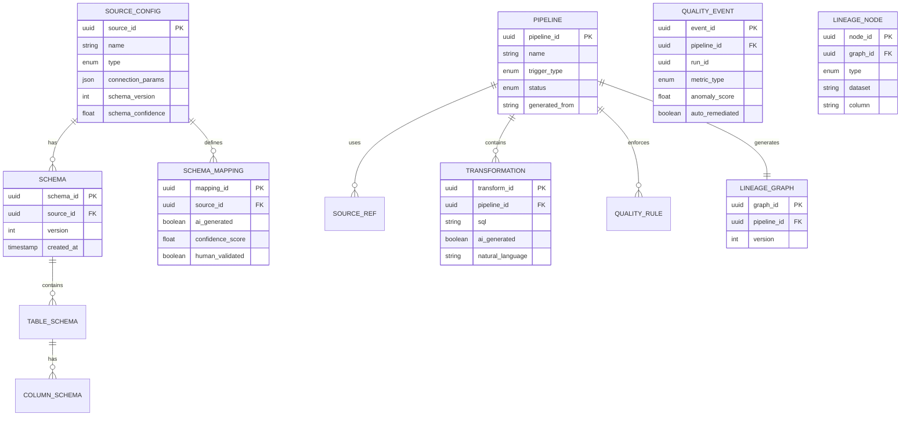

# Low-Level Design

## Data Models

### Source Configuration

```
SourceConfig {
    source_id:          UUID                    // Unique identifier
    name:               String                  // Human-readable name
    type:               SourceType              // RDBMS | API | FILE | STREAM | SAAS
    connection_params:  EncryptedJSON           // Connection details
    auth_config:        AuthConfig              // Authentication settings

    // Schema Information
    discovered_schema:  Schema                  // AI-discovered schema
    schema_version:     Integer                 // Schema version counter
    schema_confidence:  Float [0-1]             // AI confidence in schema
    last_schema_update: Timestamp               // Last schema discovery

    // Mapping Information
    mapped_schema:      SchemaMapping[]         // Source → Target mappings
    mapping_status:     MappingStatus           // PENDING | VALIDATED | REJECTED

    // Operational
    ai_generated:       Boolean                 // Was connector AI-generated?
    health_status:      HealthStatus            // HEALTHY | DEGRADED | DOWN
    last_sync:          Timestamp               // Last successful sync
    sync_mode:          SyncMode                // FULL | INCREMENTAL | CDC

    // Metadata
    created_at:         Timestamp
    updated_at:         Timestamp
    created_by:         UserID
    tags:               String[]
}

SourceType: ENUM {
    RDBMS,          // PostgreSQL, MySQL, Oracle, SQL Server
    API,            // REST, GraphQL
    FILE,           // S3, GCS, SFTP
    STREAM,         // Kafka, Kinesis, Pub/Sub
    SAAS            // Salesforce, HubSpot, etc.
}

SyncMode: ENUM {
    FULL,           // Complete table extraction
    INCREMENTAL,    // Delta based on cursor
    CDC             // Change Data Capture
}
```

### Schema Representation

```
Schema {
    schema_id:          UUID
    source_id:          UUID
    version:            Integer
    tables:             TableSchema[]

    // AI Metadata
    inference_model:    String                  // Model used for inference
    inference_time:     Duration                // Time taken to infer
    sample_size:        Integer                 // Rows sampled for inference
}

TableSchema {
    table_name:         String
    columns:            ColumnSchema[]
    primary_key:        String[]
    foreign_keys:       ForeignKey[]
    estimated_rows:     Long
    estimated_size:     Long                    // Bytes
}

ColumnSchema {
    column_name:        String
    data_type:          DataType
    nullable:           Boolean
    default_value:      Any

    // AI-Inferred Properties
    inferred_type:      DataType                // AI-detected type
    type_confidence:    Float [0-1]
    semantic_type:      SemanticType            // EMAIL | PHONE | ADDRESS | PII | etc.
    sample_values:      String[]                // Representative samples
    statistics:         ColumnStatistics
}

ColumnStatistics {
    null_count:         Long
    distinct_count:     Long
    min_value:          Any
    max_value:          Any
    avg_length:         Float                   // For strings
    value_distribution: Map<String, Float>      // Top values and frequencies
}

SemanticType: ENUM {
    EMAIL, PHONE, ADDRESS, NAME, DATE, TIMESTAMP,
    CURRENCY, PERCENTAGE, URL, IP_ADDRESS,
    PII_SSN, PII_CREDIT_CARD, PII_PASSPORT,
    IDENTIFIER, CATEGORICAL, NUMERIC, TEXT
}
```

### Schema Mapping

```
SchemaMapping {
    mapping_id:         UUID
    source_id:          UUID
    target_dataset:     String                  // Bronze/Silver/Gold table

    field_mappings:     FieldMapping[]

    // AI Metadata
    ai_generated:       Boolean
    confidence_score:   Float [0-1]
    human_validated:    Boolean
    validated_by:       UserID
    validated_at:       Timestamp

    // Versioning
    version:            Integer
    previous_version:   UUID
    created_at:         Timestamp
}

FieldMapping {
    source_field:       String                  // Fully qualified: table.column
    target_field:       String                  // Destination field name
    transformation:     TransformExpression     // Optional transformation

    // AI Reasoning
    match_type:         MatchType               // EXACT | FUZZY | SEMANTIC | INFERRED
    similarity_score:   Float [0-1]             // Embedding similarity
    reasoning:          String                  // LLM explanation
    alternatives:       AlternativeMapping[]    // Other considered mappings
}

MatchType: ENUM {
    EXACT,              // Identical names
    FUZZY,              // Similar names (edit distance)
    SEMANTIC,           // Same meaning, different names
    INFERRED            // LLM-inferred from context
}

AlternativeMapping {
    target_field:       String
    similarity_score:   Float
    reasoning:          String
}
```

### Pipeline Definition

```
Pipeline {
    pipeline_id:        UUID
    name:               String
    description:        String

    // Sources and Destinations
    sources:            SourceRef[]
    destination:        DestinationConfig

    // Processing
    transformations:    Transformation[]
    quality_rules:      QualityRule[]

    // Scheduling
    schedule:           ScheduleConfig
    trigger_type:       TriggerType             // SCHEDULED | EVENT | MANUAL

    // Self-Healing
    self_healing_config: SelfHealingConfig

    // Lineage
    lineage_graph:      LineageGraph

    // Generation
    generated_from:     GenerationSource        // NATURAL_LANGUAGE | CODE | UI
    original_prompt:    String                  // If NL-generated

    // Metadata
    status:             PipelineStatus
    created_at:         Timestamp
    updated_at:         Timestamp
    owner:              UserID
    tags:               String[]
}

Transformation {
    transform_id:       UUID
    name:               String
    type:               TransformType

    // Definition
    sql:                String                  // Generated SQL
    dbt_model:          String                  // If dbt-based

    // AI Generation
    ai_generated:       Boolean
    natural_language:   String                  // Original NL description
    generation_model:   String                  // LLM used

    // Dependencies
    inputs:             String[]                // Input tables/columns
    outputs:            String[]                // Output tables/columns
}

TransformType: ENUM {
    SELECT,             // Simple projection
    FILTER,             // Row filtering
    AGGREGATE,          // Grouping and aggregation
    JOIN,               // Multi-table join
    WINDOW,             // Window functions
    PIVOT,              // Pivoting data
    CUSTOM              // Custom SQL/UDF
}

SelfHealingConfig {
    enabled:            Boolean
    auto_retry:         Boolean
    max_retries:        Integer
    retry_backoff:      Duration

    // Schema Drift
    auto_map_new_columns:   Boolean
    alert_on_removed_columns: Boolean

    // Quality Issues
    quarantine_bad_records: Boolean
    quality_threshold:      Float [0-1]

    // Escalation
    escalation_policy:      String
    escalation_timeout:     Duration
}
```

### Data Quality Event

```
QualityEvent {
    event_id:           UUID
    pipeline_id:        UUID
    run_id:             UUID

    // Timing
    timestamp:          Timestamp
    detection_latency:  Duration                // Time to detect

    // Metric Details
    metric_type:        QualityMetricType
    dimension:          String                  // Table or column affected

    // Values
    expected_value:     Any                     // Baseline expectation
    actual_value:       Any                     // Observed value
    deviation:          Float                   // Percentage deviation

    // Scoring
    anomaly_score:      Float [0-1]             // ML anomaly score
    severity:           Severity                // LOW | MEDIUM | HIGH | CRITICAL

    // Remediation
    auto_remediated:    Boolean
    remediation_action: String
    remediation_time:   Duration

    // Classification
    root_cause:         String                  // Identified cause
    false_positive:     Boolean                 // Marked as FP by user
}

QualityMetricType: ENUM {
    FRESHNESS,          // Time since last update
    VOLUME,             // Row count
    DISTRIBUTION,       // Value distribution change
    SCHEMA,             // Schema change detected
    COMPLETENESS,       // Null rate
    UNIQUENESS,         // Duplicate rate
    ACCURACY,           // Cross-validation failure
    CONSISTENCY         // Referential integrity
}
```

### Lineage Record

```
LineageGraph {
    graph_id:           UUID
    pipeline_id:        UUID
    version:            Integer

    nodes:              LineageNode[]
    edges:              LineageEdge[]

    computed_at:        Timestamp
    computation_method: String                  // STATIC | RUNTIME
}

LineageNode {
    node_id:            UUID
    type:               NodeType

    // Identification
    dataset:            String                  // Table/file name
    column:             String                  // If column-level

    // Metadata
    quality_score:      Float [0-1]
    last_updated:       Timestamp
    owner:              String

    // Position in graph
    depth:              Integer                 // Distance from source
}

NodeType: ENUM {
    SOURCE,             // External data source
    BRONZE,             // Raw layer
    SILVER,             // Clean layer
    GOLD,               // Curated layer
    TRANSFORMATION,     // Processing step
    EXTERNAL            // External consumer
}

LineageEdge {
    edge_id:            UUID
    source_node:        UUID
    target_node:        UUID

    // Transformation
    transformation_sql: String
    transformation_type: TransformType

    // Metadata
    impact_score:       Float                   // How much source affects target
}
```

---

## ER Diagram



---

## API Design

### Pipeline Management APIs

```
# Pipeline CRUD
POST   /api/v1/pipelines
GET    /api/v1/pipelines
GET    /api/v1/pipelines/{pipeline_id}
PUT    /api/v1/pipelines/{pipeline_id}
DELETE /api/v1/pipelines/{pipeline_id}

# Pipeline Execution
POST   /api/v1/pipelines/{pipeline_id}/runs
GET    /api/v1/pipelines/{pipeline_id}/runs
GET    /api/v1/pipelines/{pipeline_id}/runs/{run_id}
POST   /api/v1/pipelines/{pipeline_id}/runs/{run_id}/cancel

# Pipeline Lineage
GET    /api/v1/pipelines/{pipeline_id}/lineage
GET    /api/v1/pipelines/{pipeline_id}/lineage/impact/{column}

# Pipeline Quality
GET    /api/v1/pipelines/{pipeline_id}/quality
GET    /api/v1/pipelines/{pipeline_id}/quality/history
```

### Source Management APIs

```
# Source CRUD
POST   /api/v1/sources
GET    /api/v1/sources
GET    /api/v1/sources/{source_id}
PUT    /api/v1/sources/{source_id}
DELETE /api/v1/sources/{source_id}

# Schema Discovery
POST   /api/v1/sources/{source_id}/discover
GET    /api/v1/sources/{source_id}/schema
GET    /api/v1/sources/{source_id}/schema/history

# Schema Mapping
GET    /api/v1/sources/{source_id}/mappings
PUT    /api/v1/sources/{source_id}/mappings
POST   /api/v1/sources/{source_id}/mappings/validate
POST   /api/v1/sources/{source_id}/mappings/approve
```

### AI Generation APIs

```
# Transformation Generation
POST   /api/v1/transformations/generate
Request:
{
    "natural_language": "Calculate monthly revenue by product category",
    "source_tables": ["orders", "products"],
    "output_format": "sql" | "dbt"
}
Response:
{
    "transformation_id": "uuid",
    "sql": "SELECT ...",
    "confidence": 0.92,
    "explanation": "This query...",
    "validation_status": "passed" | "warning" | "failed",
    "validation_messages": []
}

# Connector Generation
POST   /api/v1/connectors/generate
Request:
{
    "api_spec": "OpenAPI spec or URL",
    "description": "Natural language description",
    "auth_type": "oauth2" | "api_key" | "basic"
}
Response:
{
    "connector_id": "uuid",
    "config": { ... },
    "discovered_streams": ["stream1", "stream2"],
    "generation_status": "complete" | "needs_review"
}
```

### Anomaly and Quality APIs

```
# Anomaly Management
GET    /api/v1/anomalies
GET    /api/v1/anomalies/{anomaly_id}
POST   /api/v1/anomalies/{anomaly_id}/acknowledge
POST   /api/v1/anomalies/{anomaly_id}/remediate
POST   /api/v1/anomalies/{anomaly_id}/mark-false-positive

# Quality Metrics
GET    /api/v1/quality/scores
GET    /api/v1/quality/scores/{table}
GET    /api/v1/quality/rules
POST   /api/v1/quality/rules
```

### Request/Response Examples

**Create Pipeline from Natural Language:**

```
POST /api/v1/pipelines
{
    "name": "Daily Sales Analytics",
    "description": "Aggregate daily sales by region and product",
    "generation_mode": "natural_language",
    "prompt": "Create a pipeline that reads from the orders and products tables,
               joins them, and creates a daily aggregate of sales by region
               and product category. Include data quality checks for null
               values and duplicate order IDs.",
    "sources": ["source_orders", "source_products"],
    "destination": {
        "type": "GOLD",
        "table": "daily_sales_summary"
    },
    "schedule": {
        "cron": "0 6 * * *",
        "timezone": "UTC"
    }
}

Response:
{
    "pipeline_id": "550e8400-e29b-41d4-a716-446655440000",
    "name": "Daily Sales Analytics",
    "status": "DRAFT",
    "generated_transformations": [
        {
            "name": "join_orders_products",
            "sql": "SELECT o.*, p.category, p.region FROM orders o JOIN products p ON o.product_id = p.id",
            "confidence": 0.95
        },
        {
            "name": "daily_aggregate",
            "sql": "SELECT DATE_TRUNC('day', order_date) as date, region, category, SUM(amount) as total_sales, COUNT(*) as order_count FROM joined_data GROUP BY 1, 2, 3",
            "confidence": 0.93
        }
    ],
    "generated_quality_rules": [
        {
            "name": "no_null_order_ids",
            "sql": "SELECT COUNT(*) = 0 FROM orders WHERE order_id IS NULL",
            "type": "COMPLETENESS"
        },
        {
            "name": "unique_order_ids",
            "sql": "SELECT COUNT(*) = COUNT(DISTINCT order_id) FROM orders",
            "type": "UNIQUENESS"
        }
    ],
    "review_required": true,
    "review_items": [
        "Confirm join condition: o.product_id = p.id",
        "Verify region column exists in products table"
    ]
}
```

---

## Core Algorithms

### Algorithm 1: AI Schema Mapping

```pseudocode
FUNCTION map_schema(source_schema, target_schema, confidence_threshold = 0.7):
    mappings = []
    unmatched = []

    // Step 1: Generate embeddings for all fields
    source_embeddings = {}
    target_embeddings = {}

    FOR each field IN source_schema.fields:
        embedding = generate_embedding(
            field.name,
            field.type,
            field.sample_values,
            field.statistics
        )
        source_embeddings[field.name] = embedding

    FOR each field IN target_schema.fields:
        embedding = generate_embedding(
            field.name,
            field.type,
            field.description
        )
        target_embeddings[field.name] = embedding

    // Step 2: Calculate similarity matrix
    similarity_matrix = calculate_cosine_similarity(
        source_embeddings,
        target_embeddings
    )

    // Step 3: Find best matches using Hungarian algorithm
    assignments = hungarian_match(similarity_matrix)

    FOR each (source_field, target_field, score) IN assignments:
        IF score >= confidence_threshold:
            mappings.append(FieldMapping(
                source_field = source_field,
                target_field = target_field,
                match_type = classify_match(score),
                similarity_score = score,
                ai_generated = TRUE
            ))
        ELSE:
            unmatched.append(source_field)

    // Step 4: LLM disambiguation for low-confidence matches
    IF unmatched.length > 0:
        llm_mappings = llm_disambiguate(
            unmatched,
            source_schema,
            target_schema,
            existing_mappings = mappings
        )

        FOR each mapping IN llm_mappings:
            IF mapping.confidence >= confidence_threshold:
                mappings.append(mapping)
            ELSE:
                mapping.requires_human_review = TRUE
                mappings.append(mapping)

    RETURN SchemaMappingResult(
        mappings = mappings,
        overall_confidence = calculate_average_confidence(mappings),
        review_required = any(m.requires_human_review FOR m IN mappings)
    )

FUNCTION generate_embedding(field_name, data_type, context):
    // Combine multiple signals for richer embedding
    text = f"{field_name} | type: {data_type} | context: {context}"
    embedding = embedding_model.encode(text)
    RETURN normalize(embedding)

FUNCTION classify_match(score):
    IF score > 0.95:
        RETURN EXACT
    ELSE IF score > 0.85:
        RETURN FUZZY
    ELSE IF score > 0.7:
        RETURN SEMANTIC
    ELSE:
        RETURN INFERRED
```

**Time Complexity:** O(n × m) for similarity matrix, O(n³) for Hungarian algorithm
**Space Complexity:** O(n × m) for similarity matrix

---

### Algorithm 2: Self-Healing Decision Tree

```pseudocode
FUNCTION handle_pipeline_failure(failure_event):
    // Step 1: Classify the error
    error_class = classify_error(failure_event)

    // Step 2: Determine if auto-remediation is possible
    remediation = select_remediation(error_class, failure_event)

    IF remediation.auto_remediate:
        // Step 3: Apply remediation
        result = apply_remediation(remediation, failure_event)

        IF result.success:
            log_successful_healing(failure_event, remediation)
            RETURN HealingResult(
                status = HEALED,
                action = remediation.action,
                latency = result.duration
            )
        ELSE:
            // Remediation failed, escalate
            escalate_to_human(failure_event, remediation, result)
    ELSE:
        // Cannot auto-remediate
        escalate_to_human(failure_event, remediation)

    RETURN HealingResult(status = ESCALATED)

FUNCTION classify_error(failure_event):
    error_message = failure_event.error_message
    error_code = failure_event.error_code
    context = failure_event.context

    // Rule-based classification first
    IF matches_pattern(error_message, NETWORK_PATTERNS):
        RETURN ErrorClass(type = TRANSIENT, subtype = NETWORK)

    IF matches_pattern(error_message, RATE_LIMIT_PATTERNS):
        RETURN ErrorClass(type = TRANSIENT, subtype = RATE_LIMIT)

    IF matches_pattern(error_message, SCHEMA_PATTERNS):
        schema_diff = detect_schema_change(context)
        RETURN ErrorClass(type = SCHEMA_DRIFT, diff = schema_diff)

    IF matches_pattern(error_message, QUALITY_PATTERNS):
        RETURN ErrorClass(type = DATA_QUALITY)

    // Fall back to ML classification
    RETURN ml_classifier.predict(failure_event)

FUNCTION select_remediation(error_class, failure_event):
    config = failure_event.pipeline.self_healing_config

    SWITCH error_class.type:
        CASE TRANSIENT:
            IF config.auto_retry AND failure_event.retry_count < config.max_retries:
                RETURN Remediation(
                    auto_remediate = TRUE,
                    action = RETRY_WITH_BACKOFF,
                    backoff = exponential_backoff(failure_event.retry_count)
                )

        CASE RATE_LIMIT:
            RETURN Remediation(
                auto_remediate = TRUE,
                action = ADAPTIVE_RATE_LIMIT,
                new_rate = calculate_safe_rate(failure_event)
            )

        CASE SCHEMA_DRIFT:
            IF error_class.diff.type == COLUMN_ADDED AND config.auto_map_new_columns:
                RETURN Remediation(
                    auto_remediate = TRUE,
                    action = ADD_COLUMN_MAPPING,
                    mapping = generate_mapping_for_column(error_class.diff.column)
                )
            ELSE IF error_class.diff.type == COLUMN_REMOVED:
                RETURN Remediation(
                    auto_remediate = FALSE,
                    action = ALERT_SCHEMA_CHANGE,
                    reason = "Column removal requires review"
                )

        CASE DATA_QUALITY:
            IF config.quarantine_bad_records:
                RETURN Remediation(
                    auto_remediate = TRUE,
                    action = QUARANTINE_AND_CONTINUE,
                    quarantine_reason = error_class.quality_issue
                )

        DEFAULT:
            RETURN Remediation(
                auto_remediate = FALSE,
                action = ESCALATE,
                reason = "Unknown error type"
            )
```

---

### Algorithm 3: Anomaly Detection (Hybrid Statistical + ML)

```pseudocode
FUNCTION detect_anomalies(metric_stream, config):
    anomalies = []

    FOR each metric_point IN metric_stream:
        // Step 1: Statistical detection
        statistical_score = statistical_detect(metric_point, config)

        // Step 2: ML detection
        ml_score = ml_detect(metric_point, config)

        // Step 3: Combine scores
        combined_score = combine_scores(statistical_score, ml_score, config.weights)

        // Step 4: Apply adaptive threshold
        threshold = get_adaptive_threshold(metric_point.metric_type, config)

        IF combined_score > threshold:
            anomaly = create_anomaly(metric_point, combined_score)

            // Step 5: Correlate with other anomalies
            correlated = correlate_anomalies(anomaly, recent_anomalies)
            anomaly.correlated_events = correlated

            // Step 6: Classify severity
            anomaly.severity = classify_severity(anomaly, correlated)

            anomalies.append(anomaly)

    RETURN anomalies

FUNCTION statistical_detect(metric_point, config):
    baseline = get_baseline(metric_point.metric_type, metric_point.dimension)

    // Z-score for normally distributed metrics
    IF baseline.distribution == NORMAL:
        z_score = (metric_point.value - baseline.mean) / baseline.std_dev
        RETURN sigmoid(abs(z_score) - config.z_threshold)

    // IQR for skewed distributions
    IF baseline.distribution == SKEWED:
        iqr = baseline.q3 - baseline.q1
        lower_bound = baseline.q1 - 1.5 * iqr
        upper_bound = baseline.q3 + 1.5 * iqr

        IF metric_point.value < lower_bound OR metric_point.value > upper_bound:
            deviation = max(
                (lower_bound - metric_point.value) / iqr,
                (metric_point.value - upper_bound) / iqr
            )
            RETURN sigmoid(deviation)

    RETURN 0.0

FUNCTION ml_detect(metric_point, config):
    // Prepare features
    features = extract_features(metric_point)
    features.append(get_seasonal_features(metric_point.timestamp))
    features.append(get_trend_features(metric_point))

    // Run isolation forest
    isolation_score = isolation_forest.predict(features)

    // Run LSTM autoencoder
    reconstruction_error = lstm_autoencoder.reconstruction_error(features)

    // Ensemble
    RETURN 0.6 * isolation_score + 0.4 * normalize(reconstruction_error)

FUNCTION get_adaptive_threshold(metric_type, config):
    // Start with base threshold
    threshold = config.base_thresholds[metric_type]

    // Adjust based on recent false positive rate
    fp_rate = get_recent_fp_rate(metric_type)
    IF fp_rate > config.max_fp_rate:
        threshold = threshold * (1 + (fp_rate - config.max_fp_rate) * 0.5)

    // Adjust based on time of day (less sensitive during off-hours)
    current_hour = get_current_hour()
    IF current_hour IN config.off_peak_hours:
        threshold = threshold * 1.2

    RETURN threshold
```

---

### Algorithm 4: Quality Score Calculation

```pseudocode
FUNCTION calculate_quality_score(dataset, rules):
    scores = {}
    weights = get_dimension_weights()

    // Completeness (null rate)
    completeness_score = 1.0 - calculate_null_rate(dataset)
    scores['completeness'] = completeness_score

    // Uniqueness (duplicate rate)
    uniqueness_score = 1.0 - calculate_duplicate_rate(dataset, rules.unique_keys)
    scores['uniqueness'] = uniqueness_score

    // Validity (values within expected ranges/patterns)
    validity_violations = 0
    total_checks = 0
    FOR each column IN dataset.columns:
        IF column HAS validity_rule:
            violations = count_validity_violations(column, column.validity_rule)
            validity_violations += violations
            total_checks += dataset.row_count
    validity_score = 1.0 - (validity_violations / total_checks)
    scores['validity'] = validity_score

    // Accuracy (cross-validation with trusted source)
    IF rules.accuracy_checks:
        accuracy_score = run_accuracy_checks(dataset, rules.accuracy_checks)
        scores['accuracy'] = accuracy_score

    // Consistency (referential integrity)
    IF rules.referential_checks:
        consistency_score = run_referential_checks(dataset, rules.referential_checks)
        scores['consistency'] = consistency_score

    // Timeliness (freshness)
    IF dataset.last_updated:
        expected_freshness = rules.freshness_sla
        actual_freshness = now() - dataset.last_updated
        timeliness_score = max(0, 1.0 - (actual_freshness / expected_freshness))
        scores['timeliness'] = timeliness_score

    // Calculate weighted overall score
    overall_score = 0.0
    total_weight = 0.0
    FOR each dimension, score IN scores:
        weight = weights[dimension]
        overall_score += score * weight
        total_weight += weight

    overall_score = overall_score / total_weight

    RETURN QualityScore(
        overall = overall_score,
        dimensions = scores,
        computed_at = now(),
        row_count = dataset.row_count
    )
```

---

### Algorithm 5: Lineage Graph Construction

```pseudocode
FUNCTION build_lineage_graph(pipeline):
    graph = new LineageGraph()

    // Step 1: Add source nodes
    FOR each source IN pipeline.sources:
        FOR each column IN source.schema.columns:
            node = create_node(
                type = SOURCE,
                dataset = source.name,
                column = column.name
            )
            graph.add_node(node)

    // Step 2: Parse transformations and add edges
    FOR each transformation IN pipeline.transformations (ordered by dependency):
        // Parse SQL to extract column lineage
        parsed = parse_sql(transformation.sql)

        FOR each output_column IN parsed.output_columns:
            // Create transformation node
            transform_node = create_node(
                type = TRANSFORMATION,
                dataset = transformation.output_table,
                column = output_column.name
            )
            graph.add_node(transform_node)

            // Find input columns
            input_columns = trace_column_lineage(output_column, parsed)

            FOR each input_col IN input_columns:
                source_node = graph.find_node(input_col.table, input_col.column)

                edge = create_edge(
                    source = source_node,
                    target = transform_node,
                    transformation_type = output_column.operation,
                    transformation_sql = extract_column_sql(transformation.sql, output_column)
                )
                graph.add_edge(edge)

    // Step 3: Add destination nodes
    FOR each column IN pipeline.destination.schema.columns:
        dest_node = create_node(
            type = classify_destination_type(pipeline.destination),
            dataset = pipeline.destination.table,
            column = column.name
        )
        graph.add_node(dest_node)

        // Link from last transformation
        last_transform = find_last_transform_for_column(graph, column)
        IF last_transform:
            edge = create_edge(source = last_transform, target = dest_node)
            graph.add_edge(edge)

    // Step 4: Calculate impact scores
    calculate_impact_scores(graph)

    RETURN graph

FUNCTION trace_column_lineage(output_column, parsed_sql):
    // Recursive tracing through SQL AST
    input_columns = []

    expression = parsed_sql.get_expression(output_column)

    VISIT expression:
        CASE ColumnReference(table, column):
            input_columns.append((table, column))

        CASE FunctionCall(function, args):
            FOR each arg IN args:
                input_columns.extend(trace_column_lineage(arg, parsed_sql))

        CASE BinaryOperation(left, op, right):
            input_columns.extend(trace_column_lineage(left, parsed_sql))
            input_columns.extend(trace_column_lineage(right, parsed_sql))

        CASE SubQuery(subquery):
            // Recursive call for subqueries
            sub_parsed = parse_sql(subquery)
            input_columns.extend(trace_column_lineage(output_column, sub_parsed))

    RETURN deduplicate(input_columns)

FUNCTION calculate_impact_scores(graph):
    // BFS from each source to calculate downstream impact
    FOR each source_node IN graph.get_source_nodes():
        visited = set()
        queue = [(source_node, 1.0)]  // (node, impact_score)

        WHILE queue NOT empty:
            current, impact = queue.pop()
            visited.add(current)

            FOR each edge IN graph.outgoing_edges(current):
                // Decay impact based on transformation type
                decay = get_impact_decay(edge.transformation_type)
                new_impact = impact * decay

                edge.impact_score = new_impact

                IF edge.target NOT IN visited:
                    queue.append((edge.target, new_impact))
```

---

## Index Design

### Source Configuration Index

| Index Name | Columns | Type | Purpose |
|------------|---------|------|---------|
| `idx_source_name` | name | B-tree | Name lookup |
| `idx_source_type` | type | Hash | Filter by type |
| `idx_source_health` | health_status | Hash | Health monitoring |
| `idx_source_sync` | last_sync | B-tree | Stale source detection |

### Pipeline Index

| Index Name | Columns | Type | Purpose |
|------------|---------|------|---------|
| `idx_pipeline_name` | name | B-tree | Name search |
| `idx_pipeline_status` | status | Hash | Status filtering |
| `idx_pipeline_schedule` | next_run_time | B-tree | Scheduler queries |
| `idx_pipeline_owner` | owner | Hash | Owner filtering |

### Quality Event Index

| Index Name | Columns | Type | Purpose |
|------------|---------|------|---------|
| `idx_quality_pipeline` | pipeline_id, timestamp | B-tree | Pipeline history |
| `idx_quality_severity` | severity, timestamp | B-tree | Alert queries |
| `idx_quality_type` | metric_type | Hash | Type filtering |
| `idx_quality_anomaly` | anomaly_score | B-tree | Top anomalies |

### Lineage Index

| Index Name | Columns | Type | Purpose |
|------------|---------|------|---------|
| `idx_lineage_dataset` | dataset | Hash | Dataset lookup |
| `idx_lineage_column` | dataset, column | B-tree | Column lookup |
| `idx_lineage_upstream` | node_id | Graph | Upstream traversal |
| `idx_lineage_downstream` | node_id | Graph | Downstream traversal |
