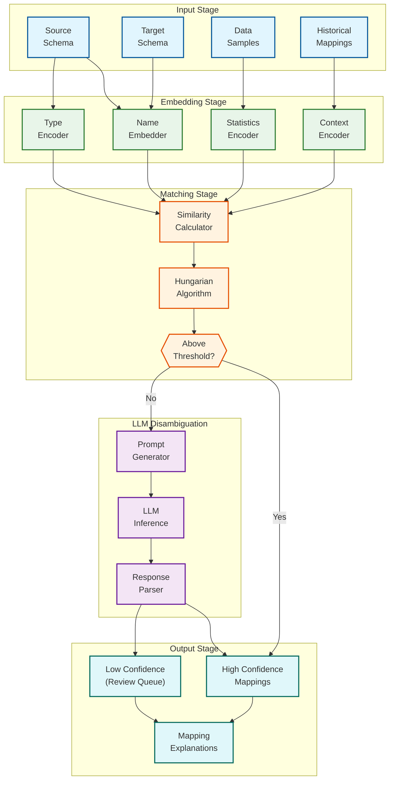
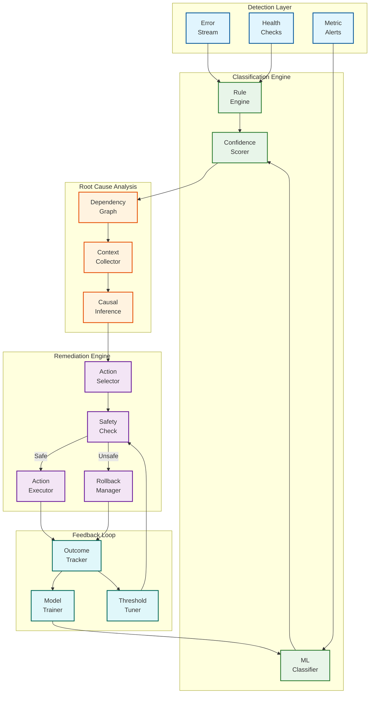
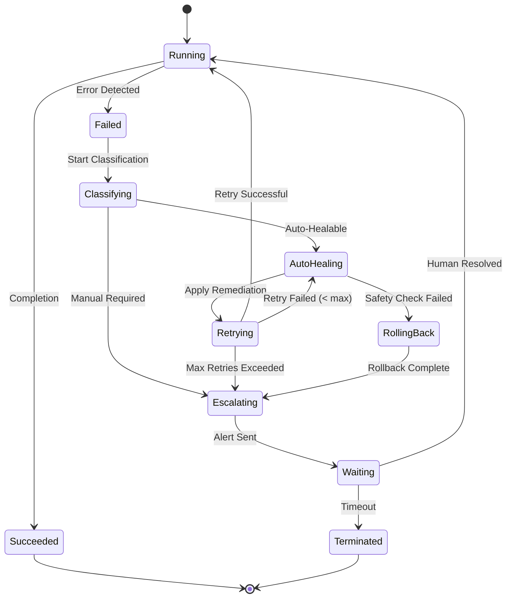
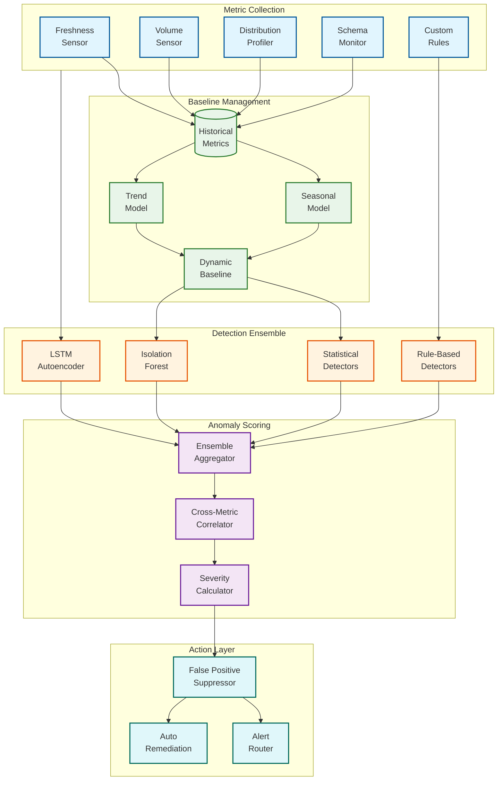
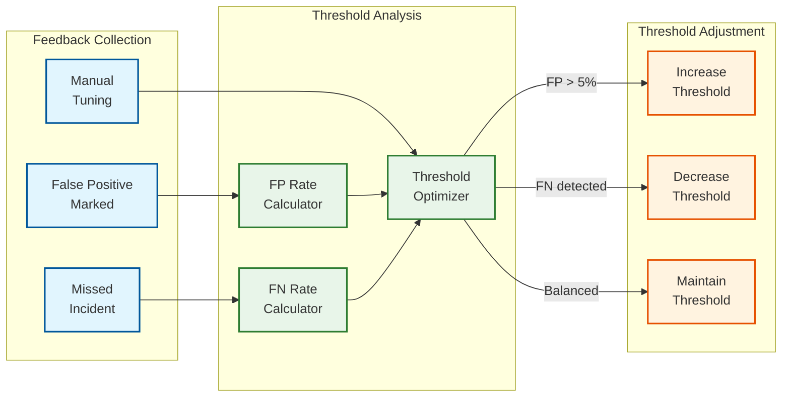

# Deep Dive & Bottlenecks

## Critical Component 1: AI Schema Mapping Service

### Why This is Critical

Schema mapping is the foundation of autonomous data integration. Poor mappings lead to:
- Data quality issues propagating to downstream systems
- Incorrect analytics and ML model training
- Compliance violations (mishandling PII)
- Increased human intervention, defeating the purpose of AI-native pipelines

### Architecture Deep Dive



### How It Works Internally

**Step 1: Multi-Signal Embedding Generation**

```
For each source field, generate embeddings from:

1. Name Signal:
   - Tokenize field name (snake_case, camelCase handling)
   - Generate embedding using sentence transformer
   - Include table name context

2. Type Signal:
   - Encode data type as categorical feature
   - Include nullable, precision, scale

3. Statistics Signal:
   - Null rate, distinct count, min/max
   - Value distribution histogram
   - Top frequent values

4. Context Signal:
   - Table relationships (foreign keys)
   - Neighboring column names
   - Historical mapping decisions
```

**Step 2: Similarity Calculation**

```
Similarity = w1 × CosineSim(name_embeddings)
           + w2 × TypeCompatibility(type1, type2)
           + w3 × StatisticalSimilarity(stats1, stats2)
           + w4 × ContextualSimilarity(context1, context2)

Weights (default):
  w1 = 0.4 (name importance)
  w2 = 0.2 (type compatibility)
  w3 = 0.25 (statistics match)
  w4 = 0.15 (context)
```

**Step 3: LLM Disambiguation**

For fields below confidence threshold, construct prompt:

```
You are a data engineer mapping source fields to target schema.

Source field: "cust_email" (VARCHAR, 15% null, samples: ["john@ex.com", "jane@ex.com"])
Target candidates:
  1. "email_address" (STRING, email format)
  2. "contact_email" (STRING, email format)
  3. "customer_id" (STRING, identifier)

Similarity scores: [0.65, 0.62, 0.31]

Context: Source table is "customer_transactions", target is "dim_customer"

Which target field best matches? Explain your reasoning.
```

### Failure Modes and Mitigations

| Failure Mode | Impact | Detection | Mitigation |
|--------------|--------|-----------|------------|
| **Semantic Ambiguity** | Wrong mapping (e.g., "date" → "birth_date" vs "order_date") | Low confidence score | LLM disambiguation with context |
| **Name Collision** | Multiple valid targets | Multiple high scores | Present alternatives, human review |
| **Type Mismatch** | Runtime errors | Type compatibility check | Block incompatible types |
| **Missing Context** | Random mappings | Low overall confidence | Require human review |
| **LLM Hallucination** | Invalid mapping | Validation against schema | Strict response parsing, validation |
| **Embedding Drift** | Degraded accuracy over time | A/B testing new models | Periodic model refresh, monitoring |

### Performance Characteristics

| Operation | Latency | Throughput | Bottleneck |
|-----------|---------|------------|------------|
| Embedding generation | 10-50ms per field | 1000 fields/sec | GPU availability |
| Similarity calculation | <1ms per pair | 10K pairs/sec | CPU-bound |
| Hungarian algorithm | O(n³) | N/A | Large schemas (>500 cols) |
| LLM inference | 500ms-3s | 10 req/sec | API rate limits, cost |

---

## Critical Component 2: Self-Healing Controller

### Why This is Critical

Self-healing is the differentiator between traditional pipelines (60%+ time on maintenance) and AI-native pipelines. The controller must:
- Correctly classify errors to avoid wrong remediation
- Apply fixes without causing cascading failures
- Know when to escalate vs auto-heal
- Learn from outcomes to improve over time

### Architecture Deep Dive



### Error Classification Taxonomy

```
ErrorClass:
├── TRANSIENT (Auto-healable: 95% success)
│   ├── NETWORK_TIMEOUT
│   ├── CONNECTION_RESET
│   ├── RATE_LIMIT_EXCEEDED
│   ├── TEMPORARY_UNAVAILABLE
│   └── RESOURCE_EXHAUSTION
│
├── SCHEMA_DRIFT (Conditional auto-heal: 60% success)
│   ├── COLUMN_ADDED
│   ├── COLUMN_REMOVED
│   ├── COLUMN_RENAMED
│   ├── TYPE_CHANGED
│   └── TABLE_RENAMED
│
├── DATA_QUALITY (Partial auto-heal: 40% success)
│   ├── NULL_VIOLATION
│   ├── TYPE_COERCION_FAILURE
│   ├── CONSTRAINT_VIOLATION
│   ├── DUPLICATE_KEY
│   └── REFERENTIAL_INTEGRITY
│
├── CONFIGURATION (Manual resolution required)
│   ├── CREDENTIAL_EXPIRED
│   ├── PERMISSION_DENIED
│   ├── ENDPOINT_CHANGED
│   └── QUOTA_EXCEEDED
│
└── UNKNOWN (ML classification + escalation)
    └── UNCLASSIFIED_ERROR
```

### Remediation Action Matrix

| Error Class | Auto Action | Conditions | Escalation Trigger |
|-------------|-------------|------------|-------------------|
| NETWORK_TIMEOUT | Retry with backoff | retry_count < 5 | 5 consecutive failures |
| RATE_LIMIT | Adaptive throttling | Always | >1 hour throttled |
| COLUMN_ADDED | Add mapping, continue | confidence > 0.8 | confidence < 0.8 |
| COLUMN_REMOVED | Use default, warn | has_default | critical column |
| TYPE_CHANGED | Attempt coercion | compatible_types | incompatible types |
| NULL_VIOLATION | Quarantine record | quarantine_enabled | >10% records affected |
| DUPLICATE_KEY | Dedup, use latest | dedup_enabled | >5% duplicates |
| CREDENTIAL_EXPIRED | Alert | Always | Always (can't auto-fix) |

### Failure Modes and Mitigations

| Failure Mode | Impact | Detection | Mitigation |
|--------------|--------|-----------|------------|
| **Misclassification** | Wrong remediation applied | Outcome tracking | ML model feedback, confidence thresholds |
| **Cascading Failure** | Fix causes more failures | Dependency analysis | Safety checks, rollback capability |
| **Incorrect Schema Auto-Map** | Data corruption | Post-remediation validation | Human review for schema changes |
| **Infinite Retry Loop** | Resource waste | Retry counter, circuit breaker | Max retries, exponential backoff |
| **Alert Fatigue** | Real issues ignored | Alert deduplication | Severity-based routing, auto-acknowledge |
| **Stale Model** | Degraded classification | Accuracy drift monitoring | Periodic retraining |

### State Machine for Pipeline Healing



---

## Critical Component 3: Anomaly Detection Engine

### Why This is Critical

Data quality issues caught late cause:
- Incorrect business decisions based on bad data
- ML model drift and degraded predictions
- Compliance violations (reporting errors)
- Loss of trust in data platform

Early, accurate anomaly detection is the "immune system" of the data pipeline.

### Architecture Deep Dive



### Detection Methods by Metric Type

| Metric Type | Primary Method | Secondary Method | Baseline Period |
|-------------|---------------|------------------|-----------------|
| **Freshness** | Threshold (expected vs actual) | Z-score on delay | 7 days |
| **Volume** | Seasonal decomposition | Isolation Forest | 28 days (weekly pattern) |
| **Distribution** | KL Divergence | Population Stability Index | 90 days |
| **Schema** | Exact diff | N/A | Previous schema |
| **Null Rate** | Z-score | Moving average deviation | 14 days |
| **Cardinality** | Percentage change | Historical range | 30 days |

### Ensemble Scoring Logic

```
Final_Score = 0.35 × Statistical_Score
            + 0.30 × IsolationForest_Score
            + 0.25 × Autoencoder_Score
            + 0.10 × Rule_Score

With adjustments:
- If multiple metrics anomalous: Score × 1.2 (correlated)
- If known noisy source: Score × 0.8 (suppression)
- If critical pipeline: Score × 1.3 (amplification)
```

### Failure Modes and Mitigations

| Failure Mode | Impact | Detection | Mitigation |
|--------------|--------|-----------|------------|
| **False Positives (High)** | Alert fatigue | User feedback (FP marks) | Adaptive thresholds, suppression |
| **False Negatives** | Missed issues | Incident post-mortems | Lower thresholds, add rules |
| **Concept Drift** | Model degraded | Accuracy monitoring | Periodic retraining |
| **Seasonality Mismatch** | Weekend/holiday FPs | Pattern analysis | Calendar-aware baselines |
| **New Metric Cold Start** | No baseline | Short history | Rule-based until data accumulates |
| **Correlated Alerts Storm** | Overwhelming alerts | Correlation detection | Aggregate into single incident |

### Adaptive Threshold Adjustment



---

## Bottleneck Analysis

### Top 3 Bottlenecks

#### Bottleneck 1: Schema Inference at Scale

**Problem:** Inferring schemas for 1000+ sources with millions of columns

**Symptoms:**
- Schema discovery taking >30 minutes per source
- Memory exhaustion during type inference
- Embedding generation timeout

**Root Causes:**
- Scanning full tables for type inference
- Computing embeddings for all fields synchronously
- No caching of stable schemas

**Mitigations:**

| Mitigation | Complexity | Impact |
|------------|------------|--------|
| **Sample-based inference** | Low | 80% latency reduction |
| **Incremental discovery** | Medium | Only scan changed tables |
| **Embedding caching** | Low | Skip stable fields |
| **Parallel processing** | Medium | Distribute across workers |
| **Schema cache with TTL** | Low | Avoid re-discovery |

#### Bottleneck 2: LLM Transformation Latency

**Problem:** NL-to-SQL generation takes 1-5 seconds per transformation

**Symptoms:**
- Pipeline build time increases linearly with transforms
- Interactive UX feels slow
- LLM API costs escalating

**Root Causes:**
- Cold start for each transformation
- No caching of similar transformations
- Full context sent for each request

**Mitigations:**

| Mitigation | Complexity | Impact |
|------------|------------|--------|
| **Transformation caching** | Low | 50%+ cache hit rate |
| **Batch prompt batching** | Medium | Amortize latency |
| **Smaller model for simple transforms** | Low | 10x faster for easy cases |
| **Pre-generated templates** | Medium | Skip LLM for common patterns |
| **Fine-tuned smaller model** | High | Local inference, lower cost |

#### Bottleneck 3: Real-Time CDC Processing

**Problem:** 500K events/sec peak throughput requirement

**Symptoms:**
- Consumer lag growing during peak hours
- Quality checks becoming bottleneck
- Schema mapping per-event overhead

**Root Causes:**
- Per-event schema validation
- Synchronous quality checks
- Single-threaded processing per partition

**Mitigations:**

| Mitigation | Complexity | Impact |
|------------|------------|--------|
| **Micro-batch processing** | Low | Amortize overhead |
| **Schema caching per partition** | Low | Skip repeated validation |
| **Async quality sampling** | Medium | Check 1% of events |
| **Horizontal scaling** | Medium | Add more partitions/workers |
| **Tiered processing** | Medium | Fast path for validated schemas |

---

## Race Conditions

### Race Condition 1: Concurrent Schema Updates

**Scenario:** Two pipelines discover schema changes simultaneously

**Problem:** Both try to update the schema mapping, causing conflicts

**Solution:**
```pseudocode
FUNCTION update_schema_mapping(source_id, new_mapping):
    // Optimistic locking with version check
    current = get_current_mapping(source_id)

    IF new_mapping.base_version != current.version:
        // Conflict detected
        merged = merge_mappings(current, new_mapping)
        IF merge_successful(merged):
            save_mapping(merged, version = current.version + 1)
        ELSE:
            raise ConflictError("Manual resolution required")
    ELSE:
        save_mapping(new_mapping, version = current.version + 1)
```

### Race Condition 2: Parallel Pipeline Runs with Shared State

**Scenario:** Backfill and incremental runs overlap on same table

**Problem:** Inconsistent state, duplicate/missing records

**Solution:**
```pseudocode
FUNCTION acquire_table_lock(table_name, run_type):
    lock = distributed_lock.acquire(
        key = f"table:{table_name}",
        mode = EXCLUSIVE if run_type == BACKFILL else SHARED,
        timeout = 300 seconds
    )

    IF not lock.acquired:
        IF lock.holder.run_type == BACKFILL:
            wait_for_backfill_completion(lock.holder)
        ELSE:
            raise ConcurrentRunError("Another run in progress")

    RETURN lock
```

### Race Condition 3: Remediation Conflicts

**Scenario:** Multiple self-healing actions triggered for same failure

**Problem:** Contradictory remediations applied

**Solution:**
```pseudocode
FUNCTION apply_remediation(failure_id, action):
    // Single-writer pattern
    result = compare_and_swap(
        key = f"remediation:{failure_id}",
        expected = PENDING,
        new_value = IN_PROGRESS,
        action_id = action.id
    )

    IF result.success:
        execute_remediation(action)
        mark_complete(failure_id, action.id)
    ELSE:
        // Another remediation already in progress
        log_skipped(failure_id, action, result.current_action)
```

---

## Performance Optimization Summary

| Component | Bottleneck | Optimization | Expected Improvement |
|-----------|------------|--------------|---------------------|
| Schema Mapping | Embedding generation | GPU batching + caching | 5x faster |
| Schema Mapping | LLM disambiguation | Caching + smaller model | 3x faster, 80% cost reduction |
| Self-Healing | Classification latency | Rule-based fast path | 10x faster for known errors |
| Anomaly Detection | Baseline computation | Incremental updates | 50% CPU reduction |
| CDC Processing | Per-event overhead | Micro-batching | 3x throughput |
| Lineage Tracking | Graph computation | Incremental updates | 10x faster |
| Quality Scoring | Full scan | Sampling | 20x faster |
