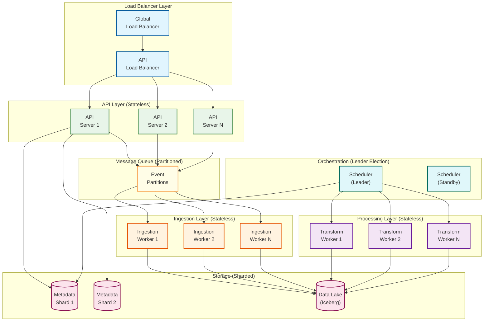
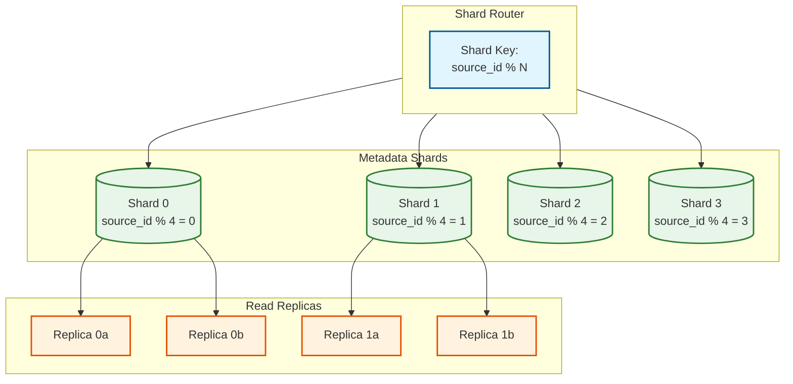
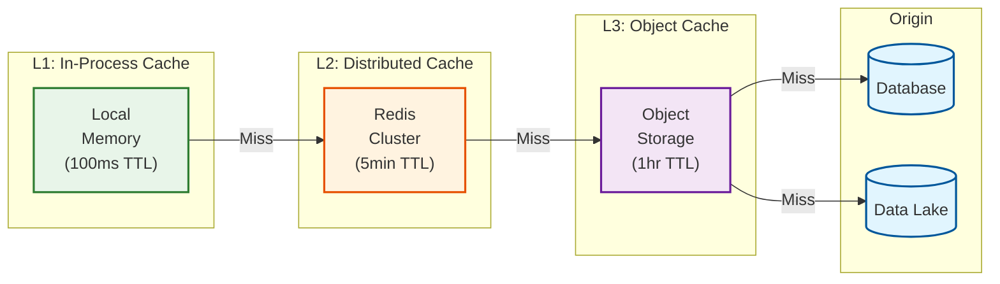
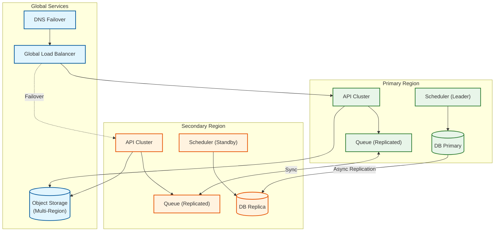
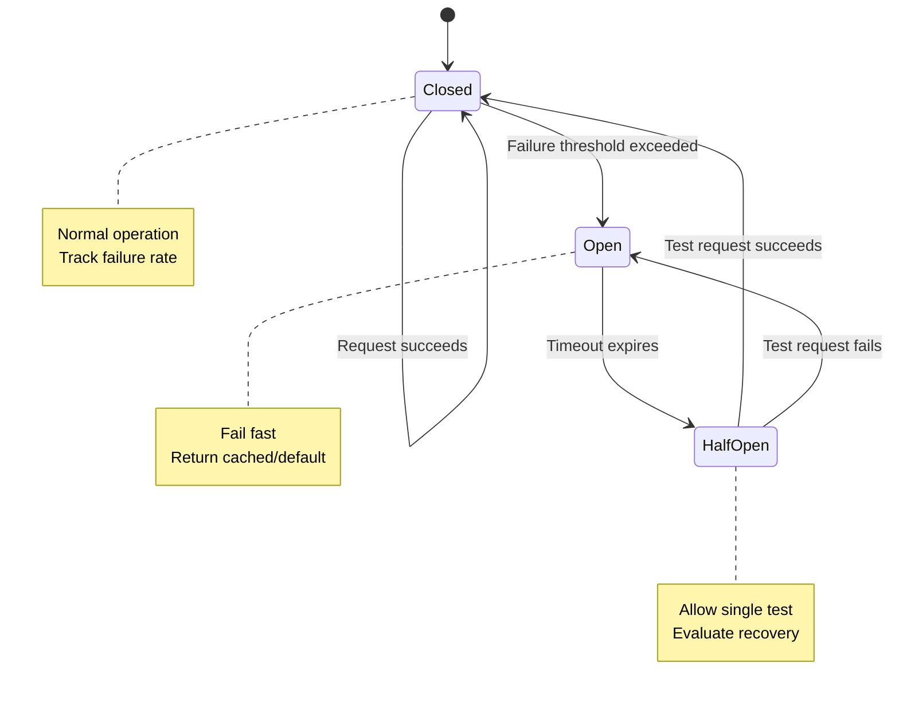
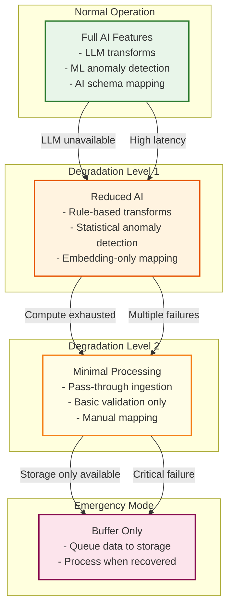
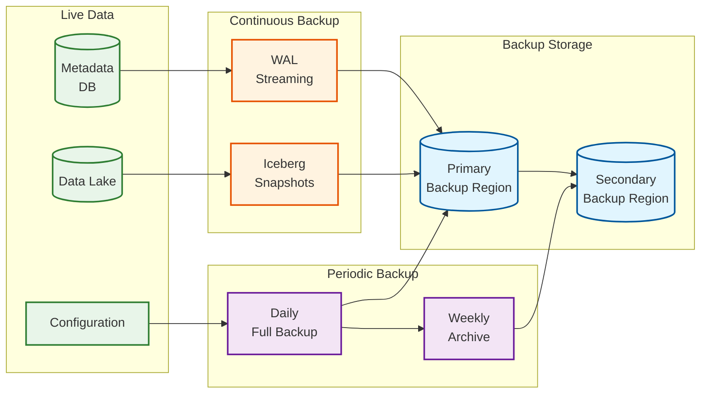

# Scalability & Reliability

## Scalability Architecture

### Horizontal Scaling Strategy



### Scaling Dimensions

| Component | Scaling Trigger | Scale Factor | Max Scale |
|-----------|-----------------|--------------|-----------|
| **API Servers** | CPU > 70%, Latency > 200ms | +2 instances | 50 instances |
| **Ingestion Workers** | Queue depth > 1000 | +5 workers | 200 workers |
| **Transform Workers** | Job queue > 50 | +3 workers | 100 workers |
| **CDC Processors** | Consumer lag > 10s | +1 per partition | 500 processors |
| **Anomaly Detectors** | Check latency > 5s | +2 instances | 20 instances |
| **Schema Mappers** | Request queue > 20 | +1 instance | 10 instances |

### Auto-Scaling Configuration

```pseudocode
AutoScalingPolicy {
    component: "ingestion_workers"

    // Metrics-based scaling
    scale_up_rules: [
        {
            metric: "queue_depth",
            threshold: 1000,
            duration: "2 minutes",
            action: "add 5 instances"
        },
        {
            metric: "cpu_utilization",
            threshold: 80%,
            duration: "5 minutes",
            action: "add 2 instances"
        }
    ]

    scale_down_rules: [
        {
            metric: "queue_depth",
            threshold: 100,
            duration: "10 minutes",
            action: "remove 2 instances"
        }
    ]

    // Predictive scaling
    predictive_scaling: {
        enabled: true,
        lookback_period: "7 days",
        forecast_period: "30 minutes",
        scale_buffer: 20%  // Extra capacity buffer
    }

    // Constraints
    min_instances: 3
    max_instances: 200
    cooldown_period: "5 minutes"
}
```

---

## Database Scaling Strategy

### Metadata Store Sharding



### Sharding Strategy by Data Type

| Data Type | Shard Key | Strategy | Rationale |
|-----------|-----------|----------|-----------|
| **Source Config** | source_id | Hash | Even distribution |
| **Pipeline** | pipeline_id | Hash | Even distribution |
| **Quality Events** | pipeline_id + timestamp | Range | Time-series queries |
| **Lineage** | source_id | Hash | Locality with source |
| **Audit Logs** | timestamp | Range | Time-based retention |

### Data Lake Partitioning (Iceberg)

```
Table: bronze_events
├── Partition: year=2025/month=01/day=15/hour=10
├── Partition: year=2025/month=01/day=15/hour=11
└── ...

Partition Evolution Strategy:
- Start: daily partitions
- At 1TB/day: hourly partitions
- At 10TB/day: hourly + source_id bucketing

Hidden Partitioning:
- Users query by timestamp
- Iceberg automatically prunes partitions
```

---

## Caching Strategy

### Multi-Layer Cache Architecture



### Cache Configuration by Data Type

| Data Type | L1 (Local) | L2 (Redis) | L3 (Object) | Invalidation |
|-----------|------------|------------|-------------|--------------|
| **Schema Mappings** | 1 min | 30 min | 24 hr | On update event |
| **Embeddings** | - | 24 hr | 7 days | On model update |
| **Quality Baselines** | 5 min | 1 hr | - | Hourly refresh |
| **Transformation SQL** | 10 min | 1 hr | 24 hr | On regeneration |
| **Lineage Graph** | - | 5 min | 1 hr | On pipeline run |
| **API Responses** | 30 sec | 5 min | - | On data change |

### Cache Invalidation Strategy

```pseudocode
FUNCTION invalidate_cache(entity_type, entity_id, change_type):
    // Determine invalidation scope
    IF change_type == SCHEMA_UPDATE:
        invalidation_keys = [
            f"schema:{entity_id}",
            f"mapping:{entity_id}",
            f"embedding:{entity_id}:*"
        ]
    ELSE IF change_type == PIPELINE_RUN:
        invalidation_keys = [
            f"lineage:{entity_id}",
            f"quality:{entity_id}:*"
        ]

    // Cascade invalidation through cache layers
    FOR each key IN invalidation_keys:
        redis.delete(key)
        broadcast_invalidation(key)  // Notify L1 caches

    // Log invalidation for debugging
    log_invalidation(entity_type, entity_id, invalidation_keys)
```

---

## Reliability & Fault Tolerance

### Single Points of Failure (SPOF) Analysis

| Component | SPOF Risk | Mitigation | RTO |
|-----------|-----------|------------|-----|
| **Scheduler** | High | Leader election, standby | <1 min |
| **Metadata DB** | High | Multi-AZ, read replicas | <5 min |
| **Message Queue** | High | Replicated partitions | <1 min |
| **Object Storage** | Low | Provider-managed redundancy | <1 min |
| **LLM Provider** | Medium | Multi-provider fallback | <30 sec |
| **Schema Mapper** | Medium | Stateless, auto-scale | <1 min |

### Redundancy Architecture



### Failover Mechanisms

| Component | Failover Type | Detection | Switchover Time |
|-----------|---------------|-----------|-----------------|
| **API** | Active-Active | Health check failure | Immediate |
| **Scheduler** | Active-Passive | Heartbeat timeout | <30 sec |
| **Database** | Primary-Replica | Connection failure | <5 min |
| **Queue** | Partition Leader | ISR health | <10 sec |
| **LLM Provider** | Provider Fallback | 5xx errors, timeout | <5 sec |

### Circuit Breaker Pattern



### Circuit Breaker Configuration

```pseudocode
CircuitBreaker {
    name: "llm_provider"

    // Thresholds
    failure_threshold: 5           // Failures to trip
    success_threshold: 3           // Successes to close
    timeout: 30 seconds            // Open state duration

    // Failure counting
    failure_window: 60 seconds     // Rolling window
    failure_rate_threshold: 50%    // Alternative trigger

    // Fallback behavior
    fallback: {
        type: "provider_switch",
        primary: "provider_a",
        secondary: "provider_b",
        tertiary: "cached_response"
    }

    // Monitoring
    on_state_change: notify_ops
    metrics: ["state", "failure_rate", "latency"]
}
```

---

## Retry Strategies

### Exponential Backoff with Jitter

```pseudocode
FUNCTION retry_with_backoff(operation, config):
    attempt = 0

    WHILE attempt < config.max_retries:
        TRY:
            result = operation()
            RETURN result
        CATCH error:
            IF not is_retryable(error):
                RAISE error

            attempt += 1

            IF attempt >= config.max_retries:
                RAISE MaxRetriesExceeded(error)

            // Calculate backoff with jitter
            base_delay = config.base_delay * (2 ^ attempt)
            jitter = random(0, base_delay * 0.1)
            delay = min(base_delay + jitter, config.max_delay)

            log_retry(operation, attempt, delay, error)
            sleep(delay)

FUNCTION is_retryable(error):
    retryable_codes = [408, 429, 500, 502, 503, 504]
    retryable_exceptions = [NetworkTimeout, ConnectionReset, TemporaryUnavailable]

    RETURN error.code IN retryable_codes OR
           error.type IN retryable_exceptions
```

### Retry Configuration by Operation

| Operation | Max Retries | Base Delay | Max Delay | Backoff |
|-----------|-------------|------------|-----------|---------|
| API Calls | 3 | 100ms | 5s | Exponential |
| DB Queries | 5 | 50ms | 10s | Exponential |
| LLM Inference | 3 | 1s | 30s | Exponential |
| CDC Events | 10 | 100ms | 60s | Exponential |
| File Uploads | 5 | 500ms | 30s | Exponential |

---

## Graceful Degradation

### Degradation Hierarchy



### Feature Degradation Matrix

| Feature | Normal | Level 1 | Level 2 | Emergency |
|---------|--------|---------|---------|-----------|
| **Data Ingestion** | Full | Full | Pass-through | Buffer |
| **Schema Mapping** | LLM + Embedding | Embedding only | Manual | Skip |
| **Transformations** | NL-to-SQL | Pre-defined SQL | Pass-through | Skip |
| **Anomaly Detection** | ML ensemble | Statistical only | Threshold only | Skip |
| **Quality Scoring** | Full dimensions | Core dimensions | Basic checks | Skip |
| **Self-Healing** | Full auto-heal | Transient only | Manual | Disable |

---

## Disaster Recovery

### Recovery Objectives

| Scenario | RTO | RPO | Strategy |
|----------|-----|-----|----------|
| **Single Component Failure** | <5 min | 0 | Auto-failover |
| **Availability Zone Failure** | <15 min | <1 min | Multi-AZ deployment |
| **Region Failure** | <1 hour | <5 min | Cross-region replication |
| **Data Corruption** | <4 hours | Point-in-time | Iceberg time travel, backups |
| **Complete Platform Loss** | <24 hours | <1 hour | Cold standby, backups |

### Backup Strategy



### Recovery Procedures

**Procedure 1: Point-in-Time Recovery (Data Corruption)**

```pseudocode
PROCEDURE recover_to_point_in_time(target_time):
    // Step 1: Identify affected tables
    affected = identify_corrupted_tables()

    // Step 2: Stop writes to affected tables
    FOR each table IN affected:
        pause_ingestion(table)

    // Step 3: Restore from Iceberg snapshot
    FOR each table IN affected:
        snapshot = find_snapshot_before(table, target_time)
        rollback_to_snapshot(table, snapshot)

    // Step 4: Replay events from checkpoint
    checkpoint = get_checkpoint(target_time)
    replay_events_from(checkpoint)

    // Step 5: Resume operations
    FOR each table IN affected:
        resume_ingestion(table)

    // Step 6: Verify data integrity
    run_integrity_checks(affected)
```

**Procedure 2: Region Failover**

```pseudocode
PROCEDURE failover_to_secondary_region():
    // Step 1: Confirm primary region failure
    IF NOT confirm_region_failure(primary):
        ABORT "Primary region appears healthy"

    // Step 2: Promote secondary database
    promote_replica_to_primary(secondary_db)

    // Step 3: Update DNS
    update_dns_record(service_endpoint, secondary_region)

    // Step 4: Activate secondary schedulers
    FOR each scheduler IN secondary_schedulers:
        activate_scheduler(scheduler)

    // Step 5: Redirect traffic
    update_load_balancer(secondary_region)

    // Step 6: Verify operations
    run_health_checks(secondary_region)

    // Step 7: Notify stakeholders
    notify_incident(
        type = "REGION_FAILOVER",
        from = primary_region,
        to = secondary_region
    )
```

---

## Capacity Planning Summary

```
+------------------------------------------------------------------------+
|                    CAPACITY PLANNING SUMMARY                            |
+------------------------------------------------------------------------+
|                                                                         |
|  COMPUTE SCALING                                                        |
|  ---------------                                                        |
|  API Servers:        3 → 50 instances      (CPU > 70%)                 |
|  Ingestion Workers:  10 → 200 workers      (Queue depth > 1000)        |
|  Transform Workers:  5 → 100 workers       (Job queue > 50)            |
|  CDC Processors:     10 → 500 processors   (Lag > 10s)                 |
|                                                                         |
+------------------------------------------------------------------------+
|                                                                         |
|  STORAGE SCALING                                                        |
|  ---------------                                                        |
|  Metadata: 4 shards × 3 replicas = 12 nodes                            |
|  Data Lake: Iceberg on object storage (auto-scales)                    |
|  Cache: Redis cluster, 3 masters + 3 replicas                          |
|                                                                         |
+------------------------------------------------------------------------+
|                                                                         |
|  RELIABILITY TARGETS                                                    |
|  -------------------                                                    |
|  Availability:       99.9% (43 min/month downtime)                     |
|  RTO (component):    <5 min                                            |
|  RTO (region):       <1 hour                                           |
|  RPO (critical):     <5 min                                            |
|                                                                         |
+------------------------------------------------------------------------+
|                                                                         |
|  DISASTER RECOVERY                                                      |
|  -----------------                                                      |
|  Backup: Continuous WAL + daily full + weekly archive                  |
|  Retention: 7 days hot, 90 days warm, 7 years cold                     |
|  Regions: Primary + Secondary + Backup storage                         |
|                                                                         |
+------------------------------------------------------------------------+
```
