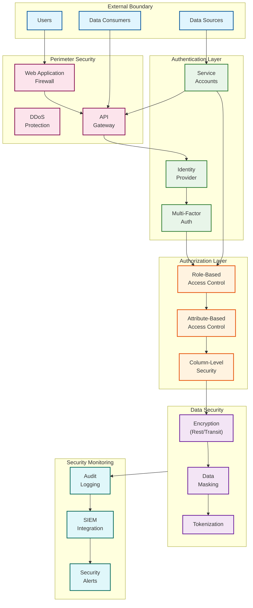
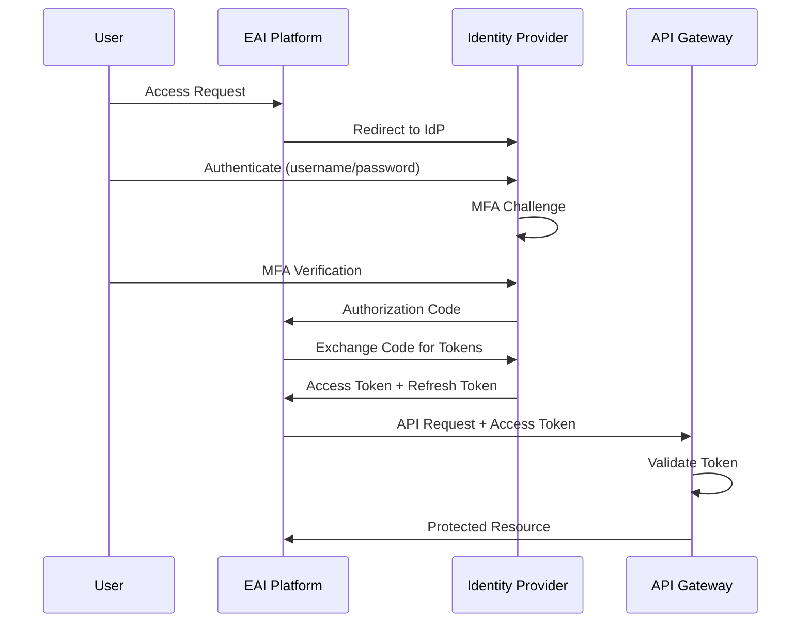
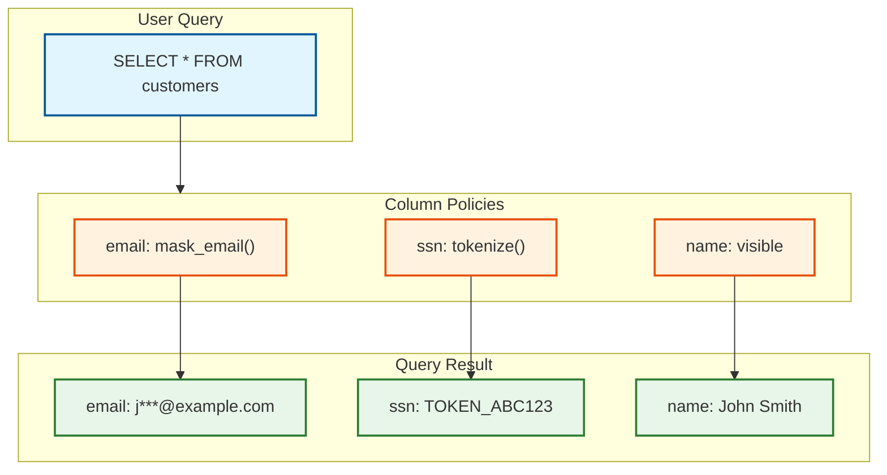
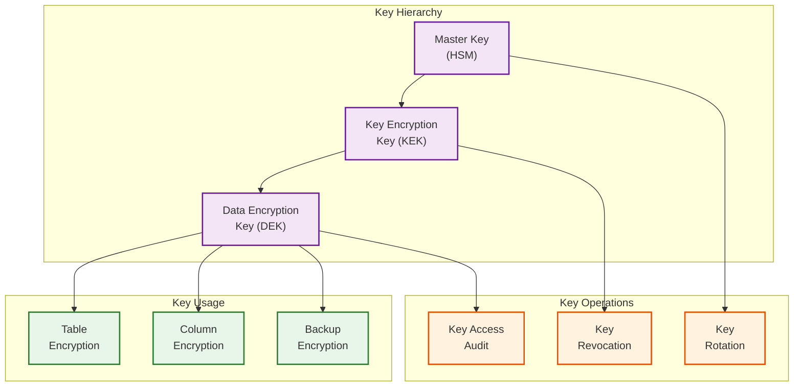
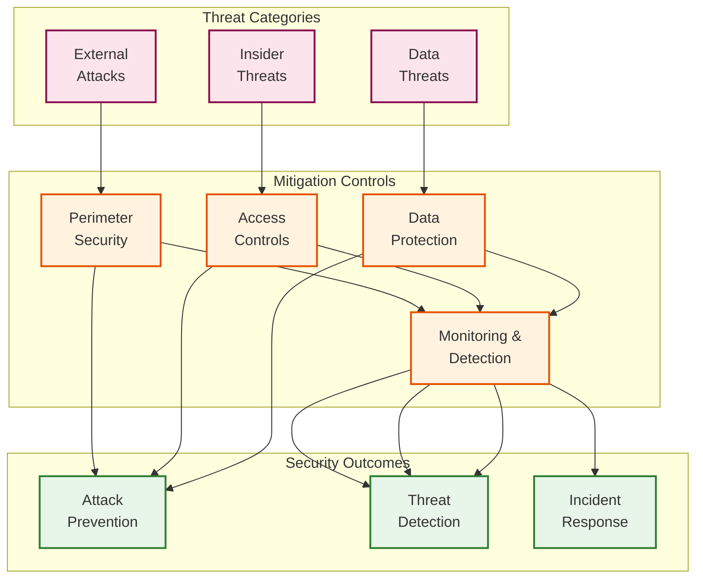
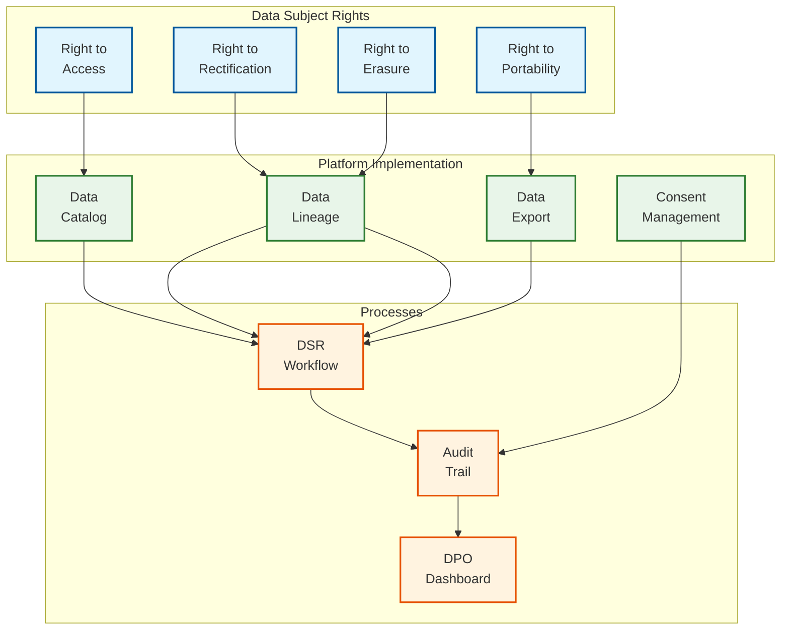
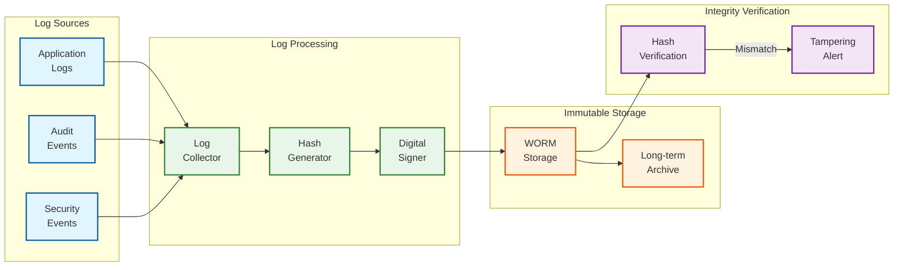

# Security & Compliance

## Security Architecture Overview



---

## Authentication & Authorization

### Authentication Mechanisms

| User Type | AuthN Method | Token Type | Session Duration |
|-----------|--------------|------------|------------------|
| **Human Users** | OAuth2/OIDC + MFA | JWT | 8 hours |
| **Service Accounts** | API Keys + mTLS | JWT | 24 hours |
| **Pipelines** | Service Identity | Short-lived JWT | 1 hour |
| **External APIs** | API Keys | N/A | Per request |
| **Admin Access** | SSO + MFA + Approval | JWT | 4 hours |

### OAuth2/OIDC Flow



### Role-Based Access Control (RBAC)

| Role | Permissions | Scope |
|------|-------------|-------|
| **Admin** | Full access, user management | Platform-wide |
| **Data Engineer** | Create/modify pipelines, view all data | Assigned projects |
| **Data Analyst** | Read data, view lineage, run queries | Assigned datasets |
| **Operator** | Monitor, troubleshoot, restart pipelines | All pipelines |
| **Auditor** | Read-only access to all audit logs | Platform-wide |
| **Service Account** | Pipeline execution, API access | Assigned pipelines |

### Attribute-Based Access Control (ABAC)

```pseudocode
AccessPolicy {
    name: "PII Data Access"

    // Subject attributes
    subject: {
        roles: ["Data Engineer", "Data Analyst"],
        department: ["Analytics", "Security"],
        training_completed: "PII_HANDLING"
    }

    // Resource attributes
    resource: {
        classification: ["PII", "SENSITIVE"],
        data_type: ["email", "phone", "ssn"]
    }

    // Environment attributes
    environment: {
        time: "business_hours",
        location: ["office_network", "vpn"],
        device_compliance: true
    }

    // Action
    action: ["read", "query"]  // No write/export

    // Conditions
    conditions: [
        "subject.training_completed == 'PII_HANDLING'",
        "environment.device_compliance == true"
    ]
}
```

### Column-Level Security



---

## Data Security

### Encryption Strategy

| Data State | Encryption | Key Management |
|------------|------------|----------------|
| **At Rest** | AES-256-GCM | Customer-managed keys (CMK) |
| **In Transit** | TLS 1.3 | Automatic certificate rotation |
| **In Processing** | Memory encryption | Secure enclaves (optional) |
| **In Backup** | AES-256-GCM | Separate backup keys |
| **In LLM Prompts** | Redacted/masked | N/A (PII removed) |

### Key Management Architecture



### PII Detection and Handling

```pseudocode
FUNCTION process_data_with_pii_detection(record):
    pii_fields = []

    FOR each field IN record:
        // ML-based PII detection
        pii_probability = pii_classifier.predict(field.value)

        IF pii_probability > 0.8:
            pii_type = classify_pii_type(field.value)
            pii_fields.append({
                field: field.name,
                type: pii_type,
                confidence: pii_probability
            })

    // Apply protection based on policy
    FOR each pii IN pii_fields:
        policy = get_pii_policy(pii.type)

        SWITCH policy.action:
            CASE MASK:
                record[pii.field] = mask_value(record[pii.field], pii.type)
            CASE TOKENIZE:
                record[pii.field] = tokenize_value(record[pii.field])
            CASE ENCRYPT:
                record[pii.field] = encrypt_column(record[pii.field])
            CASE REDACT:
                record[pii.field] = "[REDACTED]"

    // Log PII detection for audit
    log_pii_detection(record.id, pii_fields)

    RETURN record
```

### Data Masking Rules

| PII Type | Masking Function | Example Input | Example Output |
|----------|------------------|---------------|----------------|
| **Email** | Partial mask | john.doe@example.com | j***.d**@example.com |
| **Phone** | Last 4 digits | +1-555-123-4567 | ***-***-**-4567 |
| **SSN** | Tokenize | 123-45-6789 | TOK_A1B2C3D4 |
| **Credit Card** | First 4, last 4 | 4111-1111-1111-1111 | 4111-****-****-1111 |
| **Name** | Pseudonymize | John Smith | Person_ABC123 |
| **Address** | Generalize | 123 Main St, NYC | [City: New York] |
| **DOB** | Age range | 1985-03-15 | Age: 35-40 |

---

## Threat Model

### Top Attack Vectors

| Attack Vector | Threat | Likelihood | Impact | Mitigation |
|---------------|--------|------------|--------|------------|
| **SQL Injection** | Data exfiltration | Medium | Critical | Parameterized queries, WAF |
| **Credential Theft** | Unauthorized access | High | Critical | MFA, short-lived tokens, rotation |
| **Insider Threat** | Data leak | Medium | High | RBAC, audit logging, DLP |
| **API Abuse** | Service disruption | High | High | Rate limiting, anomaly detection |
| **Supply Chain** | Malicious code | Low | Critical | Dependency scanning, SBOMs |
| **Prompt Injection** | LLM manipulation | Medium | Medium | Input sanitization, output validation |
| **Data Poisoning** | ML model compromise | Low | High | Data validation, lineage tracking |

### Threat Mitigation Matrix



### LLM-Specific Security

| Risk | Description | Mitigation |
|------|-------------|------------|
| **Prompt Injection** | Malicious input to LLM | Input sanitization, prompt templates |
| **Data Leakage** | PII in prompts | PII detection and redaction before LLM |
| **Output Manipulation** | Malicious generated code | SQL validation, sandboxed execution |
| **Model Extraction** | Stealing model behavior | Rate limiting, output monitoring |
| **Hallucination** | False but convincing output | Validation against schema, human review |

---

## Compliance Framework

### Regulatory Requirements

| Regulation | Scope | Key Requirements | Implementation |
|------------|-------|------------------|----------------|
| **GDPR** | EU personal data | Consent, data portability, right to erasure | Consent management, data catalog |
| **HIPAA** | US health data | PHI protection, access controls, audit | Encryption, BAAs, audit logging |
| **SOC 2** | Service organizations | Security, availability, confidentiality | Controls framework, annual audit |
| **PCI DSS** | Payment card data | Cardholder data protection | Tokenization, network segmentation |
| **CCPA** | California consumers | Consumer rights, data sale opt-out | Privacy controls, data inventory |

### GDPR Compliance



### Data Subject Request (DSR) Handling

```pseudocode
FUNCTION handle_data_subject_request(request):
    // Step 1: Verify identity
    IF NOT verify_identity(request.subject):
        RETURN RequestDenied("Identity verification failed")

    // Step 2: Find all data for subject
    data_locations = lineage_service.find_data_for_subject(request.subject_id)

    // Step 3: Process based on request type
    SWITCH request.type:
        CASE ACCESS:
            data = collect_all_data(data_locations)
            RETURN generate_access_report(data)

        CASE ERASURE:
            // Check if erasure is allowed
            retention_holds = check_retention_requirements(data_locations)
            IF retention_holds:
                RETURN RequestDenied("Data under legal hold")

            FOR each location IN data_locations:
                delete_data(location, request.subject_id)
                log_deletion(location, request)

            RETURN ErasureComplete()

        CASE PORTABILITY:
            data = collect_all_data(data_locations)
            export = generate_portable_format(data)
            RETURN export

        CASE RECTIFICATION:
            FOR each correction IN request.corrections:
                update_data(correction.location, correction.field, correction.new_value)
                log_rectification(correction, request)

            RETURN RectificationComplete()

    // Step 4: Log request for audit
    audit_log.record(request, result)
```

### Data Residency

| Region | Data Types Allowed | Storage Location | Compute Location |
|--------|-------------------|------------------|------------------|
| **EU** | EU personal data | EU data centers | EU region |
| **US** | US data, global data | US data centers | US region |
| **APAC** | Regional data | Singapore/Sydney | APAC region |
| **Global** | Non-personal data | Any region | Nearest region |

---

## Audit & Logging

### Audit Event Categories

| Category | Events | Retention | Access |
|----------|--------|-----------|--------|
| **Authentication** | Login, logout, MFA | 2 years | Security team |
| **Authorization** | Permission changes, access denials | 7 years | Auditors |
| **Data Access** | Queries, exports, downloads | 7 years | Compliance |
| **Data Modification** | Creates, updates, deletes | 7 years | Compliance |
| **Pipeline Execution** | Runs, errors, remediations | 1 year | Operations |
| **Admin Actions** | Config changes, user management | 7 years | Auditors |

### Audit Log Schema

```
AuditEvent {
    event_id:       UUID
    timestamp:      Timestamp
    event_type:     String              // e.g., "DATA_ACCESS", "AUTH_LOGIN"

    // Actor
    actor_id:       String
    actor_type:     String              // USER, SERVICE, SYSTEM
    actor_ip:       String
    actor_location: String

    // Action
    action:         String              // e.g., "READ", "WRITE", "DELETE"
    resource_type:  String              // e.g., "PIPELINE", "TABLE", "COLUMN"
    resource_id:    String

    // Context
    request_id:     String
    session_id:     String
    user_agent:     String

    // Result
    outcome:        String              // SUCCESS, FAILURE, DENIED
    error_code:     String
    error_message:  String

    // Data sensitivity
    data_classification: String         // PUBLIC, INTERNAL, CONFIDENTIAL, PII
    pii_accessed:   Boolean
    columns_accessed: String[]
}
```

### Log Integrity Protection



---

## Security Checklist

### Pre-Deployment Security Review

- [ ] All secrets stored in secret manager (not in code/config)
- [ ] TLS 1.3 enabled for all external connections
- [ ] Authentication required for all API endpoints
- [ ] RBAC configured with least privilege
- [ ] PII detection enabled for all data pipelines
- [ ] Audit logging enabled and shipping to SIEM
- [ ] Encryption at rest enabled for all storage
- [ ] Rate limiting configured on API gateway
- [ ] Vulnerability scanning in CI/CD pipeline
- [ ] Penetration test completed

### Ongoing Security Operations

- [ ] Weekly vulnerability scan review
- [ ] Monthly access review
- [ ] Quarterly penetration testing
- [ ] Annual compliance audit
- [ ] Continuous security monitoring
- [ ] Regular key rotation (90 days)
- [ ] Incident response drill (bi-annual)

---

## Security Summary

```
+------------------------------------------------------------------------+
|                      SECURITY SUMMARY                                   |
+------------------------------------------------------------------------+
|                                                                         |
|  AUTHENTICATION                    AUTHORIZATION                        |
|  --------------                    -------------                         |
|  OAuth2/OIDC + MFA for users       RBAC: 6 predefined roles            |
|  API Keys + mTLS for services      ABAC: PII access policies            |
|  Short-lived JWTs                  Column-level security                |
|                                                                         |
+------------------------------------------------------------------------+
|                                                                         |
|  DATA PROTECTION                   COMPLIANCE                           |
|  ---------------                   ----------                           |
|  AES-256-GCM at rest              GDPR: Full DSR support               |
|  TLS 1.3 in transit               HIPAA: PHI controls, BAAs            |
|  PII detection & masking          SOC 2: Annual audit                  |
|  Tokenization for sensitive       PCI DSS: Cardholder protection       |
|                                                                         |
+------------------------------------------------------------------------+
|                                                                         |
|  AUDIT & MONITORING                                                     |
|  ------------------                                                     |
|  All actions logged (7 year retention)                                 |
|  SIEM integration for real-time alerting                               |
|  Immutable log storage (WORM)                                          |
|  Regular access reviews                                                 |
|                                                                         |
+------------------------------------------------------------------------+
```
