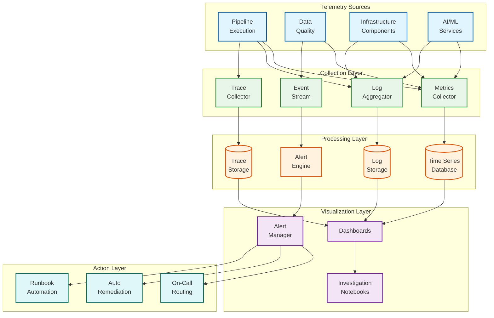
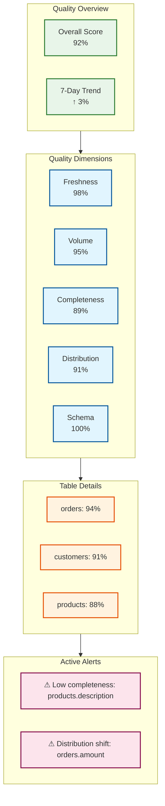
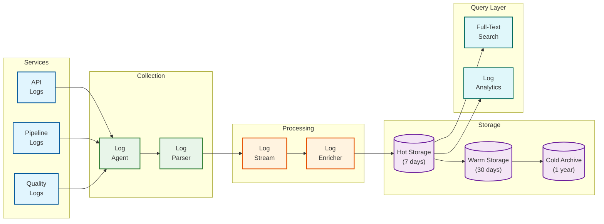
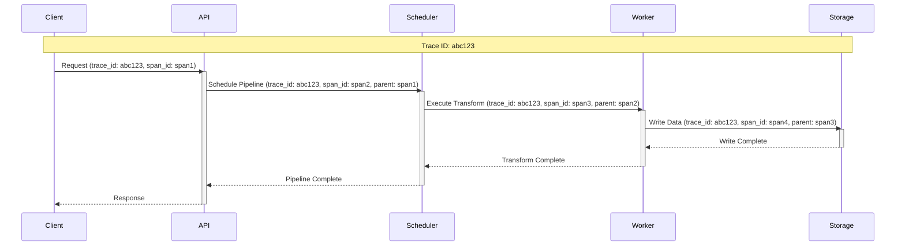
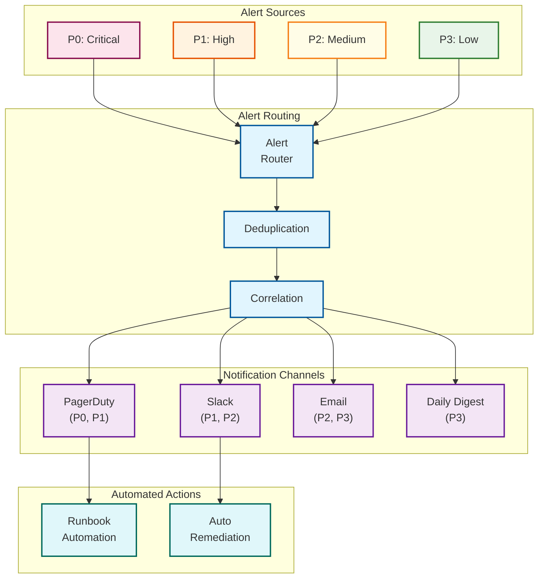

# Observability

## Observability Architecture



---

## Data Quality Metrics

### Five Pillars of Data Quality (FVDCS)

| Pillar | Metric | Description | Measurement |
|--------|--------|-------------|-------------|
| **Freshness** | data_freshness_seconds | Time since last update | current_time - last_update_time |
| **Volume** | row_count, byte_size | Amount of data | COUNT(*), SUM(bytes) |
| **Distribution** | distribution_drift | Statistical profile change | KL divergence, PSI |
| **Completeness** | null_rate, missing_rate | Presence of values | COUNT(nulls) / COUNT(*) |
| **Schema** | schema_changes | Structural changes | Column diff count |

### Quality Metric Definitions

```
// Freshness Metric
freshness_score = IF (current_time - last_update) <= expected_interval
                  THEN 1.0
                  ELSE max(0, 1 - ((current_time - last_update - expected_interval) / expected_interval))

// Volume Metric
volume_score = IF abs(current_count - expected_count) / expected_count <= 0.1
               THEN 1.0
               ELSE max(0, 1 - (abs(current_count - expected_count) / expected_count - 0.1) / 0.9)

// Completeness Metric
completeness_score = 1 - (null_count / total_count)

// Distribution Metric (using Population Stability Index)
psi = SUM((actual_pct - expected_pct) * ln(actual_pct / expected_pct))
distribution_score = IF psi < 0.1 THEN 1.0
                     ELSE IF psi < 0.25 THEN 0.7
                     ELSE 0.3

// Overall Quality Score (weighted average)
quality_score = 0.25 * freshness_score
              + 0.20 * volume_score
              + 0.25 * completeness_score
              + 0.20 * distribution_score
              + 0.10 * schema_score
```

### Quality Metrics Dashboard



---

## Pipeline Metrics

### Execution Metrics (RED Method)

| Metric Type | Metric Name | Description | Unit |
|-------------|-------------|-------------|------|
| **Rate** | pipeline_runs_total | Total pipeline executions | count |
| **Rate** | pipeline_runs_per_minute | Execution rate | count/min |
| **Errors** | pipeline_failures_total | Failed executions | count |
| **Errors** | pipeline_error_rate | Failure percentage | % |
| **Duration** | pipeline_duration_seconds | Execution time | seconds |
| **Duration** | pipeline_duration_p50/p95/p99 | Duration percentiles | seconds |

### Resource Metrics (USE Method)

| Metric Type | Metric Name | Description | Unit |
|-------------|-------------|-------------|------|
| **Utilization** | cpu_utilization | CPU usage | % |
| **Utilization** | memory_utilization | Memory usage | % |
| **Saturation** | queue_depth | Pending jobs | count |
| **Saturation** | consumer_lag | CDC processing lag | seconds |
| **Errors** | oom_kills | Out of memory errors | count |
| **Errors** | connection_errors | Connection failures | count |

### Pipeline Health Indicators

```
// Health Score Calculation
health_score = (
    0.30 * success_rate +
    0.25 * latency_score +
    0.20 * throughput_score +
    0.15 * resource_score +
    0.10 * error_free_score
)

WHERE:
  success_rate = successful_runs / total_runs
  latency_score = 1 - (p95_latency - target_latency) / target_latency
  throughput_score = actual_throughput / expected_throughput
  resource_score = 1 - max(cpu_util, memory_util)
  error_free_score = 1 if no_errors_in_last_hour else 0.5
```

---

## AI/ML Service Metrics

### Schema Mapping Metrics

| Metric | Description | Target |
|--------|-------------|--------|
| mapping_accuracy | Correct mappings / total mappings | >95% |
| mapping_confidence_avg | Average confidence score | >0.85 |
| llm_disambiguation_rate | % requiring LLM | <10% |
| human_review_rate | % requiring human review | <5% |
| mapping_latency_p95 | Mapping generation time | <500ms |

### Anomaly Detection Metrics

| Metric | Description | Target |
|--------|-------------|--------|
| detection_precision | True positives / all alerts | >90% |
| detection_recall | True positives / all anomalies | >85% |
| false_positive_rate | False alerts / total alerts | <5% |
| detection_latency | Time to detect anomaly | <5 min |
| alert_suppression_rate | Suppressed / total detected | <10% |

### Self-Healing Metrics

| Metric | Description | Target |
|--------|-------------|--------|
| self_heal_success_rate | Successful auto-heals / attempts | >78% |
| escalation_rate | Escalated to human / total failures | <30% |
| mttr_auto | Mean time to recover (auto) | <5 min |
| mttr_manual | Mean time to recover (manual) | <30 min |
| healing_accuracy | Correct remediation / attempts | >90% |

### LLM Transformation Metrics

| Metric | Description | Target |
|--------|-------------|--------|
| sql_generation_accuracy | Valid SQL / generated SQL | >95% |
| nl_to_sql_latency_p95 | Generation time | <3s |
| llm_token_cost_per_day | Daily token consumption | Budget |
| cache_hit_rate | Cached responses / requests | >30% |
| validation_failure_rate | Failed validation / generated | <5% |

---

## Logging Strategy

### Log Levels and Usage

| Level | Usage | Retention | Example |
|-------|-------|-----------|---------|
| **ERROR** | Failures requiring attention | 30 days | Pipeline execution failed |
| **WARN** | Potential issues | 14 days | Quality threshold approached |
| **INFO** | Normal operations | 7 days | Pipeline completed successfully |
| **DEBUG** | Detailed troubleshooting | 3 days | SQL query executed |
| **TRACE** | Very detailed debugging | 1 day | Individual record processed |

### Structured Log Format

```
{
    "timestamp": "2026-01-15T10:30:45.123Z",
    "level": "INFO",
    "service": "pipeline-executor",
    "trace_id": "abc123def456",
    "span_id": "span789",

    // Context
    "pipeline_id": "pipeline-001",
    "run_id": "run-12345",
    "source_id": "source-orders",

    // Event
    "event": "PIPELINE_STEP_COMPLETED",
    "step": "transform_orders",
    "duration_ms": 1250,

    // Metrics
    "records_processed": 50000,
    "records_failed": 12,
    "quality_score": 0.94,

    // Error (if applicable)
    "error": null,
    "stack_trace": null
}
```

### Log Aggregation Architecture



---

## Distributed Tracing

### Trace Propagation



### Key Spans to Instrument

| Span Name | Service | Key Attributes |
|-----------|---------|----------------|
| `api.request` | API Gateway | method, path, status_code |
| `pipeline.execute` | Scheduler | pipeline_id, trigger_type |
| `transform.run` | Worker | transform_id, input_rows |
| `quality.check` | Quality Service | check_type, result |
| `schema.map` | Schema Mapper | source_id, confidence |
| `llm.inference` | LLM Service | model, tokens, latency |
| `storage.write` | Storage | table, rows, bytes |
| `cache.lookup` | Cache | key, hit/miss |

### Trace Context Fields

```
TraceContext {
    trace_id:       String      // Unique trace identifier
    span_id:        String      // Current span identifier
    parent_span_id: String      // Parent span (for nesting)
    sampling_rate:  Float       // 0.0 to 1.0

    // Baggage (propagated context)
    pipeline_id:    String
    run_id:         String
    user_id:        String
    environment:    String
}
```

---

## Alerting

### Alert Severity Levels

| Severity | Response Time | Routing | Examples |
|----------|---------------|---------|----------|
| **P0 - Critical** | Immediate (page) | On-call engineer | Pipeline down, data loss risk |
| **P1 - High** | <15 minutes | Alert channel + page | Quality score <70%, high error rate |
| **P2 - Medium** | <1 hour | Alert channel | Schema drift, elevated latency |
| **P3 - Low** | <24 hours | Daily digest | Cost threshold, minor anomalies |

### Alert Rules

```pseudocode
// Critical: Pipeline down for >5 minutes
ALERT PipelineDown
  IF pipeline_status != "running" FOR 5m
  SEVERITY critical
  LABELS { team: "data-platform", component: "pipeline" }
  ANNOTATIONS {
    summary: "Pipeline {{ $labels.pipeline_id }} is down",
    description: "Pipeline has not been running for >5 minutes",
    runbook: "https://runbooks/pipeline-down"
  }

// High: Data quality degraded
ALERT DataQualityDegraded
  IF quality_score < 0.7 FOR 10m
  SEVERITY high
  LABELS { team: "data-platform", component: "quality" }
  ANNOTATIONS {
    summary: "Quality score dropped to {{ $value }} for {{ $labels.table }}",
    runbook: "https://runbooks/quality-degraded"
  }

// Medium: Self-healing escalation spike
ALERT SelfHealingEscalationHigh
  IF rate(self_healing_escalations[1h]) > 0.3
  SEVERITY medium
  LABELS { team: "data-platform", component: "self-healing" }
  ANNOTATIONS {
    summary: "Self-healing escalation rate at {{ $value }}",
    runbook: "https://runbooks/self-healing-review"
  }

// Low: LLM cost exceeded budget
ALERT LLMCostExceeded
  IF sum(llm_token_cost_dollars[24h]) > budget_daily
  SEVERITY low
  LABELS { team: "data-platform", component: "ai" }
  ANNOTATIONS {
    summary: "LLM costs exceeded daily budget",
    runbook: "https://runbooks/cost-optimization"
  }
```

### Alert Routing



---

## Dashboards

### Executive Dashboard

| Panel | Metrics | Refresh |
|-------|---------|---------|
| **Platform Health** | Overall health score, availability | 1 min |
| **Data Quality** | Quality scores by tier (Bronze/Silver/Gold) | 5 min |
| **Pipeline Status** | Running, succeeded, failed counts | 1 min |
| **Key SLOs** | Freshness SLO, quality SLO adherence | 5 min |
| **Cost Tracking** | Daily/weekly spend, LLM costs | 1 hour |

### Operations Dashboard

| Panel | Metrics | Refresh |
|-------|---------|---------|
| **Active Pipelines** | List with status, duration, progress | 30 sec |
| **Error Rate** | Errors per pipeline, error trends | 1 min |
| **Resource Utilization** | CPU, memory, queue depth | 30 sec |
| **Self-Healing** | Auto-healed vs escalated, success rate | 1 min |
| **Active Alerts** | Current alerts by severity | 30 sec |

### Data Quality Dashboard

| Panel | Metrics | Refresh |
|-------|---------|---------|
| **Quality Scorecard** | Overall and per-dimension scores | 5 min |
| **Quality Trends** | 7-day, 30-day trends | 15 min |
| **Anomaly Timeline** | Detected anomalies over time | 5 min |
| **Table Health** | Per-table quality scores | 5 min |
| **Column Issues** | Columns with quality problems | 5 min |

### AI/ML Dashboard

| Panel | Metrics | Refresh |
|-------|---------|---------|
| **Schema Mapping** | Accuracy, confidence distribution | 15 min |
| **LLM Performance** | Latency, token usage, cost | 5 min |
| **Anomaly Detection** | Precision, recall, FP rate | 15 min |
| **Self-Healing** | Success rate, MTTR | 5 min |
| **Model Health** | Drift indicators, accuracy trends | 1 hour |

---

## Runbook References

### Critical Runbooks

| Alert | Runbook | Key Steps |
|-------|---------|-----------|
| Pipeline Down | `/runbooks/pipeline-down` | 1. Check scheduler health 2. Review recent changes 3. Restart if needed |
| Data Loss Risk | `/runbooks/data-loss` | 1. Pause ingestion 2. Assess scope 3. Initiate recovery |
| Quality Critical | `/runbooks/quality-critical` | 1. Identify affected data 2. Quarantine 3. Root cause |
| LLM Outage | `/runbooks/llm-outage` | 1. Switch to fallback provider 2. Enable rule-based mode |
| Storage Full | `/runbooks/storage-full` | 1. Emergency cleanup 2. Extend storage 3. Review retention |

### Diagnostic Queries

```sql
-- Find failed pipelines in last hour
SELECT pipeline_id, error_message, started_at
FROM pipeline_runs
WHERE status = 'FAILED' AND started_at > NOW() - INTERVAL '1 hour'
ORDER BY started_at DESC;

-- Quality scores below threshold
SELECT table_name, quality_score, freshness_score, completeness_score
FROM quality_metrics
WHERE quality_score < 0.8 AND measured_at > NOW() - INTERVAL '1 day'
ORDER BY quality_score ASC;

-- Self-healing escalations
SELECT failure_id, error_class, remediation_action, escalation_reason
FROM self_healing_events
WHERE escalated = true AND timestamp > NOW() - INTERVAL '1 hour';

-- LLM token usage by pipeline
SELECT pipeline_id, SUM(tokens_used) as total_tokens, SUM(cost_dollars) as total_cost
FROM llm_usage
WHERE timestamp > NOW() - INTERVAL '1 day'
GROUP BY pipeline_id
ORDER BY total_cost DESC;
```

---

## Observability Summary

```
+------------------------------------------------------------------------+
|                    OBSERVABILITY SUMMARY                                |
+------------------------------------------------------------------------+
|                                                                         |
|  DATA QUALITY METRICS (FVDCS)                                          |
|  ---------------------------                                            |
|  Freshness:     Time since last update (<5 min for CDC)                |
|  Volume:        Row counts, byte sizes (±10% tolerance)                |
|  Distribution:  Value profile changes (PSI < 0.1)                      |
|  Completeness:  Null rates (<5% for critical columns)                  |
|  Schema:        Column changes (0 unexpected changes)                  |
|                                                                         |
+------------------------------------------------------------------------+
|                                                                         |
|  PIPELINE METRICS (RED)                                                |
|  ----------------------                                                 |
|  Rate:          Runs/minute, throughput                                |
|  Errors:        Failure rate (<1%), error types                        |
|  Duration:      p50/p95/p99 latency                                    |
|                                                                         |
+------------------------------------------------------------------------+
|                                                                         |
|  AI/ML METRICS                                                         |
|  -------------                                                          |
|  Schema Mapping:   Accuracy >95%, confidence >0.85                     |
|  Anomaly Detection: Precision >90%, recall >85%                        |
|  Self-Healing:     Success rate >78%, MTTR <5 min                      |
|  LLM:              SQL accuracy >95%, latency <3s p95                  |
|                                                                         |
+------------------------------------------------------------------------+
|                                                                         |
|  ALERT PRIORITIES                                                       |
|  ----------------                                                       |
|  P0 (Critical):  Pipeline down, data loss → Page immediately           |
|  P1 (High):      Quality <70%, high errors → 15 min response           |
|  P2 (Medium):    Schema drift, latency → 1 hour response               |
|  P3 (Low):       Cost exceeded, minor → Daily digest                   |
|                                                                         |
+------------------------------------------------------------------------+
```
