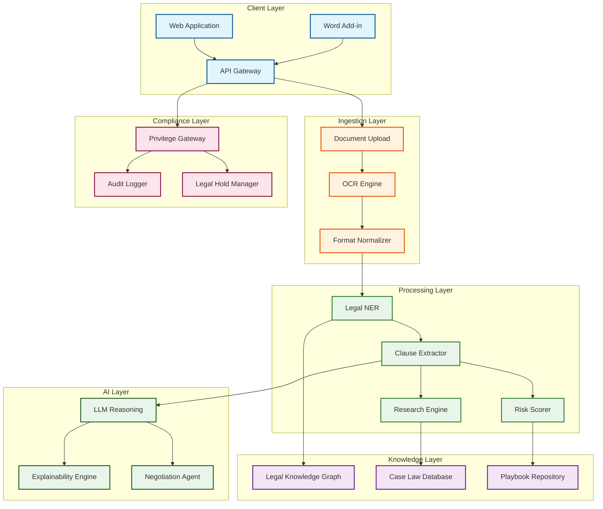
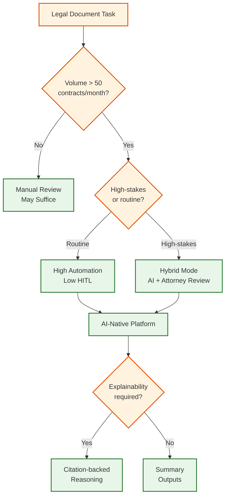

# AI-Native Legal Tech Platform

## System Overview

An **AI-Native Legal Tech Platform** combines specialized legal NLP models with foundation model reasoning to automate contract analysis, legal research, risk detection, and due diligence workflows. Unlike traditional legal document management that requires manual review and template matching, AI-native platforms achieve **70% reduction in contract review time**, **95%+ clause extraction accuracy**, and provide **court-defensible explainability** through citation-backed reasoning chains.

The platform serves law firms, corporate legal departments, and compliance teams by automating high-volume legal document processing while maintaining the explainability and audit trails required for professional responsibility.

---

## Key Characteristics

| Characteristic | Value | Implication |
|----------------|-------|-------------|
| **Read:Write Ratio** | 80:20 | Read-heavy for research, moderate writes for analysis |
| **Latency Sensitivity** | High | Real-time contract review during negotiations |
| **Consistency Model** | Strong for compliance, Eventual for analytics | Dual-mode processing |
| **Compliance Criticality** | Very High | Attorney-client privilege, e-discovery, audit trails |
| **Explainability Requirement** | Mandatory | Every AI output must be traceable to source |
| **Human-in-Loop** | Required | Attorney oversight for high-stakes decisions |

---

## Complexity Rating

**`Very High`**

### Justification

1. **Multi-model orchestration**: Specialized legal NER, clause extraction, risk scoring, and LLM reasoning
2. **Agentic workflows**: Contract negotiation, due diligence, and research agents with HITL
3. **Attorney-client privilege**: Zero-tolerance for confidentiality breaches
4. **Multi-jurisdictional knowledge**: Different legal frameworks, terminology, and precedents across jurisdictions
5. **Explainability at scale**: Citation provenance tracking for thousands of clauses
6. **E-discovery compliance**: Complete audit trails with legal hold capabilities
7. **Real-time + batch modes**: Low-latency contract review alongside high-volume due diligence

---

## Platform Comparison (2025-2026)

| Platform | Primary Focus | Key Differentiator | Target User | Clause Types |
|----------|--------------|-------------------|-------------|--------------|
| **Harvey AI** | Elite law firms | Customizable workflows, $8B valuation | AmLaw 100 firms | Custom |
| **LegalOn** | In-house legal | Pre-built attorney playbooks, fastest ROI | Corporate legal | 100+ |
| **Ironclad** | CLM + AI | Harvey partnership (Aug 2025), end-to-end CLM | Enterprise | 200+ |
| **Evisort** | Contract intelligence | Workday acquisition, portfolio analytics | Enterprise | 150+ |
| **Kira Systems** | Due diligence | 1,400+ clause types, high-volume M&A | M&A teams | 1,400+ |
| **Luminance** | Cross-border | Proprietary legal LLM, anomaly detection | Global firms | 500+ |
| **Spellbook** | Contract drafting | Word integration, clause suggestions | SMB legal | 100+ |

---

## Core Capabilities

### 1. Contract Analysis
- Multi-format ingestion (PDF, Word, scans up to 500 pages)
- Key term extraction: parties, dates, obligations, governing law
- Playbook comparison with deviation highlighting
- Executive summary generation in plain language

### 2. Legal Research
- Semantic search across case law, statutes, regulations
- Multi-jurisdictional support (US, UK, EU, APAC)
- Citation verification and authority validation
- Research memo generation with cited precedents

### 3. Risk Detection
- Non-standard clause identification vs. market position
- Liability exposure analysis (indemnification, limitation of liability)
- Missing provision detection against checklists
- Compliance gap analysis by jurisdiction

### 4. Due Diligence
- Data room processing (10,000+ documents)
- Automated categorization by contract type
- Deal summary report generation
- Material issue flagging by category

### 5. Clause Extraction
- 1,000+ clause type taxonomy across 50+ contract categories
- Obligation and deadline tracking
- Party-specific clause attribution
- Amendment tracking across document versions

### 6. Explainable AI
- Reasoning chain for every AI recommendation
- Source citation to documents, clauses, case law
- Confidence scoring with uncertainty quantification
- Attorney override tracking with audit trail

---

## Architecture Overview

---

## Decision Tree: When to Use AI-Native Legal Tech

---

## Quick Navigation

| Document | Description |
|----------|-------------|
| [01 - Requirements & Estimations](./01-requirements-and-estimations.md) | Functional/non-functional requirements, capacity planning, SLOs |
| [02 - High-Level Design](./02-high-level-design.md) | Architecture diagrams, data flow, key decisions |
| [03 - Low-Level Design](./03-low-level-design.md) | Data models, API specifications, algorithms |
| [04 - Deep Dive & Bottlenecks](./04-deep-dive-and-bottlenecks.md) | Critical components, race conditions, optimizations |
| [05 - Scalability & Reliability](./05-scalability-and-reliability.md) | Scaling strategies, fault tolerance, disaster recovery |
| [06 - Security & Compliance](./06-security-and-compliance.md) | Privilege protection, compliance framework, threat model |
| [07 - Observability](./07-observability.md) | Metrics, logging, tracing, alerting |
| [08 - Interview Guide](./08-interview-guide.md) | 45-min pacing, trap questions, trade-offs |

---

## Related System Designs

| System | Relationship |
|--------|--------------|
| [3.15 RAG System](../3.15-rag-system/00-index.md) | Legal research retrieval patterns |
| [3.31 Document Processing Platform](../3.31-ai-native-document-processing-platform/00-index.md) | Document ingestion and understanding |
| [3.32 Enterprise Knowledge Graph](../3.32-ai-native-enterprise-knowledge-graph/00-index.md) | Legal knowledge representation |
| [3.22 AI Guardrails & Safety](../3.22-ai-guardrails-safety-system/00-index.md) | Content safety, PII detection |
| [3.24 Multi-Agent Orchestration](../3.24-multi-agent-orchestration-platform/00-index.md) | Agentic legal workflows |
| [3.25 AI Observability & LLMOps](../3.25-ai-observability-llmops-platform/00-index.md) | Legal AI monitoring |

---

## Key Metrics Summary

| Metric | Target | Critical Threshold |
|--------|--------|-------------------|
| Clause Extraction Accuracy | > 95% F1 | < 90% |
| Risk Detection Precision | > 90% | < 85% |
| Contract Review Latency | < 30s/page | > 60s/page |
| Due Diligence Throughput | < 2hrs/1000 docs | > 4hrs/1000 docs |
| Explainability Coverage | 100% | < 100% |
| Attorney Override Rate | < 10% | > 15% |
| Privilege Breach Incidents | 0 | > 0 |
| System Availability | 99.9% | < 99.5% |

---

## Technology Stack (Reference Implementation)

| Layer | Technologies |
|-------|--------------|
| **Document Processing** | LayoutLMv3, Donut, Tesseract, pdf.js |
| **Legal NLP** | SpaCy (legal model), GLiNER, Legal-BERT |
| **Foundation Models** | GPT-4, Claude, Gemini (via gateway) |
| **Knowledge Graph** | Neo4j, FalkorDB, GraphRAG |
| **Vector Store** | Pinecone, Weaviate, pgvector |
| **Case Law Search** | Elasticsearch, Vespa |
| **Orchestration** | LangGraph, Temporal |
| **Compliance** | HashiCorp Vault, audit logging |
| **Integration** | Microsoft Graph, Salesforce, iManage |

---

## Sources

- [Harvey AI Review 2026](https://growlaw.co/blog/harvey-ai-review) - Platform capabilities and market position
- [LegalOn Best Contract Review Tools](https://www.legalontech.com/post/best-ai-contract-review-tools) - In-house legal workflows
- [Ironclad Harvey Partnership](https://ironcladapp.com/resources/articles/ironclad-harvey-partnership) - CLM + AI integration
- [AI Legal Tech Trends 2025](https://www.attorneyjournals.com/ai-driven-legal-tech-trends-for-2025) - Market trends
- [ABA AI Ethics 50-State Survey](https://www.justia.com/trials-litigation/ai-and-attorney-ethics-rules-50-state-survey/) - Compliance requirements
- [Legal NLP Survey](https://arxiv.org/html/2410.21306v2) - Technical approaches
- [AI Due Diligence Guide](https://rtslabs.com/ai-due-diligence/) - Due diligence automation
