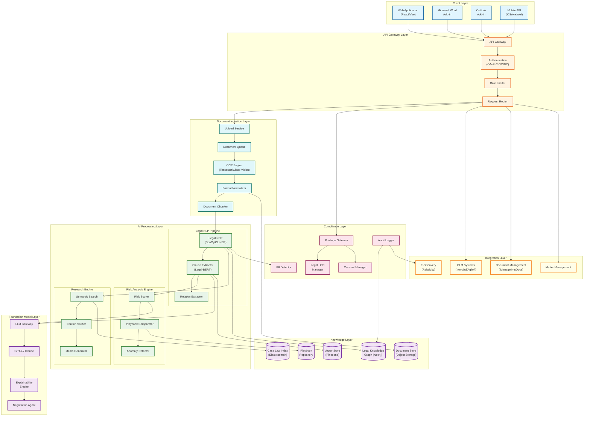
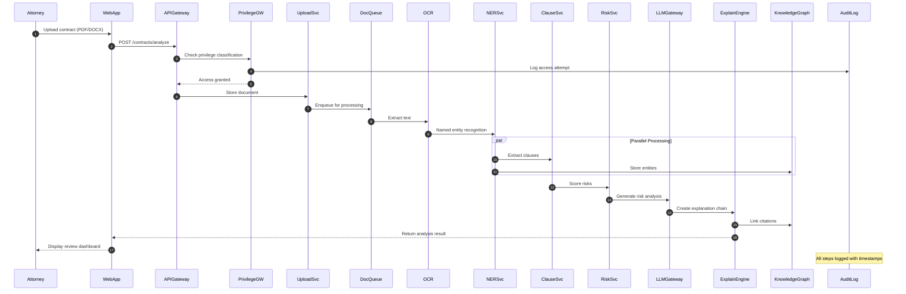
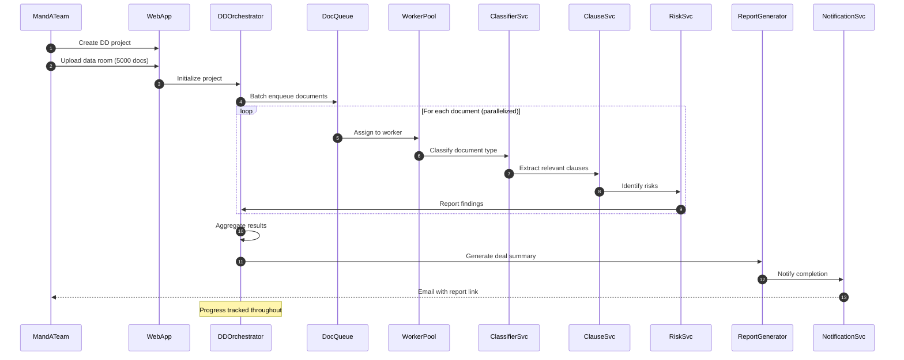
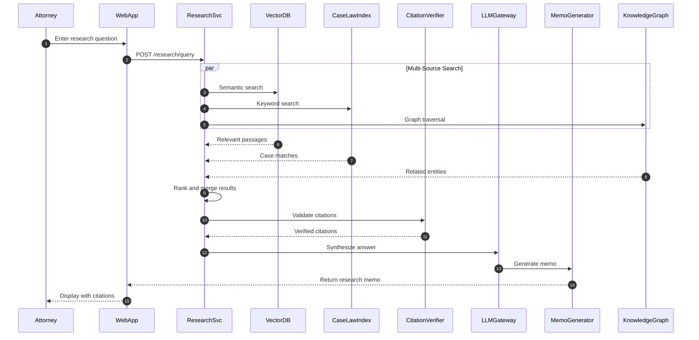
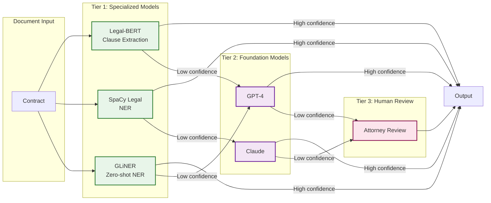
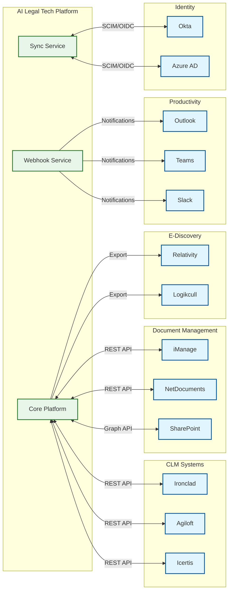
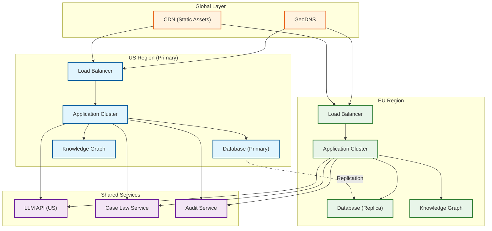

# High-Level Design

## Table of Contents
- [System Architecture](#system-architecture)
- [Component Overview](#component-overview)
- [Data Flow](#data-flow)
- [Key Architectural Decisions](#key-architectural-decisions)
- [Technology Choices](#technology-choices)
- [Integration Architecture](#integration-architecture)

---

## System Architecture

### Complete Architecture Diagram



---

## Component Overview

### Layer 1: Client Layer

| Component | Purpose | Key Features |
|-----------|---------|--------------|
| **Web Application** | Primary user interface | Contract upload, review dashboard, research |
| **Word Add-in** | In-document analysis | Real-time clause highlighting, risk flags |
| **Outlook Add-in** | Email integration | Contract attachment processing |
| **Mobile API** | Mobile access | Approval workflows, notifications |

### Layer 2: API Gateway Layer

| Component | Purpose | Key Features |
|-----------|---------|--------------|
| **API Gateway** | Single entry point | Request routing, SSL termination |
| **Authentication** | Identity verification | OAuth 2.0, OIDC, SAML for enterprise SSO |
| **Rate Limiter** | Abuse prevention | Per-user, per-tenant limits |
| **Request Router** | Traffic distribution | Route to appropriate service |

### Layer 3: Document Ingestion Layer

| Component | Purpose | Key Features |
|-----------|---------|--------------|
| **Upload Service** | Document reception | Multi-part upload, resume support |
| **Document Queue** | Async processing | Priority queuing, dead letter |
| **OCR Engine** | Text extraction | Multi-engine fallback, language detection |
| **Format Normalizer** | Standardization | PDF/DOCX/TIFF to unified format |
| **Document Chunker** | Semantic segmentation | Page, section, paragraph boundaries |

### Layer 4: AI Processing Layer

| Component | Purpose | Key Features |
|-----------|---------|--------------|
| **Legal NER** | Entity extraction | Parties, dates, amounts, jurisdictions |
| **Clause Extractor** | Clause identification | 500+ clause types, boundary detection |
| **Relation Extractor** | Entity relationships | Party-clause, clause-obligation links |
| **Risk Scorer** | Risk assessment | Multi-factor scoring, severity levels |
| **Playbook Comparator** | Standard compliance | Deviation detection, suggestion |
| **Anomaly Detector** | Unusual terms | Market position comparison |
| **Semantic Search** | Legal research | Case law, statute retrieval |
| **Citation Verifier** | Reference validation | Shepardizing, currency check |
| **Memo Generator** | Document synthesis | Research memo, summary generation |

### Layer 5: Foundation Model Layer

| Component | Purpose | Key Features |
|-----------|---------|--------------|
| **LLM Gateway** | Model routing | Load balancing, fallback, cost optimization |
| **GPT-4 / Claude** | Reasoning engine | Complex analysis, generation |
| **Explainability Engine** | Reasoning chains | Citation-backed explanations |
| **Negotiation Agent** | Autonomous actions | Redlining, counter-proposals |

### Layer 6: Knowledge Layer

| Component | Purpose | Key Features |
|-----------|---------|--------------|
| **Legal Knowledge Graph** | Entity relationships | Multi-hop reasoning, precedent chains |
| **Vector Store** | Semantic retrieval | Clause embeddings, similarity search |
| **Case Law Index** | Full-text search | Jurisdictional filtering, date ranges |
| **Playbook Repository** | Standard templates | Version control, approval workflows |
| **Document Store** | Raw storage | Immutable storage, deduplication |

### Layer 7: Compliance Layer

| Component | Purpose | Key Features |
|-----------|---------|--------------|
| **Privilege Gateway** | Confidentiality protection | Classification, access control |
| **PII Detector** | Sensitive data identification | Names, SSNs, addresses |
| **Audit Logger** | Activity tracking | Immutable logs, timestamp |
| **Legal Hold Manager** | Preservation | Hold triggers, release |
| **Consent Manager** | Data subject rights | Consent tracking, withdrawal |

### Layer 8: Integration Layer

| Component | Purpose | Key Features |
|-----------|---------|--------------|
| **CLM Systems** | Contract lifecycle | Ironclad, Agiloft, Icertis |
| **Document Management** | Storage integration | iManage, NetDocuments |
| **E-Discovery** | Litigation support | Relativity, Logikcull |
| **Matter Management** | Case tracking | Aderant, Elite |

---

## Data Flow

### Contract Review Flow



### Due Diligence Batch Flow



### Legal Research Flow



---

## Key Architectural Decisions

### Decision 1: Hybrid Model Strategy



| Aspect | Decision | Rationale |
|--------|----------|-----------|
| **Primary Processing** | Specialized models (Legal-BERT, SpaCy) | Fast, deterministic, cost-effective |
| **Complex Reasoning** | Foundation models (GPT-4, Claude) | Flexibility for novel situations |
| **Fallback** | Human-in-the-loop | Professional responsibility requirement |
| **Routing** | Confidence-based | Optimize cost vs. accuracy tradeoff |

### Decision 2: Knowledge Representation

| Aspect | Decision | Rationale |
|--------|----------|-----------|
| **Structure** | Property Graph (Neo4j) | Multi-hop reasoning for precedents |
| **Embeddings** | Vector Store (Pinecone) | Semantic similarity for clauses |
| **Full-text** | Elasticsearch | Case law keyword search |
| **Integration** | GraphRAG pattern | Combine graph + vector retrieval |

### Decision 3: Explainability Architecture

| Aspect | Decision | Rationale |
|--------|----------|-----------|
| **Approach** | Chain-of-Thought with citations | Attorney trust, court defensibility |
| **Granularity** | Per-extraction explanation | Fine-grained audit trail |
| **Storage** | Immutable explanation store | Compliance, reproducibility |
| **Presentation** | Layered (summary → detail) | Different user needs |

### Decision 4: Compliance-First Design

| Aspect | Decision | Rationale |
|--------|----------|-----------|
| **Data Training** | No client data in training | Preserve attorney-client privilege |
| **Processing Isolation** | Tenant-isolated compute | Data segregation |
| **Audit Trail** | Append-only, immutable | E-discovery requirements |
| **Access Control** | Attribute-based (ABAC) | Granular privilege management |

### Architecture Pattern Checklist

| Pattern | Decision | Notes |
|---------|----------|-------|
| **Sync vs Async** | Async for processing, Sync for queries | Queue-based document processing |
| **Event-driven vs Request-response** | Event-driven for pipeline | Document state machine |
| **Push vs Pull** | Pull for processing, Push for notifications | Worker-based scaling |
| **Stateless vs Stateful** | Stateless services | Session state in Redis |
| **Read-heavy vs Write-heavy** | Read-heavy (80:20) | Cache aggressively |
| **Real-time vs Batch** | Both modes supported | Contract review vs. due diligence |
| **Edge vs Origin** | Origin processing | Compliance requirements |

---

## Technology Choices

### Document Processing Stack

| Component | Primary Choice | Alternative | Selection Criteria |
|-----------|---------------|-------------|-------------------|
| **OCR** | Cloud Vision API | Tesseract 5 | Accuracy, language support |
| **PDF Parsing** | pdf.js + Apache Tika | PyMuPDF | Format coverage |
| **Layout Analysis** | LayoutLMv3 | Donut | Table/form extraction |
| **Document Store** | Object Storage (S3-compatible) | MinIO | Durability, cost |

### NLP and ML Stack

| Component | Primary Choice | Alternative | Selection Criteria |
|-----------|---------------|-------------|-------------------|
| **Legal NER** | SpaCy (legal model) + GLiNER | Flair NER | Legal entity coverage |
| **Clause Extraction** | Legal-BERT fine-tuned | Longformer | Context window, accuracy |
| **Embeddings** | OpenAI Ada-002 | Cohere Embed | Quality, cost balance |
| **Semantic Search** | Pinecone | Weaviate | Scale, latency |

### Foundation Model Stack

| Component | Primary Choice | Alternative | Selection Criteria |
|-----------|---------------|-------------|-------------------|
| **Reasoning** | GPT-4 Turbo | Claude 3.5 Sonnet | Context window, accuracy |
| **Gateway** | Custom (LangChain) | Portkey | Cost optimization, routing |
| **Orchestration** | LangGraph | Temporal | Agent workflows |
| **Guardrails** | Custom + NeMo | Guardrails AI | Legal-specific rules |

### Data Storage Stack

| Component | Primary Choice | Alternative | Selection Criteria |
|-----------|---------------|-------------|-------------------|
| **Graph Database** | Neo4j | FalkorDB | Query performance, maturity |
| **Vector Store** | Pinecone | pgvector | Scale, managed service |
| **Search Index** | Elasticsearch | Vespa | Full-text, hybrid search |
| **Relational** | PostgreSQL | CockroachDB | ACID, familiarity |
| **Cache** | Redis | Memcached | Data structures, persistence |
| **Queue** | Apache Kafka | RabbitMQ | Throughput, durability |

---

## Integration Architecture

### External System Integration



### Integration Patterns

| Pattern | Use Case | Implementation |
|---------|----------|----------------|
| **REST API** | Synchronous operations | Contract upload, query results |
| **Webhooks** | Event notifications | Analysis complete, risk alerts |
| **File Sync** | Document management | Bi-directional sync with DMS |
| **SCIM** | User provisioning | Enterprise identity sync |
| **OAuth 2.0** | Authorization | Delegated access to external systems |

### API Gateway Configuration

```
Rate Limits:
  - Contract Analysis: 100 requests/minute per user
  - Legal Research: 200 requests/minute per user
  - Batch Upload: 10 requests/minute per user
  - Due Diligence: 5 projects/hour per user

Timeout Configuration:
  - Contract Analysis: 120 seconds
  - Legal Research: 30 seconds
  - Batch Processing: 300 seconds (async)

Circuit Breaker:
  - LLM Gateway: 50% failure rate triggers open
  - OCR Service: 30% failure rate triggers open
  - Recovery: Half-open after 60 seconds
```

---

## Deployment Architecture

### Multi-Region Deployment



### Data Residency Requirements

| Region | Data Stored | Processing | Rationale |
|--------|-------------|------------|-----------|
| **US** | US client documents | Full processing | Primary market |
| **EU** | EU client documents | Full processing | GDPR compliance |
| **APAC** | APAC client documents | Limited (roadmap) | Expansion planned |

---

## Summary

The AI-Native Legal Tech Platform architecture prioritizes:

1. **Explainability**: Every AI decision is traceable to source with citation chains
2. **Compliance**: Attorney-client privilege, e-discovery, and audit requirements are built-in
3. **Flexibility**: Hybrid model strategy balances speed, accuracy, and cost
4. **Scale**: Event-driven architecture supports both real-time and batch workloads
5. **Integration**: Open APIs enable seamless workflow with existing legal tech stack
