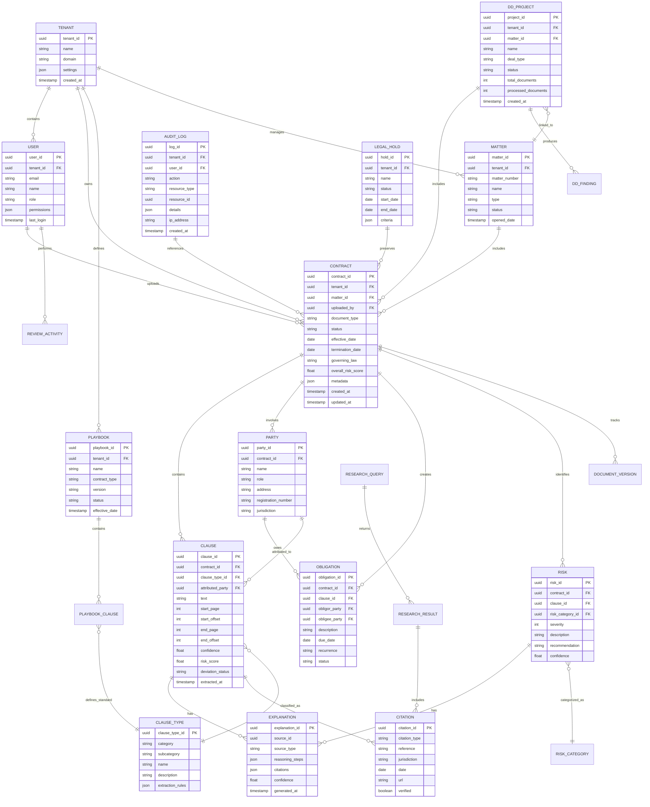
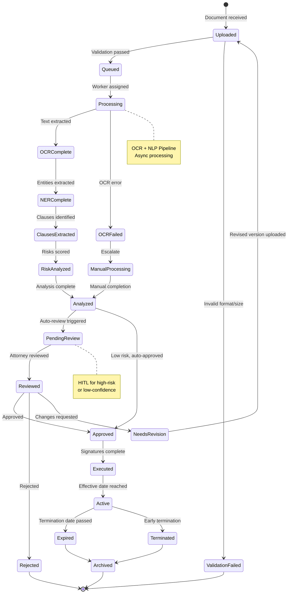
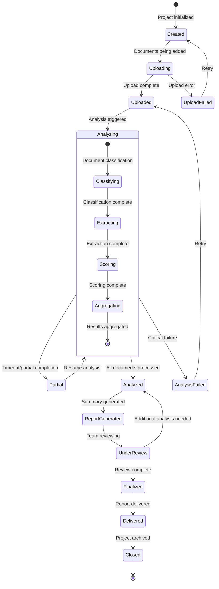

# Low-Level Design

## Table of Contents
- [Data Model](#data-model)
- [API Specifications](#api-specifications)
- [Core Algorithms](#core-algorithms)
- [State Machines](#state-machines)
- [Indexing Strategy](#indexing-strategy)

---

## Data Model

### Entity Relationship Diagram



### Core Entity Definitions

#### Contract

```yaml
Contract:
  description: "Primary document entity representing a legal contract"
  fields:
    contract_id:
      type: UUID
      primary_key: true
      description: "Unique identifier"

    tenant_id:
      type: UUID
      foreign_key: Tenant.tenant_id
      required: true
      description: "Owning organization"

    matter_id:
      type: UUID
      foreign_key: Matter.matter_id
      nullable: true
      description: "Associated legal matter"

    document_type:
      type: Enum
      values: [NDA, MSA, SOW, EMPLOYMENT, LEASE, LICENSE, PURCHASE, MERGER, OTHER]
      required: true
      description: "Contract classification"

    status:
      type: Enum
      values: [UPLOADED, PROCESSING, ANALYZED, REVIEWED, APPROVED, EXECUTED, EXPIRED]
      default: UPLOADED
      description: "Lifecycle status"

    parties:
      type: Array[Party]
      embedded: false
      description: "Contract parties"

    effective_date:
      type: Date
      nullable: true
      description: "Contract start date"

    termination_date:
      type: Date
      nullable: true
      description: "Contract end date"

    governing_law:
      type: String
      max_length: 100
      description: "Jurisdiction governing the contract"

    overall_risk_score:
      type: Float
      range: [0, 10]
      description: "Aggregated risk score"

    extraction_confidence:
      type: Float
      range: [0, 1]
      description: "Overall extraction confidence"

    storage_path:
      type: String
      description: "Object storage path for original document"

    text_content:
      type: Text
      description: "Extracted full text"

    page_count:
      type: Integer
      description: "Number of pages"

    privilege_status:
      type: Enum
      values: [NOT_CLASSIFIED, NON_PRIVILEGED, PRIVILEGED, WORK_PRODUCT]
      default: NOT_CLASSIFIED
      description: "Privilege classification"

    legal_hold_id:
      type: UUID
      nullable: true
      description: "Active legal hold if any"

    metadata:
      type: JSON
      description: "Flexible metadata storage"

    created_at:
      type: Timestamp
      auto_generated: true

    updated_at:
      type: Timestamp
      auto_updated: true

  indexes:
    - fields: [tenant_id, status]
      type: btree
    - fields: [tenant_id, document_type]
      type: btree
    - fields: [matter_id]
      type: btree
    - fields: [termination_date]
      type: btree
    - fields: [created_at]
      type: btree
```

#### Clause

```yaml
Clause:
  description: "Extracted contractual clause with analysis"
  fields:
    clause_id:
      type: UUID
      primary_key: true

    contract_id:
      type: UUID
      foreign_key: Contract.contract_id
      required: true
      on_delete: CASCADE

    clause_type_id:
      type: UUID
      foreign_key: ClauseType.clause_type_id
      required: true

    attributed_party_id:
      type: UUID
      foreign_key: Party.party_id
      nullable: true
      description: "Party this clause primarily affects"

    text:
      type: Text
      required: true
      description: "Full clause text"

    normalized_text:
      type: Text
      description: "Cleaned text for comparison"

    location:
      type: JSON
      schema:
        start_page: integer
        start_offset: integer
        end_page: integer
        end_offset: integer
        section_path: string[]
      description: "Document location"

    confidence:
      type: Float
      range: [0, 1]
      description: "Extraction confidence"

    risk_score:
      type: Float
      range: [0, 10]
      description: "Clause-specific risk"

    deviation_status:
      type: Enum
      values: [STANDARD, MINOR_DEVIATION, MAJOR_DEVIATION, MISSING, NOT_APPLICABLE]
      description: "Compared to playbook"

    deviation_details:
      type: JSON
      description: "Specific deviation analysis"

    embedding:
      type: Vector[1536]
      description: "Semantic embedding for similarity"

    extracted_at:
      type: Timestamp

    model_version:
      type: String
      description: "Model used for extraction"

  indexes:
    - fields: [contract_id]
      type: btree
    - fields: [clause_type_id]
      type: btree
    - fields: [risk_score]
      type: btree
      where: "risk_score > 5"
    - fields: [embedding]
      type: vector_ivfflat
      lists: 100
```

#### ExplanationChain

```yaml
ExplanationChain:
  description: "Explainable AI reasoning chain for audit and transparency"
  fields:
    explanation_id:
      type: UUID
      primary_key: true

    source_type:
      type: Enum
      values: [CLAUSE_EXTRACTION, RISK_ASSESSMENT, RESEARCH_ANSWER, RECOMMENDATION]

    source_id:
      type: UUID
      description: "ID of the entity being explained"

    reasoning_steps:
      type: Array[ReasoningStep]
      schema:
        step_number: integer
        reasoning_type: enum[PATTERN_MATCH, SEMANTIC_SIMILARITY, RULE_APPLICATION, LLM_INFERENCE, PRECEDENT_CITATION]
        input_context: text
        output_conclusion: text
        confidence: float
        model_used: string
        citation_ids: uuid[]

    overall_confidence:
      type: Float
      range: [0, 1]

    attorney_comprehensible:
      type: Boolean
      description: "Whether explanation is in plain language"

    generated_at:
      type: Timestamp

    generator_version:
      type: String

  indexes:
    - fields: [source_type, source_id]
      type: btree
      unique: true
```

#### LegalKnowledgeGraph (Neo4j Schema)

```yaml
Nodes:
  LegalEntity:
    properties:
      entity_id: string
      name: string
      entity_type: enum[PERSON, ORGANIZATION, COURT, STATUTE, CASE, REGULATION]
      jurisdiction: string
      aliases: string[]
      created_at: datetime

  ContractNode:
    properties:
      contract_id: string
      document_type: string
      effective_date: date
      tenant_id: string

  ClauseNode:
    properties:
      clause_id: string
      clause_type: string
      text_hash: string
      risk_score: float

  CaseLaw:
    properties:
      case_id: string
      citation: string
      court: string
      date: date
      jurisdiction: string
      headnotes: string[]
      outcome: string

  Statute:
    properties:
      statute_id: string
      citation: string
      jurisdiction: string
      title: string
      section: string
      effective_date: date

Relationships:
  PARTY_TO:
    from: LegalEntity
    to: ContractNode
    properties:
      role: enum[BUYER, SELLER, LICENSOR, LICENSEE, EMPLOYER, EMPLOYEE]

  CONTAINS_CLAUSE:
    from: ContractNode
    to: ClauseNode
    properties:
      location: string

  CITES:
    from: ClauseNode
    to: [CaseLaw, Statute]
    properties:
      citation_type: enum[SUPPORTING, DEFINING, REFERENCING]

  OVERRULED_BY:
    from: CaseLaw
    to: CaseLaw
    properties:
      date: date

  AMENDS:
    from: Statute
    to: Statute
    properties:
      effective_date: date

  SIMILAR_TO:
    from: ClauseNode
    to: ClauseNode
    properties:
      similarity_score: float
      comparison_type: enum[SEMANTIC, STRUCTURAL]
```

---

## API Specifications

### Contract Analysis API

```yaml
POST /api/v1/contracts/analyze:
  summary: "Upload and analyze a contract"
  security:
    - bearerAuth: []
  requestBody:
    multipart/form-data:
      document:
        type: file
        required: true
        description: "Contract document (PDF, DOCX, DOC, TIFF)"
        maxSize: 100MB

      document_type:
        type: string
        enum: [NDA, MSA, SOW, EMPLOYMENT, LEASE, LICENSE, PURCHASE, MERGER, OTHER, AUTO_DETECT]
        default: AUTO_DETECT

      playbook_id:
        type: string
        format: uuid
        required: false
        description: "Playbook to compare against"

      matter_id:
        type: string
        format: uuid
        required: false
        description: "Associated matter"

      options:
        type: object
        properties:
          extract_clauses:
            type: boolean
            default: true
          detect_risks:
            type: boolean
            default: true
          generate_summary:
            type: boolean
            default: true
          extract_obligations:
            type: boolean
            default: true
          async:
            type: boolean
            default: false
            description: "Return immediately with job ID"

  responses:
    200:
      description: "Analysis complete (sync mode)"
      content:
        application/json:
          schema:
            type: object
            properties:
              contract_id:
                type: string
                format: uuid
              status:
                type: string
                enum: [ANALYZED]
              document_type:
                type: string
              parties:
                type: array
                items:
                  $ref: '#/components/schemas/Party'
              effective_date:
                type: string
                format: date
              termination_date:
                type: string
                format: date
              governing_law:
                type: string
              clauses:
                type: array
                items:
                  $ref: '#/components/schemas/Clause'
              risks:
                type: array
                items:
                  $ref: '#/components/schemas/Risk'
              obligations:
                type: array
                items:
                  $ref: '#/components/schemas/Obligation'
              summary:
                type: string
              overall_risk_score:
                type: number
              extraction_confidence:
                type: number
              processing_time_ms:
                type: integer

    202:
      description: "Processing started (async mode)"
      content:
        application/json:
          schema:
            type: object
            properties:
              job_id:
                type: string
                format: uuid
              status:
                type: string
                enum: [PROCESSING]
              estimated_completion:
                type: string
                format: datetime

    400:
      description: "Invalid request"
    413:
      description: "Document too large"
    415:
      description: "Unsupported document format"

GET /api/v1/contracts/{contract_id}:
  summary: "Get contract details"
  parameters:
    - name: contract_id
      in: path
      required: true
      schema:
        type: string
        format: uuid
    - name: include
      in: query
      schema:
        type: array
        items:
          type: string
          enum: [clauses, risks, obligations, explanations, audit_trail]
  responses:
    200:
      description: "Contract details"

GET /api/v1/contracts/{contract_id}/clauses:
  summary: "Get extracted clauses"
  parameters:
    - name: contract_id
      in: path
      required: true
    - name: clause_type
      in: query
      schema:
        type: string
    - name: risk_score_min
      in: query
      schema:
        type: number
    - name: deviation_status
      in: query
      schema:
        type: string
        enum: [STANDARD, MINOR_DEVIATION, MAJOR_DEVIATION, MISSING]
  responses:
    200:
      description: "List of clauses"
```

### Risk Assessment API

```yaml
GET /api/v1/contracts/{contract_id}/risks:
  summary: "Get identified risks"
  parameters:
    - name: contract_id
      in: path
      required: true
    - name: severity_min
      in: query
      schema:
        type: integer
        minimum: 1
        maximum: 10
    - name: category
      in: query
      schema:
        type: string
  responses:
    200:
      description: "List of risks"
      content:
        application/json:
          schema:
            type: object
            properties:
              risks:
                type: array
                items:
                  type: object
                  properties:
                    risk_id:
                      type: string
                    category:
                      type: string
                    severity:
                      type: integer
                    description:
                      type: string
                    clause_id:
                      type: string
                    clause_text:
                      type: string
                    recommendation:
                      type: string
                    confidence:
                      type: number
              overall_score:
                type: number
              risk_distribution:
                type: object
                additionalProperties:
                  type: integer

POST /api/v1/contracts/{contract_id}/risks/{risk_id}/explain:
  summary: "Get detailed explanation for a risk"
  responses:
    200:
      description: "Risk explanation"
      content:
        application/json:
          schema:
            type: object
            properties:
              risk_id:
                type: string
              explanation:
                type: object
                properties:
                  summary:
                    type: string
                  reasoning_steps:
                    type: array
                    items:
                      type: object
                      properties:
                        step:
                          type: integer
                        reasoning_type:
                          type: string
                        description:
                          type: string
                        evidence:
                          type: string
                        citation:
                          type: object
                  confidence:
                    type: number
                  comparable_clauses:
                    type: array
                    items:
                      type: object
                      properties:
                        source:
                          type: string
                        text:
                          type: string
                        risk_score:
                          type: number
```

### Legal Research API

```yaml
POST /api/v1/research/query:
  summary: "Perform legal research query"
  requestBody:
    content:
      application/json:
        schema:
          type: object
          required:
            - question
          properties:
            question:
              type: string
              maxLength: 2000
              description: "Natural language legal question"

            jurisdictions:
              type: array
              items:
                type: string
              description: "Filter by jurisdictions"

            sources:
              type: array
              items:
                type: string
                enum: [CASE_LAW, STATUTES, REGULATIONS, SECONDARY, ALL]
              default: [ALL]

            date_range:
              type: object
              properties:
                from:
                  type: string
                  format: date
                to:
                  type: string
                  format: date

            max_results:
              type: integer
              default: 20
              maximum: 100

            include_memo:
              type: boolean
              default: false
              description: "Generate research memo"

  responses:
    200:
      description: "Research results"
      content:
        application/json:
          schema:
            type: object
            properties:
              query_id:
                type: string
              answer:
                type: string
                description: "Synthesized answer"
              confidence:
                type: number
              results:
                type: array
                items:
                  type: object
                  properties:
                    result_id:
                      type: string
                    source_type:
                      type: string
                    citation:
                      type: string
                    title:
                      type: string
                    court:
                      type: string
                    date:
                      type: string
                    jurisdiction:
                      type: string
                    relevance_score:
                      type: number
                    snippet:
                      type: string
                    verified:
                      type: boolean
              memo:
                type: string
                description: "Generated research memo if requested"
              citations:
                type: array
                items:
                  type: object
                  properties:
                    citation:
                      type: string
                    type:
                      type: string
                    url:
                      type: string
```

### Due Diligence API

```yaml
POST /api/v1/diligence/projects:
  summary: "Create due diligence project"
  requestBody:
    content:
      application/json:
        schema:
          type: object
          required:
            - name
            - deal_type
          properties:
            name:
              type: string
            deal_type:
              type: string
              enum: [MA, FINANCING, IPO, REAL_ESTATE, OTHER]
            matter_id:
              type: string
              format: uuid
            categories:
              type: array
              items:
                type: string
              description: "Document categories to analyze"
            custom_checklist:
              type: array
              items:
                type: object
                properties:
                  category:
                    type: string
                  items:
                    type: array
                    items:
                      type: string
  responses:
    201:
      description: "Project created"

POST /api/v1/diligence/projects/{project_id}/documents:
  summary: "Upload documents to project"
  requestBody:
    multipart/form-data:
      documents:
        type: array
        items:
          type: file
        maxItems: 1000
      folder_path:
        type: string
        description: "Virtual folder path"
  responses:
    202:
      description: "Documents queued for processing"

POST /api/v1/diligence/projects/{project_id}/analyze:
  summary: "Start analysis of all documents"
  requestBody:
    content:
      application/json:
        schema:
          type: object
          properties:
            priority:
              type: string
              enum: [LOW, NORMAL, HIGH]
              default: NORMAL
            focus_areas:
              type: array
              items:
                type: string
              description: "Specific areas to prioritize"
  responses:
    202:
      description: "Analysis started"
      content:
        application/json:
          schema:
            type: object
            properties:
              project_id:
                type: string
              status:
                type: string
              estimated_completion:
                type: string
                format: datetime

GET /api/v1/diligence/projects/{project_id}/summary:
  summary: "Get deal summary report"
  responses:
    200:
      description: "Deal summary"
      content:
        application/json:
          schema:
            type: object
            properties:
              project_id:
                type: string
              status:
                type: string
              progress:
                type: object
                properties:
                  total:
                    type: integer
                  processed:
                    type: integer
                  failed:
                    type: integer
              findings:
                type: object
                additionalProperties:
                  type: array
                  items:
                    type: object
                    properties:
                      severity:
                        type: string
                      description:
                        type: string
                      document:
                        type: string
                      clause:
                        type: string
              risk_summary:
                type: object
                properties:
                  overall_score:
                    type: number
                  high_risk_count:
                    type: integer
                  categories:
                    type: object
              recommendations:
                type: array
                items:
                  type: string
```

---

## Core Algorithms

### Legal Named Entity Recognition (Legal NER)

```
ALGORITHM LegalNER(document_text, page_boundaries):
    """
    Multi-model ensemble for legal entity extraction.
    Combines rule-based patterns, specialized NER, and LLM extraction.
    """

    INPUT:
        document_text: string - Full document text
        page_boundaries: list[(start, end)] - Page positions

    OUTPUT:
        entities: list[Entity] - Extracted legal entities

    BEGIN:
        entities = []

        // Phase 1: Rule-based extraction for high-precision entities
        date_patterns = [
            r"effective\s+(?:as\s+of\s+)?(\w+\s+\d{1,2},?\s+\d{4})",
            r"dated\s+(?:as\s+of\s+)?(\w+\s+\d{1,2},?\s+\d{4})",
            r"terminating\s+on\s+(\w+\s+\d{1,2},?\s+\d{4})"
        ]

        FOR pattern IN date_patterns:
            matches = regex_findall(pattern, document_text, IGNORECASE)
            FOR match IN matches:
                entity = Entity(
                    type = "DATE",
                    value = normalize_date(match.group(1)),
                    original_text = match.group(0),
                    position = match.span(),
                    confidence = 0.95,
                    extraction_method = "RULE_BASED"
                )
                entities.append(entity)

        // Similar patterns for amounts, citations, etc.
        amount_pattern = r"\$[\d,]+(?:\.\d{2})?\s*(?:million|billion|USD)?"
        citation_pattern = r"\d+\s+\w+\.?\s*\d+\s*\(\w+\.?\s*\d{4}\)"

        // Phase 2: SpaCy Legal NER model
        spacy_model = load_model("en_legal_ner")
        spacy_entities = spacy_model(document_text)

        FOR ent IN spacy_entities.ents:
            IF ent.label_ IN ["PARTY", "PERSON", "ORG", "GPE", "MONEY", "DATE", "LAW"]:
                entity = Entity(
                    type = map_spacy_label(ent.label_),
                    value = ent.text,
                    position = (ent.start_char, ent.end_char),
                    confidence = spacy_model.confidence(ent),
                    extraction_method = "SPACY_NER"
                )
                entities.append(entity)

        // Phase 3: GLiNER for zero-shot legal entities
        gliner_labels = [
            "contracting_party", "governing_law", "venue",
            "notice_period", "renewal_term", "cap_amount"
        ]
        gliner_model = load_model("gliner_legal")
        gliner_entities = gliner_model.predict(document_text, gliner_labels)

        FOR ent IN gliner_entities:
            entity = Entity(
                type = ent.label.upper(),
                value = ent.text,
                position = (ent.start, ent.end),
                confidence = ent.score,
                extraction_method = "GLINER_ZERO_SHOT"
            )
            entities.append(entity)

        // Phase 4: Entity resolution and deduplication
        entities = resolve_coreferences(entities, document_text)
        entities = deduplicate_entities(entities)

        // Phase 5: LLM verification for low-confidence entities
        low_confidence = [e FOR e IN entities IF e.confidence < 0.8]
        IF len(low_confidence) > 0:
            prompt = build_verification_prompt(low_confidence, document_text)
            llm_response = call_llm(prompt)
            FOR entity IN low_confidence:
                verification = parse_llm_response(llm_response, entity)
                IF verification.confirmed:
                    entity.confidence = max(entity.confidence, 0.85)
                    entity.llm_verified = True
                ELSE:
                    entity.confidence *= 0.5  // Reduce confidence

        // Add page mapping
        FOR entity IN entities:
            entity.page = find_page(entity.position, page_boundaries)

        RETURN sort_by_position(entities)
    END


FUNCTION resolve_coreferences(entities, text):
    """
    Link entity mentions that refer to the same real-world entity.
    Example: "Acme Corp", "Acme", "the Company" -> same entity
    """

    // Build mention clusters
    clusters = []

    FOR entity IN entities:
        IF entity.type == "PARTY":
            matched = False
            FOR cluster IN clusters:
                IF is_same_entity(entity, cluster.canonical):
                    cluster.mentions.append(entity)
                    matched = True
                    BREAK

            IF NOT matched:
                clusters.append(Cluster(
                    canonical = entity,
                    mentions = [entity]
                ))

    // Resolve defined terms: "Acme Corp. (the 'Company')"
    defined_term_pattern = r'"([^"]+)"\s*\((?:the\s+)?"([^"]+)"\)'
    FOR match IN regex_findall(defined_term_pattern, text):
        full_name, short_name = match.groups()
        link_defined_term(clusters, full_name, short_name)

    RETURN flatten_with_links(clusters)


FUNCTION deduplicate_entities(entities):
    """
    Remove duplicate extractions, keeping highest confidence.
    """

    // Group by overlapping positions
    sorted_entities = sort_by_position(entities)
    deduplicated = []

    FOR entity IN sorted_entities:
        overlapping = find_overlapping(entity, deduplicated)
        IF overlapping:
            // Keep the one with higher confidence or more specific type
            IF entity.confidence > overlapping.confidence:
                deduplicated.remove(overlapping)
                deduplicated.append(entity)
            ELIF entity.type_specificity > overlapping.type_specificity:
                deduplicated.remove(overlapping)
                deduplicated.append(entity)
        ELSE:
            deduplicated.append(entity)

    RETURN deduplicated
```

### Clause Extraction and Classification

```
ALGORITHM ClauseExtraction(document, clause_taxonomy):
    """
    Extract and classify contractual clauses with boundary detection.
    Uses hierarchical classification and semantic matching.
    """

    INPUT:
        document: Document - Preprocessed document with sections
        clause_taxonomy: ClauseTaxonomy - Hierarchical clause types

    OUTPUT:
        clauses: list[Clause] - Extracted clauses with classifications

    BEGIN:
        clauses = []

        // Phase 1: Section-based segmentation
        sections = segment_by_headers(document)

        FOR section IN sections:
            // Phase 2: Clause boundary detection using Legal-BERT
            clause_boundaries = detect_boundaries(section.text)

            FOR (start, end) IN clause_boundaries:
                clause_text = section.text[start:end]

                // Phase 3: Hierarchical classification
                category = classify_category(clause_text)  // Top-level
                subcategory = classify_subcategory(clause_text, category)
                clause_type = classify_type(clause_text, subcategory)

                // Phase 4: Semantic similarity matching
                embedding = embed(clause_text)
                similar_templates = find_similar_templates(
                    embedding,
                    clause_type,
                    top_k = 5
                )

                // Phase 5: Confidence calibration
                classification_confidence = compute_classification_confidence(
                    category_prob = category.probability,
                    subcategory_prob = subcategory.probability,
                    type_prob = clause_type.probability,
                    similarity_score = similar_templates[0].score
                )

                clause = Clause(
                    text = clause_text,
                    normalized_text = normalize(clause_text),
                    clause_type = clause_type,
                    location = DocumentLocation(
                        section = section.path,
                        start_offset = section.start + start,
                        end_offset = section.start + end,
                        page = find_page(section.start + start)
                    ),
                    confidence = classification_confidence,
                    embedding = embedding,
                    similar_templates = similar_templates
                )

                clauses.append(clause)

        // Phase 6: Cross-reference resolution
        clauses = resolve_cross_references(clauses)

        // Phase 7: Nested clause handling
        clauses = extract_nested_clauses(clauses)

        RETURN clauses
    END


FUNCTION detect_boundaries(text):
    """
    Use Legal-BERT fine-tuned on clause boundary detection.
    Returns list of (start, end) character positions.
    """

    // Tokenize with special handling for legal markers
    tokens = legal_tokenize(text)

    // Run boundary detection model
    model = load_model("legal-bert-clause-boundary")
    predictions = model.predict(tokens)

    // Convert BIO tags to spans
    boundaries = bio_to_spans(predictions, tokens)

    // Post-processing: merge short clauses, split run-ons
    boundaries = postprocess_boundaries(boundaries, text)

    RETURN boundaries


FUNCTION classify_category(clause_text):
    """
    Top-level classification into major categories.
    Categories: COMMERCIAL, IP, EMPLOYMENT, GOVERNANCE, DISPUTE, etc.
    """

    model = load_model("clause-category-classifier")

    // Get prediction with probability distribution
    probabilities = model.predict_proba(clause_text)

    category = Category(
        name = argmax(probabilities),
        probability = max(probabilities),
        alternatives = top_k(probabilities, 3)
    )

    RETURN category


FUNCTION compute_classification_confidence(category_prob, subcategory_prob,
                                           type_prob, similarity_score):
    """
    Combine multiple signals into calibrated confidence score.
    """

    // Weighted combination
    weights = {
        "category": 0.15,
        "subcategory": 0.20,
        "type": 0.35,
        "similarity": 0.30
    }

    raw_confidence = (
        weights["category"] * category_prob +
        weights["subcategory"] * subcategory_prob +
        weights["type"] * type_prob +
        weights["similarity"] * similarity_score
    )

    // Calibration using Platt scaling (pre-trained)
    calibrated = platt_scale(raw_confidence)

    RETURN calibrated
```

### Risk Scoring Algorithm

```
ALGORITHM RiskScoring(contract, clauses, playbook):
    """
    Multi-factor risk assessment with explainable scoring.
    """

    INPUT:
        contract: Contract - The contract being analyzed
        clauses: list[Clause] - Extracted clauses
        playbook: Playbook - Organization's standard terms

    OUTPUT:
        risks: list[Risk] - Identified risks with scores
        overall_score: float - Aggregate risk score

    BEGIN:
        risks = []

        // Risk Factor 1: Playbook Deviation
        FOR clause IN clauses:
            playbook_clause = playbook.get_standard(clause.clause_type)
            IF playbook_clause:
                deviation = compute_deviation(clause, playbook_clause)
                IF deviation.score > DEVIATION_THRESHOLD:
                    risk = Risk(
                        category = "PLAYBOOK_DEVIATION",
                        clause_id = clause.clause_id,
                        severity = map_deviation_to_severity(deviation.score),
                        description = f"Clause deviates from standard: {deviation.summary}",
                        recommendation = playbook_clause.standard_language,
                        confidence = deviation.confidence,
                        explanation = ExplanationChain(
                            steps = [
                                ReasoningStep(
                                    type = "COMPARISON",
                                    input = clause.text,
                                    output = "Deviation detected",
                                    evidence = deviation.diff
                                )
                            ]
                        )
                    )
                    risks.append(risk)

        // Risk Factor 2: Missing Required Clauses
        required_clauses = playbook.get_required_clauses(contract.document_type)
        present_types = {c.clause_type FOR c IN clauses}

        FOR required IN required_clauses:
            IF required.clause_type NOT IN present_types:
                risk = Risk(
                    category = "MISSING_CLAUSE",
                    severity = required.importance_level,
                    description = f"Missing required clause: {required.name}",
                    recommendation = f"Add {required.name} clause",
                    confidence = 0.95
                )
                risks.append(risk)

        // Risk Factor 3: Liability Exposure Analysis
        liability_clauses = filter(clauses, type IN [
            "INDEMNIFICATION", "LIMITATION_OF_LIABILITY",
            "WARRANTY", "INSURANCE"
        ])

        FOR clause IN liability_clauses:
            exposure = analyze_liability_exposure(clause, contract.parties)
            IF exposure.is_unfavorable:
                risk = Risk(
                    category = "LIABILITY_EXPOSURE",
                    clause_id = clause.clause_id,
                    severity = exposure.severity,
                    description = exposure.description,
                    recommendation = exposure.suggested_modification,
                    confidence = exposure.confidence,
                    explanation = exposure.explanation
                )
                risks.append(risk)

        // Risk Factor 4: Market Position Comparison
        market_data = get_market_benchmarks(contract.document_type)

        FOR clause IN clauses:
            IF clause.clause_type IN market_data.benchmarked_types:
                position = compare_to_market(clause, market_data)
                IF position.percentile < 25:  // Below market
                    risk = Risk(
                        category = "BELOW_MARKET",
                        clause_id = clause.clause_id,
                        severity = map_percentile_to_severity(position.percentile),
                        description = f"Terms below market: {position.summary}",
                        recommendation = position.market_standard,
                        confidence = position.confidence
                    )
                    risks.append(risk)

        // Risk Factor 5: Regulatory Compliance
        compliance_rules = get_compliance_rules(contract.governing_law)

        FOR rule IN compliance_rules:
            compliance_status = check_compliance(contract, clauses, rule)
            IF NOT compliance_status.compliant:
                risk = Risk(
                    category = "COMPLIANCE",
                    severity = 10,  // Always high for compliance
                    description = f"Potential compliance issue: {rule.name}",
                    recommendation = rule.required_language,
                    confidence = compliance_status.confidence,
                    regulation_reference = rule.citation
                )
                risks.append(risk)

        // Aggregate scoring
        overall_score = compute_aggregate_score(risks)

        RETURN risks, overall_score
    END


FUNCTION compute_deviation(clause, playbook_clause):
    """
    Compute semantic and structural deviation from playbook standard.
    """

    // Semantic similarity
    clause_embedding = embed(clause.normalized_text)
    playbook_embedding = embed(playbook_clause.normalized_text)
    semantic_similarity = cosine_similarity(clause_embedding, playbook_embedding)

    // Key term extraction and comparison
    clause_terms = extract_key_terms(clause.text)
    playbook_terms = extract_key_terms(playbook_clause.text)
    term_overlap = jaccard_similarity(clause_terms, playbook_terms)

    // Structural comparison (sentence count, complexity)
    structural_diff = compare_structure(clause.text, playbook_clause.text)

    // LLM-based diff summary
    diff_prompt = f"""
    Compare the following contract clause to the standard:

    Actual Clause:
    {clause.text}

    Standard (Playbook):
    {playbook_clause.text}

    Identify specific deviations and their potential impact.
    """
    diff_summary = call_llm(diff_prompt)

    deviation_score = (
        0.4 * (1 - semantic_similarity) +
        0.3 * (1 - term_overlap) +
        0.3 * structural_diff
    )

    RETURN Deviation(
        score = deviation_score,
        semantic_similarity = semantic_similarity,
        term_overlap = term_overlap,
        structural_diff = structural_diff,
        summary = diff_summary,
        diff = generate_text_diff(clause.text, playbook_clause.text),
        confidence = min(semantic_similarity, term_overlap)
    )


FUNCTION compute_aggregate_score(risks):
    """
    Aggregate individual risks into overall contract risk score.
    Scale: 0 (low risk) to 10 (high risk)
    """

    IF len(risks) == 0:
        RETURN 0.0

    // Weight by category importance
    category_weights = {
        "COMPLIANCE": 3.0,
        "LIABILITY_EXPOSURE": 2.5,
        "MISSING_CLAUSE": 2.0,
        "PLAYBOOK_DEVIATION": 1.5,
        "BELOW_MARKET": 1.0
    }

    weighted_sum = 0
    weight_total = 0

    FOR risk IN risks:
        weight = category_weights.get(risk.category, 1.0)
        weighted_sum += risk.severity * weight * risk.confidence
        weight_total += weight

    raw_score = weighted_sum / weight_total

    // Apply non-linear scaling to emphasize high-risk items
    // Any compliance or high-severity issue should push score higher
    max_severity = max(r.severity FOR r IN risks)
    compliance_count = count(r FOR r IN risks IF r.category == "COMPLIANCE")

    IF compliance_count > 0:
        raw_score = max(raw_score, 7.0)

    IF max_severity >= 9:
        raw_score = max(raw_score, max_severity)

    RETURN min(raw_score, 10.0)
```

### Explainability Chain Generation

```
ALGORITHM GenerateExplanation(extraction_result, source_context):
    """
    Generate attorney-comprehensible explanation with citations.
    """

    INPUT:
        extraction_result: ExtractionResult - What was extracted/detected
        source_context: string - Original document context

    OUTPUT:
        explanation: ExplanationChain - Complete reasoning chain

    BEGIN:
        steps = []
        citations = []

        // Step 1: Document the input
        steps.append(ReasoningStep(
            step_number = 1,
            reasoning_type = "CONTEXT_IDENTIFICATION",
            input_context = truncate(source_context, 500),
            output_conclusion = "Identified relevant document section",
            confidence = 1.0
        ))

        // Step 2: Pattern/Model application
        IF extraction_result.method == "RULE_BASED":
            steps.append(ReasoningStep(
                step_number = 2,
                reasoning_type = "PATTERN_MATCH",
                input_context = extraction_result.pattern_used,
                output_conclusion = f"Matched pattern: {extraction_result.pattern_name}",
                confidence = extraction_result.confidence
            ))

        ELIF extraction_result.method == "ML_MODEL":
            steps.append(ReasoningStep(
                step_number = 2,
                reasoning_type = "MODEL_INFERENCE",
                input_context = f"Model: {extraction_result.model_name}",
                output_conclusion = f"Classification: {extraction_result.label}",
                confidence = extraction_result.confidence,
                model_used = extraction_result.model_version
            ))

        // Step 3: Supporting evidence
        similar_examples = find_similar_examples(extraction_result)
        IF len(similar_examples) > 0:
            steps.append(ReasoningStep(
                step_number = 3,
                reasoning_type = "PRECEDENT_CITATION",
                input_context = "Similar clauses in corpus",
                output_conclusion = f"Found {len(similar_examples)} similar examples",
                evidence = [e.summary FOR e IN similar_examples[:3]]
            ))

            FOR example IN similar_examples[:3]:
                citations.append(Citation(
                    citation_type = "SIMILAR_CLAUSE",
                    reference = example.source_document,
                    relevance_score = example.similarity
                ))

        // Step 4: Risk/deviation analysis (if applicable)
        IF extraction_result.has_risk_assessment:
            risk = extraction_result.risk_assessment

            steps.append(ReasoningStep(
                step_number = 4,
                reasoning_type = "RISK_ANALYSIS",
                input_context = risk.factors,
                output_conclusion = f"Risk severity: {risk.severity}/10",
                evidence = risk.supporting_factors
            ))

            // Add regulatory citations if compliance-related
            IF risk.category == "COMPLIANCE":
                FOR reg IN risk.applicable_regulations:
                    citations.append(Citation(
                        citation_type = "REGULATION",
                        reference = reg.citation,
                        jurisdiction = reg.jurisdiction
                    ))

        // Step 5: Final synthesis (LLM-generated plain language)
        synthesis_prompt = f"""
        Generate a clear, attorney-comprehensible explanation for the following:

        Extraction Type: {extraction_result.type}
        Value: {extraction_result.value}
        Confidence: {extraction_result.confidence}

        Reasoning steps taken:
        {format_steps(steps)}

        Write 2-3 sentences explaining:
        1. What was found
        2. Why we're confident in this finding
        3. Any caveats or recommendations

        Use plain legal language without AI/ML jargon.
        """

        plain_language_summary = call_llm(synthesis_prompt)

        steps.append(ReasoningStep(
            step_number = len(steps) + 1,
            reasoning_type = "SYNTHESIS",
            input_context = "All prior reasoning",
            output_conclusion = plain_language_summary,
            confidence = calculate_chain_confidence(steps)
        ))

        explanation = ExplanationChain(
            explanation_id = generate_uuid(),
            source_type = extraction_result.type,
            source_id = extraction_result.id,
            reasoning_steps = steps,
            citations = citations,
            overall_confidence = calculate_chain_confidence(steps),
            attorney_comprehensible = True,
            generated_at = now(),
            generator_version = "v2.1.0"
        )

        RETURN explanation
    END


FUNCTION calculate_chain_confidence(steps):
    """
    Calculate overall confidence from chain of reasoning steps.
    Uses weakest-link principle with decay.
    """

    IF len(steps) == 0:
        RETURN 0.0

    // Minimum confidence in chain
    min_confidence = min(s.confidence FOR s IN steps)

    // Average confidence
    avg_confidence = mean(s.confidence FOR s IN steps)

    // Chain length penalty (longer chains = more uncertainty)
    length_penalty = 0.95 ** (len(steps) - 1)

    // Combine: weighted towards minimum but boosted by average
    combined = (0.6 * min_confidence + 0.4 * avg_confidence) * length_penalty

    RETURN combined
```

---

## State Machines

### Contract Processing State Machine



### Due Diligence Project State Machine



---

## Indexing Strategy

### Primary Database Indexes (PostgreSQL)

```sql
-- Contract table indexes
CREATE INDEX idx_contracts_tenant_status
    ON contracts(tenant_id, status);

CREATE INDEX idx_contracts_tenant_type
    ON contracts(tenant_id, document_type);

CREATE INDEX idx_contracts_matter
    ON contracts(matter_id)
    WHERE matter_id IS NOT NULL;

CREATE INDEX idx_contracts_termination
    ON contracts(termination_date)
    WHERE status = 'ACTIVE';

CREATE INDEX idx_contracts_created
    ON contracts(created_at DESC);

CREATE INDEX idx_contracts_risk_score
    ON contracts(overall_risk_score DESC)
    WHERE overall_risk_score > 5;

-- Clause table indexes
CREATE INDEX idx_clauses_contract
    ON clauses(contract_id);

CREATE INDEX idx_clauses_type
    ON clauses(clause_type_id);

CREATE INDEX idx_clauses_risk
    ON clauses(risk_score DESC)
    WHERE risk_score > 5;

CREATE INDEX idx_clauses_deviation
    ON clauses(contract_id, deviation_status)
    WHERE deviation_status != 'STANDARD';

-- Full-text search index
CREATE INDEX idx_clauses_text_search
    ON clauses USING gin(to_tsvector('english', text));

-- Vector similarity index (pgvector)
CREATE INDEX idx_clauses_embedding
    ON clauses USING ivfflat (embedding vector_cosine_ops)
    WITH (lists = 100);

-- Audit log indexes
CREATE INDEX idx_audit_tenant_time
    ON audit_logs(tenant_id, created_at DESC);

CREATE INDEX idx_audit_resource
    ON audit_logs(resource_type, resource_id);

CREATE INDEX idx_audit_user
    ON audit_logs(user_id, created_at DESC);
```

### Search Indexes (Elasticsearch)

```json
{
  "case_law_index": {
    "mappings": {
      "properties": {
        "case_id": { "type": "keyword" },
        "citation": { "type": "keyword" },
        "court": { "type": "keyword" },
        "jurisdiction": { "type": "keyword" },
        "date": { "type": "date" },
        "title": {
          "type": "text",
          "analyzer": "legal_analyzer"
        },
        "opinion_text": {
          "type": "text",
          "analyzer": "legal_analyzer",
          "term_vector": "with_positions_offsets"
        },
        "headnotes": {
          "type": "text",
          "analyzer": "legal_analyzer"
        },
        "topics": { "type": "keyword" },
        "cited_cases": { "type": "keyword" },
        "citing_cases": { "type": "keyword" },
        "outcome": { "type": "keyword" },
        "embedding": {
          "type": "dense_vector",
          "dims": 1536,
          "index": true,
          "similarity": "cosine"
        }
      }
    },
    "settings": {
      "analysis": {
        "analyzer": {
          "legal_analyzer": {
            "type": "custom",
            "tokenizer": "standard",
            "filter": [
              "lowercase",
              "legal_synonyms",
              "porter_stem"
            ]
          }
        },
        "filter": {
          "legal_synonyms": {
            "type": "synonym",
            "synonyms_path": "legal_synonyms.txt"
          }
        }
      }
    }
  }
}
```

### Graph Database Indexes (Neo4j)

```cypher
// Node indexes
CREATE INDEX contract_id FOR (c:Contract) ON (c.contract_id);
CREATE INDEX contract_tenant FOR (c:Contract) ON (c.tenant_id);

CREATE INDEX clause_id FOR (cl:Clause) ON (cl.clause_id);
CREATE INDEX clause_type FOR (cl:Clause) ON (cl.clause_type);

CREATE INDEX entity_id FOR (e:LegalEntity) ON (e.entity_id);
CREATE INDEX entity_name FOR (e:LegalEntity) ON (e.name);

CREATE INDEX case_citation FOR (c:CaseLaw) ON (c.citation);
CREATE INDEX case_jurisdiction FOR (c:CaseLaw) ON (c.jurisdiction, c.date);

CREATE INDEX statute_citation FOR (s:Statute) ON (s.citation);

// Full-text indexes
CREATE FULLTEXT INDEX clause_text FOR (cl:Clause) ON EACH [cl.text];
CREATE FULLTEXT INDEX case_opinion FOR (c:CaseLaw) ON EACH [c.opinion_text, c.headnotes];

// Composite indexes for common queries
CREATE INDEX clause_contract_type FOR (cl:Clause) ON (cl.contract_id, cl.clause_type);
```
