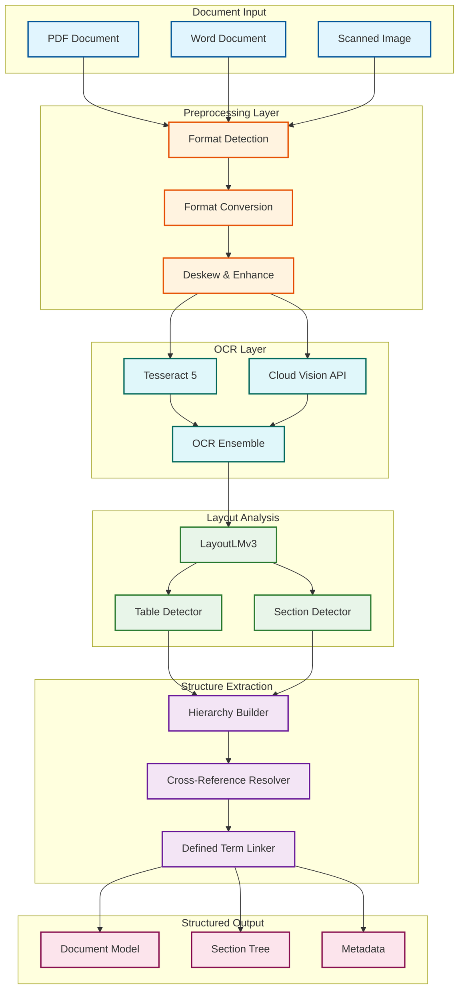
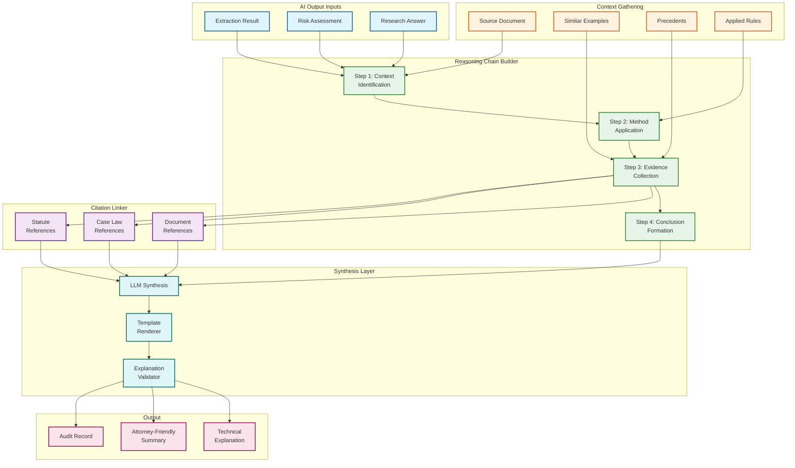
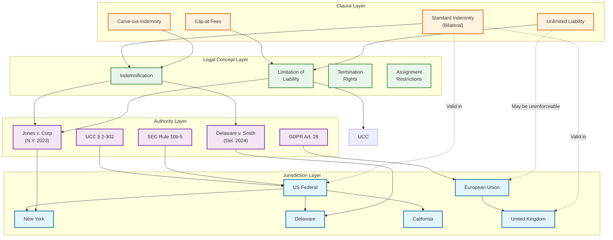
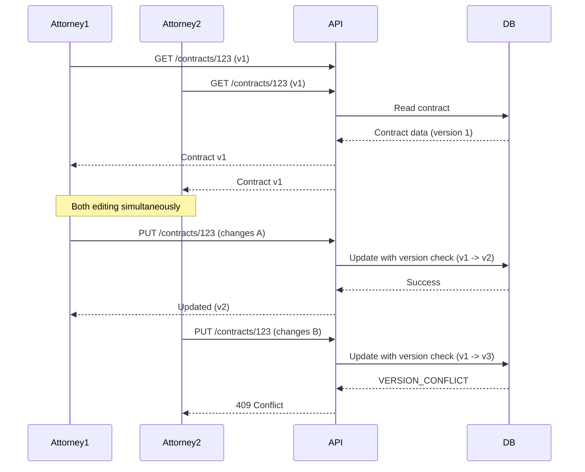
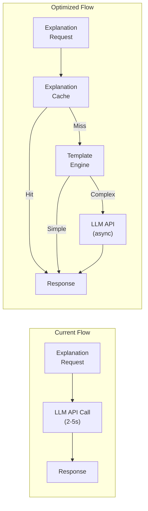

# Deep Dive and Bottlenecks

## Table of Contents
- [Critical Component #1: Legal Document Understanding Engine](#critical-component-1-legal-document-understanding-engine)
- [Critical Component #2: Explainability Engine](#critical-component-2-explainability-engine)
- [Critical Component #3: Multi-Jurisdictional Knowledge Graph](#critical-component-3-multi-jurisdictional-knowledge-graph)
- [Concurrency and Race Conditions](#concurrency-and-race-conditions)
- [Bottleneck Analysis](#bottleneck-analysis)
- [Performance Optimization Strategies](#performance-optimization-strategies)

---

## Critical Component #1: Legal Document Understanding Engine

### Why This Is Critical

Legal documents have unique structural complexity that general-purpose document processors cannot handle:

1. **Dense, Multi-level Formatting**: Legal contracts often contain numbered sections, subsections, exhibits, schedules, and annexes with complex hierarchies
2. **Cross-references**: Clauses frequently reference other sections ("as defined in Section 2.1(a)(iii)")
3. **Defined Terms**: Terms like "the Company" or "Effective Date" have specific meanings defined elsewhere
4. **Multi-column Layouts**: Signature pages, comparison tables, and older scanned documents
5. **Handwritten Annotations**: Initials, signatures, and margin notes

### Internal Architecture



### How It Works Internally

#### 1. OCR Ensemble Strategy

```
ALGORITHM OCREnsemble(document_images):
    """
    Multi-engine OCR with confidence-based selection.
    """

    results = []

    FOR page IN document_images:
        // Run multiple OCR engines in parallel
        tesseract_result = tesseract_ocr(page, config="legal")
        cloud_result = cloud_vision_ocr(page)

        // Character-level confidence comparison
        merged_text = ""
        FOR position IN range(max_length):
            tess_char = tesseract_result.char_at(position)
            cloud_char = cloud_result.char_at(position)

            IF tess_char.confidence > 0.95:
                merged_text += tess_char.char
            ELIF cloud_char.confidence > tess_char.confidence:
                merged_text += cloud_char.char
            ELSE:
                merged_text += tess_char.char
                flag_for_review(position)

        // Word-level validation
        FOR word IN extract_words(merged_text):
            IF NOT legal_dictionary.contains(word):
                IF spell_check_suggests(word):
                    apply_correction(word)
                ELSE:
                    flag_uncertain(word)

        results.append(merged_text)

    RETURN results
```

#### 2. Legal Section Detection

Legal documents follow predictable patterns that can be exploited:

```
SECTION_PATTERNS = {
    "ARTICLE": r"^ARTICLE\s+[IVXLCDM\d]+[.:]?\s*(.+)$",
    "SECTION": r"^Section\s+(\d+(?:\.\d+)*)[.:]?\s*(.+)$",
    "SUBSECTION": r"^\s*\(([a-z]|[ivx]+|\d+)\)\s*(.+)$",
    "EXHIBIT": r"^EXHIBIT\s+([A-Z\d]+)[.:]?\s*(.+)?$",
    "SCHEDULE": r"^SCHEDULE\s+([A-Z\d]+)[.:]?\s*(.+)?$",
    "RECITAL": r"^WHEREAS[,:]?\s*(.+)$",
    "DEFINITION": r"^"([^"]+)"\s+(?:means|shall mean|has the meaning)\s*(.+)$"
}

ALGORITHM DetectSections(text, layout_features):
    """
    Combine text patterns with visual layout cues.
    """

    sections = []
    current_hierarchy = []

    FOR line, features IN zip(text_lines, layout_features):
        // Check visual cues first
        is_header = (
            features.font_size > baseline_font_size * 1.1 OR
            features.is_bold OR
            features.has_underline OR
            features.all_caps
        )

        // Match against patterns
        FOR pattern_type, regex IN SECTION_PATTERNS.items():
            match = regex.match(line)
            IF match:
                section = Section(
                    type = pattern_type,
                    number = match.group(1) IF match.groups() ELSE None,
                    title = match.group(2) IF len(match.groups()) > 1 ELSE line,
                    start_position = line.position,
                    visual_confidence = 0.9 IF is_header ELSE 0.7,
                    depth = infer_depth(pattern_type, current_hierarchy)
                )

                // Update hierarchy
                WHILE current_hierarchy AND current_hierarchy[-1].depth >= section.depth:
                    current_hierarchy.pop()
                section.parent = current_hierarchy[-1] IF current_hierarchy ELSE None
                current_hierarchy.append(section)

                sections.append(section)
                BREAK

    RETURN build_section_tree(sections)
```

#### 3. Cross-Reference Resolution

```
ALGORITHM ResolveCrossReferences(document_model):
    """
    Link cross-references to their target sections/definitions.
    """

    // Build reference index
    reference_index = {}
    FOR section IN document_model.all_sections:
        reference_index[section.full_number] = section
        reference_index[section.title.lower()] = section

    FOR definition IN document_model.definitions:
        reference_index[definition.term.lower()] = definition

    // Find and resolve references
    reference_pattern = r"(?:Section|Article|Exhibit|Schedule)\s+([\d.]+(?:\([a-z]\))?)"
    defined_term_pattern = r""([^"]+)"|(?<!\w)([A-Z][a-z]+(?:\s+[A-Z][a-z]+)*)"

    FOR section IN document_model.all_sections:
        // Section references
        FOR match IN regex.findall(reference_pattern, section.text):
            target = reference_index.get(match)
            IF target:
                section.add_reference(Reference(
                    type = "SECTION",
                    text = match,
                    target = target,
                    position = match.span()
                ))
            ELSE:
                section.add_unresolved_reference(match)

        // Defined term references
        FOR match IN regex.findall(defined_term_pattern, section.text):
            term = match.lower()
            IF term IN reference_index:
                section.add_reference(Reference(
                    type = "DEFINED_TERM",
                    text = match,
                    target = reference_index[term],
                    position = match.span()
                ))

    RETURN document_model
```

### Failure Modes and Handling

| Failure Mode | Cause | Detection | Mitigation |
|--------------|-------|-----------|------------|
| **OCR Garbage** | Poor scan quality | Confidence < 0.7 | Re-OCR with enhancement, HITL |
| **Section Detection Failure** | Non-standard formatting | Pattern match rate < 50% | Fall back to visual-only detection |
| **Missing Cross-reference Target** | Incomplete document | Unresolved reference count > 0 | Flag for review, best-effort linking |
| **Table Extraction Error** | Complex nested tables | Cell merge detection failure | Manual table annotation UI |
| **Defined Term Ambiguity** | Same term defined differently | Multiple definitions found | Use most recent definition, flag |

---

## Critical Component #2: Explainability Engine

### Why This Is Critical

In legal AI, explainability is not a nice-to-have—it's a professional responsibility requirement:

1. **Attorney Competence**: ABA Model Rule 1.1 requires attorneys to understand the tools they use
2. **Court Defensibility**: AI-generated analysis may be challenged; attorneys need to explain the reasoning
3. **Malpractice Protection**: Clear audit trails protect against malpractice claims
4. **Client Communication**: Attorneys must explain AI findings to clients in plain language
5. **Trust Building**: Attorneys will only adopt AI if they understand and trust its reasoning

### Architecture



### Explanation Templates by Output Type

#### Clause Extraction Explanation

```
Template: CLAUSE_EXTRACTION

Technical Format:
"Clause identified as {clause_type} with confidence {confidence:.0%}.

Reasoning:
1. Pattern Match: {pattern_details}
2. Semantic Similarity: {similarity_score:.0%} match to known {clause_type} clauses
3. Contextual Validation: Located in {section_path}, consistent with typical placement

Supporting Evidence:
- Similar clause in [Reference Contract A]: "{similar_clause_snippet}"
- Playbook standard language: "{playbook_snippet}"

Citation: Document page {page}, paragraphs {start_para}-{end_para}"

Attorney-Friendly Format:
"This paragraph appears to be a {clause_type_readable} clause.

We identified it because:
• It contains typical language for this type of clause
• It's located where these clauses normally appear
• It closely matches {similar_count} similar clauses we've seen

Our confidence is {confidence_level} ({confidence:.0%}).

See: {document_reference}"
```

#### Risk Detection Explanation

```
Template: RISK_DETECTION

Technical Format:
"Risk detected: {risk_category} - Severity {severity}/10

Analysis:
1. Deviation Analysis: Clause deviates from playbook standard by {deviation_percent:.0%}
   - Missing element: {missing_element}
   - Non-standard language: "{non_standard_phrase}"

2. Market Comparison: Below {percentile}th percentile for {contract_type} agreements
   - Industry standard: "{industry_standard}"
   - This contract: "{actual_language}"

3. Precedent Review: Similar clauses have led to disputes in:
   - {case_citation_1}: {case_outcome_1}
   - {case_citation_2}: {case_outcome_2}

Recommendation: {recommendation}"

Attorney-Friendly Format:
"We flagged this clause as {severity_level} risk.

Here's why:
• The language differs significantly from your standard terms
• This is below market standard for similar agreements
• Courts have sometimes ruled against parties with similar language

Specifically, the concern is: {plain_language_concern}

We suggest: {recommendation_plain}

Relevant cases: {case_references}"
```

### Explanation Validation

```
ALGORITHM ValidateExplanation(explanation):
    """
    Ensure explanation meets quality and accuracy standards.
    """

    validation_result = ValidationResult()

    // Check completeness
    required_elements = ["context", "method", "evidence", "conclusion"]
    FOR element IN required_elements:
        IF NOT explanation.has_element(element):
            validation_result.add_error(f"Missing {element}")

    // Check citation validity
    FOR citation IN explanation.citations:
        IF citation.type == "DOCUMENT":
            IF NOT verify_document_reference(citation):
                validation_result.add_error(f"Invalid document reference: {citation}")
        ELIF citation.type == "CASE_LAW":
            IF NOT verify_case_citation(citation):
                validation_result.add_warning(f"Unverified case: {citation}")
        ELIF citation.type == "STATUTE":
            IF NOT verify_statute_citation(citation):
                validation_result.add_warning(f"Unverified statute: {citation}")

    // Check confidence calibration
    IF explanation.stated_confidence > 0.9:
        // High confidence claims need strong evidence
        IF len(explanation.citations) < 2:
            validation_result.add_warning("High confidence with limited citations")
        IF explanation.method == "LLM_ONLY":
            validation_result.downgrade_confidence(0.1)

    // Check for hallucination indicators
    hallucination_check = check_for_hallucinations(explanation)
    IF hallucination_check.detected:
        validation_result.add_error(f"Potential hallucination: {hallucination_check.details}")

    // Plain language check
    IF explanation.attorney_summary:
        readability = compute_readability(explanation.attorney_summary)
        IF readability.grade_level > 12:
            validation_result.add_warning("Summary may be too complex for general audience")

    RETURN validation_result


FUNCTION check_for_hallucinations(explanation):
    """
    Detect potential LLM hallucinations in explanations.
    """

    indicators = []

    // Check if cited cases exist
    FOR case_citation IN explanation.case_citations:
        IF NOT case_database.exists(case_citation):
            indicators.append(f"Case not found: {case_citation}")

    // Check if quoted text exists in source
    FOR quote IN explanation.quotes:
        IF quote.source_type == "DOCUMENT":
            IF NOT source_document.contains_exact(quote.text):
                IF source_document.contains_fuzzy(quote.text, threshold=0.9):
                    indicators.append(f"Quote slightly modified: {quote.text[:50]}...")
                ELSE:
                    indicators.append(f"Quote not found: {quote.text[:50]}...")

    // Check for impossible dates
    FOR date_claim IN explanation.date_claims:
        IF date_claim.date > today():
            indicators.append(f"Future date claimed: {date_claim}")
        IF date_claim.date < reasonable_legal_history_start():
            indicators.append(f"Implausibly old date: {date_claim}")

    RETURN HallucinationCheck(
        detected = len(indicators) > 0,
        details = indicators
    )
```

### Failure Modes and Handling

| Failure Mode | Cause | Detection | Mitigation |
|--------------|-------|-----------|------------|
| **Citation Not Found** | Hallucinated case | Database lookup fails | Flag, remove citation, reduce confidence |
| **Circular Reasoning** | LLM reasoning loops | Step analysis | Break chain, regenerate |
| **Over-confident Explanation** | Model miscalibration | Confidence vs. evidence mismatch | Apply calibration factor |
| **Jargon-heavy Summary** | Template failure | Readability score | Regenerate with simpler prompt |
| **Missing Key Evidence** | Retrieval failure | Evidence count check | Expand search, flag incomplete |

---

## Critical Component #3: Multi-Jurisdictional Knowledge Graph

### Why This Is Critical

Legal AI must reason across jurisdictions because:

1. **Conflicts of Law**: Contracts often involve parties in different jurisdictions
2. **Governing Law Clauses**: May specify one jurisdiction but parties operate in another
3. **Regulatory Overlap**: Multiple regulators may have authority (SEC, state AGs, EU)
4. **Precedent Applicability**: Which courts' decisions are persuasive?
5. **Terminology Differences**: Same term, different meanings across jurisdictions

### Graph Architecture



### Graph Schema (Neo4j Cypher)

```cypher
// Jurisdiction hierarchy
CREATE (us_fed:Jurisdiction {
    code: "US-FED",
    name: "United States Federal",
    level: "FEDERAL",
    parent: NULL
})

CREATE (us_ny:Jurisdiction {
    code: "US-NY",
    name: "New York",
    level: "STATE",
    parent: "US-FED",
    court_system: ["SDNY", "EDNY", "NY-SUP", "NY-APP"]
})

// Relationship: Jurisdiction hierarchy
CREATE (us_ny)-[:PART_OF]->(us_fed)

// Legal concept with jurisdiction-specific meanings
CREATE (indemnity:LegalConcept {
    name: "Indemnification",
    category: "LIABILITY",
    description: "Obligation to compensate for losses"
})

CREATE (indemnity_ny:ConceptInterpretation {
    jurisdiction: "US-NY",
    interpretation: "Broadly enforced, includes defense costs by default",
    key_cases: ["Hooper v. AGS", "In re Bridgestone"],
    last_updated: date("2025-06-15")
})

CREATE (indemnity_uk:ConceptInterpretation {
    jurisdiction: "UK",
    interpretation: "Narrowly construed, excludes attorney fees unless explicit",
    key_cases: ["Caledonia v. Orbit"],
    last_updated: date("2025-03-20")
})

CREATE (indemnity)-[:INTERPRETED_IN]->(indemnity_ny)
CREATE (indemnity)-[:INTERPRETED_IN]->(indemnity_uk)

// Case law with citation network
CREATE (case1:CaseLaw {
    citation: "Del. Ch. 2024 WL 123456",
    name: "Smith v. Acme Corp.",
    court: "Delaware Chancery Court",
    date: date("2024-11-15"),
    holding: "Indemnification provisions must be construed to give effect to parties' intent",
    outcome: "PLAINTIFF_WINS"
})

CREATE (case1)-[:JURISDICTION]->(us_de)
CREATE (case1)-[:INTERPRETS]->(indemnity)
CREATE (case1)-[:CITES]->(:CaseLaw {citation: "Citrin v. Amdocs"})
CREATE (case1)-[:DISTINGUISHES]->(:CaseLaw {citation: "Ryan v. Lyondell"})

// Clause templates with jurisdiction applicability
CREATE (clause_template:ClauseTemplate {
    id: "INDEM-BILATERAL-001",
    name: "Standard Bilateral Indemnification",
    category: "INDEMNIFICATION",
    text: "Each party shall indemnify and hold harmless the other party...",
    risk_level: "LOW"
})

CREATE (clause_template)-[:VALID_IN {status: "ENFORCEABLE", notes: "Standard provision"}]->(us_fed)
CREATE (clause_template)-[:VALID_IN {status: "ENFORCEABLE", notes: "Standard provision"}]->(uk)
CREATE (clause_template)-[:VALID_IN {status: "RESTRICTED", notes: "May conflict with consumer protection"}]->(eu)
```

### Cross-Jurisdictional Query Patterns

```
ALGORITHM ResolveJurisdictionalConflict(clause, governing_law, party_jurisdictions):
    """
    Analyze clause enforceability across relevant jurisdictions.
    """

    analysis = JurisdictionAnalysis()

    // Identify all relevant jurisdictions
    relevant_jurisdictions = set([governing_law])
    relevant_jurisdictions.update(party_jurisdictions)

    // Check for mandatory rules that override choice of law
    FOR jurisdiction IN party_jurisdictions:
        mandatory_rules = query_graph("""
            MATCH (r:MandatoryRule)-[:APPLIES_IN]->(j:Jurisdiction {code: $jurisdiction})
            WHERE r.category = $clause_category
            RETURN r
        """, jurisdiction=jurisdiction, clause_category=clause.type)

        FOR rule IN mandatory_rules:
            IF applies_regardless_of_choice(rule, clause):
                analysis.add_mandatory_override(jurisdiction, rule)

    // Analyze enforceability in governing law jurisdiction
    enforceability = query_graph("""
        MATCH (ct:ClauseTemplate)-[v:VALID_IN]->(j:Jurisdiction {code: $governing_law})
        WHERE ct.category = $category
        RETURN v.status, v.notes, v.key_cases
    """, governing_law=governing_law, category=clause.type)

    analysis.governing_law_status = enforceability

    // Find relevant precedents
    precedents = query_graph("""
        MATCH (c:CaseLaw)-[:INTERPRETS]->(concept:LegalConcept {name: $concept_name})
        WHERE c.date > date() - duration('P5Y')
        AND (c)-[:JURISDICTION]->(:Jurisdiction {code: $governing_law})
        RETURN c
        ORDER BY c.date DESC
        LIMIT 5
    """, concept_name=clause.legal_concept, governing_law=governing_law)

    analysis.precedents = precedents

    // Check for jurisdiction-specific interpretation differences
    interpretations = query_graph("""
        MATCH (concept:LegalConcept {name: $concept_name})-[:INTERPRETED_IN]->(interp:ConceptInterpretation)
        WHERE interp.jurisdiction IN $jurisdictions
        RETURN interp
    """, concept_name=clause.legal_concept, jurisdictions=list(relevant_jurisdictions))

    IF has_conflicting_interpretations(interpretations):
        analysis.add_conflict(
            type = "INTERPRETATION_CONFLICT",
            details = summarize_conflicts(interpretations),
            recommendation = "Consider explicit definition to avoid ambiguity"
        )

    RETURN analysis
```

### Failure Modes and Handling

| Failure Mode | Cause | Detection | Mitigation |
|--------------|-------|-----------|------------|
| **Stale Precedent** | Case overruled | Citation chain check | Mark as overruled, find current authority |
| **Missing Jurisdiction Data** | New jurisdiction | Query returns empty | Flag, use nearest parent jurisdiction |
| **Conflicting Interpretations** | Genuine legal ambiguity | Multiple conflicting nodes | Surface conflict to user, don't auto-resolve |
| **Circular Citation** | Data entry error | Cycle detection | Break cycle, flag for review |
| **Outdated Statute** | Legislative change | Effective date check | Mark superseded, link to current version |

---

## Concurrency and Race Conditions

### Race Condition #1: Concurrent Contract Updates

**Scenario**: Two attorneys edit the same contract simultaneously.



**Solution**: Optimistic Locking with Merge UI

```
ALGORITHM HandleContractUpdate(contract_id, changes, expected_version):
    BEGIN TRANSACTION

    current = SELECT * FROM contracts WHERE id = contract_id FOR UPDATE

    IF current.version != expected_version:
        // Conflict detected
        ROLLBACK

        // Return diff for manual resolution
        RETURN ConflictResponse(
            current_version = current,
            your_changes = changes,
            diff = compute_diff(expected_version, current.version),
            resolution_options = [
                "OVERWRITE",  // Replace with your changes
                "MERGE",      // Attempt auto-merge
                "DISCARD"     // Keep current, discard your changes
            ]
        )

    // No conflict, apply changes
    UPDATE contracts SET
        content = apply_changes(current.content, changes),
        version = current.version + 1,
        updated_at = now()
    WHERE id = contract_id

    COMMIT
    RETURN SuccessResponse(new_version = current.version + 1)
```

### Race Condition #2: Due Diligence Parallel Processing

**Scenario**: Multiple workers process documents in same project, final aggregation conflicts.

```
ALGORITHM SafeAggregation(project_id, worker_results):
    """
    Use distributed locking for aggregation phase.
    """

    lock_key = f"dd_project:{project_id}:aggregation"

    // Acquire distributed lock
    lock = acquire_lock(lock_key, timeout=30s, retry=3)
    IF NOT lock.acquired:
        // Another worker is aggregating
        RETURN DeferredResult(retry_after=5s)

    TRY:
        // Read current state
        project = load_project(project_id)

        // Merge results idempotently
        FOR result IN worker_results:
            IF result.document_id NOT IN project.processed_documents:
                project.findings.merge(result.findings)
                project.processed_documents.add(result.document_id)

        // Save state
        save_project(project)

        // Check if all documents processed
        IF project.processed_count == project.total_count:
            trigger_report_generation(project_id)

    FINALLY:
        release_lock(lock)
```

### Race Condition #3: Playbook Version Updates

**Scenario**: Playbook updated while contracts are being analyzed against it.

**Solution**: Snapshot playbook version at analysis start

```
ALGORITHM AnalyzeWithPlaybookSnapshot(contract, playbook_id):
    // Capture playbook state at start
    playbook_snapshot = create_snapshot(playbook_id)

    // Store snapshot reference with contract
    contract.analysis_context = {
        "playbook_id": playbook_id,
        "playbook_version": playbook_snapshot.version,
        "snapshot_id": playbook_snapshot.id,
        "analysis_started": now()
    }

    // Perform analysis using snapshot (immutable)
    analysis_result = perform_analysis(contract, playbook_snapshot)

    // Store result with version reference
    analysis_result.playbook_context = contract.analysis_context

    RETURN analysis_result
```

---

## Bottleneck Analysis

### Identified Bottlenecks

| Rank | Bottleneck | Impact | Current State | Target State |
|------|------------|--------|---------------|--------------|
| 1 | **LLM API Latency** | 2-5s per explanation | Blocks real-time UX | < 500ms cached |
| 2 | **OCR Processing** | 2-3s per page | Sequential processing | Parallel, batched |
| 3 | **Knowledge Graph Queries** | 200-500ms for multi-hop | Cold cache | < 50ms hot cache |
| 4 | **Vector Search at Scale** | Linear degradation | 100ms at 1M vectors | < 50ms at 10M |
| 5 | **Document Storage I/O** | Disk-bound retrieval | 500ms large docs | < 100ms with CDN |

### Bottleneck #1: LLM API Latency



**Mitigation Strategy**:

1. **Pre-computation**: Generate explanations during async processing
2. **Template-based**: Use templates for common clause types (80% of cases)
3. **Caching**: Cache explanations by clause hash + context hash
4. **Streaming**: Stream explanation generation for UX improvement

### Bottleneck #2: OCR Processing

**Current**: 2-3s per page, sequential

**Mitigation**:

```
ALGORITHM ParallelOCR(document):
    // Split into page images
    pages = split_to_pages(document)

    // Process in parallel with GPU workers
    worker_pool = GPUWorkerPool(size=4)

    futures = []
    FOR page IN pages:
        future = worker_pool.submit(ocr_page, page)
        futures.append(future)

    // Collect results maintaining order
    results = []
    FOR i, future IN enumerate(futures):
        result = future.get(timeout=30s)
        result.page_number = i
        results.append(result)

    // Merge with page boundary preservation
    RETURN merge_ocr_results(results)
```

**Expected Improvement**: 4x throughput with 4 GPU workers

### Bottleneck #3: Knowledge Graph Queries

**Mitigation**: Multi-level caching

```
ALGORITHM CachedGraphQuery(query, params):
    // L1: In-memory query result cache (1 minute TTL)
    cache_key = hash(query, params)
    IF l1_cache.has(cache_key):
        RETURN l1_cache.get(cache_key)

    // L2: Redis query cache (10 minute TTL)
    IF redis.exists(cache_key):
        result = redis.get(cache_key)
        l1_cache.set(cache_key, result)
        RETURN result

    // L3: Materialized view for common patterns
    IF is_common_pattern(query):
        result = read_materialized_view(query, params)
    ELSE:
        result = execute_graph_query(query, params)

    // Populate caches
    redis.set(cache_key, result, ttl=600)
    l1_cache.set(cache_key, result)

    RETURN result
```

---

## Performance Optimization Strategies

### 1. Clause Pattern Caching

80% of clauses are variations of common patterns. Cache at multiple levels:

```
ALGORITHM ClausePatternCache(clause_text):
    // Normalize for matching
    normalized = normalize_clause(clause_text)
    pattern_hash = semantic_hash(normalized)

    // Check pattern cache
    IF pattern_cache.has(pattern_hash):
        cached = pattern_cache.get(pattern_hash)
        // Adapt cached result to this specific clause
        RETURN adapt_cached_result(cached, clause_text)

    // Full extraction
    result = extract_clause_full(clause_text)

    // Cache if confidence is high
    IF result.confidence > 0.9:
        pattern_cache.set(pattern_hash, result.template, ttl=24h)

    RETURN result
```

### 2. Speculative Execution

Pre-compute likely needed results:

```
ALGORITHM SpeculativeContractAnalysis(contract):
    // Start mandatory processing
    mandatory_future = async(extract_clauses, contract)

    // Speculate on likely next steps
    IF user.recent_actions.includes("due_diligence"):
        speculative_dd = async(prepare_dd_analysis, contract)

    IF user.recent_playbooks:
        likely_playbook = predict_playbook(contract.type, user.recent_playbooks)
        speculative_comparison = async(compare_to_playbook, contract, likely_playbook)

    // Wait for mandatory
    clauses = await mandatory_future

    // Return with speculative results ready
    RETURN AnalysisResult(
        clauses = clauses,
        precomputed = {
            "dd_analysis": speculative_dd IF speculative_dd.done ELSE None,
            "playbook_comparison": speculative_comparison IF speculative_comparison.done ELSE None
        }
    )
```

### 3. Incremental Processing

For document updates, only reprocess changed sections:

```
ALGORITHM IncrementalAnalysis(contract, changes):
    // Identify changed sections
    changed_sections = diff_sections(contract.previous_version, contract.current_version)

    // Determine analysis scope
    affected_clauses = []
    FOR section IN changed_sections:
        // Direct changes
        affected_clauses.extend(clauses_in_section(section))

        // Clauses that reference changed sections
        referencing = find_referencing_clauses(section)
        affected_clauses.extend(referencing)

    // Re-analyze only affected clauses
    new_results = analyze_clauses(affected_clauses)

    // Merge with cached results for unchanged clauses
    all_results = merge_analysis_results(
        cached = contract.cached_analysis,
        new = new_results,
        invalidated = affected_clauses
    )

    RETURN all_results
```

### 4. Query Optimization for Common Patterns

Pre-optimize frequently used query patterns:

| Query Pattern | Frequency | Optimization |
|---------------|-----------|--------------|
| "All clauses of type X in contract Y" | Very High | Composite index + materialized view |
| "Risks above severity N" | High | Partial index on risk_score > 5 |
| "Contracts expiring in next 90 days" | High | Scheduled materialized view |
| "Similar clauses to X" | Medium | Pre-computed embeddings + ANN index |
| "Compliance issues for jurisdiction J" | Medium | Jurisdiction-sharded tables |
